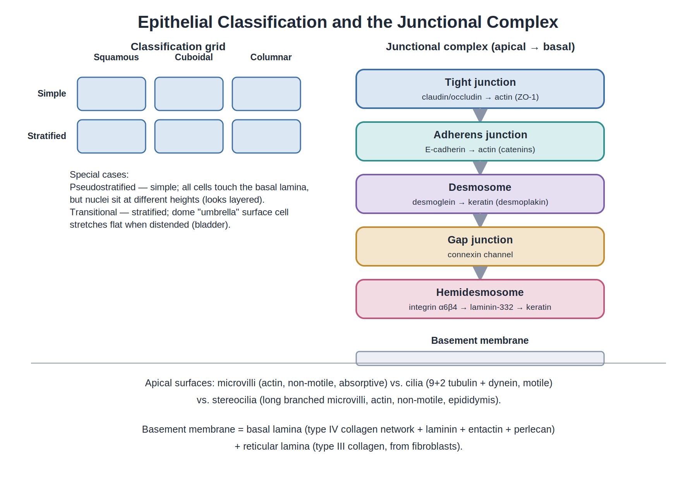
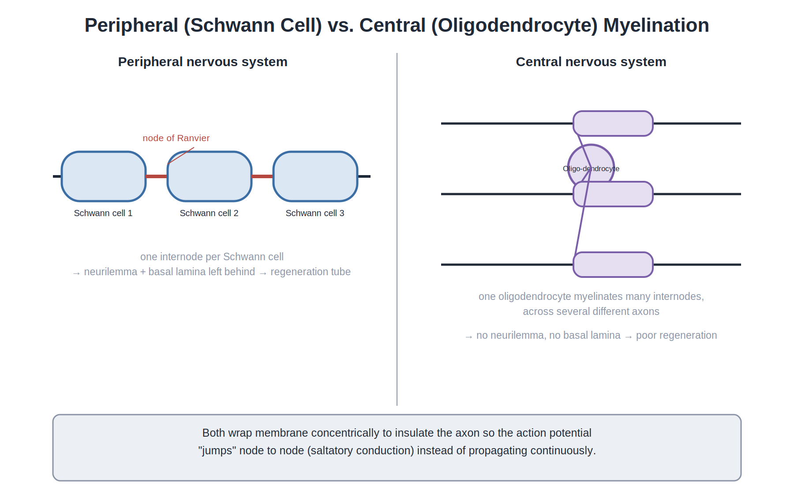
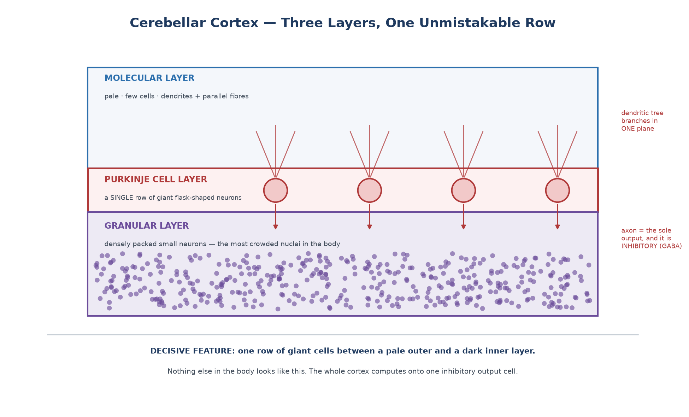
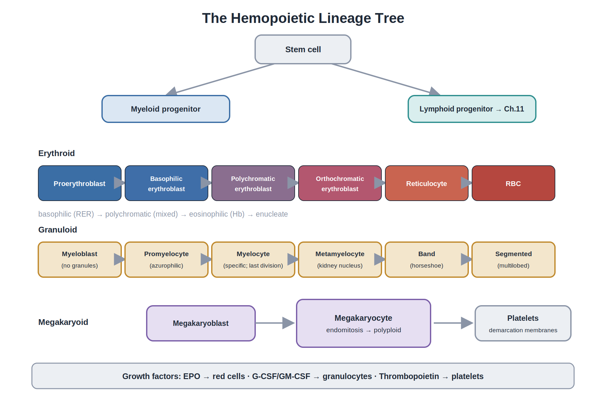
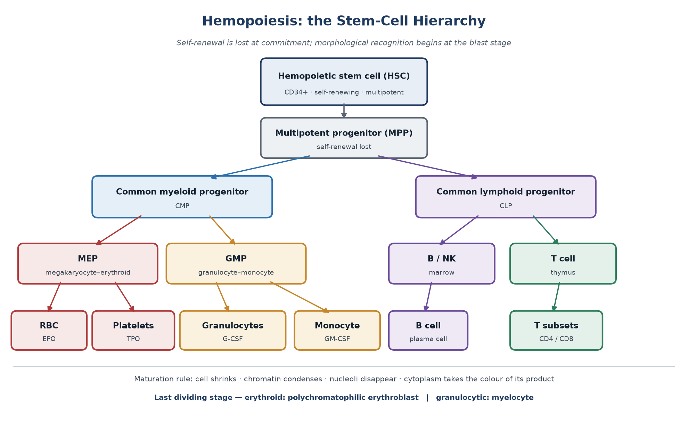
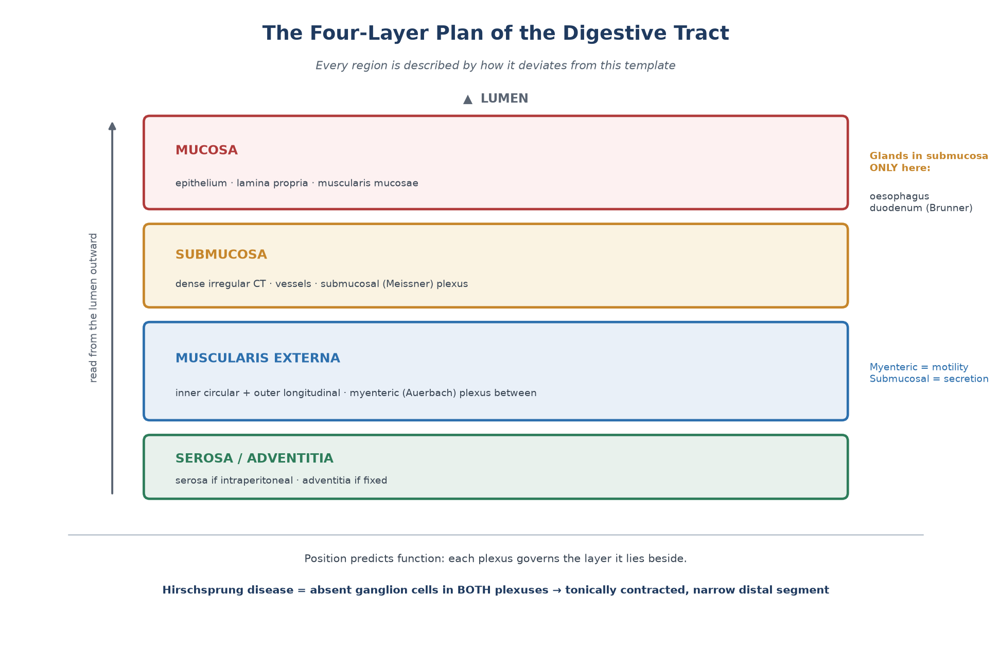
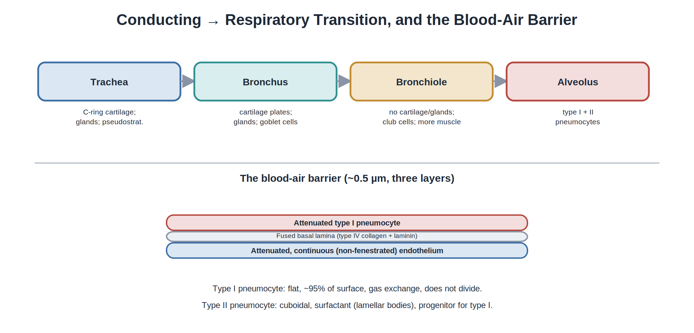
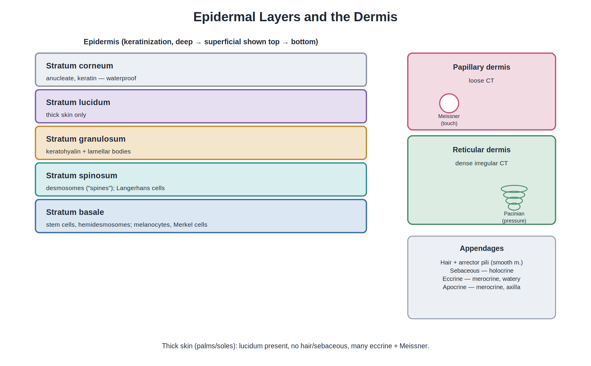

# Essential Histology

## A Concept-Based Guide for PGME

### Understanding the structure. Seeing the pattern. Distinguishing the alternatives. Retrieving the logic.

**Definitive Edition**

**AREMS-HY Academic Series**

*Built around Junqueira's Basic Histology: Text and Atlas, 17th Edition*

---

## Reference Statement

This textbook is an educational synthesis aligned primarily with the 16-chapter examination scope defined for the 1405 Medical Specialty Examination. It is built around Junqueira's Basic Histology, 17th Edition (Mescher AL, McGraw Hill) as the primary scientific foundation, but it is an independent teaching text, not a reproduction. It is intended for educational use; clinical decisions should always be based on appropriate clinical references and professional guidance.

## How to Use This Book

The book is organised to mirror how a capable learner reasons about a tissue, an organ, or a cell — not as a list of facts to memorize. Every major concept moves through a single learning chain that recurs throughout the text:

> **appearance → structure → composition → mechanism → function → recognition → distinction → clinical meaning → examination application.**

To use the book well, treat every chapter as a small intellectual journey. The opening question and *Why This Matters* anchor the curiosity; *Big Picture* and *Core Concept* provide the map; *Build the Concept* and *Structure* develop the system from foundation up; *Structure → Function* makes the causal connection explicit; *Classification* organises the variations; *Compare & Distinguish* answers the inevitable "how do I know which one?"; *Recognition Logic* prepares you to read a slide; *Clinical Correlation* shows why the structure matters; *Common Misconceptions* protects you from the errors the literature repeatedly makes; *High-Yield Knowledge* separates the must-know from the could-know; *Integrated Summary* compresses the chapter into one paragraph; *Mastery Check* verifies retrieval without the text; *Transition* connects to the next chapter; *Rapid Review* is the last-mile compression before the exam.

For long-term retention, close the book after each section and reconstruct the chain in your own words. The brain remembers what it reconstructs. Re-exposure without reconstruction produces familiarity without memory.

The central habit of this book is causal reasoning. Every structure exists because a problem demanded it. Every distinction matters because a confused examiner or a confused pathologist depends on it. Every clinical correlation is a chance to see histology at work.

A note on Junqueira mapping. Each chapter heading carries the *Junqueira's Basic Histology, 17th Edition* chapter number it primarily corresponds to. The mapping is one-to-one in scope but not one-to-one in emphasis: this book teaches the same territory but reorganises the order in which ideas are introduced when doing so makes the chain of reasoning clearer. The chapter ordering of this book follows the 16 chapters of the official syllabus exactly.

## Official Syllabus

This book is built around the official 16-chapter examination scope. The mapping is exact:

| Book chapter | Title | Junqueira 17th |
|---|---|---|
| 1 | Histology and Its Methods of Study | Ch. 1 |
| 2 | The Cytoplasm | Ch. 2 |
| 3 | The Nucleus | Ch. 3 |
| 4 | Epithelial Tissue | Ch. 4 |
| 5 | Connective Tissue | Ch. 5 |
| 6 | Adipose Tissue | Ch. 6 |
| 7 | Nerve Tissue and the Nervous System | Ch. 9 |
| 8 | The Circulatory System | Ch. 11 |
| 9 | Blood | Ch. 12 |
| 10 | Hemopoiesis | Ch. 13 |
| 11 | The Immune System and Lymphoid Organs | Ch. 14 |
| 12 | The Digestive Tract | Ch. 15 |
| 13 | Organs Associated with the Digestive Tract | Ch. 16 |
| 14 | The Respiratory System | Ch. 17 |
| 15 | Skin | Ch. 18 |
| 16 | The Endocrine System | Ch. 20 |

Out-of-scope per official syllabus: Junqueira Ch 7 (Cartilage), Ch 8 (Bone), Ch 10 (Muscle Tissue), Ch 19 (Urinary System), Ch 21 (Male Reproductive), Ch 22 (Female Reproductive), Ch 23 (Eye and Ear). These are archived in the appendix for reference only.

## Contents

1. Chapter 1 — Histology and Its Methods of Study *(Junqueira Ch. 1)*
2. Chapter 2 — The Cytoplasm *(Junqueira Ch. 2)*
3. Chapter 3 — The Nucleus *(Junqueira Ch. 3)*
4. Chapter 4 — Epithelium *(Junqueira Ch. 4)*
5. Chapter 5 — Connective Tissue *(Junqueira Ch. 5)*
6. Chapter 6 — Adipose Tissue *(Junqueira Ch. 6)*
7. Chapter 7 — Nerve Tissue *(Junqueira Ch. 9)*
8. Chapter 8 — The Circulatory System *(Junqueira Ch. 11)*
9. Chapter 9 — Blood *(Junqueira Ch. 12)*
10. Chapter 10 — Hemopoiesis *(Junqueira Ch. 13)*
11. Chapter 11 — The Immune System and Lymphoid Organs *(Junqueira Ch. 14)*
12. Chapter 12 — The Digestive Tract *(Junqueira Ch. 15)*
13. Chapter 13 — Organs Associated with the Digestive Tract *(Junqueira Ch. 16)*
14. Chapter 14 — The Respiratory System *(Junqueira Ch. 17)*
15. Chapter 15 — Skin *(Junqueira Ch. 18)*
16. Chapter 16 — The Endocrine System *(Junqueira Ch. 20)*

---

# Chapter 1 — Histology and Its Methods of Study

*Corresponds to Junqueira's Basic Histology, 17th Edition, Chapter 1*

*Figure 1.1 — The logic of contrast. Each fixation and staining reaction is mapped to the molecular target it detects. Read this figure as a decision tool: the clinical question determines the target, and the target determines the stain.*

## Opening Question

How does a piece of fresh tissue — soft, transparent, and already beginning to digest itself — become a stained slide that can sit on a microscope stage for twenty years and still reveal a diagnosis?

## Why This Matters

Every biopsy is really a chemistry experiment, not a photograph. The fixative, the solvent, the dye, and the microscope each reveal one specific molecular or physical property of the tissue while concealing everything else. A 45-year-old man presents with fatigue and a swollen liver; on routine H&E the hepatocytes look pale and swollen, but the diagnosis differs entirely depending on whether the accumulating substance is lipid (Oil Red O on frozen section), glycogen (PAS with diastase control), iron (Prussian blue), or amyloid (Congo red under polarized light). Wrong stain, missed diagnosis. The pathologist's first decision — *which technique for which question* — is the most consequential act of histology.

## Learning Objectives

By the end of this chapter, you will be able to:

1. **Explain** why living tissue must be processed through a chain of physical and chemical steps before it can be examined.
2. **Distinguish** the role of each step in processing — fixation, dehydration, clearing, embedding, sectioning, staining — from the next.
3. **Predict** the artifact produced when a step is skipped, shortened, or substituted.
4. **Classify** stains by their chemical mechanism (charge attraction, oxidation–Schiff, metal reduction, lipid solubility, birefringence).
5. **Relate** each stain in the standard panel to its molecular target and to the clinical question it answers.
6. **Match** the correct microscopy modality to the type of contrast required (refractive index, fluorescence, electron scattering, surface topography).
7. **Distinguish** frozen section from paraffin section by what each preserves, what each sacrifices, and what each is used for.
8. **Interpret** an empty vacuole, a magenta band, a black network, or an apple-green glow as a specific molecular statement about the tissue.

## Big Picture

This chapter is the lens through which every other chapter must be read. The hierarchy:

- **Problem** — tissue is transparent, fragile, and self-destructing within minutes.
- **Solution chain** — fixation preserves → dehydration removes water → clearing makes the tissue paraffin-miscible → embedding gives it a rigid support → sectioning reduces it to a transparent slice → staining adds contrast → microscopy resolves the contrast.
- **Master principle** — every step exists because the next step requires it; every stain reveals one specific molecular property and nothing else.

The chapter proceeds: Build the Concept (the chain) → Structure (each step) → Function (each step solves one problem) → Structure → Function (why this chain works) → Classification (stains and microscopies by mechanism) → Compare & Distinguish → Recognition Logic → Clinical Correlation → Common Misconceptions → High-Yield → Integrated Summary → Mastery Check → Transition → Rapid Review.

## Core Concept

Tissue is transparent and fragile; histology is the controlled transformation of tissue into a slice thin enough to transmit light and stained brightly enough to see what matters. Each technique reveals primarily one property; the art of diagnosis is choosing the technique that answers the question.

## Build the Concept

Start with the problem. A cell removed from the body loses its oxygen supply within minutes. Mitochondria stop producing ATP; the sodium–potassium pump fails; the cytoplasm swells; lysosomal enzymes escape and digest the cell from within — a process called **autolysis**. Even before the student opens the textbook, the tissue has begun to change. The whole of histological technique is the controlled answer to this problem: preserve the structure closely enough to its living state that cells, matrix, boundaries, and relationships can still be interpreted, while making the tissue physically suitable for sectioning and providing contrast against an otherwise transparent background.

The chain that solves the problem has six logical links:

1. **Fixation** — chemically cross-link the proteins so that autolysis stops and the structure is locked in place.
2. **Dehydration** — remove the water, because paraffin (the embedding medium) is hydrophobic and cannot infiltrate a wet specimen.
3. **Clearing** — replace the dehydrating alcohol with a solvent that is miscible both with alcohol and with paraffin.
4. **Embedding** — infiltrate the tissue with molten paraffin and let it solidify into a block that can be cut.
5. **Sectioning** — cut the block on a microtome into slices roughly 5 µm thick.
6. **Staining** — apply dyes that bind specific molecular targets, creating contrast.

Each step exists because the next needs it. Skip the dehydration and the paraffin will not infiltrate. Skip the clearing and the paraffin will not mix with the alcohol. Skip the embedding and the tissue will collapse under the microtome blade. Skip the staining and the section will be invisible.

## Structure — the Six Steps in Detail

### 1. Fixation

Fixation is the chemical arrest of biological change. The most common fixative for routine light microscopy is **formalin** — a ~10% solution of formaldehyde in phosphate-buffered saline. Formaldehyde reacts with primary amine groups on proteins to form methylene bridges that cross-link adjacent proteins into an insoluble network. The cross-linking preserves cellular architecture, blocks autolysis, inactivates infectious agents, and makes the tissue firm enough to handle.

**Glutaraldehyde** is a stronger cross-linker used for electron microscopy, but it penetrates tissue slowly and is therefore often used as a secondary fixative after a primary aldehyde. **Osmium tetroxide** is used as a secondary fixative for EM; it reacts with unsaturated lipid bonds and stabilizes membranes, and because osmium is electron-dense it also contributes contrast in the electron beam.

A critical concept: **fixation is not neutral**. Formalin preserves morphology but destroys enzymatic activity and partially degrades nucleic acids. Glutaraldehyde preserves ultrastructure but makes immunolabelling harder. Osmium fixes lipid but dissolves into the lipid bilayer, which is exactly why the EM image shows membranes as black lines.

### 2. Dehydration

Water and paraffin are not miscible. The tissue must be passed through a graded series of ethanol (typically 70% → 80% → 95% → absolute) to remove the water. Each step concentrates the ethanol gradually so that the tissue does not shrink or distort from osmotic shock.

### 3. Clearing

Ethanol and paraffin are also not miscible. **Xylene** — a hydrocarbon solvent — is miscible with both. The tissue is passed through two or three changes of xylene to remove the ethanol and prepare the way for paraffin infiltration. Xylene is the *clearing agent*: it makes the tissue translucent because its refractive index is close to that of protein.

> **DO NOT CONFUSE.** Dehydration removes **water** (using ethanol). Clearing removes **ethanol** (using xylene). The student who reverses these terms has already lost the logic.

### 4. Embedding

The cleared tissue is placed in molten paraffin wax (typically ~60 °C) for several changes, then oriented in a mould and allowed to cool into a solid block. Paraffin gives the tissue a rigid support that can be cut on the microtome without distortion. Alternative embedding media include **resin** (for EM, thinner sections), **celloidin** (for large specimens), and **OCT compound** (for frozen sections, where water is not removed).

### 5. Sectioning

A microtome holds the paraffin block and advances it against a steel or glass blade in micrometre increments. Sections of **approximately 5 µm thickness** (range ~1–10 µm) are thin enough to be transparent when mounted on a glass slide. The section is floated on a water bath to flatten it, picked up on a slide, and dried.

### 6. Staining

The slide is now a thin, transparent, pale-yellow slice of tissue — essentially invisible. Staining adds contrast. The paraffin must first be removed (with xylene) and the tissue rehydrated (back through ethanol to water) before aqueous dyes can penetrate.

## Function — Why Each Step Solves the Problem It Solves

| Step | Problem it solves | Without it |
|---|---|---|
| Fixation | Tissue autolyses; structures collapse | Cells rupture; no diagnosis |
| Dehydration | Paraffin is hydrophobic; water blocks infiltration | Block will not cut |
| Clearing | Ethanol and paraffin are immiscible | Block will not infiltrate |
| Embedding | Tissue is too soft to section thinly | Sections tear or compress |
| Sectioning | Whole tissue is opaque and too thick | Microscope cannot focus through |
| Staining | Sections are nearly transparent | Structures are invisible |

## Structure → Function — Why This Chain Works

The chain works because each step transforms the tissue into the form the next step requires. The principle is sequential dependency: fixation prepares for dehydration, dehydration for clearing, clearing for embedding, embedding for sectioning, sectioning for staining, staining for microscopy. A break at any link breaks the chain. The diagnostic implication is equally important: if a step is poorly executed, the resulting artifact tells the student where to look. Shrinkage and vacuolation suggest poor fixation or rapid dehydration. Faded nuclei suggest a weak hematoxylin or an old solution. A black precipitate scattered through the section suggests oxidized hematoxylin or carbon from the microtome blade.

## Classification — Stains by Chemical Mechanism

The stain menu looks long but reduces to five underlying mechanisms:

**Mechanism 1 — Charge attraction.** Basic (cationic) dyes bind acidic tissue components. Hematoxylin is basic; it binds the negatively charged phosphate groups of DNA and RNA, staining the nucleus blue. Acidic (anionic) dyes bind basic tissue components. Eosin is acidic; it binds the positively charged amino groups of cytoplasmic proteins, staining the cytoplasm pink. This is the basis of the **H&E** stain and accounts for most of what you see in routine sections.

**Mechanism 2 — Oxidation followed by Schiff condensation.** Periodic acid oxidizes the 1,2-glycol groups of carbohydrates to aldehydes; the Schiff reagent then reacts with those aldehydes to produce a magenta colour. **PAS** (Periodic Acid–Schiff) highlights carbohydrates — glycogen, mucins, basement membranes, fungal cell walls. Diastase (alpha-amylase) digestion removes glycogen, so a PAS-positive, diastase-sensitive structure is glycogen; a PAS-positive, diastase-resistant structure is mucin or basement membrane.

> **EXAM PEARL.** PAS highlights carbohydrate-rich structures and is not a collagen-specific stain. Basement membranes are PAS-positive because of their carbohydrate-rich components (laminin, perlecan, entactin associated with the type IV collagen network), not because PAS stains collagen directly.

**Mechanism 3 — Metal reduction or substitution.** Silver methods reduce silver ions to metallic silver at specific chemical sites. **Reticulin stains** deposit silver on the carbohydrate sheath of type III collagen, producing a black network in lymphoid stroma and around vessels. **Von Kossa** does not stain calcium ions directly; silver nitrate substitutes for the phosphate and carbonate anions bound to calcium in mineralised deposits, and the silver is then reduced to metallic silver, producing a black colour. Von Kossa is therefore an *indirect indicator of mineralisation*, not a stain for calcium as such.

**Mechanism 4 — Lipid solubility.** **Oil Red O** and the **Sudan dyes** are lipophilic dyes that partition preferentially into neutral lipid. The crucial processing requirement is that the lipid must still be present in the tissue at the time of staining — which means *frozen section*, because routine paraffin processing uses ethanol and xylene, both of which dissolve lipid. On a frozen section stained with Oil Red O, lipid appears bright red-orange. On a routine paraffin section, the same adipocyte appears as an empty vacuole. The cell is not empty; the lipid was washed away.

**Mechanism 5 — Birefringence.** **Congo red** binds amyloid in a regular, oriented manner, and when the section is viewed under crossed polarising filters the oriented dye produces a characteristic *apple-green birefringence*. Collagen is also birefringent, but white, not green. The diagnosis of amyloid therefore requires the combination of Congo red staining *and* apple-green birefringence.

Other stains worth knowing:

- **Trichrome stains** (Masson, Mallory): collagen blue or green, muscle red, nuclei black. Used to assess fibrosis.
- **Orcein / Verhoeff-van Gieson**: elastic fibres brown-black. Used to assess vessel-wall integrity.
- **Prussian blue (Perls)**: ferric iron + potassium ferrocyanide → ferric ferrocyanide, blue. Used to demonstrate haemosiderin and to diagnose iron overload.
- **Alcian blue**: acidic mucins (sulfated and carboxylated GAGs) blue at pH 2.5; used in combination with PAS to distinguish neutral from acidic mucins.
- **Feulgen**: acid hydrolysis removes purine bases from DNA, exposing aldehyde groups on the deoxyribose that react with Schiff reagent. Used in flow cytometry for DNA ploidy analysis.
- **Alizarin red**: chelates calcium directly; the appropriate stain when calcium itself (not just mineralisation) is in question.

## Classification — Microscopy Modalities by Contrast Mechanism

The microscope is not a magnifier; it is a contrast generator. Each modality exploits a different physical property:

- **Bright-field light microscopy** — the routine. Resolution limited to ~0.2 µm by the wavelength of visible light; below this, electron microscopy is required.
- **Phase-contrast microscopy** — converts refractive-index differences in unstained, living cells into brightness differences. Used for live cells, tissue culture, sperm motility.
- **Differential interference contrast (DIC, Nomarski)** — similar principle, gives a pseudo-3-D shadowed image.
- **Dark-field microscopy** — only scattered light reaches the objective; bright objects on a black background. Used for spirochaetes (syphilis serology) and for the demonstration of certain crystals.
- **Fluorescence microscopy** — fluorochromes (FITC, rhodamine, DAPI, GFP) absorb light at one wavelength and emit at a longer wavelength; the tissue appears bright on a dark background. Used in immunofluorescence.
- **Confocal microscopy** — uses a pinhole to reject out-of-focus light, allowing optical sectioning of thick specimens.
- **Polarising microscopy** — uses crossed polarising filters; birefringent structures (amyloid under Congo red, foreign material, crystals) appear bright on a dark background.
- **Transmission electron microscopy (TEM)** — electrons pass through an ultrathin section (~70 nm); electron-dense structures (osmium-stained membranes, heavy-metal-stained nucleic acids) scatter electrons and appear dark. Resolution ~0.1 nm because the de Broglie wavelength of the electron is far shorter than visible light.
- **Scanning electron microscopy (SEM)** — electrons scan the surface; secondary electrons are collected to produce a 3-D image of surface topography. Resolution ~1–10 nm.
- **Freeze-fracture EM** — frozen tissue is cleaved along the plane of weakest adhesion (usually the lipid bilayer); the exposed faces (E-face, the outer leaflet seen from within; P-face, the inner leaflet seen from within) are coated with platinum and examined by TEM. Reveals integral membrane proteins as particles within the bilayer.

## Compare & Distinguish

### Frozen section vs paraffin section

| Feature | Frozen section | Paraffin section |
|---|---|---|
| Speed | Minutes | Days |
| Lipid preserved | Yes | No (dissolved by ethanol/xylene) |
| Morphology | Acceptable but inferior | Excellent |
| Special stains | Limited | All routine + special stains |
| Typical use | Intraoperative margin | Routine diagnosis |

### TEM vs SEM vs light microscopy

| Feature | TEM | SEM | Light |
|---|---|---|---|
| Resolution | ~0.1 nm | ~1–10 nm | ~0.2 µm |
| Sample type | Ultrathin section, internal | Surface, no sectioning | Section ~5 µm |
| Image | 2-D internal | 3-D surface | 2-D stained |

### H&E vs special stains

| Question | Stain | Why |
|---|---|---|
| General architecture | H&E | Nucleus blue, cytoplasm pink |
| Collagen in fibrosis | Trichrome | Collagen blue/green vs muscle red |
| Reticular stroma | Silver | Reticular fibres black |
| Elastic lamina | Orcein / Verhoeff | Elastic fibres brown-black |
| Lipid | Oil Red O on frozen | Lipid dissolved by paraffin processing |
| Amyloid | Congo red + polarised | Apple-green birefringence |
| Iron | Prussian blue | Ferric iron blue |
| Mineralisation | Von Kossa | Indirect via silver substitution |
| Glycogen | PAS ± diastase | Diastase-sensitive control |

## Recognition Logic — How to Read a Stain

> **Look for** the dominant colour. Blue means basic dye → acidic tissue component. Pink/red means acidic dye → basic tissue component. Black means metal deposition (silver or osmium). Empty means the molecule was dissolved.
>
> **Then confirm with** the expected location of that component. Blue should be in nuclei, ribosome-rich cytoplasm, or mucins; pink in cytoplasm and extracellular matrix; black in reticulin or mineral; empty in lipid vacuoles.
>
> **Do not confuse** *absence of colour* with *absence of structure*. An empty vacuole in a paraffin section of liver can be lipid (which was dissolved) or glycogen (which was dissolved) or even a fixation artefact.
>
> **The decisive feature is** the combination of colour + location + context. A blue dot inside a cell is not a nucleus if it sits in the cytoplasm; it is more likely a bacterium or a contaminating artefact.

## Deepening the Concept

### Reading a Slide: The Discipline of Systematic Observation

Most students lose marks not because they lack knowledge but because they look at a slide without a method. A trained observer always moves through the same four steps, and the order matters.

**Step 1 — Scanning power (2–4×): establish architecture.** Before naming a single cell, ask: is this a *sheet* (epithelium lining something), a *tube* (lumen surrounded by concentric layers), a *lobulated solid organ* (parenchyma divided by septa), or a *loose meshwork* (lymphoid or connective)? Is there a capsule? Are there landmark structures — follicles, villi, alveoli, cartilage plates?

**Step 2 — Low power (10×): find the organising principle.** Tubular organs are read from the lumen outward: mucosa → submucosa → muscularis → adventitia/serosa. Solid organs are read from the capsule inward: capsule → cortex → medulla. Identifying *which layer you are in* eliminates most wrong answers before you look at a cell.

**Step 3 — High power (40×): confirm with cells.** Only now do you name cell types. The cell confirms a diagnosis the architecture has already suggested; it should rarely be your first evidence.

**Step 4 — State the decisive feature.** Force yourself to say one sentence: "This is X because of Y." If you cannot name one decisive feature, you have not identified the tissue — you have guessed.

This sequence is the recognition engine of this book. Every Recognition Logic section that follows is this sequence compressed.

### Why Sections Lie: Plane of Section

A histological section is a 5 µm slice through a three-dimensional object. Everything you see is the *intersection* of a structure with the plane of the knife, and this single fact produces more examination errors than any other.

A tube cut transversely is a ring; cut obliquely, an ellipse; cut longitudinally, two parallel walls; cut tangentially through its wall, a solid mass with no lumen at all. A branching gland cut across its branches appears as several separate glands. A single convoluted duct, such as the epididymis, appears as dozens of independent profiles.

Three rules follow:

1. *Absence in one section does not prove absence in the organ.* A section of ileum may miss its Peyer's patches; that does not make it jejunum.
2. *Apparent islands may be continuous in three dimensions.* Isolated cartilage plates in a bronchial wall belong to one discontinuous skeleton; scattered nuclei within a skeletal muscle fibre belong to one enormous cell.
3. *Nuclei disappear when the plane misses them.* A cuboidal epithelium looks squamous if the section passes above or below the nuclei. This is the commonest cause of misclassified epithelium.

**Examination trap.** Apparent stratification in a duct: the test is whether *every* cell contacts the basement membrane. Nuclei at several levels with all cells reaching the base is *pseudostratified*, not stratified. Plane of section can hide nuclei but cannot remove basement-membrane contact.

### Quantitative Anchors Worth Memorising

| Reference | Size | Use |
|---|---|---|
| Erythrocyte | 7.5 µm | Universal internal ruler on any section with blood |
| Small lymphocyte | 6–9 µm | Nucleus ≈ one erythrocyte; scant cytoplasm |
| Paraffin section | 5 µm | Thinner than most cells — whole nuclei rarely in one plane |
| Ultrathin (TEM) section | 60–90 nm | Explains the tiny sampled volume of EM |
| Resolution: LM / TEM | ~0.2 µm / ~0.2 nm | Defines what each instrument can answer |

The erythrocyte is the most valuable. A nucleus the size of a red cell belongs to a small lymphocyte. A cell three to four red cells wide is a large cell — macrophage, megakaryocyte precursor, hepatocyte.

### Resolution, Explained Rather Than Asserted

Resolution is the minimum distance at which two points remain distinguishable. It improves as wavelength decreases and numerical aperture increases. Visible light (400–700 nm) places the practical limit of light microscopy near 0.2 µm regardless of magnification.

Two consequences follow. First, *magnification beyond the resolution limit adds no information* — "empty magnification" gives a bigger but not more informative image. Second, the electron microscope is not a stronger light microscope: accelerated electrons have wavelengths thousands of times shorter, and that, not lens power, is the source of its resolving power.

Practical translation: microvilli (~0.1 µm wide) cannot be resolved by light microscopy, which is exactly why they appear collectively as an unresolved fuzzy *brush border* rather than discrete projections. Cilia (~0.2 µm, at the limit) *are* individually visible. A student who understands resolution never has to memorise this distinction.

### Fixation Chemistry and What Goes Wrong

Formaldehyde forms methylol adducts with lysine; adjacent adducts condense into methylene bridges that cross-link proteins. Three consequences follow directly:

- Fixation is *penetration-limited* (roughly 1 mm/hour), so large specimens must be sliced before fixation — otherwise the centre autolyses.
- Cross-linking *masks epitopes*, which is why immunohistochemistry on formalin-fixed tissue usually needs heat-induced epitope retrieval.
- Formaldehyde does not fix lipid. Lipid is then dissolved by alcohols and xylene, which is why fat appears as empty vacuoles in routine sections and why lipid demonstration requires frozen sections.

Glutaraldehyde cross-links more extensively and preserves ultrastructure far better but penetrates poorly — hence its use for EM on millimetre blocks, usually followed by osmium tetroxide, which both fixes and stains unsaturated lipids and so renders membranes electron-dense.

### Artifacts and the Reasoning That Identifies Them

| Artifact | Appearance | Cause | Recognising it |
|---|---|---|---|
| Shrinkage clefts | Empty space around cell groups | Dehydration | Spaces not lined by endothelium/epithelium |
| Knife chatter | Regular parallel lines | Blade vibration | Lines cross tissue boundaries indifferently |
| Folds | Dark refractile bands | Section folded on slide | Tissue doubled, not biologically thickened |
| Formalin pigment | Brown-black granules | Acid formaldehyde haematin | Birefringent; only near blood |
| Freezing artifact | Angular clear holes | Ice crystals | Sharp, geometric, not membrane-bound |
| Autolysis | Blurred nuclei, detached epithelium | Delayed fixation | Uniform, worst centrally |

The unifying rule: **artifacts ignore biology.** Anything crossing tissue boundaries without respecting them is almost always technical.

## Clinical Correlation

### Clinical Case — Four Liver Biopsies, One H&E, Four Diagnoses

A 45-year-old man presents with fatigue, hepatomegaly, and abnormal liver function tests. On routine H&E, the liver biopsy shows pale, swollen hepatocytes — essentially the same picture regardless of the underlying cause. Four additional stains resolve four different diagnoses:

- **Oil Red O on frozen section** — bright red-orange droplets in hepatocytes. Diagnosis: **hepatic steatosis** (fatty liver).
- **PAS with diastase control** — magenta cytoplasm that disappears after diastase. Diagnosis: **glycogen storage disease**.
- **Prussian blue** — bright blue granules in hepatocytes and Kupffer cells. Diagnosis: **haemochromatosis** (iron overload).
- **Congo red under crossed polarisers** — apple-green birefringence in the perisinusoidal space. Diagnosis: **hepatic amyloidosis**.

**Histological lesson.** H&E shows that something is present; special stains identify what that something is. The choice of stain is a clinical decision, not a routine one.

### Clinical Case — Frozen Section in the Operating Room

A surgeon is operating on a breast tumour and asks for a margin. The tissue is sent fresh from the operating theatre to the pathology laboratory, mounted in OCT, frozen in a cryostat at approximately −20 °C, sectioned, and stained with H&E within minutes. The pathologist reports: *invasive ductal carcinoma extends to the inked margin*. The surgeon removes more tissue.

**Histological lesson.** Speed comes at the cost of morphology. Frozen sections are good enough to answer the binary question "is tumour at the margin?" but not good enough for full pathological typing. The lipid stain (Oil Red O) is also a frozen-section technique for exactly this reason.

## Common Misconceptions

**Misconception: Von Kossa stains calcium.**
Why it seems plausible: the stain is associated with bones and calcified deposits. The correct understanding: Von Kossa demonstrates phosphate and carbonate anions bound to calcium in mineralised deposits by silver substitution; it is an indirect indicator of mineralisation, not a stain for calcium ion directly. When the clinical question is "is calcium present?", alizarin red is the more appropriate stain.

**Misconception: Clearing removes water.**
Why it seems plausible: the tissue does become translucent after clearing, which sounds like water removal. The correct understanding: dehydration removes water (with ethanol); clearing removes ethanol (with xylene) and makes the tissue miscible with paraffin. The two terms are not interchangeable.

**Misconception: H&E shows everything.**
Why it seems plausible: H&E is the routine stain and the most familiar image. The correct understanding: H&E reveals primarily nucleic acids (blue) and proteins (pink). It does not reveal carbohydrates, lipids, amyloid, iron, mineralisation, or specific antigens without further steps.

**Misconception: Higher magnification means more resolution.**
Why it seems plausible: "zooming in" feels like seeing more. The correct understanding: resolution is limited by wavelength (~0.2 µm for visible light); once the diffraction limit is reached, empty magnification produces a larger but no clearer image. To see finer detail, switch to a shorter-wavelength probe (electrons).

**Misconception: PAS stains collagen.**
Why it seems plausible: basement membranes, which contain type IV collagen, are strongly PAS-positive. The correct understanding: PAS is not a collagen-specific stain; basement membranes are PAS-positive because of their carbohydrate-rich components (laminin, perlecan, entactin), not because PAS reacts with collagen directly.

**Misconception: Frozen sections are just faster paraffin sections.**
Why it seems plausible: the difference appears to be processing time alone. The correct understanding: frozen sections preserve lipid and enzyme activity but produce inferior morphology; paraffin sections provide excellent morphology but destroy lipid and partially degrade nucleic acids. The two techniques are complementary, not interchangeable.

## High-Yield Knowledge

### Must Know

- The six-step chain: fixation → dehydration → clearing → embedding → sectioning → staining.
- H&E chemistry: hematoxylin (basic) → nuclei blue; eosin (acidic) → cytoplasm pink.
- PAS targets glycogen, mucin, basement membrane, fungi; diastase removes glycogen.
- Oil Red O requires frozen sections because routine processing dissolves lipid.
- Von Kossa is an indirect indicator of mineralisation, not a stain for calcium.
- Resolution of light microscopy is ~0.2 µm; resolution of TEM is ~0.1 nm.
- Frozen section use: intraoperative diagnosis, lipid staining.
- Formalin is the routine LM fixative; glutaraldehyde + osmium are the EM fixatives.

### Must Distinguish

- Dehydration (water → ethanol) vs clearing (ethanol → xylene).
- Frozen section (lipid preserved, morphology inferior) vs paraffin section (lipid lost, morphology excellent).
- PAS-positive + diastase-sensitive (glycogen) vs PAS-positive + diastase-resistant (mucin, basement membrane).
- Von Kossa (mineralisation, indirect) vs alizarin red (calcium, direct).
- Apple-green birefringence (amyloid) vs white birefringence (collagen).

### Must Understand

- Stain selection is a clinical decision driven by the diagnostic question.
- Every stain reveals one specific molecular property and nothing else.
- Resolution is limited by wavelength, not by magnification.
- Frozen sections sacrifice morphology for speed and lipid preservation.

## Integrated Summary

Histology is the controlled transformation of fresh tissue into a stained, transparent, mechanically stable slice thin enough for a microscope. The transformation follows a six-step chain (fixation → dehydration → clearing → embedding → sectioning → staining) in which each step exists because the next requires it. Stains reduce to five chemical mechanisms — charge attraction, oxidation–Schiff, metal reduction or substitution, lipid solubility, and birefringence — and each stain reveals one specific molecular property and nothing else. Microscopy reduces to a set of contrast-generation mechanisms, each exploiting a different physical property (refractive index, fluorescence, electron scattering, birefringence, surface scattering). The pathologist's first decision is which technique answers the diagnostic question; the second is how to interpret what that technique shows. A stained slide is a chemistry experiment, not a photograph.

## Mastery Check

1. **Reconstruct the chain** — explain why each step exists, what it solves, and what artefact its failure produces.
2. **Predict the diagnosis** — a biopsy is sent to the laboratory with the request "amyloid?". Describe the procedure, the stain, the molecular target, and the diagnostic criterion (what positive looks like under the microscope).
3. **Defend the choice** — the clinical question is "does this bone biopsy contain calcium?". Explain why Von Kossa alone is not the right answer and what stain should be added.
4. **Resolve the paradox** — the same liver on H&E looks pale regardless of cause; explain how four different special stains produce four different diagnoses, and identify the molecular target of each.
5. **Choose the technique** — the question is "is this tumour at the inked surgical margin?" Justify a frozen section; explain what is sacrificed and what is preserved.
6. **Interpret an image** — a section shows a hepatocyte with a clear, round, centrally located vacuole that displaces the nucleus. Name three possible contents and the stain that would distinguish them.

## Transition

You now know how tissue is prepared, stained, and examined. Step inside the cell itself — the machinery that every stain is lighting up, and the architectural decisions that allow a single cell to build proteins, generate force, and renew itself.

## Rapid Review

- **Six-step chain** — fixation (formalin LM, glutaraldehyde + osmium EM) → dehydration (graded ethanol, removes water) → clearing (xylene, removes ethanol) → embedding (paraffin) → sectioning (~5 µm) → staining.
- **H&E** — hematoxylin basic → nucleic acids blue; eosin acidic → proteins pink.
- **PAS** — periodic acid + Schiff reagent → carbohydrates magenta; PAS+diastase-sensitive = glycogen; PAS+diastase-resistant = mucin/BM.
- **Silver (reticulin)** — type III collagen argyrophilic → black network.
- **Oil Red O / Sudan** — neutral lipid → red-orange; **frozen section only**.
- **Congo red + polarised** — amyloid β-sheet → apple-green birefringence (combination required).
- **Prussian blue (Perls)** — ferric iron → blue.
- **Von Kossa** — silver substitution for phosphate/carbonate in mineralised deposits → black; **indirect indicator of mineralisation, not calcium**.
- **Alizarin red** — direct calcium chelator.
- **Trichrome** — collagen blue/green, muscle red.
- **Orcein / Verhoeff** — elastic fibres brown-black.
- **Resolution** — light ~0.2 µm; TEM ~0.1 nm.
- **Frozen section** — intraoperative, lipid staining; morphology inferior.
- **Common trap** — clearing removes ethanol, not water; Von Kossa is not a calcium stain; PAS is not a collagen stain; magnification is not resolution.

# Chapter 2 — The Cytoplasm

*Corresponds to Junqueira's Basic Histology, 17th Edition, Chapter 2*

*Figure 2.1 — The endomembrane system and the secretory pathway. Rough ER synthesises and folds protein under chaperone quality control; the Golgi modifies and sorts it; vesicles deliver the product to the surface, to lysosomes (via the mannose-6-phosphate tag), or to storage granules.*

## Opening Question

How does a cell build, fold, sort, and ship thousands of different proteins — and destroy the ones that misfolded — without mixing them up, while constantly renewing its own membrane and reshaping itself in response to its surroundings?

## Why This Matters

Every protein that makes you work — every enzyme, every receptor, every hormone, every antibody — passes through the cytoplasm on its way from gene to function. Many of the most informative diagnostic features in pathology live in the cytoplasm: the eosinophilic granularity of an oncocyte (mitochondria-rich), the basophilic cytoplasm of a plasma cell (RER-rich), the clear cytoplasm of a clear-cell renal carcinoma (lipid and glycogen). Reading cytoplasm correctly means predicting function from appearance.

## Learning Objectives

By the end of this chapter, you will be able to:

1. **Explain** how the endomembrane system (RER → Golgi → vesicles → lysosomes / plasma membrane) coordinates the synthesis, modification, sorting, and degradation of proteins.
2. **Distinguish** rough from smooth endoplasmic reticulum by structure, function, and disease association.
3. **Predict** the histological appearance of a cell from the dominant organelle population (euchromatic nucleus + basophilic cytoplasm → protein-synthesising cell; eosinophilic cytoplasm → mitochondria-rich cell; clear cytoplasm → lipid or glycogen).
4. **Classify** cytoskeletal filaments by diameter, subunit, polarity, associated motor, and example location.
5. **Relate** each organelle to the disease produced when it fails (I-cell, α1-antitrypsin, Kartagener, congenital disorders of glycosylation).
6. **Identify** the cellular targets of common histological stains in cytoplasmic structures.

## Big Picture

The cytoplasm is the cell's workshop. Membrane flow connects compartments, the cytoskeleton organises space and movement, and every organelle has a specific job.

- **Membrane flow** — RER (synthesis) → Golgi (modification, sorting) → vesicles (delivery) → lysosomes (degradation) or plasma membrane.
- **Cytoskeleton** — actin (6–8 nm, microfilaments, myosin motor) for surface contraction; intermediate filaments (~10 nm, no motor, tissue-type specific) for mechanical integrity; microtubules (~25 nm, kinesin and dynein motors) for long-range transport and chromosome separation.
- **Specialised compartments** — mitochondria (oxidative phosphorylation, own DNA), peroxisomes (β-oxidation of very-long-chain fatty acids, hydrogen peroxide detoxification), lysosomes (acid hydrolases), inclusions (stored lipid, glycogen, pigment).

## Core Concept

A cell is a membrane-traffic network built on a cytoskeletal scaffold, organised into compartments that each do one job, connected by vesicles that ensure cargo arrives at the right address.

## Build the Concept

Begin with the problem: the human genome encodes ~20,000 proteins; many of them must be synthesised, folded, modified (glycosylated, sulfated, phosphorylated), sorted to the right destination (lysosome, plasma membrane, secretion), and degraded when misfolded or no longer needed. The cytoplasm solves these problems by partitioning work into membrane-bound organelles, with the cytoskeleton providing the spatial framework and the vesicle transport system providing the delivery service.

The logical sequence to teach the cytoplasm:

1. **Plasma membrane** — the lipid bilayer that defines the cell. Receptors, channels, transporters.
2. **Rough endoplasmic reticulum (RER)** — ribosome-studded membrane continuous with the nuclear envelope; site of synthesis of membrane proteins, secreted proteins, and lysosomal enzymes.
3. **Smooth endoplasmic reticulum (SER)** — no ribosomes; site of lipid synthesis, steroid synthesis, detoxification, calcium storage.
4. **Golgi apparatus** — stack of flattened cisternae (cis → medial → trans); receives vesicles from the RER, modifies the cargo (glycosylation, sulfation, phosphorylation), sorts it, and dispatches it to lysosomes, the plasma membrane, or secretion.
5. **Lysosomes** — membrane-bound vesicles full of acid hydrolases (proteases, lipases, nucleases, glycosidases) that operate at pH ~4.5. Receive cargo from endocytosis, phagocytosis, and autophagy.
6. **Peroxisomes** — smaller, single-membrane organelles; contain oxidases that generate hydrogen peroxide and catalase that destroys it; site of β-oxidation of very-long-chain fatty acids and plasmalogen synthesis.
7. **Mitochondria** — double-membrane organelles with inner-membrane cristae; site of oxidative phosphorylation (ATP production); contain their own circular DNA (mtDNA) and ribosomes; maternally inherited.
8. **Cytoskeleton** — actin filaments, intermediate filaments, microtubules.
9. **Inclusions** — stored lipid droplets, glycogen granules, pigment (lipofuscin, haemosiderin, melanin).
10. **Cell-surface specialisations** — microvilli (absorption), cilia (movement), stereocilia (sensory), basal specialisations (basal lamina, hemidesmosomes).

This is the order in which each organelle is taught below.

## Structure

### Plasma Membrane

A phospholipid bilayer with embedded proteins. The lipid bilayer is fluid; proteins diffuse laterally unless anchored. The outer leaflet bears glycolipids and glycoproteins whose carbohydrate moieties form the glycocalyx. Cholesterol stiffens the membrane. The bilayer is asymmetric — phosphatidylserine is kept on the inner leaflet in living cells (its appearance on the outer surface is an early signal of apoptosis).

### Rough Endoplasmic Reticulum (RER)

A continuous network of flattened membrane sacs (cisternae) studded with ribosomes on the cytoplasmic face. The RER is continuous with the outer nuclear membrane; the perinuclear space is the lumen of the RER. Ribosomes on the RER translate proteins that carry an N-terminal **signal peptide**, which is recognised by the **signal recognition particle (SRP)**, which delivers the ribosome to the SRP receptor on the RER membrane. The protein is then threaded through a translocon into the RER lumen, where the signal peptide is cleaved, the protein folds (with the help of chaperones such as BiP), and disulfide bonds form. N-linked glycosylation begins in the RER with the addition of a preformed oligosaccharide to an asparagine residue.

Histologically: RER-rich cytoplasm is **basophilic** (blue on H&E) because the abundant ribosomal RNA binds hematoxylin. Examples: plasma cells, pancreatic acinar cells, hepatocytes, plasma cells.

### Smooth Endoplasmic Reticulum (SER)

A continuous network of tubules without ribosomes. Functions:

- **Lipid and steroid synthesis** — fatty acids, phospholipids, steroids (in adrenal cortex, Leydig cells, theca interna).
- **Detoxification** — cytochrome P450 enzymes in hepatocytes oxidise xenobiotics.
- **Calcium storage** — the sarcoplasmic reticulum of muscle is a specialised SER; calcium release triggers contraction.
- **Glucose-6-phosphatase** — the final step of gluconeogenesis and glycogenolysis.

Histologically: SER is not visible by light microscopy. Its presence is inferred from eosinophilic cytoplasm in cells known to make steroids (adrenal cortex) or detoxify (hepatocytes). SER-rich cells lack basophilia.

### Golgi Apparatus

A stack of flattened cisternae (typically 4–6) with a *cis* face (entry, near the RER) and a *trans* face (exit, near the plasma membrane). Proteins from the RER arrive in transport vesicles, fuse with the cis-Golgi, and progress through the stack as their carbohydrate chains are trimmed and elaborated (mannose trimming, N-acetylglucosamine addition, sialic acid capping in the trans-Golgi). From the trans-Golgi, proteins are sorted into different vesicle populations:

- **Secretory vesicles** — for constitutive or regulated secretion.
- **Lysosomal vesicles** — bearing mannose-6-phosphate tags (see I-cell disease below).
- **Membrane vesicles** — for delivery to the plasma membrane.

Histologically: the Golgi appears as a pale, often crescent-shaped negative image next to the nucleus in routine H&E; it is best demonstrated by EM.

### Lysosomes

Membrane-bound spherical organelles (~0.2–0.5 µm) containing acid hydrolases — proteases (cathepsins), lipases, nucleases, glycosidases — that operate at pH ~4.5. The acidic pH is maintained by a vacuolar H⁺-ATPase in the lysosomal membrane. Lysosomes receive cargo from:

- **Endocytosis** — receptor-mediated endocytosis brings LDL, transferrin, hormones into the cell; the endosome eventually fuses with a lysosome.
- **Phagocytosis** — macrophages and neutrophils engulf bacteria and debris into phagosomes, which fuse with lysosomes to form phagolysosomes.
- **Autophagy** — the cell wraps its own organelles in a phagophore, which fuses with a lysosome to form an autolysosome.

Histologically: lysosomes are visible by light microscopy only when they contain identifiable cargo (e.g., haemosiderin in macrophages, lipofuscin in cardiac myocytes). The diagnostic feature of lysosomal storage diseases is the accumulation of undigested material inside lysosomes (e.g., glycogen in Pompe disease, sphingomyelin in Niemann-Pick).

### Peroxisomes

Single-membrane organelles (~0.2–1 µm) that contain oxidases (which generate hydrogen peroxide) and catalase (which destroys it). Peroxisomes oxidise very-long-chain fatty acids (which mitochondria cannot handle), synthesise plasmalogens (a class of phospholipid), and participate in bile-acid synthesis and D-amino-acid detoxification. Peroxisomes form by growth and fission of pre-existing peroxisomes; they do not arise from the ER.

Histologically: invisible by routine light microscopy; demonstrable by EM or by immunohistochemistry for catalase.

### Mitochondria

Double-membrane organelles with a smooth outer membrane and a highly folded inner membrane (the cristae). The space between the membranes is the intermembrane space; the space enclosed by the inner membrane is the matrix. The inner membrane contains the electron-transport chain and ATP synthase; the matrix contains the enzymes of the citric acid cycle, mtDNA, mitochondrial ribosomes, and tRNAs.

Mitochondria are dynamic: they undergo fission and fusion, are transported along microtubules by kinesin and dynein motors, and are degraded by mitophagy (a form of autophagy). A typical hepatocyte contains 1,000–2,000 mitochondria; a cardiac myocyte contains 5,000–10,000.

Mitochondria contain their own genome — a circular double-stranded DNA of ~16,500 bp encoding 13 proteins of the electron-transport chain, 22 tRNAs, and 2 rRNAs. Mitochondrial DNA is maternally inherited (sperm mitochondria are degraded after fertilisation) and accumulates mutations with age (the mitochondrial theory of ageing).

Histologically: mitochondria produce the eosinophilic cytoplasm of protein-rich cells (cardiac myocytes, hepatocytes, oncocytes). On EM, mitochondria are visible as oval double-membrane organelles with cristae.

## Function — The Membrane-Flow Pathway

The endomembrane system operates as a one-way flow with recycling:

1. **Synthesis** — RER-bound ribosomes translate proteins carrying an N-terminal signal peptide.
2. **Folding and quality control** — chaperones (BiP, calnexin, calreticulin) assist folding; misfolded proteins are retrotranslocated to the cytoplasm and degraded by the proteasome (ER-associated degradation, ERAD).
3. **Vesicular transport to Golgi** — COPII vesicles bud from ER exit sites and travel to the cis-Golgi.
4. **Golgi processing and sorting** — glycosylation is modified; cargo is sorted in the trans-Golgi network.
5. **Delivery** — secretory vesicles, lysosomal vesicles, or membrane vesicles travel to their destinations along microtubules and actin filaments.
6. **Endocytosis and recycling** — plasma membrane receptors and cargo are internalised into early endosomes, sorted in the endosome, recycled to the plasma membrane, or sent to lysosomes for degradation.

## Structure → Function — Why the Architecture Works

The endomembrane system works because it physically separates incompatible biochemical environments:

- The reducing environment of the cytoplasm is separated from the oxidising environment of the ER lumen (which allows disulfide bond formation).
- The acidic interior of the lysosome is separated from the neutral cytoplasm (acid hydrolases would digest the cell at neutral pH).
- The high membrane potential of the mitochondrial inner membrane (generated by pumping protons out of the matrix) is the energy source for ATP synthesis.

When the architecture fails, the disease is informative:

- **I-cell disease** (mucolipidosis II) — N-acetylglucosamine-1-phosphotransferase is deficient, so lysosomal enzymes are not tagged with mannose-6-phosphate in the cis-Golgi. The unmarked enzymes are secreted from the cell instead of being delivered to lysosomes, and undigested substrates accumulate in lysosomes. Clinical features: coarse facies, restricted joint movement, skeletal dysplasia, psychomotor retardation; death usually by age 8.
- **α1-antitrypsin deficiency** — a misfolded α1-antitrypsin protein accumulates in the RER of hepatocytes, producing PAS-positive, diastase-resistant cytoplasmic globules; the secreted deficiency causes panacinar emphysema (loss of elastic recoil in the lung).
- **Congenital disorders of glycosylation (CDG)** — defects in N-linked glycosylation in the ER/Golgi produce multisystem disease (failure to thrive, inverted nipples, abnormal fat distribution, cerebellar hypoplasia).
- **Kartagener syndrome** (primary ciliary dyskinesia) — defective dynein arms in cilia produce immotile cilia, leading to situs inversus, chronic sinusitis, bronchiectasis, and infertility.
- **Mitochondrial diseases** — MELAS (mitochondrial encephalopathy, lactic acidosis, stroke-like episodes), MERRF (myoclonic epilepsy with ragged-red fibres), Leber hereditary optic neuropathy, and others result from mtDNA mutations; muscle biopsy shows *ragged-red fibres* on Gomori trichrome (subsarcolemmal accumulation of abnormal mitochondria).

## Classification — Cytoskeletal Filaments

The three filament types are distinguished by diameter, subunit, polarity, motor protein, and example location:

| Filament | Diameter | Subunit | Polarity | Motor | Example location |
|---|---|---|---|---|---|
| Microfilament (actin) | ~6–8 nm | G-actin | Polarised (+/−) | Myosin | Cell cortex, microvilli, muscle sarcomere |
| Intermediate filament | ~10 nm | Tissue-specific (keratin, vimentin, desmin, neurofilament, GFAP, lamin) | Non-polar | None | Mechanical integrity |
| Microtubule | ~25 nm | α/β-tubulin heterodimer | Polarised (+/−) | Kinesin (anterograde), dynein (retrograde) | Mitotic spindle, axon, centrosome, cilium |

Intermediate filaments are tissue-type specific and are used as immunohistochemical markers of cell origin:

- **Cytokeratins** — epithelial cells (cytokeratin 5/6 in basal epithelia, cytokeratin 8/18 in simple epithelia).
- **Vimentin** — mesenchymal cells (fibroblasts, endothelium, macrophages, lymphocytes).
- **Desmin** — muscle cells (skeletal, cardiac, smooth).
- **Neurofilaments** — neurons.
- **GFAP** (glial fibrillary acidic protein) — astrocytes.
- **Lamins A/B/C** — the nuclear lamina.

## Function — Cytoskeleton

- **Actin filaments** — drive cell migration, cytokinesis, microvillar structure, muscle contraction (with myosin II), and cytoplasmic streaming. The actin cortex beneath the plasma membrane generates cell shape and tension.
- **Intermediate filaments** — provide mechanical resilience. They are the most stable of the three filament types and are not dynamic on the timescale of actin and microtubules.
- **Microtubules** — provide long-range tracks for intracellular transport (vesicles, organelles) and form the mitotic spindle, the axoneme of cilia and flagella, and the centrosome.

## Structure → Function — Motor Proteins and Directionality

The polarity of actin filaments and microtubules allows motor proteins to move unidirectionally:

- **Myosin** moves along actin filaments toward the plus end (or toward the minus end for myosin VI).
- **Kinesin** moves along microtubules toward the plus end (anterograde, from the cell centre outward).
- **Dynein** moves along microtubules toward the minus end (retrograde, toward the cell centre).

This directionality is what allows a vesicle to be transported from the trans-Golgi to the plasma membrane (kinesin, anterograde) and back from the axon terminal to the cell body (dynein, retrograde). Defects in dynein cause Kartagener syndrome; defects in kinesin produce peripheral neuropathy.

## Classification — Centrioles, Centrosome, and Basal Bodies

The **centrosome** is the principal microtubule-organising centre of the cell. It contains a pair of **centrioles** — cylindrical structures built from nine triplets of microtubules arranged in a pinwheel — surrounded by pericentriolar material that nucleates microtubules. During mitosis, the centrosome duplicates and the two centrosomes form the two poles of the mitotic spindle.

**Basal bodies** are structurally identical to centrioles but located at the base of cilia, where they nucleate the ciliary axoneme (the 9+2 microtubule arrangement that drives ciliary beating).

## Cell-Surface Specialisations

- **Microvilli** — finger-like apical projections supported by a core of actin filaments; increase the apical surface area for absorption. Dense, regular microvilli form the **brush border** of the small intestine and the **striated border** of the proximal renal tubule.
- **Stereocilia** — long, actin-filled microvilli (not true cilia) found on the epididymis (absorption) and the hair cells of the inner ear (mechanosensation).
- **Cilia** — motile projections built on a 9+2 microtubule axoneme; covered in Chapter 14 in the context of the respiratory tract. The **primary cilium** (9+0, non-motile) is found on most vertebrate cell types and functions as a sensory antenna for fluid flow, morphogens (Sonic hedgehog), and receptor localisation.
- **Basal lamina / basement membrane** — the specialised ECM to which epithelial cells attach; described in detail in Chapter 4.

## Inclusions

- **Lipid droplets** — storage form of triglyceride; visible in adipocytes, hepatocytes (in steatosis), steroid-producing cells.
- **Glycogen granules** — storage form of glucose; PAS-positive, diastase-sensitive; abundant in hepatocytes and skeletal muscle.
- **Lipofuscin** — yellow-brown pigment representing the residue of lysosomal digestion; accumulates in long-lived post-mitotic cells (cardiac myocytes, neurons) with age; called "wear-and-tear pigment."
- **Haemosiderin** — golden-brown aggregates of ferritin; storage form of iron; demonstrated by Prussian blue.
- **Melanin** — black-brown pigment produced by melanocytes from tyrosine via tyrosinase; transferred to keratinocytes in melanosomes.

## Compare & Distinguish

### RER vs SER

| Feature | RER | SER |
|---|---|---|
| Ribosomes | Yes | No |
| Appearance | Basophilic cytoplasm | Not visible by LM |
| Function | Protein synthesis, N-glycosylation | Lipid/steroid synthesis, detoxification, Ca²⁺ storage |
| Examples | Plasma cell, pancreatic acinar | Hepatocyte, adrenal cortex, Leydig cell |

### Lysosome vs Peroxisome

| Feature | Lysosome | Peroxisome |
|---|---|---|
| pH inside | Acidic (~4.5) | Cytosolic (~7) |
| Key enzyme | Acid hydrolases | Catalase, oxidases |
| Origin | Golgi (via M6P pathway) | Growth and fission |
| Substrate | Macromolecules | Very-long-chain fatty acids, H₂O₂ |

### Microfilament vs Intermediate Filament vs Microtubule

See table above. The decisive features are diameter (6–8 / 10 / 25 nm), subunit (actin / tissue-specific / tubulin), and motor (myosin / none / kinesin and dynein).

### Mitochondrion vs Peroxisome

Both are small organelles involved in oxidation. Mitochondria generate ATP via oxidative phosphorylation and contain mtDNA; peroxisomes generate and destroy hydrogen peroxide and contain no DNA.

## Recognition Logic

> **Look for** the dominant cytoplasm colour on H&E.
> - **Basophilic (blue)** cytoplasm with an eccentric nucleus and a perinuclear pale zone (hof) → plasma cell (RER-rich).
> - **Strongly basophilic** cytoplasm with apical eosinophilic granules and basal nuclei → pancreatic acinar cell.
> - **Eosinophilic (pink) granular** cytoplasm → mitochondria-rich cell (oncocyte, cardiac myocyte, hepatocyte).
> - **Clear cytoplasm** with peripheral nucleus → adipocyte (lipid dissolved).
> - **Clear cytoplasm** with central nucleus and PAS-positive, diastase-sensitive material → glycogen-rich cell.
>
> **Then confirm with** nucleus shape, cell location, and tissue context.
>
> **Do not confuse** basophilia due to RER with basophilia due to DNA — the cytoplasm is stained, not the nucleus.
>
> **The decisive feature is** the combination of cytoplasm colour, granularity, and tissue context. A basaloid cell with eosinophilic cytoplasm in a salivary gland is an oncocyte (mitochondria-rich); a basaloid cell with basophilic cytoplasm in a lymph node is a lymphocyte (RER-poor).

## Deepening the Concept

### Reading Cytoplasm as Evidence of Function

Cytoplasm is a record of what a cell spends its life doing. The light microscope cannot resolve individual organelles, but it reports their *bulk* as staining properties — and that is enough to infer function with confidence.

**Basophilia means ribosomes.** Haematoxylin is basic and binds polyanions; the dominant cytoplasmic polyanion is ribosomal RNA. Intensely basophilic cytoplasm therefore means abundant rough ER and free ribosomes, which means active synthesis of protein for export. The plasma cell is the purest example: deeply basophilic cytoplasm, a pale perinuclear *hof* (the unstained Golgi), and a clock-face nucleus.

**Eosinophilia means protein or membranes without RNA.** Eosin binds cationic protein groups. Cytoplasm packed with mitochondria (parietal cells, oxyphil cells, cardiac muscle, distal tubule) or with contractile protein is pink. Pink cytoplasm therefore points to transport or contraction, not protein secretion.

**Pale or foamy cytoplasm means extracted content.** Lipid and glycogen are dissolved during processing; the space remains. Steroid-secreting cells are therefore vacuolated and pale in H&E — itself a diagnostic feature.

| Appearance | Dominant organelle | Functional inference | Prototype |
|---|---|---|---|
| Strongly basophilic | RER + ribosomes | Protein export | Plasma cell, pancreatic acinar cell |
| Strongly eosinophilic, granular | Mitochondria | High ATP demand, active transport | Parietal cell, oxyphil cell |
| Pale, vacuolated, foamy | SER + lipid droplets | Steroid synthesis / lipid storage | Adrenal cortical cell, adipocyte |
| Eosinophilic, fibrillar | Contractile filaments | Contraction | Muscle cell |
| Clear with apical granules | Secretory granules (mucin extracted) | Mucus secretion | Goblet cell |

This table is the highest-yield inference tool in cell biology for examinations, because it converts a purely visual observation into a functional statement.

### The Secretory Pathway as a Quality-Control Line

The classical sequence — ribosome → RER → Golgi → vesicle → surface — is correct but omits the feature that actually explains disease: *quality control*.

Translation begins on a free ribosome. An emerging N-terminal signal sequence is bound by the signal recognition particle (SRP); translation pauses; the SRP docks on its receptor in the RER membrane; translation resumes through the Sec61 translocon into the RER lumen, where signal peptidase cleaves the signal. Inside, the protein meets chaperones (BiP, calnexin, calreticulin), N-linked core glycosylation, and disulfide bond formation by protein disulfide isomerase.

Only *correctly folded* protein may leave. Misfolded protein is retained, retrotranslocated to the cytosol, ubiquitinated, and destroyed by the proteasome — ER-associated degradation (ERAD). If misfolded protein accumulates faster than ERAD clears it, the *unfolded protein response* attenuates translation, upregulates chaperones, and, if stress persists, triggers apoptosis.

**Clinical chain — α1-antitrypsin deficiency.** The PiZ mutation makes α1-antitrypsin misfold and polymerise inside hepatocyte RER. One molecular defect produces two diseases by two opposite mechanisms — an examination favourite. In the liver, retained polymer forms *PAS-positive, diastase-resistant globules* in periportal hepatocytes and may cause cirrhosis: a *gain of toxicity*. In the lung, absent circulating antiprotease leaves neutrophil elastase unopposed, destroying alveolar elastin and producing *panacinar emphysema*: a *loss of function*.

From the Golgi, proteins are sorted. The signal for lysosomal enzymes is mannose-6-phosphate, added by GlcNAc-phosphotransferase. Loss of that enzyme causes **I-cell disease (mucolipidosis II)**: hydrolases lack the M6P tag, are secreted into plasma instead of reaching lysosomes, and undigested substrate accumulates in dense *inclusion bodies*. The diagnostic paradox is *high enzyme in serum with deficient enzyme inside cells*.

### Mitochondria: Structure Predicting Biochemistry

Two features are diagnostically useful.

*Cristae shape declares biochemistry.* Lamellar (shelf-like) cristae indicate oxidative phosphorylation. **Tubular or tubulovesicular cristae indicate steroidogenesis**, because steroidogenic cells house CYP11A1 and other P450 enzymes in the inner membrane. Tubular cristae on an electron micrograph effectively diagnose adrenal cortex, Leydig cell, or luteal cell.

*Mitochondrial DNA is maternally inherited and multi-copy.* A mutation may affect only some mitochondria in a cell — **heteroplasmy** — and disease appears only above a tissue-specific threshold. This explains maternal inheritance, variable severity within one family, and preferential involvement of high-demand tissues (skeletal and cardiac muscle, neurons, retina). The morphological signature in muscle is the **ragged red fibre** on modified Gomori trichrome.

### Cytoskeleton: Three Systems, Three Jobs, Three Diseases

| Feature | Microfilaments | Intermediate filaments | Microtubules |
|---|---|---|---|
| Diameter | 7 nm | 10 nm | 25 nm |
| Subunit | G-actin (ATP) | Tissue-specific proteins | α/β-tubulin (GTP) |
| Polarity | Polar | Non-polar | Polar, minus end at centrosome |
| Motors | Myosins | None | Kinesin (+), dynein (−) |
| Role | Contraction, motility, microvillus core, cytokinesis | Tensile strength | Transport, spindle, cilia |
| Drug/toxin | Cytochalasin, phalloidin | — | Colchicine, vinca alkaloids, taxanes |
| Disease | Hereditary spherocytosis | Epidermolysis bullosa simplex (K5/K14) | Primary ciliary dyskinesia |

**Intermediate filaments are the diagnostic workhorse of surgical pathology**, because their protein class is lineage-specific and survives dedifferentiation: cytokeratins (epithelium), vimentin (mesenchyme), desmin (muscle), GFAP (astrocytes), neurofilaments (neurons), lamins (nuclear lamina). When a poorly differentiated metastasis cannot be classified morphologically, an immunohistochemical panel against these proteins assigns lineage. This is the direct clinical pay-off of a cell-biology fact.

**Cilia and the 9+2 axoneme.** A motile cilium has nine outer doublets around a central pair; dynein arms generate sliding that nexin links convert into bending. Loss of dynein arms causes **primary ciliary dyskinesia**: impaired mucociliary clearance (chronic sinusitis, bronchiectasis), immotile sperm, and — because nodal cilia set left–right asymmetry — *situs inversus* in about half of patients (Kartagener syndrome). Distinguish the *primary cilium*: a solitary non-motile 9+0 sensory organelle on most cells, whose dysfunction underlies polycystic kidney disease.

### Recognition Logic — Which Cell Is This?

**LOOK FOR:** dominant cytoplasmic staining and its distribution around the nucleus.
**CONFIRM:** an organelle signature — pale perinuclear hof, apical zymogen granules, basal striations, a brush border.
**DO NOT CONFUSE WITH:** plasma cell vs lymphoblast — both basophilic, but the plasma cell has an eccentric clock-face nucleus and a hof; the blast has a nucleolus and no hof.
**DECISIVE FEATURE:** the perinuclear hof — an unstained Golgi large enough to see by light microscopy, present only in a professional secretory cell.

## Clinical Correlation

### Clinical Case — Liver Biopsy Showing Two Different "Pale Cytoplasm" Patterns

A 50-year-old alcoholic man and a 9-month-old infant with failure to thrive both have pale hepatocyte cytoplasm on H&E. The mechanisms are different.

- **Alcoholic steatosis** — triglycerides accumulate in lipid droplets that dissolve during paraffin processing, leaving large empty vacuoles. Confirmed by Oil Red O on frozen section.
- **Glycogen storage disease (type I, von Gierke)** — glucose-6-phosphatase deficiency causes glycogen accumulation in hepatocytes. Confirmed by PAS-positive, diastase-sensitive cytoplasmic staining.

**Histological lesson.** Pale hepatocyte cytoplasm is not a diagnosis; it is a question. The stain that distinguishes the causes is the diagnostic test.

### Clinical Case — Plasma Cell Neoplasm

A 65-year-old man presents with bone pain, hypercalcaemia, and renal failure. Bone marrow biopsy shows sheets of plasma cells with clock-face heterochromatin, basophilic cytoplasm, and a perinuclear hof. Serum protein electrophoresis shows an IgG monoclonal spike.

**Histological lesson.** The basophilic cytoplasm reflects abundant RER producing immunoglobulin; the perinuclear hof is the prominent Golgi where the immunoglobulin is glycosylated and packaged. The combination is diagnostic of plasma cell differentiation — and the architecture (monotonous sheets rather than scattered reactive plasma cells) is diagnostic of neoplasia.

### Clinical Case — Kartagener Syndrome

A child with recurrent sinusitis, bronchiectasis, and situs inversus. Nasal ciliary biopsy shows absent dynein arms by EM.

**Histological lesson.** Dynein is the motor that bends cilia; without it, cilia are immotile. Mucus cannot be cleared from the airways (bronchiectasis), sperm cannot swim (male infertility), and the nodal cilia that direct left-right asymmetry cannot function (random situs, ~50% situs inversus).

## Common Misconceptions

**Misconception: The Golgi makes proteins.**
Why it seems plausible: the Golgi is the dispatch centre. The correct understanding: proteins are made on RER-bound ribosomes; the Golgi modifies, sorts, and dispatches them. The Golgi does not perform translation.

**Misconception: Lysosomes are the cell's "garbage disposers" and their contents are always harmful.**
Why it seems plausible: lysosomes are full of hydrolytic enzymes. The correct understanding: lysosomes are essential for nutrient recycling (autophagy provides amino acids during fasting), for antigen presentation (via MHC class II loading), and for bone resorption (osteoclast lysosomes dissolve hydroxyapatite). Lysosomal enzyme deficiencies cause storage diseases, but lysosomes themselves are not pathological.

**Misconception: All cytoplasmic granules are the same.**
Why it seems plausible: secretory vesicles, lysosomes, and peroxisomes all appear as small dots. The correct understanding: secretory vesicles contain cargo for regulated or constitutive secretion; lysosomes contain acid hydrolases at pH 4.5; peroxisomes contain oxidases and catalase. The cell biology is different, and so is the disease when each fails.

**Misconception: Intermediate filaments are present in all cells.**
Why it seems plausible: the cytoskeleton seems universal. The correct understanding: intermediate filaments are tissue-type specific; lamins in the nucleus, keratins in epithelia, vimentin in mesenchymal cells, desmin in muscle, neurofilaments in neurons, GFAP in astrocytes. Immunohistochemistry against these filaments is used to identify the origin of poorly differentiated tumours.

**Misconception: Mitochondria are static oval organelles.**
Why it seems plausible: textbooks draw them as static beans. The correct understanding: mitochondria are dynamic — they undergo fission and fusion, are transported along microtubules, and are degraded by mitophagy. The mitochondrial network changes shape with metabolic demand.

## High-Yield Knowledge

### Must Know

- RER is basophilic cytoplasm; SER is not visible by LM.
- The Golgi is cis → medial → trans; lysosomal enzymes receive mannose-6-phosphate in the cis-Golgi.
- Lysosomes are acidic (pH ~4.5) due to vacuolar H⁺-ATPase.
- Peroxisomes contain catalase and oxidases; β-oxidise very-long-chain fatty acids.
- Mitochondria have their own DNA (mtDNA), maternal inheritance.
- Cytoskeleton: microfilaments (actin, 6–8 nm, myosin); intermediate filaments (~10 nm, no motor, tissue-specific); microtubules (~25 nm, kinesin anterograde, dynein retrograde).
- Intermediate filament markers: cytokeratin (epithelium), vimentin (mesenchyme), desmin (muscle), neurofilament (neurons), GFAP (astrocytes), lamin (nuclear envelope).
- I-cell disease = failure of M6P tagging → lysosomal enzymes secreted instead of delivered.

### Must Distinguish

- RER vs SER (ribosomes, function, appearance).
- Lysosome vs peroxisome (acidic pH vs cytosolic pH; hydrolytic enzymes vs catalase/oxidases).
- Basophilia due to RER (cytoplasm) vs basophilia due to DNA (nucleus).
- Actin filament vs microtubule vs intermediate filament (diameter, subunit, motor).

### Must Understand

- The endomembrane system is a one-way flow with recycling, not a static set of compartments.
- Vesicle targeting depends on the cytoskeleton (microtubule-based long-range transport, actin-based short-range transport).
- Mitochondrial diseases are maternally inherited and accumulate with age.

## Integrated Summary

The cytoplasm is a membrane-traffic network built on a cytoskeletal scaffold. Proteins are synthesised on RER-bound ribosomes, folded and N-glycosylated in the RER lumen, transported to the Golgi by COPII vesicles, modified and sorted in the cis → medial → trans stack, and dispatched by vesicles to lysosomes, the plasma membrane, or secretion. Lysosomes are acidic degradative organelles; peroxisomes are oxidative organelles without DNA or ribosomes. Mitochondria are dynamic double-membrane organelles with their own genome that generate ATP by oxidative phosphorylation. The cytoskeleton has three filament types — actin (~6–8 nm), intermediate (~10 nm), and microtubules (~25 nm) — each with a characteristic motor and function. Defects in the endomembrane system and cytoskeleton produce I-cell disease, α1-antitrypsin deficiency, CDG, Kartagener syndrome, and mitochondrial disease — clinical correlations that make the cell biology memorable.

## Mastery Check

1. **Trace a secreted protein** from the gene to the extracellular space, naming each organelle, modification, and transport step.
2. **Explain** how the I-cell disease defect produces a clinical disease, and what cellular finding would confirm the diagnosis.
3. **Predict the H&E appearance** of a plasma cell, an oncocyte, an adipocyte, and a cardiac myocyte, and explain each appearance in terms of the dominant organelle.
4. **Classify** the three cytoskeletal filaments by diameter, subunit, motor, polarity, and example location.
5. **Compare and contrast** lysosomes and peroxisomes.
6. **Explain** why dynein defects cause both infertility and situs inversus.
7. **Reconstruct** the ERAD quality-control pathway and explain why a misfolded α1-antitrypsin accumulates in hepatocytes but a misfolded cytosolic protein does not.

## Transition

You have now seen the cell's machinery. The next chapter moves inside the command centre — the nucleus, where the genome is stored, protected, transcribed, and replicated.

## Rapid Review

- **RER** — ribosome-studded, basophilic cytoplasm, protein synthesis and N-glycosylation; plasma cell, pancreatic acinar.
- **SER** — no ribosomes, lipid/steroid synthesis, detoxification, Ca²⁺ storage; hepatocyte, adrenal cortex.
- **Golgi** — cis → trans, glycosylation modification, sorting.
- **Lysosome** — acidic (pH 4.5) acid hydrolases; receives cargo from endocytosis, phagocytosis, autophagy; mannose-6-phosphate targeting.
- **Peroxisome** — oxidases + catalase; β-oxidation very-long-chain fatty acids.
- **Mitochondrion** — double membrane, cristae, mtDNA, maternal, ATP via oxidative phosphorylation.
- **Cytoskeleton** — actin (6–8 nm, myosin), intermediate (10 nm, no motor, tissue-specific), microtubule (25 nm, kinesin/dynein).
- **Intermediate filament markers** — cytokeratin (epithelium), vimentin (mesenchyme), desmin (muscle), neurofilament (neurons), GFAP (astrocytes), lamin (nuclear envelope).
- **Disease associations** — I-cell (M6P), α1-antitrypsin (RER misfolding), CDG (glycosylation), Kartagener (dynein), mitochondrial diseases (mtDNA, maternal).
- **Recognition** — basophilic cytoplasm = RER-rich; eosinophilic granular = mitochondria-rich; clear vacuolated = lipid or glycogen.

# Chapter 3 — The Nucleus

*Corresponds to Junqueira's Basic Histology, 17th Edition, Chapter 3*

*Figure 3.1 — The nucleus as a regulated gateway. The envelope and its pore complexes control traffic in both directions: molecules under about 40 kDa diffuse freely, while larger cargo requires an NLS or NES and Ran-GTP-dependent transport.*

## Opening Question

How does approximately two metres of DNA fit inside a nucleus roughly six micrometres across — and how does the cell keep that DNA organised, protected, transcribed, and replicated without tangling itself into uselessness?

## Why This Matters

The nucleus is the cell's command centre. Every decision about whether a cell will divide, what proteins it will make, when it will die, and how it will respond to its environment originates in the nucleus. Nuclear pathology — mutations, translocations, aneuploidy, viral integration — underlies most human disease. Histologically, the appearance of the nucleus is one of the most informative features of any cell: size, shape, chromatin pattern, and nucleolar prominence tell the pathologist whether the cell is resting, active, premalignant, or malignant.

## Learning Objectives

1. **Describe** the structural components of the interphase nucleus.
2. **Explain** how nuclear import and export are mediated by NLSs, NESs, importins, exportins, and Ran-GTP.
3. **Distinguish** heterochromatin from euchromatin by structure, transcriptional activity, and microscopic appearance.
4. **Describe** the structure and function of the nucleolus.
5. **Explain** the cell-cycle phases (G₁, S, G₂, M) and the role of cyclins, CDKs, and the restriction point.
6. **Distinguish** apoptosis, necrosis, and autophagy by morphology and by clinical context.
7. **Predict** the nuclear appearance of metabolically active, quiescent, malignant, and apoptotic cells.

## Big Picture

- **Envelope** — double membrane with pores, continuous with the RER.
- **Lamina** — intermediate filament meshwork (lamins A/B/C) supporting the envelope.
- **Chromatin** — DNA + histone, organised as euchromatin (active, pale) and heterochromatin (inactive, dark).
- **Nucleolus** — site of rRNA synthesis and ribosomal subunit assembly; non-membrane-bound.
- **Cell cycle** — G₁ → S → G₂ → M, driven by cyclin-CDK pairs.
- **Death** — apoptosis (programmed, non-inflammatory), necrosis (uncontrolled, inflammatory), autophagy (self-digestion).

## Core Concept

The nucleus is a regulated gateway that decides which molecules enter and leave, which genes are transcribed, and how the genome is protected. A pale, euchromatic nucleus with a prominent nucleolus indicates active transcription and ribosome production; a small, dark, heterochromatic nucleus indicates quiescence.

## Structure

### Nuclear Envelope

A double membrane: the *outer* membrane is continuous with the RER and bears ribosomes; the *inner* membrane is lined by the nuclear lamina. The *perinuclear space* between the two membranes is continuous with the RER lumen. The envelope breaks down during mitosis and reassembles afterwards.

### Nuclear Pore Complexes (NPCs)

Large protein complexes (~30 different nucleoporins, ~1000 protein molecules per pore) that span both membranes. Small molecules pass freely; proteins larger than ~40 kDa require an NLS.

### Nuclear Lamina

A meshwork of intermediate filaments (lamins A, B, C) beneath the inner membrane. Provides mechanical support, anchors NPCs, and binds heterochromatin at the nuclear periphery (lamina-associated domains, LADs). Mutations in *LMNA* cause progeria (premature aging), Emery-Dreifuss muscular dystrophy, and cardiomyopathies.

### Chromatin

DNA packaged with histones into nucleosomes (147 bp DNA + histone octamer H2A, H2B, H3, H4), then folded into higher-order structures.

- *Heterochromatin* — densely packed, transcriptionally inactive, dark-staining. Two kinds:
  - *Constitutive* — permanently silenced (centromeres, telomeres, inactive X = Barr body).
  - *Facultative* — silenced in this cell type, can be activated in another.
- *Euchromatin* — loosely packed, transcriptionally active, pale-staining.

### Nucleolus

Non-membrane-bound; composed of fibrillar centres (RNA Pol I transcription), dense fibrillar component (rRNA processing), and granular component (subunit assembly). Size reflects rRNA synthesis rate — large in protein-synthesising cells, small in quiescent cells. Disassembles during mitosis.

### Nuclear Import and Export in Detail

The trafficking between nucleus and cytoplasm is more sophisticated than a simple "DNA in, RNA out." Most regulatory proteins that act in the nucleus — transcription factors, DNA repair enzymes, signalling molecules — are synthesised in the cytoplasm and must be imported when needed. Most RNAs are synthesised in the nucleus and exported to the cytoplasm for translation. The NLS-NES system is the trafficking machinery.

An NLS is typically a short stretch of basic residues (lysine, arginine). Importin binds the cargo in the cytoplasm, carries it through the NPC, and releases it in the nucleoplasm upon Ran-GTP binding. An NES is a stretch of hydrophobic residues recognised by exportin, which carries cargo from the nucleus to the cytoplasm in a Ran-GTP-dependent manner. The Ran GTPase provides directionality: Ran-GEF in the nucleus keeps Ran-GTP high there; Ran-GAP in the cytoplasm keeps Ran-GDP high there. Importins release cargo when they encounter Ran-GTP (nucleus); exportins bind cargo when they encounter Ran-GTP and release it when GTP is hydrolysed (cytoplasm).

This trafficking is the basis for several important cellular phenomena. Transcription factors such as NF-κB are held in the cytoplasm by IκB; phosphorylation of IκB causes its degradation, exposes the NF-κB NLS, and allows nuclear import and target-gene activation. Steroid hormone receptors are cytoplasmic; hormone binding causes conformational change, NLS exposure, nuclear import, and transcriptional activation. Many viruses (HIV, herpes, adenovirus) deliver their genomes to the nucleus through NPCs.

### Chromatin Higher-Order Structure

DNA wraps around histone octamers to form nucleosomes (147 bp of DNA per core particle), connected by linker DNA and stabilised by linker histone H1. This "beads-on-a-string" 10-nm nucleosome fibre is the one level of chromatin organisation that is not in dispute.

Above the 10-nm fibre, the textbook picture must be stated with care. The classical teaching model describes a regular **30-nm fibre** formed by nucleosome coiling, which is then looped onto a protein scaffold to build the metaphase chromosome. Regular 30-nm fibres are readily assembled *in vitro* from purified nucleosome arrays and are seen in a few unusual, highly condensed natural chromatins such as starfish sperm and avian erythrocyte nuclei. However, cryo-electron microscopy of vitrified cells, small-angle X-ray scattering, and chromosome-conformation-capture (Hi-C) studies have consistently **failed to demonstrate a regular 30-nm fibre in typical interphase nuclei or in human mitotic chromosomes**. The prevailing current model is that chromatin exists largely as irregularly folded, interdigitated 10-nm nucleosome fibres in a disordered, dynamic "polymer melt" state, organised functionally into loops, topologically associating domains, and large active (A) and inactive (B) compartments established by loop extrusion (cohesin, CTCF) and phase-separation-like mechanisms.

For the examination, know both: the 30-nm fibre is a *historically important and still commonly examined teaching model*, not an established universal in vivo structure. The safe formulation is "nucleosomes are folded into higher-order structures, classically described as a 30-nm fibre," rather than asserting the 30-nm fibre as fact.

What is not in doubt is the outcome: this hierarchical organisation compacts roughly 2 metres of DNA into a nucleus about 6 µm across — a linear compaction of some 10,000-fold — while still allowing selective access for transcription, replication, and repair. That dual requirement of compaction *and* accessibility is the real conceptual point, and it is why chromatin state, not DNA sequence alone, determines which genes a given cell expresses.

Histone modifications — acetylation, methylation, phosphorylation, ubiquitination — form the *histone code* that regulates chromatin accessibility. Acetylation of H3 and H4 by HATs (histone acetyltransferases) opens chromatin and promotes transcription; deacetylation by HDACs (histone deacetylases) closes chromatin and silences transcription. Methylation can be activating or repressing depending on the residue. Bromodomain proteins recognise acetylated lysines; chromodomain proteins recognise methylated lysines.

### Nucleolus — Ultrastructure and Assembly Line

The nucleolus assembles around nucleolar organiser regions (NORs) — tandem repeats of rRNA genes on the acrocentric chromosomes (13, 14, 15, 21, 22 in humans). RNA polymerase I transcribes the 45S pre-rRNA in the fibrillar centres. The 45S is processed in the dense fibrillar component to 28S, 18S, and 5.8S rRNAs. These rRNAs are assembled with ribosomal proteins (imported from the cytoplasm) in the granular component to form the 40S and 60S subunits. The subunits are exported through NPCs and join in the cytoplasm to form functional 80S ribosomes.

Stress (heat shock, oxidative damage, viral infection, certain chemotherapeutics) causes *nucleolar segregation* — separation of fibrillar and granular components. The nucleolus also serves as a stress sensor that regulates p53 stability through the MDM2–ARF pathway.

## Function

The nucleus stores the genome, regulates transcription, replicates DNA in S phase, and protects DNA from cytoplasmic nucleases. The NPC controls bidirectional nucleocytoplasmic transport. The nucleolus assembles ribosomal subunits. The nuclear lamina provides mechanical support and organises heterochromatin.

## Structure → Function

The double membrane allows the nucleus to maintain a different biochemical environment from the cytoplasm (e.g., distinct redox state, ion concentrations). The NPC allows selective, energy-dependent traffic. The lamina supports the envelope and tethers heterochromatin at the nuclear periphery. The nucleolus concentrates rRNA transcription and ribosome assembly. Histone modifications regulate chromatin accessibility in a heritable way (the *epigenome*).

## Classification — Nuclear Import and Export

- **NLS** (nuclear localisation signal) — short basic-rich sequence recognised by **importin**; importin-cargo translocates through NPC; Ran-GTP in nucleus causes cargo release.
- **NES** (nuclear export signal) — hydrophobic sequence recognised by **exportin**; exportin-cargo-Ran-GTP exits to cytoplasm; Ran-GTP hydrolysis releases cargo.
- Ran-GTP is high in the nucleus (Ran-GEF), Ran-GDP high in cytoplasm (Ran-GAP).

## Classification — Cell Cycle

The cell cycle proceeds through:

- **G₁** — growth; duration variable; sensitive to extracellular signals; **restriction point** in late G₁ commits the cell to division. Before the restriction point, the cell can exit to G₀ (quiescence); after, it proceeds to S phase regardless.
- **S** — DNA replication; each chromosome duplicated to form two sister chromatids.
- **G₂** — preparation for mitosis; DNA repair checkpoint; synthesis of mitotic proteins.
- **M** — mitosis (prophase, prometaphase, metaphase, anaphase, telophase, cytokinesis). Driven by cyclin B-CDK1 (MPF, maturation-promoting factor).

*CDKs* are activated by binding *cyclins*. Different cyclin-CDK pairs act at different phases: cyclin D-CDK4/6 (G₁), cyclin E-CDK2 (G₁/S), cyclin A-CDK2 (S), cyclin A-CDK1 (G₂/M), cyclin B-CDK1 (M). CDKs are inhibited by *CKIs* (p21, p27). Loss of restriction-point control (e.g., via Rb mutation or p16 loss) is a hallmark of cancer.

The mitotic *spindle* is built from microtubules nucleated by centrosomes at the two poles. Kinetochore microtubules attach to chromosomes at kinetochores; polar microtubules interdigitate at the spindle midzone; astral microtubules anchor the spindle poles. Kinesin and dynein motors move chromosomes. Mitotic figures (recognisable as condensed chromosomes in cells lacking a nuclear envelope) are diagnostic of proliferation in pathology.

*Meiosis* produces gametes through two sequential divisions without intervening DNA synthesis, with crossing-over in prophase I and independent assortment at metaphase I. The result is four haploid cells with novel allele combinations.

## Classification — Cell Death

- **Apoptosis** — programmed, non-inflammatory; cell shrinkage; chromatin condensation (pyknosis); nuclear fragmentation (karyorrhexis); formation of apoptotic bodies; phagocytosis without inflammation. Mediated by caspases (cysteine proteases cleaving at aspartate). Intrinsic (mitochondrial) pathway: cellular stress → cytochrome c release → apoptosome → caspase-9. Extrinsic (death receptor) pathway: FasL/Fas or TNF/TNFR1 → caspase-8. Both converge on executioner caspases (3, 6, 7).
- **Necrosis** — uncontrolled; cell swelling (oncosis); membrane rupture; karyolysis; inflammation. Types: coagulative (most solid organs, ischemia); liquefactive (brain, abscesses); caseous (TB); fat (pancreatitis); fibrinoid (vasculitis); gangrenous (limb ischemia ± infection).
- **Autophagy** — regulated self-digestion; phagophore → autophagosome → autolysosome; ATG genes; protective during nutrient deprivation (provides amino acids, energy); quality control (removes damaged organelles, misfolded proteins); defense (engulfing pathogens). LC3 is the key autophagosome marker. Insufficient autophagy contributes to neurodegeneration; excessive to cell death.

## Compare & Distinguish

### Euchromatin vs Heterochromatin

| Feature | Euchromatin | Heterochromatin |
|---|---|---|
| Density | Loose | Dense |
| Transcription | Active | Inactive |
| Appearance | Pale | Dark, peripheral, around nucleolus |
| Histone acetylation | High | Low |
| Example | Active genes | Centromeres, Barr body |

### Apoptosis vs Necrosis

| Feature | Apoptosis | Necrosis |
|---|---|---|
| Cell size | Shrinks | Swells |
| Plasma membrane | Intact | Ruptures |
| Nucleus | Pyknosis, karyorrhexis | Karyolysis |
| Inflammation | No | Yes |
| Context | Programmed | Acute injury |
| Pathway | Caspases | None (passive) |

### Constitutive vs Facultative Heterochromatin

| Feature | Constitutive | Facultative |
|---|---|---|
| Permanence | Always silent | Can be reactivated |
| Examples | Centromeres, telomeres, Barr body | Tissue-specific silenced genes |

## Recognition Logic

- **Small, dark, dense nucleus, no visible nucleolus** → quiescent (small lymphocyte).
- **Large, pale, open nucleus with prominent nucleolus** → active (plasma cell, hepatocyte).
- **Coarse clumped heterochromatin in "clock-face" pattern + perinuclear hof** → plasma cell.
- **Multilobed nucleus** → neutrophil (3–5 lobes), eosinophil (2 lobes).
- **Enlarged irregular nucleus with multiple prominent nucleoli and atypical mitoses** → malignant cell.
- **Condensed, fragmented, dark nucleus in eosinophilic cytoplasm** → apoptotic cell.

## Deepening the Concept

### The Nucleus as a Readable Indicator of Cell State

In diagnostic practice the nucleus is read before the cytoplasm, because nuclear features report three things at once: how active the cell is, how differentiated it is, and whether it is malignant.

**Size and chromatin texture report transcriptional activity.** A large, pale, open (euchromatic) nucleus with a prominent nucleolus is a cell transcribing heavily and making ribosomes — a hepatocyte, a neuron, an activated lymphocyte, a plasma cell. A small, dark, uniformly dense (heterochromatic) nucleus is a cell transcribing little — a resting small lymphocyte, an orthochromatic erythroblast, a spermatozoon. This is not an arbitrary correlation but a direct consequence of chromatin biology: transcription requires accessible DNA, accessible DNA is decondensed, and decondensed DNA binds less haematoxylin per unit volume.

**Nuclear shape is often lineage-specific and is the fastest identifier in blood and connective tissue.**

| Nuclear appearance | Cell | Why |
|---|---|---|
| 3–5 lobes joined by thin filaments | Neutrophil | Lobation permits diapedesis through narrow gaps |
| 2 lobes, "spectacles" | Eosinophil | Lineage-specific; with bright red granules |
| Obscured by dark granules | Basophil | Granules overlie the nucleus |
| Kidney/horseshoe-shaped, indented | Monocyte | Largest circulating leukocyte |
| Round, dense, fills the cell | Small lymphocyte | Scant cytoplasm; nucleus ≈ one RBC |
| Eccentric, coarse "clock-face", with hof | Plasma cell | Peripheral heterochromatin clumps + Golgi |
| Elongate, spindle, euchromatic | Fibroblast | Active matrix producer |
| Small, dark, spindle, compressed | Fibrocyte | Quiescent form of the same cell |

**Malignancy has a nuclear vocabulary.** Pathologists judge malignancy largely on nuclear criteria: increased nuclear-to-cytoplasmic ratio, hyperchromasia, irregular nuclear contours, coarse clumped chromatin, multiple or enlarged irregular nucleoli, and atypical mitotic figures. The nucleolar enlargement is mechanistically meaningful — malignant cells need ribosomes to sustain growth, so nucleolar prominence reflects rRNA transcription, not a mysterious cancer marker.

### Barr Body: One Observation, Three Concepts

The Barr body is a small, dense chromatin mass applied to the inner nuclear membrane in cells of normal females, and a "drumstick" appendage on the neutrophil nucleus. It is the inactivated X chromosome.

It is worth dwelling on because it demonstrates three separate principles simultaneously. It shows that *heterochromatin is transcriptionally silent and morphologically dense* — you can literally see gene silencing. It shows *dosage compensation*: X-inactivation, initiated by XIST RNA coating the chromosome in early embryogenesis, equalises X-linked gene dosage between sexes. And because inactivation is random but clonally inherited, it shows *mosaicism*: a female heterozygous for an X-linked gene is a patchwork of two cell populations, which explains the patchy phenotype of X-linked conditions in carrier females.

The Barr-body count equals the number of X chromosomes minus one. This converts directly into examination answers: 46,XY has none; 46,XX has one; 47,XXY (Klinefelter) has one; 45,X (Turner) has none.

### Nucleolar Structure and Why It Is Basophilic

The nucleolus is not membrane-bound. It is a phase-separated assembly around nucleolar organiser regions — the tandem rRNA gene repeats on the acrocentric chromosomes 13, 14, 15, 21, and 22. It has three ultrastructural zones reflecting an assembly line: *fibrillar centres* (where RNA polymerase I transcribes 45S pre-rRNA), the *dense fibrillar component* (early processing), and the *granular component* (assembly of rRNA with imported ribosomal proteins into pre-40S and pre-60S subunits, which exit through nuclear pores).

The nucleolus is intensely basophilic for the same reason RER-rich cytoplasm is: it is packed with RNA. Recognising this means the observation "prominent nucleolus" immediately implies "this cell is manufacturing ribosomes because it is growing, secreting, or dividing."

### Common Misconceptions Corrected

*"Heterochromatin is junk DNA."* No — heterochromatin is a *state*, not a category of sequence. Facultative heterochromatin contains functional genes that are silenced in that cell type and can be reactivated in another.

*"The nuclear envelope is a barrier."* It is a *regulated gateway*. Nuclear pore complexes permit free diffusion of molecules under roughly 40 kDa and actively transport larger cargo bearing NLS or NES signals.

*"A prominent nucleolus means cancer."* It means ribosome production. Plasma cells, neurons, hepatocytes, and regenerating tissue all have prominent nucleoli. Nucleolar prominence is worrying only in combination with the other nuclear atypia criteria.

*"Apoptosis and necrosis are just different amounts of damage."* They are mechanistically distinct. Apoptosis is ATP-dependent, caspase-executed, membrane-preserving, and non-inflammatory. Necrosis is passive, membrane-rupturing, and inflammatory because released intracellular contents act as damage-associated molecular patterns.

### Recognition Logic — Nuclear Pattern

**LOOK FOR:** size, chromatin density, contour, and nucleolus.
**CONFIRM:** correlate with cytoplasm — basophilic cytoplasm plus open nucleus and prominent nucleolus is a synthetically active cell.
**DO NOT CONFUSE WITH:** apoptotic bodies vs pyknotic necrotic nuclei; apoptosis affects *scattered single cells* with intact membranes and no inflammation, whereas necrosis affects *contiguous groups* with inflammatory infiltrate.
**DECISIVE FEATURE:** distribution. Single-cell death in a healthy field = apoptosis. Confluent death with neutrophils = necrosis.

## Clinical Correlation

### Case — Melanoma In-Transit Metastasis

A 65-year-old man with a pigmented skin lesion. Biopsy shows nests of large cells with abundant cytoplasm, large nuclei with open chromatin, multiple prominent nucleoli, and atypical mitoses. The decisive features for malignancy are the nuclear enlargement, prominent nucleoli, and atypical mitoses — not just the pigment.

### Case — Viral Cytopathic Effect

Hepatocytes with "ground-glass" nuclei are characteristic of HBV infection. CMV produces large "owl's eye" intranuclear inclusions with a clear halo. HSV produces eosinophilic Cowdry type A inclusions. Papillomavirus produces koilocytes with perinuclear halos and raisinoid nuclei.

## Common Misconceptions

- *Euchromatin = active gene and heterochromatin = inactive gene.* Approximately true, but constitutive heterochromatin contains few genes regardless, and some facultative heterochromatin can be reactivated.
- *All dark nuclei are heterochromatic.* Apoptotic nuclei are densely stained but fragmented.
- *The nuclear envelope is just a barrier.* It is a regulated gateway — NPCs are selective, energy-consuming transporters.
- *Necrosis is always pathological.* Programmed necrosis (necroptosis) is a regulated form.

## High-Yield Knowledge

### Must Know

- Nuclear envelope = double membrane continuous with RER + NPCs + lamina.
- Euchromatin (pale, active) vs heterochromatin (dark, inactive).
- Nucleolus size reflects rRNA synthesis.
- Cell cycle: G₁ → S → G₂ → M; restriction point in late G₁.
- Apoptosis is non-inflammatory; necrosis is inflammatory.

### Must Distinguish

- Apoptosis vs necrosis vs autophagy.
- Constitutive vs facultative heterochromatin.

### Must Understand

- Nuclear import/export depends on NLS/NES and Ran-GTP gradient.
- Loss of restriction-point control is a hallmark of cancer.

## Integrated Summary

The nucleus is a regulated gateway whose envelope, pores, lamina, chromatin, and nucleolus together control transcription, replication, repair, and cell-cycle progression. Chromatin pattern (euchromatin vs heterochromatin) reflects transcriptional activity; the nucleolus is the visible signature of ribosome biogenesis. The cell cycle progresses through G₁ → S → G₂ → M, with the restriction point as the commitment decision. Cells die by apoptosis (programmed, non-inflammatory), necrosis (uncontrolled, inflammatory), or autophagy (regulated self-digestion).

## Mastery Check

1. Reconstruct the Ran-GTP gradient and explain how it provides directionality for nuclear import vs export.
2. Explain why a plasma cell has an open nucleus with a prominent nucleolus, while a small lymphocyte has a dense nucleus without a nucleolus.
3. Compare the morphological features of apoptosis and necrosis, and explain the clinical significance of each.
4. Predict the nuclear appearance of: cardiac myocyte, small lymphocyte, plasma cell, malignant epithelial cell, apoptotic cell.

## Going Further — Mechanisms Beyond the Core

### Recognition Micro-Features

At higher magnification and EM, additional nuclear features become diagnostic:

- **Heterochromatin pattern** — *facultative heterochromatin* (X chromosome inactivation = Barr body, attached to nuclear envelope); *constitutive heterochromatin* (centromeres, telomeres). Barr body count = number of X chromosomes − 1; useful in sex-chromosome aneuploidies (Turner 0, Klinefelter 1).
- **Nuclear bodies** — *Cajal bodies* (coiled bodies, snRNP assembly, coilin scaffold); *PML bodies* (PML protein scaffold, role in DNA damage response); *nuclear speckles* (splicing factor storage).
- **Nuclear lamina** — lamin A/C meshwork underlying the inner nuclear membrane; mutations in *LMNA* cause progeria (Hutchinson-Gilford) and laminopathies (Emery-Dreifuss muscular dystrophy, dilated cardiomyopathy).
- **Nuclear pores** — ~100 nm, eight-fold symmetric; basket structure on nuclear side; FG-repeats in nucleoporins mediate selective transport of molecules >40 kDa (Ran-GTP gradient drives directionality).

### Cell Cycle Regulatory Detail

The cell cycle is governed by cyclin-dependent kinases (CDKs) whose activity oscillates with cyclin levels:

- **G1/S transition** — cyclin D/CDK4-6 phosphorylates Rb → releases E2F → transcription of S-phase genes; cyclin E/CDK2 drives S-phase entry. *Restriction point* = commitment to S-phase.
- **S-phase** — cyclin A/CDK2 drives DNA replication.
- **G2/M transition** — cyclin B/CDK1 (MPF) drives mitotic entry; CDK1 activation = the commitment to mitosis.
- **Mitotic exit** — APC/C (anaphase-promoting complex) degrades cyclin B and securin → sister chromatid separation and mitotic exit.

Checkpoints monitor fidelity: G1 checkpoint (DNA damage → p53 → p21 → CDK2 inhibition → G1 arrest), intra-S checkpoint, G2/M checkpoint (DNA damage → ATR → Chk1 → CDK1 inhibition), spindle assembly checkpoint (kinetochore-microtubule attachment → separase activation).

p53 (the "guardian of the genome") is the most commonly mutated gene in human cancer (~50% of all cancers); p53 loss removes the G1 DNA-damage checkpoint, allowing cells with damaged DNA to proliferate. Li-Fraumeni syndrome (germline p53 mutation) predisposes to multiple cancers.

## Transition

You now understand the command centre. The next chapter moves outward to the first tissue type built from cells — the epithelium, the boundary layer that separates the body from the outside world.

## Rapid Review

- Interphase nucleus = envelope (double membrane + NPCs) + lamina (lamins) + chromatin (euchromatin/heterochromatin) + nucleolus (rRNA transcription).
- Nuclear import via NLS + importin + Ran-GTP; export via NES + exportin + Ran-GTP.
- Heterochromatin = condensed, inactive, dark. Euchromatin = open, active, pale.
- Nucleolus = fibrillar centre + dense fibrillar + granular component; size = rRNA synthesis rate.
- Cell cycle: G₁ → S → G₂ → M; cyclin-CDK pairs; restriction point in late G₁.
- Apoptosis (programmed, non-inflammatory, caspase-mediated) vs necrosis (uncontrolled, inflammatory) vs autophagy (regulated self-digestion).

# Chapter 4 — Epithelial Tissue

*Corresponds to Junqueira's Basic Histology, 17th Edition, Chapter 4*

*Figure 4.1 — Epithelial organisation and the junctional complex. The apical surface faces the lumen, the lateral surfaces carry the junctions in a fixed apical-to-basal order (tight → adherens → desmosome → gap), and the basal surface is anchored to the basement membrane by hemidesmosomes.*

## Opening Question

How does the body maintain a sharp internal/external boundary — the inside of the gut, the wall of a blood vessel, the lining of a renal tubule — while still permitting selective absorption, secretion, and protection?

## Why This Matters

Epithelium is the body's first line of defence and principal site of exchange. Skin, gut, kidney tubules, glandular secretory cells, blood vessel linings — all are epithelium. Roughly 60% of all human cancers are carcinomas, malignant tumours of epithelial origin.

## Learning Objectives

1. List the six defining features of epithelium and explain why each contributes to function.
2. Classify epithelia by number of cell layers and shape of surface cells.
3. Describe the apical, lateral, and basal surfaces of an epithelial cell.
4. Identify the major cell-cell junctions (tight, adherens, desmosome, gap, hemidesmosome) by structure, function, and location.
5. Describe the structure and functions of the basement membrane.
6. Distinguish exocrine from endocrine glands and classify exocrine glands.
7. Recognise surface specialisations (microvilli, stereocilia, cilia, keratin) and predict function.

## Big Picture

- **Polarity** — every epithelial cell has an apical surface (lumen) and a basal surface (basement membrane).
- **Cell-cell junctions** — tight (seal) → adherens (adhesion, actin) → desmosome (adhesion, intermediate filament) → gap (communication) → hemidesmosome (basal, to BM, intermediate filament).
- **Specialisations** — microvilli (absorption), cilia (movement), stereocilia (sensory/absorption), keratin (protection).
- **Glands** — exocrine (duct to surface) vs endocrine (no duct, hormone to blood); classified by morphology and secretion.

## Core Concept

Epithelium is a polarised sheet of cells attached to a basement membrane, with apical specialisations for specific functions, lateral junctions for adhesion and communication, and basal specialisations for attachment and vectorial transport.

## Structure

### Defining Features

1. *Cellularity* — almost entirely cells, little ECM.
2. *Polarity* — free (apical) and basal surfaces with different lipids and proteins.
3. *Attachment to a basement membrane* — every epithelial cell rests on a basal lamina.
4. *Avascularity* — no blood vessels; nutrients diffuse from underlying CT.
5. *Innervation* — rich free nerve endings.
6. *High regenerative capacity* — constant shedding and replacement by stem cells.

### Why Polarity Matters

Polarity is not a cosmetic feature. The apical and basolateral membranes have different lipid compositions, different protein compositions, and different cytoskeletal connections. Tight junctions separate them, fencing membrane proteins to one domain. This allows the apical membrane to face the lumen (low-pH gastric juice, hyperosmolar renal medulla, abrasive food) while the basolateral membrane faces the connective tissue (physiological pH, isotonic fluid, nurturing capillaries). The polarised distribution is what makes vectorial transport possible.

### Why Avascularity Matters

Avascularity limits thickness but creates an opportunity. Because the epithelium itself has no vessels, anything that crosses the epithelium must pass through cells (transcellular) or between cells (paracellular). Tight junctions regulate the paracellular pathway; transporters regulate the transcellular pathway. An avascular tissue is also a tissue that can be rapidly replaced — stem cells in the basal layer divide, progeny migrate upward, terminally differentiated cells are shed. The gut epithelium turns over every 3–5 days; the epidermis every 4–6 weeks.

### Why Junctions Matter

The junctional complex (apical to basal: tight → adherens → desmosome → gap) is not redundancy; it is layered function. Tight junctions seal and fence. Adherens junctions provide a continuous adhesion belt that holds the sheet together mechanically. Desmosomes provide spot strong adhesion that resists shear (especially in stratified squamous epithelia). Gap junctions allow cell-cell communication. Hemidesmosomes anchor the basal surface to the BM. Loss of any junction produces a specific disease: pemphigus (desmosome), pemphigoid (hemidesmosome), diarrhoea due to defective tight junctions.

### Apical Surface Specialisations

- **Microvilli** — actin-cored projections that increase absorptive surface area; dense regular microvilli form the brush border (intestine) or striated border (proximal renal tubule).
- **Stereocilia** — long actin-filled microvilli (not true cilia); epididymis (absorption), hair cells of inner ear (mechanosensation).
- **Cilia** — 9+2 microtubule axoneme, motile; respiratory tract, fallopian tube. Primary cilia (9+0) are sensory antennas.
- **Keratin** — intracellular fibrous protein in keratinised stratified squamous epithelium.

### Lateral Junctions (apical to basal)

- **Tight junction (zonula occludens)** — claudins + occludins, seal paracellular space, fence (separate apical from basolateral membrane proteins).
- **Adherens junction (zonula adherens)** — E-cadherin + catenins + vinculin, linked to actin, adhesion belt.
- **Desmosome (macula adherens)** — desmoglein/desmocollin (desmosomal cadherins) + plakoglobin + desmoplakin, linked to keratin intermediate filaments, spot adhesion.
- **Gap junction** — connexons (connexin), allow ion and small-molecule passage between cells.
- **Hemidesmosome** — basal; integrin α6β4 + laminin-332 + BP180/230 + plectin, linked to keratin, anchors cell to basement membrane.

### Junction Detail

**Tight junction** claudins (the principal barrier proteins) form paired strands that bind across the intercellular space, sealing the paracellular pathway. ZO-1/ZO-2/ZO-3 anchor the strands to the actin cytoskeleton. Different claudins confer different paracellular selectivity: claudin-2 in the proximal renal tubule is leaky (high paracellular Na⁺ flux); claudin-16 and claudin-19 in the thick ascending limb together mediate paracellular Mg²⁺ and Ca²⁺ reabsorption. Loss-of-function mutations in *CLDN16* or *CLDN19* cause familial hypomagnesaemia with hypercalciuria and nephrocalcinosis (FHHNC), an autosomal recessive tubulopathy; *CLDN19* disease additionally carries ocular involvement. This is the cleanest illustration in human pathology that a tight junction is not merely a seal but a *selective paracellular channel* — the junction itself determines which ions cross between cells.

**Adherens junction** β-catenin links E-cadherin to the actin cytoskeleton; α-catenin links the complex to actin. Adherens junctions mediate contact inhibition of proliferation; β-catenin released from the junction can enter the nucleus and activate Wnt target genes when the junction is destabilised. APC mutations in colorectal cancer disrupt β-catenin regulation.

**Desmosome** plakoglobin and desmoplakin connect the cytoplasmic tail of desmogleins/desmocollins to keratin IFs. Desmosomes are abundant in stratified squamous epithelia (stratum spinosum) and cardiac muscle (intercalated disc). Pemphigus vulgaris = autoantibodies against desmoglein 3 → intraepidermal split (acantholysis).

**Gap junction** connexons formed by connexins (Cx26, Cx32, Cx43). In heart, gap junctions allow action potentials to spread cell-to-cell. Mutations in Cx26 cause the most common form of autosomal recessive deafness (Cx26 is required for cochlear K⁺ recycling).

**Hemidesmosome** integrin α6β4 anchors the cell to laminin-332 in the lamina lucida; BP180 (collagen XVII) and BP230 connect the integrin to keratin IFs. Bullous pemphigoid = autoantibodies against BP180 → subepidermal split.

### Basement Membrane

LM term: *basement membrane* = basal lamina (epithelial product) + reticular lamina (fibroblast product).
EM term: *basal lamina* = lamina lucida (electron-lucent, integrin/laminin extracellular domains) + lamina densa (electron-dense, type IV collagen network + laminin network + nidogen/entactin bridges + perlecan heparan sulfate proteoglycan).
Below: lamina fibroreticularis (type III collagen) with anchoring fibrils (type VII collagen).

Functions: structural support, selective filter (glomerular filtration barrier), barrier to tumour invasion (in situ vs invasive carcinoma), signals to epithelial cell (integrin-mediated).

### Basement Membrane — Molecular Composition

Components:
- **Type IV collagen** — forms a sheet network via NC1 domain interactions, rather than fibrils; provides the scaffold. The α3α4α5 isoforms are specialised in the glomerular basement membrane.
- **Laminin** — forms a separate network; binds integrins (α6β4 in hemidesmosomes, α3β1 in focal adhesions) and type IV collagen; provides adhesion and signalling.
- **Nidogen/entactin** — bridges laminin and type IV collagen networks.
- **Perlecan** (heparan sulfate proteoglycan) — hydrated gel; provides the size- and charge-selective filter (glomerulus).
- **Type VII collagen** — anchoring fibrils extending from lamina densa into the CT.

Clinical correlations: Alport syndrome (mutations in COL4A3/4/5) → hereditary nephritis with hearing loss; Goodpasture syndrome (anti-GBM α3 antibodies) → pulmonary haemorrhage + glomerulonephritis. Epidermolysis bullosa: junctional (laminin-332), dystrophic (type VII collagen), simplex (keratin K5/K14).

## Classification

By number of layers × shape of surface cell:
- **Simple** (one layer) — transport (absorption, secretion, filtration).
- **Stratified** (≥2 layers) — protection.
- **Pseudostratified** (one layer, all touch BM, nuclei at different heights) — often ciliated.

Shapes: squamous (flat), cuboidal (height = width, central round nucleus), columnar (tall, basal oval nucleus), transitional (urothelium, dome-shaped at surface).

| Type | Example | Function |
|---|---|---|
| Simple squamous | Endothelium, mesothelium, alveoli | Diffusion |
| Simple cuboidal | Renal tubules, thyroid follicles, small ducts | Secretion/absorption |
| Simple columnar | Stomach, intestine, gallbladder | Secretion/absorption |
| Pseudostratified ciliated columnar | Respiratory tract, epididymis | Propulsion/absorption |
| Stratified squamous (keratinized) | Epidermis | Protection |
| Stratified squamous (non-keratinized) | Esophagus, vagina, oral cavity | Protection |
| Stratified cuboidal | Large gland ducts | Protection |
| Stratified columnar | Conjunctiva | Protection/secretion |
| Transitional (urothelium) | Urinary tract | Stretch + barrier |

## Function

Epithelia cover, line, secrete, absorb, filter, and protect. The avascularity and tight junctions create a barrier; polarity creates directional transport; the basement membrane anchors and filters; regeneration handles mechanical/chemical assault.

## Structure → Function

- **Polarity** allows directional transport (Na⁺-glucose cotransporter apical, GLUT2 basolateral, Na⁺/K⁺-ATPase basolateral).
- **Tight junctions** create the paracellular barrier and maintain polarity by fencing membrane proteins.
- **Basement membrane** is a size- and charge-selective filter (glomerular filtration barrier retains albumin).
- **Avascularity** keeps epithelium thin enough for diffusion.
- **Desmosomes** and **hemidesmosomes** provide mechanical resistance (epidermis, cardiac muscle).

## Glands

- **Exocrine** — duct to surface; classified by morphology (tubular/acinar/tubuloacinar), branching (simple/compound), secretion (serous/mucous/mixed), mode (merocrine/apocrine/holocrine).
- **Endocrine** — no duct; secretion to blood; arranged in cords/follicles surrounded by fenestrated capillaries.

Exocrine mode of secretion:
- *Merocrine (eccrine)* — exocytosis; most glands.
- *Apocrine* — apical cytoplasm shed; mammary, axillary sweat, prostate.
- *Holocrine* — whole cell disintegrates; sebaceous.

## Compare & Distinguish

### Microvilli vs Cilia

| Feature | Microvilli | Cilia |
|---|---|---|
| Core | Actin | 9+2 microtubules |
| Length | ~1 µm | ~5–10 µm |
| Motile | No | Yes |
| Function | Increase surface area | Move fluid |

### Stereocilia vs True Cilia

Stereocilia are long actin-filled microvilli; not motile; not true cilia.

### Simple Columnar vs Pseudostratified Columnar

Both have apical-basal polarity. Simple: all nuclei basal, single row. Pseudostratified: all cells touch BM but nuclei at different heights; often ciliated.

## Recognition Logic

- **Single layer of flat cells** → simple squamous (endothelium).
- **Single layer of cuboidal cells with central round nuclei** → simple cuboidal (renal tubule, thyroid follicle).
- **Single layer of tall cells with apical brush border + goblet cells** → simple columnar (intestine).
- **Single layer, nuclei at varying heights, apical cilia + goblet cells** → pseudostratified ciliated columnar (respiratory tract).
- **Multiple layers, surface flat, may be keratinised** → stratified squamous.
- **Multiple layers, surface dome-shaped, in distensible organ** → transitional (urothelium).

## Deepening the Concept

### Recognition Logic — Identifying an Epithelium in Four Moves

Epithelial identification is the single most examined recognition skill in histology, and it is entirely algorithmic.

**Move 1 — Find the basement membrane and the free surface.** Orientation comes first. The free (apical) surface faces a lumen or the exterior; the basal surface sits on connective tissue. Without establishing polarity you cannot count layers.

**Move 2 — Count the layers at the *thinnest* point you can find.** Tangential sectioning makes epithelia look thicker than they are. Judge where the section is clearly perpendicular.

**Move 3 — Name the shape of the *surface* cells only.** Classification uses the surface layer, not the basal layer. Stratified squamous epithelium has cuboidal basal cells; that does not make it stratified cuboidal.

**Move 4 — Look for a specialisation that names the organ.** A brush border says intestine or proximal tubule. Cilia plus goblet cells says respiratory. Stereocilia says epididymis. Umbrella cells say urothelium. Keratin says epidermis.

### The Classic Confusions

| Confused pair | Decisive feature |
|---|---|
| Pseudostratified vs stratified | In pseudostratified, *every* cell touches the basement membrane; look for cytoplasm tapering to the base between nuclei |
| Transitional (urothelium) vs stratified squamous | Urothelium has large dome-shaped *umbrella cells*, often binucleate, and no keratin |
| Simple squamous vs a section that missed the nuclei | Follow the layer along its length; nuclei will appear where the plane crosses them |
| Mesothelium vs endothelium | Both simple squamous; mesothelium lines body cavities (pleura, peritoneum), endothelium lines vessels containing blood |
| Brush border vs cilia | Cilia are individually resolvable and taller, with a basal-body line beneath; brush border is a uniform unresolved fuzzy band |

### Junctions: From Molecule to Blistering Disease

The junctional complex is best learnt as a vertical sequence with one protein family and one disease each, because examinations test exactly those links.

| Junction | Adhesion molecule | Cytoskeletal link | Disease when it fails |
|---|---|---|---|
| Tight junction (zonula occludens) | Claudins, occludin, JAMs | Actin via ZO-1/2/3 | FHHNC (CLDN16/19); barrier failure in inflammation |
| Adherens junction (zonula adherens) | E-cadherin (Ca²⁺-dependent) | Actin via α/β-catenin | E-cadherin loss → diffuse gastric and lobular breast carcinoma |
| Desmosome (macula adherens) | Desmoglein, desmocollin | Keratin via plakoglobin, desmoplakin | Pemphigus vulgaris (anti-Dsg3) |
| Gap junction | Connexins (six per connexon) | None | Cx26 mutation → autosomal recessive deafness |
| Hemidesmosome | Integrin α6β4, BP180/BP230 | Keratin via plectin | Bullous pemphigoid; junctional epidermolysis bullosa |

**The blister-level rule is a guaranteed examination point.** Antibodies against *desmoglein* attack a junction *between keratinocytes*, so the split is **intraepidermal** and the blister is flaccid, easily ruptured, with acantholytic cells floating free (pemphigus vulgaris). Antibodies against *hemidesmosomal* BP180/BP230 attack the attachment of the basal cell to the basement membrane, so the split is **subepidermal**, beneath the entire epidermis, and the blister is tense (bullous pemphigoid). The clinical difference in blister tension is a direct readout of which junction was destroyed — structure predicting clinical sign.

**E-cadherin deserves special emphasis** because it connects three domains at once. Structurally it is the adherens-junction adhesion molecule. Functionally, its loss releases β-catenin, which can enter the nucleus and drive Wnt target genes. Clinically, loss of E-cadherin removes cell–cell cohesion, which is why *CDH1*-mutant carcinomas grow as discohesive single files rather than cohesive nests — the histological appearance of lobular breast carcinoma and diffuse (signet-ring) gastric carcinoma. One molecule explains the microscopic growth pattern.

### The Basement Membrane as a Functional Filter

It helps to recognise that the basement membrane performs four distinct jobs, and each has a disease that proves it.

1. *Attachment.* Anchoring of epithelium via integrin–laminin–collagen VII. Failure: epidermolysis bullosa, in which minor friction separates epidermis from dermis.
2. *Filtration.* In the glomerulus the basement membrane provides size and charge selectivity, the charge barrier coming largely from heparan sulfate proteoglycan. Failure: proteinuria.
3. *Scaffolding for repair.* If the basement membrane survives an injury, regenerating epithelium uses it as a template and architecture is restored; if it is destroyed, healing proceeds by scarring. This single principle explains why some injuries heal invisibly and others leave permanent fibrosis.
4. *Barrier defining invasion.* This is the most clinically consequential. **Carcinoma in situ** is malignant epithelium that has not breached the basement membrane; it cannot metastasise, because access to lymphatics and capillaries lies beyond it. **Invasive carcinoma** has breached it, typically using matrix metalloproteinases. The entire staging distinction — and the prognosis — rests on a structure a few hundred nanometres thick.

**Alport syndrome and Goodpasture syndrome are the paired type IV collagen diseases.** Alport is an inherited defect in the α3/α4/α5 chains (most often X-linked *COL4A5*), producing a structurally abnormal glomerular basement membrane with characteristic basket-weave lamina densa splitting on EM, haematuria, progressive renal failure, and sensorineural hearing loss. Goodpasture is an acquired autoantibody against the NC1 domain of the α3 chain, producing linear immunofluorescence along the GBM, glomerulonephritis, and pulmonary haemorrhage — because the same α3 chain is present in alveolar basement membrane. Same molecule; one genetic, one autoimmune; one explains why the lung is involved.

### Glands: Predicting Product from Appearance

Exocrine secretory cells announce their product.

- **Serous cells** are pyramidal with a *round basal nucleus*, *strongly basophilic basal cytoplasm* (abundant RER), and *eosinophilic apical zymogen granules*. They secrete watery, enzyme-rich fluid. Prototype: pancreatic acinar cell, parotid gland.
- **Mucous cells** are pale and foamy with a *flattened basal nucleus pressed against the base* by accumulated mucin, which washes out in processing. They secrete viscous glycoprotein. Prototype: sublingual gland, goblet cell.
- **Serous demilunes** are crescents of serous cells capping mucous acini in mixed glands. Note the modern caveat: demilunes are now regarded as substantially a *fixation artifact* of rapid mucin swelling in conventional fixation, and are largely absent with rapid-freezing methods. They remain a useful identifying feature on routine slides, but should not be described as a purely native structure.

Mechanism of release is a separate axis and a frequent examination item: **merocrine** (exocytosis only — most glands, including pancreas and salivary), **apocrine** (apical cytoplasm pinched off with the product — lactating mammary lipid), and **holocrine** (the whole cell dies and becomes the secretion — sebaceous gland). The decisive recognition cue for holocrine secretion is seeing cells *progressively disintegrating* toward the duct.

## Clinical Correlation

### Case — Barrett's Esophagus

A 35-year-old woman with chronic heartburn. Biopsy of the distal esophagus shows simple columnar epithelium with goblet cells where stratified squamous should be. Diagnosis: Barrett's esophagus. The columnar epithelium with goblet cells is intestinal metaplasia caused by chronic acid reflux. The clinical significance is an increased risk of esophageal adenocarcinoma.

**Lesson.** Metaplasia is a histological adaptation to chronic stress; it protects but predisposes to malignancy.

### Case — Pemphigus Vulgaris vs Bullous Pemphigoid

Both produce blistering skin disease. In **pemphigus vulgaris**, autoantibodies against desmoglein disrupt desmosomes → intraepidermal split (acantholysis) → superficial blister. In **bullous pemphigoid**, autoantibodies against BP180 disrupt hemidesmosomes → subepidermal split → tense blister.

**Lesson.** The level of the split equals the molecule targeted. Desmosome = intraepidermal blister; hemidesmosome = subepidermal blister.

## Common Misconceptions

- *Stratified means many cells of the same shape.* Surface-cell shape gives the name; basal cells in stratified squamous are cuboidal/columnar.
- *Pseudostratified means multilayered.* All cells touch BM; only the nuclei are at different heights.
- *Microvilli and cilia are the same thing.* Actin core vs microtubule core; absorption vs movement.
- *The basement membrane is one thing.* Multiple sublayers; signalling + anchoring + filtering function.
- *Transitional epithelium is stratified squamous.* It is a distinct type found only in the urinary tract.

## High-Yield Knowledge

### Must Know

- Simple = transport; stratified = protection; pseudostratified = propulsion.
- Apical → basal junctions: tight → adherens → desmosome → gap → hemidesmosome.
- Basement membrane = basal lamina (epithelial) + reticular lamina (CT); EM: lamina lucida + lamina densa.
- Microvilli = actin core, absorption; cilia = 9+2 microtubule, movement.

### Must Distinguish

- Simple columnar vs pseudostratified columnar (nuclear position).
- Microvilli vs stereocilia vs cilia.
- Merocrine vs apocrine vs holocrine secretion.
- Desmosome vs hemidesmosome (cell-cell vs cell-BM).

### Must Understand

- Tight junctions seal and fence.
- Basement membrane breach = in situ → invasive carcinoma.
- Polarity enables directional transport.

## Integrated Summary

Epithelium is a polarised sheet of cells attached to a basement membrane, with apical specialisations for specific functions, lateral junctions for adhesion and communication, and basal specialisations for attachment and vectorial transport. The six defining features (cellularity, polarity, BM attachment, avascularity, innervation, regeneration) make epithelium ideal for covering, lining, and secreting. The breach of the basement membrane is the critical step between carcinoma in situ and invasive carcinoma.

## Mastery Check

1. Compare and contrast the five junctions by structure, cytoskeletal linkage, and function.
2. Explain the role of polarity in glucose absorption by the small intestine.
3. Describe how the basement membrane breach converts in situ to invasive carcinoma.
4. Distinguish the histological appearance of microvilli, stereocilia, and cilia.
5. Reconstruct the levels at which pemphigus and pemphigoid split the epithelium and explain why.

## Going Further — Mechanisms Beyond the Core

### Recognition Micro-Features

At higher magnification, the type of epithelium is diagnostic:

- **Basement membrane thickness** — ~50 nm in routine H&E, but thicker in PAS stain; *thickening of BM* is a feature of diabetes (capillary BM), bullous pemphigoid (subepidermal split above thickened BM), and membranous glomerulonephritis (subepithelial immune deposits).
- **Goblet cells** — distended apical cytoplasm with clear/pale mucin (mucinogen), basal compressed nucleus. Number increases from duodenum to colon (most numerous in colon). *Goblet cell metaplasia* in respiratory epithelium → chronic bronchitis, smoker's airway; *goblet cells in Barrett's esophagus* define intestinal metaplasia.
- **Brush border vs striated border** — intestinal microvilli form the brush border (well-defined, ~1–2 µm thick, eosinophilic, contains brush-border enzymes); kidney proximal tubule has a similar but taller striated border.
- **Cilia** — apical eosinophilic fringe in ciliated epithelium; *9+2 axoneme*, basal bodies; in the respiratory tract, ciliary dyskinesia (primary ciliary dyskinesia, Kartagener syndrome) → immotile cilia → recurrent sinopulmonary infections, situs inversus.
- **Stratified squamous keratinised** vs **non-keratinised** — *keratinised* has anucleate surface layer (skin, keratinised portion of anal canal above pectinate line); *non-keratinised* retains nuclei in surface layer (esophagus, vagina, oral cavity).

### Epithelial Renewal

Epithelia are among the most rapidly renewing tissues in the body:

- **Intestinal epithelium** — 3–5 days from crypt stem cell to villus tip shedding.
- **Skin epidermis** — 4–6 weeks from basal layer to stratum corneum desquamation.
- **Respiratory epithelium** — turnover ~1 month.
- **Liver hepatocytes** — long-lived but can regenerate: 70% hepatectomy → full mass restoration in ~2 weeks via hepatocyte proliferation.

Stem cells reside in specific niches:
- **Intestinal crypts** — Lgr5+ stem cells at the crypt base; Paneth cells provide Wnt, EGF, Notch signals.
- **Epidermal basal layer** — interfollicular stem cells; hair follicle bulge stem cells (K15+) contribute to wound re-epithelialisation.
- **Corneal limbus** — limbal stem cells; deficiency → corneal neovascularisation and opacification.

## Transition

Epithelium is the body's boundary. Connective tissue, the subject of the next chapter, is the body's structural and metabolic support — the tissue that binds, supports, defends, and stores.

## Rapid Review

- Epithelium = polarised sheet on BM, avascular, with high regeneration.
- Classification: simple/stratified/pseudostratified × squamous/cuboidal/columnar (+ transitional in urinary tract).
- Apical: microvilli (actin, absorption), cilia (9+2 microtubule, movement), stereocilia (long microvilli), keratin (protection).
- Lateral junctions: tight (claudins, seal + fence), adherens (E-cadherin + actin), desmosome (desmoglein + keratin IF), gap (connexin), hemidesmosome (integrin α6β4 + laminin-332 + keratin IF).
- Basement membrane: BM = basal lamina + reticular lamina; EM: lamina lucida + lamina densa + lamina fibroreticularis.
- Glands: exocrine (duct) vs endocrine (bloodstream); merocrine vs apocrine vs holocrine.

# Chapter 5 — Connective Tissue

*Corresponds to Junqueira's Basic Histology, 17th Edition, Chapter 5*

*Figure 5.1 — Connective tissue composition. Cells are scattered within an abundant extracellular matrix of fibres (collagen, reticular, elastic) and ground substance. The collagen types are shown with the disease that follows when each fails.*

## Opening Question

How does the body build tissues that bind organs together, support them, defend them, store energy, and transport nutrients and waste — and how does it do this with relatively few cells, by making the cells' products (collagen, elastin, ground substance) the functional element?

## Why This Matters

Connective tissue is the most abundant and most diverse of the four basic tissue types. It binds organs (loose CT), supports epithelia (BM + underlying CT), transmits forces (dense regular CT of tendons), and circulates cells and molecules (blood). Many diseases directly affect connective tissue — fibrosis, scurvy, Marfan syndrome, Ehlers-Danlos, osteogenesis imperfecta.

> **Note on scope.** Cartilage (Junqueira 7) and bone (Junqueira 8) are not separate chapters in the official 16-chapter syllabus, so they are not developed in full. Because they are specialised connective tissues built on the same cell–matrix principle, and because later chapters depend on them, an essentials section is included below under Classification.

## Learning Objectives

1. List the structural components of connective tissue and explain the function of each.
2. Describe the structure, synthesis, and function of collagen types I–IV.
3. Explain the composition and function of the ground substance.
4. Identify the major connective-tissue cell types and their functions.
5. Classify connective tissues by composition and architecture.
6. Distinguish connective tissue proper from blood, cartilage, and bone, and describe the essential structure of cartilage and bone.
7. Recognise the histological appearance of the major connective-tissue types.

## Big Picture

- **Three components** — cells + fibers + ground substance. Matrix, not cells, is the functional element.
- **Fibers** — collagen (type I, II, III, IV by location), elastic (elastin + fibrillin-1), reticular (type III + glycoprotein coating).
- **Ground substance** — GAGs + proteoglycans + glycoproteins; hydrated gel that resists compression.
- **Cells** — fibroblast (builder), macrophage (defense), mast cell (allergy), plasma cell (antibody), adipocyte, mesenchymal stem cell.

## Core Concept

Connective tissue is the most abundant and most diverse tissue type, defined by an abundant extracellular matrix produced and maintained by relatively few cells. The matrix has three components — fibers, ground substance, and water — and its composition determines every disease.

## Structure

### Fibers

**Collagen** — most abundant protein in the body (~30% of total protein). Twenty-eight types identified; four clinically most important:

| Type | Distribution | Function | Disease |
|---|---|---|---|
| I | Dermis, bone, tendon, dentin, capsule, sclera | Tensile strength | OI, EDS (arthrochalasia) |
| II | Hyaline/elastic cartilage matrix, vitreous, nucleus pulposus | Compression resistance | Achondrogenesis |
| III | Reticular: lymphoid stroma, around vessels, granulation tissue, uterus | Delicate stroma | Vascular EDS |
| IV | Basal lamina (sheet-forming, not fibrillar) | Filtration, BM scaffold | Goodpasture, Alport |

**Collagen I synthesis** — gene → preprocollagen (RER) → hydroxylation of proline/lysine (requires vitamin C as cofactor for prolyl/lysyl hydroxylase) → glycosylation → triple helix → procollagen → exocytosis → cleavage by procollagen peptidases → tropocollagen → cross-linking by **lysyl oxidase** (copper-dependent) → collagen fibril → collagen fiber.

Light microscopy: collagen I is pink (eosinophilic). Masson trichrome: collagen blue/green. Reticular (type III) is not visible by H&E; demonstrated by silver (argyrophilic). Type IV is in the BM, demonstrated by PAS or silver.

**Elastic fibers** — elastin core (desmosine + isodesmosine cross-links unique to elastin) + fibrillin-1 microfibril scaffold. Stained by orcein, Verhoeff-van Gieson, aldehyde fuchsin. Found in skin (dermis), large elastic arteries, lung, ligamenta flava, vocal ligaments.

Marfan syndrome: FBN1 mutation → fibrillin-1 defect → defective elastic recoil + dysregulated TGF-β signalling → aortic aneurysm, lens dislocation, skeletal overgrowth.

**Reticular fibers** — type III collagen + glycoprotein/proteoglycan coating. Argyrophilic. Found in lymphoid organs (lymph node, spleen, thymus, tonsil), liver stroma, around vessels, in early wound granulation tissue.

### Ground Substance

GAGs (glycosaminoglycans) — long unbranched disaccharide chains, usually sulfated or carboxylated (negative charge). Major GAGs: hyaluronic acid (hyaluronan, non-sulfated, not protein-bound, high MW), chondroitin sulfate, dermatan sulfate, keratan sulfate, heparan sulfate.

Proteoglycans — GAGs attached to a core protein. Examples: aggrecan (cartilage, binds hyaluronic acid → huge aggregates), versican, decorin, biglycan, perlecan (BM).

Glycoproteins — fibronectin (binds integrins + collagen), laminin (binds integrins + type IV collagen; found in BM).

Function: hydrated gel resists compression; binds and stores growth factors (TGF-β, FGF); medium for diffusion of nutrients/waste/signals.

### Cells

- **Fibroblast** — principal cell; spindle-shaped, euchromatic nucleus, abundant RER (basophilic); synthesises collagen, elastin, proteoglycans, glycoproteins. Quiescent form (fibrocyte) has less RER and more heterochromatin.
- **Macrophage** — monocyte-derived; phagocytic, antigen-presenting, cytokine-secreting; large vacuolated cytoplasm, kidney-shaped nucleus; CD68+ by IHC.
- **Mast cell** — round, central nucleus, basophilic metachromatic granules (toluidine blue purple); granules contain heparin, histamine, tryptase, chymase; degranulates on IgE crosslinking → type I hypersensitivity.
- **Plasma cell** — oval, eccentric "clock-face" heterochromatic nucleus, basophilic cytoplasm (RER for Ig), perinuclear hof (Golgi).
- **Lymphocyte** — small, round, dense heterochromatic nucleus, scant cytoplasm.
- **Adipocyte** — see Chapter 6.
- **Mesenchymal stem cell** — multipotent, perivascular; can become fibroblast, adipocyte, chondrocyte, osteoblast.

### Cell Detail

**Fibroblasts** are activated by TGF-β released from platelets and macrophages in wound healing; activated fibroblasts (myofibroblasts) express α-smooth muscle actin and contract to close wounds. Excessive activation → fibrosis (scleroderma, keloid, pulmonary fibrosis, hepatic cirrhosis).

**Macrophages** polarise into M1 (classically activated by IFN-γ + LPS) or M2 (alternatively activated by IL-4/IL-13). M1 macrophages are pro-inflammatory, microbicidal; M2 macrophages are anti-inflammatory, tissue-repairing. Tumour-associated macrophages are often M2-polarised and support tumour growth. CD68 is the pan-macrophage marker; CD163 marks M2-polarised macrophages.

**Mast cells** are tissue-resident (mucosal mast cells vs connective-tissue mast cells, with different granule contents and cytokine profiles). Upon activation, they release preformed mediators (histamine, heparin, tryptase, chymase) within minutes, and synthesised mediators (leukotriene C4, prostaglandin D2, IL-4, IL-5) over hours. Mastocytosis is a clonal proliferation of mast cells with elevated serum tryptase.

**Plasma cells** secrete large amounts of immunoglobulin (up to thousands of antibodies per second per cell). They have a well-developed RER (basophilic cytoplasm) and a large Golgi (perinuclear hof, where the immunoglobulin is glycosylated). Plasma cells do not divide; they are terminally differentiated. Multiple myeloma is a malignant proliferation of plasma cells in the bone marrow with monoclonal immunoglobulin (M-protein) in serum and free light chains (Bence-Jones proteins) in urine.

**Mesenchymal stem cells (MSCs)** reside in perivascular niches in many tissues. They are multipotent (can become fibroblasts, adipocytes, chondrocytes, osteoblasts) and are being investigated for regenerative medicine applications. They are identified by surface markers (CD73, CD90, CD105) and the ability to differentiate into the three lineages in vitro.

## Function

Connective tissue binds, supports, defends, stores energy, and transports. The matrix is load-bearing, space-filling, and signal-carrying. Its molecular composition determines every disease of the tissue.

## Structure → Function

- **Type I collagen** in parallel arrays = tendon (one-direction tension); in meshwork = dermis (multidirectional tension).
- **Elastic fibers** = recoil after stretch (skin, large arteries).
- **Reticular fibers** = delicate stromal scaffold (lymphoid organs, liver).
- **Hyaluronic acid hydration** = compression resistance (cartilage).
- **GAG negative charge** = binds cations and water; resists compression.
- **Heparan sulfate in BM** = size- and charge-selective filter.

## Classification

### Connective Tissue Proper

- **Loose (areolar)** — abundant ground substance, moderate fibers (mostly type I), variety of cells; found in subcutaneous tissue, lamina propria, around vessels.
- **Dense irregular** — thick interwoven collagen bundles, few cells; dermis, organ capsules, periosteum, dura.
- **Dense regular** — parallel collagen bundles, compressed fibroblasts; tendons, ligaments, aponeuroses.
- **Elastic** — dominated by elastic fibers; ligamenta flava, vocal ligaments, elastic arteries.
- **Reticular** — reticular fibers dominant; lymphoid stroma.
- **Mucous** — abundant ground substance, few fibers; Wharton's jelly of umbilical cord.

### Wound Healing — A Worked Example of CT Dynamics

Wound healing illustrates the CT principle: cells + matrix + signals in dynamic balance.

1. **Haemostasis** (minutes) — platelet plug + fibrin clot; platelets release TGF-β, PDGF, FGF.
2. **Inflammation** (hours to days) — neutrophils (24–48 h), then macrophages (day 2–3); macrophages phagocytose debris and release cytokines.
3. **Proliferation/granulation tissue** (days to weeks) — fibroblasts migrate into the wound along fibrin scaffold, proliferate, and produce type III collagen (granulation tissue is rich in type III). Macrophages continue to drive the process via VEGF (angiogenesis) and TGF-β (fibroblast activation). Myofibroblasts contract the wound.
4. **Remodelling** (weeks to months) — type III collagen is replaced by type I; wound contracts; tensile strength increases but never reaches 100% of unwounded tissue (~80%).

Excessive healing → keloid (scar extends beyond original wound, exuberant collagen deposition) or hypertrophic scar (raised but within wound boundaries). Defective healing → chronic wound (diabetic foot ulcer, pressure ulcer). The molecular basis of fibrosis is sustained TGF-β signalling and myofibroblast persistence.

### Cartilage and Bone — The Essentials You Still Need

Cartilage (Junqueira 7) and bone (Junqueira 8) sit outside the official 16-chapter core, so they are not developed in full here. They cannot be ignored altogether, however, for two reasons: they are specialised connective tissues built on exactly the cell-plus-matrix principle of this chapter, and other chapters in this book depend on them — the parathyroid chapter explains PTH acting on osteoblasts to drive osteoclasts, and the respiratory chapter uses cartilage plates as the decisive feature separating a bronchus from a bronchiole. What follows is the working minimum.

**The shared principle.** In every connective tissue the cells make a matrix, and the matrix determines the mechanical behaviour. Cartilage adds a highly hydrated proteoglycan gel and resists *compression*; bone adds mineral and resists compression *and* tension while remaining light.

**Cartilage.** Chondrocytes sit in spaces called **lacunae** within a matrix they secrete. Cartilage is **avascular** and is nourished by diffusion from the surrounding **perichondrium**, which is why it heals poorly and why thickness is limited. Its matrix is type II collagen plus aggrecan bound to hyaluronan — the giant aggregate described earlier in this chapter — and the bound water is what resists compression.

| Type | Matrix fibres | Perichondrium | Location | Decisive feature |
|---|---|---|---|---|
| **Hyaline** | Type II collagen (fine, masked) | Present (except articular surfaces) | Trachea, bronchi, costal, articular, growth plate, fetal skeleton | Glassy blue-grey matrix; chondrocytes in lacunae, often paired |
| **Elastic** | Type II + **elastic fibres** | Present | External ear, epiglottis, auditory tube | Dark branching elastic fibres in the matrix |
| **Fibrocartilage** | **Type I** collagen, coarse parallel bundles | **Absent** | Intervertebral disc, pubic symphysis, menisci | Chondrocytes in rows between visible collagen bundles; looks part-tendon, part-cartilage |

Fibrocartilage is the common examination item, because it is the transitional tissue: it appears wherever tendon or ligament meets bone, and it is the only cartilage with type I collagen and no perichondrium.

**Bone.** Osteocytes occupy lacunae and communicate through **canaliculi**; the matrix is type I collagen (tensile strength) impregnated with **hydroxyapatite** crystals (compressive strength and the calcium reservoir). Mature **lamellar** bone is laid down in ordered sheets; in compact bone these form concentric lamellae around a central vascular channel, the unit being the **osteon (Haversian system)**. Immature or rapidly formed **woven** bone has disordered collagen and is always abnormal in the adult skeleton — it appears in fracture callus, in Paget disease, and around tumours.

Three cells run the tissue, and their relationship answers most endocrine questions about calcium:

- **Osteoblast** — builds matrix (osteoid) and then mineralises it; derived from mesenchymal stem cells.
- **Osteocyte** — a retired osteoblast trapped in its own matrix; senses mechanical load.
- **Osteoclast** — a large multinucleated cell of *monocyte/macrophage* lineage that resorbs bone by acidifying a sealed compartment beneath its ruffled border.

**The mechanism worth carrying to Chapter 16:** osteoclasts have **no PTH receptors**. PTH acts on *osteoblasts*, which respond by expressing **RANKL**; RANKL binds RANK on osteoclast precursors and drives their maturation. Osteoprotegerin, also made by osteoblasts, is a decoy receptor that blocks RANKL and so restrains resorption. Bone resorption is therefore always commanded by the bone-*forming* cell — a counter-intuitive fact that examiners exploit, and the reason denosumab (an anti-RANKL antibody) works.

**Recognition on a section.** Cartilage: chondrocytes in lacunae within a smooth, homogeneous, basophilic matrix, with no blood vessels. Bone: osteocytes in lacunae within a strongly eosinophilic matrix showing lamellae, with canaliculi radiating between cells and vascular channels present. The decisive discriminator is **vascularity plus lamellae** — cartilage has neither.

Blood is fluid connective tissue and is covered in Chapter 9.

## Compare & Distinguish

### Collagen I vs III vs IV

| Type | Form | Stain | Disease |
|---|---|---|---|
| I | Fibril | Eosin (H&E), blue/green (trichrome) | OI, EDS |
| III | Fibril | Silver (argyrophilic) | Vascular EDS |
| IV | Sheet network | PAS, silver | Goodpasture, Alport |

### Mast Cell vs Plasma Cell

| Feature | Mast cell | Plasma cell |
|---|---|---|
| Granules | Basophilic, metachromatic | None (RER) |
| Nucleus | Central, round | Eccentric, clock-face |
| Cytoplasm | Granular | Basophilic with perinuclear hof |
| Function | Allergy (histamine) | Antibody secretion |

## Recognition Logic

- **Pink wavy collagen bundles in parallel, compressed fibroblasts between** → dense regular CT (tendon).
- **Thick interwoven pink collagen, few cells** → dense irregular CT (dermis).
- **Loose meshwork of pink fibers with abundant cells** → loose CT.
- **Black network on silver stain** → reticular CT (lymph node stroma).
- **Metachromatic purple granules** → mast cells.
- **Clock-face nucleus with basophilic cytoplasm + perinuclear hof** → plasma cell.

## Deepening the Concept

### Collagen Synthesis: A Pathway Where Every Step Has a Disease

Collagen synthesis is worth learning step by step, because each step has a corresponding disorder, and examiners test the pathway by asking which step failed.

1. **Transcription and translation** of preprocollagen α-chains on the RER.
2. **Hydroxylation** of proline and lysine residues by prolyl and lysyl hydroxylases. These enzymes *require vitamin C (ascorbate)* as a cofactor to keep their iron reduced. Hydroxyproline is what allows the triple helix to be stabilised by hydrogen bonding.
3. **Glycosylation** of selected hydroxylysines.
4. **Triple helix formation** — three α-chains wind into procollagen, stabilised by the hydroxyproline hydrogen bonds; the terminal propeptides ensure correct registration and prevent premature assembly.
5. **Secretion** of procollagen into the extracellular space.
6. **Cleavage of propeptides** by procollagen peptidases, converting procollagen to tropocollagen — this is what makes assembly *extracellular*, so the cell is not destroyed by fibrils forming inside it.
7. **Self-assembly** of tropocollagen into fibrils with a characteristic 67 nm banding from quarter-stagger overlap.
8. **Cross-linking** by **lysyl oxidase**, a *copper-dependent* enzyme that oxidatively deaminates lysine and hydroxylysine to allow covalent cross-links, giving collagen its tensile strength.

| Step that fails | Disorder | Clinical consequence |
|---|---|---|
| 2 — hydroxylation (no vitamin C) | Scurvy | Unstable helix; bleeding gums, poor wound healing, perifollicular haemorrhage |
| 4 — helix formation (COL1A1/2 mutation) | Osteogenesis imperfecta | Fragile bones, blue sclerae, hearing loss |
| 6 — propeptide cleavage | A form of Ehlers-Danlos | Hyperextensible skin, joint hypermobility |
| 8 — cross-linking (copper deficiency, lysyl oxidase) | Menkes disease; lathyrism | Vascular fragility, connective tissue weakness |
| Type III collagen defect | Vascular Ehlers-Danlos | Arterial and bowel rupture — the lethal subtype |

A single memory hook covers two of these: **vitamin C for hydroxylation, copper for cross-linking.** "C before cross-link; copper *at* cross-link."

### The Fibre Types and How to Tell Them Apart on a Slide

| Fibre | Composition | H&E appearance | Special stain | Where it dominates |
|---|---|---|---|---|
| Collagen (type I) | Type I collagen | Thick, pink, wavy, non-branching bundles | Blue/green with Masson trichrome | Dermis, tendon, bone, capsules |
| Reticular (type III) | Type III collagen + glycoprotein coat | Essentially invisible | Black with silver; PAS-positive | Lymphoid organs, liver, bone marrow, around adipocytes, basement membrane region |
| Elastic | Elastin core + fibrillin-1 microfibrils | Thin, refractile, branching; pale pink and easily missed | Black with Verhoeff; dark brown with orcein | Large arteries, lung, dermis, elastic cartilage |

**The mechanistic point about reticular fibres.** They are chemically collagen, so why do they look and behave so differently? Because they are thin, extensively branching, and heavily coated with glycoproteins and proteoglycans. That carbohydrate coat is what makes them argyrophilic and PAS-positive, and it is why they form a delicate supporting *meshwork* for cells rather than tensile cables. Whenever an organ must support soft cellular parenchyma while permitting cells and fluid to move through it — lymph node, spleen, bone marrow, liver — the stroma is reticular.

**Elastic fibres and Marfan syndrome.** Elastin provides recoil; its cross-links are the unusual amino acids desmosine and isodesmosine, formed by the same lysyl oxidase that cross-links collagen. Elastin is deposited on a scaffold of **fibrillin-1** microfibrils. In Marfan syndrome, *FBN1* mutation disrupts the scaffold, weakening the aortic media (risk of dissection) and the ciliary zonule (lens dislocation). There is a second mechanism now recognised: fibrillin-1 normally sequesters latent TGF-β, so its loss also produces excess TGF-β signalling, which contributes to the aortic pathology — this is why the disease is more than simple mechanical weakness.

### Ground Substance: Why It Matters More Than It Looks

Ground substance is invisible in routine H&E — it washes out, leaving apparently empty space — and students consequently underrate it.

**Glycosaminoglycans (GAGs)** are long unbranched chains of repeating disaccharides, almost all of them sulfated and carboxylated and therefore intensely negatively charged. Charge attracts Na⁺, Na⁺ attracts water osmotically, and the result is a hydrated gel that resists compression. This is why cartilage can bear load: the collagen resists tension, the aggrecan-bound water resists compression. Hyaluronan is the exception: enormous, unsulfated, not covalently attached to protein, and the backbone along which aggrecan monomers attach via link proteins to form the giant proteoglycan aggregate.

Because GAGs are polyanions, they are **basophilic and metachromatic** — they shift the colour of toluidine blue from blue to purple. That is also the reason mast cell granules, packed with heparin, are metachromatic.

**Mucopolysaccharidoses** are lysosomal storage diseases in which GAG degradation fails (Hurler, α-L-iduronidase; Hunter, iduronate sulfatase, X-linked). Undegraded GAG accumulates in lysosomes throughout connective tissue, producing coarse facial features, corneal clouding, skeletal dysplasia, and organomegaly. Histologically the cells appear as distended, vacuolated "clear cells."

### The Cells: Resident vs Wandering

| Cell | Nucleus | Cytoplasm | Decisive feature | Role |
|---|---|---|---|---|
| Fibroblast | Large, oval, pale, euchromatic | Basophilic, extended | Spindle profile within collagen it is making | Synthesises fibres and ground substance |
| Fibrocyte | Small, dark, spindle | Scant | Condensed, quiescent | Maintenance |
| Macrophage | Indented, kidney-shaped | Abundant, may contain debris | Phagocytosed material; irregular outline | Phagocytosis, antigen presentation, cytokines |
| Mast cell | Round, central, often obscured | Filled with granules | *Metachromatic* granules (toluidine blue purple) | Histamine, heparin; immediate hypersensitivity |
| Plasma cell | Eccentric, clock-face | Deeply basophilic, perinuclear hof | Hof + clock-face nucleus | Antibody secretion |
| Adipocyte | Flattened, peripheral | Single large empty vacuole | Signet-ring outline | Energy storage |

**Mast cells and the mechanism of anaphylaxis.** Mast cells carry IgE bound to high-affinity FcεRI receptors. Antigen cross-linking adjacent IgE molecules triggers degranulation, releasing preformed histamine and heparin and then newly synthesised leukotrienes and prostaglandins. Histamine causes vasodilation, increased venular permeability, and bronchial smooth muscle contraction — precisely the clinical picture of urticaria, angio-oedema, and bronchospasm. The distribution of mast cells is itself informative: they are concentrated in connective tissue *around small blood vessels* and beneath epithelial surfaces exposed to the environment — skin, airway, gut — because that is where environmental antigen arrives.

### Recognition Logic — Which Connective Tissue?

**LOOK FOR:** the ratio of cells to fibres, and whether fibres are ordered or random.
**CONFIRM:** *Loose (areolar)* — many cells, sparse randomly woven fibres, abundant ground substance, many capillaries; found beneath epithelia. *Dense irregular* — few cells, thick collagen bundles in many directions; dermis, capsules; resists stress from all directions. *Dense regular* — few cells, parallel bundles with flattened fibroblasts squeezed in rows; tendon and ligament; resists tension in one axis.
**DO NOT CONFUSE WITH:** dense regular connective tissue and smooth muscle — both are elongate and eosinophilic. Smooth muscle has *cigar-shaped nuclei within the eosinophilic cells*; tendon has *flattened dark nuclei between* the acellular pink bundles, and stains blue/green with trichrome while muscle stains red.
**DECISIVE FEATURE:** with trichrome, collagen and muscle separate by colour instantly. On H&E, ask whether the nuclei are *inside* the pink material or *between* it.

## Clinical Correlation

### Case — Ehlers-Danlos Syndrome (Vascular Type)

A 25-year-old woman presents with easy bruising, joint hypermobility, and translucent skin. She has a family history of arterial rupture. Diagnosis: vascular EDS. The mutation is in *COL3A1* (type III collagen). Histologically, the dermis shows sparse, disorganised collagen bundles and reduced reticular network.

**Lesson.** The disease names the fiber type: vascular EDS = type III; classical EDS with hypermobile joints = type I/V; arthrochalasia EDS = type I.

### Case — Scurvy

A 60-year-old man with alcoholism and poor diet presents with bleeding gums, perifollicular haemorrhages, and poor wound healing. Diagnosis: vitamin C deficiency → impaired hydroxylation of proline and lysine in collagen → defective collagen cross-linking.

**Lesson.** Vitamin C is the cofactor for prolyl and lysyl hydroxylase; without it, collagen is synthesised but improperly folded.

### Case — Marfan Syndrome

A 20-year-old man with tall stature, arachnodactyly, and lens dislocation dies suddenly of aortic dissection. Histology of the aorta shows fragmented, disorganised elastic fibers. Diagnosis: Marfan syndrome (*FBN1* mutation → defective fibrillin-1).

**Lesson.** The disease is in the elastic scaffold, not the collagen.

## Common Misconceptions

- *Collagen is one protein.* Twenty-eight types; I, II, III, IV most common.
- *Elastic fibers are made of elastin only.* Elastin core + fibrillin-1 microfibril scaffold.
- *Reticular fibers are different from collagen.* Type III collagen with glycoprotein/proteoglycan coating.
- *Fibroblasts are the only cells in CT.* Macrophages, mast cells, plasma cells, adipocytes, mesenchymal stem cells are also resident.

## High-Yield Knowledge

### Must Know

- Three components of CT: cells + fibers + ground substance.
- Collagen I (tensile), III (reticular), IV (BM network).
- Vitamin C required for collagen hydroxylation.
- Copper required for lysyl oxidase.
- Fibrillin-1 scaffold + elastin core in elastic fibers; FBN1 mutation in Marfan.

### Must Distinguish

- Collagen I vs III vs IV (form, location, disease).
- Mast cell vs plasma cell (granules, nucleus position).
- Dense regular vs dense irregular CT (fiber orientation).

### Must Understand

- Matrix composition determines disease.
- GAG negative charge binds water; compression resistance.
- Type IV collagen is sheet-forming (BM), not fibrillar.

## Integrated Summary

Connective tissue is the most abundant and most diverse of the four basic tissue types, defined by an abundant extracellular matrix. The matrix has three components (fibers, ground substance, water); its composition determines every disease. Collagen I is the principal fibrillar collagen (tendon, dermis, bone); type III is reticular; type IV is sheet-forming in the BM. Elastic fibers are elastin core + fibrillin-1 scaffold. Ground substance is GAGs + proteoglycans + glycoproteins in a hydrated gel. CT cells include fibroblasts, macrophages, mast cells, plasma cells, adipocytes, and mesenchymal stem cells. Cartilage and bone are specialised connective tissues covered here in essentials: both place cells in lacunae within a matrix that determines mechanical behaviour — hydrated proteoglycan for compression in cartilage, hydroxyapatite on collagen for rigidity in bone.

## Mastery Check

1. Reconstruct type I collagen synthesis from gene to fiber, identifying key enzymes, cofactors, and clinical correlations.
2. Compare and contrast collagen I, III, and IV by form, location, and disease.
3. Explain why scurvy is a disease of collagen and what the clinical features are.
4. Distinguish loose CT, dense regular CT, dense irregular CT, and reticular CT histologically.
5. Why does the matrix, not the cells, determine CT function and disease?

## Going Further — Mechanisms Beyond the Core

### Elastic Fibre Detail

Elastic fibres are composed of an elastin core surrounded by a fibrillin-1 microfibril sheath. The tropoelastin molecules are cross-linked by lysyl oxidase (same enzyme as collagen). The cross-links are *desmosine* and *isodesmosine* — unique to elastin.

- *Marfan syndrome* — FBN1 (fibrillin-1) mutation; fibrillin-1 microfibrils defective → *aortic dissection, ectopia lentis, skeletal overgrowth*. Fibrillin-1 also sequesters TGF-β; defective fibrillin → excess TGF-β signalling → additional pathology.
- *Williams syndrome* — elastin gene deletion (7q11.23); supravalvular aortic stenosis, "elfin" facies, hypercalcaemia, friendly personality.
- *Cutis laxa* — elastin gene mutation or acquired (post-inflammatory); loose, redundant skin.

## Transition

Connective tissue in general, and the loose connective tissue that supports every epithelium in particular, is the substrate on which the next chapter's focus — adipose tissue — is built. Adipose is a specialised form of connective tissue with a remarkable recent history of rediscovery as an endocrine organ.

## Rapid Review

- CT = cells + fibers + ground substance.
- Fibers: type I collagen (tensile, eosinophilic), elastic (recoil, orcein/Verhoeff), reticular (type III, argyrophilic, lymphoid stroma).
- Ground substance: GAGs + proteoglycans (aggrecan) + glycoproteins (fibronectin, laminin).
- Cells: fibroblast (matrix production), macrophage (phagocytosis, CD68+), mast cell (allergy, metachromatic), plasma cell (clock-face nucleus, perinuclear hof, antibody secretion).
- Connective tissue proper: loose, dense irregular, dense regular, elastic, reticular, mucous.
- Specialised: cartilage (chondrocytes in lacunae, avascular, type II collagen; hyaline/elastic/fibrocartilage) and bone (osteocytes in lacunae, type I collagen + hydroxyapatite, osteon). PTH acts on osteoblasts → RANKL → osteoclast activation.

# Chapter 6 — Adipose Tissue

*Corresponds to Junqueira's Basic Histology, 17th Edition, Chapter 6*

*Figure 6.1 — White versus brown adipose tissue. The white adipocyte holds a single large lipid droplet that flattens the nucleus against the cell margin (the signet-ring profile); the brown adipocyte is multilocular with a central round nucleus and abundant UCP1-rich mitochondria.*

## Opening Question

How does fat do more than store energy — and why does its location in the body decide metabolic risk?

## Why This Matters

Adipose tissue is at the centre of modern medicine's understanding of obesity, type 2 diabetes, cardiovascular disease, and chronic inflammation. Adipocytes are not just passive storage cells; they secrete hormones (leptin, adiponectin), cytokines (TNF-α, IL-6), and other signalling molecules that affect appetite, insulin sensitivity, vascular tone, and coagulation.

## Learning Objectives

1. Compare white and brown adipose tissue by structure, function, and distribution.
2. Describe the development of adipocytes from mesenchymal stem cells.
3. Explain the molecular mechanism of adipogenesis (PPAR-γ, C/EBP) and lipid storage.
4. Describe the endocrine functions of adipose tissue (leptin, adiponectin).
5. Distinguish white from brown adipocytes histologically.
6. Recognise the concept of beige/brite adipocytes.
7. Identify adipose tissue and recognise common pathologies (lipoma, liposarcoma).

## Big Picture

- **White adipose** — unilocular, signet-ring, leptin/adiponectin endocrine, energy storage, subcutaneous + visceral depots.
- **Brown adipose** — multilocular, mitochondria-rich, UCP1, non-shivering thermogenesis, neonates + adult neck/supraclavicular.
- **Beige/brite** — inducible UCP1-expressing cells in white fat.
- **Adipogenesis** — MSC → preadipocyte → mature adipocyte (PPAR-γ + C/EBP).

## Core Concept

Adipose tissue is a specialised connective tissue where lipid storage dominates, but endocrine signalling (leptin, adiponectin) and thermogenesis (UCP1) make it a metabolic organ.

## Structure

### White Adipocytes

Large cells (~50–150 µm) with a *single, large lipid droplet* that pushes cytoplasm and nucleus to the periphery → signet-ring appearance. Thin rim of cytoplasm with SER (lipid synthesis), mitochondria (β-oxidation), Golgi, and a small amount of RER. The lipid droplet is not inert: bounded by a phospholipid monolayer coated with PAT-family proteins (perilipin, ADRP, TIP47); perilipin blocks lipase access in the basal state and is phosphorylated upon β-adrenergic stimulation → lipolysis.

Surrounded by basal lamina and reticular-fiber meshwork.

### White Adipocyte Detail

The lipid droplet forms at the ER, where phospholipids and triglycerides are synthesised. Lipid droplet-associated proteins (PLIN1/perilipin, PLIN2/adipose differentiation-related protein, PLIN3/TIP47, PLIN4, PLIN5) regulate lipase access and droplet dynamics. In the basal state, perilipin coats the droplet and prevents hormone-sensitive lipase (HSL) and adipose triglyceride lipase (ATGL) from accessing the triglyceride. β-adrenergic stimulation → cAMP → PKA → perilipin phosphorylation → HSL and ATGL gain access → lipolysis → free fatty acids + glycerol released for use by other tissues.

The white adipocyte is the body's principal energy reservoir. In a lean adult male, adipose stores ~100,000–150,000 kcal as triglyceride (sufficient for ~30–40 days of fasting). The caloric density of triglyceride (~9 kcal/g) is far higher than glycogen (~4 kcal/g) or protein (~4 kcal/g), making adipose the optimal long-term storage. The body stores adipose in subcutaneous depots (insulation, cushioning) and visceral depots (more metabolically active and more strongly associated with metabolic disease).

### Brown Adipocytes

Smaller (~20–40 µm) with *multiple small lipid droplets* (multilocular) and *abundant mitochondria* (brown colour from cytochrome). The molecular basis of brown-fat thermogenesis is *uncoupling protein 1 (UCP1, thermogenin)* in the inner mitochondrial membrane: it allows protons to re-enter the matrix without passing through ATP synthase, dissipating the proton gradient as heat.

Cold exposure → sympathetic norepinephrine → β-adrenergic receptors on brown adipocytes → cAMP → PKA → lipolysis → free fatty acids → β-oxidation → protons pumped by ETC → UCP1 dissipates gradient as heat.

Highly vascularised and richly innervated by sympathetic nerves.

### Distribution

- **White** — subcutaneous (insulation, cushioning, energy storage); visceral (omental, mesenteric, retroperitoneal, perirenal). Visceral fat is metabolically more active and more strongly associated with metabolic syndrome.
- **Brown** — neonates: interscapular, around neck, around kidneys, around great vessels. Adults: detectable in neck, supraclavicular, perirenal, suprarenal on PET scans (avid ¹⁸F-FDG uptake).
- **Beige** — scattered within white adipose depots; induced by chronic cold, β-adrenergic stimulation, or thiazolidinediones (PPAR-γ agonists).

### Beige (Brite) Adipocytes

White adipocytes induced to express UCP1 and take on brown-fat phenotype. Important therapeutic target for obesity and metabolic disease.

## Function

### Energy Storage and Mobilisation

Triglycerides stored in the droplet can be mobilised as free fatty acids and glycerol during fasting, exercise, stress. Hormone-sensitive lipase and adipose triglyceride lipase (ATGL) are the principal lipases; perilipin regulates access.

### Endocrine Function

- **Leptin** — 16 kDa, secreted in proportion to fat mass; acts on hypothalamus to suppress appetite and increase energy expenditure. Leptin deficiency or resistance causes severe obesity. *ob/ob* mouse (leptin-deficient) and *db/db* mouse (leptin-receptor-deficient) are classic monogenic obesity models. Discovered by Friedman in 1994; established adipose as an endocrine organ.
- **Adiponectin** — 30 kDa, secreted in inverse proportion to fat mass; increases insulin sensitivity, promotes fatty acid oxidation, anti-inflammatory, anti-atherogenic. Low in obesity, type 2 diabetes.
- **Resistin** — promotes insulin resistance (more clearly in rodents).
- **Inflammatory cytokines** — TNF-α, IL-6, IL-1β, MCP-1 (mainly from infiltrating macrophages in obese fat).
- **Angiotensinogen, PAI-1, estrogen** (aromatase from androgens), IGF-1, visfatin, apelin.

### Thermogenesis (Brown and Beige)

UCP1 uncouples oxidative phosphorylation to produce heat (non-shivering thermogenesis).

## Structure → Function

- **Single large lipid droplet** in white adipocytes = efficient storage (maximum volume per cell).
- **Multilocular droplets + many mitochondria** in brown adipocytes = rapid mobilisation for thermogenesis.
- **PAT-family coating** prevents lipase access until hormonally required.
- **Signet-ring appearance** = maximum lipid storage with minimal cytoplasmic space.

## Classification

Adipose tissue is classified on three independent axes. Keeping them separate prevents a common confusion: a depot is described by *all three* at once.

| Axis | Categories | Why it matters |
|---|---|---|
| **Cell type** | White (unilocular) · Brown (multilocular) · Beige/brite | Determines function: storage and endocrine signalling versus thermogenesis |
| **Distribution** | Subcutaneous · Visceral | Visceral fat drains to the **portal vein** and is far more strongly associated with insulin resistance and cardiovascular risk than subcutaneous fat of the same mass |
| **Clinical state** | Hypertrophic (cell size ↑) · Hyperplastic (cell number ↑) · Inflamed | Hypertrophied adipocytes outgrow their blood supply, become hypoxic, and recruit macrophages that form **crown-like structures** |

**The subcutaneous–visceral distinction is the clinically decisive one.** Two patients with identical body mass index can carry very different risk, because visceral adipocytes are more lipolytically active and release free fatty acids and inflammatory adipokines *directly into the portal circulation*, delivering them first to the liver. This is the histological basis of "central obesity" as a cardiovascular risk factor, and the reason waist circumference predicts risk better than weight.

## Development

Adipocytes develop from **mesenchymal stem cells** (MSCs), the same progenitors as fibroblasts, chondrocytes, osteoblasts. Adipogenesis is driven by a cascade of transcription factors:

- **PPAR-γ** (peroxisome proliferator-activated receptor gamma) — master regulator of adipogenesis; necessary and sufficient for differentiation. Thiazolidinedione drugs (pioglitazone, rosiglitazone) are PPAR-γ agonists used in type 2 diabetes.
- **C/EBP family** (α, β, δ) — act with PPAR-γ to drive terminal differentiation.
- **KLF, SREBP, ADD1** contribute.

Terminal differentiated adipocyte expresses lipoprotein lipase (LPL, fatty acid uptake), fatty acid synthase, acetyl-CoA carboxylase, hormone-sensitive lipase, ATGL, GLUT4 (insulin-stimulated glucose uptake), perilipin.

## Recognition Logic

- **Large empty-appearing cells, signet-ring nuclei, in chicken-wire meshwork** → white adipose tissue.
- **Smaller cells with multiple small vacuoles + abundant pink cytoplasm, lobular with capillaries between cells** → brown adipose tissue.

## Deepening the Concept

### Why Adipose Tissue Deserves a Chapter of Its Own

For most of the twentieth century adipose tissue was taught as inert packing. That view is obsolete. Adipose tissue is the largest endocrine organ in the body by mass, and its secretions — collectively **adipokines** — regulate appetite, insulin sensitivity, reproduction, and inflammation. Understanding this converts a dull chapter into the histological foundation of obesity, type 2 diabetes, and the metabolic syndrome.

- **Leptin** is secreted in proportion to fat mass and acts on the hypothalamic arcuate nucleus to suppress appetite. It is the afferent signal of a negative-feedback loop reporting energy stores to the brain. Congenital leptin deficiency causes severe early-onset obesity that responds to leptin replacement; common obesity, by contrast, involves *leptin resistance* with high circulating leptin, which is why leptin is not an effective treatment for ordinary obesity.
- **Adiponectin** improves insulin sensitivity and is anti-inflammatory. Uniquely among adipokines, its level falls as adiposity rises — low adiponectin is a marker of metabolic risk.
- **TNF-α, IL-6, and resistin**, secreted by adipose tissue and by macrophages infiltrating it, impair insulin receptor signalling. This is the mechanistic bridge from obesity to insulin resistance: expanding adipocytes outgrow their blood supply, become hypoxic and stressed, recruit macrophages that form **crown-like structures** around dying adipocytes, and the resulting chronic low-grade inflammation produces systemic insulin resistance.

Crown-like structures are a genuinely useful histological finding: rings of macrophages encircling a degenerating adipocyte, visible on routine sections in obese adipose tissue, and a direct visual demonstration that obesity is an inflammatory state.

### White vs Brown vs Beige

| Feature | White (unilocular) | Brown (multilocular) |
|---|---|---|
| Lipid droplets | One large droplet | Many small droplets |
| Nucleus | Flattened, pushed to periphery | Round, central |
| Cytoplasm | Thin peripheral rim | Abundant, granular |
| Mitochondria | Few | Numerous, large, with dense cristae |
| Colour in life | White/yellow | Brown (mitochondrial cytochromes + rich vascularity) |
| Innervation | Sparse | Rich sympathetic |
| Function | Energy storage, endocrine, insulation, cushioning | Non-shivering thermogenesis |
| Distribution | Widespread | Newborn: interscapular, perirenal, around great vessels; small depots persist in adults |
| Appearance in H&E | Signet-ring, empty vacuole | Foamy, multivacuolated, resembling a sponge |

**The molecular basis of brown fat is one mechanism worth knowing precisely.** Brown adipocyte mitochondria contain **UCP1 (thermogenin)** in the inner membrane. UCP1 is a proton channel that allows protons to re-enter the matrix *bypassing ATP synthase*. The proton gradient generated by the electron transport chain is therefore dissipated as heat instead of being captured as ATP — oxidation is "uncoupled" from phosphorylation. Sympathetic noradrenaline acting on β3-adrenergic receptors triggers lipolysis and UCP1 activity. This is why newborns, who cannot shiver effectively, depend on brown fat, and why cold exposure is the physiological stimulus.

**Beige (brite) adipocytes** are UCP1-capable cells that appear within white depots in response to chronic cold or β-adrenergic stimulation — a process called browning. They matter because they represent a plausible therapeutic target in obesity, and because they explain why the old teaching that "brown fat disappears after infancy" is wrong: PET-CT studies detect metabolically active brown/beige fat in adults, particularly in supraclavicular and paravertebral regions.

### Recognition Logic — Adipose Tissue

**LOOK FOR:** large, clear, round-to-polygonal empty spaces packed together with almost no visible cytoplasm.
**CONFIRM:** flattened nuclei compressed against the cell margin, giving the **signet-ring** profile; a delicate reticular (type III collagen) network and capillaries between cells.
**DO NOT CONFUSE WITH:**
- *Brown fat* — multiple small vacuoles and a central round nucleus, not one large vacuole with an eccentric nucleus.
- *Signet-ring cell carcinoma* — the vacuole is intracellular **mucin**, which is PAS/mucicarmine-positive, the nucleus is atypical and hyperchromatic, and the cells infiltrate a desmoplastic stroma rather than forming a tidy lobulated tissue.
- *Sebaceous gland cells* — multivacuolated and foamy, but arranged in lobules attached to a hair follicle with a duct, and showing holocrine disintegration toward the duct.
- *Poorly preserved tissue with vacuolation* — vacuoles are irregular and not bounded by a cell membrane with a peripheral nucleus.

**DECISIVE FEATURE:** the *single* vacuole with a *peripheral, crescentically flattened* nucleus within a lobule bounded by fine reticular septa. If the vacuole is mucin, a mucicarmine or PAS stain settles the question immediately.

### Clinical Integration

*Lipomas* are benign tumours of mature white adipocytes — the commonest soft-tissue tumour — and are histologically nearly indistinguishable from normal fat except for their encapsulation and slightly variable cell size. *Liposarcomas* are recognised by **lipoblasts**: cells with multiple cytoplasmic vacuoles that scallop and indent a hyperchromatic, atypical nucleus. The indented atypical nucleus is the decisive difference from a normal adipocyte, whose nucleus is smoothly compressed and bland.

*Lipodystrophies*, in which adipose tissue is absent or lost, produce **severe insulin resistance and hypertriglyceridaemia** despite the patient being thin. This is the most instructive natural experiment in the chapter: it shows that the pathology of obesity is not fat *per se* but the failure of appropriate fat storage. When there is nowhere safe to store lipid, it is deposited ectopically in liver and muscle, where it impairs insulin signalling. Too little adipose tissue and too much both cause the same metabolic disease, by the same final mechanism.

## Clinical Correlation

### Case — Lipoma

A 55-year-old man presents with a soft, mobile, painless subcutaneous nodule on the back. Excision shows a well-circumscribed mass of mature adipocytes with peripheral nuclei. Diagnosis: lipoma (the most common benign soft-tissue tumour).

### Case — Liposarcoma

A 60-year-old man presents with a deep, growing mass in the thigh. Biopsy shows atypical adipocytes with lipoblasts (signet-ring with scalloped hyperchromatic nucleus), atypical mitoses, and a delicate chicken-wire capillary network. Diagnosis: liposarcoma (most common soft-tissue sarcoma in adults).

**Lesson.** Lipoma = mature adipocytes; liposarcoma = lipoblasts with atypia and mitoses.

### Case — Obesity-Induced Adipose Inflammation

A 50-year-old woman with BMI 38 has fasting glucose 180, BP 150/95, triglycerides 280. Omental fat biopsy shows enlarged adipocytes and macrophages forming ring-like structures (crown-like structures) around individual adipocytes.

**Lesson.** Hypertrophic adipocytes outpace angiogenesis → hypoxia → chemokine secretion (MCP-1) → macrophage recruitment → inflammatory cytokine secretion (TNF-α, IL-6) → insulin resistance. This is the cellular basis of metabolic syndrome.

## Common Misconceptions

- *Adipose is just fat storage.* It is a major endocrine organ.
- *All adipocytes are the same.* White, brown, beige are distinct cell types.
- *Adipocytes never divide.* They can hypertrophy (cell size up) and hyperplasia (cell number up).
- *Brown fat is only in babies.* Adults have detectable brown fat in the neck and supraclavicular region.
- *Leptin would cure obesity.* Leptin works only in rare leptin deficiency; most obesity has leptin resistance.

## High-Yield Knowledge

### Must Know

- White: unilocular, signet-ring, leptin/adiponectin.
- Brown: multilocular, UCP1, thermogenesis.
- Beige: inducible in white fat.
- PPAR-γ is the master adipogenic regulator.
- Leptin deficiency → severe obesity (treatable with recombinant leptin).

### Must Distinguish

- White vs brown vs beige (droplet morphology, mitochondria, UCP1).
- Lipoma vs liposarcoma (mature adipocytes vs lipoblasts with atypia).
- Subcutaneous vs visceral adipose (metabolic risk).

### Must Understand

- Hypertrophy + hyperplasia of adipocytes in obesity.
- Macrophage crown-like structures in obese adipose.
- Visceral adipose is more metabolically active and more pro-inflammatory.

## Integrated Summary

Adipose is a specialised connective tissue with three cell types: white (unilocular, energy storage, endocrine via leptin/adiponectin); brown (multilocular, mitochondria-rich, UCP1-mediated non-shivering thermogenesis); and beige (inducible UCP1-expressing cells in white fat). Adipogenesis from MSCs is driven by PPAR-γ and C/EBP. Adipose tissue dysfunction — hypertrophy, hyperplasia, macrophage infiltration, chronic inflammation — underlies obesity, insulin resistance, and metabolic syndrome.

## Mastery Check

1. Compare white, brown, and beige adipocytes by structure, function, and distribution.
2. Why is PPAR-γ called the master regulator of adipogenesis?
3. Reconstruct the leptin–hypothalamic feedback loop and explain why leptin therapy fails in most obese patients.
4. How does obesity cause adipose inflammation at the cellular level?
5. Distinguish the histological appearance of white fat, brown fat, lipoma, and liposarcoma.

## Going Further — Mechanisms Beyond the Core

### Adipose as an Endocrine Organ Extended

White adipose is one of the largest endocrine organs in the body. Principal adipokines:

- **Leptin** (16 kDa) — produced in proportion to fat mass; signals satiety via hypothalamic LepRb receptor → POMC/AgRP regulation → appetite suppression and increased energy expenditure.
- **Adiponectin** (30 kDa) — paradoxically produced more by lean than obese adipose; insulin-sensitising (AMPK activation in muscle and liver); anti-atherogenic; low levels in metabolic syndrome.
- **Resistin** — links adipose to insulin resistance (resistin name reflects this); more clearly demonstrated in rodents than humans.
- **Inflammatory cytokines** — TNF-α, IL-6, MCP-1 (CCL2); recruit macrophages; contribute to chronic low-grade inflammation in obesity.

Adipose macrophages (ATM) form crown-like structures around dead adipocytes in obese adipose. In lean adipose, ATMs are M2-polarised (anti-inflammatory, wound healing). In obese adipose, ATMs become M1-polarised (pro-inflammatory) and drive chronic inflammation, contributing to insulin resistance.

Adipose tissue dysfunction is a central feature of metabolic syndrome: hypertrophic obesity, hypoxia, macrophage infiltration, ER stress, and altered adipokine secretion all converge on insulin resistance. Bariatric surgery reverses much of this dysfunction, often before significant weight loss (via altered gut hormones GLP-1, PYY).

### Thermogenesis Detail

Brown adipose tissue is metabolically active, sympathetic-innervated, and UCP1-dependent. Cold exposure activates the sympathetic nervous system → NE release on brown adipocytes → β3-adrenergic receptor → cAMP → PKA → lipolysis and UCP1 activation → mitochondrial proton leak → heat. Newborns have substantial BAT (interscapular, perirenal) for non-shivering thermogenesis because they cannot shiver. Adult humans retain BAT deposits (supraclavicular, neck, mediastinal) detectable by PET-CT.

Beige adipocytes arise within white fat depots upon chronic cold or β-adrenergic stimulation. They express UCP1 and have a thermogenic capacity intermediate between white and brown adipocytes. Recruitment of beige fat is being investigated as an obesity/metabolic disease therapy.

### Adipocyte Plasticity and Pathology

Adipocytes are highly plastic:
- **Hypertrophy** — increase in cell size; associated with metabolic disease.
- **Hyperplasia** — increase in cell number; healthier; recruits new adipocytes from progenitors.
- **Dedifferentiation** — under extreme conditions, mature adipocytes can lose their lipid and become fibroblast-like.

Major pathological correlates:
- **Obesity** — BMI ≥ 30; visceral adipose accumulation → metabolic syndrome, type 2 diabetes, NAFLD, atherosclerosis.
- **Lipodystrophy** — selective loss of adipose; may be genetic (e.g., *LMNA* mutations in familial partial lipodystrophy) or acquired (HIV antiretroviral therapy).
- **Lipoma** — most common benign soft-tissue tumour; mature adipocytes.
- **Liposarcoma** — most common soft-tissue sarcoma in adults; lipoblasts with atypia and mitoses; well-differentiated, myxoid/round cell, pleomorphic subtypes.
- **Hibernoma** — rare benign tumour of brown adipose.

## Transition

Storage, signalling, and thermogenesis are the work of adipose. The next chapter turns to the tissue that is the body's communication and command system — nerve tissue.

## Rapid Review

- White adipose: unilocular, signet-ring, peripheral nucleus, energy storage, endocrine (leptin, adiponectin). Subcutaneous + visceral.
- Brown adipose: multilocular, mitochondria-rich, UCP1, non-shivering thermogenesis. Neonates + adult neck/supraclavicular.
- Beige: inducible UCP1-expressing cells in white fat.
- Adipogenesis: MSC → preadipocyte → mature adipocyte, driven by PPAR-γ + C/EBP.
- Adipokines: leptin (anorexigenic), adiponectin (insulin-sensitising), resistin, inflammatory cytokines.
- Obesity: hypertrophy + hyperplasia, macrophage infiltration (crown-like structures), chronic inflammation, insulin resistance.

# Chapter 7 — Nerve Tissue and the Nervous System

*Corresponds to Junqueira's Basic Histology, 17th Edition, Chapter 9*

*Figure 7.1 — Neuron structure and the direction of information flow. Dendrites and the soma receive input; the axon hillock integrates it; the myelinated axon conducts the impulse by saltatory conduction between nodes of Ranvier to the synaptic terminals.*

## Opening Question

How does a cell that lasts a lifetime wire a body and still support itself, when its longest process may extend a metre from the cell body?

## Why This Matters

The nervous system is the body's command and information system. Every conscious experience, every movement, every autonomic function, and every hormone secretion is in some way controlled by neurons. Many of the most common human diseases — stroke, multiple sclerosis, Parkinson's disease, Alzheimer's disease, traumatic injury — directly affect nerve tissue.

## Learning Objectives

1. Describe the structural and functional features of neurons.
2. Identify the principal neuronal cell types (multipolar, bipolar, pseudounipolar, anaxonic).
3. List the major glial cell types (CNS and PNS) and their functions.
4. Explain the structure and function of myelin in CNS vs PNS.
5. Describe the structure of the synapse.
6. Distinguish grey matter from white matter, and explain why their arrangement inverts between brain and spinal cord.
7. Describe the layered architecture of the cerebral and cerebellar cortex and identify each on a section.
8. Describe the meninges and relate their anatomy to epidural, subdural, and subarachnoid pathology.
9. Distinguish a dorsal root ganglion from an autonomic ganglion.
10. Recognise neurons and major glial cells in routine sections.

## Big Picture

- **Neuron** — long-lived, polarised, excitable cell. Soma (Nissl/RER, nucleus, nucleolus) → dendrites (input) → axon (output) → synaptic terminals.
- **Glia** — astrocytes, oligodendrocytes, microglia, ependymal cells (CNS); Schwann cells, satellite cells (PNS).
- **Myelin** — oligodendrocyte (CNS, many internodes) vs Schwann cell (PNS, one internode). Saltatory conduction at nodes of Ranvier.
- **Synapse** — chemical (predominant) vs electrical (gap junction).

## Core Concept

A neuron is a long-lived, polarised, electrically excitable cell supported by glial cells. Myelin, formed by oligodendrocytes in the CNS and Schwann cells in the PNS, insulates axons and speeds conduction via saltatory jumping between nodes of Ranvier.

## Structure

### Neuron

- **Soma (perikaryon)** — contains nucleus, prominent nucleolus, Nissl substance (RER in parallel arrays), Golgi, mitochondria, lysosomes. Protein and neurotransmitter synthesis occurs here.
- **Dendrites** — branched processes receiving synaptic input. Membrane contains neurotransmitter receptors.
- **Axon** — single long process from the axon hillock, conducts action potentials to terminals. Contains neurofilaments and microtubules for transport.
- **Synaptic terminals** — specialised endings containing neurotransmitter-filled synaptic vesicles and the molecular machinery for transmitter release.

### Axonal Transport

- *Anterograde* (soma → terminal) by kinesin along microtubules; fast (~200 mm/day) for membrane-bound organelles, slow (~0.1–2 mm/day) for soluble proteins and cytoskeleton.
- *Retrograde* (terminal → soma) by dynein. Carries recycling materials and also pathogens (rabies, tetanus, herpesvirus).

### Neuronal Morphology

- *Multipolar* — many dendrites + one axon; most common; CNS, motor neurons.
- *Bipolar* — one dendrite + one axon at opposite poles; retina, olfactory, vestibulocochlear ganglia.
- *Pseudounipolar* — single process bifurcating into peripheral (to receptor) + central (to CNS) branches; dorsal root ganglia.
- *Anaxonic* — small, no distinguishable axon; CNS.

Functional: sensory (afferent), motor (efferent), interneuron.

### Synapse

*Chemical synapse* (predominant): presynaptic terminal with vesicles separated from postsynaptic cell by ~20–30 nm cleft. Action potential opens voltage-gated Ca²⁺ channels → Ca²⁺ influx → vesicle fusion → transmitter release → receptor binding → postsynaptic potential (excitatory or inhibitory) → termination by reuptake, enzymatic degradation, or diffusion.

*Electrical synapse*: pre- and postsynaptic cells connected by gap junctions; fast, synchronous.

Axon hillock has the highest density of voltage-gated Na⁺ channels and serves as the trigger zone.

### Glial Cells

**CNS:**
- **Astrocytes** — most numerous; perivascular feet; functions: support, nutrition, K⁺ buffering, glutamate uptake at synapses, blood-brain barrier formation, glial scar after injury.
- **Oligodendrocytes** — form myelin around CNS axons; one oligodendrocyte myelinates multiple internodes (up to ~50).
- **Microglia** — resident CNS macrophages, derived from yolk-sac progenitors; phagocytic, antigen-presenting; activated in injury/disease.
- **Ependymal cells** — line ventricles and central canal; produce CSF (choroid plexus).

**PNS:**
- **Schwann cells** — form myelin around PNS axons (one Schwann cell = one internode) or ensheath unmyelinated axons.
- **Satellite cells** — surround neuronal cell bodies in peripheral ganglia.

### Glial Detail

**Astrocytes** have many processes; their perivascular feet ensheathe capillaries and contribute to the blood-brain barrier (BBB) — a continuous endothelium with tight junctions, surrounded by BM and astrocyte foot processes. Astrocytic functions: uptake of glutamate and GABA at synapses (preventing excitotoxicity); K⁺ buffering (siphoning excess K⁺ away from active neurons); glycogen storage and lactate shuttling to neurons; water homeostasis (aquaporin-4 on foot processes); scar formation after injury (reactive gliosis). GFAP (glial fibrillary acidic protein) is the principal intermediate filament of astrocytes.

**Oligodendrocytes** in the CNS myelinate multiple internodes (up to ~50) by extending processes that wrap around axon segments. Oligodendrocyte precursor cells (OPCs) are present in the adult CNS and can remyelinate after demyelinating injury, but this capacity declines with age and is insufficient in multiple sclerosis. The CNS lacks the basal lamina + Schwann cell tube (neurilemma) that guides PNS regeneration; this is the structural basis of poor CNS recovery.

**Microglia** are the resident macrophages of the CNS, derived from yolk-sac progenitors that colonise the brain during embryonic development (not from bone marrow). In the resting state, microglia are highly ramified, surveying the parenchyma. Upon activation (injury, infection, neurodegeneration), they retract processes, become amoeboid, phagocytose debris, and secrete cytokines. Microglial activation is implicated in Alzheimer's disease, Parkinson's disease, and multiple sclerosis.

**Ependymal cells** are a simple cuboidal epithelium lining the ventricles and central canal. Modified ependymal cells (tanycytes) line the third ventricle and mediate transport between CSF and brain. The choroid plexus (specialised ependymal cells + fenestrated capillaries) produces CSF (~500 mL/day); tight junctions between choroid plexus cells form the blood-CSF barrier.

**Schwann cells** in the PNS myelinate one internode each (or ensheath multiple unmyelinated axons in a Remak bundle). Unlike oligodendrocytes, every Schwann cell has a basal lamina on its outer surface; this basal lamina forms the *neurilemma* — the tube that guides regenerating axons after peripheral nerve injury.

**Satellite cells** surround neuronal cell bodies in peripheral ganglia (dorsal root ganglia, autonomic ganglia). They regulate the microenvironment and are derived from neural crest.

### Myelin

Multilayered membrane wrapping. Major proteins: MBP, PLP (CNS); P0, PMP22, MBP (PNS). Major lipids: cholesterol, sphingomyelin, galactocerebroside.

**Node of Ranvier** — gap (~1 µm) between adjacent myelin segments; high density of voltage-gated Na⁺ channels. Saltatory conduction: action potential jumps from node to node.

**Schmidt-Lanterman incisures** (PNS only) — cytoplasmic pockets within myelin.

**CNS vs PNS myelin origin:**

| Feature | CNS | PNS |
|---|---|---|
| Cell | Oligodendrocyte | Schwann cell |
| Internodes per cell | Many | One |
| Neurilemma (basal lamina + Schwann cytoplasm) | No | Yes (allows regeneration) |
| Basal lamina around myelin | No | Yes |
| Disease association | MS | Guillain-Barré, Charcot-Marie-Tooth |

## Function

Neurons receive, integrate, transmit signals. Myelin increases conduction velocity via saltatory conduction. Astrocytes regulate the microenvironment. Microglia are the immune cells of the CNS. Ependymal cells produce CSF. Schwann cells support and myelinate PNS axons; their basal lamina guides regeneration.

## Structure → Function

- **Nissl substance** (parallel RER) supports high protein synthesis for axonal transport.
- **Node of Ranvier** with high Na⁺ channel density → saltatory conduction (fast).
- **Neurilemma** in PNS (basal lamina + Schwann cytoplasm) → tube for axonal regeneration; absent in CNS → poor regeneration.
- **Astrocyte perivascular feet** → blood-brain barrier component.
- **Microglia quiescence in normal brain → activation in injury**: surveillance and immune defense.

## Classification — Synapse Types

- **Chemical** — most synapses; use neurotransmitter; directional.
- **Electrical** — gap junction; bidirectional, fast, synchronous; smooth muscle, some CNS circuits.

### Organisation of the Central Nervous System

Everything so far has concerned the *cells* of nerve tissue. The examination also requires that you recognise the *organs* those cells build, and each has an architecture that is unmistakable once the organising rule is known.

**Grey matter versus white matter.** Grey matter contains neuronal cell bodies, dendrites, synapses, and glia; it is where processing happens. White matter contains myelinated axons and glia but essentially no neuronal somata; it is wiring, and it is white in the fresh state because of myelin lipid. On an H&E section the distinction is immediate: grey matter contains large neurons with visible Nissl substance and nucleoli, while white matter is a pale, fibrillar field of small glial nuclei with no neuronal cell bodies.

Their spatial arrangement inverts between the two parts of the CNS, and this is the fastest orientation test on any section:

| | Cerebrum and cerebellum | Spinal cord |
|---|---|---|
| Grey matter | **Outside** (cortex) | **Inside** (butterfly/H-shaped) |
| White matter | Inside | Outside (funiculi) |

**Cerebral cortex.** Six layers (I molecular, II external granular, III external pyramidal, IV internal granular, V internal pyramidal, VI multiform). The decisive recognition feature is the **pyramidal cell** — a triangular soma with a thick apical dendrite directed toward the surface. Layer V of the motor cortex contains the giant pyramidal cells of Betz. Sensory cortex is *granular* (layer IV prominent, receiving thalamic input); motor cortex is *agranular* (layer V prominent, sending output). Function is readable from which layer dominates.

*Figure 7.2 — Cerebellar cortex. The molecular layer is pale and cell-poor; the granular layer is the most densely nucleated tissue in the body; between them sits a single row of giant Purkinje cells whose dendritic trees fan into the molecular layer in one plane and whose axons form the cortex's sole — and inhibitory — output.*

**Cerebellar cortex.** Three layers, and the single easiest CNS structure to identify:

- **Molecular layer** (outer) — few cells, mostly dendrites and parallel fibres; pale.
- **Purkinje cell layer** (middle) — a *single row* of very large flask-shaped neurons with an enormous dendritic tree branching into the molecular layer in one plane.
- **Granular layer** (inner) — densely packed small neurons, the most crowded nuclei in the body; deeply basophilic.

**DECISIVE FEATURE:** the single row of giant Purkinje cells between a pale outer layer and a dark inner layer. Nothing else in the body looks like this. Purkinje cells are the sole output of the cerebellar cortex, and they are inhibitory (GABAergic) — a favourite examination point.

**Meninges.** Three layers, outer to inner: **dura mater** (thick dense irregular collagen), **arachnoid mater** (avascular, with trabeculae spanning the subarachnoid space, which contains CSF), and **pia mater** (delicate, vascular, adherent to the brain surface and following every contour). Two clinically decisive consequences: an **epidural** haematoma is arterial (middle meningeal artery) and lens-shaped because it must strip dura from bone; a **subdural** haematoma is venous (bridging veins) and crescent-shaped because it spreads freely. CSF and infection occupy the *subarachnoid* space, which is why meningitis is diagnosed by lumbar puncture into that compartment.

**Choroid plexus and CSF.** Choroid plexus is a fold of pia with a tuft of fenestrated capillaries covered by a *simple cuboidal ependymal epithelium* joined by tight junctions — the blood-CSF barrier. It produces CSF by active transport. Recognition: papillary fronds with a vascular core and a single cuboidal covering, sitting free within a ventricle.

### The Peripheral Nervous System as Organs

**Dorsal root ganglion.** Contains **pseudounipolar** sensory neuron cell bodies arranged in clusters, each surrounded by a complete ring of **satellite cells**, with bundles of myelinated axons running between the clusters. There are no synapses in a dorsal root ganglion — sensory information passes straight through. This is the decisive difference from an autonomic ganglion.

**Autonomic ganglion.** Contains **multipolar** postganglionic neurons, more randomly scattered, with fewer and often incomplete satellite cell rings, and — crucially — **synapses are present**, because this is where preganglionic fibres terminate. Eccentric neuronal nuclei are common.

| Feature | Dorsal root ganglion | Autonomic ganglion |
|---|---|---|
| Neuron type | Pseudounipolar | Multipolar |
| Arrangement | Clustered, ordered | Scattered |
| Satellite cells | Complete ring | Incomplete |
| Synapses | **Absent** | **Present** |
| Nucleus position | Central | Often eccentric |

**Examination trap.** Both are ganglia with neuronal somata and satellite cells, so students answer from the presence of satellite cells alone. Judge instead from *neuron shape and arrangement*: tidy rings of round pseudounipolar cells means dorsal root; scattered angular multipolar cells means autonomic.

## Recognition Logic

- **Large cell with pale nucleus, prominent nucleolus, basophilic Nissl substance, processes** → neuron soma.
- **Elongated cell with small dense nucleus, in parallel arrays around axons** → Schwann cell (PNS nerve).
- **Star-shaped cell with processes contacting vessels** → astrocyte (GFAP+).
- **Small dense cell in CNS parenchyma** → microglia or oligodendrocyte.
- **Long parallel eosinophilic fibers with elongated Schwann-cell or fibroblast nuclei** → peripheral nerve in longitudinal section.
- **Cross-section of a nerve with multiple small dots (myelinated axons) within a denser sheath** → peripheral nerve in cross-section; perineurium visible.
- **Single row of giant flask-shaped cells between a pale outer and a dark densely nucleated inner layer** → cerebellar cortex (Purkinje cells).
- **Triangular somata with apical dendrites pointing to the surface, in six indistinct layers** → cerebral cortex (pyramidal cells).
- **Butterfly-shaped central grey surrounded by white** → spinal cord.
- **Papillary fronds with vascular cores covered by simple cuboidal epithelium, lying free in a ventricle** → choroid plexus.
- **Clusters of round neurons each encircled by satellite cells, no synapses** → dorsal root ganglion.

## Deepening the Concept

### Recognition Logic — Neurons, Glia, and Nerve

**LOOK FOR:** in grey matter or a ganglion, large cells with abundant cytoplasm scattered among far more numerous small nuclei.
**CONFIRM:** the neuron by its *large, pale, vesicular nucleus with a single prominent nucleolus* ("owl's eye"), abundant basophilic **Nissl substance** (stacked RER), and visible processes. The surrounding small nuclei without visible cytoplasm are glia.
**DO NOT CONFUSE WITH:** glial nuclei and small neurons; glia have no Nissl substance and no nucleolus of that prominence.
**DECISIVE FEATURE:** Nissl substance plus a single prominent nucleolus in a cell with processes.

The reason the neuronal nucleus looks the way it does is instructive rather than arbitrary: a neuron must sustain an axon that may be a metre long and contains no ribosomes, so its perikaryon transcribes and translates continuously. Euchromatic nucleus, huge nucleolus, and masses of RER are all consequences of that permanent synthetic demand.

### Distinguishing the Glia and Why Each Matters

| Cell | Location | Key structure | Function | Clinical link |
|---|---|---|---|---|
| Astrocyte | CNS | GFAP-positive; end-feet on capillaries | Blood-brain barrier induction, K⁺ buffering, metabolic support, scar formation | Reactive gliosis; astrocytoma (GFAP+) |
| Oligodendrocyte | CNS | Myelinates *many* axons | CNS myelination | Multiple sclerosis |
| Microglia | CNS | Small, dark, elongate nucleus | Resident macrophage — *mesodermal/monocyte* origin, unlike other glia | Neuroinflammation; HIV encephalitis |
| Ependymal cell | CNS ventricles | Ciliated cuboidal/columnar epithelium | Lines ventricles; CSF circulation; choroid plexus produces CSF | Hydrocephalus; ependymoma |
| Schwann cell | PNS | Myelinates *one internode of one* axon | PNS myelination; also ensheathes unmyelinated axons | Guillain-Barré; schwannoma |
| Satellite cell | PNS ganglia | Surrounds neuronal cell bodies | Support, ionic environment | — |

**The single most examined glial distinction** is oligodendrocyte versus Schwann cell. One oligodendrocyte extends processes to myelinate segments of *up to about fifty different axons*; one Schwann cell myelinates a *single internode of a single axon* and wraps its entire body around it. This anatomical difference explains regeneration: in the PNS, Schwann cells survive injury, proliferate, and form bands of Büngner that guide the regrowing axon, so peripheral nerves can regenerate at roughly 1 mm per day. In the CNS, oligodendrocytes do not provide that scaffold, and astrocytic scarring plus myelin-associated inhibitors actively block regrowth. This is why a crushed peripheral nerve may recover and a spinal cord transection does not.

**Microglial origin is a classic trap.** All other glia derive from neuroectoderm; microglia are of mesodermal origin, derived from yolk-sac macrophage progenitors that colonise the CNS in early development. They are the CNS's resident immune cells.

### Myelin: Structure Explaining Conduction

Myelin is not a secretion but concentric layers of *glial plasma membrane* wrapped around an axon, from which the cytoplasm has been squeezed out. Its very high lipid content is why it dissolves in routine processing, leaving the clear halo around axons in H&E, and why specific stains (Luxol fast blue, osmium) are needed to demonstrate it.

The functional consequence follows from physics. Myelin increases membrane resistance and reduces capacitance, so current flows down the axon rather than leaking out. Voltage-gated Na⁺ channels are concentrated at the **nodes of Ranvier**, the short unmyelinated gaps between internodes, so depolarisation regenerates only at nodes and the impulse jumps node to node — **saltatory conduction**. Conduction velocity therefore rises with myelination and with axon diameter.

**Demyelination explains its diseases directly.** In multiple sclerosis, immune-mediated destruction of CNS myelin slows or blocks conduction, producing episodic deficits disseminated in space and time; plaques are periventricular, sharply demarcated areas of myelin loss with relative axonal preservation. In Guillain-Barré syndrome, autoimmune attack on peripheral myelin — often following *Campylobacter jejuni* infection by molecular mimicry — produces ascending flaccid paralysis with markedly slowed nerve conduction velocity and albuminocytological dissociation in the CSF. In both, the primary lesion is the insulation, not the wire.

### The Connective Tissue Sheaths of Peripheral Nerve

This is a small topic with a disproportionate examination yield, because the three layers have distinct compositions and one has a barrier function.

- **Endoneurium** — delicate loose connective tissue (largely reticular fibres) around *each individual axon and its Schwann cell*.
- **Perineurium** — several concentric layers of specialised epithelioid myofibroblast-like cells joined by **tight junctions**, surrounding each *fascicle*. This is the **blood-nerve barrier**, the functional analogue of the blood-brain barrier, and it is why local anaesthetic must penetrate it and why it resists infection spread.
- **Epineurium** — dense irregular connective tissue with adipose and the vasa nervorum, binding *fascicles* into the whole nerve.

**Recognition on a transverse section:** the nerve appears as bundles of small round profiles, each with a clear halo (dissolved myelin) and sometimes a central dot (the axon), grouped into fascicles ringed by a distinct layer, all bound by dense pink tissue. The commonest confusion is with tendon, which has parallel wavy collagen and flattened nuclei in rows but *no fascicular rings and no haloed profiles*.

### The Synapse and Its Pharmacology

The chemical synapse converts an electrical signal into a chemical one and back. Arrival of the action potential opens voltage-gated Ca²⁺ channels; Ca²⁺ influx triggers SNARE-mediated fusion of synaptic vesicles (synaptobrevin/VAMP on the vesicle; syntaxin and SNAP-25 on the presynaptic membrane); neurotransmitter diffuses across the 20–30 nm cleft and binds postsynaptic receptors; the signal is terminated by reuptake, enzymatic degradation, or diffusion.

Because each step can be blocked, the synapse is where histology becomes pharmacology and toxicology:

- **Botulinum toxin** cleaves SNARE proteins, preventing acetylcholine release → **flaccid** paralysis.
- **Tetanus toxin** blocks release of the inhibitory transmitters glycine and GABA from spinal interneurons → loss of inhibition → **spastic** paralysis. Two clostridial toxins, both blocking vesicle release, opposite clinical pictures — because one acts at an excitatory neuromuscular junction and the other at an inhibitory interneuron.
- **Myasthenia gravis** — autoantibodies against the postsynaptic nicotinic acetylcholine receptor → fatigable weakness improving with acetylcholinesterase inhibitors.
- **Lambert-Eaton syndrome** — autoantibodies against presynaptic voltage-gated Ca²⁺ channels → reduced release, weakness that *improves* with repeated activity as Ca²⁺ accumulates. The direction of the response to repetitive stimulation distinguishes the two diseases and follows directly from which side of the synapse is attacked.

## Clinical Correlation

### Case — Multiple Sclerosis

A 35-year-old woman with progressive leg weakness, diplopia, and sensory loss. MRI shows periventricular hyperintensities. CSF shows elevated IgG and oligoclonal bands. Brain biopsy shows plaques of demyelination with preserved axons, perivascular lymphocytic infiltrate, reactive astrocytic gliosis.

**Lesson.** MS is autoimmune CNS demyelination. The absence of neurilemma (basal lamina) prevents effective CNS axonal regeneration after demyelination.

### Case — Guillain-Barré Syndrome

A 30-year-old man with ascending paralysis after a gastrointestinal infection. CSF shows elevated protein with normal cell count (albuminocytologic dissociation). Nerve biopsy shows segmental demyelination with macrophage infiltration.

**Lesson.** GBS is autoimmune PNS demyelination. The presence of neurilemma allows PNS regeneration after the acute attack.

### Case — Wallerian Degeneration

After a peripheral nerve transection, the distal segment degenerates (axon fragmentation, myelin ovoids, macrophage clearance), but the basal lamina tube remains. Schwann cells dedifferentiate and guide the regenerating axon back to its target.

**Lesson.** PNS regeneration depends on the basal lamina and Schwann cells; CNS lacks this scaffold and cannot regenerate effectively.

## Common Misconceptions

- *Neurons are the most numerous cells in the CNS.* Glia outnumber neurons by ~10×.
- *All neurons are multipolar.* Many sensory neurons are pseudounipolar; retinal/olfactory are bipolar.
- *Myelin is part of the axon.* Myelin is formed by oligodendrocytes or Schwann cells.
- *Glial cells are passive support.* They regulate microenvironment, form BBB, myelinate, phagocytose, contribute to disease.
- *Action potentials travel at the same speed in all axons.* Conduction velocity depends on diameter and myelination.

## High-Yield Knowledge

### Must Know

- Neuron: soma (Nissl), dendrites (input), axon (output), synapse.
- Synapse: chemical (predominant) vs electrical (gap junction).
- Myelin: oligodendrocyte (CNS, many internodes) vs Schwann cell (PNS, one internode).
- Neurilemma (PNS) guides regeneration; absent in CNS.
- Saltatory conduction at nodes of Ranvier.

### Must Distinguish

- CNS vs PNS myelin origin.
- Astrocyte vs oligodendrocyte vs microglia.
- Axon vs dendrite (axon hillock, no Nissl in initial segment; dendrites have Nissl).

### Must Understand

- MS = CNS demyelination; GBS = PNS demyelination.
- BBB = continuous endothelium + tight junctions + basal lamina + astrocyte foot processes.

## Integrated Summary

Nerve tissue is built from neurons (signaling) and glia (support). Neurons are polarised cells with a soma containing Nissl substance, dendrites for input, an axon for output, and synaptic terminals for communication. Synapses are predominantly chemical (vesicle release → receptor binding). Myelin is formed by oligodendrocytes in the CNS (one cell, many internodes) and Schwann cells in the PNS (one cell, one internode). The node of Ranvier is the site of saltatory conduction. CNS lacks the neurilemma that enables PNS regeneration; this is the structural basis of the poor recovery from CNS compared to PNS injury.

## Mastery Check

1. Reconstruct the events at a chemical synapse from action-potential arrival to postsynaptic response.
2. Compare the formation of myelin by oligodendrocytes and Schwann cells.
3. Why is Wallerian regeneration possible in the PNS but not in the CNS?
4. Predict the histological appearance of a peripheral nerve in longitudinal and cross-section.
5. Explain the molecular basis of multiple sclerosis and Guillain-Barré syndrome.

## Going Further — Mechanisms Beyond the Core

### Synaptic Vesicle Cycle and Neurotransmitters

Synapses are specialised junctions where one neuron communicates with another (or with an effector). Two major classes:

- **Electrical synapses** — gap junctions allow direct ionic current flow; fast, bidirectional; found in cardiac muscle, smooth muscle, some CNS neurons (esp. inhibitory interneurons in retina, thalamic reticular nucleus, hippocampal interneurons).
- **Chemical synapses** — neurotransmitter in presynaptic vesicles released into synaptic cleft; bind postsynaptic receptors; slower but plastic.

Chemical synapse structure: presynaptic terminal (active zones, mitochondria, synaptic vesicles), synaptic cleft (~20–30 nm, with adhesion molecules like neurexin/neuroligin), postsynaptic density (receptors, scaffolding proteins). Synaptic vesicles cluster at active zones (docked) and are primed for release. Ca²⁺ entry through voltage-gated Ca²⁺ channels triggers SNARE-mediated vesicle fusion (synaptobrevin/VAMP, syntaxin, SNAP-25). Botulinum toxin cleaves SNARE proteins → flaccid paralysis.

Neurotransmitter types:
- **Amino acids** — glutamate (principal excitatory), GABA (principal inhibitory), glycine (inhibitory, spinal cord).
- **Monoamines** — dopamine, norepinephrine, epinephrine, serotonin, histamine.
- **Acetylcholine** — neuromuscular junction, autonomic preganglionic, parasympathetic postganglionic.
- **Neuropeptides** — substance P, enkephalins, endorphins, neuropeptide Y, somatostatin; stored in dense-core vesicles, slower action.

Postsynaptic potentials:
- **EPSP** (excitatory postsynaptic potential) — depolarisation, opens Na⁺ channels.
- **IPSP** (inhibitory postsynaptic potential) — hyperpolarisation, opens Cl⁻ or K⁺ channels.

### Neuronal Cell Biology

Neurons are post-mitotic; they cannot divide. They have high metabolic demands (high O₂ consumption, glucose uptake, mitochondrial density). The neuronal cytoskeleton is specialised:
- **Neurofilaments** — intermediate filaments; accumulate in ageing neurons (neurofibrillary tangles in Alzheimer disease).
- **Microtubules** — track for fast axonal transport (kinesin anterograde, dynein retrograde).
- **Actin** — dendritic spines, growth cones.

Axonal transport:
- **Anterograde** (cell body → terminal) — kinesin; fast transport of vesicles, slow transport of cytoskeletal proteins.
- **Retrograde** (terminal → cell body) — dynein; carries trophic signals (NGF), viruses (rabies, HSV), toxins (tetanus).

Neuronal injury: chromatolysis (cell body swells, Nissl substance disperses, nucleus moves peripherally) after axonal injury reflects the metabolic shift to regeneration. Central neurons rarely regenerate (no Schwann cell tube, glial scar, myelin inhibitors); peripheral neurons regenerate along the Schwann cell tube (~1 mm/day).

## Transition

Nerve tissue is the body's signalling system. The next chapter turns to the system that supplies every tissue — the circulatory system.

## Rapid Review

- Neuron: soma (Nissl), dendrites, axon (axon hillock = trigger zone), synaptic terminals.
- Glia: CNS (astrocytes, oligodendrocytes, microglia, ependymal cells); PNS (Schwann cells, satellite cells).
- Myelin: oligodendrocytes (CNS, many internodes) vs Schwann cells (PNS, one internode, neurilemma present).
- Synapse: chemical (predominant) vs electrical (gap junction).
- Saltatory conduction at nodes of Ranvier; BBB = endothelium + tight + BM + astrocyte feet.
- Wallerian regeneration: PNS yes (basal lamina tube), CNS no (no neurilemma).

# Chapter 8 — The Circulatory System

*Corresponds to Junqueira's Basic Histology, 17th Edition, Chapter 11*

*Figure 8.1 — Vascular organisation. Wall composition tracks haemodynamics: elastic arteries store and return energy, muscular arteries distribute, arterioles set resistance, capillaries exchange, and veins act as capacitance vessels.*

## Opening Question

How does one structural plan — three concentric layers with varying composition — produce an aorta that stretches, a capillary that leaks on purpose, and a vein that stores blood?

## Why This Matters

The circulatory system is the body's delivery service. It supplies every tissue with oxygen, nutrients, hormones, and immune cells; it removes metabolic waste; it maintains homeostasis. Most common human diseases — atherosclerosis, hypertension, myocardial infarction, stroke — directly affect the circulatory system. The endothelium is now recognised as a major endocrine and signalling organ whose dysfunction contributes to atherosclerosis.

## Learning Objectives

1. Describe the three layers (tunics) of a typical blood vessel.
2. Identify the major vessel types (elastic artery, muscular artery, arteriole, capillary, venule, vein) by structure and function.
3. Describe the structure and function of the endothelium.
4. Explain the structural basis of vascular function — how architecture predicts pressure, flow, and resistance.
5. Describe the histological features of capillaries and the structural basis of capillary exchange.
6. Recognise the histological signatures of atherosclerosis, vasculitis.
7. Describe the layers and conduction system of the heart.

## Big Picture

- **Three layers** — intima (endothelium + subendothelial CT + internal elastic lamina in arteries), media (smooth muscle + elastic/collagen), adventitia (CT with vasa vasorum in large vessels).
- **Vessel hierarchy** — elastic arteries → muscular arteries → arterioles → capillaries → venules → veins.
- **Capillary types** — continuous (most tissues, BBB), fenestrated (endocrine, intestinal villi, renal glomerulus), sinusoidal (liver, spleen, bone marrow).
- **Heart** — endocardium + myocardium + epicardium; fibrous skeleton; valves; conduction system.

## Core Concept

Every blood vessel is built from three concentric layers (intima, media, adventitia); the relative thickness and composition of these layers defines the vessel type and predicts its mechanical and physiological function. Endothelium is a major endocrine and signalling organ.

## Structure

### The Three Layers

- **Tunica intima** — innermost; endothelium (single layer of flattened cells on basal lamina) + subendothelial loose CT + *internal elastic lamina* in arteries (fenestrated sheet of elastin between intima and media).
- **Tunica media** — concentric layers of smooth muscle with elastic and collagen fibers. *External elastic lamina* in arteries between media and adventitia.
- **Tunica adventitia** — outermost CT (fibroblasts, collagen, elastic fibers) anchoring the vessel; contains *vasa vasorum* (vessels supplying large-vessel walls) and nerve fibers.

### Elastic Arteries (aorta, pulmonary, common carotid)

Largest arteries; receive blood directly from the heart; must accommodate the systolic pressure wave. Tunica media dominated by multiple concentric fenestrated elastic laminae (40–70 in newborn aorta) with smooth muscle cells sandwiched between them. Abundant elastin allows *stretch during systole* and *recoil during diastole* — the **Windkessel effect** that smooths pulsatile cardiac output.

### Capillary Detail

The endothelium is a remarkable organ. A single adult has ~10¹³ endothelial cells weighing ~1 kg and covering ~4000 m². The endothelium produces nitric oxide (NO, vasodilation via cGMP), endothelin (vasoconstriction), prostacyclin (vasodilation + anti-platelet), von Willebrand factor (coagulation, especially under stress), tissue plasminogen activator (fibrinolysis), thrombomodulin (anticoagulation), and various growth factors (VEGF, FGF). Endothelial dysfunction (loss of NO, increased endothelin, increased adhesion molecules) is the central event in atherosclerosis.

Endothelial heterogeneity by organ is substantial. Continuous capillaries with tight junctions (BBB) in the CNS require astrocyte signals. Fenestrated capillaries in the endocrine glands allow rapid hormone exchange. Sinusoidal capillaries in the liver allow massive bidirectional exchange. The glomerular fenestrae lack diaphragms and are surrounded by a thick GBM and podocyte foot processes; this triple filter (endothelium + GBM + slit diaphragm) is highly size- and charge-selective.

Lymphatic capillaries are blind-ended vessels with overlapping endothelial cells (function as primary valves) and anchoring filaments; they drain interstitial fluid back to the bloodstream. Larger lymphatics have smooth muscle and valves; lymph node filtration occurs in the medullary sinuses.

### Muscular Arteries (most named arteries)

Medium-sized. Prominent *wavy internal elastic lamina* (key LM landmark). Media dominated by smooth muscle; relatively little elastic tissue. Smooth muscle regulates vessel caliber (vasoconstriction, vasodiction).

### Arterioles

Small (lumen < 0.5 mm). 1–5 layers of smooth muscle in the media. **Resistance vessels**: their smooth muscle tone is the principal determinant of peripheral resistance and blood pressure. *Metarterioles* connect directly to capillaries with precapillary sphincters regulating capillary filling.

### Capillaries

Exchange vessels. Wall = endothelium + basal lamina + pericytes. Three types:

- **Continuous** — uninterrupted endothelium with tight junctions; continuous basal lamina; muscle, CT, lung, CNS. Permit water, ions, small molecules; not large proteins.
- **Fenestrated** — endothelial cells with *fenestrae* (~60–80 nm), often closed by a thin diaphragm; endocrine glands, intestinal villi, renal glomeruli, choroid plexus. Rapid exchange of fluids and small molecules.
- **Sinusoidal (sinusoids)** — large, irregular, tortuous; discontinuous endothelium; discontinuous basal lamina; large lumen. Liver, spleen, bone marrow, adrenal cortex. Pass large molecules and even cells.

Total surface area of capillaries ~600 m²; total length ~40,000 km.

### Venules and Veins

*Post-capillary venules* — endothelium + pericytes; principal site of leukocyte emigration in inflammation. *Muscular venules* — 1–2 layers of smooth muscle.

Veins — low-pressure; thin media; thick adventitia (relative); many valves (especially below heart) preventing backflow. Larger lumen than corresponding artery.

## Function

Arteries conduct blood at high pressure; muscular arteries distribute; arterioles regulate resistance; capillaries exchange; veins return blood and store volume. The endothelium regulates vascular tone (NO, endothelin), coagulation (vWF, tPA, thrombomodulin), inflammation (selectins, ICAMs, VCAMs), and permeability.

## Structure → Function

- **Elastic arteries' many elastic laminae** → Windkessel effect (stretch + recoil → smooth flow).
- **Muscular arteries' thick smooth muscle media** → precise regulation of regional flow.
- **Arterioles' 1–2 muscle layers** → resistance vessels; small change in radius → large change in flow (Poiseuille's law).
- **Capillary types** match function: continuous BBB (tight), fenestrated endocrine (rapid), sinusoidal liver (bulk exchange).
- **Veins' valves** → prevent backflow in the legs.
- **Endothelium's nitric oxide** → vasodilation (target of nitroglycerin, sildenafil potentiates downstream pathway).

## Compare & Distinguish

### Artery vs Vein

| Feature | Artery | Vein |
|---|---|---|
| Wall | Thick | Thin |
| Lumen | Smaller, round | Larger, often collapsed |
| Media | Thick smooth muscle | Thin |
| Adventitia | Thinner | Thicker relative |
| Internal elastic lamina | Prominent | Not prominent |
| Valves | No | Yes (especially below heart) |

### Elastic vs Muscular Artery

| Feature | Elastic | Muscular |
|---|---|---|
| Size | Largest | Medium |
| Media | Many elastic laminae | Smooth muscle dominant |
| Function | Windkessel | Distribution |

### Capillary Types

| Type | Endothelium | Diaphragm | Example |
|---|---|---|---|
| Continuous | Unbroken | — | Muscle, CNS |
| Fenestrated | Pores | + | Endocrine, villi, glomerulus |
| Sinusoidal | Discontinuous | — | Liver, spleen, marrow |

## Recognition Logic

- **Large vessel, many concentric elastic laminae** → elastic artery.
- **Medium vessel, prominent wavy internal elastic lamina, thick smooth muscle media** → muscular artery.
- **Small vessel, 1–2 muscle layers** → arteriole.
- **Single endothelium + pericytes on basal lamina, no media** → capillary.
- **Thin media, thick adventitia, valves** → vein.

## The Heart

Three layers:
- **Endocardium** — endothelium + subendothelial CT + subendocardial layer with Purkinje fibres.
- **Myocardium** — cardiac muscle (see muscle tissue chapter in out-of-scope appendix for full coverage); the principal mass.
- **Epicardium** — visceral pericardium; mesothelium on CT; contains coronary vessels and nerves.

**Fibrous skeleton** — dense CT rings (annuli fibrosi) around valve orifices; provides attachment for muscle and electrical insulation between atria and ventricles.

**Valves** — flaps of dense CT covered by endothelium on both sides. Chordae tendineae of AV valves attach to papillary muscles.

**Conduction system** — SA node, AV node, bundle of His, bundle branches, Purkinje fibres (modified cardiac muscle cells; large, pale, abundant glycogen, few myofibrils; rapidly conduct action potentials).

## Deepening the Concept

### The Organising Principle: Wall Composition Follows Haemodynamics

Every vessel wall is a variation on three concentric tunics, and the proportions are predictable from the pressure and flow the vessel experiences. Learn the principle and the individual vessels stop needing separate memorisation.

- **Tunica intima** — endothelium + basal lamina + subendothelial connective tissue; in arteries bounded externally by the **internal elastic lamina**.
- **Tunica media** — concentric smooth muscle with variable elastin and collagen; in muscular arteries bounded externally by the **external elastic lamina**.
- **Tunica adventitia** — connective tissue; in large vessels contains the **vasa vasorum** supplying the outer wall, and nerves.

The rule: *pressure dictates media thickness; pulsatility dictates elastin content; distance from the heart shifts elastin toward muscle.*

| Vessel | Decisive feature | Why |
|---|---|---|
| Elastic (conducting) artery — aorta, pulmonary, common carotid, subclavian | Media packed with *concentric fenestrated elastic lamellae* | Stores energy in systole and recoils in diastole — the Windkessel effect that converts pulsatile ejection into continuous flow |
| Muscular (distributing) artery | *Thick smooth-muscle media* with prominent, often wavy internal elastic lamina | Regulates regional distribution of blood by vasoconstriction |
| Arteriole | Media of only 1–3 smooth muscle layers; lumen ≈ wall thickness | Principal site of *peripheral resistance* and therefore of blood-pressure control |
| Capillary | Endothelium + basal lamina only; diameter ~7–10 µm | Exchange; a single red cell passes nearly in single file |
| Venule (postcapillary) | Endothelium with pericytes, very thin wall | Main site of *leukocyte diapedesis* and of histamine-induced leakage in inflammation |
| Vein | Large lumen, thin wall, media thin relative to adventitia; **valves** | Low pressure capacitance vessel holding ~70% of blood volume |

**The single highest-yield recognition pair** is artery versus vein in a neurovascular bundle. The artery has a thick, muscular, round wall that holds its shape, with a crisp wavy internal elastic lamina; the vein is collapsed or irregular in outline with a large lumen and a thin wall in which the adventitia is the thickest layer. The wavy internal elastic lamina is the decisive feature, and the waviness is itself a post-mortem artifact of the media contracting — a useful example of an artifact that helps rather than hinders.

### Capillary Types: Structure Dictated by What Must Cross

| Type | Structure | Location | Functional logic |
|---|---|---|---|
| Continuous | Unbroken endothelium, continuous basal lamina, tight junctions | Muscle, lung, nervous tissue, skin | Restricts passage; in the CNS the tight junctions form the **blood-brain barrier** |
| Fenestrated | Endothelial pores (~70 nm), usually with a thin diaphragm; continuous basal lamina | Gut mucosa, endocrine glands, renal glomerulus (here *without* diaphragms) | Rapid exchange of water and small solutes; hormone entry into blood |
| Discontinuous (sinusoid) | Large gaps between cells, *discontinuous or absent basal lamina*, wide irregular lumen | Liver, spleen, bone marrow | Permits passage of plasma proteins and even whole cells |

This table answers a large family of examination questions in one step. Why are endocrine glands fenestrated? Because hormones must reach the blood quickly. Why is the marrow sinusoidal? Because newly formed blood cells must physically enter the circulation. Why is the CNS capillary continuous with tight junctions? Because neuronal function requires a tightly controlled extracellular ionic environment.

### The Endothelium as an Organ

Treating endothelium as inert lining is the commonest conceptual error in this chapter. It is a distributed endocrine and regulatory organ, and each of its functions has a disease.

- **Vasomotor control** — produces nitric oxide (from L-arginine via eNOS) and prostacyclin to vasodilate; endothelin-1 to vasoconstrict. Loss of NO bioavailability is the earliest measurable step of *endothelial dysfunction* in hypertension, diabetes, and atherosclerosis.
- **Antithrombotic surface** — expresses thrombomodulin, heparan sulfate, and tissue plasminogen activator, and secretes prostacyclin and NO to inhibit platelet aggregation. Injury converts it to a *prothrombotic* surface by exposing collagen and releasing von Willebrand factor from Weibel-Palade bodies.
- **Leukocyte trafficking** — inflammatory cytokines induce P-selectin (mobilised rapidly from Weibel-Palade bodies) and E-selectin for rolling, and ICAM-1/VCAM-1 for firm adhesion. The sequence *margination → rolling → activation → firm adhesion → transmigration* is a set-piece examination answer.
- **Permeability control** — histamine acting on postcapillary venules causes endothelial contraction and interendothelial gaps, producing the oedema of acute inflammation.

**Weibel-Palade bodies** are the endothelium's distinctive organelle: rod-shaped granules storing von Willebrand factor and P-selectin. They are the structural reason endothelium can switch to a prothrombotic, pro-adhesive state within minutes.

### Atherosclerosis as Applied Vascular Histology

Atherosclerosis is worth tracing because it uses nearly everything in the chapter. Endothelial injury (from shear stress at branch points, hypertension, smoking, hyperglycaemia, dyslipidaemia) increases permeability and adhesion molecule expression. LDL enters the intima and is oxidised. Monocytes adhere, transmigrate, become macrophages, take up oxidised LDL through scavenger receptors, and become **foam cells**, forming the earliest visible lesion, the *fatty streak*. Cytokines recruit smooth muscle cells from the media into the intima, where they proliferate and synthesise collagen, producing the **fibrous cap** over a necrotic lipid core — the mature *atheroma*.

The clinical events follow from the histology. A *stable* plaque with a thick fibrous cap causes progressive stenosis and exertional angina. An *unstable* plaque with a thin cap, large lipid core, and abundant inflammatory cells ruptures, exposing thrombogenic material to blood and triggering the occlusive thrombus of myocardial infarction. This explains an otherwise puzzling clinical fact: most infarcts arise from plaques that were *not* severely stenotic beforehand. Plaque composition, not plaque size, determines the acute event.

Note the distribution logic: plaques form preferentially at bifurcations and curvatures, where flow is disturbed and laminar shear stress is low, because laminar shear normally maintains an atheroprotective endothelial phenotype.

### The Heart Wall and the Conducting System

The three layers parallel the vessel tunics: **endocardium** (endothelium + subendothelial connective tissue, continuous with intima), **myocardium** (cardiac muscle, the functional bulk), and **epicardium** (visceral pericardium — mesothelium over connective tissue and the adipose containing the coronary vessels).

The **cardiac skeleton** is dense fibrous connective tissue forming the annuli fibrosi around the valves. It has two indispensable functions: anchoring valve cusps and muscle, and *electrically insulating atria from ventricles*, so that the only normal route of conduction is the atrioventricular node. That anatomical fact is the entire reason the AV node can impose a conduction delay allowing atrial systole to precede ventricular systole.

**Purkinje fibres** are the recognition item. They are *modified cardiac muscle cells*, not nerve: larger and paler than working myocytes, with abundant glycogen (hence pale, vacuolated cytoplasm in H&E), sparse peripheral myofibrils, and located in the subendocardium. Students who assume "fibre" means "nerve" lose the mark.

## Clinical Correlation

### Case — Atherosclerosis

A 65-year-old man with hypertension, diabetes, and hypercholesterolemia dies of acute MI. Coronary arteries show intimal plaques with fibrous cap over necrotic lipid-rich core. Plaque rupture → thrombosis → myocardial infarction.

**Lesson.** Endothelial injury (HTN, smoking, dyslipidemia, hyperglycemia) → LDL infiltration → monocyte recruitment → foam cell formation → smooth muscle migration → plaque growth → rupture → thrombosis. The intima is the primary site of disease.

### Case — Varicose Veins

A 50-year-old woman with bilateral leg heaviness and visible tortuous veins. Histology shows dilated veins with valve incompetence.

**Lesson.** Valve failure → venous stasis → dilation → further valve failure (vicious cycle). Histologically, vein wall is thinned and irregular.

## Common Misconceptions

- *All arteries have thick muscular media.* Elastic arteries have media dominated by elastic laminae.
- *Capillaries have no smooth muscle.* True, but pericytes wrap around the endothelium.
- *Veins are just arteries with thinner walls.* Veins have different layer organisation; many have valves; endothelium is a major endocrine organ, not just a passive lining.

## High-Yield Knowledge

### Must Know

- Three layers: intima (endothelium + IEL), media (smooth muscle), adventitia (CT).
- Elastic artery → Windkessel; muscular artery → distribution; arteriole → resistance; capillary → exchange; vein → return/valves.
- Capillary types: continuous (BBB), fenestrated (endocrine, glomerulus), sinusoidal (liver, marrow).
- Endothelium produces NO (vasodilation), endothelin (vasoconstriction), vWF, tPA.

### Must Distinguish

- Elastic vs muscular artery (media composition).
- Capillary types by endothelium.
- Artery vs vein (wall thickness, lumen, valves).

### Must Understand

- Arteriolar radius is the principal determinant of peripheral resistance.
- Endothelial dysfunction is central to atherosclerosis.

## Integrated Summary

The circulatory system is a closed network organised into a vessel hierarchy — elastic arteries (Windkessel), muscular arteries (distribution), arterioles (resistance), capillaries (exchange: continuous, fenestrated, sinusoidal), venules (leukocyte emigration), veins (return, valves). All vessels have three layers (intima, media, adventitia); the relative composition defines function. The endothelium is a major endocrine and signalling organ whose dysfunction is central to atherosclerosis.

## Mastery Check

1. Compare elastic and muscular arteries by structure and function.
2. Explain the Windkessel effect.
3. Why does arteriolar tone have a disproportionate effect on blood pressure?
4. Compare the three capillary types by structure, location, and function.
5. Reconstruct the pathogenesis of atherosclerosis from endothelial injury to plaque rupture.
6. Compare the structure of an artery and a vein of similar size.

## Going Further — Mechanisms Beyond the Core

### Endothelial Heterogeneity and Specialised Circulations

Endothelium is highly heterogeneous, specialised to local function:
- **Brain (continuous with tight junctions)** — BBB; pericytes, astrocyte foot processes; prevents most molecules >400 Da from crossing.
- **Endocrine glands (fenestrated)** — rapid hormone exchange; pituitary, adrenal, thyroid.
- **Liver (sinusoidal, discontinuous)** — large fenestrations, no diaphragm; allows bidirectional exchange of macromolecules.
- **Kidney glomerulus (fenestrated, no diaphragm)** — combined with podocyte slit diaphragm and GBM to form a triple filter.
- **Spleen (sinusoidal, open circulation)** — RBCs squeeze through; macrophages in sinuses phagocytose aged RBCs.
- **Lung (continuous)** — extremely thin for gas exchange; pneumocyte on air side.

Lymphatics:
- **Initial lymphatics** — blind-ended capillaries with overlapping endothelial cells (function as primary valves), no BM, no pericytes; entry of interstitial fluid driven by tissue pressure.
- **Collecting lymphatics** — have smooth muscle and valves; lymphangions contract to propel lymph.
- **Lymph nodes** — along the lymphatic pathway; filter lymph (see Chapter 11).

### Vascular Pathology Correlates

- **Atherosclerosis** — intimal lipid accumulation + inflammation; plaques form in high-pressure, turbulent-flow regions (branch points); risk factors: hypertension, hyperlipidaemia, smoking, diabetes.
- **Aneurysm** — focal dilation of artery (>50% of normal); risk of rupture; abdominal aortic aneurysm is most common.
- **Vasculitis** — inflammatory destruction of vessel wall; examples: giant cell arteritis (temporal artery, elderly, headache, jaw claudication), Takayasu arteritis (aorta, young women), Kawasaki disease (coronary arteries, children), polyarteritis nodosa (medium arteries, ANCA-negative).
- **Capillary leak** — endothelial barrier breakdown → tissue oedema; seen in sepsis, burns, anaphylaxis.
- **Diabetic microangiopathy** — capillary BM thickening; retinopathy, nephropathy, neuropathy.

### Cardiac Muscle vs Smooth Muscle vs Skeletal Muscle (recognition primer)

Although muscle tissue is out of core scope, the heart and vessels contain contractile cells worth contrasting:

| Feature | Skeletal | Cardiac | Smooth |
|---|---|---|---|
| Striations | Yes | Yes | No |
| Nuclei | Multinucleate (peripheral) | 1–2 central | 1 central |
| Intercalated discs | No | Yes | No |
| Cell shape | Long cylinder | Branched cylinder | Spindle/fusiform |
| Ca²⁺ source | SR only | SR + extracellular | Extracellular + SR |
| Gap junctions | No | Yes (intercalated disc) | Yes (single-unit) |
| Control | Voluntary | Involuntary | Involuntary |
| Regeneration | Limited (satellite cells) | Minimal | Good |

Smooth muscle in the tunica media of arteries is the principal effector of vascular tone (α1-adrenergic → contraction; β2-adrenergic → relaxation).

## Transition

The circulatory system carries the formed elements of blood. The next chapter is about those formed elements and what they tell us in a single drop of blood on a slide.

## Rapid Review

- Vessels: elastic artery (Windkessel) → muscular artery (distribution) → arteriole (resistance) → capillary (exchange: continuous, fenestrated, sinusoidal) → venule → vein (return, valves).
- Three layers: intima (endothelium + IEL), media (smooth muscle), adventitia (CT with vasa vasorum).
- Endothelium: endocrine organ (NO, endothelin, vWF, tPA).
- Heart: endocardium, myocardium, epicardium; fibrous skeleton; valves; conduction system (SA, AV, His, Purkinje).

# Chapter 9 — Blood

*Corresponds to Junqueira's Basic Histology, 17th Edition, Chapter 12*

*Figure 9.1 — Blood cells on a Romanowsky-stained film. Erythrocytes provide the internal 7.5 µm scale reference. Each leukocyte is shown with the nuclear shape and granule character that identify it.*

## Opening Question

How can you tell a bacterial infection from a parasitic one from a single blood smear — and how does a fluid tissue remain contained and flowing inside a closed circuit?

## Why This Matters

The complete blood count and the peripheral-blood smear are among the most commonly ordered diagnostic tests in medicine. Anaemia, infection, leukaemia, thrombocytopenia — all are diagnosed and monitored by blood-cell morphology. The student who can read a blood smear is the student who can begin to understand haematology.

## Learning Objectives

1. Describe the composition of blood: plasma and formed elements.
2. Identify the five leukocytes and the other formed elements on a Wright-stained smear.
3. Explain the function of each leukocyte.
4. Describe red-cell morphology and recognise pathological forms (spherocytes, sickle cells, target cells, schistocytes).
5. Describe platelet structure and function in primary haemostasis.
6. Recognise the morphological signatures of common blood pathologies.

## Big Picture

- **Plasma** — water + proteins (albumin, globulins, fibrinogen) + ions + nutrients + waste + hormones.
- **Formed elements** — RBCs (~99%), WBCs, platelets. Haematocrit = % RBC volume (~45% men, ~40% women).
- **RBC** — anucleate, biconcave disc (~7.5 µm), haemoglobin, ~120-day life span, recycled by spleen.
- **Platelets** — anucleate megakaryocyte fragments, primary haemostasis.
- **WBCs** — neutrophils (acute bacterial), eosinophils (allergy, parasites), basophils (immediate hypersensitivity), lymphocytes (adaptive immunity), monocytes (chronic inflammation, macrophage precursors).

## Core Concept

Blood is a fluid connective tissue in which cells (RBCs, WBCs, platelets) are suspended in plasma. The peripheral-blood smear is the most accessible histological preparation in medicine.

## Structure

### Red Blood Cells (Erythrocytes)

~5 × 10⁶/µL. Anucleate, biconcave disc (~7.5 µm diameter). Packed with haemoglobin (~250 million molecules per cell). No organelles; the absence of a nucleus and mitochondria maximises space for O₂ transport and prevents O₂ consumption.

*Shape on smear*: pale, pink-orange (eosinophilic) discs with central pallor (~1/3 cell diameter). Biconcave shape gives flexibility for capillary transit.

### RBC Membrane and Cytoskeleton

The RBC membrane is a lipid bilayer supported by a spectrin-based cytoskeleton. Spectrin α and β chains form tetramers that connect junctional complexes (containing actin, protein 4.1, band 3, glycophorin). This meshwork gives the RBC its biconcave shape and the deformability needed to traverse capillaries narrower than its own diameter. Mutations in spectrin, ankyrin, band 3, or protein 4.2 cause hereditary spherocytosis (round, fragile RBCs → splenic sequestration → haemolytic anaemia).

The ABO blood group antigens are carbohydrate modifications on glycophorin and band 3; the Rh antigen is a transmembrane protein. Mismatched transfusion → IgM anti-A/anti-B → complement-mediated intravascular haemolysis. Rh incompatibility in pregnancy → IgG anti-D → haemolytic disease of the newborn.

G6PD deficiency (X-linked recessive) is the most common enzymatic disorder of RBCs; oxidative stress (fava beans, sulfa drugs, infections) precipitates haemoglobin oxidation and Heinz body formation → bite cells → haemolytic anaemia. Sickle cell disease (HbS point mutation) → polymerisation under low O₂ → sickle cells → vaso-occlusion and haemolysis.

*Haemoglobin*: four globin chains (2α + 2β in adult HbA) + four heme groups with iron that binds O₂. Cooperative binding (sigmoidal O₂-dissociation curve).

*Life span*: ~120 days. Aged RBCs phagocytosed by splenic macrophages. Iron recycled; heme → bilirubin (conjugated in liver, excreted in bile); globin → amino acids.

*Pathological forms (anisocytosis, poikilocytosis):*

| Form | Description | Disease |
|---|---|---|
| Spherocyte | Round, small, no central pallor | Hereditary spherocytosis, AIHA |
| Elliptocyte | Oval | Hereditary elliptocytosis |
| Sickle cell | Crescent | Sickle-cell anaemia |
| Target cell | Bull's-eye | Thalassemia, liver disease, Fe deficiency |
| Schistocyte | Fragment | Microangiopathic haemolytic anaemia |
| Burr cell (echinocyte) | Spiky | Uraemia |
| Acanthocyte | Irregular spikes | Liver disease, abetalipoproteinaemia |

### Platelets

Small, anucleate cytoplasmic fragments (~2–4 µm) derived from bone-marrow megakaryocytes. ~250,000–400,000/µL. Life span ~8–10 days. On smear: small, granular, bluish-purple, often in clusters.

*Function — primary haemostasis*: endothelial injury → platelet adhesion to subendothelial collagen via vWF and GPIb → activation → granule release (ADP, serotonin, TXA₂) → surface phosphatidylserine exposure (clotting-factor assembly) → aggregation → primary haemostatic plug.

### White Blood Cells (Leukocytes)

Classified by specific cytoplasmic granules into granulocytes (neutrophils, eosinophils, basophils) and agranulocytes (lymphocytes, monocytes).

#### Neutrophils (50–70%)

*Multi-lobed nucleus* (3–5 lobes connected by thin chromatin strands). *Pale pink cytoplasm* with fine, neutral-staining specific granules. Azurophilic (primary) granules contain lysosomal enzymes; specific granules contain defensins, myeloperoxidase, lactoferrin.

*Function*: highly phagocytic, first responders in bacterial infection. Predominant cells in pus.

*Hypersegmented* (>5 lobes) → megaloblastic anaemia (B₁₂ or folate deficiency). *Band* (band-shaped nucleus) → "left shift" in severe infection.

#### Eosinophils (1–4%)

*Bilobed nucleus* (occasionally unsegmented). *Bright red-orange (eosinophilic) granules* filling the cytoplasm; granules contain major basic protein (toxic to parasites), eosinophil cationic protein, eosinophil peroxidase.

*Function*: allergic reactions, parasitic (helminth) defence.

*Eosinophilia*: allergic diseases (asthma, allergic rhinitis, atopic dermatitis), parasites, eosinophilic granulomatosis with polyangiitis.

#### Basophils (0.5–1%)

*Bilobed or S-shaped nucleus* often obscured by large, dark purple-blue *basophilic granules*. Granules contain histamine, heparin, and proteases.

*Function*: bind IgE on FcεRI; degranulate on antigen cross-linking → type I (immediate) hypersensitivity (anaphylaxis, urticaria, allergic rhinitis).

#### Lymphocytes (20–40%)

*Round, dense, heterochromatic nucleus* occupying most of the cell. *Thin rim of pale blue cytoplasm*.

*Small* (6–9 µm) are most abundant in peripheral blood. *Large* lymphocytes (10–15 µm) are rare in blood but common in lymphoid organs.

Three lineages: B (bone marrow maturation, plasma cell → antibody), T (thymic maturation, cellular immunity — cytotoxic and helper), NK (innate, virus/tumour killing without prior sensitisation).

#### Monocytes (2–8%)

Largest leukocytes (12–20 µm). *Indented or kidney-shaped nucleus*; *abundant pale gray-blue cytoplasm* with fine azurophilic granules.

Circulate 1–3 days, then migrate into tissue and differentiate into *macrophages* or *dendritic cells*. Once in tissue, take on resident phagocyte morphology (Kupffer cells in liver, microglia in brain, alveolar macrophages in lung, osteoclasts in bone).

*Monocytosis*: chronic infections (TB, endocarditis), autoimmune disease, certain leukaemias.

## Function

RBCs transport O₂ and CO₂. Platelets initiate primary haemostasis. Neutrophils phagocytose bacteria. Eosinophils combat parasites and contribute to allergy. Basophils and mast cells mediate immediate hypersensitivity. Lymphocytes mediate adaptive immunity. Monocytes become tissue macrophages for chronic inflammation and antigen presentation.

## Structure → Function

- **Anucleate biconcave RBC** → maximum space for haemoglobin, maximum flexibility for capillary transit.
- **Multi-lobed neutrophil nucleus** → allows nuclear deformation through narrow tissue spaces.
- **Granule colour of granulocytes** = stain target: red (eosinophil, basic proteins), dark blue (basophil, heparin), neutral (neutrophil, fine enzymes).
- **Bilobed eosinophil nucleus** + large eosinophilic granules = distinctive parasite defence phenotype.
- **Round dense lymphocyte nucleus** = mostly heterochromatin (quiescent, awaiting antigen); activated lymphocytes enlarge with more euchromatin.

## Compare & Distinguish

### Granulocytes by Granule Colour

| Cell | Granule colour | Function |
|---|---|---|
| Neutrophil | Pale neutral | Bacterial phagocytosis |
| Eosinophil | Bright red-orange | Parasites, allergy |
| Basophil | Dark blue-purple | Immediate hypersensitivity |

### Lymphocyte vs Monocyte

| Cell | Nucleus | Cytoplasm |
|---|---|---|
| Small lymphocyte | Round, dense, no nucleolus visible | Thin rim |
| Monocyte | Indented, kidney-shaped | Abundant gray-blue |

## Recognition Logic

- **Pale biconcave disc, no nucleus** → RBC.
- **Small granular dot, in clusters, no nucleus** → platelet.
- **Multi-lobed nucleus + pale fine granules** → neutrophil.
- **Bilobed + bright red-orange granules** → eosinophil.
- **Bilobed obscured by dark blue granules** → basophil.
- **Round dense nucleus + thin cytoplasm** → small lymphocyte.
- **Indented nucleus + abundant gray-blue cytoplasm** → monocyte.

## Deepening the Concept

### Reading a Blood Film Systematically

A peripheral smear is read in a fixed order, and the order prevents most errors.

**1. Check the area.** Assess where red cells just touch but do not overlap — the "counting area." At the thick end cells overlap and look spherocytic; at the feathered edge they distort.
**2. Red cells: size, colour, shape.** Compare diameter with a small lymphocyte nucleus (both ~7–8 µm). Assess the central pallor, which should occupy about one-third of the diameter.
**3. White cells: differential and morphology.**
**4. Platelets: number and size.**

**Central pallor is the most informative single feature of the red cell**, and it is a direct consequence of the biconcave shape: the centre is thinner, so less haemoglobin lies in the light path. From it you can read pathology:

| Central pallor | Interpretation | Example |
|---|---|---|
| ~1/3 of diameter | Normochromic | Normal; anaemia of chronic disease |
| Enlarged (>1/3), cell pale | Hypochromic | Iron deficiency, thalassaemia |
| Absent, cell dense and round | Spherocyte — lost membrane, so lost biconcavity | Hereditary spherocytosis, autoimmune haemolysis |
| Absent, cell large and oval | Macro-ovalocyte | Megaloblastic anaemia (B12/folate) |

### The Leukocyte Differential as a Recognition Exercise

| Cell | % of WBC | Size | Nucleus | Granules | Decisive feature |
|---|---|---|---|---|---|
| Neutrophil | 50–70 | 12–15 µm | 3–5 lobes, thin filaments | Fine, pale lilac, barely visible | Multilobed nucleus with inconspicuous granules |
| Lymphocyte | 20–40 | 6–9 µm (small) | Round, dense, fills cell | None (few azurophilic) | Nucleus ≈ one RBC with a bare rim of blue cytoplasm |
| Monocyte | 2–8 | 15–20 µm | Kidney/horseshoe, indented, lacy chromatin | Fine azurophilic; often vacuoles | Largest cell; indented nucleus + grey-blue cytoplasm |
| Eosinophil | 1–4 | 12–15 µm | Bilobed | Coarse, *bright red-orange*, uniform | Refractile red granules obscuring little of the nucleus |
| Basophil | <1 | 12–15 µm | Bilobed/obscured | Coarse, *dark blue-black*, overlying nucleus | Granules so dark the nucleus is hidden |

**Remember relative frequency with "Never Let Monkeys Eat Bananas"** — Neutrophils > Lymphocytes > Monocytes > Eosinophils > Basophils, in descending order of normal abundance.

The classic error is calling a monocyte a large lymphocyte. Three discriminators settle it: the monocyte nucleus is *indented or folded* with delicate lacy chromatin; the cytoplasm is abundant and grey-blue, often vacuolated; and the cell is distinctly the largest in the field. A large (reactive) lymphocyte has a round, densely chromatic nucleus and deeply basophilic cytoplasm that is often *indented by adjacent red cells* — a characteristic of the atypical lymphocytes of infectious mononucleosis.

### Why Each Granulocyte Exists: Granule Contents Predict Disease Associations

**Neutrophils** are the first responders to bacterial infection. They carry *primary (azurophilic)* granules — lysosomes containing myeloperoxidase, elastase, and defensins — and *secondary (specific)* granules containing lactoferrin, lysozyme, and collagenase. Myeloperoxidase generates hypochlorous acid from hydrogen peroxide, the principal killing mechanism. In **chronic granulomatous disease**, NADPH oxidase is defective, no superoxide is generated, and killing of catalase-positive organisms fails — diagnosed by the dihydrorhodamine flow cytometry test (or historically nitroblue tetrazolium). A **left shift** — increased band forms and immature granulocytes — indicates accelerated marrow output, typically bacterial infection. **Hypersegmentation** (>5 lobes) indicates megaloblastic anaemia.

**Eosinophils** contain major basic protein, eosinophil cationic protein, and peroxidase, which are toxic to helminths — too large to phagocytose, so they must be killed extracellularly. This is why eosinophilia means *parasitic (helminth) infection, allergy, or drug reaction*, a triad worth memorising as "worms, wheezes, and weird drug reactions."

**Basophils and mast cells** both carry histamine and heparin and both bear high-affinity IgE receptors, but they are distinct: basophils circulate and are terminally differentiated; mast cells mature in tissue from a separate precursor and are longer lived. Confusing the two is a common examination trap.

**Lymphocytes** are morphologically almost identical but functionally distinct — B, T, and NK cells cannot be separated on a smear and require immunophenotyping by flow cytometry (CD19/CD20 for B, CD3 for T, CD4 and CD8 for T subsets, CD56 for NK). This is itself an important teaching point about the limits of morphology.

**Platelets** are anucleate cytoplasmic fragments of megakaryocytes, 2–4 µm, with a granular *granulomere* centrally and clear *hyalomere* peripherally. Their α-granules contain fibrinogen, von Willebrand factor, and platelet-derived growth factor; dense granules contain ADP, ATP, calcium, and serotonin.

### Structure Explaining Haemolysis

The erythrocyte has no nucleus, no ribosomes, and no mitochondria — it is a haemoglobin-filled membrane bag, entirely dependent on anaerobic glycolysis for ATP and on the hexose monophosphate shunt for NADPH to defend against oxidative stress. Every feature of red cell pathology follows from this austerity.

- **Membrane skeleton defects.** Spectrin, ankyrin, and band 3 tether the lipid bilayer to an underlying spectrin lattice, maintaining the biconcave disc and its deformability. Defects (hereditary spherocytosis) cause membrane loss, a spherical shape, loss of deformability, and consequent trapping and destruction in the splenic cords — hence splenomegaly and the therapeutic benefit of splenectomy. The osmotic fragility test and EMA binding test exploit the same structural defect.
- **Enzyme defects.** G6PD deficiency impairs NADPH regeneration, so oxidative stress (fava beans, primaquine, sulfonamides, infection) denatures haemoglobin into **Heinz bodies**, which splenic macrophages pluck out to leave **bite cells**. G6PD is X-linked and common in malaria-endemic regions.
- **Haemoglobin defects.** In sickle cell disease, deoxygenated HbS polymerises into rigid fibres, deforming the cell into the classic sickle and causing both haemolysis and microvascular occlusion. In thalassaemia, imbalanced globin chain synthesis leaves unpaired chains that precipitate and damage the membrane, giving hypochromic microcytic cells and target cells.

**Target cells (codocytes)** deserve a mechanistic explanation because they are so often merely memorised: they arise when the *ratio of membrane surface area to haemoglobin content is increased*. Excess membrane relative to contents allows the cell to fold into a bell shape that, flattened on a slide, shows a central dot of haemoglobin inside a ring of pallor. Hence their appearance in thalassaemia and iron deficiency (too little haemoglobin) and in liver disease (too much membrane lipid).

### Recognition Logic — Anaemia from the Film

**LOOK FOR:** cell size relative to a small lymphocyte nucleus, then central pallor, then shape abnormalities.
**CONFIRM:** with indices — MCV below 80 fL is microcytic, 80–100 normocytic, above 100 macrocytic.
**DO NOT CONFUSE WITH:** iron deficiency and thalassaemia trait, both microcytic and hypochromic. Thalassaemia trait typically shows a *near-normal or high red cell count* with disproportionately low MCV and prominent target cells, whereas iron deficiency shows a low red cell count with anisopoikilocytosis and pencil cells.
**DECISIVE FEATURE:** MCV divided by red cell count (the Mentzer index) — below 13 favours thalassaemia trait, above 13 favours iron deficiency; confirmed by ferritin and haemoglobin electrophoresis.

## Clinical Correlation

### Case — Bacterial Infection

A 7-year-old with fever and sore throat. CBC shows WBC 18,000 with 85% neutrophils and many band forms. The decisive feature is the *left shift* (bands) and *neutrophilia*.

### Case — Parasitic Infection

A 25-year-old backpacker with eosinophilia. Stool ova and parasites show hookworm. The eosinophilia reflects IL-5-driven eosinophil release from marrow and recruitment to the parasite.

### Case — Iron Deficiency Anaemia

A 30-year-old woman with menorrhagia has microcytic, hypochromic RBCs (smaller than normal, increased central pallor). Diagnosis: iron deficiency. The morphological signature is microcytosis + hypochromia.

### Case — Acute Lymphoblastic Leukaemia (ALL)

A 7-year-old with fatigue, fever, bruising, bone pain. CBC: Hb 7, WBC 95,000 (80% blasts), platelets 30,000. Bone marrow shows monotonous blasts with high N:C ratio, fine chromatin, scant basophilic cytoplasm; TdT+, CD10+, CD19+ (B-ALL).

**Lesson.** ALL is the most common childhood malignancy; the decisive diagnostic feature is monotonous blast population replacing marrow.

## Common Misconceptions

- *Platelets are cells.* They are anucleate cytoplasmic fragments.
- *White blood cells are white in the body.* "White" refers to the buffy coat on centrifugation.
- *All granulocytes have multi-lobed nuclei.* Eosinophils and basophils have bilobed nuclei.
- *Lymphocytes are all the same.* B, T, NK have distinct functions; morphology alone is insufficient.

## High-Yield Knowledge

### Must Know

- RBC: anucleate biconcave disc ~7.5 µm; HbA (2α + 2β); ~120-day life span.
- Platelets: megakaryocyte fragments; primary haemostasis.
- Neutrophils: multi-lobed nucleus, neutral granules; bacterial phagocytosis.
- Eosinophils: bilobed, bright red-orange granules; parasites, allergy.
- Basophils: bilobed obscured, dark blue granules; histamine, immediate hypersensitivity.
- Lymphocytes: round dense nucleus, thin cytoplasm; adaptive immunity.
- Monocytes: indented nucleus, gray-blue cytoplasm; macrophage precursors.

### Must Distinguish

- Three granulocytes by granule colour.
- Lymphocyte from monocyte.
- RBC pathological forms (spherocyte, sickle, target, schistocyte).

### Must Understand

- Hypersegmented neutrophils → megaloblastic anaemia.
- Band neutrophils → left shift in infection.
- Eosinophilia → allergy or parasite.

## Integrated Summary

Blood is a fluid connective tissue consisting of plasma and formed elements. RBCs are anucleate, biconcave discs packed with haemoglobin that transport O₂ and CO₂ and live ~120 days before splenic clearance. Platelets are megakaryocyte fragments that initiate primary haemostasis. The five leukocytes — neutrophils (multi-lobed, bacterial defence), eosinophils (bilobed, red-orange granules, parasites/allergy), basophils (bilobed obscured, dark blue granules, immediate hypersensitivity), lymphocytes (round dense nucleus, adaptive immunity), and monocytes (indented nucleus, macrophage precursors) — are recognised by nuclear morphology and granule colour.

## Mastery Check

1. Compare the five leukocytes by nuclear morphology, granule colour, and function.
2. Why are mature RBCs anucleate, and how does this design optimise O₂ transport?
3. What are the stages of platelet plug formation?
4. Distinguish spherocytes, sickle cells, target cells, and schistocytes by appearance and disease.
5. Why is monocytosis associated with chronic infections?

## Going Further — Mechanisms Beyond the Core

### Neutrophil Detail

Neutrophils are the principal cells of acute inflammation. Key features:
- **Half-life** — 6–8 hours in blood; 1–4 days in tissue.
- **Granules**:
  - *Primary (azurophilic)* — myeloperoxidase (MPO), defensins, lysozyme, elastase, cathepsin G. MPO converts H₂O₂ + Cl⁻ → HOCl (bleach); deficiency → chronic granulomatous disease–like (actually MPO deficiency is milder).
  - *Secondary (specific)* — collagenase, lysozyme, lactoferrin, NADPH oxidase components.
  - *Tertiary (gelatinase)* — gelatinase, lysozyme.
- **Receptors** — FcγRIII (CD16), complement receptors (CR1, CR3), L-selectin, β2 integrins (LFA-1, Mac-1), TLRs, chemokine receptors.
- **Function** — phagocytosis, degranulation, NETosis (neutrophil extracellular traps = DNA + histones + granule proteins that trap bacteria).

Recruitment cascade:
1. **Rolling** — selectins (E-selectin on endothelium, P-selectin, L-selectin on leukocytes) bind sialyl-Lewis X.
2. **Activation** — chemokines (IL-8, CXCL8) activate integrins.
3. **Firm adhesion** — β2 integrins bind ICAM-1.
4. **Transmigration** — diapedesis between endothelial cells (paracellular) or through them (transcellular).
5. **Chemotaxis** — toward chemoattractants (C5a, LTB4, IL-8, bacterial peptides).

Neutrophilia (infection, inflammation, leukaemia); neutropenia (chemotherapy, viral infection, autoimmune); left shift (band neutrophils in circulation, immature).

### Eosinophil Detail

Eosinophils mediate parasitic infections and allergy. Granules contain:
- *Major basic protein* (MBP) — toxic to parasites.
- *Eosinophil cationic protein* (ECP) — RNase activity.
- *Eosinophil peroxidase* — less potent than MPO.
- *Eosinophil-derived neurotoxin* (EDN) — RNase activity.

Eosinophil surface receptors: CCR3 (eotaxin receptor), FcεRI (IgE), CR1. Eosinophilia in allergy, parasitic infection, hypereosinophilic syndrome, certain leukaemias (chronic eosinophilic leukaemia). Curschmann spirals (extruded mucus casts) and Charcot-Leyden crystals (galectin-10, from eosinophil breakdown) are seen in sputum of asthmatics.

### Lymphocyte Subsets (extended)

- **T cells** — mature in thymus. Subtypes:
  - *CD4+ T helper (Th)* — recognise MHC II; subtypes Th1 (IFN-γ, cell-mediated immunity), Th2 (IL-4, IL-5, IL-13, humoral/allergy), Th17 (IL-17, neutrophil recruitment), Tfh (B cell help in germinal centres), Treg (IL-10, TGF-β, immune tolerance).
  - *CD8+ T cytotoxic (Tc)* — recognise MHC I; kill via perforin/granzyme and FasL.
- **B cells** — mature in bone marrow; produce immunoglobulins; present antigen to CD4+ T cells; form germinal centres after activation.
- **NK cells** — innate lymphoid cells; kill via perforin/granzyme and ADCC; recognise missing-self (MHC I downregulation).
- **NKT cells** — express both T-cell receptor and NK markers; recognise CD1d-presented glycolipids.

Recirculation: naive T cells enter lymph nodes via HEVs; activated T cells up-regulate tissue-homing receptors (CLA for skin, α4β7 integrin + CCR9 for gut).

## Transition

Blood cells die in days to months. Where do they come from? The next chapter follows blood from the bone marrow, the body's most prolific haematopoietic factory.

## Rapid Review

- Blood: plasma + formed elements (RBCs, WBCs, platelets).
- RBC: anucleate biconcave ~7.5 µm; Hb; ~120-day life span.
- WBCs:
  - Neutrophil: multi-lobed, neutral granules, bacteria.
  - Eosinophil: bilobed, bright red granules, parasites/allergy.
  - Basophil: bilobed obscured, dark blue granules, histamine/hypersensitivity.
  - Lymphocyte: round dense nucleus, thin cytoplasm, adaptive immunity.
  - Monocyte: indented nucleus, gray-blue cytoplasm, macrophage precursor.
- Platelets: megakaryocyte fragments; primary haemostasis.
- Haematocrit: % RBC volume (~45% men).

# Chapter 10 — Hemopoiesis

*Corresponds to Junqueira's Basic Histology, 17th Edition, Chapter 13*

*Figure 10.1 — The haemopoietic hierarchy. Self-renewal is lost at commitment, and each branch point is governed by specific growth factors. The maturation rule at the foot of the figure allows any lineage sequence to be reconstructed rather than memorised.*

## Opening Question

How does the bone marrow make 200 billion red cells a day without making a tumour — and how does it keep the lineages separated while still calling on a single stem-cell reserve?

## Why This Matters

Haemopoiesis is essential for life. Marrow failure (aplastic anaemia, leukaemia, myelodysplastic syndrome) is rapidly fatal without transplant. Histology of the marrow and the recognition of immature precursors (blasts, promyelocytes, erythroblasts) is central to diagnosis.

## Learning Objectives

1. Describe the hierarchy of haematopoietic stem and progenitor cells.
2. Explain the regulation of haemopoiesis by growth factors (EPO, TPO, G-CSF, GM-CSF, interleukins).
3. Identify the principal stages of erythroid, granulocytic, and megakaryocytic development.
4. Describe the morphology of erythroblasts, myeloblasts, and megakaryocytes.
5. Explain the difference between red and yellow marrow and the concept of red-marrow hyperplasia.
6. Recognise the histological signatures of marrow failure and leukaemia.

## Big Picture

- **Sites** — yolk sac (early embryo) → liver and spleen (fetus) → bone marrow (from ~20 weeks; sole site in adult).
- **Hierarchy** — HSC (self-renew + multipotent) → MPP → CMP / CLP → committed progenitors → mature cells.
- **Regulation** — EPO (RBC), TPO (platelet), G-CSF (neutrophil), GM-CSF (granulocyte/macrophage), IL-3, IL-7.
- **Erythropoiesis** — proerythroblast → basophilic → polychromatophilic → orthochromatic → reticulocyte → RBC.
- **Granulopoiesis** — myeloblast → promyelocyte → myelocyte → metamyelocyte → band → segmented.
- **Megakaryopoiesis** — large polyploid megakaryocytes extend cytoplasmic projections through sinusoidal endothelium and fragment into platelets.

## Core Concept

Haemopoiesis is the production of blood cells from a hierarchy of stem and progenitor cells in the bone marrow, regulated by colony-stimulating factors and other cytokines. Morphology reflects synthetic activity.

## Structure

### Sites

- **Yolk sac** (3–8 weeks): primitive haemopoiesis, nucleated RBCs in blood islands.
- **Liver** (6 weeks to birth): major fetal site; produces RBCs, granulocytes, platelets.
- **Spleen** (10–28 weeks): contributes.
- **Bone marrow** (from ~20 weeks): dominant from late gestation; the sole site of normal adult haemopoiesis.

In adults: red marrow (haematopoietically active) in vertebrae, sternum, ribs, pelvis, proximal femurs and humeri. Yellow marrow (adipose) replaces red marrow in long-bone diaphyses with age. In severe anaemia, yellow marrow converts back to red (*red-marrow hyperplasia*).

### Stem Cell Hierarchy

- **HSCs** — rare (~1 in 10⁴–10⁵ marrow cells); CD34+, CD38−, lineage-negative; self-renew + multipotent.
- **MPPs** — committed to differentiation, no self-renew.
- **CMPs** (common myeloid) → GMPs (granulocyte-monocyte) + MEPs (megakaryocyte-erythroid).
- **CLPs** (common lymphoid) → B, T, NK precursors.
- **Precursors** → mature cells.

### Growth Factors

- **EPO** (erythropoietin) — kidney (peritubular interstitial cells) in response to hypoxia; RBC production.
- **TPO** (thrombopoietin) — liver; platelet production.
- **G-CSF** — neutrophil production.
- **GM-CSF** — granulocyte and monocyte production.
- **IL-3** — multi-lineage.
- **IL-7** — T-cell development in thymus.

### Growth Factor Detail and Clinical Use

**EPO** is the prototypical hypoxia-driven growth factor. The kidney senses arterial O₂ tension via peritubular interstitial cells; hypoxia → HIF-1α stabilisation → EPO transcription → secretion → marrow stimulation of erythroid progenitors → increased reticulocyte release. Recombinant EPO is used to treat anaemia of chronic kidney disease and chemotherapy-induced anaemia; it is also misused in sports doping (increases O₂-carrying capacity). Polycythaemia vera is an acquired JAK2 mutation that makes erythroid progenitors EPO-independent.

**TPO** binds the MPL receptor on megakaryocyte progenitors; constitutive hepatic production means platelet mass is mainly regulated by clearance of TPO by platelets themselves. Thrombopoietin mimetics (eltrombopag, romiplostim) are used to treat immune thrombocytopenia.

**G-CSF** is released by macrophages, endothelial cells, and fibroblasts in response to bacterial products; it stimulates neutrophil release from the marrow (mature neutrophil pool shifts from marginating to circulating) and increases production. Recombinant G-CSF (filgrastim) is used to accelerate neutrophil recovery after chemotherapy.

**GM-CSF** stimulates both granulocyte and monocyte production; recombinant GM-CSF (sargramostim) is used after bone-marrow transplant.

**IL-7** is produced by thymic epithelial cells and is essential for T-cell development. Therapeutic IL-7 is being investigated for immune reconstitution in HIV and after transplant.

### Erythropoiesis

Morphological stages (in marrow):

| Stage | Nucleus | Cytoplasm |
|---|---|---|
| Proerythroblast (rubriblast) | Large round, prominent nucleolus | Basophilic |
| Basophilic erythroblast (prorubricyte) | Smaller, basophilic | Basophilic |
| Polychromatophilic erythroblast (rubricyte) | Smaller | Gray-blue to pink (Hb synthesis) |
| Orthochromatic erythroblast (metarubricyte) | Pyknotic | Pink (Hb dominant) |
| Reticulocyte | Extruded nucleus | RNA visible with supravital stain |
| Mature erythrocyte | No nucleus | Hb only |

Transit time ~7 days; reticulocytes mature in circulation within 1–2 days.

### Granulopoiesis

| Stage | Nucleus | Granules |
|---|---|---|
| Myeloblast | Large round, prominent nucleoli | None |
| Promyelocyte | Slightly indented | Azurophilic (primary, lysosomal) |
| Myelocyte | Last mitotic stage | Specific (lineage-specific) |
| Metamyelocyte | Indented (non-mitotic) | Both |
| Band cell | Band-shaped | Both |
| Mature granulocyte | Multi-lobed | Both |

### Megakaryopoiesis

Megakaryocytes are large (50–100 µm), polyploid (up to 64N) cells derived from MEPs. They extend cytoplasmic projections through the sinusoidal endothelium and fragment into platelets in the circulation.

## Function

The marrow produces ~200 billion RBCs, ~10 billion neutrophils, and ~400 billion platelets daily in a normal adult. EPO from the kidney drives RBC production in response to tissue hypoxia. TPO from the liver drives platelet production. G-CSF drives neutrophil production, especially in infection.

## Structure → Function

- **Basophilic cytoplasm of proerythroblast** = abundant RER synthesising globin.
- **Polychromatophilic cytoplasm** = globin synthesis dominating over ribosomal RNA → colour shifts blue → pink.
- **Pyknosis of late erythroblast** = nuclear condensation before extrusion.
- **Anucleate reticulocyte** = cytoplasmic maturity without nuclear baggage.
- **Azurophilic granules in promyelocyte** = lysosomal enzymes (the myeloperoxidase that defines myeloid lineage).
- **Specific granules in myelocyte** = lineage commitment (neutrophil, eosinophil, basophil).
- **Multi-lobed nucleus** = nuclear deformability for tissue migration.
- **Polyploid megakaryocyte** = single massive cell that can fragment into thousands of platelets.

## Compare & Distinguish

### Erythroid vs Granulocytic vs Megakaryocytic Lineage

| Lineage | Earliest identifiable | Distinguishing feature |
|---|---|---|
| Erythroid | Proerythroblast | Basophilic → polychromatophilic → pink cytoplasm |
| Granulocytic | Myeloblast | Azurophilic granules in promyelocyte; specific granules in myelocyte |
| Megakaryocytic | Megakaryoblast | Large polyploid cell with multilobed nucleus |

### Red Marrow vs Yellow Marrow

| Feature | Red | Yellow |
|---|---|---|
| Activity | Haematopoietically active | Replaced by adipose |
| Location | Vertebrae, sternum, ribs, pelvis, proximal long bones | Long-bone diaphyses |
| Response to anaemia | Hyperplasia | Converts back to red |

## Recognition Logic

- **Marrow with mixed haematopoietic precursors and megakaryocytes + fat spaces** → normal marrow.
- **Hypercellular marrow with reduced fat** → hyperplasia (anaemia, infection, leukaemia).
- **Hypocellular marrow with abundant fat** → aplastic anaemia.
- **Marrow replaced by monotonous blast population** → leukaemia.
- **Marrow with granulomas or fibrosis** → infiltrative disease.

## Deepening the Concept

### The Two Rules That Make Maturation Sequences Learnable

Students find hemopoietic maturation intimidating because it looks like a list of a dozen cell names. It is in fact governed by two rules that apply to *every* lineage, and once these are internalised, the sequence can be reconstructed rather than memorised.

**Rule 1 — As a cell matures, it gets smaller, its nucleus condenses, its nucleolus disappears, and its nuclear-to-cytoplasmic ratio falls.** A blast is large with a fine, open chromatin pattern and visible nucleoli; a mature cell is smaller with dense chromatin and no nucleolus. Nucleoli disappear because ribosome production is no longer needed once the cell has made its defining protein.

**Rule 2 — As a cell matures, its cytoplasm shifts from basophilic to the colour of its final product.** Early cells are deep blue because they are packed with ribosomes. As the product accumulates, the colour changes: erythroid cells become pink as haemoglobin replaces RNA; granulocyte precursors acquire their lineage-specific granules.

Apply both rules and erythropoiesis reconstructs itself:

| Stage | Size | Nucleus | Cytoplasm | Key event |
|---|---|---|---|---|
| Proerythroblast | Largest | Large, fine chromatin, nucleoli | Deeply basophilic | Committed; EPO-responsive |
| Basophilic erythroblast | Large | Condensing, no nucleoli | Deeply basophilic | Haemoglobin synthesis begins |
| Polychromatophilic erythroblast | Medium | Condensed, checkerboard | *Grey-blue* — RNA plus haemoglobin | **Last stage capable of mitosis** |
| Orthochromatophilic erythroblast (normoblast) | Small | Small, dense, pyknotic, central | Pink | Nucleus about to be extruded |
| Reticulocyte | Slightly large | **None** | Pink with faint blue tinge | Residual RNA; visible as a reticulum with new methylene blue |
| Erythrocyte | 7.5 µm | None | Pink, central pallor | Mature |

The polychromatophilic stage is the examination favourite because two things happen there at once: it is the last dividing stage, and its grey-blue colour is the visible moment at which haemoglobin content equals RNA content. A raised reticulocyte count indicates the marrow is responding appropriately to anaemia (haemolysis or blood loss); a low count in the face of anaemia indicates marrow failure or lack of substrate. Reticulocytes appear as **polychromasia** — faintly blue-grey large cells — on an ordinary H&E-type (Romanowsky) film.

Granulopoiesis follows the same logic: myeloblast → promyelocyte (*primary/azurophilic granules appear*) → myelocyte (*secondary/specific granules appear; last mitotic stage*) → metamyelocyte (indented nucleus, no division) → band → mature segmented granulocyte. The decisive rule: **primary granules first, specific granules define the lineage, and the myelocyte is the last dividing stage.**

### The Marrow Niche and Why Blood Cells Enter the Circulation on Time

Red marrow consists of hemopoietic cords lying between wide, thin-walled **sinusoids**. This arrangement is not incidental. The sinusoidal endothelium is discontinuous with a deficient basal lamina, so mature cells can cross into the blood while immature cells — which are less deformable and lack the required surface receptors — cannot. The barrier is therefore *selective by maturity*, which is why blasts appearing in peripheral blood are pathological and signify either marrow infiltration or leukaemia.

Two spatial facts are worth knowing because they are examined. **Megakaryocytes** sit directly against the sinusoidal wall and extend proplatelet processes *through* the endothelium, shedding platelets straight into the lumen. **Erythroblasts** develop in *erythroblastic islands*, clustered around a central macrophage that supplies iron for haemoglobin synthesis and finally phagocytoses the extruded nucleus. The macrophage is sometimes called a "nurse cell," and the arrangement explains why iron handling and erythropoiesis are so tightly coupled.

### Regulation: Which Factor Does What

| Factor | Source | Target | Clinical use or relevance |
|---|---|---|---|
| Erythropoietin (EPO) | Kidney peritubular interstitial cells, in response to hypoxia | Erythroid progenitors (CFU-E) | Anaemia of chronic kidney disease — the kidney fails to make EPO, hence recombinant EPO therapy |
| Thrombopoietin (TPO) | Liver (constitutive) | Megakaryocytes | TPO receptor agonists in immune thrombocytopenia |
| G-CSF | Stromal cells, macrophages, endothelium | Neutrophil progenitors | Filgrastim after chemotherapy-induced neutropenia |
| GM-CSF | T cells, macrophages, endothelium | Granulocyte and monocyte progenitors | Marrow recovery support |
| IL-7 | Marrow and thymic stroma | Lymphoid progenitors | Essential for T-cell development; mutation causes a form of SCID |
| SCF (stem cell factor) | Stroma | HSC, mast cells | Acts on c-KIT; c-KIT mutation in mastocytosis and GIST |

The EPO axis is the most useful of these because it is a complete, clean, physiological feedback loop: hypoxia → HIF stabilisation in renal interstitial cells → EPO transcription → erythroid progenitor survival and proliferation → more red cells → improved oxygen delivery → EPO falls. It also explains the anaemia of chronic kidney disease and the polycythaemia of chronic hypoxia, high altitude, and EPO-secreting tumours.

### Marrow Distribution Changes with Age — and Reverses Under Stress

At birth, essentially all marrow is red (active). With age, red marrow is progressively replaced by **yellow (fatty) marrow** in the appendicular skeleton, so that in the adult active marrow is confined largely to the vertebrae, sternum, ribs, pelvis, skull, and the proximal epiphyses of femur and humerus. This is why the posterior iliac crest is the standard biopsy site and the sternum the traditional aspiration site.

The conversion is *reversible*. Under sustained demand — chronic haemolysis, severe chronic anaemia — yellow marrow reconverts to red, and if that is insufficient, **extramedullary hemopoiesis** resumes in the liver and spleen, the fetal sites, producing hepatosplenomegaly. In severe thalassaemia the marrow cavity itself expands, thinning the cortical bone and producing the radiological "hair-on-end" skull and characteristic facial changes. A histological principle thus explains a radiological sign.

The normal **myeloid-to-erythroid ratio** in adult marrow is about 2:1 to 4:1 — there are more granulocytic than erythroid precursors, because granulocytes survive only hours to days in the circulation while erythrocytes last 120 days. Reasoning from lifespan to ratio is more reliable than memorising the number.

### Recognition Logic — Bone Marrow

**LOOK FOR:** at low power, cellularity — the proportion of haemopoietic cells to fat. A rough rule for the adult is *cellularity ≈ 100 minus age* (a 60-year-old has roughly 40% cellular marrow).
**CONFIRM:** identify **megakaryocytes** — they are unmistakable: very large cells with a single enormous multilobed, convoluted, hyperchromatic nucleus.
**DO NOT CONFUSE WITH:** hypocellular marrow of aplastic anaemia versus normal age-related fatty change — aplastic marrow is *markedly* hypocellular for age with loss of all three lineages including megakaryocytes.
**DECISIVE FEATURE:** the megakaryocyte. Its presence, absence, or abnormal clustering is the fastest read on marrow status: absent in aplasia, increased in immune thrombocytopenia (peripheral destruction with compensatory marrow response), and abnormally clustered with hypolobated nuclei in myelodysplasia and myeloproliferative disease.

## Clinical Correlation

### Case — Aplastic Anaemia

A 25-year-old presents with fatigue, epistaxis, and infections. CBC: pancytopenia. Bone marrow biopsy: markedly hypocellular marrow replaced by fat. Diagnosis: aplastic anaemia.

**Lesson.** Stem-cell niche failure → pancytopenia. Treatment is allogeneic stem-cell transplant.

### Case — Acute Myeloid Leukaemia

A 60-year-old with fatigue, fever, bleeding. CBC: WBC 80,000 with 70% blasts; Hb 7; platelets 20,000. Marrow: monotonous myeloblasts with Auer rods (eosinophilic needle-like inclusions of fused azurophilic granules), myeloperoxidase positive.

**Lesson.** Auer rods are pathognomonic of AML; MPO positivity confirms myeloid lineage.

### Case — Polycythaemia Vera

A 55-year-old with plethora, headache, splenomegaly. CBC: Hb 20, RBC 8 million, WBC and platelets elevated. JAK2 V617F mutation positive. Bone marrow hypercellular with panmyelosis.

**Lesson.** Acquired JAK2 mutation drives EPO-independent proliferation of all three lineages.

## Common Misconceptions

- *All marrow is haematopoietically active.* Yellow marrow is fat; only red marrow makes blood cells.
- *All blasts are leukaemic.* Normal marrow contains a small percentage of blasts (<5%). The diagnosis of leukaemia requires >20% blasts (WHO).
- *Erythropoiesis happens in blood.* It happens in marrow; reticulocytes are released.

## High-Yield Knowledge

### Must Know

- HSC → MPP → CMP/CLP → precursors → mature cells.
- EPO (RBC), TPO (platelet), G-CSF (neutrophil), GM-CSF, IL-7 (T).
- Erythroid stages: proerythroblast → basophilic → polychromatophilic → orthochromatic → reticulocyte → RBC.
- Granulocytic stages: myeloblast → promyelocyte → myelocyte → metamyelocyte → band → segmented.
- Megakaryocytes: large polyploid cells that fragment into platelets.

### Must Distinguish

- Red marrow vs yellow marrow.
- Erythroid lineage from granulocytic lineage by cytoplasm colour progression.
- Myeloblast from lymphoblast (cytoplasmic granules absent in both, but lymphoid markers CD19/TdT vs myeloid MPO/CD33).

### Must Understand

- Red-marrow hyperplasia in chronic anaemia.
- Aplastic anaemia as niche failure.
- Leukaemia as clonal proliferation with maturation arrest.

## Integrated Summary

Haemopoiesis is the production of blood cells from a hierarchy of HSCs in the marrow, regulated by colony-stimulating factors. The erythroid lineage progresses through proerythroblast, basophilic erythroblast, polychromatophilic erythroblast, orthochromatic erythroblast, reticulocyte, and mature erythrocyte over ~7 days; cytoplasm colour shifts from basophilic (RER) to pink (haemoglobin). The granulocytic lineage progresses through myeloblast, promyelocyte (azurophilic granules), myelocyte (specific granules), metamyelocyte, band, and mature segmented neutrophil. Megakaryocytes are large polyploid cells that fragment into platelets.

## Mastery Check

1. Reconstruct the HSC hierarchy from stem cell to mature blood cell.
2. Trace erythropoiesis stage by stage with morphological features.
3. Trace granulopoiesis stage by stage with granule composition.
4. Why are megakaryocytes polyploid?
5. What is the difference between red and yellow marrow, and when does red-marrow hyperplasia occur?

## Going Further — Mechanisms Beyond the Core

### Stem Cell Niche Detail

Haematopoietic stem cells (HSCs) reside in a specific niche that regulates self-renewal and differentiation:

- **Endosteal niche** — near the endosteum; quiescent HSCs; osteoblasts produce CXCL12 (SDF-1) and SCF; HSCs adhere via CXCR4.
- **Vascular niche** — near sinusoidal endothelium; activated HSCs; CXCL12 also expressed by sinusoidal endothelial cells; mobilisation (G-CSF, chemotherapy) drives HSC egress into circulation.

HSC mobilisation: G-CSF → neutrophil activation → proteolytic cleavage of CXCL12 and VCAM-1 → HSC detachment → mobilisation into circulation. Mobilised HSCs can be harvested by leukapheresis for transplantation.

HSC homing to bone marrow after transplant: HSC CXCR4 binds CXCL12 → integrin activation → firm adhesion → transendothelial migration → niche.

### Megakaryopoiesis and Platelet Production

Megakaryocytes are giant polyploid cells (up to 64N) that produce platelets by cytoplasmic fragmentation:

1. **Megakaryoblast** — committed progenitor.
2. **Promegakaryocyte** — endomitosis (DNA replication without cell division → polyploidy).
3. **Megakaryocyte** — large polylobulated nucleus; abundant cytoplasm with platelet-specific granules; *demarcation membrane system* (invaginations of plasma membrane that partition the cytoplasm into future platelets).
4. **Proplatelets** — cytoplasmic extensions that protrude through sinusoidal endothelium into the blood; platelets shear off from the proplatelet tips.

Platelets are anucleate cell fragments ~2–3 µm with α-granules (PDGF, TGF-β, vWF, fibrinogen, PF4) and δ-granules (dense bodies: ADP, ATP, serotonin, Ca²⁺).

## Transition

New lymphocytes produced in the marrow must be educated before they can defend. The next chapter enters the lymphoid organs — bone marrow, thymus, lymph nodes, spleen, MALT — where naive lymphocytes are selected and where they meet antigen.

## Rapid Review

- Hierarchy: HSC → MPP → CMP/CLP → committed progenitors → mature cells.
- Growth factors: EPO, TPO, G-CSF, GM-CSF, IL-3, IL-7.
- Erythroid: proerythroblast → basophilic → polychromatophilic → orthochromatic → reticulocyte → RBC.
- Granulocytic: myeloblast → promyelocyte → myelocyte → metamyelocyte → band → segmented.
- Megakaryocyte: large polyploid cell; cytoplasmic fragmentation → platelets.
- Red marrow in axial skeleton; yellow marrow in long bones.

# Chapter 11 — The Immune System and Lymphoid Organs

*Corresponds to Junqueira's Basic Histology, 17th Edition, Chapter 14*

*Figure 11.1 — Lymph node organisation. Architecture follows the route of the antigen: lymph enters through afferent lymphatics into the subcapsular sinus, percolates past sinus macrophages, and leaves at the hilum. B cells occupy cortical follicles, T cells the paracortex with its high endothelial venules.*

## Opening Question

Why does losing one gland in the newborn chest leave a child defenseless against viruses for life — and how does the body separate the sites where lymphocytes are taught from the sites where they are tested?

## Why This Matters

The immune system defends against infection, surveils for malignancy, and is the basis of vaccination. Its dysfunction causes immunodeficiency (HIV, SCID), autoimmunity (lupus, RA), and lymphoid malignancy (lymphoma, leukaemia). Histology of the lymphoid organs is central to diagnosis.

## Learning Objectives

1. Distinguish primary (central) from secondary (peripheral) lymphoid organs.
2. Describe the structure and function of the thymus.
3. Describe the structure and function of the lymph node.
4. Describe the structure and function of the spleen.
5. Describe the organisation of mucosa-associated lymphoid tissue (MALT).
6. Distinguish the lymphoid organs histologically.

## Big Picture

- **Primary** — bone marrow (B maturation), thymus (T maturation). Site of lymphocyte production and education.
- **Secondary** — lymph node (filters lymph), spleen (filters blood), MALT (mucosal defence). Site where lymphocytes meet antigen.
- **T zones** — paracortex (node), periarteriolar lymphoid sheath PALS (spleen).
- **B zones** — follicles with germinal centres (cortex of node, white pulp of spleen).
- **Conduits** — lymph node has afferent/efferent lymphatics and HEVs; spleen has central arteriole, no afferent lymphatics.

## Core Concept

The lymphoid system separates *education* (primary organs, where self-reactive cells are deleted and self-MHC restriction is imposed) from *execution* (secondary organs, where naive cells meet antigen and mount immune responses).

## Structure

### Primary Lymphoid Organs

#### Bone Marrow (also secondary site for B cells)

Site of B-cell maturation from pro-B → pre-B → immature B → mature naive B. Also site of haematopoiesis (Chapter 10). Provides the progenitors for T cells that migrate to the thymus.

#### Thymus

Located in the mediastinum. Two lobes, each divided by septa into lobules. Each lobule has a *cortex* and a *medulla*.

- **Cortex** — densely packed immature thymocytes; dark-staining. Site of positive selection (T cells whose TCRs recognise self-MHC survive; the rest die by apoptosis).
- **Medulla** — paler; mature thymocytes, epithelial reticular cells, *Hassall's corpuscles* (concentric whorls of keratinised epithelial reticular cells). Site of negative selection (T cells whose TCRs strongly recognise self-antigen are deleted).
- **Epithelial reticular cells** — form a meshwork; cortical and medullary subtypes have different functions.
- **Macrophages** — phagocytose apoptotic thymocytes.
- **Dendritic cells** — contribute to negative selection.
- **Blood-thymus barrier** — continuous endothelium + basal lamina + epithelial reticular cells; prevents premature antigen exposure of developing T cells.

Thymic *involution* begins at puberty; by old age, the thymus is largely fat. Consequence: reduced naive T-cell output.

### Secondary Lymphoid Organs

#### Lymph Node

Bean-shaped organ along lymphatic vessels. Capsule of dense CT.

- **Cortex** — B-cell follicles: primary (small, quiescent) and secondary (larger, with pale *germinal centre* where B cells proliferate, undergo somatic hypermutation and class-switch recombination, and are selected for high-affinity receptors). Surrounding darker mantle zone of small naive B cells.
- **Paracortex** — T-cell zone; contains T cells and dendritic cells. *High-endothelial venules (HEVs)* — the entry point for circulating lymphocytes into the node.
- **Medulla** — *medullary cords* (B cells, plasma cells, macrophages) and *medullary sinuses* (irregular vascular channels carrying lymph).
- **Hilum** — efferent lymphatic exit; arteries and veins.

*Lymph flow*: afferent lymphatics → subcapsular sinus → cortical sinuses → medullary sinuses → efferent lymphatic at hilum. Antigens captured by macrophages and dendritic cells and presented to lymphocytes in cortex and paracortex.

#### Lymph Node Detail

**Germinal centres** are not single cell types; they are microanatomical structures with a *dark zone* (rapidly proliferating centroblasts, AID-expressing, undergoing somatic hypermutation and class-switch recombination), a *light zone* (centrocytes + follicular dendritic cells presenting antigen + T follicular helper cells), and tingible-body macrophages (phagocytosing apoptotic B cells that failed selection). The dark zone is "dark" because the densely packed large basophilic blasts; the light zone is "light" because of larger centrocytes and the FDC network.

*Follicular dendritic cells (FDCs)* are not derived from haematopoietic stem cells; they are stromal cells of mesenchymal origin that retain antigen-antibody complexes on their surface via Fc receptors for long periods, presenting antigen to B cells during affinity maturation.

*High-endothelial venules (HEVs)* are specialised post-capillary venules with cuboidal endothelium expressing addressins (PNAd) that bind L-selectin on circulating lymphocytes, enabling lymphocyte homing into the node. The HEV is the gateway for adaptive immune surveillance.

*Medullary sinuses* contain macrophages that phagocytose debris from the lymph and antigens that bypassed the cortex. *Medullary cords* contain plasma cells producing antibodies that enter the efferent lymph.

#### Spleen

Largest lymphoid organ; filters blood.

- **Capsule** of dense CT with smooth muscle; trabeculae extend into parenchyma, dividing into lobules.
- **White pulp** — lymphoid tissue around *central arterioles*. Contains *PALS* (T cells) and *follicles* (B cells, with germinal centres when active).
- **Red pulp** — bulk of spleen; *sinusoids* (large fenestrated vessels) and *cords of Billroth* (splenic cords of reticular tissue and macrophages).

*Blood flow*: splenic artery → central arteriole (white pulp) → penicillar arteriole → capillary → either directly into splenic sinuses (closed circulation) or into cords of Billroth (open circulation, where blood percolates through and is squeezed through the slits between sinusoidal endothelial cells — a mechanical test that removes abnormal or aged RBCs) → splenic sinuses → splenic vein.

*No afferent lymphatics*. Spleen is not essential for life; splenectomy increases risk of overwhelming infection by encapsulated bacteria (S. pneumoniae, H. influenzae, N. meningitidis), especially in children.

#### MALT (Mucosa-Associated Lymphoid Tissue)

Largest lymphoid organ by mass. Includes:
- **Tonsils** (pharyngeal, palatine, lingual): aggregates with crypts.
- **Peyer's patches** in the ileum: lymphoid follicles with overlying *M cells* that sample luminal antigens.
- **Appendix**: lymphoid tissue in cecal wall.
- **BALT** (bronchus-associated) and lymphoid tissue in the urogenital tract.

Unencapsulated, in mucosal walls.

## Function

Bone marrow produces all blood cells and matures B cells. Thymus educates T cells (positive and negative selection). Lymph node filters lymph and initiates immune responses to lymph-borne antigens. Spleen filters blood, recycles aged RBCs, stores platelets, and initiates immune responses to blood-borne antigens. MALT defends mucosal surfaces.

## Structure → Function

- **Thymus cortex densely packed + medulla with Hassall's** = site of T-cell selection and the diagnostic landmark.
- **Germinal centres in secondary follicles** = B-cell proliferation, hypermutation, selection; the centre is pale (large euchromatic blasts), the mantle is dark (small resting B cells).
- **HEVs in paracortex** = the gateway for circulating lymphocytes to enter the node.
- **Splenic open circulation** = the mechanical test that removes abnormal/aged RBCs.
- **M cells overlying Peyer's patches** = the gateway for luminal antigen to enter mucosal immune surveillance.

## Compare & Distinguish

### Thymus vs Lymph Node

| Feature | Thymus | Lymph node |
|---|---|---|
| Capsule | Yes | Yes |
| Cortex/medulla | Cortex = immature T; medulla = mature T + Hassall's | Cortex = B follicles; paracortex = T; medulla = cords + sinuses |
| Germinal centres | No | Yes |
| Afferent lymphatics | No | Yes |
| Function | T education | Lymph filtration |

### Lymph Node vs Spleen

| Feature | Lymph node | Spleen |
|---|---|---|
| Filters | Lymph | Blood |
| Afferent lymphatics | Yes | No |
| T zone | Paracortex | PALS |
| B zone | Cortex follicles | White pulp follicles |
| Sinusoids | Medullary | Red pulp |

## Recognition Logic

- **Lobules with cortex + medulla + Hassall's corpuscles** → thymus.
- **Bean-shaped organ with cortex (follicles) + paracortex + medulla (cords/sinuses)** → lymph node.
- **Organ with white pulp (around central arterioles) + red pulp (sinusoids + cords)** → spleen.
- **Lymphoid tissue in mucosa, no capsule, often with follicles** → MALT.

## Deepening the Concept

### The Governing Logic: Lymphoid Organ Architecture Follows the Antigen's Route

Every lymphoid organ is built around one question: *where does the antigen come from?* Answer that and the architecture becomes predictable rather than arbitrary.

| Organ | Antigen arrives from | Architectural consequence |
|---|---|---|
| Lymph node | **Lymph**, via afferent lymphatics | Subcapsular sinus to receive lymph; sinuses lined by macrophages; efferent lymphatic at hilum |
| Spleen | **Blood**, via the splenic artery | Lymphoid tissue (white pulp) wrapped directly around central arterioles; red pulp filters blood |
| MALT / Peyer's patch | **Lumen** of a mucosa | M cells in the overlying epithelium sample luminal antigen directly |
| Thymus | **Nowhere** — it must exclude antigen | Blood-thymus barrier in cortex; no afferent lymphatics; the organ educates rather than responds |

The thymus is the exception that proves the rule: it is the only lymphoid organ that must *not* meet foreign antigen, because its job is to test developing T cells against *self*. Accordingly it has no afferent lymphatics at all — a fact that is both a recognition feature and a conceptual anchor.

### Primary vs Secondary Lymphoid Organs

**Primary (central)** organs — bone marrow and thymus — are where lymphocytes are *generated and educated* in the absence of foreign antigen. B cells mature in the marrow; T cells mature in the thymus. Both involute or decline with age.

**Secondary (peripheral)** organs — lymph nodes, spleen, MALT, tonsils — are where *mature naive lymphocytes encounter antigen and are activated*. The histological hallmark of a secondary organ is the **germinal centre**, which is found nowhere else.

This distinction answers a family of questions at once. Germinal centres in the thymus would be abnormal (and are indeed seen in the thymic hyperplasia of myasthenia gravis). A newborn's lymph nodes have primary follicles without germinal centres because no antigen has yet been encountered.

### T-Cell Education: Two Selections, Two Failures

In the thymic **cortex**, immature double-positive (CD4+CD8+) thymocytes are tested by cortical epithelial cells. **Positive selection** retains only those whose T-cell receptor binds self-MHC with *some* affinity; cells that cannot recognise self-MHC at all would be useless and die by neglect. This is the origin of MHC restriction.

In the **medulla**, surviving single-positive cells are tested by medullary epithelial cells and dendritic cells. **Negative selection** deletes those that bind self-peptide *too strongly*, which would be autoreactive. Medullary epithelial cells achieve the remarkable feat of expressing tissue-specific proteins from all over the body under the control of the transcription factor **AIRE**, so that a developing T cell can be shown insulin or thyroglobulin while still inside the thymus. Mutation of *AIRE* causes APECED/APS-1, a multi-organ autoimmune syndrome — direct proof that negative selection prevents autoimmunity.

Over 90% of thymocytes die in this process. The resulting apoptotic debris is cleared by macrophages, which is why the cortex on a section contains scattered pale "tingible-body macrophages" among a dense sea of small dark thymocytes.

**Recognising the thymus:** lobulated, with a *dark cortex* (densely packed small thymocytes) and a *pale medulla*, and the decisive feature — **Hassall's corpuscles**, whorled concentric aggregates of keratinised medullary epithelial cells, found in the medulla and in no other organ. Thymic *involution* after puberty replaces the parenchyma with adipose tissue while Hassall's corpuscles persist, which is how an adult thymus is still identifiable.

### The Lymph Node, Compartment by Compartment

Lymph flows: afferent lymphatics → **subcapsular sinus** → trabecular (cortical) sinuses → **medullary sinuses** → efferent lymphatic at the hilum. Macrophages lining these sinuses filter particulates and antigen.

- **Cortex** — B-cell territory, organised into **follicles**. *Primary* follicles are uniform aggregates of naive B cells. *Secondary* follicles have a **germinal centre** (pale, with proliferating blasts, follicular dendritic cells, and tingible-body macrophages giving a "starry sky" appearance) surrounded by a compressed dark **mantle zone** of displaced naive cells. The germinal centre is where somatic hypermutation, affinity maturation, and class switching occur.
- **Paracortex** — T-cell territory, between follicles and medulla. Contains **high endothelial venules (HEVs)**, postcapillary venules with distinctive plump cuboidal endothelium through which circulating lymphocytes leave the blood and enter the node. HEVs are the decisive paracortical feature and explain how a node recruits lymphocytes from the circulation.
- **Medulla** — medullary **cords** (B cells, plasma cells, macrophages) and medullary **sinuses**.

**Reading the pattern is diagnostically powerful.** A node with florid germinal centres (follicular hyperplasia) indicates a *humoral/B-cell* response — typical of bacterial infection or rheumatoid arthritis. A node with an expanded paracortex indicates a *cellular/T-cell* response — typical of viral infection and drug reactions. A node with dilated sinuses full of macrophages (sinus histiocytosis) drains a site of chronic irritation or a tumour. The pattern of reaction reveals the type of immune response.

**Clinical anchor.** In HIV infection, the paracortical CD4+ T-cell zone is progressively depleted, and germinal centres first become florid and later collapse and involute — the histology of the lymph node tracks the course of the disease.

### The Spleen: Two Organs in One

**White pulp** is the immune organ: lymphoid tissue arranged around a **central arteriole**. The **periarteriolar lymphoid sheath (PALS)** of T cells immediately surrounds the arteriole; B-cell follicles lie eccentrically alongside it; a marginal zone surrounds both and is where antigen is first encountered. On a slide, white pulp is visible at low power as discrete blue nodules — and the decisive feature is the **eccentric arteriole within the lymphoid nodule**, which a lymph node follicle never has.

**Red pulp** is the blood filter: **splenic cords (of Billroth)** — a meshwork of reticular fibres and macrophages — alternating with **sinusoids** lined by elongated "stave" endothelial cells with gaps between them and a discontinuous basal lamina.

**Open circulation explains splenic function.** Blood discharged from the arterioles into the cords must squeeze *between* the stave cells to re-enter the sinusoids. Only sufficiently deformable cells pass. Aged, rigid, or abnormal erythrocytes — spherocytes, sickle cells, parasitised cells — are trapped in the cords and phagocytosed by macrophages. This single mechanical fact explains why the spleen enlarges in haemolytic disease, why splenectomy cures hereditary spherocytosis, and why **Howell-Jolly bodies** (nuclear remnants normally "pitted" out by splenic macrophages) appear in the blood after splenectomy or in functional asplenia.

**Post-splenectomy sepsis** follows from the marginal zone: the spleen is the principal site for mounting antibody responses to *polysaccharide* capsular antigens. Its loss leaves patients vulnerable to overwhelming infection with encapsulated organisms — *Streptococcus pneumoniae*, *Haemophilus influenzae* type b, *Neisseria meningitidis* — hence the vaccination requirement before elective splenectomy.

### MALT and the Mucosal Interface

Mucosa-associated lymphoid tissue is unencapsulated lymphoid tissue at mucosal surfaces — tonsils, Peyer's patches of the ileum, appendix, and bronchus-associated tissue. Its distinguishing device is the **M (microfold) cell**, a specialised epithelial cell with a thin, sparsely microvillous apical surface and a deep basolateral pocket containing lymphocytes and dendritic cells. M cells transcytose luminal antigen directly to the immune cells waiting in the pocket, allowing immune surveillance of the gut lumen without breaching the barrier.

The dominant mucosal effector is **secretory IgA**, produced as a dimer by lamina propria plasma cells, bound to the polymeric immunoglobulin receptor on the basolateral epithelial surface, transcytosed, and released apically with a retained **secretory component** that protects it from luminal proteases. This explains why IgA, not IgG, is the antibody of mucosal defence.

The same M cells that permit surveillance are exploited as portals by pathogens including *Salmonella*, *Shigella*, and poliovirus — an elegant illustration that any gateway can be subverted.

### Recognition Logic — Which Lymphoid Organ?

**LOOK FOR:** a capsule, then the presence and position of follicles.
**CONFIRM and DISTINGUISH:**
- Follicles + subcapsular sinus + afferent/efferent lymphatics → **lymph node**
- Follicles with an *eccentric central arteriole*, set in a sea of red pulp → **spleen**
- Dark cortex, pale medulla, **Hassall's corpuscles**, no follicles, no afferent lymphatics → **thymus**
- Follicles beneath an *epithelium*, no capsule → **MALT**; if beneath stratified squamous epithelium with deep branching crypts → **palatine tonsil**; if beneath intestinal epithelium with villi and M cells → **Peyer's patch**

**DECISIVE FEATURE:** Hassall's corpuscle for thymus; central arteriole for spleen; subcapsular sinus for lymph node; overlying epithelium without a capsule for MALT.

## Clinical Correlation

### Case — DiGeorge Syndrome

A newborn with hypocalcaemic tetany and recurrent viral infections. Chest X-ray shows absent thymic shadow. Diagnosis: 22q11 deletion → failure of 3rd and 4th pharyngeal pouch development → thymic aplasia + parathyroid aplasia.

**Lesson.** T-cell deficiency + hypocalcaemia (parathyroid) is the diagnostic pair.

### Case — Follicular Lymphoma

A 50-year-old with painless lymphadenopathy. Biopsy shows effaced architecture by monotonous CD20+, BCL6+, BCL2+ lymphoid cells.

**Lesson.** BCL2 overexpression (t(14;18)) prevents apoptosis of germinal-centre B cells; the neoplastic cells accumulate as tumour. The decisive marker is BCL2 in germinal centres (normal germinal centres are BCL2-negative).

### Case — Splenectomy and Howell-Jolly Bodies

After splenectomy, RBCs show Howell-Jolly bodies (nuclear remnants). Normally the spleen removes these; their presence indicates asplenia or hyposplenism.

**Lesson.** The spleen removes nuclear remnants from RBCs; without it, the remnants persist.

## Common Misconceptions

- *All lymphocytes are made in the marrow.* B cells mature in marrow; T cells mature in thymus.
- *The thymus is essential throughout life.* It involutes after puberty; naive T-cell output declines with age.
- *The spleen is essential for life.* It can be removed, but splenectomy increases risk of encapsulated-bacteria infection.
- *Germinal centres are a single cell type.* They have a dark zone (proliferating B cells), a light zone (selected B cells + FDCs), and tingible-body macrophages.

## High-Yield Knowledge

### Must Know

- Primary organs: marrow (B) and thymus (T); site of lymphocyte production and education.
- Secondary organs: lymph node (filters lymph), spleen (filters blood), MALT (mucosal defence).
- Thymus: cortex (positive selection) + medulla (negative selection, Hassall's corpuscles); involutes after puberty.
- Lymph node: cortex B follicles + germinal centres; paracortex T + HEVs; medulla cords + sinuses.
- Spleen: white pulp (PALS T + follicles B) + red pulp (sinusoids + cords of Billroth); open circulation filters aged RBCs.

### Must Distinguish

- Thymus vs lymph node (no germinal centres vs germinal centres).
- Lymph node vs spleen (filters lymph vs blood; afferent lymphatics vs none).

### Must Understand

- T zone = paracortex (node) or PALS (spleen).
- HEVs are the lymphocyte entry gate in the node.
- Splenectomy increases risk of encapsulated bacteria.

## Integrated Summary

The lymphoid system separates primary (education) from secondary (execution) organs. Bone marrow matures B cells; thymus matures T cells with positive (cortex) and negative (medulla, Hassall's) selection. Lymph node filters lymph through cortex B follicles, paracortex T zone with HEVs, and medullary cords and sinuses. Spleen filters blood through white pulp (PALS + follicles) and red pulp (sinusoids + cords). MALT is unencapsulated mucosal lymphoid tissue including tonsils, Peyer's patches (with M cells), appendix, and BALT.

## Mastery Check

1. Trace the flow of lymph through a lymph node.
2. Compare the open and closed circulations of the spleen.
3. Why is the thymus essential in childhood but dispensable in adulthood?
4. What is the role of M cells in Peyer's patches?
5. Why does splenectomy increase the risk of overwhelming infection by encapsulated bacteria?
6. Why is BCL2 expression in germinal centres a marker of follicular lymphoma?

## Going Further — Mechanisms Beyond the Core

### Lymphocyte Trafficking

Lymphocytes continuously recirculate between blood, lymphoid tissue, and lymph — a process essential for immune surveillance. Trafficking is governed by addressins (homing receptors) on endothelium and selectins/integrins on lymphocytes:

- **Naive T cells** enter lymph nodes via HEVs using L-selectin (CD62L) → PNAd (peripheral node addressin) binding + CCR7 → CCL19/21 chemokine signalling.
- **Activated T cells** in tissues up-regulate tissue-specific homing receptors:
  - *Skin-homing* — CLA (cutaneous lymphocyte antigen) binds E-selectin on dermal endothelium.
  - *Gut-homing* — α4β7 integrin binds MAdCAM-1 on gut endothelium; CCR9 binds CCL25.
  - *Lung-homing* — CCR4 binds CCL17.
- **Memory T cells** — central memory (CCR7+, in lymph nodes) vs effector memory (CCR7−, in tissues).

This compartmentalisation explains the regional specialisation of mucosal immunity (MALT: GALT in gut, BALT in bronchus, NALT in nasopharynx).

### Antigen Presentation and MHC

- **MHC class I** — on all nucleated cells; presents endogenous peptides (8–10 aa) to CD8+ T cells; recognised after viral infection, tumour, intracellular pathogen. β2-microglobulin is the invariant light chain.
- **MHC class II** — on professional APCs (dendritic cells, macrophages, B cells); presents exogenous peptides (~15 aa) to CD4+ T cells.

Antigen processing:
- **Endogenous (cytosolic)** — proteasome cleaves proteins → TAP transporter to ER → MHC I binding → cell surface.
- **Exogenous** — endocytosis → lysosomal degradation → MHC II loaded in MIIC compartment → cell surface.

Dendritic cells (DCs) are the principal initiators of adaptive immune responses:
- **Conventional DC (cDC)** — antigen capture and presentation; migrate to lymph nodes after antigen uptake.
- **Plasmacytoid DC (pDC)** — produce massive type I IFN in viral infection.
- **Follicular DC (FDC)** — not from HSC; trap antigen-antibody complexes in B-cell follicles.
- **Langerhans cell** — epidermal dendritic cell; Birbeck granules (tennis racket-shaped, langerin/CD207+).

### Hypersensitivity and Autoimmunity

Four classic hypersensitivity mechanisms:
- **Type I** (IgE-mediated, immediate) — allergens → IgE on mast cells → crosslinking → degranulation → histamine, leukotrienes; examples: allergic rhinitis, asthma, anaphylaxis, urticaria.
- **Type II** (antibody-mediated cytotoxic) — IgG/IgM against cell-surface antigens → complement-mediated lysis or ADCC; examples: autoimmune haemolytic anaemia, Goodpasture syndrome, myasthenia gravis, Graves disease (stimulating), transfusion reactions, Rh disease.
- **Type III** (immune complex) — antigen-antibody complexes deposit in tissues → complement activation → neutrophil recruitment → tissue damage; examples: serum sickness, post-streptococcal glomerulonephritis, SLE, Arthus reaction.
- **Type IV** (delayed-type, T-cell mediated) — CD4+ Th1 + macrophages + CD8+ Tc; 48–72 hours; examples: contact dermatitis (poison ivy), tuberculin (PPD) test, granulomatous inflammation (TB, sarcoid), transplant rejection, type 1 diabetes.

Autoimmunity arises from a combination of genetic susceptibility (HLA alleles, e.g., HLA-DR4 in RA, HLA-B27 in ankylosing spondylitis) and environmental triggers (infection, smoking, drugs). Central tolerance (negative selection in thymus) and peripheral tolerance (Treg, anergy, deletion) normally prevent autoreactive lymphocytes from causing disease; their failure → autoimmunity.

## Transition

The immune system defends the body. The next chapter moves to the digestive tract, which is the largest interface with the outside world and uses all four tissue types — epithelium, connective tissue, muscle, nerve — to digest, absorb, and protect.

## Rapid Review

- Primary: marrow (B), thymus (T).
- Thymus: cortex (positive selection, dense) + medulla (negative selection, Hassall's); involutes after puberty.
- Lymph node: capsule + cortex (B follicles + germinal centres) + paracortex (T + HEVs) + medulla (cords + sinuses); afferent + efferent lymphatics.
- Spleen: white pulp (PALS T + follicles B around central arteriole) + red pulp (sinusoids + cords of Billroth); no afferent lymphatics; open circulation filters aged RBCs.
- MALT: tonsils, Peyer's patches (M cells), appendix, BALT; unencapsulated.

# Chapter 12 — The Digestive Tract

*Corresponds to Junqueira's Basic Histology, 17th Edition, Chapter 15*

*Figure 12.1 — The four-layer plan of the digestive tract. Mucosa (epithelium, lamina propria, muscularis mucosae), submucosa with Meissner plexus, muscularis externa with Auerbach plexus between its layers, and adventitia or serosa. Each region is defined by how it deviates from this template.*

## Opening Question

How does one tube — built from the same four tissue types — digest a steak, absorb fat, and protect itself from its own acid?

## Why This Matters

The GI tract processes every nutrient that enters the body. Its dysfunctions (GERD, peptic ulcer, celiac disease, IBD, colorectal cancer) are among the most common human diseases. Most GI cancers are carcinomas of the mucosal epithelium.

## Learning Objectives

1. Describe the four-layer organisation (mucosa, submucosa, muscularis externa, serosa/adventitia).
2. Identify the histological features of the esophagus, stomach, small intestine, and large intestine.
3. Explain the structural basis of digestion, absorption, and propulsion.
4. Describe the enteric nervous system (myenteric and submucosal plexuses).
5. Distinguish each region of the GI tract histologically.

## Big Picture

- **Four layers** — mucosa (epithelium + lamina propria + muscularis mucosae), submucosa (CT + Meissner's plexus), muscularis externa (inner circular + outer longitudinal + Auerbach's plexus), serosa/adventitia.
- **Regional specialisations** — esophagus (stratified squamous, skeletal→smooth muscle transition), stomach (gastric pits, parietal HCl + chief pepsinogen), small intestine (villi + crypts; duodenum Brunner's, jejunum plicae, ileum Peyer's), large intestine (crypts, no villi, many goblet cells, taeniae coli).
- **Plexuses** — Meissner (submucosal, secretion), Auerbach (myenteric, motility). ENS is the largest subdivision of ANS.

## Core Concept

The GI tract is a tube with a conserved four-layer organisation modified regionally for specialised function (ingestion → digestion → absorption → propulsion). The two enteric plexuses control secretion and motility independently of central input.

## Structure

### Four Layers

- **Mucosa** — epithelium (in contact with lumen) + lamina propria (loose CT with vessels, nerves, immune cells) + muscularis mucosae (1–3 smooth-muscle-cell layer that wrinkles the mucosa).
- **Submucosa** — dense CT with larger vessels, lymphatics, *Meissner's (submucosal) plexus*. Submucosal glands in some regions.
- **Muscularis externa** — typically inner circular + outer longitudinal smooth muscle; *Auerbach's (myenteric) plexus* between the layers.
- **Serosa or adventitia** — serosa (mesothelium + CT) for intraperitoneal regions; adventitia (dense CT) for retroperitoneal regions.

### Enteric Nervous System

~200–600 million neurons (more than spinal cord). Two plexuses:

- **Myenteric (Auerbach's)** — between circular and longitudinal; controls motility.
- **Submucosal (Meissner's)** — in submucosa; controls secretion, local blood flow, mucosal sensation.

The ENS functions independently of CNS (can mediate peristalsis and secretion in response to luminal stimuli without central input).

## Function

The GI tract processes nutrients: ingestion (mouth, esophagus), mechanical breakdown (stomach), chemical digestion (acid, pepsin, pancreatic enzymes, bile), absorption (small intestine), water reabsorption (colon), and storage/elimination (rectum). The ENS coordinates motility and secretion locally; the CNS modulates via parasympathetic (stimulatory) and sympathetic (inhibitory) input.

## Structure → Function

- **Mucosa**: epithelium = barrier and transport; lamina propria = immune effector site; muscularis mucosae = mucosal movement (e.g., vomiting, villus contraction).
- **Submucosal plexus** modulates secretion and local blood flow.
- **Myenteric plexus** controls peristalsis (coordinated contraction of circular and longitudinal muscle).
- **Serosa vs adventitia**: serosa provides a smooth, low-friction surface within the peritoneal cavity; adventitia anchors the organ to retroperitoneal structures.

## Regional Histology

### Esophagus

- **Mucosa**: non-keratinised stratified squamous epithelium; mucus-secreting cardiac glands at upper and lower ends.
- **Submucosa**: esophageal glands proper (mucus-secreting, upper half).
- **Muscularis externa**: upper third skeletal; middle third mixed; lower third smooth. This transition is the key histological landmark.
- **Adventitia**: except for a short abdominal segment.

### Esophagus Detail and Functional Anatomy

The esophagus is a muscular tube (~25 cm) that propels food by peristalsis. Its walls thicken from cranial to caudal: skeletal (upper third) → mixed (middle third) → smooth (lower third) as embryological origin (branchial arches) gives way to splanchnic mesoderm. The lower esophageal sphincter (LES) is a functional, not anatomic, sphincter — there is no visible thickening of the muscularis externa at the gastroesophageal junction. The LES is held closed by the sling fibres of the gastric cardia, the diaphragmatic crura, and the angle of His.

The stratified squamous non-keratinised epithelium is durable against abrasion but does not secrete mucus. The mucus for lubrication comes from submucosal mucous glands (proper mucous glands, distinct from the cardiac glands near the GE junction). Barrett's esophagus is the metaplastic change from stratified squamous to columnar with goblet cells (intestinal metaplasia) in response to chronic acid reflux; it is a precursor to esophageal adenocarcinoma. Esophageal varices are dilated submucosal veins in the lower esophagus from portal hypertension (cirrhosis); they are a major source of upper GI bleeding.

Auerbach's plexus (myenteric) lies between the longitudinal and circular layers of the muscularis externa and is required for peristalsis; loss of these neurons in Chagas disease causes megaesophagus. Meissner's plexus (submucosal) controls secretion and local blood flow.

### Stomach

Four regions: cardia, fundus, body, pylorus.

- **Mucosa**: simple columnar epithelium of *surface mucous cells*. *Gastric pits* (foveolae) into which *gastric glands* open.
- **Fundic (gastric) glands** contain:
  - *Surface and neck mucous cells* — mucus protection.
  - *Parietal (oxyntic) cells* — eosinophilic (abundant mitochondria); secrete HCl and *intrinsic factor* (essential for B₁₂ absorption in ileum).
  - *Chief (zymogenic) cells* — basophilic (abundant RER); secrete *pepsinogen* and gastric lipase.
  - *Enteroendocrine cells* — G cells (gastrin), D cells (somatostatin).
  - *Stem cells* in the neck region; turnover ~4–7 days.
- **Muscularis externa**: three layers (inner oblique, middle circular — thickens into pyloric sphincter, outer longitudinal).
- **Acid secretion**: H⁺ from carbonic anhydrase, pumped by H⁺/K⁺-ATPase (target of proton-pump inhibitors like omeprazole); Cl⁻ via Cl⁻ channel; HCO₃⁻ exchanged for Cl⁻ across basolateral membrane.

### Small Intestine

Three regions: duodenum (short, retroperitoneal), jejunum (longest free segment, intraperitoneal), ileum (longest, joins colon at ileocecal valve).

**Mucosal specialisations** (amplify surface area ~600×):
- **Plicae circulares** (Kerckring's folds) — large circular folds of mucosa + submucosa, most prominent in jejunum; absent in lower ileum and colon.
- **Villi** — finger-like mucosal projections with lamina propria core, lacteal (lymphatic), capillaries, and simple columnar absorptive epithelium with brush border.
- **Microvilli** — apical microvilli forming the brush border.

**Epithelium**:
- *Enterocytes* — tall columnar, apical microvilli, basal nuclei; absorb nutrients; brush-border disaccharidases and peptidases.
- *Goblet cells* — mucus; more numerous distally.
- *Enteroendocrine cells* — CCK, secretin, GIP, somatostatin, motilin.
- *Paneth cells* — at base of crypts; eosinophilic apical granules containing lysozyme, defensins; mucosal defence.
- *M cells* — over Peyer's patches; sample luminal antigens.
- *Stem cells* — in crypts; turnover ~3–5 days.

**Submucosa**: *Brunner's glands* (duodenum only) — alkaline (HCO₃⁻-rich) mucus to neutralise gastric acid.

### Large Intestine

Four regions: cecum (with appendix), ascending colon, transverse colon, descending colon, sigmoid colon, rectum, anal canal.

- **Mucosa**: flat (no villi, no plicae); straight *crypts of Lieberkühn* with abundant *goblet cells*, absorptive columnar cells, stem cells, enteroendocrine cells.
- **Submucosa**: submucosal plexus.
- **Muscularis externa**: inner circular + outer longitudinal condensed into three *teniae coli* (visible grossly as three bands); teniae shorten the colon relative to the other layers → haustra (sacculations).
- **Appendix**: mucosa similar to colon (crypts + goblet cells), but densely infiltrated by lymphoid follicles (continuous ring of lymphoid tissue).

### Anal Canal

Rectal columnar → transitional → non-keratinised stratified squamous at pectinate line. Above pectinate: visceral innervation (stretch, not pain); below: somatic innervation (pain, temperature, touch).

## Compare & Distinguish

### Esophagus vs Stomach vs Small Intestine vs Colon

| Feature | Esophagus | Stomach | Small intestine | Colon |
|---|---|---|---|---|
| Surface epithelium | Stratified squamous non-keratinised | Simple columnar with gastric pits | Simple columnar with villi + crypts | Simple columnar with crypts (no villi) |
| Glands in mucosa | None | Fundic glands (parietal + chief) | Crypts (Paneth at base) | Crypts (many goblet cells) |
| Submucosal glands | Esophageal glands proper (upper half) | None | Brunner's (duodenum only) | None |
| Muscularis externa | Skeletal→smooth transition | 3 layers (oblique + circular + longitudinal) | 2 layers | 2 layers (taeniae coli) |
| Special | — | Pyloric sphincter | Plicae, villi, Peyer's patches | Taeniae coli, haustra |

### Duodenum vs Jejunum vs Ileum

| Region | Submucosal glands | Villi | Peyer's patches |
|---|---|---|---|
| Duodenum | Brunner's | Tall, leaf-shaped | Few |
| Jejunum | None | Tall, finger-like | Few |
| Ileum | None | Shorter | Numerous |

## Recognition Logic

- **Stratified squamous non-keratinised + skeletal→smooth muscle transition** → esophagus.
- **Simple columnar with gastric pits + fundic glands with eosinophilic parietal cells** → stomach.
- **Simple columnar with villi + Brunner's glands in submucosa** → duodenum.
- **Simple columnar with villi + Peyer's patches (no Brunner's)** → ileum.
- **Simple columnar with crypts (no villi) + many goblet cells + taeniae coli** → colon.
- **Crypts + dense lymphoid tissue in muscular wall** → appendix.

## Deepening the Concept

### One Plan, Four Layers: The Template That Organises the Whole Tract

*Figure 12.2 — The four-layer plan. Each plexus governs the layer it lies beside: the myenteric plexus sits between the muscle coats it drives, the submucosal plexus beside the mucosa whose secretion it controls. Submucosal glands occur in only two places in the entire tract.*

From oesophagus to anal canal the digestive tube is built on a single four-layer plan. Learning the template once means each organ is then described only by how it *deviates* from it — which is exactly how examination questions are constructed.

1. **Mucosa** — the layer that changes most between regions, and therefore the layer that identifies the organ. It has three sub-layers: *epithelium*, *lamina propria* (loose connective tissue with vessels, glands, and immune cells), and *muscularis mucosae* (a thin smooth muscle layer that moves the mucosa locally).
2. **Submucosa** — dense irregular connective tissue carrying larger vessels and the **submucosal (Meissner) plexus**. Contains glands in only two places: the **oesophagus** (mucous glands) and the **duodenum** (Brunner glands). This is one of the most reliable identification clues in histology.
3. **Muscularis externa** — usually inner circular and outer longitudinal smooth muscle, with the **myenteric (Auerbach) plexus** between them. Contraction of inner circular narrows the lumen; outer longitudinal shortens the tube; together they produce peristalsis.
4. **Adventitia or serosa** — *serosa* (mesothelium over connective tissue) where the organ is intraperitoneal and mobile; *adventitia* (connective tissue merging with surroundings) where it is retroperitoneal or fixed, as in the oesophagus and much of the duodenum.

**The two plexuses together form the enteric nervous system**, which contains as many neurons as the spinal cord and can coordinate peristalsis autonomously. Their functional division is worth remembering precisely: the **myenteric plexus controls motility** (it lies between the muscle layers it governs), and the **submucosal plexus controls secretion and local blood flow** (it lies next to the mucosa it governs). Position predicts function.

**Hirschsprung disease** is the clinical proof. Failure of neural crest cells to complete their craniocaudal migration leaves a distal segment — most often rectosigmoid — *aganglionic*, lacking both plexuses. Without inhibitory innervation the segment remains tonically contracted, producing functional obstruction with massive proximal dilatation. The diagnosis is made histologically on a rectal suction biopsy showing *absence of ganglion cells* with hypertrophied nerve trunks. Note the trap: the dilated segment looks abnormal radiologically, but the *narrow* distal segment is the diseased one.

### Region-by-Region: The Decisive Feature of Each

| Region | Epithelium | Decisive identifying feature |
|---|---|---|
| Oesophagus | Stratified squamous non-keratinised | Squamous lining + **glands in the submucosa** + adventitia (not serosa) in the thorax |
| Gastro-oesophageal junction | Abrupt squamous → simple columnar | The abrupt transition line itself |
| Stomach: fundus/body | Simple columnar, surface mucous cells | **Parietal cells** (large, round, intensely eosinophilic) + chief cells (basophilic, basal) in long gastric glands |
| Stomach: pylorus | Simple columnar | *Short pits are wrong here* — deep pits with short, coiled, mucous glands; few parietal cells |
| Duodenum | Simple columnar with goblet cells | **Brunner glands in the submucosa** — unique to duodenum |
| Jejunum | Simple columnar with goblet cells | Tall villi, **plicae circulares**, no Brunner glands, no Peyer's patches |
| Ileum | Simple columnar with goblet cells | **Peyer's patches** in mucosa/submucosa; more goblet cells; shorter villi |
| Colon | Simple columnar, many goblet cells | **No villi**; straight, densely packed crypts; **taeniae coli** (three bands of the outer longitudinal layer) |
| Appendix | Colonic type | Small, round lumen, often irregular, with **abundant lymphoid tissue** encircling the entire wall |
| Anal canal | Columnar → stratified squamous | Abrupt transition at the pectinate line |

**The three great confusions and how to settle them:**

*Jejunum vs ileum.* Both have villi. The ileum has Peyer's patches and more goblet cells; the jejunum has taller, more finger-like villi and taller plicae. If lymphoid aggregates span the muscularis mucosae into the submucosa, it is ileum.

*Duodenum vs jejunum.* Only the duodenum has Brunner glands in the submucosa. Their function explains their location: they secrete alkaline mucus that neutralises acidic chyme arriving from the stomach, protecting the duodenal mucosa. Position, function, and identification coincide.

*Colon vs ileum.* The absence of villi is decisive. Colonic mucosa presents a flat surface pierced by straight, parallel, test-tube-like crypts packed with goblet cells.

### The Gastric Gland: Cells, Products, and the Diseases That Follow

| Cell | Location in gland | Appearance | Product | Clinical significance |
|---|---|---|---|---|
| Surface mucous | Surface and pit | Pale apical mucin, basal nucleus | Alkaline, insoluble mucus | Physical + chemical barrier |
| Mucous neck | Neck | Small, irregular, less pale | Soluble mucus | Stem cell region nearby |
| **Parietal (oxyntic)** | Upper/mid gland | Large, round/pyramidal, **intensely eosinophilic**, central round nucleus | **HCl and intrinsic factor** | Loss → pernicious anaemia; target of PPIs |
| **Chief (zymogenic)** | Base | Basophilic base (RER), apical granules | **Pepsinogen** and gastric lipase | Activated to pepsin by acid |
| Enteroendocrine (G, ECL, D) | Scattered, basal | Small, pale, basal granules | Gastrin (G, antrum), histamine (ECL), somatostatin (D) | Zollinger-Ellison syndrome (gastrinoma) |
| Stem cell | Isthmus/neck | Inconspicuous | — | Replaces surface epithelium every 3–5 days |

**Parietal cell ultrastructure is a beautiful example of structure serving function.** At rest the cell contains abundant **tubulovesicles** holding H⁺/K⁺-ATPase in their membranes, and a modest **intracellular canaliculus**. On stimulation, the tubulovesicles fuse with the canalicular membrane, dramatically expanding the apical surface area and inserting the proton pumps where they can act. The abundant mitochondria — the reason for the intense eosinophilia — supply ATP for pumping protons against a gradient of more than a millionfold. The cell is thus *reversibly remodelled* according to demand, which is precisely why its eosinophilia and canalicular prominence vary between slides.

**Three converging stimuli drive acid secretion** — gastrin (from G cells, via ECL-cell histamine), histamine (H2 receptors), and acetylcholine (vagal, M3 receptors) — which is why H2 blockers reduce acid partially while proton pump inhibitors, acting on the final common effector, are far more effective.

**Intrinsic factor is the other parietal cell product and the more dangerous to lose.** It binds vitamin B12 for absorption in the terminal ileum. Autoimmune destruction of parietal cells (autoimmune gastritis) therefore causes *both* achlorhydria *and* B12 deficiency — pernicious anaemia with megaloblastic changes and subacute combined degeneration of the cord. One cell type, two clinical syndromes.

### The Mucosal Barrier and Its Failures

The gastric mucosa faces a paradox: it secretes an acid strong enough to digest tissue yet must not digest itself. Protection comes from a layered defence — an adherent mucus-bicarbonate layer maintaining a near-neutral pH at the epithelial surface, tight junctions between surface cells, rapid epithelial turnover, and a rich mucosal blood flow that removes back-diffused H⁺. **Prostaglandins (PGE2)** maintain mucus and bicarbonate secretion and mucosal blood flow.

Two common clinical problems follow directly. **NSAIDs** inhibit cyclo-oxygenase, remove prostaglandin support, and cause erosions and ulcers. ***Helicobacter pylori*** survives in the mucus layer, hydrolysing urea by urease to generate ammonia and neutralise its microenvironment, while its inflammatory products damage the epithelium — the commonest cause of chronic gastritis, peptic ulcer, and a risk factor for gastric adenocarcinoma and MALT lymphoma. The latter is remarkable: a lymphoma that may regress with antibiotic eradication of the organism driving it.

**Barrett oesophagus** is the metaplasia to know: chronic acid reflux causes the stratified squamous epithelium of the distal oesophagus to be replaced by *intestinal-type columnar epithelium with goblet cells*. It is an adaptive change — columnar epithelium tolerates acid better — but it carries an increased risk of adenocarcinoma. Goblet cells above the gastro-oesophageal junction are the decisive diagnostic finding.

### Recognition Logic — Small Intestine vs Colon vs Stomach

**LOOK FOR:** at scanning power, the surface profile. Villi → small intestine. Flat surface with crypts → colon. Deep pits leading into glands, no villi and no goblet-cell-packed crypts → stomach.
**CONFIRM:** locate a decisive structure — parietal cells (stomach), Brunner glands (duodenum), Peyer's patches (ileum), taeniae coli and goblet-rich straight crypts (colon).
**DO NOT CONFUSE WITH:** obliquely sectioned colonic crypts, which can mimic villi; check whether the structures are *projections above* the surface (villi) or *invaginations below* it (crypts).
**DECISIVE FEATURE:** villi project into the lumen and have a lamina propria core with a central lacteal; crypts descend into the mucosa. Find the muscularis mucosae and ask which side of it the structure lies on.

## Clinical Correlation

### Case — Barrett's Esophagus

A 35-year-old with chronic GERD. Biopsy of distal esophagus shows columnar epithelium with goblet cells where stratified squamous should be. Diagnosis: Barrett's esophagus.

**Lesson.** Chronic acid injury → squamous-to-columnar (intestinal) metaplasia. The goblet cells specifically (not just any columnar epithelium) define Barrett's. Increased risk of esophageal adenocarcinoma.

### Case — Peptic Ulcer

A 50-year-old man with epigastric pain. Endoscopy shows a gastric ulcer with clean base. Biopsy of the ulcer edge shows destruction of the mucosa and inflammation; *H. pylori* organisms visible on Giemsa stain.

**Lesson.** H. pylori infection + acid hypersecretion → mucosal ulceration. Treatment is PPI + antibiotics.

### Case — Celiac Disease

A 30-year-old with chronic diarrhea, weight loss, and bloating. Duodenal biopsy shows villous atrophy, crypt hyperplasia, increased intraepithelial lymphocytes, and plasma-cell infiltrate in lamina propria. Anti-tissue transglutaminase antibodies positive.

**Lesson.** Immune reaction to gluten → enterocyte damage → malabsorption. Treatment is lifelong gluten-free diet; histology shows recovery on repeat biopsy.

### Case — Hirschsprung Disease

A newborn with failure to pass meconium. Rectal biopsy shows absence of ganglion cells in submucosal and myenteric plexuses, with hypertrophied nerve bundles.

**Lesson.** Failure of neural crest migration → aganglionic segment cannot relax → functional obstruction. The decisive histological feature is absence of ganglion cells.

## Common Misconceptions

- *The GI tract has the same histology throughout.* Four layers are conserved, but each region has distinctive specialisations.
- *The stomach absorbs nutrients.* Mostly water, alcohol, some drugs; small intestine is the principal absorption site.
- *The colon absorbs nutrients.* Water and electrolytes, not nutrients.
- *Goblet cells are the same throughout the GI tract.* They differ in abundance (most in colon) and mucin type.
- *The ENS is purely autonomic.* The ENS can function independently of the CNS; it is the "second brain."

## High-Yield Knowledge

### Must Know

- Four layers: mucosa, submucosa, muscularis externa, serosa/adventitia.
- ENS: myenteric (Auerbach's, motility) + submucosal (Meissner's, secretion).
- Esophagus: stratified squamous non-keratinised + skeletal→smooth muscle transition.
- Stomach: simple columnar with gastric pits; fundic glands with parietal HCl + chief pepsinogen.
- Small intestine: villi + crypts + microvilli (600× surface area amplification).
- Duodenum: Brunner's glands (alkaline mucus). Jejunum: plicae. Ileum: Peyer's patches.
- Colon: crypts, no villi, many goblet cells, taeniae coli.

### Must Distinguish

- Esophagus vs stomach vs intestine by epithelium.
- Duodenum vs jejunum vs ileum by submucosal glands and Peyer's patches.
- Small intestine vs colon (villi vs no villi).

### Must Understand

- Acid secretion: H⁺/K⁺-ATPase is target of PPIs.
- Celiac: villous atrophy + intraepithelial lymphocytes + anti-tTG.
- Barrett: columnar with goblet cells in distal esophagus.

## Integrated Summary

The GI tract is a tube with a conserved four-layer organisation (mucosa, submucosa, muscularis externa, serosa/adventitia). The mucosa is the variable layer: stratified squamous in esophagus, simple columnar with gastric pits in stomach, simple columnar with villi in small intestine, simple columnar with crypts in colon. Submucosal glands are characteristic of esophagus (esophageal glands proper) and duodenum (Brunner's glands). The ENS (myenteric + submucosal plexuses) controls motility and secretion independently of CNS input.

## Mastery Check

1. Compare the four layers of the GI tract by component and function.
2. Reconstruct the cell types of the fundic gland and their secretions.
3. Why are PPIs effective for acid-related disease?
4. Compare duodenum, jejunum, ileum, and colon histologically.
5. Explain the pathogenesis of celiac disease and its histological features.
6. What is Hirschsprung disease and what is the histological finding?

## Going Further — Mechanisms Beyond the Core

### Gastric Acid Secretion Mechanism

The parietal cell is the most sophisticated acid-secreting cell in the body. Resting parietal cells have *tubulovesicles* containing H⁺/K⁺-ATPase in the cytoplasm. On stimulation:

1. **Histamine** (from ECL cells) → H2 receptor → Gs → cAMP → PKA.
2. **Gastrin** (from G cells) → CCK-B receptor → Gq → PLC → IP3/Ca²⁺.
3. **ACh** (from vagus) → M3 receptor → Gq → PLC → IP3/Ca²⁺.

All three converge on PKA/Ca²⁺ → tubulovesicles fuse with apical membrane → H⁺/K⁺-ATPase inserted → acid secretion.

Acid generation:
- CO₂ + H₂O → H₂CO₃ (carbonic anhydrase) → H⁺ + HCO₃⁻.
- H⁺ pumped into lumen by H⁺/K⁺-ATPase (proton pump; target of PPIs).
- Cl⁻ follows via ClC-2 channel.
- HCO₃⁻ exchanged for Cl⁻ across basolateral membrane (anion exchanger AE2).

Parietal cells also secrete **intrinsic factor** (essential for B₁₂ absorption in the terminal ileum); *autoimmune gastritis* → anti-parietal cell + anti-intrinsic factor antibodies → pernicious anaemia (B₁₂ deficiency).

PPI pharmacokinetics: PPIs are prodrugs activated by acid; they irreversibly inhibit H⁺/K⁺-ATPase (covalent cysteine modification), so acid secretion resumes only after new pump synthesis (~24 hours). Best taken 30–60 min before meals when parietal cells are most active.

### Pancreatic Exocrine Activation Cascade

Pancreatic enzymes are secreted as inactive zymogens to prevent autodigestion. Activation is a controlled cascade in the duodenum:

1. **Trypsinogen** → **trypsin** by *enterokinase* (enteropeptidase) on the duodenal brush border. Trypsin is the master activator.
2. Trypsin activates:
   - Chymotrypsinogen → chymotrypsin.
   - Proelastase → elastase.
   - Procarboxypeptidase → carboxypeptidase.
3. Trypsin also activates *phospholipase A2* and *procolipase* (essential for lipid digestion).

Failure of activation: *trypsinogen gene mutations* (cationic trypsinogen PRSS1) → premature intra-pancreatic activation → hereditary pancreatitis.

*Premature activation within the pancreas* (trypsin autodigestion) → acute pancreatitis; common causes: gallstones (ampullary obstruction), alcohol, hypertriglyceridaemia, hypercalcaemia, drugs, ERCP, trauma. Trypsin also activates complement and kinins → systemic inflammation, ARDS, DIC.

### Intestinal Absorption Mechanisms

- **Glucose/galactose** — SGLT1 (Na⁺-coupled cotransporter, apical); GLUT2 (basolateral).
- **Fructose** — GLUT5 (apical facilitated diffusion); GLUT2 (basolateral).
- **Amino acids** — various apical transporters (B⁰, X⁻AG, b⁰,+); Na⁺-coupled.
- **Di- and tripeptides** — PepT1 (H⁺-coupled); broken down to amino acids in cytosol.
- **Long-chain fatty acids and monoglycerides** — diffuse across apical membrane; re-esterified to TG in ER; packaged with apolipoproteins (ApoB-48, ApoA-IV) into chylomicrons; secreted by exocytosis into lacteals (lymphatics); reach blood via thoracic duct.
- **Short-chain fatty acids** — absorbed directly into portal blood.
- **Iron** — DMT1 (apical, Fe²⁺ uptake); ferroportin (basolateral export); hephaestin (oxidises Fe²⁺ → Fe³⁺ for binding to transferrin).
- **Vitamin B₁₂** — intrinsic factor-B₁₂ complex absorbed in terminal ileum via cubilin receptor.
- **Calcium** — transcellular (duodenum, vitamin D-dependent); paracellular (jejunum, ileum, concentration-dependent).

### GI Hormones

- **Gastrin** (G cells, antrum) — stimulates acid secretion; growth of gastric mucosa.
- **CCK** (I cells, duodenum, jejunum) — stimulates pancreatic enzyme secretion, gallbladder contraction, relaxes sphincter of Oddi; satiety signal.
- **Secretin** (S cells, duodenum) — stimulates pancreatic bicarbonate secretion.
- **GIP** (K cells, duodenum, jejunum) — *glucose-dependent insulinotropic peptide*; insulin release in response to oral glucose (incretin effect).
- **GLP-1** (L cells, ileum, colon) — incretin; insulin release, glucagon suppression, satiety, gastric emptying delay. GLP-1 agonists (exenatide, liraglutide, semaglutide) used in type 2 diabetes and obesity.
- **Somatostatin** (D cells) — inhibits gastrin, CCK, secretin, gastric acid, pancreatic secretion.
- **Motilin** (M cells, duodenum) — stimulates gastric motility; target of erythromycin (motilin agonist).

## Transition

The GI tract processes the food. The next chapter turns to the accessory digestive organs — salivary glands, pancreas, and liver — that produce saliva, pancreatic juice, and bile, and to the structural organisation of their secretions.

## Rapid Review

- Four layers: mucosa, submucosa, muscularis externa, serosa/adventitia.
- ENS: myenteric (Auerbach's, motility) + submucosal (Meissner's, secretion).
- Esophagus: stratified squamous non-keratinised + skeletal→smooth muscle transition.
- Stomach: simple columnar with gastric pits; fundic glands (parietal HCl + intrinsic factor, chief pepsinogen).
- Small intestine: villi + crypts + microvilli (600×); Brunner duodenum, plicae jejunum, Peyer's ileum.
- Colon: crypts, no villi, many goblet cells, taeniae coli.

# Chapter 13 — Organs Associated with the Digestive Tract

*Corresponds to Junqueira's Basic Histology, 17th Edition, Chapter 16*

*Figure 13.1 — The hepatic lobule. Hepatocyte plates radiate from the central vein, with portal triads at the corners. Blood flows inward from triad to central vein while bile flows outward in canaliculi — the two travel in opposite directions.*

## Opening Question

How does the liver do 500 jobs with only a few cell types — and why does its blood flow make it both central to metabolism and uniquely vulnerable to injury?

## Why This Matters

The salivary glands, pancreas, and liver are essential organs. Liver pathology in particular is enormous: hepatitis, cirrhosis, hepatocellular carcinoma, and metabolic liver disease are among the most common causes of morbidity and mortality worldwide.

## Learning Objectives

1. Compare the three major salivary glands (parotid, submandibular, sublingual).
2. Describe the histological organisation of the exocrine and endocrine pancreas.
3. Explain the structure of the liver lobule and the hepatic acinus.
4. Describe the structure and function of hepatocytes, sinusoidal cells, and bile-duct epithelium.
5. Describe the structure and function of the gallbladder.
6. Identify each digestive gland histologically.

## Big Picture

- **Salivary glands** — parotid (serous), submandibular (mixed serous-predominant), sublingual (mucous-predominant); myoepithelial cells; intercalated → striated → excretory ducts.
- **Pancreas** — exocrine serous acini (digestive enzymes as inactive zymogens) + endocrine islets (α glucagon, β insulin, δ somatostatin).
- **Liver** — hexagonal lobule (central vein + portal tracts at corners); acinus (zones 1 periportal → 3 centrilobular) for metabolic zonation; hepatocytes (most functions), Kupffer cells (macrophages), stellate cells (vitamin A + fibrosis).
- **Gallbladder** — simple columnar epithelium with apical microvilli; no muscularis mucosae or submucosa; rugae when empty.

## Core Concept

The accessory digestive organs produce saliva (lubrication, amylase digestion, antimicrobial protection), pancreatic juice (digestive enzymes), and bile (emulsification), and the liver combines hundreds of metabolic functions in a single hepatocyte.

## Structure

### Salivary Glands

General architecture: *acinus* (secretory unit) → *intercalated duct* (low cuboidal) → *striated duct* (columnar with basal striations representing mitochondria for ion transport) → *excretory duct* (larger, stratified or pseudostratified epithelium) → opening into oral cavity.

*Myoepithelial cells* — contractile cells with processes wrapping acini and intercalated ducts; squeeze secretions on sympathetic stimulation.

*Parotid* — almost entirely serous (watery, enzyme-rich, amylase). Mumps primarily affects the parotid.

*Submandibular* — mixed, predominantly serious with some mucous acini. Serous *demilunes* (crescent-shaped serous caps) at the ends of mucous tubules.

*Sublingual* — mixed, predominantly mucous with some serous.

Histological distinction:
- *Serous acini*: round basal nuclei, apical eosinophilic granular cytoplasm (zymogen granules).
- *Mucous acini*: flattened basal nuclei, pale foamy bluish cytoplasm (mucinogen).

### Salivary Gland Detail

The intercalated duct is the short, narrow, low cuboidal segment that drains the acinus. It has a basal lamina, no striations, and serves primarily as a passage for secretion. It is the site of origin of the salivary gland tumours that recapitulate this segment (intercalated duct cells in pleomorphic adenoma, intercalated duct-like cells in Warthin tumour of the parotid). It is also where most of the IgA secretion from plasma cells is added (secretory component added to dimeric IgA).

The striated duct is the principal site of salivary electrolyte modification. Tall columnar cells with extensive basolateral membrane infoldings and mitochondria (basal striations visible in H&E) actively reabsorb Na⁺ and Cl⁻ and secrete K⁺ and HCO₃⁻, producing a hypotonic final saliva. Striated duct cells express carbonic anhydrase VI (gustin) — secreted as a zinc-binding protein involved in taste perception.

Myoepithelial cells wrap acini and the proximal intercalated ducts; they have contractile processes (actin + myosin) and squeeze secretion on autonomic stimulation. They are difficult to see in routine H&E but are highlighted by p63, calponin, or smooth muscle actin IHC.

Sjögren syndrome is a chronic autoimmune disease with lymphocytic infiltration of salivary and lacrimal glands, leading to xerostomia (dry mouth) and keratoconjunctivitis sicca (dry eyes). The histology shows focal lymphocytic sialadenitis with focal lymphocytic aggregates adjacent to ducts. Anti-Ro/SSA and anti-La/SSB antibodies are characteristic.

### Pancreas

Compound tubuloacinar gland with serous acini.

*Exocrine* — pyramidal acinar cells around small central lumen; basal basophilia (RER) and apical eosinophilia (zymogen granules). *Centroacinar cells* (within the acinus, distinctive of pancreas) → intercalated ducts → intralobular → interlobular → main pancreatic duct → duodenal ampulla.

Secretions: trypsinogen, chymotrypsinogen, proelastase, procarboxypeptidase (proteases, secreted as inactive zymogens); α-amylase, lipase, colipase, phospholipase (carbohydrate/lipid digestion); RNase, DNase.

Activation: in duodenum, enterokinase converts trypsinogen → trypsin; trypsin activates the other zymogens. Premature intra-pancreatic activation → pancreatitis (autodigestion).

*Endocrine* — *islets of Langerhans*: pale-staining clusters within exocrine tissue.
- *β cells* (~70%) — insulin; central in islet.
- *α cells* (~20%) — glucagon; peripheral.
- *δ cells* (~5–10%) — somatostatin; peripheral.
- *PP cells* — pancreatic polypeptide.
- *ε cells* — ghrelin.

Distinguishable by IHC (insulin, glucagon antibodies) but not in routine H&E. Highly vascularised; hormones released into fenestrated capillaries.

### Liver

Two complementary organising concepts:

*The classical lobule*: hexagonal mass of hepatocytes with a *central vein* in the middle and *portal tracts* (portal vein + hepatic artery + bile duct + lymphatics + nerves) at the six corners. Hepatocytes arranged in cords (1–2 cells thick) radiating from central vein to periphery. *Sinusoids* (large, fenestrated capillaries) between the cords carry mixed blood (portal vein + hepatic artery) toward the central vein.

*The hepatic acinus*: functional unit defined by blood supply — region of hepatocytes supplied by a single terminal portal vein/hepatic artery branch, between two adjacent central veins. Divided into three zones based on proximity to portal tract:

- *Zone 1 (periportal)* — most oxygenated blood; oxidative metabolism, gluconeogenesis, urea synthesis.
- *Zone 2 (midzonal)* — intermediate.
- *Zone 3 (centrilobular)* — least oxygenated; glycolysis, lipogenesis, detoxification (cytochrome P450). Most susceptible to ischemic injury and centrilobular necrosis (acetaminophen toxicity).

*Hepatocytes* — large, polygonal, central round nucleus (often polyploid, prominent nucleolus), abundant eosinophilic cytoplasm (mitochondria, smooth ER, rough ER, Golgi, peroxisomes). Glycogen granules (PAS+, diastase-sensitive); small lipid droplets.

Functions: bile production, plasma protein synthesis (albumin, clotting factors), gluconeogenesis and glycogen storage, urea synthesis, cholesterol/lipoprotein metabolism, drug detoxification, vitamin storage (A, D, B₁₂).

### Hepatocyte Detail

A hepatocyte is ~25 µm in diameter, with a polygonal shape defined by its neighbours in the hepatic cord. The nucleus is large, round, and often polyploid (binucleate hepatocytes are common — up to 25% of adult human hepatocytes). Polyploidy is associated with metabolic stress and regenerative capacity. The cytoplasm has abundant mitochondria (~1000–2000 per cell — the highest density of any cell in the body) to support oxidative metabolism.

Ultrastructurally, hepatocyte cytoplasm contains:
- **Rough ER** — clusters (basophilic bodies) for plasma protein synthesis (albumin, clotting factors, transferrin).
- **Smooth ER** — extensive; for bile salt synthesis, cholesterol synthesis, drug detoxification (cytochrome P450 induction → barbiturates cause SER proliferation visible as eosinophilic ground-glass hepatocytes in biopsy).
- **Golgi** — multiple regions, for protein glycosylation and bile acid secretion.
- **Lysosomes** — abundant, for turnover of aged proteins and organelles.
- **Peroxisomes** — for fatty acid β-oxidation and plasmalogen synthesis.
- **Glycogen** — rosettes of glycogen granules (PAS+, diastase-sensitive). Fasting depletes glycogen within 24 hours.
- **Lipid droplets** — small in normal hepatocytes; large in steatosis (NAFLD, alcoholic fatty liver).

Hepatocytes have two distinct basolateral surfaces: the sinusoidal surface (with microvilli extending into the space of Disse, increasing exchange area ~6×) and the canalicular surface (forming the bile canaliculus between adjacent hepatocytes, sealed by tight junctions — this is the structural basis of the blood-bile barrier).

*Sinusoidal cells* — fenestrated endothelium + *Kupffer cells* (resident macrophages, derived from monocytes) + *hepatic stellate (Ito) cells* in the *space of Disse* between endothelium and hepatocytes. Stellate cells store vitamin A in lipid droplets; in chronic injury, they activate into myofibroblast-like cells producing collagen → fibrosis → cirrhosis.

*Bile* — produced by hepatocytes, secreted into *bile canaliculi* (small grooves between adjacent hepatocytes, sealed by tight junctions). Bile flows centrifugally (opposite to blood flow) toward the portal tracts, then through *canals of Hering* (lined partly by hepatocytes, partly by bile-duct epithelium) → *bile ductules* → *interlobular bile ducts* → larger ducts → common bile duct → gallbladder (storage) or duodenum.

### Gallbladder

Mucosa: simple columnar epithelium with apical microvilli (water absorption); mucosa thrown into folds (*rugae*) when empty. *Rokitansky-Aschoff sinuses* (epithelial invaginations into muscularis) are common.

*No muscularis mucosae, no submucosa* — distinctive. Muscularis externa of irregular smooth muscle. Serosa on free surface, adventitia on hepatic surface.

## Function

Salivary glands produce saliva for lubrication, amylase digestion, and antimicrobial protection (lysozyme, lactoferrin, IgA). Pancreatic exocrine produces digestive enzymes (zymogens) and bicarbonate; endocrine produces insulin, glucagon, somatostatin. Liver produces bile, plasma proteins, glycogen, urea, and many other molecules; Kupffer cells are macrophages; stellate cells store vitamin A and contribute to fibrosis. Gallbladder stores and concentrates bile.

## Structure → Function

- *Serous acini* (parotid) → watery enzyme-rich saliva.
- *Mucous acini* (sublingual) → viscous lubricating saliva.
- *Centroacinar cells* → bicarbonate-rich alkaline pancreatic juice.
- *Pancreatic islets* with β cells central and α cells peripheral → rapid response to blood glucose changes.
- *Sinusoidal fenestrations* → high permeability for protein exchange.
- *Acinar zone 1* → oxidative metabolism; *zone 3* → CYP450 detoxification.
- *Bile canaliculi sealed by tight junctions* → blood-bile barrier.
- *Gallbladder microvilli* → water absorption concentrates bile ~10×.

## Compare & Distinguish

### Parotid vs Submandibular vs Sublingual

| Feature | Parotid | Submandibular | Sublingual |
|---|---|---|---|
| Type | Serous | Mixed (serous-pred) | Mixed (mucous-pred) |
| Adipose infiltration | Common | Less | Less |

### Serous vs Mucous Acini

| Feature | Serous | Mucous |
|---|---|---|
| Nucleus | Round, basal | Flattened, basal |
| Cytoplasm | Eosinophilic granular | Pale foamy bluish |

### Pancreatic Acinar Cells vs Islet Cells

| Feature | Acinar | Islet |
|---|---|---|
| Appearance | Basophilic basal + eosinophilic apical (zymogen) | Pale, less basophilic |
| IHC | Trypsin, amylase | Insulin, glucagon, somatostatin |

### Liver Lobule vs Acinus

| Feature | Lobule | Acinus |
|---|---|---|
| Shape | Hexagon | Diamond/lozenge |
| Centre | Central vein | Portal tract |
| Zones | — | 1 (periportal) → 2 → 3 (centrilobular) |
| Use | Anatomical | Metabolic |

## Recognition Logic

- **Serous acini only + adipose infiltration** → parotid.
- **Mixed acini with serous demilunes** → submandibular.
- **Mucous-predominant acini** → sublingual.
- **Serous acini with basal basophilia + apical eosinophilia + pale islets** → pancreas.
- **Hexagonal lobule with central vein + portal tracts + cords of hepatocytes + sinusoids** → liver.
- **Mucosa with rugae, no muscularis mucosae or submucosa** → gallbladder.

## Deepening the Concept

### The Liver Lobule: Three Models of One Organ

Students find the liver confusing because three different "units" are taught and each is correct for a different purpose. Understanding *why* three exist resolves the confusion permanently.

**The classic lobule** is a *morphological* unit: a hexagon with a **central vein** at its centre and **portal triads** (portal venule, hepatic arteriole, bile ductule, plus lymphatics) at its corners. Plates of hepatocytes radiate outward from the central vein like spokes, separated by sinusoids. Blood flows *centripetally* — from the portal triads at the periphery to the central vein — while bile flows *centrifugally* in canaliculi toward the bile ductule at the triad. **Blood and bile flow in opposite directions.** This is the single most reliable orientation fact in liver histology.

**The portal lobule** is a *biliary/exocrine* unit: a triangle with a **portal triad at its centre** and three central veins at its corners. It groups the parenchyma that drains bile into one duct, treating the liver as the exocrine gland it also is.

**The hepatic acinus (of Rappaport)** is the *functional and clinically important* unit: a diamond shape based on two adjacent triads with two central veins at the poles, divided into three zones by *proximity to the arriving blood supply*.

| Zone | Position | Oxygen and nutrients | Vulnerable to | Enzyme profile |
|---|---|---|---|---|
| 1 (periportal) | Nearest the triad | Highest O₂, first exposure to nutrients and toxins | **Ischaemia last**; viral hepatitis; directly toxic poisons absorbed first | Gluconeogenesis, urea cycle, β-oxidation |
| 2 (midzonal) | Intermediate | Intermediate | Intermediate | Intermediate |
| 3 (centrilobular, around central vein) | Farthest from the triad | Lowest O₂ | **Ischaemic/hypoxic necrosis**; paracetamol and other cytochrome-P450-activated toxins; alcoholic injury | High CYP450, lipogenesis, glutamine synthesis |

The acinar model earns its place because it *predicts pathology*. Shock or right heart failure produces **centrilobular (zone 3) necrosis** — the classic "nutmeg liver" — because zone 3 is at the far end of the oxygen gradient. Paracetamol overdose also damages zone 3, but for a different reason: zone 3 is richest in cytochrome P450, which converts paracetamol to the toxic metabolite NAPQI. Two mechanisms, same zone, different logic — and examiners test precisely that distinction.

### Sinusoids and the Space of Disse

The hepatic sinusoid is a **discontinuous capillary**: its endothelium has large fenestrations without diaphragms and an *absent or highly discontinuous basal lamina*. Between the endothelium and the hepatocyte plate lies the **space of Disse (perisinusoidal space)**, into which hepatocyte microvilli project.

This arrangement is the structural basis of hepatic function. Because there is no meaningful barrier, plasma — including albumin-bound substances and lipoproteins — bathes the hepatocyte surface directly. A hepatocyte is effectively in contact with blood plasma, which is what allows it to serve simultaneously as the body's main synthetic, detoxifying, and storage organ. Lymph forms in the space of Disse and drains toward the portal tracts; the liver produces a disproportionate share of the body's lymph, which is why hepatic congestion produces ascites.

**Four cell types in and around the sinusoid, each with a clinical role:**

- **Hepatocyte** — polygonal, eosinophilic with basophilic RER patches, frequently **binucleate**, often polyploid. Binucleation is normal and is a recognition feature, not pathology.
- **Kupffer cell** — resident macrophage *within the sinusoidal lumen*, derived from the monocyte lineage. Clears gut-derived bacteria and endotoxin arriving via the portal vein and phagocytoses aged erythrocytes. Its intraluminal position, sitting stellate across the sinusoid, distinguishes it from the stellate cell.
- **Hepatic stellate cell (Ito cell)** — in the *space of Disse*; stores about 80% of the body's **vitamin A** in lipid droplets in the resting state. On injury it *transdifferentiates into a myofibroblast*, loses its lipid droplets, and secretes collagen. **This is the central cell of hepatic fibrosis and cirrhosis** — the target of most antifibrotic research.
- **Pit cell** — a liver-resident NK cell with antitumour activity.

**Cirrhosis follows directly.** Chronic injury of any cause activates stellate cells; collagen deposited in the space of Disse "capillarises" the sinusoid, losing fenestrations and impairing exchange; fibrous septa link portal tracts and central veins, dividing the parenchyma into regenerative nodules. The two clinical consequences are mechanical and synthetic: distorted architecture obstructs portal flow, raising portal pressure (varices, splenomegaly, ascites), while loss of functioning hepatocytes reduces albumin and clotting factor synthesis and impairs detoxification (jaundice, coagulopathy, encephalopathy). Every complication of cirrhosis can be derived from those two statements.

### The Bile Canaliculus and the Mechanism of Jaundice

The **bile canaliculus** is not a duct but a groove — a 1–2 µm channel formed between the apposed apical membranes of two adjacent hepatocytes, sealed from the sinusoid by **tight junctions**. The hepatocyte is therefore a polarised epithelial cell with two different "apical" and "basolateral" domains: it faces blood on the sinusoidal side and bile on the canalicular side. Bile flows through canaliculi → canals of Hering (the transition, lined partly by hepatocytes and partly by cholangiocytes, and the site of the hepatic stem-cell niche) → bile ductules → interlobular ducts in the portal triads.

Bilirubin handling maps precisely onto this architecture, and the three types of jaundice fall out of it:

1. *Uptake* of unconjugated bilirubin from the sinusoidal surface.
2. *Conjugation* with glucuronic acid by UDP-glucuronosyltransferase in the smooth ER — converting it from lipid-soluble to water-soluble.
3. *Excretion* into the canaliculus by MRP2, the rate-limiting step.

**Pre-hepatic** jaundice (haemolysis) overwhelms conjugation → unconjugated hyperbilirubinaemia. **Hepatocellular** jaundice impairs all three steps → mixed. **Post-hepatic** (obstructive) jaundice blocks outflow → conjugated hyperbilirubinaemia with pale stools and dark urine, because water-soluble conjugated bilirubin is excreted renally. Gilbert syndrome (reduced UGT1A1 activity) and Crigler-Najjar (severe or absent) affect step 2; Dubin-Johnson (defective MRP2) affects step 3 and produces a grossly *black liver* from accumulated pigment.

### The Exocrine Pancreas and Acute Pancreatitis

The exocrine pancreas is a purely serous compound acinar gland, and its acinar cell is the textbook protein-secreting cell: pyramidal, with an intensely basophilic base (packed RER), a round basal nucleus, and eosinophilic apical **zymogen granules**. Its duct system begins with **centroacinar cells** — the intercalated duct cells that extend *into* the acinar lumen and are unique to the pancreas, making them a decisive identifying feature.

The division of labour is important: **acinar cells secrete enzymes**, while **duct and centroacinar cells secrete bicarbonate** via CFTR, neutralising duodenal chyme to provide the alkaline pH those enzymes require. In **cystic fibrosis**, defective CFTR yields viscid, poorly hydrated secretions that obstruct the ducts, causing autodigestion, atrophy, fibrosis and fatty replacement of the exocrine pancreas — hence pancreatic insufficiency and steatorrhoea, with the islets relatively spared until late.

**The protective logic of zymogens** explains acute pancreatitis. Enzymes are stored as inactive precursors; trypsinogen is normally activated only in the duodenum by enterokinase, and the acinar cell additionally makes a trypsin inhibitor (SPINK1) as a safety catch. If trypsin is activated prematurely within the pancreas — through duct obstruction by a gallstone, or alcohol-related injury — it activates the whole cascade, and the gland digests itself. The histological picture combines coagulative necrosis, acute inflammation, haemorrhage, and the characteristic **fat necrosis** in which released lipase liberates fatty acids that chelate calcium to form chalky **saponification** deposits. The resulting hypocalcaemia is a recognised clinical sign — traceable, again, directly to the histology.

### Recognition Logic — Extended Discriminations

**Liver.** LOOK FOR: plates of polygonal eosinophilic cells radiating from a vein, separated by sinusoids. CONFIRM: portal triads at the periphery; binucleate hepatocytes. DO NOT CONFUSE WITH: adrenal cortex (also cords of eosinophilic cells) — but adrenal cells are vacuolated and lipid-rich, lack portal triads, and lie beneath a thick capsule. DECISIVE FEATURE: the **portal triad**.

**Pancreas vs parotid.** Both are serous acinar glands and this is the classic confusion. The pancreas has **islets of Langerhans** (pale, rounded, richly capillarised endocrine clusters) and **centroacinar cells**, and lacks striated ducts. The parotid has **striated ducts** (eosinophilic columnar cells with basal striations from mitochondria between membrane infoldings) and adipose tissue between lobules, and has no islets. DECISIVE FEATURE: islet or centroacinar cell = pancreas; striated duct = salivary gland.

**Gallbladder.** LOOK FOR: simple columnar epithelium thrown into deep mucosal folds, with a lamina propria, *no muscularis mucosae and no submucosa*, an irregular smooth muscle layer, and an outer adventitia/serosa. DECISIVE FEATURE: the **absence of a muscularis mucosae and submucosa** — unique among hollow digestive organs — often with **Rokitansky-Aschoff sinuses** (epithelial outpouchings into the wall).

## Clinical Correlation

### Case — Cirrhosis

A 55-year-old man with chronic alcohol use presents with jaundice, ascites, and confusion. Liver biopsy shows nodules of regenerating hepatocytes surrounded by fibrous bands, with distortion of the normal lobular architecture.

**Lesson.** Alcohol injury → stellate cell activation → collagen deposition → fibrosis. Continued injury and regeneration → nodules and bands. Portal hypertension (ascites) and impaired hepatic function (jaundice, hyperammonemia, encephalopathy) result.

### Case — Type 1 Diabetes

A 12-year-old with polydipsia, polyuria, weight loss. Fasting glucose 350; HbA1c 12%; anti-GAD antibodies positive. Pancreas shows insulitis (lymphocytic infiltrate of islets) and β-cell loss.

**Lesson.** Autoimmune β-cell destruction → absolute insulin deficiency.

### Case — Sialolithiasis

A 40-year-old with recurrent parotid swelling. Imaging shows a stone in the submandibular duct.

**Lesson.** Salivary stones (sialoliths) obstruct ductal outflow; the submandibular gland is most commonly affected because its secretion is more mucous (more viscous) and its duct has an uphill course.

## Common Misconceptions

- *Salivary glands only produce saliva.* They also produce antimicrobial peptides (lysozyme, lactoferrin) and IgA.
- *Pancreas is primarily exocrine.* ~85% exocrine, ~2% endocrine (islets); islet hormones are essential.
- *Liver has multiple cell types.* Many cell types (hepatocytes, Kupffer cells, stellate cells, sinusoidal endothelium, bile-duct epithelium), but hepatocyte is the only cell that performs most metabolic functions.
- *Bile is made by the gallbladder.* Bile is made by the liver; the gallbladder stores and concentrates it.
- *All zones of the liver lobule are the same.* Zone 1 vs Zone 3 have different metabolic specialisations and injury susceptibilities.

## High-Yield Knowledge

### Must Know

- Salivary: parotid (serous), submandibular (mixed serous-pred), sublingual (mucous-pred).
- Pancreas: serous acini (zymogens) + islets (β insulin central, α glucagon peripheral, δ somatostatin).
- Liver lobule: central vein + portal tracts (portal vein + hepatic artery + bile duct); sinusoids; cords of hepatocytes.
- Acinus zones: 1 periportal (oxidative) → 3 centrilobular (CYP450, glycolysis).
- Hepatocytes (functions), Kupffer cells (macrophages), stellate cells (vitamin A, fibrosis).
- Gallbladder: simple columnar with apical microvilli; rugae; no muscularis mucosae or submucosa.

### Must Distinguish

- Salivary glands by acinar type.
- Pancreatic acinar cells (basophilic basal + eosinophilic apical) from islet cells (pale).
- Liver lobule from acinus.

### Must Understand

- Zymogens activated in duodenum (trypsinogen → trypsin).
- Bile flows opposite to blood (canaliculi → portal tracts).
- Zone 3 most susceptible to acetaminophen toxicity.

## Integrated Summary

The salivary glands (parotid serous, submandibular mixed, sublingual mucous-predominant) produce saliva with amylase and antimicrobial peptides. The pancreas has serous acini (zymogens, activated in duodenum) and islets (β insulin central, α glucagon peripheral, δ somatostatin). The liver is organised into hexagonal lobules (central vein + portal tracts) and acini with three metabolic zones (1 periportal oxidative, 3 centrilobular CYP450); hepatocytes perform most functions, Kupffer cells are macrophages, stellate cells store vitamin A and drive fibrosis. The gallbladder stores and concentrates bile.

## Mastery Check

1. Compare the three salivary glands by acinar type.
2. Why are pancreatic enzymes secreted as zymogens, and what happens with premature activation?
3. Compare the hepatic lobule and the hepatic acinus; which is more useful for metabolic zonation?
4. Why is zone 3 of the hepatic acinus most susceptible to acetaminophen toxicity?
5. What are the histological features of cirrhosis?

## Going Further — Mechanisms Beyond the Core

### Bile Acid Metabolism

Bile acids are synthesised from cholesterol in hepatocytes (~500 mg/day). Two pathways:
- *Classical* (neutral) — cholesterol 7α-hydroxylase (CYP7A1) is rate-limiting; produces cholic acid (CA) and chenodeoxycholic acid (CDCA).
- *Alternative* (acidic) — sterol 27-hydroxylase (CYP27A1); produces CDCA.

Primary bile acids (CA, CDCA) are conjugated with glycine or taurine (increased solubility, decreased passive reabsorption), secreted into bile via BSEP (bile salt export pump), stored in gallbladder, released into duodenum after a meal. In the ileum, bacteria deconjugate and 7α-dehydroxylate primary bile acids → secondary bile acids (deoxycholic acid, lithocholic acid). ~95% of bile acids are reabsorbed in the ileum (enterohepatic circulation) and returned to the liver via portal blood; only ~5% lost in faeces (compensated by new synthesis).

Bile acid functions:
- *Micelle formation* — emulsify dietary lipids and fat-soluble vitamins; critical for lipid absorption.
- *Bile flow* — choleretic; primary driving force for bile secretion.
- *Signalling* — bind FXR (farnesoid X receptor) and TGR5; regulate glucose, lipid, and energy homeostasis. FXR agonists (obeticholic acid) used in primary biliary cholangitis and NASH.

Gallstones: most are cholesterol stones (supersaturation of bile with cholesterol, nucleation, growth); risk factors are "5 F's" (Female, Fat, Forty, Fertile, Fair). Pigment stones (bilirubin): chronic haemolysis, cirrhosis.

### Pancreatic Islet Cell Organisation

Islet cell distribution is non-random:
- **Mouse/rat** — β cells central, α cells peripheral (mantle).
- **Human** — β cells ~55–70%, α cells ~20–35%, δ cells ~5–10%, scattered throughout islet; α cells more peripheral than in rodents; PP cells peripheral.

Vascular supply is rich and fenestrated; islets receive ~10× the blood flow of surrounding exocrine tissue. Insulin (β) and glucagon (α) flow into the portal vein → liver (first-pass effect; insulin acts directly on hepatocytes).

β-cell stimulus-secretion coupling: glucose → GLUT2 → glycolysis → ATP/ADP ratio rises → ATP-sensitive K⁺ channel closes → depolarisation → voltage-gated Ca²⁺ channel opens → Ca²⁺ entry → insulin granule exocytosis. Sulfonylureas close the K⁺ channel directly → insulin release (independent of glucose); risk of hypoglycaemia.

### Liver Regeneration Detail

Liver regeneration after partial hepatectomy is the classical model of regenerative biology:
- 70% hepatectomy in rat → full mass restoration in ~2 weeks.
- Hepatocytes are the principal proliferating cell; oval cells (Hepatic stem cells) participate in severe injury when hepatocyte proliferation is blocked.
- Regeneration is driven by cytokines (TNF, IL-6) and growth factors (HGF, EGF, TGF-α); inhibited by TGF-β once appropriate size is reached.
- Architecture is preserved — original lobular pattern restored.

Liver disease severity:
- **Steatosis** — fat accumulation; reversible.
- **Steatohepatitis** (NASH/ASH) — fat + inflammation + ballooning degeneration; reversible if cause removed.
- **Fibrosis** — collagen deposition (Ito cell activation); potentially reversible if cause removed (new antifibrotic therapies).
- **Cirrhosis** — nodules + fibrous bands; irreversible; portal hypertension, synthetic failure, risk of HCC.

### Liver Sinusoidal Cell Functions

- **Hepatocytes** — most functions.
- **Sinusoidal endothelial cells** — fenestrated (~100 nm pores), no diaphragm; large surface area for plasma exchange; clear macromolecules (hyaluronic acid) from blood; express L-SIGN and SR-B1 (hepatitis B entry).
- **Kupffer cells** — resident macrophages; phagocytose aged RBCs, bacteria from portal blood (first-pass defence against gut-derived pathogens), tumour cells, debris; produce cytokines (TNF, IL-6).
- **Hepatic stellate (Ito) cells** — store vitamin A in lipid droplets (largest reservoir of vitamin A in body); quiescent in normal liver; activated in chronic injury to myofibroblast-like cells producing type I and III collagen → fibrosis.
- **Pit cells** — liver-specific NK cells; tumour surveillance.

### Liver Pathology Recognition

| Pattern | Likely Cause |
|---|---|
| Centrilobular necrosis | Acetaminophen, ischaemia, CCl₄ |
| Midzonal necrosis | Yellow phosphorus |
| Periportal necrosis | Hepatitis B, autoimmune hepatitis |
| Microvesicular steatosis | Reye syndrome, valproate, acute fatty liver of pregnancy |
| Macrovesicular steatosis | NAFLD, alcohol, obesity |
| Canalicular cholestasis | Drugs, sepsis |
| Ductular cholestasis | Primary biliary cholangitis, primary sclerosing cholangitis |
| Mallory-Denk bodies | Alcohol, NASH |
| Ground-glass hepatocytes | Chronic hepatitis B (HBsAg accumulation), drug-induced SER proliferation |

## Transition

The digestive system processes nutrients. The next chapter turns to the system that delivers oxygen from the atmosphere and removes carbon dioxide — the respiratory system.

## Rapid Review

- Salivary glands: parotid (serous), submandibular (mixed, serous-pred), sublingual (mucous-pred). Myoepithelial cells. Striated ducts.
- Pancreas: exocrine (serous acini with zymogen granules, basal basophilia, apical eosinophilia) + endocrine (islets: β insulin, α glucagon, δ somatostatin).
- Liver: hexagonal lobule (central vein + portal tracts); acinus with zones 1–3. Hepatocytes (most metabolic functions), Kupffer cells (macrophages), stellate cells (vitamin A, fibrosis). Bile flows hepatocyte → canaliculi → bile duct → duodenum.
- Gallbladder: rugae, simple columnar epithelium, no muscularis mucosae or submucosa.

# Chapter 14 — The Respiratory System

*Corresponds to Junqueira's Basic Histology, 17th Edition, Chapter 17*

*Figure 14.1 — The respiratory tree and the conducting-to-respiratory transition. Moving distally, epithelium thins, goblet cells and cartilage disappear, and smooth muscle becomes relatively more prominent, until only the blood-air barrier remains.*

## Opening Question

How does an organ that must stay open also clean itself — and how does a ~0.5 µm barrier let oxygen through but keep blood in?

## Why This Matters

The respiratory system is essential for life. Asthma, COPD, pneumonia, lung cancer, and pulmonary fibrosis are among the most common human diseases. Lung cancer is the leading cause of cancer death in many countries.

## Learning Objectives

1. Describe the organisation into conducting and respiratory zones.
2. Identify the histological features of each segment of the respiratory tree.
3. Explain the structural basis of gas exchange at the alveolus.
4. Describe the alveolar epithelium (type I, type II pneumocytes) and the blood-air barrier.
5. Distinguish the regions of the respiratory system histologically.
6. Recognise the cell types of the alveolus.

## Big Picture

- **Conducting zone** (nasal cavity → terminal bronchioles; no gas exchange) — warms, moistens, filters air; pseudostratified ciliated columnar with goblet cells; cartilage decreases; smooth muscle increases.
- **Respiratory zone** (respiratory bronchioles → alveoli; gas exchange) — progressively more alveoli; simple squamous → simple cuboidal → type I/II pneumocytes.
- **Alveolar wall** — type I pneumocytes (~40% of alveolar cells but ~95% of the surface; gas exchange), type II pneumocytes (~60% of alveolar cells but only ~5% of the surface; surfactant + progenitor), alveolar macrophages (dust cells), capillary endothelium.
- **Blood-air barrier** — type I pneumocyte + fused basal laminae + capillary endothelium, ~0.5 µm thin.

## Core Concept

The respiratory tree is a conducting zone (air conditioning) that transitions into a respiratory zone (gas exchange). The alveolar wall is the thinnest of all physiological barriers — a fused basal lamina sandwich between type I pneumocyte and capillary endothelium — optimised for O₂ and CO₂ diffusion.

## Structure

### Nasal Cavity

- **Vestibule** — most anterior; keratinised stratified squamous epithelium with vibrissae (coarse hairs that filter large particles).
- **Respiratory region** — *respiratory epithelium* (pseudostratified ciliated columnar with goblet cells); lamina propria rich in venous plexuses (warm inspired air); submucosal glands (mucus).
- **Olfactory region** — *olfactory epithelium*: pseudostratified columnar with olfactory receptor neurons (bipolar, apical cilia with odorant receptors, basal axons through cribriform plate to olfactory bulb), supporting (sustentacular) cells, and basal cells (stem cells for continuous olfactory neuron replacement — unique among neurons).

### Paranasal Sinuses

Air-filled cavities in the frontal, maxillary, ethmoid, and sphenoid bones, lined by respiratory epithelium. Mucus moves by ciliary action into the nasal cavity.

### Nasopharynx

Respiratory epithelium.

### Larynx

Connects pharynx to trachea. Contains vocal cords. Respiratory epithelium above the vocal cords, stratified squamous over the vocal cords (mechanical abrasion during phonation). Cartilaginous framework (thyroid, cricoid, arytenoid, corniculate, cuneiform). Mixed seromucous glands in submucosa.

### Trachea

- **Mucosa**: respiratory epithelium on basement membrane; lamina propria with elastic fibers.
- **Submucosa**: dense CT with submucosal glands (mixed seromucous) producing mucus for the mucociliary escalator.
- **Cartilaginous layer**: 16–20 C-shaped hyaline cartilage rings (open part of C faces esophagus, allowing esophageal expansion during swallowing); connected by annular ligament.
- **Adventitia**: loose CT.
- **Trachealis muscle**: smooth muscle bridging the open part of cartilage rings posteriorly.

### Bronchi

Primary bronchi → secondary (lobar) → tertiary (segmental) → smaller. Same wall structure as trachea but with progressively:
- Smaller cartilage plates (irregular).
- More smooth muscle in the muscularis.
- Fewer submucosal glands.

The wall shows: respiratory epithelium → lamina propria → smooth muscle (muscularis; target of bronchodilators) → submucosal glands → cartilage plates → adventitia. The prominent wavy internal elastic lamina helps distinguish muscular arteries from bronchi when both are adjacent.

### Bronchioles

Lumen < 1 mm; **no cartilage, no submucosal glands**. Wall:
- Simple ciliated columnar (initially) → simple ciliated cuboidal (smaller).
- Few or no goblet cells.
- Smooth muscle in relatively thick layer.
- **Club cells** (formerly Clara cells) — dome-shaped, non-ciliated; secrete club cell secretory protein (CCSP/CC10) and surfactant-associated proteins; detoxify xenobiotics via cytochrome P450; serve as bronchiolar progenitor cells.

Absence of cartilage means caliber depends on smooth muscle tone. Bronchospasm = asthma.

*Terminal bronchioles* — smallest conducting airways; last segment of conducting zone. → *Respiratory bronchioles* — first segment of respiratory zone, with occasional alveoli in the wall.

## Respiratory Zone

### Respiratory Bronchioles

Bronchioles with occasional *alveoli* opening from the wall. Lined by simple cuboidal epithelium with club cells, interrupted by alveoli.

### Alveolar Ducts

Elongated airways whose walls are entirely alveolar openings. Wall between adjacent alveoli is a *septum* with smooth muscle knobs at alveolar openings, elastic fibers, and capillaries.

### Alveolar Sacs

Clusters of alveoli at the terminations of alveolar ducts.

### Alveoli

Terminal air spaces; polygonal, ~200–300 µm diameter, extremely thin walls. Total number ~300–500 million; total surface area ~70 m².

*Alveolar wall (septum)*:
- **Alveolar epithelium**: type I and type II pneumocytes.
- **Capillary endothelium** (continuous, attenuated).
- **Fused basement membranes** (air-blood barrier).
- **Interstitium** with elastic and reticular fibers, fibroblasts, immune cells.

*Alveolar epithelium*:
- **Type I pneumocytes** — very thin, flattened; cover ~95% of alveolar surface; principal site of gas exchange.
- **Type II pneumocytes** — cuboidal, apical microvilli, abundant RER/Golgi, characteristic *lamellar bodies* (membrane-bound organelles containing pulmonary surfactant). Produce surfactant (reduces surface tension, prevents alveolar collapse); serve as stem cells.

### Type II Pneumocyte Detail

Type II pneumocytes are the defenders and regenerators of the alveolus. Each cell has apical microvilli, abundant rough ER, a large Golgi, and characteristic *lamellar bodies* — membrane-bound concentrically arranged organelles containing surfactant. Surfactant is synthesised in the ER, modified in the Golgi, packaged in lamellar bodies, and secreted by exocytosis into the alveolar lumen where it spreads as a monolayer at the air-liquid interface. The monolayer reduces surface tension (which would otherwise collapse small alveoli and over-expand large ones) and provides alveolar stability across the breathing cycle.

Surfactant proteins:
- **SP-A, SP-D** — collectins; innate immune functions (opsonisation, bacterial aggregation, modulation of inflammation).
- **SP-B, SP-C** — hydrophobic proteins that organise the phospholipid monolayer and are essential for surface activity. Mutations in SP-B are lethal.

Type II pneumocytes also serve as the stem cells of the alveolar epithelium. After injury (pneumonia, ARDS), type II cells proliferate, then differentiate into type I cells to re-establish the alveolar lining. Hyperplasia of type II pneumocytes is a histological hallmark of alveolar injury and regeneration.

Neonatal respiratory distress syndrome (NRDS) in premature infants results from immature type II pneumocytes that cannot produce adequate surfactant. Without surfactant, alveoli collapse on each breath (atelectasis), work of breathing rises, and gas exchange fails. Treatment: antenatal corticosteroids (accelerate type II maturation) + exogenous surfactant (instilled via endotracheal tube).

**Surfactant** — complex of phospholipids (mainly dipalmitoylphosphatidylcholine), proteins (SP-A, SP-B, SP-C, SP-D), and other components. SP-B and SP-C essential for surface activity; SP-A and SP-D are collectins involved in innate immunity. Neonatal respiratory distress syndrome = surfactant deficiency (premature type II pneumocytes).

*Alveolar macrophages* (dust cells) — abundant in alveolar lumen and septum; phagocytose inhaled particles; in smokers contain anthracotic (carbon) pigment.

### Blood-Air Barrier

Type I pneumocyte cytoplasm → fused basal laminae → capillary endothelial cytoplasm. Total thickness often <1 µm — the thinnest physiological barrier. Site of O₂ and CO₂ diffusion by simple diffusion.

## Function

Conducting zone warms, moistens, filters air; mucociliary escalator clears debris. Respiratory zone exchanges O₂ and CO₂. Alveolar macrophages clear inhaled particles. Surfactant reduces surface tension and prevents alveolar collapse. Type II pneumocytes regenerate the alveolar epithelium after injury.

## Structure → Function

- **C-shaped tracheal cartilage** allows esophageal expansion during swallowing.
- **Pseudostratified ciliated epithelium + mucus** = mucociliary escalator that traps and propels debris.
- **Club cells** secrete surfactant-associated material into bronchioles (anti-adhesive), CCSP (anti-inflammatory), and serve as bronchiolar progenitor cells.
- **Type I pneumocytes** are extremely thin → minimal diffusion distance.
- **Type II pneumocytes** secrete surfactant → reduced surface tension → alveolar stability.
- **Fused basal laminae** create the air-blood barrier.
- **Capillary network** in the septum provides a large surface area for gas exchange.
- **Smooth muscle** in bronchioles regulates airflow; bronchoconstriction → asthma.

## Compare & Distinguish

### Bronchus vs Bronchiole

| Feature | Bronchus | Bronchiole |
|---|---|---|
| Cartilage | Yes | No |
| Submucosal glands | Yes | No |
| Epithelium | Pseudostratified ciliated columnar | Simple ciliated columnar/cuboidal |
| Goblet cells | Yes | Few |
| Club cells | No | Yes |
| Smooth muscle | Present | Relatively thicker |

### Type I vs Type II Pneumocyte

| Feature | Type I | Type II |
|---|---|---|
| Shape | Flat, attenuated | Cuboidal |
| Share of alveolar **cells** | ~40% | ~60% |
| Share of alveolar **surface** | ~95% | ~5% |
| Function | Gas exchange | Surfactant, progenitor for both types |
| Diagnostic | EM only (thin squamous lining) | Lamellar bodies on EM |

Read the two middle rows together: type II cells are the **more numerous** cell but cover the **smaller area**, because a single type I cell is spread paper-thin over a vast surface. Reporting only one of the two figures is what makes this a reliable examination trap.

## Recognition Logic

- **Pseudostratified ciliated columnar + goblet + hyaline cartilage + submucosal glands** → trachea or bronchus.
- **Simple ciliated columnar/cuboidal + club cells + no cartilage + no glands** → bronchiole.
- **Simple cuboidal with alveoli in wall** → respiratory bronchiole.
- **Wall entirely alveolar openings** → alveolar duct.
- **Polygonal air spaces with thin septa (capillaries, type I, type II)** → alveoli.
- **Pseudostratified columnar with olfactory receptor neurons + supporting + basal cells** → olfactory epithelium.

## Deepening the Concept

### The Conducting–Respiratory Divide and the Gradual Transition

The respiratory system has one architectural storyline: as the airway divides and narrows, every wall component changes in a predictable direction until, at the alveolus, nothing remains but the barrier itself.

| Component | Direction of change distally | Reason |
|---|---|---|
| Epithelium | Pseudostratified ciliated columnar → simple columnar → simple cuboidal → simple squamous | Progressive thinning as exchange replaces conditioning |
| Goblet cells | Numerous → fewer → **absent at bronchioles** | Mucus must not obstruct small airways with no cartilage to hold them open |
| Cartilage | C-shaped rings (trachea) → irregular plates (bronchi) → **absent (bronchioles)** | Patency in small airways is maintained by radial traction of elastic parenchyma instead |
| Smooth muscle | Sparse → prominent relative to wall thickness | Bronchioles regulate airflow distribution and are the site of bronchoconstriction |
| Elastic fibres | Present throughout, proportionally increasing | Provide recoil for expiration |

**Two definitions carry high yield.** A **bronchiole** is defined by the *absence of cartilage and glands*; a **bronchus** by their presence. Therefore the transition bronchus → bronchiole is determined not by size but by the disappearance of cartilage. A **terminal bronchiole** is the last purely conducting airway; a **respiratory bronchiole** has occasional alveoli budding from its wall and is the first structure where gas exchange occurs. The **acinus** — everything distal to a terminal bronchiole — is the functional respiratory unit.

**Why goblet cells disappear but Club cells appear.** Bronchioles are held open only by the elastic recoil of surrounding alveoli; mucus in an airway that cannot be splinted would cause collapse and plugging. In their place, the **Club cell (formerly Clara cell)** appears — a non-ciliated, dome-shaped cell with apical secretory granules that secretes surfactant-associated proteins and a protective proteinase inhibitor, detoxifies inhaled xenobiotics via cytochrome P450, and acts as a **progenitor cell** for bronchiolar epithelial repair. Recognising a bronchiole therefore means finding cuboidal epithelium with dome-shaped non-ciliated cells bulging into the lumen, no goblet cells, no cartilage, and a conspicuous smooth muscle layer.

**Clinical translation.** Asthma is a disease of exactly this segment: bronchoconstriction of cartilage-free airways with mucus plugging, a thickened basement membrane, eosinophilic inflammation, and smooth muscle hypertrophy. Histological hallmarks include **Curschmann spirals** (casts of mucus from small airways) and **Charcot-Leyden crystals** (crystallised galectin-10 from eosinophils).

### The Blood–Air Barrier: Thinness as a Design Requirement

Gas exchange obeys Fick's law: flux is proportional to surface area and the partial pressure gradient, and *inversely proportional to thickness*. The lung's entire architecture is a solution to that equation — roughly 70 m² of surface area across a barrier as little as 0.2 µm thick.

The barrier has three layers:

1. **Type I pneumocyte** cytoplasm — extremely attenuated squamous cell.
2. **Fused basal laminae** of the pneumocyte and the capillary endothelium.
3. **Capillary endothelial** cytoplasm — continuous, non-fenestrated.

The two pneumocytes divide the labour, and their numbers are counter-intuitive in a way examiners exploit:

| | Type I pneumocyte | Type II pneumocyte |
|---|---|---|
| Proportion of alveolar **cells** | ~40% | ~60% |
| Proportion of alveolar **surface** | ~95% | ~5% |
| Shape | Extremely flat squamous | Cuboidal, often in alveolar corners |
| Appearance | Nucleus is nearly all you can see | Rounded, foamy/vacuolated cytoplasm |
| Ultrastructure | Few organelles | **Lamellar bodies** (surfactant stores) |
| Function | Gas exchange | Surfactant; **progenitor for both types after injury** |

**Type II cells are more numerous but cover less surface** — the classic trap. And because they are the progenitors, alveolar injury is followed by type II hyperplasia, which is the histological sign of previous damage.

**Surfactant deserves a mechanistic explanation.** By Laplace's law the collapsing pressure of a sphere is P = 2T/r, so small alveoli would empty into large ones as surface tension pulls them shut. Surfactant — about 90% lipid, chiefly dipalmitoylphosphatidylcholine, with surfactant proteins A–D — inserts between water molecules at the air–liquid interface and reduces surface tension. Crucially, its effect is *greater at smaller radius*, because the molecules are more densely packed as the alveolus shrinks, which stabilises small alveoli and prevents them from collapsing. It also reduces the work of breathing and opposes transudation of fluid into the alveolus.

Surfactant production begins around 24 weeks and becomes adequate near 34–36 weeks, which is why **neonatal respiratory distress syndrome** affects premature infants. Its histology — collapsed alveoli lined by eosinophilic **hyaline membranes** of proteinaceous exudate — is the direct consequence. Antenatal corticosteroids accelerate type II maturation; the lecithin-sphingomyelin ratio in amniotic fluid assesses maturity.

**Alveolar macrophages (dust cells)** patrol the alveolar surface, phagocytosing inhaled particles and surfactant, and migrate up the mucociliary escalator or into lymphatics. In left heart failure, they ingest extravasated erythrocytes and accumulate haemosiderin, becoming **"heart failure cells"** identifiable with Prussian blue.

### Emphysema as Applied Alveolar Histology

Alveolar walls contain an elastic fibre network that provides the recoil for passive expiration and, through radial traction, holds bronchioles open. Neutrophil elastase, released during inflammation, is normally neutralised by **α1-antitrypsin**.

Disturbing that balance destroys the alveolar wall. Cigarette smoke both recruits neutrophils and *oxidatively inactivates* α1-antitrypsin, producing **centriacinar emphysema**, which predominantly affects the respiratory bronchioles of the upper lobes where smoke is most concentrated. Inherited α1-antitrypsin deficiency leaves the protease unopposed everywhere, producing **panacinar emphysema** with a characteristic lower-lobe predominance.

Both produce the same physiology by the same structural route: loss of alveolar walls reduces surface area for exchange, and loss of elastic recoil both traps air and removes the radial traction that splinted the bronchioles, so small airways collapse during expiration. The clinical picture of airflow obstruction with hyperinflation is read straight from the lost elastin.

### Recognition Logic — Extended Discriminations

**Trachea.** LOOK FOR: pseudostratified ciliated columnar epithelium with goblet cells over a conspicuously thick basement membrane; seromucous glands in the submucosa; a **C-shaped hyaline cartilage ring** with the trachealis smooth muscle bridging the open posterior gap. DECISIVE FEATURE: the C-shaped ring with posterior smooth muscle.

**Bronchus vs bronchiole.** DECISIVE FEATURE: **cartilage plates and submucosal glands present = bronchus; absent = bronchiole.** The bronchus also has a discontinuous ring of smooth muscle; the bronchiole has a relatively thick, complete muscle coat and a folded epithelium.

**Lung parenchyma.** LOOK FOR: a lace-like network of thin-walled empty spaces. CONFIRM: alveolar septa containing capillaries; occasional cuboidal type II cells in the corners; alveolar macrophages in the lumina. DO NOT CONFUSE WITH: adipose tissue, which also looks like empty spaces — but adipocytes have distinct cell outlines with peripheral nuclei and no capillary-rich septa or bronchioles. DECISIVE FEATURE: the presence of a bronchiole with its accompanying pulmonary artery branch settles it immediately.

**Nasal cavity — olfactory vs respiratory epithelium.** Olfactory epithelium is a *tall pseudostratified* epithelium, noticeably thicker, without goblet cells, containing bipolar olfactory neurons with apical dendritic knobs and non-motile cilia, supporting (sustentacular) cells, and basal stem cells, and overlies **Bowman glands** in the lamina propria plus unusually large nerve bundles (olfactory nerve fascicles). DECISIVE FEATURE: the combination of great epithelial thickness with large nerve bundles beneath it.

## Clinical Correlation

### Case — Squamous Cell Carcinoma of the Lung

A 70-year-old man with 50-pack-year smoking history, cough, weight loss, lung mass. Biopsy shows nests of large cells with keratin pearls.

**Lesson.** Smoking is the principal risk factor for squamous-cell lung cancer. Keratin pearls are pathognomonic of squamous differentiation.

### Case — Asthma

A 25-year-old with episodic wheezing and dyspnea. Lung biopsy (rarely done) would show smooth muscle hyperplasia, goblet-cell hyperplasia, thickened basement membrane, and eosinophilic infiltrate.

**Lesson.** Bronchiolar smooth muscle hypertrophy + mucus hypersecretion → airway obstruction.

### Case — Neonatal Respiratory Distress Syndrome

A 30-week premature infant with tachypnea, grunting, cyanosis. Chest X-ray shows diffuse ground-glass opacities. Diagnosis: surfactant deficiency (type II pneumocytes immature).

**Lesson.** Premature infants lack adequate surfactant; alveolar collapse → atelectasis → impaired gas exchange. Treatment is antenatal corticosteroids + postnatal surfactant.

## Common Misconceptions

- *The trachea is one long tube.* Branches at the carina into primary bronchi, then secondary, tertiary, smaller bronchi, eventually bronchioles.
- *All airways have goblet cells.* Goblet cells are in trachea and bronchi; absent in bronchioles (club cells produce protective secretions).
- *Alveoli are empty sacs.* Contain alveolar macrophages that clear debris; smokers' macrophages contain anthracotic pigment.
- *The air-blood barrier is one membrane.* Fused basal laminae sandwiched between type I pneumocyte and capillary endothelium.
- *Surfactant is one molecule.* Complex of phospholipids + proteins (SP-A, SP-B, SP-C, SP-D).

## High-Yield Knowledge

### Must Know

- Conducting zone: nasal → terminal bronchioles (no gas exchange); respiratory epithelium, cartilage (trachea, bronchi), submucosal glands.
- Respiratory zone: respiratory bronchioles → alveoli; thin alveolar walls.
- Type I pneumocytes (~95% surface, gas exchange), Type II (surfactant + stem cell, lamellar bodies).
- Surfactant: dipalmitoylphosphatidylcholine + proteins; reduces surface tension.
- Blood-air barrier: type I + fused BL + capillary endothelium, ~0.5 µm.

### Must Distinguish

- Bronchus vs bronchiole (cartilage, glands, club cells).
- Type I vs Type II pneumocyte.
- Terminal bronchiole (no alveoli) vs respiratory bronchiole (with alveoli).

### Must Understand

- Asthma = bronchiolar smooth muscle hypertrophy + goblet hyperplasia.
- RDS = surfactant deficiency in premature infants.
- Smoking → squamous-cell carcinoma (keratin pearls) + anthracotic pigment in macrophages.

## Integrated Summary

The respiratory system is organised into a conducting zone (nasal cavity → terminal bronchioles; warms, moistens, filters air; pseudostratified ciliated epithelium + cartilage + submucosal glands) and a respiratory zone (respiratory bronchioles → alveoli; gas exchange). The alveolar wall is the thinnest physiological barrier: type I pneumocyte + fused basal laminae + capillary endothelium, ~0.5 µm. Type II pneumocytes produce surfactant (dipalmitoylphosphatidylcholine + proteins) and serve as stem cells. Alveolar macrophages clear inhaled debris.

## Mastery Check

1. Compare conducting and respiratory zones by function and histology.
2. Compare bronchus and bronchiole histologically.
3. Compare Type I and Type II pneumocytes.
4. What is the blood-air barrier, and what are its layers?
5. Why does surfactant deficiency cause neonatal respiratory distress syndrome?

## Going Further — Mechanisms Beyond the Core

### Mucociliary Escalator Detail

The mucociliary escalator is the principal defence of the conducting zone. Components:
- **Mucus layer** — two sublayers: a low-viscosity periciliary layer (~7 µm, surrounds cilia) and a high-viscosity gel layer (~5–10 µm, on top). Mucus traps inhaled particles (dust, bacteria, allergens).
- **Cilia** — ~200 per cell, ~5–7 µm long, ~0.3 µm diameter; beat at ~10–20 Hz with metachronal rhythm (recovery stroke in the periciliary layer, effective stroke in the gel layer). Velocity of mucus transport: ~5 mm/min in small airways, up to ~20 mm/min in trachea.

Ciliary structure:
- 9+2 axoneme — 9 outer doublet microtubules + 2 central singlets.
- Dynein arms (inner and outer) on outer doublets — motor proteins that generate sliding force.
- Nexin links connect adjacent doublets; radial spokes to central pair; basal body anchors cilium to cell.

Ciliary dysfunction:
- *Primary ciliary dyskinesia (Kartagener syndrome)* — dynein arm defects → immotile cilia → recurrent sinopulmonary infections, bronchiectasis, infertility (sperm flagella), situs inversus (~50%).
- *Smoking* — paralyses cilia; metaplasia (squamous instead of pseudostratified columnar); goblet cell hyperplasia → chronic bronchitis.
- *CF* — dehydrated mucus → impaired ciliary transport → chronic infection.

### Pulmonary Vascular Bed

The lung has a dual blood supply:
- **Pulmonary circulation** — low-pressure (~25/8 mmHg), high-flow, thin-walled; carries deoxygenated blood from RV for gas exchange; arteries accompany bronchi.
- **Bronchial circulation** — high-pressure (systemic pressure), low-flow; supplies the conducting airways down to respiratory bronchioles; bronchial veins drain systemic venous blood.

Pulmonary capillaries form a dense sheet in the alveolar septum; each capillary is shared between adjacent alveoli. The capillary endothelium is continuous and extremely thin (~0.2 µm), apposed to the type I pneumocyte across a fused BM (air-blood barrier).

Pulmonary vascular responses:
- **Hypoxic pulmonary vasoconstriction** — unique to the lung (systemic vessels dilate in hypoxia); diverts blood from poorly ventilated regions to better-ventilated regions; mediated by smooth muscle Ca²⁺ entry. Failure → V/Q mismatch.
- **V/Q ratio** — normal = 0.8 (4 L/min ventilation / 5 L/min perfusion); apex has high V/Q (~3.3) → wasted ventilation; base has low V/Q (~0.6) → physiological shunt.

### Lung Pathophysiology Correlates

| Disease | Pathology | Functional Consequence |
|---|---|---|
| Asthma | Bronchiolar smooth muscle hypertrophy, mucus plugging, eosinophilic inflammation, subepithelial fibrosis | Reversible airflow obstruction (FEV₁/FVC ↓) |
| COPD | Centriacinar emphysema (smoking), panacinar (α₁-antitrypsin), chronic bronchitis (Reid index ↑) | Irreversible airflow obstruction, air trapping |
| Pulmonary fibrosis | Interstitial fibrosis, fibroblast foci, honeycombing | Restrictive pattern, ↓ DLCO |
| Pulmonary embolism | Thrombus in pulmonary artery, often from DVT | V/Q mismatch, RV strain |
| ARDS | Diffuse alveolar damage, hyaline membranes | Severe hypoxaemia, bilateral infiltrates |
| Bronchogenic carcinoma | Most common cancer worldwide; smoking; adenocarcinoma most common type, then squamous, then small-cell | Mass effect, paraneoplastic syndromes |
| Tuberculosis | Caseating granulomas with Langhans giant cells, AFB stain | Cavitary disease, miliary spread, meningitis |

## Transition

The respiratory system exchanges gases. The next chapter turns to the body's barrier against the external environment — the skin.

## Rapid Review

- Conducting zone: nasal → terminal bronchioles. Respiratory epithelium (pseudostratified ciliated columnar + goblet); cartilage (trachea, bronchi); submucosal glands; club cells (bronchioles).
- Respiratory zone: respiratory bronchioles → alveolar ducts → alveolar sacs → alveoli.
- Alveolar epithelium: Type I (~95% surface, gas exchange), Type II (surfactant + stem cell, lamellar bodies).
- Alveolar macrophages (dust cells): phagocytosis, anthracotic pigment in smokers.
- Surfactant: DPPC + SP-A/B/C/D; reduces surface tension.
- Blood-air barrier: Type I + fused BL + capillary endothelium.

# Chapter 15 — Skin

*Corresponds to Junqueira's Basic Histology, 17th Edition, Chapter 18*

*Figure 15.1 — The layers of the skin. The epidermis is a production line: mitosis in the stratum basale feeds a programmed differentiation that ends in the anucleate corneocytes of the stratum corneum, embedded in the intercellular lipid that forms the true barrier.*

## Opening Question

How does the body build a tissue that is simultaneously tough, waterproof, self-renewing, and interactive — containing immune cells, sensory receptors, and pigment-producing cells?

## Why This Matters

Skin is the body's largest organ and first line of defence. Skin diseases — acne, eczema, psoriasis, melanoma, non-melanoma skin cancer — are among the most common. Burns, wound healing, and cosmetic dermatology depend on understanding skin histology.

## Learning Objectives

1. Describe the three layers of the skin: epidermis, dermis, hypodermis.
2. Identify the five layers of the epidermis and the cells of each.
3. Explain the process of keratinisation.
4. Describe the epidermal appendages: hair, nails, sebaceous glands, sweat glands.
5. Identify the cells of the epidermis and their functions.
6. Distinguish thick from thin skin histologically.
7. Recognise the histological signatures of common skin pathologies.

## Big Picture

- **Epidermis** — keratinised stratified squamous epithelium with five layers in thick skin (basale → spinosum → granulosum → lucidum → corneum).
- **Dermis** — dense irregular CT with papillary (loose) and reticular (dense) layers.
- **Hypodermis** — loose CT with adipose.
- **Cells** — keratinocytes (~85%), melanocytes (~5%, neural-crest-derived, melanin), Langerhans cells (~3%, antigen-presenting), Merkel cells (~1%, mechanosensory).
- **Appendages** — hair follicles, sebaceous glands (holocrine, sebum), eccrine sweat (merocrine, thermoregulation), apocrine sweat (axilla/areola/perineum, odoriferous).

## Core Concept

Skin is a renewing keratinised surface supported by dense connective tissue, containing pigment, immune, and sensory cells. The epidermis turns over every 4–6 weeks from basal stem cells.

## Structure

### Epidermal Cells

- **Keratinocytes** (~85%) — principal cells; produce keratin; form the stratified squamous architecture.
- **Melanocytes** (~5%) — neural-crest-derived; in basal layer; produce melanin in melanosomes; transfer melanosomes to keratinocytes via dendritic processes.
- **Langerhans cells** (~3%) — antigen-presenting dendritic cells from bone marrow; capture antigens penetrating skin.
- **Merkel cells** (~1%) — mechanoreceptors in basal layer; associated with Merkel discs (expanded nerve endings) for touch.

### Five Epidermal Layers (thick skin, deep to superficial)

- **Stratum basale** — single layer of cuboidal/columnar keratinocytes on BM; stem cells; melanocytes; Merkel cells; anchored by hemidesmosomes.
- **Stratum spinosum** — several layers of polygonal keratinocytes connected by desmosomes; "spiny" appearance from desmosomes (cells shrink during fixation); keratins K1, K10 produced.
- **Stratum granulosum** — 3–5 layers of flattened keratinocytes with *keratohyalin granules* (profilaggrin + loricrin) and *lamellar bodies* (lipids + enzymes). Filaggrin aggregates keratin filaments. Lamellar bodies release lipid into intercellular space → lipid barrier that waterproofs skin.
- **Stratum lucidum** — only in thick skin (palms, soles); thin, clear layer of dead, flattened keratinocytes with densely packed keratin, no nuclei or organelles.
- **Stratum corneum** — multiple layers of dead, flattened, anucleate, keratin-filled squames in the lipid matrix; principal barrier against water loss and microbial invasion; surface cells continuously shed (desquamation).

### Epidermal Barrier Detail

The epidermal barrier has two arms: a mechanical arm (keratin filaments and desmosomes) and a chemical arm (lipid matrix). In the stratum granulosum, lamellar bodies (membrane-bound secretory organelles) bud from the Golgi, fuse with the apical membrane, and release their lipid-rich content (ceramides, cholesterol, free fatty acids, cholesterol sulfate) into the intercellular space. Profilaggrin in the keratohyalin granules is proteolytically cleaved into filaggrin, which aggregates keratin filaments into tight bundles (macrofibrils) and contributes to the cornified envelope.

In the stratum corneum, the squames are embedded in the lipid matrix like bricks in mortar. Disruption of this barrier (filaggrin mutations, lipid synthesis defects, desmosomal defects) compromises barrier function. Loss-of-function mutations in *FLG* (filaggrin) cause ichthyosis vulgaris and are the strongest known genetic risk factor for atopic dermatitis. Lipid defects (ABCA12 mutations) cause harlequin ichthyosis.

Desquamation is controlled by desmosomal degradation (desmoglein-1 cleaved by kallikreins) and corneodesmosin degradation. Retained squames form the keratin plugs seen in retention hyperkeratosis (e.g., lichen planus).

### Keratinisation

Terminal differentiation of keratinocytes. Begins in stratum basale, progresses through the layers:

- Basal: K5/K14 (basal keratins); mitotically active.
- Spinosum: K1/K10 (differentiation-specific keratins); cells flatten.
- Granulosum: keratohyalin + lamellar bodies; filaggrin aggregates keratin; lipid barrier forms.
- Corneum: dead, anucleate, keratin-dense; lipid barrier mature.

Transit time basal → desquamation: ~4 weeks.

### Dermis

Connective-tissue layer supporting the epidermis:

- **Papillary layer** — superficial; loose CT, thin collagen/elastic fibers, capillaries, sensory nerve endings; forms *dermal papillae* that interdigitate with epidermal rete ridges.
- **Reticular layer** — deep; dense irregular CT, thick collagen/elastic, larger vessels, skin appendages (hair follicles, sweat glands, sebaceous glands).

Principal site of dermal collagen (type I, some III). Aging skin loses collagen/elastin → wrinkling.

### Hypodermis (Subcutis)

Loose CT beneath dermis with abundant adipose (white adipose), larger vessels, nerves, deep portions of appendages. Insulation, cushioning, energy storage.

## Appendages

### Hair

Produced by hair follicles. Components:
- **Hair bulb** — expanded base with hair matrix (mitotically active keratinocytes producing the hair) and dermal papilla (CT core with capillaries).
- **Hair shaft** — keratinised filament protruding from surface.
- **Inner root sheath** — surrounds lower shaft; degenerates above sebaceous gland.
- **Outer root sheath** — continuous with epidermis.
- **Arrector pili muscle** — smooth muscle; pulls follicle upright ("goose bumps").
- **Sebaceous gland** — usually associated with follicle.

Hair growth is cyclic: anagen (growth, 2–7 yr) → catagen (regression, 2–3 wk) → telogen (rest, 3 mo).

Hair color: eumelanin (brown/black), pheomelanin (red/yellow), grey/white from loss of melanocyte function.

### Nails

Plates of *hard keratin* (more disulfide bonds than soft keratin of hair) produced by the *nail matrix* (specialised epidermis beneath the nail root). The *lunula* is the white crescent at the base, marking the distal nail matrix.

### Sebaceous Glands

*Holocrine* glands secreting *sebum* (triglycerides, wax esters, squalene) into the hair follicle (or directly onto surface in some regions). Most numerous on face and scalp. Sebum lubricates skin and hair and has antimicrobial properties.

### Sweat Glands

- **Eccrine (merocrine)** — most numerous; distributed over entire body surface; simple coiled tubular; watery hypotonic secretion (water, NaCl, urea, ammonia); thermoregulation (evaporative cooling).
- **Apocrine** — axilla, areola, perineum; larger; viscous odorless fluid into hair follicle; becomes odorous when modified by skin bacteria; stimulated by adrenergic stimuli.

## Thin vs Thick Skin

- **Thick** (palms, soles): all five layers (including stratum lucidum); thick stratum corneum; no hair follicles; no sebaceous glands.
- **Thin** (most of body): thinner stratum corneum; no stratum lucidum; hair follicles, sebaceous glands, apocrine glands in some regions.

## Function

Epidermis provides barrier (chemical, microbial, UV, mechanical), waterproofing, and renewal. Dermis provides support, elasticity, and houses appendages. Hypodermis provides insulation, cushioning, energy storage. Melanocytes protect against UV. Langerhans cells provide immune surveillance. Merkel cells mediate touch. Sebaceous glands lubricate and protect. Eccrine sweat glands regulate temperature. Apocrine glands contribute to body odour.

## Structure → Function

- **Keratin + lipid matrix of stratum corneum** → waterproof barrier.
- **Hemidesmosomes in basale + desmosomes in spinosum** → mechanical resistance to shearing.
- **Melanin in supranuclear cap of keratinocytes** → UV absorption.
- **Lamellar body lipids in granulosum** → water barrier.
- **Anucleate squames in corneum** → barrier against microbial invasion.
- **Hard keratin in nails** → mechanical resistance.
- **Myoepithelial cells around sweat glands** → squeeze secretion on sympathetic stimulation.

## Compare & Distinguish

### Thick vs Thin Skin

| Feature | Thick | Thin |
|---|---|---|
| Layers | All 5 including lucidum | No lucidum |
| Corneum | Thick | Thin |
| Hair follicles | No | Yes |
| Sebaceous glands | No | Yes |
| Location | Palms, soles | Most body |

### Eccrine vs Apocrine Sweat Gland

| Feature | Eccrine | Apocrine |
|---|---|---|
| Distribution | Entire body | Axilla, areola, perineum |
| Secretion | Watery, hypotonic | Viscous, odorless until modified |
| Mode | Merocrine | Apocrine |
| Function | Thermoregulation | Odor |
| Stimulation | Heat, sympathetic | Stress, adrenergic |

## Recognition Logic

- **Stratified squamous keratinised with all 5 layers, no hair, no sebaceous glands** → thick skin.
- **Stratified squamous keratinised with thin corneum, hair follicles + sebaceous glands** → thin skin.
- **Pale cell in basal layer with clear halo** → melanocyte (cytoplasm shrinks during fixation).
- **Dendritic IHC+ cell in spinosum** (CD1a, S100) → Langerhans cell.
- **Basal cell associated with nerve ending** → Merkel cell.
- **Sebaceous gland** = holocrine, foamy cells with central duct.
- **Eccrine sweat** = simple coiled tubular with cuboidal/columnar cells and small lumens.

## Deepening the Concept

### The Epidermis as a Production Line

The epidermis is best understood as a conveyor belt: a single mitotic layer at the base feeds cells upward, and those cells execute a programmed differentiation that ends in their own death, producing a corpse layer that is the actual barrier. Transit takes roughly four weeks.

| Layer | Cells | Key event | Recognition |
|---|---|---|---|
| **Basale** | Single row of cuboidal/columnar keratinocytes on the basement membrane | Mitosis; K5/K14 keratins; hemidesmosomes | Darkest, most basophilic row; melanocytes interspersed |
| **Spinosum** | Several rows of polyhedral cells | **Desmosomes** become prominent; K1/K10 | "Prickle cells" — spines are desmosomes at shrinkage-separated contacts |
| **Granulosum** | 3–5 rows of flattened cells | **Keratohyalin granules** (filaggrin) aggregate keratin; **lamellar bodies** discharge lipid | Intensely basophilic granules; the last living layer |
| **Lucidum** | Anucleate, thin, clear | Present only in thick (palmoplantar) skin | A pale refractile line |
| **Corneum** | Flattened anucleate corneocytes | Keratin + lipid envelope; desquamation | Pink laminated sheets |

**Two events in the stratum granulosum create the barrier**, and this is the mechanistic core of the chapter. *Filaggrin* from keratohyalin granules aggregates keratin filaments into dense bundles, collapsing the cell into a flattened, mechanically tough plate. *Lamellar bodies* discharge their lipid content into the intercellular space, forming a hydrophobic mortar between the corneocyte "bricks." The barrier is therefore a **brick-and-mortar** structure — protein-rich dead cells embedded in intercellular lipid — and water loss is prevented mainly by the lipid, not by the cells.

**Clinical proof of the model.** Loss-of-function mutations in the filaggrin gene (*FLG*) cause **ichthyosis vulgaris** and are the strongest known genetic risk factor for **atopic dermatitis**. A defective barrier permits water loss and, more importantly, entry of allergens, which drives sensitisation — the basis of the "outside-in" hypothesis of atopic disease and of the therapeutic emphasis on emollients.

**Psoriasis** is the disease of accelerated transit. Turnover shortens from ~28 days to ~4 days, so cells reach the surface before they finish differentiating. The histology follows exactly: **parakeratosis** (retained nuclei in the stratum corneum, because there was no time to lose them), *loss of the granular layer* (no time to form keratohyalin), **acanthosis** with elongated rete ridges, dilated dermal papillary capillaries (hence the pinpoint bleeding of the Auspitz sign when a scale is lifted), and neutrophil collections (Munro microabscesses). Every feature is derivable from "too fast."

### The Non-Keratinocytes

| Cell | Layer | Origin | Function | Clinical link |
|---|---|---|---|---|
| **Melanocyte** | Basale | Neural crest | Produces melanin; transfers it to keratinocytes | Melanoma; vitiligo; albinism |
| **Langerhans cell** | Spinosum | Bone marrow (monocyte lineage) | Antigen-presenting dendritic cell; Birbeck granules | Contact dermatitis; Langerhans cell histiocytosis |
| **Merkel cell** | Basale | Epidermal/neural | Mechanoreceptor with an associated nerve terminal | Merkel cell carcinoma |

**Melanin biology answers several examination questions at once.** Melanocytes synthesise melanin from tyrosine via **tyrosinase** within **melanosomes**, then transfer melanosomes through dendritic processes into surrounding keratinocytes, where the pigment accumulates *as a cap over the nucleus* — a UV shield positioned precisely where DNA must be protected. Two consequences follow. First, **racial differences in skin colour are not due to melanocyte number**, which is essentially the same in all populations, but to melanosome size, degree of melanisation, dispersion, and rate of degradation. Second, **albinism** results from defective tyrosinase (or melanosome biogenesis) with a *normal* melanocyte count, whereas **vitiligo** results from autoimmune *destruction* of melanocytes, which are therefore absent from affected patches. Number versus function is the discriminator.

In H&E, melanocytes appear as clear cells with small dark nuclei sitting in the basal layer, the clear halo being a shrinkage artifact — a useful artifact, since it makes them findable.

### Thick vs Thin Skin, and Reading the Dermis

**Thick skin** (palms and soles) has all five epidermal layers including a distinct stratum lucidum, a very thick stratum corneum, deep epidermal ridges, abundant eccrine sweat glands, and **no hair follicles, no sebaceous glands, and no arrector pili**. **Thin skin** covers the rest of the body, has no stratum lucidum, a thin corneum, and possesses hair follicles with sebaceous glands. Note the terminology trap: "thick" and "thin" refer to *epidermal* thickness; the dermis of the back is far thicker than that of the palm.

The dermis has two layers. The **papillary dermis** is loose connective tissue with fine collagen, forming dermal papillae that interdigitate with epidermal rete ridges — an arrangement that increases adhesion and resists shear, and that carries the capillary loops nourishing the avascular epidermis and the Meissner corpuscles. The **reticular dermis** is dense irregular connective tissue with thick type I collagen bundles and elastic fibres, providing strength and elasticity. Beneath lies the **hypodermis** (superficial fascia), adipose tissue containing Pacinian corpuscles.

**Sensory receptors** are worth tabulating because they are consistently examined:

| Receptor | Location | Structure | Modality |
|---|---|---|---|
| Free nerve endings | Epidermis and dermis | Unencapsulated | Pain, temperature, crude touch |
| Merkel cell–neurite complex | Basal epidermis | Unencapsulated | Sustained light touch, texture |
| **Meissner corpuscle** | Dermal papillae | Encapsulated, stacked flattened cells | Light touch, low-frequency vibration |
| **Pacinian corpuscle** | Deep dermis/hypodermis | Encapsulated, **onion-like concentric lamellae** | Deep pressure, high-frequency vibration |
| Ruffini corpuscle | Dermis | Encapsulated, spindle-shaped | Stretch, sustained pressure |

The Pacinian corpuscle is the easiest structure in all of histology to recognise — a large oval body of concentric lamellae resembling a sliced onion — and its lamellae are functionally meaningful: they filter out sustained pressure so the receptor responds only to *changes*, making it a vibration detector.

### Glands and Appendages

**Eccrine sweat glands** are simple coiled tubular glands distributed over nearly the whole body, opening directly onto the skin surface, and are the principal effectors of **thermoregulation**. The secretory coil in the deep dermis contains clear cells (water and electrolytes), dark cells (glycoprotein), and **myoepithelial cells** that contract to expel sweat; the duct, lined by a distinctive *two-layered cuboidal epithelium*, reabsorbs sodium. That double-layered duct is the decisive recognition feature. In **cystic fibrosis**, failure of ductal chloride reabsorption produces the elevated sweat chloride that underlies the diagnostic sweat test.

**Apocrine glands** are restricted to axilla, areola, and anogenital regions, develop at puberty, open into **hair follicles** rather than the surface, and have a much wider lumen. Their secretion is odourless until bacteria act on it. Despite the name, their mechanism is now recognised as largely merocrine — the name is historical.

**Sebaceous glands** are **holocrine**: cells fill with lipid, disintegrate entirely, and become the secretion (sebum), discharged into the hair follicle. Recognition is straightforward — lobules of large pale multivacuolated cells with progressive nuclear disintegration toward the duct. Their blockage and colonisation by *Cutibacterium acnes*, under androgenic stimulation at puberty, produces acne.

### Recognition Logic — Skin

**LOOK FOR:** a stratified squamous epithelium with a keratinised surface over dense connective tissue.
**CONFIRM:** identify the layers; look for appendages in the dermis.
**DO NOT CONFUSE WITH:** oesophagus or vagina, which are also stratified squamous — but those are *non-keratinised* (nuclei persist to the surface) and have **no appendages, no hair follicles, no sweat glands**, and a muscularis mucosae.
**DECISIVE FEATURE:** a keratinised anucleate surface layer plus dermal appendages. If there is a stratum lucidum, abundant eccrine coils and no hair follicles, it is **thick skin** (palm or sole).

## Clinical Correlation

### Case — Malignant Melanoma

A 60-year-old with a pigmented lesion on the back that has grown and changed color. Biopsy shows atypical melanocytes at the dermoepidermal junction with some cells invading the dermis. S100+, HMB-45+, Melan-A+.

**Lesson.** UV-induced melanocyte transformation. Dermal invasion = invasive melanoma (vs in situ melanoma, which is confined to the epidermis).

### Case — Basal Cell Carcinoma

An elderly patient with a pearly nodule on the face. Biopsy shows nests of basaloid cells with peripheral palisading and clefting artefact from the surrounding stroma.

**Lesson.** The most common skin cancer; from stratum basale keratinocytes; locally invasive but rarely metastatic. UV is the major risk factor.

### Case — Pemphigus Vulgaris

A 40-year-old with flaccid blisters. Biopsy shows intraepidermal split (acantholysis) with tombstone appearance of basal cells. Direct immunofluorescence shows IgG deposition in a net-like pattern around keratinocytes (anti-desmoglein).

**Lesson.** Autoantibodies against desmoglein disrupt desmosomes → intraepidermal blister.

## Common Misconceptions

- *The epidermis is just dead cells.* Four cell types; only stratum corneum is dead.
- *Skin is impermeable.* Relatively impermeable to water and most solutes; percutaneous absorption of small, lipophilic molecules (basis of transdermal drug delivery).
- *Hair grows continuously.* Cyclic (anagen, catagen, telogen).
- *Skin color depends only on melanin.* Melanin + hemoglobin (dermal capillaries) + carotenoids (stratum corneum and adipose).

## High-Yield Knowledge

### Must Know

- Three layers: epidermis, dermis, hypodermis.
- Epidermal cells: keratinocytes, melanocytes, Langerhans cells, Merkel cells.
- Five epidermal layers: basale, spinosum, granulosum, lucidum, corneum.
- Appendages: hair, nails, sebaceous (holocrine), eccrine (merocrine, thermoregulation), apocrine (axilla).
- Thick skin: palms, soles; no hair; stratum lucidum.

### Must Distinguish

- Thick vs thin skin (lucidum, hair).
- Sebaceous vs sweat gland (holocrine, sebum vs merocrine, sweat).
- Melanocyte (basal, melanin) from Langerhans (dendritic, immune) from Merkel (touch).

### Must Understand

- Keratinisation: K5/K14 basal → K1/K10 spinous → filaggrin/lamellar in granulosum → anucleate corneum.
- Desmosomes vs hemidesmosomes (cell-cell vs cell-BM).
- UV → melanin cap → DNA protection.

## Integrated Summary

Skin is the body's largest organ and principal barrier. Three layers: epidermis (keratinised stratified squamous epithelium with five layers in thick skin), dermis (papillary + reticular dense irregular CT), hypodermis (loose CT with adipose). Epidermal cells: keratinocytes (barrier, keratin), melanocytes (UV protection), Langerhans cells (immune), Merkel cells (touch). Appendages: hair (follicle + arrector pili + sebaceous), nails (hard keratin), sebaceous (holocrine), eccrine (merocrine thermoregulation), apocrine (axilla). Skin turns over every 4–6 weeks.

## Mastery Check

1. Compare the four epidermal cells by origin, location, and function.
2. Compare the five epidermal layers by cell morphology and function.
3. Compare thick and thin skin histologically.
4. Compare eccrine and apocrine sweat glands.
5. What are the cells of origin of basal-cell carcinoma, squamous-cell carcinoma, and melanoma?
6. Reconstruct keratinisation from basal layer to stratum corneum.

## Going Further — Mechanisms Beyond the Core

### Melanocyte Biology Extended

Melanocytes are dendritic, neural-crest-derived cells that reside in the stratum basale (~1 melanocyte per 5 basal keratinocytes) and transfer melanosomes to surrounding keratinocytes via their dendritic processes.

Melanin synthesis (melanogenesis):
1. Tyrosine → DOPA → dopaquinone (tyrosinase; rate-limiting; Cu²⁺ cofactor).
2. Dopaquinone → DOPA-chrome → DHICA → eumelanin (brown/black) or dopaquinone + cysteine → pheomelanin (red/yellow).
3. Melanin polymerises on a tyrosinase scaffold within melanosomes (lysosome-related organelles).
4. Mature melanosomes are transported along melanocyte dendrites to tips, then transferred to keratinocytes (cytocrine secretion).
5. Within keratinocytes, melanosomes form a *supranuclear cap* that absorbs UV before it can damage nuclear DNA.

Pigmentation variation:
- *Dark skin* — large, numerous, non-degraded melanosomes in keratinocytes.
- *Light skin* — smaller, fewer melanosomes, more rapid degradation in keratinocytes.
- *Red hair* — predominance of pheomelanin (high cysteine); pheomelanin is photoprotective but also generates ROS upon UV exposure.
- *Albinism* — tyrosinase mutations (oculocutaneous albinism type 1) → no melanin → severe sunburn risk, nystagmus, photophobia.
- *Vitiligo* — autoimmune destruction of melanocytes; well-demarcated depigmented patches.
- *Freckles (ephelides)* — increased melanin production without increase in melanocyte number; UV-induced.
- *Lentigo* — increased melanocytes along the basal layer; benign; solar lentigo = age spot.
- *Melasma* — hyperpigmentation on face; pregnancy, OCPs, sun exposure.

Melanoma staging (Breslow depth, Clark level, ulceration, mitotic rate) is the principal prognostic indicator. ABCDE rule for clinical suspicion: Asymmetry, Border irregularity, Colour variation, Diameter >6 mm, Evolution.

### Hair Growth Cycle Extended

Hair cycles through anagen (growth, 2–7 years), catagen (regression, 2–3 weeks), telogen (rest, 3 months), then back to anagen. At any time, ~85% of scalp hairs are in anagen, ~1–2% in catagen, ~10–15% in telogen.

- *Alopecia areata* — autoimmune destruction of anagen hair follicles; exclamation-point hairs; T-cell mediated.
- *Androgenetic alopecia* — dihydrotestosterone (DHT, from testosterone via 5α-reductase) miniaturises follicles in genetically susceptible individuals; vertex and frontal scalp in men (Hamilton-Norwood pattern); diffuse thinning in women (Ludwig pattern).
- *Telogen effluvium* — premature shift of anagen follicles to telogen after stress (illness, childbirth, surgery); diffuse shedding ~3 months later.

### Sweat Gland Detail

Eccrine sweat glands:
- Simple coiled tubular; ~3–4 million in the body; highest density on palms, soles, forehead.
- Secretory coil (cuboidal/columnar, clear cells + dark cells); reabsorptive duct (two layers of cuboidal cells, no myoepithelium) — primary sweat is isotonic; duct reabsorbs Na⁺ (via ENaC) and Cl⁻ (CFTR); final sweat is hypotonic. In CF, CFTR defective → impaired Cl⁻ reabsorption → salty sweat (basis of the pilocarpine iontophoresis sweat test).
- Stimulated by sympathetic cholinergic fibers (unusual: sympathetic innervation but ACh neurotransmitter); thermoregulation.

Apocrine sweat glands:
- Larger; coiled tubular; secrete by decapitation (apical cytoplasm pinched off).
- Viscous, protein-rich, odourless secretion; bacterial metabolism in the axilla produces characteristic body odour.
- Stimulated by sympathetic adrenergic fibers; become active at puberty (androgen-dependent).

### Wound Healing Detail

Wound healing proceeds in three overlapping phases:

1. **Inflammatory phase** (0–3 days) — haemostasis (platelet plug, fibrin clot); neutrophils (24–48 h); macrophages (day 2–3) phagocytose debris and release cytokines (TGF-β, PDGF, FGF, VEGF).
2. **Proliferative phase** (3 days to 3 weeks) — fibroblasts migrate into wound along fibrin scaffold (fibronectin-mediated); proliferate; produce type III collagen (granulation tissue). Myofibroblasts (TGF-β-driven) contract the wound. Angiogenesis (VEGF-driven) restores blood supply. Re-epithelialisation from wound edges.
3. **Remodelling phase** (3 weeks to 1–2 years) — type III collagen replaced by type I; wound contracts; tensile strength increases to ~80% of unwounded tissue. Matrix metalloproteinases (MMPs) remodel; TIMPs regulate MMPs.

Primary vs secondary intention:
- *Primary* — wound edges approximated (sutured); minimal granulation tissue; minimal scarring.
- *Secondary* — wound left open; abundant granulation tissue; more scarring.

Keloid: scar extends beyond original wound boundaries; exuberant collagen synthesis; more common in dark-skinned individuals; high recurrence after excision. Hypertrophic scar: raised but within wound boundaries.

## Transition

Skin is the body's external barrier. The next chapter turns to the body's internal signalling system — the endocrine glands.

## Rapid Review

- Three layers: epidermis (stratified squamous keratinised), dermis (papillary + reticular), hypodermis (adipose).
- Epidermal cells: keratinocytes, melanocytes, Langerhans cells, Merkel cells.
- Five epidermal layers: basale, spinosum, granulosum, lucidum, corneum.
- Appendages: hair follicles (with sebaceous, arrector pili), nails, eccrine sweat glands (thermoregulation), apocrine sweat glands (axilla, odor).
- Thick skin: palms, soles; no hair; stratum lucidum.

# Chapter 16 — The Endocrine System

*Corresponds to Junqueira's Basic Histology, 17th Edition, Chapter 20*

*Figure 16.1 — Endocrine organisation. Hormone-secreting cells are arranged in cords or follicles surrounded by fenestrated capillaries. The thyroid follicle is unique in storing its hormone extracellularly as colloid; the adrenal shows the three cortical zones over the chromaffin medulla.*

## Opening Question

How does the body coordinate the slow, sustained regulation of metabolism, growth, reproduction, and stress response through chemical messengers in the bloodstream — and how is this coordination organised in histologically distinct glands, each with its own characteristic cell types?

## Why This Matters

The endocrine system regulates virtually every aspect of physiology. Its dysfunctions — diabetes, hypothyroidism, hyperthyroidism, adrenal insufficiency, Cushing syndrome, pituitary adenoma — are common clinical problems.

## Learning Objectives

1. Describe the general principles of endocrine histology: hormone-secreting cells, fenestrated capillaries, no ducts.
2. Identify and describe the histology of the anterior pituitary, posterior pituitary, thyroid, parathyroid, adrenal cortex, and adrenal medulla.
3. Identify the cell types of each endocrine gland and the hormones they produce.
4. Distinguish the endocrine glands histologically.
5. Recognise the histological signatures of common endocrine pathologies.

## Big Picture

- **General** — ductless glands; hormone-secreting cells; fenestrated capillaries; rich vascularisation.
- **Peptide-secreting cells** — abundant RER, prominent Golgi, storage granules (anterior pituitary, pancreatic islets, parathyroid).
- **Steroid-secreting cells** — abundant smooth ER, lipid droplets, mitochondria with tubular cristae (adrenal cortex, Leydig cells of testis).
- **Amine-secreting cells** — dense-core granules (adrenal medulla chromaffin, thyroid C cells).

## Core Concept

The endocrine system is a collection of ductless glands that secrete hormones into the bloodstream. Each gland has characteristic cell types and architecture that reflect the hormones it produces.

## Structure

### Pituitary (Hypophysis)

Located in sella turcica. Two divisions from different embryological origins:

- **Adenohypophysis (anterior pituitary)** — from oral ectoderm (Rathke's pouch).
- **Neurohypophysis (posterior pituitary)** — from neuroectoderm (downgrowth of diencephalon).

#### Anterior Pituitary — Pars Distalis

Three cell types by tinctorial properties (historical classification; modern classification is by immunohistochemistry):

- **Acidophils** (eosinophilic, ~50% of cells):
  - *Somatotrophs* — GH (linear growth in children, IGF-1 production in liver).
  - *Lactotrophs* — prolactin (milk production).
- **Basophils** (basophilic, ~10% of cells):
  - *Corticotrophs* — ACTH (adrenal cortex stimulation).
  - *Thyrotrophs* — TSH (thyroid stimulation).
  - *Gonadotrophs* — FSH + LH (gonadal function).
- **Chromophobes** — pale, poorly staining; degranulated secretory cells or stem cells.

**B-FLAT mnemonic** for basophils: **B** = FSH/LH (gonadotroph), **F** = FSH/LH, **L** = LH, **A** = ACTH (corticotroph), **T** = TSH (thyrotroph). Mnemonic aid; modern classification is by IHC.

### Anterior Pituitary Detail

The anterior pituitary is the classical example of a *peptide-secreting endocrine gland*. Each cell type has a characteristic ultrastructural profile and a characteristic secretory granule size that correlates with H&E staining:

- **Somatotrophs** are the most numerous (~50% of all adenohypophyseal cells), have densely granulated cytoplasm (large, 300–400 nm granules), and stain intensely eosinophilic. They produce GH (a 191-amino-acid polypeptide) in response to hypothalamic GHRH (stimulatory) and somatostatin (inhibitory). GH acts directly and indirectly via hepatic IGF-1. Pituitary GH adenoma in children causes gigantism; in adults (after epiphyseal closure) causes acromegaly.

- **Lactotrophs** have sparse, small granules (~200 nm). The cells are typically chromophobic in routine H&E but are PAS- and IHC-positive. Dopamine from the hypothalamus tonically inhibits prolactin release; dopamine antagonists (antipsychotics, antiemetics) cause hyperprolactinaemia and galactorrhoea. During pregnancy, lactotrophs undergo hyperplasia (the anterior pituitary enlarges ~30%) and accounts for the increased pituitary size on MRI in pregnancy (which can mimic adenoma).

- **Corticotrophs** contain large, basophilic, PAS-positive granules. They synthesise proopiomelanocortin (POMC), which is cleaved into ACTH, MSH, β-lipotropin, and other peptides. Corticotroph hyperplasia/adenoma → Cushing disease (ACTH-dependent hypercortisolism). Loss of cortisol feedback in primary adrenal insufficiency (Addison disease) → reactive corticotroph hyperplasia (Crooke hyaline change in corticotrophs reflects sustained suppression by excess cortisol).

- **Thyrotrophs** and **gonadotrophs** are basophilic and PAS-positive. Gonadotrophs are typically bihormonal (FSH + LH in the same cell). All adenohypophyseal cell types are ultimately identified by IHC (anti-GH, anti-prolactin, anti-ACTH, anti-TSH, anti-FSH/LH) on pituitary biopsy specimens.

#### Posterior Pituitary — Neurohypophysis

Composed of:
- Axons of hypothalamic neurons (cell bodies in supraoptic and paraventricular nuclei). These axons carry *oxytocin* (paraventricular) and *ADH/vasopressin* (supraoptic) to the posterior pituitary, where they are stored and released.
- *Herring bodies* — dilated axon terminals with neurosecretory granules.
- *Pituicytes* — specialised glia supporting axons.

The posterior pituitary is a *storage depot*, not a synthesis site. In H&E: pale tissue with unmyelinated axons and scattered nuclei of pituicytes.

### Thyroid

Two cell types:

- **Follicular cells** — cuboidal (low in inactive gland; tall columnar in active). Arranged in *follicles* (spherical structures) around central *colloid* containing *thyroglobulin* (iodinated precursor of thyroid hormones). Follicular cells produce T4 and T3.
- **Parafollicular cells (C cells)** — scattered between follicles; produce *calcitonin* (lowers blood calcium).

Thyroid hormone synthesis:
1. Synthesise thyroglobulin and secrete into colloid.
2. Take up iodide via sodium-iodide symporter; oxidise via thyroid peroxidase.
3. Iodinate tyrosine residues on thyroglobulin (organification) → MIT, DIT.
4. Couple MIT + DIT → T3; DIT + DIT → T4 (still bound to thyroglobulin).
5. Endocytose iodinated thyroglobulin back into cell.
6. Hydrolyse in lysosomes → release T3 and T4 into bloodstream.

TSH stimulates follicular cells.

### Parathyroid

Typically four glands on posterior surface of thyroid. Two cell types:
- **Chief (principal) cells** — small polygonal with pale cytoplasm; produce PTH (raises blood calcium by stimulating osteoclasts indirectly via osteoblasts, increasing renal calcium reabsorption, and vitamin D activation).
- **Oxyphil cells** — larger, eosinophilic (abundant mitochondria); function unclear; appear after puberty and increase with age.

### Adrenal Gland

Two functionally distinct regions:
- **Adrenal cortex** — mesoderm-derived; produces steroid hormones.
- **Adrenal medulla** — neural-crest-derived; produces catecholamines.

#### Adrenal Cortex — Three Concentric Zones

- **Zona glomerulosa** (outermost) — clusters of small cells; produces *aldosterone* (mineralocorticoid); regulated by renin-angiotensin and serum K⁺.
- **Zona fasciculata** (middle, largest) — cords of large, lipid-laden *spongiocytes* with abundant smooth ER, mitochondria with tubular cristae, lipid droplets (cholesterol esters as steroid substrate); produces *cortisol* (glucocorticoid) and some androgens; regulated by ACTH.
- **Zona reticularis** (innermost) — cords of smaller, more basophilic cells with less lipid and more lipofuscin pigment; produces *DHEA* and other androgens.

Steroid-secreting cells have *abundant smooth ER and mitochondria with tubular cristae* — features distinguishing them from peptide-secreting cells.

#### Adrenal Medulla

Composed of *chromaffin cells* (modified postganglionic sympathetic neurons). Secrete *epinephrine* (~80%) and *norepinephrine* (~20%).

- *Dense-core granules* with catecholamines.
- *Chromaffin reaction* — chromium salts oxidise catecholamines to brown pigments.
- Innervated by preganglionic sympathetic fibers (release ACh → stimulate catecholamine release).
- Also contains *ganglion cells* (sympathetic ganglion cells that innervate chromaffin cells).

## Function

Anterior pituitary produces GH, prolactin, ACTH, TSH, FSH/LH. Posterior pituitary stores oxytocin and ADH (synthesised in hypothalamus). Thyroid produces T3/T4 (metabolism) and calcitonin (calcium). Parathyroid produces PTH (calcium). Adrenal cortex produces aldosterone (sodium), cortisol (glucose), androgens. Adrenal medulla produces epinephrine/norepinephrine (stress).

## Structure → Function

- *Acidophils* (somatotrophs, lactotrophs) → GH, prolactin → euchromatic nuclei + basophilic cytoplasm with RER.
- *Basophils* (corticotrophs, thyrotrophs, gonadotrophs) → ACTH, TSH, FSH/LH → euchromatic + more RER.
- *Posterior pituitary Herring bodies* → oxytocin/ADH storage.
- *Thyroid follicles* → colloid = thyroglobulin storage.
- *C cells* → calcitonin (derived from pharyngeal endoderm via the ultimobranchial body; located between follicles or within the follicular wall).
- *Adrenal cortex spongiocytes* → cholesterol ester droplets for steroid synthesis.
- *Chromaffin cells* → catecholamine granules.

## Compare & Distinguish

### Anterior vs Posterior Pituitary

| Feature | Anterior | Posterior |
|---|---|---|
| Embryology | Oral ectoderm | Neuroectoderm |
| Cell types | Acidophils, basophils, chromophobes | Axons, pituicytes, Herring bodies |
| Hormones | Synthesised in situ | Stored (synthesised in hypothalamus) |

### Thyroid vs Parathyroid

| Feature | Thyroid | Parathyroid |
|---|---|---|
| Colloid | Yes (follicles) | No |
| Cell types | Follicular cells + C cells | Chief cells + oxyphil cells |
| Hormone | T3/T4 + calcitonin | PTH |

### Adrenal Cortex vs Medulla

| Feature | Cortex | Medulla |
|---|---|---|
| Origin | Mesoderm | Neural crest |
| Hormone | Steroid | Catecholamine |
| Cells | Spongiocytes, etc. | Chromaffin cells |

## Recognition Logic

- **Anterior pituitary with acidophils + basophils + chromophobes in cords** → anterior pituitary.
- **Pale tissue with axons + Herring bodies + pituicytes** → posterior pituitary.
- **Follicles of pink colloid + cuboidal cells + scattered C cells** → thyroid.
- **Sheets of small chief cells with interspersed oxyphil cells** → parathyroid.
- **Three zones (glomerulosa + fasciculata + reticularis) + central medulla** → adrenal.
- **Chromaffin reaction positive** → adrenal medulla.

## Deepening the Concept

### Two Cell Types, Two Ultrastructures: The Master Key to Endocrine Histology

Almost every endocrine question can be reasoned out from a single dichotomy: is the cell making a **peptide** or a **steroid**? The two demand entirely different machinery, and that machinery is visible.

| Feature | Peptide/protein-secreting cell | Steroid-secreting cell |
|---|---|---|
| Dominant organelle | **Rough ER** + prominent Golgi | **Smooth ER** |
| Mitochondrial cristae | Lamellar (shelf-like) | **Tubular/tubulovesicular** |
| Storage | **Membrane-bound secretory granules** — hormone is pre-made and stored | **None** — lipid droplets store *precursor* cholesterol |
| Cytoplasm in H&E | Basophilic or granular | Pale, **vacuolated/foamy** (lipid extracted) |
| Release kinetics | Rapid — exocytosis of a ready-made pool | Slower — must synthesise on demand |
| Examples | Pituitary, parathyroid, pancreatic islet, C cells | Adrenal cortex, Leydig, granulosa/luteal cells |

**The storage difference has a real physiological consequence** that examiners like. Because steroids are lipid-soluble, they diffuse through the plasma membrane and *cannot* be stored in granules; the cell must synthesise them on demand from cholesterol. That is why steroid responses are slower than peptide responses, and why steroid-secreting cells are loaded with lipid droplets and the enzymes (in SER and in tubular-cristae mitochondria) to convert them.

A third class, the **amine/catecholamine-secreting** cells (adrenal medulla), behaves like the peptide group: dense-core granules, rapid exocytosis.

### The Pituitary: Two Organs of Different Origin Fused Together

| | Adenohypophysis (anterior) | Neurohypophysis (posterior) |
|---|---|---|
| Embryonic origin | **Oral ectoderm** — Rathke's pouch | **Neuroectoderm** — diencephalic downgrowth |
| Nature | True glandular epithelium | Neural tissue — axons and glia |
| Hormones | Synthesises GH, PRL, ACTH, TSH, FSH, LH | **Synthesises none** — stores ADH and oxytocin made in the hypothalamus |
| Hypothalamic control | **Hypophyseal portal system** (vascular) | **Direct axonal transport** (neural) |
| Appearance | Cords of cells with mixed staining, sinusoids | Pale, fibrillar, few nuclei |

**The control mechanisms are the conceptual heart of the chapter.** The anterior pituitary is controlled *hormonally*: hypothalamic neurons release releasing/inhibiting hormones into a primary capillary plexus in the median eminence; portal veins carry them down the stalk to a secondary plexus among the anterior pituitary cells. This is why it is a **portal system** — two capillary beds in series — and why it delivers high concentrations of hypothalamic hormone directly to the target without dilution in the systemic circulation. The posterior pituitary is controlled *neurally*: the hormones are made in the supraoptic and paraventricular nuclei and transported down axons to be released from terminals.

Two recognition features follow. The posterior lobe contains **Herring bodies** — dilated axonal swellings packed with neurosecretory granules, seen as eosinophilic blobs — and **pituicytes**, its supporting glia. The anterior lobe contains chromophils and chromophobes:

- **Acidophils** (pink) — somatotrophs (**GH**) and lactotrophs (**PRL**).
- **Basophils** (blue) — the glycoprotein and POMC-derived hormone producers: thyrotrophs (**TSH**), gonadotrophs (**FSH/LH**), corticotrophs (**ACTH**). Remember them as **B-FLAT**: **B**asophils make **F**SH, **L**H, **A**CTH, **T**SH.
- **Chromophobes** (pale) — degranulated or stem/resting cells.

**Clinical anchors.** Prolactinoma is the commonest pituitary adenoma, causing galactorrhoea and hypogonadism. Loss of hypothalamic dopamine (the tonic *inhibitor* of prolactin) — as with stalk compression — causes hyperprolactinaemia; prolactin is unique in being under predominantly inhibitory control, so stalk section *raises* prolactin while lowering every other anterior pituitary hormone. Sheehan syndrome is postpartum ischaemic necrosis of the enlarged anterior pituitary after obstetric haemorrhage. ADH deficiency causes central **diabetes insipidus** with dilute polyuria.

### The Thyroid: The Only Endocrine Gland That Stores Hormone Extracellularly

The thyroid follicle is unique in the body: a sphere of simple cuboidal epithelium enclosing **colloid**, an extracellular reservoir of **thyroglobulin** holding months of hormone supply. Nowhere else does an endocrine gland store its product *outside* its cells.

The synthetic cycle — worth knowing as a sequence because each step is a drug or disease target:

1. **Trapping** — iodide is pumped in against a gradient by the basolateral **Na⁺/I⁻ symporter (NIS)**. Blocked by perchlorate; exploited by radioiodine uptake scans and therapy.
2. **Thyroglobulin synthesis and secretion** — made on RER, exocytosed apically into the colloid.
3. **Oxidation and organification** — **thyroid peroxidase (TPO)** at the apical membrane oxidises iodide and iodinates tyrosine residues on thyroglobulin, forming MIT and DIT. Blocked by thionamides (carbimazole, propylthiouracil) — the basis of antithyroid drug therapy. TPO is also the antigen in Hashimoto thyroiditis.
4. **Coupling** — DIT + DIT → T4; MIT + DIT → T3, still bound within thyroglobulin.
5. **Endocytosis** — follicular cells resorb colloid.
6. **Proteolysis** — lysosomes release free T3 and T4 into the blood.

**Follicular morphology reports functional state**, which converts a static picture into a physiological reading. A *resting/inactive* gland has flat cuboidal-to-squamous cells and large follicles distended with dense colloid. A **TSH-stimulated/active** gland has tall columnar cells, smaller follicles, pale colloid, and **resorption vacuoles** — scalloped clear spaces at the colloid margin where the epithelium is actively endocytosing. Seeing scalloped colloid with tall cells is a direct visual diagnosis of hyperstimulation, as in Graves disease (where TSH-receptor-stimulating autoantibodies drive the gland).

**C cells (parafollicular cells)** are the second cell type: larger and paler than follicular cells, sitting *within the follicular basal lamina or between follicles*, never contacting the colloid. They secrete **calcitonin**, which lowers blood calcium by inhibiting osteoclasts — although in adult humans calcitonin has a relatively minor role in calcium homeostasis, as shown by the absence of calcium disturbance after total thyroidectomy or in calcitonin-secreting tumours.

**A point of scientific currency.** Textbooks have long stated that C cells are neural-crest derived, based on old quail-chick chimaera work. Genetic lineage-tracing studies have since shown that mammalian C-cell progenitors arise from **pharyngeal (anterior) endoderm**, reaching the thyroid via the ultimobranchial bodies; neural crest contributes surrounding stromal tissue rather than the C cells themselves. Know the endodermal/ultimobranchial origin as the current evidence, while being aware that many examinations still use the older neural-crest answer. C cells remain the origin of **medullary thyroid carcinoma**, which secretes calcitonin, shows **amyloid stroma** derived from calcitonin, and occurs in MEN 2A and 2B.

### Parathyroid and the Calcium Axis

The parathyroid contains **chief cells** — small, pale, polygonal, the source of **PTH** — and **oxyphil cells**, which are larger with intensely eosinophilic cytoplasm packed with mitochondria, increase after puberty, and have no established function. Adipocytes progressively infiltrate the gland with age, and their presence is a useful recognition clue distinguishing a normal parathyroid from an adenoma, which is typically fat-poor.

**PTH raises serum calcium by three routes**: it stimulates osteoclastic resorption *indirectly*, because osteoclasts lack PTH receptors — PTH acts on osteoblasts, which increase **RANKL** expression to activate osteoclasts (a mechanism worth knowing precisely, since it is a common trap); it increases renal calcium reabsorption while promoting phosphate excretion; and it stimulates renal 1α-hydroxylase to produce active vitamin D, increasing intestinal calcium absorption.

This makes the biochemistry of hyperparathyroidism derivable rather than memorised: high PTH → high calcium, low phosphate, and bone resorption (osteitis fibrosa cystica). The clinical mnemonic "stones, bones, abdominal groans, and psychic moans" follows.

### The Adrenal: Zonation Predicts Product and Pathology

The adrenal is two organs in one, of separate origin: a **mesodermal cortex** secreting steroids and a **neural-crest-derived medulla** secreting catecholamines. (Note the contrast with the thyroid C cell: here the neural crest origin is well established — the medullary chromaffin cells are modified postganglionic sympathetic neurons that have lost their axons.)

| Zone | Proportion | Architecture | Product | Regulated by | Disease |
|---|---|---|---|---|---|
| **Glomerulosa** | ~15% | Rounded clusters/arches beneath the capsule | **Aldosterone** (mineralocorticoid) | Renin-angiotensin, K⁺ | Conn syndrome |
| **Fasciculata** | ~75% | Long straight radial cords; pale vacuolated **"spongiocytes"** | **Cortisol** (glucocorticoid) | ACTH | Cushing syndrome |
| **Reticularis** | ~10% | Irregular anastomosing network; more eosinophilic, lipofuscin-rich | **Androgens** (DHEA) | ACTH | Virilisation; CAH |
| **Medulla** | — | Clusters of basophilic chromaffin cells with venous sinusoids | **Adrenaline, noradrenaline** | Preganglionic sympathetic fibres | Phaeochromocytoma |

**GFR — "**G**o **F**ind **R**exall, **S**alt, **S**ugar, **S**ex"** — orders the zones and their products: **G**lomerulosa/salt, **F**asciculata/sugar, **R**eticularis/sex. The deeper you go, the sweeter and then the sexier.

**Why the fasciculata is pale** is the key recognition point: it contains the most lipid (cholesterol esters, the precursor pool), extracted during processing, leaving the vacuolated spongiocyte appearance. The reticularis is more eosinophilic because it has less lipid and accumulates lipofuscin.

**Two mechanisms explain the medulla's peculiarities.** First, the medulla receives blood that has already passed through the cortex, so it is bathed in a very high local cortisol concentration; cortisol induces **PNMT**, the enzyme converting noradrenaline to adrenaline. This is why the adrenal medulla — uniquely — produces mostly adrenaline, and why extra-adrenal chromaffin tissue produces noradrenaline. Second, chromaffin cells are innervated directly by *preganglionic* sympathetic fibres, so they respond instantly, acting as a neuroendocrine amplifier of the sympathetic response.

**Congenital adrenal hyperplasia** ties the chapter together. In 21-hydroxylase deficiency, cortisol synthesis fails; loss of negative feedback raises ACTH; ACTH drives cortical hyperplasia; and precursors are shunted into the androgen pathway, causing virilisation, with salt-wasting if aldosterone is also deficient. A single enzyme block produces a predictable histological (hyperplasia) and clinical (virilisation, salt loss) picture.

### Pancreatic Islets

Islets of Langerhans are pale, richly vascularised clusters embedded in the darker exocrine pancreas, comprising 1–2% of its mass.

| Cell | Proportion | Position | Hormone | Action |
|---|---|---|---|---|
| **Beta** | ~70% | Central | **Insulin** | Lowers glucose; anabolic |
| **Alpha** | ~20% | Peripheral | **Glucagon** | Raises glucose |
| **Delta** | ~5–10% | Scattered | **Somatostatin** | Inhibits both, locally |
| PP/F | Few | Peripheral | Pancreatic polypeptide | Inhibits exocrine secretion |

Cell types cannot be reliably distinguished in H&E and require immunohistochemistry — an honest limitation worth stating. In **type 1 diabetes**, autoimmune T-cell-mediated destruction of beta cells produces **insulitis** (lymphocytic infiltration of islets) early, then islets that appear small and beta-cell depleted. In **type 2 diabetes**, islets may show **amyloid deposition** derived from islet amyloid polypeptide (amylin), co-secreted with insulin.

### Recognition Logic — Which Endocrine Gland?

**LOOK FOR:** the architectural pattern at low power — *follicles*, *cords*, *zoned cortex*, or *islands in exocrine tissue*.
**CONFIRM and DISTINGUISH:**
- Follicles filled with homogeneous pink colloid → **thyroid** (the only gland with follicles)
- Capsule, three cortical zones, dark central medulla → **adrenal**
- Sheets of small pale chief cells with interspersed adipocytes and eosinophilic oxyphils → **parathyroid**
- Cords of mixed pink, blue and pale cells with sinusoids, adjacent to a pale fibrillar neural lobe → **pituitary**
- Pale round clusters within darker serous acinar tissue → **pancreatic islets**

**DO NOT CONFUSE WITH:** adrenal cortex and the liver — both form cords of eosinophilic cells. The adrenal has a thick capsule, distinct zonation, and vacuolated lipid-rich cells; the liver has portal triads, central veins, and binucleate hepatocytes. **DECISIVE FEATURE:** find a portal triad (liver) or a zoned cortex under a capsule (adrenal).

## Clinical Correlation

### Case — Prolactinoma

A 30-year-old woman with galactorrhea and amenorrhea. MRI shows a pituitary mass. Biopsy shows sheets of acidophilic cells with IHC positive for prolactin.

**Lesson.** Lactotroph adenoma → excess prolactin. The clinical syndrome includes galactorrhea, amenorrhea, and infertility. Mass effect at the optic chiasm produces bitemporal hemianopia.

### Case — Hashimoto Thyroiditis

A 50-year-old woman with fatigue, weight gain, and a goiter. Thyroid biopsy shows lymphocytic infiltrate with germinal centres, Hürthle cells (oxyphilic change), and fibrosis.

**Lesson.** Autoimmune thyroiditis with anti-TPO and anti-thyroglobulin antibodies. Histological signature: lymphocytic infiltrate with germinal centres + Hürthle cell change.

### Case — Cushing Disease

A 40-year-old with weight gain, moon facies, central obesity, hypertension. 24-hour urine cortisol elevated. MRI shows pituitary mass. Biopsy: basophilic cells with ACTH IHC+.

**Lesson.** Corticotroph adenoma → excess ACTH → adrenal hyperplasia → excess cortisol. Distinguish from ectopic ACTH (small-cell lung cancer) and adrenal adenoma (primary cortisol excess with suppressed ACTH).

### Case — Pheochromocytoma

A 35-year-old with episodic hypertension, headaches, palpitations. Plasma metanephrines elevated. Adrenalectomy shows a mass; histology shows nests of chromaffin cells (Zellballen pattern) with chromaffin reaction positive.

**Lesson.** Adrenal medulla tumour producing catecholamines. The classic triad is episodic hypertension, headaches, palpitations.

## Common Misconceptions

- *The anterior pituitary stores hormones.* It synthesises and releases; posterior pituitary stores.
- *The thyroid stores hormones.* It stores iodinated thyroglobulin in the colloid; T3/T4 are released from this storage form.
- *All endocrine cells look the same.* Peptide cells have abundant RER + Golgi + granules; steroid cells have smooth ER + tubular mitochondrial cristae + lipid droplets; amine cells have dense-core granules.
- *The adrenal cortex and medulla are the same tissue.* Different origins and functions.
- *Calcitonin is essential for calcium regulation in adults.* Plays a minor role; PTH is the principal regulator.

## High-Yield Knowledge

### Must Know

- Anterior pituitary: acidophils (GH, prolactin), basophils (B-FLAT: FSH/LH, ACTH, TSH), chromophobes.
- Posterior pituitary: stores oxytocin and ADH produced in hypothalamus; pituicytes + Herring bodies.
- Thyroid: follicles (T3/T4) + C cells (calcitonin); colloid is thyroglobulin storage.
- Parathyroid: chief cells (PTH) + oxyphil cells.
- Adrenal cortex: zona glomerulosa (aldosterone), fasciculata (cortisol, spongiocytes), reticularis (androgens).
- Adrenal medulla: chromaffin cells (epinephrine/norepinephrine).

### Must Distinguish

- Anterior vs posterior pituitary.
- Thyroid (colloid) vs parathyroid (no colloid).
- Adrenal cortex vs medulla.

### Must Understand

- Peptide vs steroid vs amine cells (organelle profile).
- B-FLAT mnemonic for basophils (aid, not definition).
- PTH raises calcium; calcitonin lowers it (minor role in adults).

## Integrated Summary

The endocrine system is a collection of ductless glands that secrete hormones into the bloodstream. The anterior pituitary produces GH, prolactin, ACTH, TSH, FSH/LH; the posterior pituitary stores oxytocin and ADH from the hypothalamus. The thyroid has follicles (T3/T4 from follicular cells) and C cells (calcitonin); the parathyroid has chief cells (PTH) and oxyphil cells. The adrenal cortex has three zones (glomerulosa aldosterone, fasciculata cortisol as spongiocytes, reticularis androgens); the adrenal medulla has chromaffin cells (catecholamines). Steroid-secreting cells have abundant smooth ER and tubular mitochondrial cristae; peptide-secreting cells have abundant RER and storage granules.

## Mastery Check

1. List the hormones of the anterior pituitary and their cell types.
2. Reconstruct the synthesis and release of thyroid hormones.
3. Compare the three zones of the adrenal cortex by hormone and histology.
4. Why is the zona fasciculata called spongiocytes?
5. Compare chromaffin cells and ordinary sympathetic neurons.
6. Why does the posterior pituitary have axons but the anterior pituitary has glandular cells?

## Going Further — Mechanisms Beyond the Core

### Steroid Hormone Synthesis

Steroid hormones are synthesised from cholesterol through a series of cytochrome P450 enzymes and hydroxysteroid dehydrogenases. The pathway:

- **Adrenal cortex zones**:
  - *Glomerulosa* — aldosterone synthase (CYP11B2) at end of pathway → aldosterone (mineralocorticoid).
  - *Fasciculata* — 17α-hydroxylase (CYP17) converts pregnenolone to 17α-hydroxypregnenolone → cortisol; no aldosterone synthase → no aldosterone.
  - *Reticularis* — CYP17 activity + 17,20-lyase activity → DHEA → androstenedione.

- *21-hydroxylase (CYP21)* — required for cortisol and aldosterone synthesis; *most common cause of congenital adrenal hyperplasia (CAH)* (95%); 21-hydroxylase deficiency → impaired cortisol/aldosterone synthesis → shunting into androgen pathway → virilisation of female fetuses (ambiguous genitalia at birth), salt wasting (hypotension, hyperkalaemia) in ~75%.

- *11β-hydroxylase (CYP11B1)* — converts 11-deoxycortisol to cortisol; deficiency → CAH with hypertension (excess 11-deoxycorticosterone has mineralocorticoid activity).

- *17α-hydroxylase (CYP17)* — converts pregnenolone/progesterone to 17α-hydroxy forms; deficiency → CAH with hypertension (excess mineralocorticoids), sexual infantilism (no sex steroids).

Steroid hormones bind intracellular receptors → heat-shock protein dissociation → receptor-ligand complex translocates to nucleus → binds hormone-response elements → modulates gene transcription (slow onset, hours to days).

### Thyroid Hormone Action

T3 binds nuclear thyroid hormone receptors (TRα, TRβ) → recruit co-activators or co-repressors → regulate gene transcription. Effects of thyroid hormone:
- *Basal metabolic rate* — ↑ Na⁺/K⁺-ATPase, mitochondrial biogenesis, O₂ consumption, heat production.
- *Cardiovascular* — ↑ β1-adrenergic receptors → ↑ heart rate, contractility.
- *CNS* — development (myelination, synaptogenesis); deficiency in childhood → cretinism (intellectual disability, short stature, deafness).
- *Growth* — synergises with GH.
- *Bone* — ↑ bone turnover (osteoclast and osteoblast activity).

Hyperthyroidism: weight loss despite appetite, heat intolerance, tachycardia, tremor, anxiety, exophthalmos (Graves-specific), pretibial myxoedema.
Hypothyroidism: weight gain, cold intolerance, bradycardia, fatigue, dry skin, myxoedema, depression. Hashimoto thyroiditis (most common cause in iodine-sufficient regions); iodine deficiency (most common cause worldwide).

### Calcium Homeostasis

PTH (chief cells, parathyroid) — raises blood Ca²⁺:
- *Bone* — stimulates osteoblasts to express RANKL → activates osteoclast precursors → bone resorption (Ca²⁺ + phosphate release).
- *Kidney* — increases distal tubule Ca²⁺ reabsorption; decreases proximal tubule phosphate reabsorption (phosphaturia); stimulates 1α-hydroxylase → 1,25-(OH)₂-vitamin D (calcitriol).
- *Intestine* (indirect) — via calcitriol → increases Ca²⁺ and phosphate absorption.

Calcitonin (C cells, thyroid) — lowers blood Ca²⁺ (minor role in adults):
- Inhibits osteoclast activity; promotes renal Ca²⁺ excretion.

Vitamin D — increases blood Ca²⁺ (and phosphate):
- Skin: 7-dehydrocholesterol → cholecalciferol (vitamin D₃) by UV.
- Liver: cholecalciferol → 25-hydroxyvitamin D (calcidiol) by 25-hydroxylase.
- Kidney: 25-OH-D → 1,25-(OH)₂-vitamin D (calcitriol) by 1α-hydroxylase (stimulated by PTH, inhibited by FGF23 and high phosphate).
- Calcitriol binds VDR → ↑ intestinal Ca²⁺ absorption; ↑ bone mineralisation; feedback inhibition of PTH.

FGF23 (osteocytes) — lowers blood phosphate:
- Inhibits 1α-hydroxylase, stimulates 24-hydroxylase → ↓ calcitriol → ↓ phosphate absorption.
- Causes phosphaturia.

Clinical correlations:
- *Primary hyperparathyroidism* (parathyroid adenoma) → hypercalcaemia (stones, bones, abdominal groans, psychiatric overtones); PTH elevated, phosphate low.
- *Hypoparathyroidism* (post-thyroidectomy, DiGeorge) → hypocalcaemia (tetany, Chvostek and Trousseau signs, prolonged QT); PTH low.
- *Vitamin D deficiency* → rickets (children), osteomalacia (adults); hypocalcaemia, secondary hyperparathyroidism.
- *Paget disease of bone* (out of core scope but illustrative) — disordered bone remodelling with abnormal osteoclasts (paramyxovirus-like inclusions suspected); mosaic pattern of lamellar bone.

## Transition

This completes the four-tissue foundation and the sixteen-chapter core syllabus of Essential Histology. The student who has mastered this foundation can read any tissue section, predict function from structure, recognise the most common diseases, and prepare for clinical practice and advanced study.

## Rapid Review

- Pituitary: anterior (acidophils GH/prolactin; basophils B-FLAT: FSH/LH, ACTH, TSH) + posterior (oxytocin, ADH stored; pituicytes, Herring bodies).
- Thyroid: follicles (T3/T4) + C cells (calcitonin); colloid = thyroglobulin.
- Parathyroid: chief (PTH) + oxyphil.
- Adrenal cortex: glomerulosa (aldosterone), fasciculata (cortisol, spongiocytes), reticularis (androgens).
- Adrenal medulla: chromaffin cells (catecholamines).
- Peptide cells (RER + Golgi + granules) vs steroid cells (SER + tubular mitochondria + lipid droplets).
