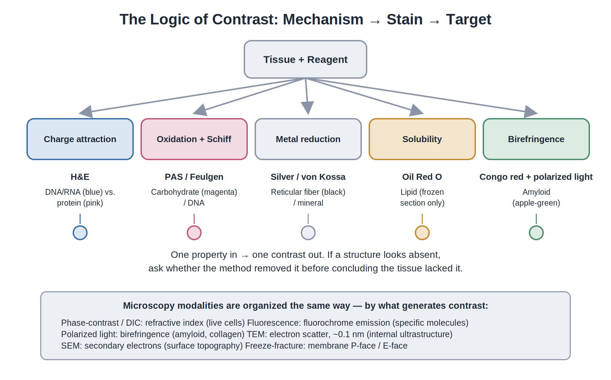
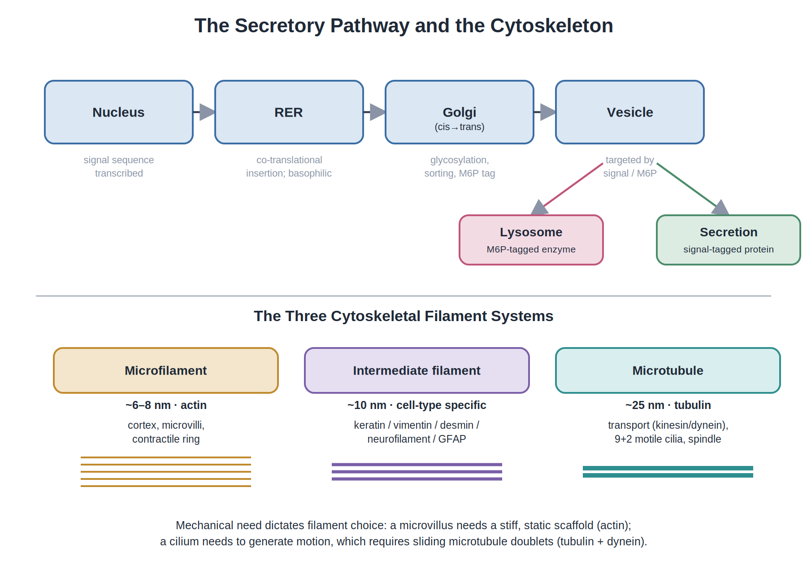
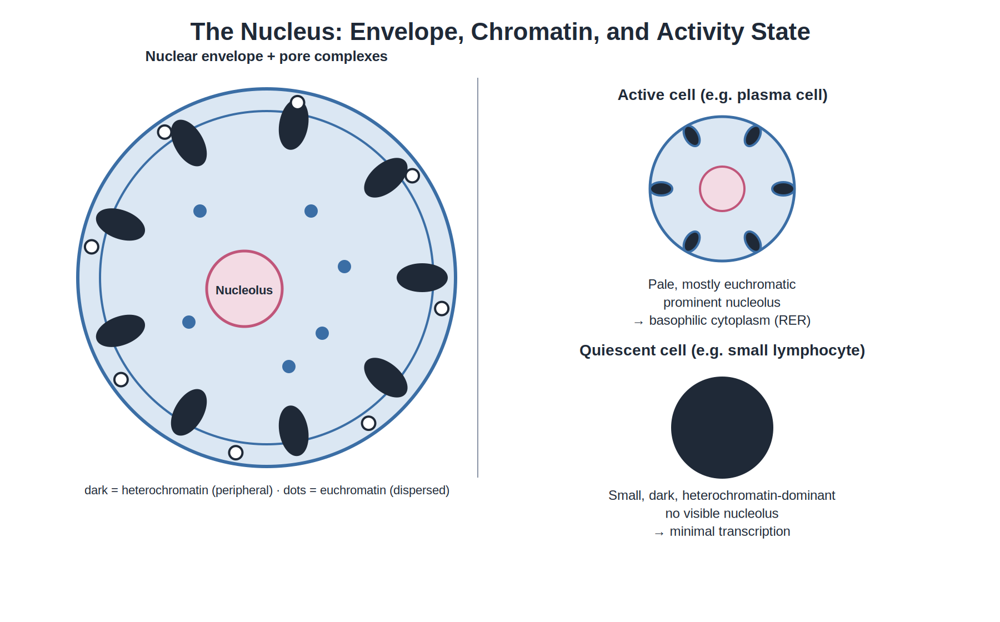
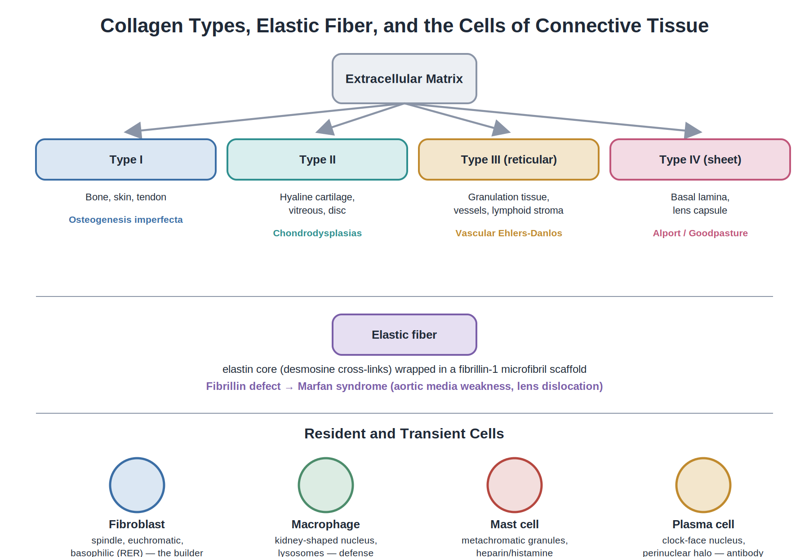
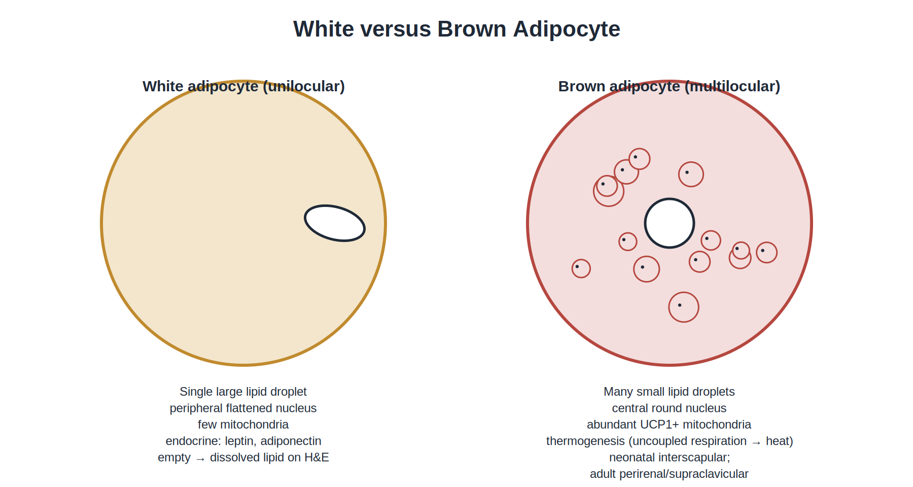
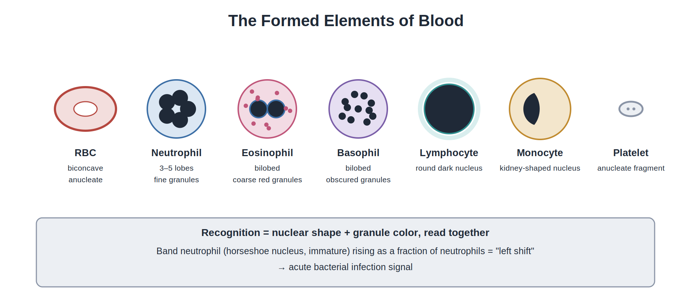
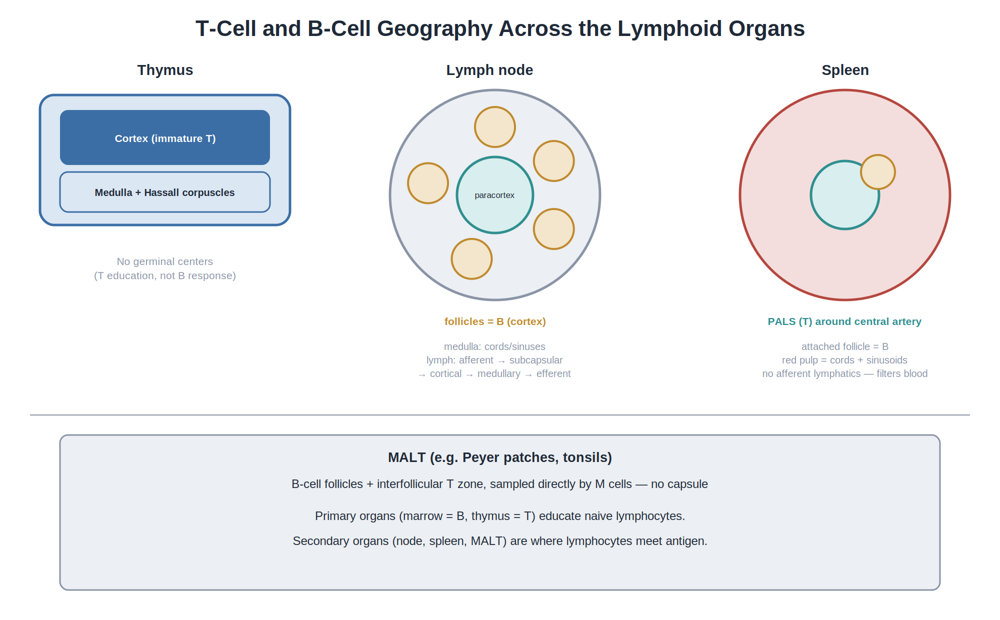
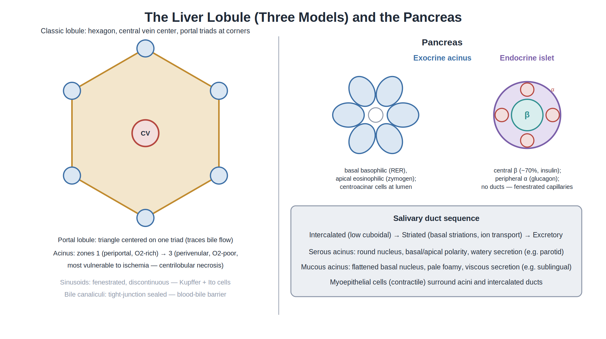
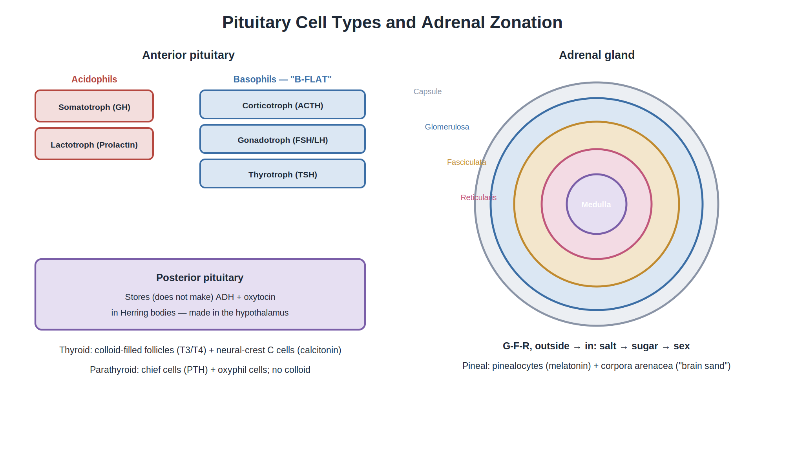

# Essential Histology

## *A Concept-Based Guide for PGME*

### *Understanding the structure. Seeing the pattern. Distinguishing the alternatives. Retrieving the logic.*

**Definitive Edition**

**AREMS-HY Academic Series**

---

*Built around Junqueira's Basic Histology: Text and Atlas, 17th Edition*

Primary scientific foundation: Mescher AL. **Junqueira's Basic Histology: Text and Atlas.** 17th ed. McGraw Hill.

---

## Publication Note

This edition is an educational synthesis aligned with the sixteen-chapter examination scope defined for this book. It is designed as a learning and examination companion, and it does not reproduce any source text verbatim. The book is intended for educational use. Clinical decisions should always be based on appropriate clinical references and professional guidance.

## How to Use This Book

**1. Understand.** Ask what problem the cell, tissue, or organ is solving, and why its architecture is suited to that job.

**2. See.** When a structure is described, start with its overall architecture and then identify the single feature that carries the most diagnostic weight.

**3. Distinguish.** Name the closest alternative, and state the one feature that separates the two.

**4. Retrieve.** Close the book and reconstruct the pathway, classification, or comparison without looking.

**5. Apply.** Translate the same knowledge into a new image, a clinical vignette, or an unfamiliar question stem.

The central habit of this book is causal reasoning: **appearance → structure → composition → mechanism → function → recognition → distinction → clinical meaning → examination application.** Every chapter is built to move you along that chain, not simply to present facts in sequence.

## Contents

1. Chapter 1 — Histology and Its Methods of Study *(Junqueira Ch. 1)*
2. Chapter 2 — The Cytoplasm *(Junqueira Ch. 2)*
3. Chapter 3 — The Nucleus *(Junqueira Ch. 3)*
4. Chapter 4 — Epithelial Tissue *(Junqueira Ch. 4)*
5. Chapter 5 — Connective Tissue *(Junqueira Ch. 5)*
6. Chapter 6 — Adipose Tissue *(Junqueira Ch. 6)*
7. Chapter 7 — Nerve Tissue and the Nervous System *(Junqueira Ch. 9)*
8. Chapter 8 — The Circulatory System *(Junqueira Ch. 11)*
9. Chapter 9 — Blood *(Junqueira Ch. 12)*
10. Chapter 10 — Hemopoiesis *(Junqueira Ch. 13)*
11. Chapter 11 — The Immune System and Lymphoid Organs *(Junqueira Ch. 14)*
12. Chapter 12 — The Digestive Tract *(Junqueira Ch. 15)*
13. Chapter 13 — Organs Associated with the Digestive Tract *(Junqueira Ch. 16)*
14. Chapter 14 — The Respiratory System *(Junqueira Ch. 17)*
15. Chapter 15 — Skin *(Junqueira Ch. 18)*
16. Chapter 16 — Endocrine Glands *(Junqueira Ch. 20)*

*Final Integrated Review · Examination Practice · Recognition Drills · Final Preparation*

---

## Before Chapter 1: What Histology Is

The body can be understood at several scales. The whole body is made of organs; organs are built from tissues; tissues are organized from cells and extracellular matrix. The microscope becomes necessary when the structures responsible for function are too small or too closely packed to be resolved by the unaided eye.

A tissue removed from the body is no longer being supplied with oxygen and nutrients. Energy production falls, membrane pumps become abnormal, intracellular chemistry changes, and degradative enzymes begin to damage cellular components. The specimen therefore cannot simply be removed and expected to remain unchanged.

Histologic preparation is the controlled answer to that problem. The goal is to preserve tissue closely enough to its living organization that cells, extracellular matrix, boundaries, and relationships can still be interpreted, while also making the tissue physically suitable for sectioning and providing enough contrast to reveal structures that would otherwise be nearly transparent.

The preparation process is therefore a chain of linked problems: fixation, dehydration, clearing, infiltration and embedding, sectioning, and staining. Each stage exists because of what the next stage needs. Once that causal chain is clear, methods become easier to remember, and histologic artifacts become easier to interpret. The next chapter builds that chain from the ground up.

---

\pagebreak

# Chapter 1 — Histology and Its Methods of Study

*Corresponds to Junqueira's Basic Histology, 17th Edition*

Before we can learn a tissue, we have to solve a more basic problem: how can something that changes the instant life stops be preserved well enough for us to see?

Histology is the study of the microscopic organization of the body and the relationship between structure and function. The body is not a single undifferentiated mass. It is built from cells, the extracellular material around them, tissues made from coordinated groups of cells and matrix, and organs made from tissues arranged for a particular job. Because many of the structures that matter most are far smaller than the unaided eye can resolve, histology depends on microscopy and on methods that make a real biological structure visible without destroying the information we are trying to study.

That creates a remarkable practical problem. A tissue removed from the body is no longer being supplied with oxygen and nutrients. Energy production falls, membrane pumps fail, intracellular chemistry changes, and degradative enzymes begin to damage the cell. In other words, the specimen starts changing before the student ever sees it. A good histologic preparation is therefore not simply a thin slice. It is the result of a chain of decisions made to preserve structure, replace water with a material that can support the tissue, cut it thin enough for light to pass through, and then create contrast so that important molecules become visible. Junqueira describes the routine preparation as fixation, dehydration, clearing, infiltration and embedding, sectioning, followed by staining of the mounted section.

Think of the process as a series of problems that must be solved in order. Fixation stops or greatly slows destructive change and stabilizes the tissue. Dehydration removes water because paraffin and many embedding media cannot accept a water-filled specimen. Clearing replaces the alcohol with a solvent compatible with the embedding medium. Infiltration and embedding fill the tissue with a firm support. Sectioning converts a three-dimensional specimen into a thin plane that can be examined. Staining then answers a different question: which chemical or structural features should become visually distinct?

This is why the five preparation stages should never be memorized as an arbitrary list. Each stage exists because the next stage would fail without it. If tissue is not adequately fixed, morphology can deteriorate. If water is not removed, the embedding medium cannot infiltrate properly. If clearing is incomplete, paraffin infiltration is impaired. If the block is not properly supported, sectioning becomes difficult. If the section has no useful contrast, even preserved structures may be nearly invisible. The sequence is therefore a causal chain, not a vocabulary exercise.

Once this logic is understood, stains and microscopes also become easier. H&E is not simply 'blue nuclei and pink cytoplasm.' It is a visible consequence of chemical interactions between dyes and tissue components. Special stains are selected because the observer has a question in mind: carbohydrate, lipid, iron, mineral, amyloid, connective-tissue fibers, or a particular protein. Microscopy works the same way. Light microscopy is excellent for overall tissue architecture; electron microscopy is chosen when the structures are too small for light microscopy or when ultrastructural relationships matter. The correct question is therefore not 'Which technique is most powerful?' but 'What information am I trying to reveal?'

**Carry this forward:** By the end of this chapter, you should be able to look at a preparation and reason backward: what happened to the tissue, what was preserved or removed, what created the contrast, and why that method was chosen.

*The logic of contrast: fixation and staining reactions mapped to the molecular target each one detects.*

**Core Idea:** Contrast is not decoration. It is chemistry made visible — every stain and every microscope reveals one specific chemical or physical property, and hides the rest.

## Opening Question

How does a pathologist turn a piece of tissue into a diagnosis visible under a microscope — and why does the choice of stain decide what will be found?

## Why This Matters

Every biopsy is really a question aimed at the tissue: which molecule is accumulating, which cell is proliferating, which barrier has broken down? No single technique answers every question at once. The fixative, the solvent, the dye, and the microscope each expose one property of the tissue while concealing others. Understanding this logic is what prevents a wrong stain from becoming a missed diagnosis.

## Learning Objectives

By the end of this chapter, you will be able to:

**1.** Explain the physical and chemical purpose of each step in tissue processing, and predict the artifact produced when a step is skipped or shortened.

**2.** Derive, from dye charge chemistry, why the nucleus stains blue and the cytoplasm stains pink in H&E.

**3.** Match special stains to their molecular targets (PAS, silver, trichrome, orcein, Oil Red O, Congo red, Prussian blue, von Kossa, Alcian blue, Feulgen) and state what each requires from processing.

**4.** Select the correct microscopy modality for a stated investigative goal — live cells, a thick specimen, surface topography, nanometer-scale detail, membrane faces, or gene copy number.

**5.** Explain why light microscopy is limited to roughly 0.2 µm resolution and why electron microscopy exceeds it by orders of magnitude.

**6.** Interpret a staining pattern — basophilia, acidophilia, metachromasia, birefringence, an empty vacuole — as a statement about molecular content, not simply as a color.

## Two Problems, One Discipline

Fresh tissue is soft, transparent, and rapidly self-destructing. Histology exists to solve two problems at once:

**1. Make it hard enough to cut** — fixation → dehydration → clearing → embedding → sectioning.

**2. Create contrast that the eye or a detector can register** — by charge (H&E), by oxidation (PAS, Feulgen), by metal binding (silver, von Kossa), by solubility (lipid dyes), or by light interaction (birefringence, fluorescence, electron scattering).

No single method is universal. Each technique supplies exactly one type of contrast. If a structure appears absent on a slide, the first question is always whether the method removed it rather than whether the tissue lacked it.

## The Core Principle

Each technique reveals primarily the specific chemical or physical property it was designed to detect, and nothing else. A stained slide must be read as chemistry, not as an inherent color of the tissue.

## The Toolkit

**Living tissue autolyzes.** The moment blood supply stops, the cell's own lysosomal enzymes begin digesting it. Fixation exists to stop this before it happens.

**Fixation cross-links macromolecules in place.**

- **Formalin (formaldehyde)** reacts with amino and imino groups to form methylene bridges between proteins. It is the standard fixative for light microscopy: it preserves protein architecture adequately, preserves lipid poorly, and preserves fine ultrastructure only moderately.

- **Glutaraldehyde** is a dialdehyde that cross-links faster and more extensively than formaldehyde. It is the standard primary fixative for electron microscopy, where ultrastructural detail matters far more than speed.

- **Osmium tetroxide** binds the phospholipid head groups of membranes — fixing lipid, which formalin cannot do — and, as a heavy metal, scatters electrons strongly enough to generate contrast in the transmission electron microscope. It functions simultaneously as a fixative and a contrast agent, which is why EM protocols use glutaraldehyde first and osmium second.

**Dehydration** removes water through an ascending ethanol series (roughly 70% → 95% → 100%), because the embedding medium, paraffin, is hydrophobic and cannot infiltrate a wet tissue.

**Clearing** removes the ethanol with a reagent such as xylene, which is miscible with both ethanol and paraffin. This is the chemical bridge that makes the tissue paraffin-compatible; it also renders the tissue translucent, or "cleared," which is where the step gets its name.

**Embedding** infiltrates the tissue with liquid paraffin, which then hardens into a block that can be cut.

**Sectioning** produces routine paraffin sections about 5 µm thick (range roughly 1–10 µm). Semi-thin resin sections, about 1 µm and stained with toluidine blue, are used to orient a block before electron microscopy; ultrathin EM sections are roughly 50–90 nm.

**Staining creates the contrast that makes structure visible.**

*Hematoxylin and eosin (H&E) — charge chemistry.* Hematoxylin is a basic (positively charged) dye that binds the negatively charged phosphate backbone of DNA and RNA, producing a blue-purple color; structures that take it up are called **basophilic**. Eosin is an acidic (negatively charged) dye that binds positively charged basic side chains — lysine, arginine — abundant in proteins such as collagen and contractile proteins, producing a pink-red color; structures that take it up are called **acidophilic** or **eosinophilic**. The naming is a deliberate trap for students: a "basophilic" structure is rich in *acidic* molecules (nucleic acids), because it is attracted to a *basic* dye. Charge, not color, is the underlying variable — a plasma cell's cytoplasm is basophilic because it is packed with RNA-rich rough endoplasmic reticulum, while a skeletal muscle fiber is eosinophilic because it is packed with basic contractile proteins.

*Periodic acid–Schiff (PAS) — oxidation chemistry.* Periodic acid oxidizes the 1,2-glycol groups of hexose sugars to aldehydes, which the Schiff reagent then binds to produce a magenta color. PAS marks carbohydrate-rich structures: glycogen, mucin, basement-membrane glycoproteins (laminin, perlecan, and other components associated with the type IV collagen network), and fungal cell walls. PAS is **not** a collagen stain — a basement membrane is PAS-positive because of its carbohydrate content, not because PAS detects collagen directly.

*Silver impregnation — argyrophilia.* Reticular fibers, built from type III collagen, reduce silver salts to metallic silver, producing a black network. This is why reticular fiber is essentially synonymous with "type III collagen forming a delicate stromal scaffold," seen classically in liver, lymphoid organs, and endocrine glands.

*Masson trichrome — differential dye uptake.* Collagen takes up the blue or green dye while muscle and other cytoplasm take up red, making this the standard stain for assessing fibrosis.

*Orcein and Verhoeff — elastic fiber stains.* Elastic fibers, built from an elastin core wrapped in fibrillin microfibrils, stain brown-black.

*Lipid dyes (Oil Red O, Sudan black) — solubility chemistry.* Lipid dissolves out of tissue during the ethanol and xylene steps of routine paraffin processing, leaving behind empty-appearing vacuoles on H&E. To demonstrate lipid directly, tissue must be frozen-sectioned — bypassing the solvents entirely — and stained with a lipophilic dye, producing red or black droplets.

*Congo red — molecular orientation.* Amyloid, a pathological β-sheet fibril, binds Congo red and orients the dye molecules in a regular array; under polarized light this produces an apple-green birefringence. Birefringence alone (seen also with collagen) is not diagnostic — the diagnostic finding is Congo red staining *plus* apple-green birefringence together.

*Prussian blue (Perls) — a direct chemical reaction.* Ferric iron reacts with potassium ferrocyanide to form ferric ferrocyanide, a blue precipitate that marks hemosiderin.

*Von Kossa — indirect demonstration of mineralization.* Silver ions substitute for calcium at sites where phosphate and carbonate anions have already precipitated with calcium, and are then reduced to black metallic silver. Von Kossa does **not** stain calcium ion directly — it demonstrates the anions of a mineral deposit that is presumed, from the biology, to be calcium phosphate or carbonate. It is properly reported as an indirect indicator of mineralization.

*Alcian blue — acidic mucin.* Sulfated and carboxylated glycosaminoglycans bind the dye to produce blue staining.

*Feulgen — DNA specifically.* Acid hydrolysis exposes aldehyde groups on the deoxyribose of DNA, which then bind Schiff reagent to give a magenta signal proportional to DNA content — the basis of quantitative DNA cytophotometry.

**Organizing the stains by mechanism** makes them easier to retain than memorizing each in isolation: charge (H&E) → oxidation followed by Schiff reagent (PAS, Feulgen) → metal reduction (silver, von Kossa) → solubility (Oil Red O) → birefringence (Congo red under polarized light, and collagen intrinsically) → antigen–antibody binding (immunohistochemistry, immunofluorescence) → nucleic acid hybridization (FISH) → isotope incorporation (autoradiography).

**Microscopy modalities are organized by what generates the contrast**, not simply by magnification:

-

*Phase-contrast and DIC* exploit differences in refractive index to image live, unstained cells.

-

*Dark-field* collects only scattered light, producing a bright object on a black background — useful for thin, weakly refractile organisms such as spirochetes.

-

*Fluorescence microscopy* excites a fluorochrome and detects its emission, allowing specific molecules to be localized (for example, DAPI for DNA).

-

*Confocal microscopy* uses a pinhole to reject out-of-focus light, producing a crisp optical section through a thick specimen.

-

*Polarizing microscopy* detects birefringence — used for amyloid (with Congo red), collagen, and crystals.

-

*Transmission electron microscopy (TEM)* detects electrons scattered while passing through an ultrathin section, producing a two-dimensional internal view at roughly 0.1 nm resolution.

-

*Scanning electron microscopy (SEM)* detects secondary electrons emitted from a surface, producing a three-dimensional topographic image.

-

*Freeze-fracture* splits a frozen membrane along the weak hydrophobic interior of its lipid bilayer, exposing two faces — the **P-face** (the protoplasmic, inner leaflet, seen from outside the cytoplasm) and the **E-face** (the exoplasmic, outer leaflet) — each studded with the intramembrane particles that correspond to embedded proteins.

## Seeing and Distinguishing

**Recognition logic.** Start with the baseline: a blue nucleus and pink cytoplasm on H&E. Then confirm with a targeted stain — magenta signals PAS-positive carbohydrate; a black fibrillar network signals silver-positive reticulin; blue-green versus red signals trichrome-stained collagen versus muscle; red droplets on a *frozen* section signal lipid; apple-green birefringence after Congo red signals amyloid; blue granules signal Perls-positive iron; black deposits after silver nitrate signal von Kossa-positive mineralization.

**Do not confuse with…** Metachromasia — the shift of toluidine blue from its normal blue to purple or red when it binds densely packed polyanions such as the heparin in mast cell granules — is a distinct phenomenon from ordinary basophilia, caused by dye-molecule stacking rather than simple charge attraction. Likewise, the native birefringence of collagen under polarized light (which appears white) must not be mistaken for the apple-green birefringence specific to Congo red-bound amyloid.

**The decisive feature** for identifying a stain is always its chemistry: charge for H&E, oxidation for PAS, metal reduction for silver and von Kossa, solubility for lipid dyes, and polarization for Congo red.

**Compare and distinguish — frozen versus paraffin sections**

| Feature | Frozen Section | Paraffin Section |
|---|---|---|
| Turnaround | Minutes | Hours to days |
| Lipid | Preserved | Dissolved (empty vacuoles) |
| Enzyme activity | Preserved | Lost |
| Morphology | Inferior; ice-crystal artifact | Superior; best detail |
| Typical use | Intraoperative diagnosis; lipid or enzyme studies | Routine diagnosis; long-term storage |

**Compare and distinguish — TEM, SEM, and light microscopy**

| Feature | TEM | SEM | Light Microscopy |
|---|---|---|---|
| Signal | Transmitted, scattered electrons | Secondary electrons from a surface | Absorption/transmission of visible light |
| Image | Two-dimensional, internal | Three-dimensional, surface | Two-dimensional, in color |
| Resolution | ≈ 0.1 nm | ≈ 1–10 nm | ≈ 0.2 µm |
| Best for | Organelles, filtration barriers, foot processes | Cilia and microvilli surfaces | Survey work, routine H&E |

## Clinical Meaning

Four causes of hepatomegaly — fatty liver, glycogen storage disease, hemochromatosis, and amyloidosis — can look identical on plain H&E and are distinguished entirely by choosing the right special stain. Fat requires a frozen section and Oil Red O, because routine processing dissolves lipid and leaves only empty vacuoles on H&E. Glycogen requires PAS with a diastase-sensitivity control. Iron requires Prussian blue. Amyloid requires Congo red examined under polarized light. Von Kossa would be positive only if calcification were also present, and even then it demonstrates phosphate or carbonate, not calcium ion itself.

Frozen section is the surgeon's tool when a margin must be read in about fifteen minutes — a timeline paraffin processing cannot meet. Skipping dehydration, clearing, and embedding buys speed and preserves lipid and enzyme activity, at the cost of ice-crystal artifact and inferior morphologic detail.

In basement-membrane disease such as Alport syndrome or Goodpasture syndrome, the membrane is best visualized with PAS, because it stains the type IV collagen–associated glycoproteins (laminin and related molecules) that make up the membrane; the same logic explains why a thickened, PAS-positive basement membrane is a hallmark of diabetic nephropathy.

## Reasoning Through a Case

A surgical pathology sample arrives labeled only "skin lesion, rule out melanoma versus dermatofibroma." Before any diagnosis can be made, the tissue must survive processing intact enough to answer the question.

**Appearance.** On the H&E slide, the epidermis looks normal, but a deeper dermal population of spindle cells stains unexpectedly pale, and a separate melanocytic population shows unusually dark, atypical nuclei. **Structure.** The pale spindle cells sit in whorled bundles; the atypical cells are dendritic and pigmented. **Composition.** Pale spindle cells are typically rich in collagen-producing machinery; pigmented cells contain melanosomes. **Mechanism.** Melanin synthesis begins with tyrosinase oxidizing tyrosine; a dysregulated melanocyte can overproduce and mis-package this pigment. **Function.** Normal melanocytes protect nuclear DNA from ultraviolet damage; here, that protective role has been lost to unchecked proliferation. **Recognition.** The decisive clue is nuclear atypia in the pigmented population, not simply the presence of pigment. **Distinction.** A benign fibrous proliferation (dermatofibroma) would show uniform, bland spindle cells without melanocytic atypia. **Clinical meaning.** The combination of architectural disorder and cytologic atypia in a melanocytic population is what separates a melanoma from a benign lesion. **Examination application.** A question describing "atypical, dendritic, pigmented cells with an irregular junctional pattern" is testing exactly this chain, not simply asking whether pigment is present.

The lesson generalizes: a stain or a cell type is never diagnostic by itself. It becomes diagnostic only once it is placed inside this full chain, from appearance to examination application.

## Before You Move On

**Must Know**

- Basophilic = nucleic acid = binds the basic dye hematoxylin = blue. Acidophilic = protein = binds the acidic dye eosin = pink.

- PAS marks carbohydrate (glycogen, mucin, basement membrane, fungal walls) — it is not a collagen or reticular fiber stain.

- Reticular fibers are type III collagen, and are demonstrated with silver.

- Collagen is distinguished from muscle with Masson trichrome.

- Elastic fibers are demonstrated with orcein or Verhoeff.

- Lipid requires a frozen section plus Oil Red O, because routine processing dissolves it.

- Amyloid requires Congo red plus apple-green birefringence under polarized light — neither alone is diagnostic.

- Iron is demonstrated with Prussian blue; mineralization is demonstrated indirectly with von Kossa (which detects phosphate/carbonate, not calcium itself).

- Light microscopy is fixed with formalin; electron microscopy is fixed with glutaraldehyde followed by osmium (osmium also fixes and contrasts membranes).

- Light resolution is limited to about 0.2 µm by the wavelength of visible light; electron microscopy reaches about 0.1 nm because electron wavelength is thousands of times shorter.

**Must Distinguish**

- Basophilia (simple charge attraction) versus metachromasia (a color *shift* caused by dye polymerization on densely packed polyanions).

- Silver-positive reticular fiber (type III collagen) versus trichrome-positive collagen (type I) versus orcein-positive elastic fiber.

- TEM (internal ultrastructure) versus SEM (surface topography) versus freeze-fracture (membrane faces).

- Frozen section (fast, preserves lipid and enzymes, inferior morphology) versus paraffin section (slow, loses lipid, best morphology).

**Must Understand**

- Why an empty-looking vacuole on H&E does not mean an empty cell — it usually means lipid was dissolved during processing.

- Why von Kossa is described as an indirect stain for mineralization.

- Why resolution and magnification are not the same thing.

**Common Misconceptions**

*"Clearing removes water."* It does not. Dehydration (ethanol) removes water; clearing (xylene) removes the ethanol and renders the tissue miscible with paraffin. Each step exists because no single reagent bridges water directly to paraffin.

*"Von Kossa stains calcium."* It demonstrates the phosphate and carbonate anions of a mineral deposit through silver substitution. Calcium is inferred, not directly detected — the correct terminology is "mineralization, von Kossa-positive (indirect)."

*"More magnification means more resolution."* Resolution is the minimum distance at which two points can still be seen as separate, and it is set by wavelength and numerical aperture, not by how much an image is enlarged. Magnifying past the resolution limit only produces a bigger blur — "empty magnification."

*"H&E shows everything important."* H&E shows only the distribution of charge. Lipid content, glycogen, reticular fibers, elastic fibers, iron, mineral, and amyloid are all invisible on H&E and require a targeted special stain.

**Integrated Summary**

Histology begins by solving two problems at once: making a fragile, transparent tissue rigid enough to cut, and giving it contrast the eye can read. Processing is a miscibility ladder — water to alcohol to xylene to paraffin — in which each reagent exists only to bridge to the next, while fixation cross-links proteins so autolysis cannot proceed. Staining is applied chemistry: charge attraction, oxidation followed by Schiff reagent, metal reduction, selective solubility, birefringence, antigen–antibody binding, nucleic-acid hybridization, and isotope incorporation are the mechanisms behind every stain in the chapter. Microscopy, in turn, is applied optics — refractive index, fluorescence, birefringence, and electron scattering are simply different ways of generating an image. The unifying skill of this chapter is choosing the fixative, stain, and microscope that answer one specific molecular question, because no single technique is universal.

## Check Your Understanding

**1.** Explain why dehydration and clearing are performed as two separate steps rather than one.

**2.** A plasma cell is intensely basophilic while skeletal muscle is eosinophilic. Explain this from the dominant macromolecule in each cell and the underlying dye chemistry.

**3.** A researcher wants to distinguish active DNA synthesis, total DNA amount, and a general proliferation marker. Compare ³H-thymidine autoradiography, the Feulgen reaction, and Ki-67 immunohistochemistry for this purpose.

**4.** Why does visualizing podocyte foot-process effacement in minimal change disease require electron microscopy rather than light microscopy?

**5.** How would you distinguish the birefringence of amyloid from the birefringence of collagen under polarized light?

**6.** Why does freeze-fracture split a membrane into two faces rather than separating the membrane cleanly from the cytoplasm?

**7.** A cell shows a single large clear space and a flattened, peripheral nucleus on H&E. What is the safest interpretation, and how would you confirm it?

## Bridge

Tissue is now prepared and stained. The next step is to look inside the structure every stain in this chapter has been lighting up — the machinery of the cell itself, beginning with the cytoplasm.

## Rapid Review

- Processing sequence: fixation (formalin for LM; glutaraldehyde then osmium for EM) → dehydration (ethanol removes water) → clearing (xylene removes ethanol) → embedding (paraffin) → sectioning (≈5 µm for LM).

- H&E: hematoxylin (basic) binds DNA/RNA phosphate → blue, basophilic. Eosin (acidic) binds basic protein residues → pink, acidophilic.

- Special stains by target: PAS → carbohydrate (magenta). Silver → reticular fiber, type III collagen (black). Trichrome → collagen (blue/green) vs. muscle (red). Orcein/Verhoeff → elastic fiber. Oil Red O → lipid, requires a frozen section. Congo red + polarized light → amyloid (apple-green). Perls → iron (blue). Von Kossa → mineral phosphate/carbonate, indirect (black).

- Microscopy by purpose: phase-contrast for live cells, confocal for optical sectioning of thick tissue, TEM for internal ultrastructure at ~0.1 nm, SEM for surface topography, freeze-fracture for membrane faces (P-face and E-face).

- Frozen sections trade morphologic quality for speed and preservation of lipid and enzyme activity; paraffin sections trade speed for the best routine morphology.

---

\pagebreak

# Chapter 2 — The Cytoplasm

*Corresponds to Junqueira's Basic Histology, 17th Edition*

A cell looks simple only from a distance. Up close, it is a logistics system: materials are made in one place, modified in another, sent to specific destinations, recycled when worn out, and moved along internal tracks.

The cytoplasm becomes much easier to learn once you stop treating organelles as a list. A living cell must solve several practical problems at once. It must make proteins, manufacture lipids, generate usable energy, package molecules, dispose of waste, store selected materials, change shape, and move cargo through a crowded interior. The organelles are the cell's solutions to those problems.

This is why the same organelle can be recognized by structure, by staining behavior, and by the kind of cell in which it is abundant. Rough endoplasmic reticulum is not simply a membrane network with ribosomes attached. It is the production floor for proteins that will enter the secretory pathway. Its ribosome-rich surface explains cytoplasmic basophilia. Smooth endoplasmic reticulum has a different assignment: lipid synthesis, steroid production, detoxification, and calcium storage. The Golgi receives cargo, modifies it and sorts it. Lysosomes create an acidic compartment for digestion, whereas peroxisomes carry out oxidative reactions and contain catalase. Mitochondria organize oxidative metabolism and ATP production.

The most useful mental picture is a controlled flow of material. A secreted protein begins with information in the nucleus, is translated on ribosomes associated with rough ER, enters the ER lumen, travels in transport vesicles to the Golgi, is modified and sorted, and is finally directed to the plasma membrane or another destination. Mannose-6-phosphate is important because it turns a general secretory route into a specific delivery address for lysosomal enzymes. When the address is missing, the machinery still works, but it delivers the cargo to the wrong place.

The cytoskeleton is the other half of the story. Cells need not only compartments but routes. Actin supports the cortex and microvilli, intermediate filaments provide durable mechanical strength and often identify cell lineage, and microtubules provide tracks for long-distance transport as well as the framework for cilia and the mitotic spindle. The distinction matters because surface structures that look similar under routine microscopy can have completely different internal machinery: a microvillus is actin-based, whereas a motile cilium is built around microtubules and dynein.

When you study this chapter, keep asking one question: what job is the cell trying to accomplish? A plasma cell is crowded with rough ER because it is producing antibody. A steroid-producing cell is rich in smooth ER because steroid synthesis requires a different biochemical environment. A cell with long processes depends heavily on cytoskeletal transport. Histology becomes memorable when the microscopic picture is the visible footprint of the work being done inside the cell.

**Carry this forward:** Whenever you meet an unfamiliar cell later, predict its organelles from its job before trying to memorize its microscopic appearance.

*The secretory pathway and the three cytoskeletal filament systems, organized by function.*

**Core Idea:** The cytoplasm organizes work by compartment. Rough ER synthesizes proteins for export, smooth ER synthesizes lipid and handles detoxification and calcium storage, the Golgi modifies and sorts, lysosomes digest, peroxisomes oxidize, mitochondria generate ATP, and the cytoskeleton organizes space and transport.

## Opening Question

How does a single cell build, sort, and ship thousands of different proteins to their correct destinations without mixing them up?

## Why This Matters

A pancreatic acinar cell secretes digestive enzymes, a plasma cell secretes antibody, and a hepatocyte detoxifies drugs — three very different jobs performed with the same basic organelle toolkit, simply scaled and specialized differently. When any piece of that toolkit fails, disease follows a predictable logic: Kartagener syndrome from immotile cilia, I-cell disease from lysosomal enzymes that never reach the lysosome, and microvillus inclusion disease from a broken actin scaffold are all, at heart, cytoplasmic trafficking failures.

## Learning Objectives

By the end of this chapter, you will be able to:

**1.** Trace membrane flow from the rough ER through the Golgi to its destination, and explain how a signal sequence and mannose-6-phosphate (M6P) tagging determine where a protein ends up.

**2.** Distinguish rough ER, smooth ER, Golgi, lysosome, peroxisome, and mitochondria by structure, function, and microscopic appearance.

**3.** Classify the three cytoskeletal filament systems by diameter, protein composition, and function.

**4.** Explain why a strongly basophilic cytoplasm indicates a cell rich in rough ER and actively synthesizing protein.

**5.** Predict the consequence of a defect in a microtubule motor, a dynein arm, lysosomal enzyme targeting, or a peroxisomal oxidase.

## Inside the Cell

The cytoplasm has four components: the **cytosol** (the aqueous phase in which everything else sits), the **organelles** (membrane-bound compartments, each with its own internal chemistry), the **cytoskeleton** (scaffolding and transport tracks), and **inclusions** (stored, non-living products such as lipid droplets, glycogen, or pigment). The governing principle that ties all of this together is simple: the cell achieves **compartmentalization through membranes, transport through vesicles, and positioning through the cytoskeleton.**

## The Core Principle

A eukaryotic cell solves the problem of molecular crowding by using membranes to create distinct chemical microenvironments, and solves the problem of movement by using cytoskeletal tracks and their associated motor proteins.

## Compartment by Compartment

**Rough endoplasmic reticulum (RER)** is studded with ribosomes, and it is this ribosomal RNA — negatively charged and therefore hematoxylin-binding — that makes RER-rich cytoplasm basophilic on H&E. Protein synthesis destined for secretion, for lysosomal delivery, or for insertion into a membrane begins co-translationally: a signal sequence on the growing polypeptide is recognized by the signal recognition particle (SRP), which docks the ribosome onto a translocon in the RER membrane so that the protein is threaded directly into the ER lumen as it is made. Cells with heavy secretory demand — pancreatic acinar cells, plasma cells — accumulate so much RER that their cytoplasm is intensely blue even at low power.

**Smooth endoplasmic reticulum (SER)** lacks ribosomes and performs a different set of jobs: lipid synthesis, steroid hormone synthesis (prominent in the adrenal cortex's zona fasciculata and in testicular Leydig cells), drug detoxification (SER proliferates in hepatocytes in response to drugs, using cytochrome P450 enzymes), and calcium storage — in skeletal and cardiac muscle, a specialized SER called the sarcoplasmic reticulum releases the calcium that triggers contraction.

**The Golgi apparatus** is a stack of flattened, curved cisternae with a convex **cis face** that receives vesicles from the RER and a concave **trans face**, continuous with the **trans-Golgi network (TGN)**, that ships vesicles onward. As a protein passes from cis to medial to trans, the Golgi glycosylates and sulfates it and then sorts it by attaching a targeting signal: **mannose-6-phosphate (M6P)** for enzymes destined for the lysosome, or other signal sequences for proteins destined for secretion or the plasma membrane.

**Lysosomes** contain acid hydrolases that function at an acidic pH of roughly 5, maintained by a proton pump in the lysosomal membrane; acid phosphatase is the classic marker enzyme. A **primary lysosome** contains only enzyme, freshly budded from the Golgi; a **secondary lysosome** has already fused with its substrate — a phagosome or worn-out organelle — and is actively digesting it. Because the M6P tag is what routes lysosomal enzymes to the lysosome in the first place, a defect in the enzyme that attaches M6P produces **I-cell disease**: enzymes are secreted extracellularly instead of being delivered, undigested material accumulates as inclusions, and the disease is named for exactly that appearance.

**Peroxisomes** are a distinct, smaller organelle containing oxidases and catalase, not acid hydrolases, and operating at neutral pH rather than an acidic one. Their signature job is beta-oxidation of very-long-chain fatty acids and detoxification of the hydrogen peroxide this produces. Catalase, not acid phosphatase, is the marker enzyme that separates a peroxisome from a lysosome. A defect in peroxisome biogenesis produces Zellweger syndrome.

**Mitochondria** are bounded by a double membrane: a smooth outer membrane and an inner membrane folded into cristae (which become tubular rather than flat in steroid-secreting cells, matching their SER-heavy, steroidogenic profile). The matrix contains the enzymes of oxidative metabolism along with mitochondrial DNA and mitochondrial ribosomes — a legacy of the organelle's endosymbiotic origin. Mitochondria generate ATP, participate in apoptosis, and buffer intracellular calcium; a cytoplasm packed with mitochondria appears eosinophilic, because the mitochondrial proteins bind eosin.

**The cytoskeleton** is built from three filament systems, distinguished most reliably by diameter and protein composition:

- **Microfilaments** (≈6–8 nm) are polymers of **actin**, often paired with myosin. They are highly dynamic, with a structurally distinct barbed end and pointed end, and they form the cell cortex, the core of microvilli, the contractile ring of a dividing cell, and the anchor points of focal adhesions.

- **Intermediate filaments** (≈10 nm) are mechanically stable rather than dynamic, and — critically for diagnostic pathology — their protein composition is cell-type specific: **keratin** in epithelium, **vimentin** in mesenchymal cells, **desmin** in muscle, **neurofilament** in neurons, **glial fibrillary acidic protein (GFAP)** in astrocytes, and **lamins** forming the nuclear lamina. Intermediate filaments anchor desmosomes and hemidesmosomes, giving epithelium its mechanical resilience.

- **Microtubules** (≈25 nm) are polymers of α/β-tubulin dimers, organized from a microtubule-organizing center (the centrosome) and exhibiting GTP-dependent dynamic instability. They form the 9+2 axoneme of motile cilia, serve as the track for the motor proteins kinesin (anterograde transport) and dynein (retrograde transport, and also the force generator for ciliary beating), and assemble into the mitotic spindle during cell division.

The same logic explains two facts that, at first glance, look unrelated. A pancreatic acinar cell is basophilic at its base and eosinophilic at its apex because its base is packed with RER manufacturing enzyme precursor while its apex stores the finished product in eosinophilic zymogen granules — the cell's polarity is a direct map of the secretory pathway's direction of flow. And a microvillus has an actin core while a cilium has a microtubule core for a reason no less mechanical: a microvillus needs a stiff, stationary support that adds surface area without moving, which actin provides, while a cilium needs to generate motion, which requires the sliding of microtubule doublets driven by dynein. Mechanical need dictates the choice of filament exactly as secretory need dictates the placement of organelles.

## Seeing and Distinguishing

**Recognition logic.** Basal blue cytoplasm topped by apical pink granules identifies a protein-secreting cell in which RER manufactures a zymogen that is stored, apically, for release. A cell with a central, deeply basophilic cytoplasm and a classic "clock-face" (cartwheel) pattern of peripheral heterochromatin is the plasma cell, whose entire architecture exists to manufacture antibody.

**Then confirm with…** surface specializations: microvilli (actin core, non-motile, form the brush border and increase absorptive area) versus true cilia (9+2 microtubule core, motile) versus stereocilia (long, branched microvilli — despite the name, not related to true cilia at all — found on epididymal epithelium). A basal actin meshwork, the **terminal web**, anchors the microvillar cores just beneath the apical membrane.

**Do not confuse with…** cytoplasmic basophilia (from ribosomal RNA in RER) with nuclear basophilia (from DNA in heterochromatin). Both are blue on H&E, but they arise from different molecules in different compartments, and the distinction matters diagnostically — for example, in recognizing a plasma cell by its basophilic cytoplasm as distinct from a small lymphocyte's basophilic, heterochromatin-dense nucleus.

**The decisive feature** is filament diameter and protein identity: ~6–8 nm actin, ~10 nm cell-type-specific intermediate filament, ~25 nm tubulin; a 9+2 microtubule arrangement identifies a motile cilium; and mannose-6-phosphate is the decisive tag for lysosomal targeting.

**Compare and distinguish — RER versus SER**

| Feature | RER | SER |
|---|---|---|
| Ribosomes | Present | Absent |
| Main function | Protein synthesis for export, membranes, and lysosomes | Lipid and steroid synthesis, detoxification, Ca²⁺ storage |
| H&E appearance | Basophilic | Not basophilic |
| Prototype cell | Plasma cell, pancreatic acinar cell | Hepatocyte, adrenal zona fasciculata cell, muscle |

**Compare and distinguish — lysosome versus peroxisome**

| Feature | Lysosome | Peroxisome |
|---|---|---|
| Enzymes | Acid hydrolases | Oxidases, catalase |
| Internal pH | Acidic (≈5) | Near neutral |
| Marker enzyme | Acid phosphatase | Catalase |
| Origin | Buds from the Golgi | Buds from the ER; also self-replicates |
| Disease of failure | I-cell disease (M6P tagging defect) | Zellweger syndrome (biogenesis defect) |

**Compare and distinguish — the three filament systems**

| Filament | Diameter | Protein | Function | Diagnostic marker for |
|---|---|---|---|---|
| Microfilament | ~6–8 nm | Actin | Cortex, microvilli, contractile ring, motility | — |
| Intermediate filament | ~10 nm | Keratin, vimentin, desmin, neurofilament, GFAP | Mechanical stability, desmosome anchoring | Cell lineage (epithelial vs. mesenchymal vs. muscle vs. neural) |
| Microtubule | ~25 nm | Tubulin | Transport, cilia, mitotic spindle | — |

## Clinical Meaning

**Kartagener syndrome** results from a defect in the dynein arms that normally drive microtubule sliding. Cilia are structurally present but immotile, producing bronchiectasis and chronic sinusitis from failed mucociliary clearance, and — because the same dynein-dependent cilia establish left–right body asymmetry during development — situs inversus. Electron microscopy, not light microscopy, is required to see the missing dynein arms directly.

**I-cell disease (mucolipidosis II)** arises from a defect in the enzyme that attaches mannose-6-phosphate to lysosomal enzymes in the Golgi. Without this tag, the enzymes are secreted from the cell instead of being routed to the lysosome; lysosomes accumulate undigested substrate as phase-dense inclusions, which gives the disease its name, while serum enzyme levels rise because the misdirected enzymes end up in the blood.

**Microvillus inclusion disease** results from a defect in the actin-based trafficking machinery that maintains the microvillar brush border, producing severe congenital diarrhea from atrophic, disorganized microvilli.

## Reasoning Through a Case

An electron micrograph from a liver biopsy shows a hepatocyte with unusually abundant smooth ER and swollen mitochondria, taken from a patient on long-term anticonvulsant therapy.

**Appearance.** The cytoplasm looks pale and granular by light microscopy, without the strong basophilia expected of a synthetic cell. **Structure.** By EM, the SER forms an extensive tubular network, distinct from the flattened, ribosome-studded RER. **Composition.** SER membranes are the site of cytochrome P450 enzyme families. **Mechanism.** Chronic drug exposure upregulates these enzymes, and the cell responds by manufacturing more SER membrane to house them. **Function.** This expanded SER increases the liver's drug-metabolizing capacity, exactly the adaptive response the clinical history predicts. **Recognition.** Abundant SER without corresponding RER or basophilia points away from a protein-export role and toward lipid metabolism, steroid synthesis, or detoxification. **Distinction.** This must be separated from RER hypertrophy, which would instead show basophilia and is associated with active protein secretion, not detoxification. **Clinical meaning.** SER hyperplasia is a normal, reversible adaptation; it becomes clinically relevant mainly through drug-drug interactions, as induced P450 enzymes alter the metabolism of other medications. **Examination application.** A vignette describing enzyme induction after chronic drug exposure is testing recognition of SER's role, not simply asking for a definition.

Every organelle in this chapter earns its place in the cell by solving a specific problem; reading an electron micrograph is really just asking which problem this particular cell has been asked to solve.

## Consolidating the Cytoplasm

**Must Know**

- RER is basophilic and synthesizes protein for export, for membranes, or for lysosomes. SER synthesizes lipid and steroid, handles detoxification, and stores calcium.

- The Golgi processes proteins cis to trans, adding sugar and sulfate groups and sorting cargo — mannose-6-phosphate for the lysosome, other signals for secretion or membrane insertion.

- Lysosomes contain acid hydrolases at pH ≈5; peroxisomes contain oxidase and catalase at near-neutral pH. They are unrelated organelles despite both being called "digestive."

- Mitochondria have a double membrane, cristae, their own DNA and ribosomes, and produce ATP.

- The three filament systems are separated by diameter: actin ≈6–8 nm, intermediate filaments ≈10 nm, microtubules ≈25 nm.

- Actin builds microvilli (non-motile); tubulin, in a 9+2 arrangement, builds motile cilia.

**Must Distinguish**

- RER versus SER by ribosome presence and downstream product.

- Lysosome versus peroxisome by pH, marker enzyme, and origin.

- Microvillus (actin, non-motile, absorptive) versus true cilium (tubulin, motile) versus stereocilium (a long, branched microvillus, not a true cilium, found in the epididymis).

**Must Understand**

- Why membrane flow has a fixed direction and polarity, and why that polarity is visible as basal-versus-apical staining in a secretory cell.

- Why basophilic cytoplasm signals active protein synthesis rather than simply "a busy cell."

- Why intermediate filament type is diagnostically useful — because it is cell-lineage specific, unlike actin or tubulin, which are used by essentially every cell.

**Common Misconceptions**

*"SER exists only for detoxification."* SER also synthesizes lipid and steroid hormones and stores calcium; in muscle, the SER-derived sarcoplasmic reticulum is the calcium reservoir that triggers contraction.

*"Lysosomes and peroxisomes are basically the same because both 'digest' things."* They differ in every mechanistic respect: acid hydrolases versus oxidases, acidic versus neutral pH, Golgi-derived versus ER-derived, and they fail in entirely different diseases (I-cell disease versus Zellweger syndrome).

*"All basophilia in a cell comes from the nucleus."* Cytoplasmic basophilia is a separate finding, produced by RER, and it specifically indicates active protein synthesis.

**Integrated Summary**

The cytoplasm organizes its chemistry by membrane-bound compartment: rough ER manufactures proteins destined for export, membranes, or lysosomes; smooth ER manufactures lipid and handles calcium and detoxification; the Golgi modifies and sorts cargo using mannose-6-phosphate and other signal tags; the lysosome digests at acidic pH; the peroxisome oxidizes using catalase; and the mitochondrion generates ATP. The cytoskeleton supplies the scaffolding and the tracks that make all of this spatially organized — actin for the cortex and microvilli, cell-type-specific intermediate filaments for mechanical identity and stability, and microtubules for long-range transport and ciliary motion. Because each compartment has a distinct molecular content, its structure directly predicts both its staining behavior on H&E and its function — the throughline that will recur throughout this book.

## Check Your Understanding

**1.** Explain why plasma cell cytoplasm is intensely basophilic, and trace where the antibody it manufactures goes after synthesis.

**2.** Reconstruct the full pathway of a secreted protein from its signal sequence to its release from the cell, including the branch point where the M6P tag diverts an enzyme to the lysosome instead.

**3.** Compare a microvillus, a true cilium, and a stereocilium by core protein, motility, and typical location.

**4.** Predict the functional consequence of a kinesin defect versus a dynein defect.

**5.** Explain, mechanistically, why I-cell disease produces both extracellular enzyme excess and intracellular inclusions.

## Bridge

The cytoplasm builds and moves the cell's machinery. The nucleus decides what gets built, when, and how much — the next chapter asks how two meters of DNA fit inside a six-micrometer nucleus and still remain readable.

## Rapid Review

- RER (basophilic) makes protein for export, membranes, or lysosomes. SER makes lipid, steroid, and handles detoxification and Ca²⁺ storage.

- Golgi runs cis to trans: glycosylation, sulfation, and sorting, with M6P tagging enzymes for the lysosome.

- Lysosomes use acid hydrolases at pH ≈5; peroxisomes use oxidase and catalase at neutral pH.

- Filaments by diameter: actin ~6–8 nm (microvilli, cortex), intermediate ~10 nm (keratin, vimentin, desmin, neurofilament, GFAP — cell-lineage markers), microtubule ~25 nm (tubulin, 9+2 in motile cilia).

- Kartagener syndrome: dynein arm defect, immotile cilia. I-cell disease: M6P tagging defect, misrouted lysosomal enzymes.

---

\pagebreak

# Chapter 3 — The Nucleus

*Corresponds to Junqueira's Basic Histology, 17th Edition*

The nucleus is not merely a container for DNA. It is the control center that decides which parts of the genome are accessible, which instructions are being used, and how much synthetic activity the cell can sustain.

A useful way to enter nuclear histology is to start with a paradox. A cell may contain an enormous amount of genetic information inside a compartment only a few micrometers across, yet that information must remain organized enough to be read quickly and selectively. Nuclear architecture exists to solve that problem. The envelope separates the genomic compartment from the cytoplasm, pores control traffic, chromatin regulates access to DNA, and the nucleolus concentrates the machinery needed to build ribosomes.

This explains why a nucleus can look different from one cell to another without the cells having different genomes. A metabolically active cell must continuously transcribe genes. Much of its chromatin is therefore relatively open and appears pale - the histologic correlate of euchromatin. A cell with lower transcriptional activity contains more condensed heterochromatin and typically has a darker nucleus. The visible difference is not a decorative feature of the slide; it is a clue to the cell's state.

The nuclear envelope also connects this chapter to the cytoplasm. Its outer membrane is continuous with rough ER, while the inner surface is supported by the nuclear lamina. Nuclear pore complexes create a selective gateway rather than a simple hole. Proteins can enter, while mRNA and ribosomal subunits must leave. The direction of this traffic matters because a functioning cell depends on constant communication between the nuclear genome and the cytoplasm that carries out its instructions.

The nucleolus provides another powerful example of structure revealing function. It is not membrane-bound. Instead, it is an organized region where ribosomal genes are transcribed, rRNA is processed, and ribosomal subunits are assembled. A prominent nucleolus therefore tells you something about protein-production demand. When combined with a pale nucleus and basophilic cytoplasm from abundant rough ER, it becomes a coherent picture of an actively synthesizing cell.

The aim is not to memorize that 'euchromatin is light' as an isolated fact. The deeper chain is: open chromatin permits transcription; active transcription supports RNA production; active protein synthesis increases the need for ribosomes; the nucleus becomes pale with prominent nucleolar activity; the cytoplasm becomes basophilic when rough ER is abundant. One chain can therefore explain several observations at once.

**Carry this forward:** Later, when you see a neuron, plasma cell, hepatocyte, or lymphocyte, use nuclear appearance as evidence about what that cell is doing rather than as a label learned in isolation.

*The nuclear envelope, pore complex, and the euchromatin–heterochromatin spectrum from active to quiescent cells.*

**Core Idea:** A pale, euchromatic nucleus with a prominent nucleolus indicates active transcription and ribosome production, while a small, dark, heterochromatic nucleus indicates transcriptional quiescence.

## Opening Question

How does roughly two meters of DNA fit inside a six-micrometer nucleus and still remain readable on demand?

## Why This Matters

Cancer diagnosis leans heavily on nuclear atypia — an irregular envelope, coarsely clumped chromatin, and prominent nucleoli are read as evidence of a cell that has lost normal control over transcription and proliferation. The Barr body demonstrates the same chromatin logic used for X-inactivation dosage compensation. Understanding how euchromatin and heterochromatin differ explains, in a single principle, why some nuclei look pale and active while others look dark and inert.

## Learning Objectives

By the end of this chapter, you will be able to:

**1.** Describe the structure of the nuclear envelope — its double membrane, perinuclear space, nuclear pore complexes, and lamina — and explain each component's function.

**2.** Distinguish euchromatin from heterochromatin functionally and microscopically, including the distinction between constitutive and facultative heterochromatin.

**3.** Explain how the nucleolus is organized around ribosomal DNA and how that organization supports ribosome biogenesis.

**4.** Predict the consequence of a lamin defect or a nuclear pore transport defect.

**5.** Recognize the nuclear features that distinguish an actively protein-synthesizing cell from a quiescent one.

## The Genome's Gatekeeper

The nucleus performs two linked jobs: it stores the genome, and it controls access to it. The **envelope** is both a barrier and a selective transport gateway; **chromatin** is DNA wrapped around histones and organized so that accessibility can be regulated; and the **nucleolus** is the cell's dedicated ribosome factory.

## The Core Principle

Chromatin organization controls access to genetic information. Euchromatin is open and available for transcription; heterochromatin is closed and transcriptionally silent. Nuclear appearance under the microscope is, in effect, a direct readout of how much of the genome a cell currently has open for business.

## The Architecture of Control

**The nuclear envelope** is a double membrane enclosing a perinuclear space; its outer membrane is continuous with the rough ER, which is why ribosomes are often seen studding its cytoplasmic face. On the inner surface, a meshwork of lamin intermediate filaments — the **nuclear lamina** — provides mechanical support and anchors peripheral heterochromatin. The envelope is perforated by **nuclear pore complexes**, enormous (~120 MDa) multiprotein assemblies that allow selective, energy-dependent transport: importins carry proteins in and exportins carry mRNA and ribosomal subunits out, with directionality set by a gradient of the small GTPase Ran. The nucleus needs this elaborate gating system because it must let macromolecules like mRNA and ribosomal subunits leave and transcription factors and structural proteins enter, all while keeping the genome itself physically sequestered.

**Chromatin** is built in a hierarchy: DNA wraps around a histone octamer to form a nucleosome, nucleosomes pack into an ~11 nm fiber, that fiber further coils into a ~30 nm fiber, and the 30 nm fiber is organized into looped domains anchored to a nuclear scaffold. Two functional states of this chromatin are distinguished by how tightly it is packed:

- **Euchromatin** is dispersed and transcriptionally active. It appears light on H&E because it is loosely packed, and it tends to sit centrally within the nucleus.

- **Heterochromatin** is condensed and transcriptionally silent. It appears dark and basophilic because densely packed DNA binds more hematoxylin, and it is typically found at the nuclear periphery, adjacent to the nucleolus, and along the nuclear envelope. Heterochromatin is further divided into **constitutive** heterochromatin — permanently condensed regions such as centromeric DNA, present in every cell — and **facultative** heterochromatin, which is condensed in some cells but not others depending on which genes that particular cell type has silenced. The classic example of facultative heterochromatin is the **Barr body**, the single inactivated X chromosome present in every somatic cell of a genetic female, seen as a small, dense chromatin mass at the nuclear periphery.

During mitosis, chromatin condenses fully into visible **chromosomes**, each with a centromere for spindle attachment and telomeres capping each end. This condensation is the visible endpoint of the cell cycle's progression through G1, S (DNA synthesis), G2, and M (mitosis) phases, and it explains why proliferating tissue looks different from quiescent tissue even before any mitotic figure is found: a tissue with a high proliferative fraction shows more variability in nuclear size and chromatin texture simply because its cells are distributed across every stage of the cycle at once. A **mitotic figure** itself is recognized by the complete absence of a nuclear envelope and nucleolus, replaced by condensed, deeply basophilic chromosomes arranged either in a metaphase plate or already being pulled toward opposite poles — a finding pathologists count directly, because mitotic rate is one of the most reproducible measures of how rapidly a tissue, benign or malignant, is proliferating.

**The nucleolus** is not membrane-bound; it assembles around nucleolar organizer regions — chromosomal segments containing the genes for ribosomal RNA. It has three functional zones: the **fibrillar center**, containing the ribosomal DNA itself; the **dense fibrillar component**, where that DNA is actively transcribed; and the **granular component**, where the ribosomal RNA transcripts are processed and assembled into ribosomal subunits. A cell with heavy protein-synthesis demand — a plasma cell, a neuron, an active hepatocyte — needs a correspondingly high ribosome output, and this shows up directly as one or more large, prominent nucleoli.

These two threads converge on a single diagnostic idea: an actively transcribing, protein-synthesizing cell has a large, pale nucleus (because its chromatin is predominantly euchromatic) with a prominent nucleolus (because it needs to manufacture ribosomes), and — since ribosome-rich RER makes the cytoplasm basophilic — that basophilic cytoplasm and pale, active-looking nucleus appear together. A quiescent cell, such as a small resting lymphocyte, shows the opposite: a small, dark, heterochromatin-dominant nucleus with no visible nucleolus, reflecting minimal transcriptional activity.

## Seeing and Distinguishing

**Recognition logic.** A pale nucleus with a prominent nucleolus signals active protein synthesis — expect this in plasma cells, neurons, and active hepatocytes. A small, uniformly dark nucleus with no visible nucleolus signals a transcriptionally quiescent cell — expect this in a small lymphocyte or a mature sperm.

**Then confirm with…** a Barr body: a small, dense chromatin mass pressed against the nuclear envelope in a female somatic cell, confirming an inactivated X chromosome.

**Do not confuse with…** the nucleolus and a cytoplasmic inclusion — the nucleolus lies inside the nuclear envelope, while an inclusion (a lipid droplet, glycogen mass, or pigment granule) lies in the cytoplasm.

**The decisive feature** is the joint appearance of chromatin distribution and nucleolar prominence: light, centrally dispersed chromatin plus a prominent nucleolus is coupled to basophilic, RER-rich cytoplasm in every actively synthesizing cell type.

**Compare and distinguish — euchromatin versus heterochromatin**

| Feature | Euchromatin | Heterochromatin |
|---|---|---|
| Staining | Light, pale | Dark, basophilic |
| Transcriptional state | Active | Inactive |
| Typical location | Central, dispersed | Peripheral; around the nucleolus; Barr body |
| Example cell | Plasma cell, active neuron | Small resting lymphocyte |

**Compare and distinguish — nuclear envelope versus plasma membrane**

| Feature | Nuclear envelope | Plasma membrane |
|---|---|---|
| Layers | Double membrane, perinuclear space between | Single bilayer |
| Pores | Large (~120 MDa), selective nuclear pore complexes | No pores; ion channels and transporters instead |
| Supporting lattice | Nuclear lamina (lamin intermediate filaments) | Actin-based cortex, not a lamina |

## Clinical Meaning

**Malignant nuclear atypia** is read from exactly the features this chapter builds: an irregular, often thickened nuclear envelope, coarsely clumped ("salt and pepper" or "raisinoid") chromatin, multiple prominent and often irregular nucleoli, and a high nuclear-to-cytoplasmic ratio. Each feature reflects the same underlying biology — abnormal, dysregulated transcription driving uncontrolled proliferation.

**Laminopathies** — mutations in lamin A/C — cause diseases as different as muscular dystrophy and Hutchinson-Gilford progeria, unified by a single mechanism: a structurally fragile nuclear envelope that cannot withstand mechanical or replicative stress.

**The Barr body** is used clinically as sex chromatin on a buccal smear, a direct visual demonstration of X-inactivation dosage compensation.

## Reasoning Through a Case

A cervical Pap smear shows squamous cells with enlarged, hyperchromatic, irregularly contoured nuclei and coarsely clumped chromatin, prompting concern for dysplasia.

**Appearance.** The nuclei are dark and irregular rather than the small, uniform, evenly stained nuclei of a normal mature squamous cell. **Structure.** Chromatin is unevenly clumped rather than smoothly dispersed, and the nuclear envelope shows irregular contours. **Composition.** The dark staining reflects a shift toward densely packed, hematoxylin-binding heterochromatin, but distributed abnormally rather than in the normal peripheral pattern. **Mechanism.** Dysregulated cell-cycle control allows abnormal cells to keep proliferating instead of terminally differentiating, and chromatin organization becomes disordered as transcriptional control breaks down. **Function.** Normal squamous maturation should produce a small, inactive nucleus; here that program has failed. **Recognition.** The nuclear-to-cytoplasmic ratio is the single most load-bearing clue — an increased ratio signals a cell behaving as if it were still dividing. **Distinction.** Reactive atypia, from inflammation or infection, can also enlarge nuclei, but typically preserves smooth nuclear contours and even chromatin, unlike true dysplasia. **Clinical meaning.** The degree of nuclear atypia is what grades cervical dysplasia and guides whether the patient needs colposcopy or can be followed with routine screening. **Examination application.** A question describing "hyperchromasia, irregular nuclear contour, and coarse chromatin" is testing recognition of malignant or premalignant nuclear change, not simply asking whether a nucleus is dark.

Nuclear morphology is one of the most information-dense features in histology precisely because chromatin organization is a direct, physical record of a cell's transcriptional behavior.

## Consolidating the Nucleus

**Must Know**

- The nuclear envelope is a double membrane with a perinuclear space, large-pore nuclear pore complexes for selective transport, and an inner lamin-based lamina for mechanical support.

- Euchromatin is light and transcriptionally active; heterochromatin is dark and transcriptionally inactive.

- The nucleolus is the site of ribosomal RNA transcription and ribosome assembly, and is prominent specifically in cells with high protein-synthesis demand.

- The Barr body is an inactivated X chromosome, a form of facultative heterochromatin, seen at the nuclear periphery.

**Must Distinguish**

- Euchromatin versus heterochromatin, by both staining intensity and transcriptional state.

- Constitutive heterochromatin (permanent, e.g., centromeric DNA) versus facultative heterochromatin (cell-type-dependent, e.g., the Barr body).

- The nucleolus (intranuclear, ribosome factory) versus a cytoplasmic inclusion.

**Must Understand**

- Why an actively synthesizing cell shows a pale nucleus, a prominent nucleolus, and basophilic cytoplasm together — these three findings are mechanistically coupled, not independent observations.

**Common Misconceptions**

*"Heterochromatin is inert junk DNA."* It is inactive, not functionless: it maintains centromere structure and stability, carries out dosage compensation through the Barr body, and actively silences genes that a given cell type must not express.

*"The nucleolus is a membrane-bound organelle."* It is not membrane-bound at all — it is a dynamic, non-membranous compartment that assembles around actively transcribed ribosomal DNA and disassembles during mitosis.

**Integrated Summary**

The nucleus stores the genome and controls access to it by regulating chromatin condensation: euchromatin stays open and light for active transcription, while heterochromatin stays closed and dark for silencing, whether permanently (constitutive) or in a cell-type-specific pattern (facultative, as in the Barr body). The double-membraned envelope, penetrated by large selective pores and supported internally by the lamin-based lamina, separates the genome from the cytoplasm while still allowing the traffic of mRNA, ribosomal subunits, and regulatory proteins that transcription requires. The nucleolus assembles around ribosomal DNA to manufacture rRNA and ribosomal subunits, and becomes prominent exactly when a cell's protein-synthesis demand is high. Taken together, nuclear morphology is a direct, readable prediction of a cell's transcriptional and synthetic activity.

## Check Your Understanding

**1.** Explain why a small lymphocyte's nucleus is dark and featureless while a plasma cell's nucleus is pale with a prominent nucleolus.

**2.** Describe the function of the nuclear pore complex and explain why it must be both large and highly selective.

**3.** What is a Barr body, and why is it typically found at the nuclear periphery?

**4.** How does a lamin defect produce disease?

## Bridge

A cell with a controlled, readable genome is now ready to specialize and cooperate with its neighbors. The next chapter asks how polarized cells assemble into sheets that seal surfaces, absorb nutrients, and secrete products: epithelial tissue.

## Rapid Review

- Nuclear envelope: double membrane, perinuclear space, ~120 MDa selective pores, lamin-based lamina.

- Euchromatin: light, active, central. Heterochromatin: dark, inactive, peripheral; the Barr body is facultative heterochromatin marking the inactive X.

- Nucleolus: fibrillar center (rDNA) → dense fibrillar component (transcription) → granular component (processing); prominent in cells with high protein-synthesis demand.

- Active cell = pale nucleus + prominent nucleolus + basophilic cytoplasm, all three findings reflecting the same underlying transcriptional activity.

---

\pagebreak

# Chapter 4 — Epithelial Tissue

*Corresponds to Junqueira's Basic Histology, 17th Edition*

An epithelium is a boundary that has to make a difficult compromise: it must separate two environments while still allowing selected substances to cross. Its architecture is the solution.

Start with the everyday meaning of a barrier. A barrier is useful only when it is selective. Skin must resist mechanical injury and water loss; intestinal epithelium must absorb; airway epithelium must clean incoming air; renal epithelium must regulate movement of solutes. The word 'epithelium' therefore describes a family of tissues that share a basic organization but are modified for different jobs.

The essential idea is polarity. The apical surface faces the lumen or external environment, the lateral surface communicates with neighboring cells, and the basal surface is anchored to the underlying matrix. Those three domains are not interchangeable. They contain different proteins and perform different tasks. Once polarity is understood, the junctional complex becomes easier to reason about: the most apical junction seals the pathway between cells, deeper junctions provide adhesion and mechanical strength, and the basal machinery attaches the cell to the basement membrane.

Classification also becomes logical when it is linked to function. A single layer gives a short path for diffusion, absorption, or secretion. Multiple layers provide mechanical protection. Flattened cells minimize diffusion distance; taller cells create room for organelles and specialized transport machinery. Pseudostratified epithelium looks multilayered because nuclei sit at different heights, but every cell still contacts the basement membrane. Transitional epithelium changes shape as the urinary tract fills and empties, allowing stretch without sacrificing barrier function.

The basement membrane is another place where 'what you see' must be connected to 'what it is made of.' The basal lamina contains a type IV collagen network organized with laminin and other molecules, while the reticular lamina beneath it contains type III collagen. The membrane is therefore a molecular scaffold linking epithelial cells to the connective tissue underneath. This same architecture explains why certain diseases split the skin at characteristic levels when particular adhesion molecules fail.

Finally, specializations at the apical surface should be learned by mechanism. Microvilli increase surface area; motile cilia move material; stereocilia are long actin-based projections that are not true cilia. When you can predict the job, the core cytoskeleton, shape, and location become easier to remember.

**Carry this forward:** From here onward, whenever you classify an epithelium, ask two questions together: what is the barrier trying to accomplish, and which structural feature makes that job possible?

*Epithelial classification by layers and shape, and the apical-to-basal order of the junctional complex.*

**Core Idea:** Epithelial polarity solves three separate problems at once — the apical surface manages the lumen, the lateral surface manages neighboring cells, and the basal surface manages attachment to the basement membrane.

## Opening Question

Why does chronic acid reflux slowly convert the lining of the esophagus into something that looks like intestine — and why does that transformation raise the risk of cancer?

## Why This Matters

The esophagus is lined by stratified squamous epithelium built to resist abrasion; the intestine is lined by simple columnar epithelium with goblet cells, built for absorption and lubrication. Chronic acid exposure reprograms the esophageal stem cell population toward an intestinal fate — a process called metaplasia, seen clinically as Barrett esophagus — trading abrasion resistance for a different, and in this location abnormal, function. That trade carries a real cost: Barrett esophagus is premalignant. Recognizing epithelial type, and recognizing when it has changed, is one of the most frequent tasks in diagnostic pathology.

## Learning Objectives

By the end of this chapter, you will be able to:

**1.** State the defining features of epithelium — polarity, avascularity, a basement membrane, and a capacity for regeneration — and explain why each is functionally necessary.

**2.** Classify epithelium by number of layers and cell shape, and recognize the two special types, pseudostratified and transitional, along with their typical locations.

**3.** Reconstruct the apical-to-basal order of the junctional complex, naming the molecule and cytoskeletal anchor of each junction, and predict at what level a blistering disease will split the epidermis when a given junction fails.

**4.** Describe the molecular composition of the basement membrane (the type IV collagen network, laminin, entactin/nidogen, and perlecan), and distinguish the basal lamina from the reticular lamina.

**5.** Distinguish microvilli, true cilia, stereocilia, and the primary cilium by core cytoskeletal protein, motility, and function.

**6.** Classify exocrine glands by mode of secretory release (merocrine, apocrine, holocrine), by secretion type (serous versus mucous), by duct architecture, and by the role of myoepithelial cells.

## The Classification Problem

Epithelium is boundary tissue — it lines every surface and cavity of the body and forms every gland. Every epithelial cell is polarized into three functionally distinct domains: an **apical** surface facing the lumen, specialized for protection, absorption, or secretion; a **lateral** surface facing its neighbors, specialized for adhesion, sealing, and cell-to-cell communication; and a **basal** surface facing the underlying connective tissue, specialized for anchorage and selective filtration. The entire sheet is organized so that nothing crosses the barrier except by passing directly through a cell.

## The Core Principle

Polarity, avascularity, a basement membrane, and a capacity for continuous regeneration together define epithelium. Form consistently follows function: flat cells favor exchange, tall cells favor absorption or secretion, multiple layers favor mechanical protection, and dome-shaped cells favor stretch.

## The Architecture of a Surface

**The defining features of epithelium.** *Polarity* means the apical, lateral, and basal membrane domains carry different proteins and perform different jobs. *Avascularity* means epithelium contains no blood vessels; all of its nutrients arrive by diffusion across the basement membrane, which is exactly why epithelium cannot be arbitrarily thick — diffusion sets a hard limit. The *basement membrane* — the term used at the light-microscope level — is actually two layers fused together: the **basal lamina**, secreted by the epithelial cells themselves and divisible into a lamina lucida and lamina densa, and the **reticular lamina**, built from type III collagen (reticular fiber) secreted by underlying fibroblasts. At the molecular level, the basal lamina is a mesh, not a set of parallel fibers: **type IV collagen** self-assembles into a flexible, sheet-forming network (through NC1 domain interactions), and this network is cross-linked by **laminin**, **entactin/nidogen**, and the heparan sulfate proteoglycan **perlecan**. Finally, epithelium *regenerates* continuously from a basal stem cell population, replacing cells lost to surface wear.

**Classification** follows two independent axes: the number of cell layers (simple = one layer; stratified = more than one) and the shape of the surface cells (squamous, cuboidal, or columnar) — an epithelium is always named for its surface layer. Two categories deserve special mention because they are exceptions to the simple layer-counting rule. **Pseudostratified** epithelium is technically simple — every cell touches the basement membrane — but because the cells are of different heights, their nuclei sit at different levels and create a false impression of stratification. **Transitional** epithelium (urothelium) is stratified, but its most distinctive feature is the large, dome-shaped "umbrella" cell at the surface, which flattens when the bladder is full and rounds up when it is empty, allowing the epithelium to stretch without losing its barrier function.

**The junctional complex** has a fixed order running from apical to basal, and that order is logical rather than arbitrary: the paracellular space that must be sealed off begins right at the apex, so the seal has to be the most apical junction.

- **Tight junction (zonula occludens)** — the most apical junction — is built from claudins, occludin, and junctional adhesion molecules (JAMs), anchored intracellularly to actin via ZO-1. It performs two jobs: a *barrier* function (blocking paracellular movement) and a *fence* function (preventing apical and basolateral membrane proteins from diffusing into the wrong domain).

- **Adherens junction (zonula adherens)** sits just below the tight junction and uses E-cadherin, linked through catenins and vinculin to the actin cytoskeleton, to mechanically couple neighboring cells.

- **Desmosome (macula adherens)** uses the cadherins desmoglein and desmocollin, linked through plakoglobin and desmoplakin to intermediate (keratin) filaments, forming a spot-weld with visible intercellular spines on electron microscopy.

- **Gap junction** is built from connexin proteins arranged into connexons, forming a channel that allows direct cytoplasmic communication and coordinated electrical or chemical signaling between neighbors.

- **Hemidesmosome**, at the basal surface, anchors the cell to the basement membrane rather than to a neighboring cell: integrin α6β4 binds laminin-332 (not type IV collagen directly), and intracellularly connects through BP180, BP230, and plectin to the keratin cytoskeleton.

**Apical specializations** are built from different cytoskeletal cores because they serve different mechanical purposes. **Microvilli** have an actin core (20–30 cross-linked filaments, stabilized by villin and fimbrin and anchored into a basal actin terminal web); they are non-motile and exist purely to multiply absorptive surface area, by 20 to 30-fold. **Cilia** have a 9+2 microtubule core with dynein arms and a basal body, and they are motile, sweeping fluid or mucus across the surface. **Stereocilia** are, despite the name, long branched microvilli with an actin core — non-motile, found in the epididymis and the inner ear. The **primary cilium**, with a 9+0 microtubule arrangement and no dynein, is non-motile and functions as a sensory antenna rather than a mover of fluid.

**Glands** are classified along three independent dimensions. By *mode of release*: **merocrine** secretion is exocytosis with no loss of cell material (most glands); **apocrine** secretion was historically thought to involve loss of apical cytoplasm (as once believed for the mammary gland, now understood to be largely merocrine); **holocrine** secretion is release of the entire cell as the secretory product, as in the sebaceous gland. By *secretion type*: **serous** cells produce a watery, protein-rich secretion and appear basophilic basally (RER) with eosinophilic apical granules and a round, basal nucleus; **mucous** cells produce a viscous, glycoprotein-rich secretion and appear pale and foamy, with a flattened, basally pushed nucleus. Glands are also classified by *duct architecture* (simple versus compound; tubular versus acinar versus tubuloacinar), and many exocrine glands recruit **myoepithelial cells** — branched cells rich in actin and myosin that sit between the secretory epithelium and the basement membrane and contract to squeeze secretion into the duct.

Structure tracks function tightly enough here that two comparisons are worth holding onto. The esophagus is lined by stratified squamous epithelium because it must survive the abrasion of swallowed food; the intestine is lined by simple columnar epithelium with a dense microvillar brush border because it must maximize absorptive surface without adding thickness that would slow diffusion — protection and absorption pull epithelial architecture in opposite directions. And the tight junction's position at the very top of the junctional complex is not arbitrary: the paracellular space it seals begins at the apex, so the seal has to sit there too, or the epithelial sheet would have no defined "outside" and "inside" at all.

## Seeing and Distinguishing

**Recognition logic.** A sheet of cells sitting on a basement membrane, with no blood vessels running through it, is epithelium. Count the layers of nuclei: one layer is simple, more than one is stratified. Name the tissue from the shape of its surface cells. An umbrella-shaped surface cell over multiple layers identifies transitional epithelium. A layer where every cell touches the basement membrane but nuclei sit at different heights — often combined with cilia and goblet cells — identifies pseudostratified columnar epithelium. A dense fringe of short apical projections identifies a brush border of microvilli.

**Then confirm with…** the specific junction present: claudin-based sealing indicates a tight junction; cadherin plus actin indicates an adherens junction; desmoglein plus keratin indicates a desmosome; connexin indicates a gap junction; integrin plus laminin indicates a hemidesmosome.

**Do not confuse with…** pseudostratified epithelium being mistaken for stratified — it is simple, because every cell reaches the basement membrane. Also, remember that stratified epithelium is always named for its *surface* cell shape, not its basal layer, and that transitional epithelium is defined by its umbrella cell, not by being "a type of squamous" epithelium.

**The decisive feature:** an umbrella cell means transitional; cilia plus every cell touching the basement membrane means pseudostratified; flat, nucleated surface cells mean non-keratinized stratified squamous; flat, anucleate surface cells (with a keratin layer) mean keratinized stratified squamous.

**Compare and distinguish — pseudostratified, stratified, and transitional epithelium**

| Feature | Pseudostratified | Stratified | Transitional |
|---|---|---|---|
| Do all cells touch the basement membrane? | Yes | No | No |
| Distinctive cell | Ciliated cells and goblet cells (or stereocilia in the epididymis) | Flattened surface cells | Dome-shaped "umbrella" cell |
| Key identifying idea | Every cell reaches the base, despite the layered appearance | Named for the shape of the surface layer | Built to stretch without losing its barrier |

**Compare and distinguish — microvilli, cilia, and stereocilia**

| Feature | Microvilli | Cilia | Stereocilia |
|---|---|---|---|
| Cytoskeletal core | Actin | 9+2 microtubules + dynein | Actin (long, branched) |
| Motile? | No | Yes | No |
| Function | Increase absorptive surface area | Move fluid or mucus across the surface | Absorption (epididymis) or mechanosensation (inner ear) |

## Clinical Meaning

**Barrett esophagus** results from chronic gastroesophageal reflux disease reprogramming the esophageal stem cell population from a squamous fate to a columnar, goblet-cell-containing fate. The presence of goblet cells is the histologic requirement for the diagnosis, and the lesion carries a meaningfully increased risk of progression to esophageal adenocarcinoma.

**Blistering skin diseases map directly onto junction anatomy.** Pemphigus vulgaris involves autoantibodies against desmoglein, attacking the desmosome — a cell-to-cell junction — and producing an intraepidermal, suprabasal blister. Bullous pemphigoid involves autoantibodies against BP180/BP230, attacking the hemidesmosome — a cell-to-matrix junction — and producing a subepidermal blister. The level at which the skin splits is a direct readout of which molecule, and which junction, has failed.

## Reasoning Through a Case

An endoscopic biopsy from the gastroesophageal junction shows columnar epithelium with scattered goblet cells, in a patient with a decade of reflux symptoms.

**Appearance.** The normal stratified squamous lining has been replaced by simple columnar epithelium. **Structure.** Goblet cells are interspersed among absorptive-type columnar cells, resembling small-intestinal mucosa rather than esophageal mucosa. **Composition.** Goblet cells are filled with acidic mucin, demonstrable with Alcian blue. **Mechanism.** Chronic acid reflux has reprogrammed the local stem cell population toward an intestinal fate, trading the squamous epithelium's abrasion resistance for a different, more acid-tolerant phenotype. **Function.** The new epithelium is not "wrong" in isolation — columnar epithelium with mucous cells is normal in the intestine — but it is abnormal in this location and signals a tissue under sustained chemical stress. **Recognition.** The decisive diagnostic feature is the presence of goblet cells, not simply a change from squamous to columnar epithelium. **Distinction.** This must be distinguished from simple gastric-type columnar metaplasia, which lacks goblet cells and does not carry the same malignant potential. **Clinical meaning.** This is Barrett esophagus, a premalignant metaplasia that increases the risk of esophageal adenocarcinoma and changes surveillance recommendations. **Examination application.** A vignette describing chronic reflux plus goblet cells at the gastroesophageal junction is testing the definition of metaplasia and its most clinically important example, not simply epithelial classification.

This is the clearest illustration in the book of a general rule: epithelial type is not fixed for life. It is a functional decision the tissue can revise under chronic stress, at a real and sometimes dangerous cost.

## Locking In the Distinctions

**Must Know**

- Epithelium is defined by polarity, avascularity, a basement membrane, and continuous regeneration from basal stem cells.

- The basement membrane is a basal lamina (type IV collagen network + laminin + entactin/nidogen + perlecan, epithelial in origin) fused to a reticular lamina (type III collagen, fibroblast in origin).

- The junctional complex runs, apical to basal: tight junction (claudin/occludin, anchored via ZO-1 to actin) → adherens junction (E-cadherin, anchored via catenins to actin) → desmosome (desmoglein/desmocollin, anchored via desmoplakin to keratin) → gap junction (connexin) → hemidesmosome (integrin α6β4/laminin-332, anchored via plectin to keratin), at the base.

- Microvilli have an actin core and are non-motile; cilia have a 9+2 microtubule core with dynein and are motile; stereocilia are long, branched, actin-based microvilli.

**Must Distinguish**

- Simple versus pseudostratified versus stratified versus transitional epithelium.

- Microvilli versus true cilia versus stereocilia versus the primary cilium.

- Desmosome (cell-to-cell, cadherin, keratin) versus hemidesmosome (cell-to-matrix, integrin, laminin).

**Must Understand**

- Why epithelial thickness is limited by diffusion across an avascular tissue.

- Why the junctional complex has a fixed, logical apical-to-basal order.

- Why epithelial shape consistently follows function.

- Why metaplasia represents a trade of one function for survival under chronic stress, and why that trade is premalignant.

**Common Misconceptions**

*"Pseudostratified epithelium is a type of stratified epithelium."* It is simple — every cell touches the basal lamina; the layered appearance comes only from differing nuclear heights.

*"Desmosomes use integrins."* Desmosomes use cadherins (desmoglein, desmocollin) anchored to keratin; only hemidesmosomes use integrins, and they anchor to laminin, not directly to type IV collagen.

*"Epithelium is vascular, like the tissue beneath it."* Epithelium is avascular by definition; this is precisely what limits how thick it can be.

**Integrated Summary**

Epithelium is a polarized sheet of avascular, regenerating cells resting on a basement membrane. Its apical surface carries actin-based microvilli for absorption or tubulin-based cilia for transport; its lateral surface carries a fixed sequence of junctions — tight, adherens, desmosome, gap — that seal, adhere, and communicate; and its basal surface anchors to the type IV collagen network of the basement membrane through hemidesmosomes. Classification combines layer count and surface cell shape, with pseudostratified and transitional epithelium as the two structural exceptions worth memorizing individually. Glands built from this epithelium are classified by their mode of release (merocrine, apocrine, holocrine), their secretion type (serous versus mucous), and their reliance on contractile myoepithelial cells. When chronic stress reprograms the basal stem cells that maintain this system, the result is metaplasia — a functional trade that, as in Barrett esophagus, is premalignant.

## Check Your Understanding

**1.** Why can epithelium not be arbitrarily thick?

**2.** Reconstruct the junctional complex in apical-to-basal order, naming the key molecule, cytoskeletal anchor, and associated disease for each junction.

**3.** What are the decisive features that distinguish pseudostratified, stratified, and transitional epithelium from one another?

**4.** Explain the mechanism of Barrett esophagus and why the presence of goblet cells is required for the diagnosis.

**5.** Why does pemphigus produce an intraepidermal blister while bullous pemphigoid produces a subepidermal blister?

## Bridge

Epithelium is the body's boundary tissue. The next chapter turns to the tissue that supports, connects, and defends everything epithelium sits upon: connective tissue.

## Rapid Review

- Defining features: polarity, avascularity, a basement membrane, and continuous regeneration.

- Basement membrane = basal lamina (type IV collagen network + laminin + entactin/nidogen + perlecan, from the epithelium) + reticular lamina (type III collagen, from fibroblasts).

- Junctional complex, apical to basal: tight junction (claudin, anchored to actin via ZO-1) → adherens junction (E-cadherin, actin) → desmosome (desmoglein/desmocollin, keratin) → gap junction (connexin) → hemidesmosome (integrin α6β4/laminin-332, keratin), at the base.

- Apical specializations: microvilli (actin, non-motile, absorptive brush border), cilia (9+2 tubulin, dynein, motile), stereocilia (long actin-based microvilli, non-motile).

- Classification: layers plus surface shape; pseudostratified means every cell touches the base; transitional means an umbrella surface cell.

- Glands: merocrine/apocrine/holocrine release; serous (basophilic base, eosinophilic apex) versus mucous (pale, flattened basal nucleus); myoepithelial cells contract to expel secretion.

- Metaplasia is stem-cell reprogramming under chronic stress; Barrett esophagus is the premalignant example.

---

\pagebreak

# Chapter 5 — Connective Tissue

*Corresponds to Junqueira's Basic Histology, 17th Edition*

If epithelium is the body's boundary, connective tissue is the framework beneath and around it. Its great lesson is that the extracellular matrix is not filler; it is an active material whose composition determines physical behavior.

Connective tissue is easiest to understand when you begin with the thing that makes it different from epithelium: much of its volume may be extracellular. Cells live within a matrix made of fibers, ground substance, and tissue fluid. The relative amounts and arrangement of these components determine whether the tissue is designed to resist pulling, compression, distortion, or repeated recoil.

Collagen provides tensile strength, but 'collagen' is not one uniform material. Different collagen types create different architectures. Type I forms strong fibrils and dominates tendon, dermis, bone and several other structures. Type III forms reticular networks, especially useful as delicate supporting frameworks. Type IV creates sheet-like networks in basement membranes. Once that distinction is clear, many seemingly unrelated locations and diseases become easier to organize.

Elastic fibers solve a different mechanical problem. An elastin-rich system can stretch and then recoil. Fibrillin contributes to the microfibrillar scaffold, which is why defects in this system have consequences very different from a pure collagen defect. Ground substance, meanwhile, can hold large amounts of water and resist compression. It also participates in cell signaling and in the movement of molecules through the tissue.

The cells of connective tissue should be learned as workers with recognizable jobs. Fibroblasts build matrix. Macrophages remove material and participate in defense. Mast cells store and release mediators of inflammation. Plasma cells are specialized antibody factories. When you learn the cells by their work, their organelle patterns and characteristic appearances make more sense.

A final step is to recognize that connective tissue is a system in motion. During wound healing, early matrix and later mature matrix are not identical. The tissue changes as it moves from provisional repair toward stronger organization. This is the broader histologic habit to take from the chapter: a tissue's microscopic appearance is the current state of a mechanical and biological process.

**Carry this forward:** When you meet cartilage, bone, blood, or lymph later, keep this framework in mind: first identify what the matrix must physically accomplish, then ask which cells and molecules create it.

*Collagen types I–IV mapped to structure and disease, alongside the resident cells of connective tissue.*

**Core Idea:** In connective tissue, collagen fibers resist tension, elastic fibers provide recoil, and glycosaminoglycans hold water to resist compression.

## Opening Question

Why do some people have unusually stretchy skin while others have unusually fragile bones — and how can a single tissue type explain both?

## Why This Matters

Marfan syndrome (a fibrillin defect), Ehlers-Danlos syndrome (a collagen defect), osteogenesis imperfecta (a type I collagen defect), and scurvy (a defect of vitamin C-dependent collagen hydroxylation) are, at heart, four different failures of the same tissue system. Wound healing itself depends on a scripted switch from type III to type I collagen. Once the molecular composition of connective tissue is understood, both the diseases and the healing process become predictable rather than a list to memorize.

## Learning Objectives

By the end of this chapter, you will be able to:

**1.** State the three components of connective tissue — cells, fibers, and ground substance — and explain how their relative proportions distinguish loose from dense connective tissue.

**2.** Trace collagen biosynthesis from procollagen through hydroxylation, triple-helix formation, and fibril assembly, and explain the mechanism of scurvy.

**3.** Match collagen types I through IV to their tissue location and associated disease, and explain the structural difference between fibrillar and sheet-forming collagen.

**4.** Describe the composition of an elastic fiber (an elastin core within a fibrillin microfibril scaffold) and explain the mechanism of Marfan syndrome.

**5.** Identify the resident and transient cells of connective tissue by function and microscopic appearance.

**6.** Classify the adult connective tissue types — loose, dense regular, dense irregular, elastic, reticular, and mucoid.

## The Building Blocks

Connective tissue is built from cells embedded in an extracellular matrix, and that matrix does three jobs simultaneously: it bears mechanical load, it fills space between other tissues, and it carries molecular signals. Because the matrix is a defined molecular composite rather than an inert filler, its exact composition determines its mechanical behavior — and determines which disease results when a specific molecule is defective.

## The Core Principle

The molecular composition of the extracellular matrix determines a connective tissue's mechanical properties, its distribution in the body, and its vulnerability to specific diseases.

## Fiber, Ground Substance, and Cell

**Connective tissue has three components:** cells, fibers, and ground substance (glycosaminoglycans, proteoglycans, and structural glycoproteins such as fibronectin and laminin). The relative proportion of these three components — and in particular, how much fiber versus how much ground substance is present, and how densely and regularly the fibers are packed — is what separates loose from dense connective tissue.

**Collagen** is the single most abundant protein in the body, and its biosynthesis explains both its mechanical strength and its most important disease. Procollagen α-chains are synthesized on the RER; proline and lysine residues are then hydroxylated by an enzyme that requires vitamin C as a cofactor (along with ferrous iron and oxygen). Hydroxylation is essential for stabilizing the resulting **triple helix** through interchain hydrogen bonding. After procollagen peptidase cleaves the terminal propeptides, the resulting **tropocollagen** molecules self-assemble extracellularly into fibrils with a characteristic quarter-staggered arrangement, which are then cross-linked by lysyl oxidase into mature fibers. When vitamin C is deficient, hydroxylation fails, the triple helix cannot be stabilized, and the resulting collagen is mechanically weak — the direct cause of the bleeding gums, poor wound healing, and vascular fragility of **scurvy**.

Collagen is not a single molecule but a family of types, each with a distinct architecture and location:

- **Type I** is thick and fibrillar, and is the tensile workhorse of bone, skin, tendon, dentin, organ capsules, and cornea. Its defects cause osteogenesis imperfecta and the arthrochalasia form of Ehlers-Danlos syndrome.

- **Type II** is thin and fibrillar, forming the matrix of hyaline cartilage, the vitreous body, and the nucleus pulposus of the intervertebral disc.

- **Type III** is thin and fibrillar — this is **reticular fiber** — found in granulation tissue, around blood vessels, in lymphoid stroma, and in skin; it dominates early wound healing before being replaced by type I, and its defects cause the vascular form of Ehlers-Danlos syndrome.

- **Type IV** does not form fibrils at all. Instead, it self-assembles into a flexible, sheet-forming network through interactions between its NC1 domains, and this network is the structural core of the basal lamina and the lens capsule. Because it is the scaffold of glomerular and other filtration barriers, its defects cause Alport syndrome and are the target of the autoantibodies in Goodpasture syndrome.

**Elastic fibers** are built from a core of the hydrophobic protein elastin — cross-linked through the unusual amino acids desmosine and isodesmosine, which allow it to stretch and passively recoil — surrounded by a scaffold of fibrillin microfibrils. During development, the fibrillin scaffold is laid down first, and elastin is then deposited within and around it; the mature fiber therefore consists of an elastin core wrapped in a fibrillin sheath. Elastic fibers stain brown-black with orcein or Verhoeff stain. In **Marfan syndrome**, a defective fibrillin-1 scaffold produces elastic fibers that cannot properly organize or support elastin, weakening large-artery walls (with a strong predisposition to aortic aneurysm and dissection), and also producing the skeletal (tall stature, arachnodactyly) and ocular (lens dislocation) features of the syndrome.

**Ground substance** is a highly hydrated gel of glycosaminoglycans — hyaluronan, chondroitin sulfate, dermatan sulfate, keratan sulfate, and heparan sulfate — often organized around a core protein into large proteoglycan aggregates (such as aggrecan in cartilage). Because these molecules are heavily sulfated and therefore strongly negatively charged, they attract and hold water, which is exactly what allows ground substance to resist compression, complementing collagen's resistance to tension. Structural glycoproteins such as fibronectin (mediating cell adhesion to matrix) and laminin (a component of the basal lamina) are also part of this ground substance.

**The resident and transient cells of connective tissue** each have a distinctive appearance that reflects their job. The **fibroblast** is the tissue's builder: a spindle-shaped cell with euchromatic nucleus and basophilic, RER-rich cytoplasm, actively synthesizing both collagen and ground substance; once matrix production slows, it becomes the quiescent **fibrocyte**. The **macrophage**, derived from circulating monocytes, is the tissue's defender: it has an irregular, kidney-shaped nucleus and abundant lysosomes, and performs phagocytosis and antigen presentation. The **mast cell** mediates allergic and inflammatory responses: it is round, packed with granules containing heparin (a strongly sulfated glycosaminoglycan) and histamine, and those granules are **metachromatic** with toluidine blue — the dye's molecules stack on the densely packed heparin and shift from blue to purple or red, a phenomenon distinct from ordinary basophilia. The **plasma cell**, as introduced in Chapter 2, is an antibody factory: basophilic cytoplasm (RER), a "clock-face" (cartwheel) pattern of peripheral heterochromatin, and a pale perinuclear halo corresponding to a prominent Golgi; when antibody accumulates and crystallizes within a dilated RER cistern, the result is a **Russell body**. **Adipocytes** are covered in the next chapter, and various **leukocytes** move through connective tissue transiently as part of immune surveillance and the inflammatory response.

**The adult connective tissue types** are defined by the ratio and arrangement of these components. **Loose (areolar) connective tissue** contains a roughly even mix of all components, loosely arranged, and is found in the papillary dermis and around blood vessels, where its open architecture supports diffusion and immune cell traffic. **Dense regular connective tissue** is dominated by type I collagen arranged in parallel bundles with fibroblasts lined up in rows between them, and is found in tendon and ligament, where load is applied along a single axis. **Dense irregular connective tissue** is also dominated by type I collagen, but the bundles are interwoven in multiple directions, matching tissues such as the reticular dermis and organ capsules that must resist tension from many directions at once. **Elastic connective tissue** consists of parallel elastic fibers, found in the ligamentum nuchae and in the media of large elastic arteries, where recoil after stretch is the primary requirement. **Reticular connective tissue** is a delicate meshwork of type III collagen supporting the parenchyma of lymphoid organs, liver, and other soft organs. **Mucoid connective tissue**, exemplified by Wharton's jelly in the umbilical cord, is a hyaluronan-rich, gelatinous matrix with very few fibers, providing cushioning rather than tensile strength.

This division of labor explains two things that otherwise seem like unrelated trivia. A tendon is built to resist tension along a single axis, so its dense regular architecture — type I collagen aligned in parallel along the line of pull — maximizes strength exactly where it is needed; dermis, which must resist stretch and shear from every direction at once, reaches the same goal instead through dense irregular, interwoven collagen. And the heavily sulfated glycosaminoglycans of ground substance are not there to fill space — their negative charge draws in and holds water, producing a hydrated gel that resists compression in a way collagen, built for tension, simply cannot. Tension and compression, it turns out, are handled by different molecules entirely.

## Seeing and Distinguishing

**Recognition logic.** Wavy, eosinophilic (pink) bundles identify dense collagen, typically type I. A thin, black, argyrophilic (silver-positive) network identifies reticular fiber, type III collagen. Thin, dark, orcein-positive fibers identify elastic fiber. Metachromatic (purple-to-red) granules with toluidine blue identify a heparin-rich mast cell. A basophilic cell with a clock-face nucleus and perinuclear pale halo identifies a plasma cell.

**Do not confuse with…** reticular fiber (type III collagen) and type I collagen — both are collagen, but reticular fiber is thin, delicate, and silver-black, while type I collagen forms thick, pink (H&E) or blue-green (trichrome) bundles. Also distinguish diseases by the molecule at fault: Marfan syndrome is a fibrillin (elastic fiber scaffold) disease, while Ehlers-Danlos syndrome and osteogenesis imperfecta are collagen diseases — similar clinical presentations (joint or tissue fragility), entirely different molecules.

**The decisive feature:** silver-positive black network = reticular, type III; orcein-positive black fiber = elastic; wavy pink (or trichrome blue-green) bundle = type I, dense collagen.

**Compare and distinguish — dense regular, dense irregular, and loose connective tissue**

| Feature | Dense regular | Dense irregular | Loose (areolar) |
|---|---|---|---|
| Fiber arrangement | Parallel, type I collagen | Interwoven, type I collagen | Sparse, all components, randomly arranged |
| Cells | Fibroblasts in rows | Fibroblasts | Fibroblasts, macrophages, mast cells, plasma cells |
| Location | Tendon, ligament | Reticular dermis, organ capsules | Papillary dermis, around vessels |
| Function | Tensile strength in one direction | Tensile strength in many directions | Support, diffusion, immune surveillance |

**Compare and distinguish — collagen I, collagen III (reticular), and elastic fiber**

| Feature | Collagen I | Collagen III (reticular) | Elastic fiber |
|---|---|---|---|
| Structure | Thick fibrillar bundles | Thin fibrillar network | Elastin core + fibrillin microfibrils |
| Stain | Eosinophilic; trichrome blue/green | Argyrophilic; silver black | Orcein/Verhoeff brown-black |
| Location | Skin, tendon, bone | Blood vessels, lymphoid stroma | Large arteries, ligamentum nuchae |
| Disease | Osteogenesis imperfecta | Vascular Ehlers-Danlos syndrome | Marfan syndrome |

## Clinical Meaning

**Marfan syndrome** results from a defective fibrillin-1 scaffold, which produces elastic fibers too weak to support the mechanical demands of the aortic media — leading to cystic medial degeneration and aortic aneurysm or dissection — alongside lens dislocation and skeletal overgrowth (tall stature, arachnodactyly). Because the defect is in the scaffold protein rather than collagen itself, Marfan syndrome must be distinguished from Ehlers-Danlos syndrome, in which a primary collagen defect produces joint hypermobility and skin fragility instead.

**Scurvy** results from vitamin C deficiency: without the cofactor needed to hydroxylate proline and lysine, collagen's triple helix cannot be properly stabilized, producing weak collagen throughout the body — clinically, bleeding gums, poor wound healing, and easy bruising.

**Osteogenesis imperfecta** results from mutations in type I collagen itself, producing structurally brittle bone.

## Reasoning Through a Case

A young patient presents with hyperextensible joints, unusually stretchy skin that bruises easily, and a history of poor wound healing after minor surgery.

**Appearance.** Skin biopsy shows grossly normal-looking dermis on routine H&E, which is itself a clue that the defect is molecular rather than architectural. **Structure.** Electron microscopy reveals collagen fibrils with irregular, "cauliflower-like" cross-sectional profiles instead of the uniform round profiles of normal type I collagen. **Composition.** The defect traces to abnormal collagen chain structure or processing, depending on the specific subtype. **Mechanism.** Defective collagen molecules cannot pack into normal, regularly staggered fibrils, weakening the tensile scaffold that dense connective tissue depends on. **Function.** Skin and joint capsules normally rely on organized collagen for tensile strength; without it, tissue stretches excessively and heals poorly. **Recognition.** The clinical triad of skin hyperextensibility, joint hypermobility, and tissue fragility should immediately suggest a collagen, not an elastin, defect. **Distinction.** This must be separated from Marfan syndrome, which shares some joint findings but stems from a fibrillin defect affecting elastic fibers, with aortic and lens involvement rather than skin fragility as the leading feature. **Clinical meaning.** Recognizing which structural protein has failed predicts which organs are at risk — vascular Ehlers-Danlos syndrome specifically threatens vessel and bowel wall integrity, a distinction with real prognostic weight. **Examination application.** A vignette combining joint hypermobility with easy bruising and poor wound healing is testing collagen biology specifically, and the correct answer should trace back to fibril assembly, not simply name a syndrome.

Connective tissue disease is one of the most reliable places in medicine to see molecular biology and physical examination converge on the same answer.

## Consolidating the Matrix

**Must Know**

- Collagen I is found in bone, skin, and tendon and fails in osteogenesis imperfecta; collagen III (reticular fiber) is found in granulation tissue and vascular/lymphoid stroma and fails in vascular Ehlers-Danlos syndrome; collagen IV forms the basement-membrane network and fails in Alport and Goodpasture syndromes.

- Elastic fiber is an elastin core within a fibrillin scaffold; a fibrillin defect causes Marfan syndrome.

- Glycosaminoglycans are hydrated and resist compression; collagen fibers resist tension.

- The resident cells are the fibroblast (builder), macrophage (defense), mast cell (metachromatic granules, heparin/histamine), and plasma cell (antibody, clock-face nucleus).

**Must Distinguish**

- Dense regular versus dense irregular versus loose connective tissue.

- Collagen disease (Ehlers-Danlos, osteogenesis imperfecta) versus elastic fiber disease (Marfan syndrome).

- Reticular fiber (silver-positive, type III) versus type I collagen (trichrome-positive) versus elastic fiber (orcein-positive).

**Must Understand**

- The mechanism by which vitamin C deficiency produces scurvy, traced back to collagen hydroxylation.

- Why wound healing requires an early type III-to-late type I collagen switch.

- Why ground substance's water-holding capacity is functionally essential, not incidental.

**Common Misconceptions**

*"Collagen is a single molecule."* It is a family of distinct types with different architectures — fibrillar types I, II, and III versus the sheet-forming type IV — and the type present determines both the location and the disease.

*"Ground substance is inert filler."* Its glycosaminoglycans are highly hydrated and functionally active, resisting compression and participating in cell signaling, not merely occupying space.

**Integrated Summary**

Connective tissue is built from cells, fibers, and ground substance, and the exact ratio of these three components defines its subtype, from loose areolar tissue to dense regular tendon. Collagen resists tension, with its type — fibrillar type I, II, or III, or the sheet-forming type IV — dictating its location and its specific disease when the molecule is defective. Elastic fibers provide recoil through an elastin core organized on a fibrillin scaffold, and a defect in that scaffold, rather than in collagen, is what produces Marfan syndrome. Ground substance resists compression by holding water through its sulfated glycosaminoglycans. The resident cell population — fibroblast, macrophage, mast cell, and plasma cell — each has a microscopic signature that reflects a distinct job: building matrix, clearing debris, mediating allergic responses, and manufacturing antibody. Because every mechanical property of this tissue traces back to a specific molecule, every named connective tissue disease can be predicted from which molecule has failed.

## Check Your Understanding

**1.** Explain the mechanism of scurvy, starting from collagen biosynthesis.

**2.** Reconstruct a table of collagen types I, III, and IV with their location and associated disease.

**3.** Why does Marfan syndrome cause aortic aneurysm while Ehlers-Danlos syndrome causes joint hypermobility?

**4.** What are the decisive features that distinguish dense regular, dense irregular, and loose connective tissue?

**5.** Trace the sequence of collagen types deployed during wound healing and explain the type III-to-type I switch.

## Bridge

The structural framework of the body is now in place. The next chapter turns to a specialized connective tissue that stores energy and signals metabolic state: adipose tissue.

## Rapid Review

- Components: cells, fibers (collagen I/III/IV, elastic), and ground substance (glycosaminoglycans, holding water).

- Collagen I → bone, skin, tendon → osteogenesis imperfecta. Collagen III (reticular) → granulation tissue, vessels, lymphoid stroma → vascular Ehlers-Danlos syndrome. Collagen IV → basement membrane network → Goodpasture/Alport syndromes.

- Elastic fiber = elastin core + fibrillin scaffold → Marfan syndrome.

- Cells: fibroblast (builder), macrophage (defense), mast cell (metachromatic, heparin/histamine), plasma cell (antibody, clock-face nucleus).

- Connective tissue types: loose (areolar, all components mixed), dense regular (parallel type I, tendon), dense irregular (interwoven type I, dermis/capsules), elastic (large artery media, ligamentum nuchae), reticular (type III mesh, lymphoid organs), mucoid (hyaluronan-rich, Wharton's jelly).

---

\pagebreak

# Chapter 6 — Adipose Tissue

*Corresponds to Junqueira's Basic Histology, 17th Edition*

Fat is easy to recognize but easy to underestimate. A large clear cell is only the visible result of a tissue designed for energy storage, endocrine signaling, insulation, and - in another form - heat production.

The white adipocyte is an elegant example of structure optimized for one dominant purpose. A single large lipid droplet occupies most of the cell, pushing the nucleus to the periphery. During routine paraffin preparation, much of that neutral lipid is removed, so the cell appears as an empty-looking space. The empty appearance is therefore a preparation artifact, not proof that the cell is empty.

Brown adipose tissue takes the opposite strategy. Instead of one large droplet, the cell contains many small droplets and an abundance of mitochondria. This architecture supports rapid access to fatty acids and places many mitochondria where proton gradients can be used for thermogenesis. UCP1 makes the inner mitochondrial membrane less tightly coupled to ATP synthesis, allowing stored energy to be released as heat.

This difference is worth learning as a physical story rather than a list. One large droplet is efficient for storage. Many small droplets provide a larger functional interface for rapid mobilization, while the dense mitochondrial population provides the machinery for heat generation. The tissue's vascular and sympathetic supply also becomes easier to understand when you think about how quickly metabolic activity must change.

White adipose tissue should also be recognized as an endocrine organ. Adipocytes release signaling molecules that influence appetite, insulin sensitivity, inflammation, and whole-body energy balance. Distribution matters because visceral and subcutaneous fat do not have identical metabolic consequences. The histologist therefore sees not merely a storage compartment but a signaling organ with systemic effects.

The most useful habit is to separate recognition from interpretation. First identify the morphology - unilocular versus multilocular, nuclear position, vascularity, tissue context. Then ask what function that morphology predicts. Finally, use the clinical clue only after the microscopic evidence is secure.

**Carry this forward:** That recognition-first discipline will become increasingly valuable when a familiar cell is placed in an unfamiliar clinical setting.

*White (unilocular) versus brown (multilocular) adipocyte structure and function.*

**Core Idea:** White adipocytes store energy as a single large droplet and signal metabolic state via leptin, while brown adipocytes generate heat using many small droplets, abundant mitochondria, and uncoupling protein 1.

## Opening Question

How does fat do more than simply store energy — and why does its anatomical location determine metabolic risk?

## Why This Matters

White adipose tissue is an endocrine organ: leptin and adiponectin signaling link its mass and distribution directly to obesity and insulin resistance. Brown adipose tissue is a thermogenic organ, and its uncoupling protein-1 (UCP1) mechanism is an active therapeutic target for obesity. At the bedside, distinguishing a benign lipoma from a liposarcoma rests entirely on recognizing normal adipocyte morphology and identifying when it has been lost.

## Learning Objectives

By the end of this chapter, you will be able to:

**1.** Distinguish white (unilocular) from brown (multilocular) from beige adipocytes by morphology, mitochondrial content, and function.

**2.** Explain white adipose tissue's endocrine role and brown adipose tissue's thermogenic mechanism via UCP1.

**3.** Describe adipose tissue as a specialized, richly vascularized connective tissue rather than a passive filler.

**4.** Predict the differing metabolic consequences of visceral versus subcutaneous white adipose tissue.

## Two Kinds of Fat

Adipose tissue is a specialized connective tissue in which lipid storage dominates the tissue's architecture, but its endocrine (white) and thermogenic (brown) functions are what make it a true metabolic organ rather than simple padding.

## The Core Principle

The size of a fat cell's lipid droplet and the number of mitochondria it contains together determine whether that cell's job is long-term storage or active heat production.

## Storage Versus Heat

**White adipose tissue** is unilocular: each adipocyte contains a single, large lipid droplet that compresses the nucleus into a thin, flattened crescent pushed against the cell membrane — the classic "signet-ring" appearance on H&E. Because that droplet is dissolved away during routine paraffin processing, the cell appears as an empty vacuole on H&E; confirming that the vacuole truly represents lipid requires a frozen section stained with Oil Red O. White adipocytes are relatively poor in mitochondria, and their job is bulk energy storage, mechanical cushioning, and insulation — but they are also active endocrine cells, secreting **leptin** (a satiety signal proportional to fat mass) and **adiponectin** (which improves insulin sensitivity). A single large droplet is the geometrically efficient way to maximize stored volume while minimizing the surface area of membrane that must be maintained.

**Brown adipose tissue** is multilocular: each adipocyte contains many small lipid droplets surrounding a round, centrally placed nucleus, and the cytoplasm is densely packed with mitochondria bearing tightly stacked cristae — dense enough that the tissue is grossly brown and the cytoplasm is distinctly eosinophilic and granular on H&E. This tissue is richly capillarized, reflecting its high metabolic demand. Its defining molecule is **uncoupling protein 1 (UCP1)**, embedded in the inner mitochondrial membrane, which allows protons to leak back across the membrane without passing through ATP synthase — uncoupling oxidative phosphorylation from ATP production so that the energy is released directly as heat instead. Splitting lipid into many small droplets rather than one large one maximizes the surface area available to lipase and keeps every droplet in close proximity to a mitochondrion, allowing rapid, parallel mobilization of fatty acid for combustion — exactly what a tissue built for fast heat production requires. Brown fat is abundant in the neonate (classically interscapular, protecting an infant that cannot yet shiver effectively) and persists in adults in smaller, inducible depots, particularly perirenal and supraclavicular.

**Beige (or "brite," brown-in-white) adipocytes** are a third, inducible population: cells that arise within white adipose depots and take on a multilocular, UCP1-positive phenotype in response to cold exposure or exercise, functionally converting a storage depot into a thermogenic one on demand.

**Tissue organization** in both white and brown adipose tissue follows the same overall plan: adipocytes are grouped into lobules separated by septa of dense irregular connective tissue, and the entire tissue is richly vascularized and innervated by sympathetic fibers that trigger lipolysis in white fat and thermogenesis in brown fat. Each individual adipocyte, of either type, is surrounded by its own basal lamina, and a fine meshwork of reticular fibers supports the tissue between cells — the same type III collagen scaffold introduced in Chapter 5, here doing the job of keeping a tissue built mostly of fragile, lipid-filled cells mechanically coherent.

**Adipocyte development** begins with a mesenchymal stem cell that commits to a preadipocyte lineage under the control of transcription factors including PPAR-gamma and members of the C/EBP family. The preadipocyte is fibroblast-like in appearance, spindle-shaped with no visible lipid, and only after this commitment does the cell begin accumulating small lipid droplets that progressively coalesce into the single large droplet of a mature white adipocyte, or remain multiple in a cell committed to the brown or beige lineage instead. This developmental step matters clinically: thiazolidinedione drugs used in type 2 diabetes act directly on PPAR-gamma, promoting the differentiation of new, smaller, more insulin-sensitive adipocytes rather than the enlargement of existing ones.

## Seeing and Distinguishing

**Recognition logic.** A large, apparently empty vacuole with a thin, peripherally flattened nucleus on H&E is white adipose tissue — it looks empty because its lipid was dissolved during processing, not because the cell is truly empty.

**Then confirm with…** a frozen section and Oil Red O, which will stain the true lipid content red.

**Do not confuse with…** signet-ring cell carcinoma, whose "empty" appearance comes from a large intracytoplasmic mucin vacuole rather than lipid, and whose nucleus is displaced by malignant, atypical pressure rather than by benign lipid storage — mucin stains (such as PAS or mucicarmine) and overall cytologic atypia are what separate the two.

**The decisive feature** for brown fat is the combination of many small droplets, a central round nucleus, and densely eosinophilic, mitochondria-rich cytoplasm.

**Compare and distinguish — white, brown, and beige adipocytes**

| Feature | White (unilocular) | Brown (multilocular) | Beige |
|---|---|---|---|
| Lipid droplets | Single, large | Many, small | Many, small (induced) |
| Nucleus | Peripheral, flattened | Central, round | Central |
| Mitochondria | Few | Many, UCP1-positive | Many, UCP1-positive |
| Primary function | Energy storage; endocrine (leptin, adiponectin) | Thermogenesis | Inducible thermogenesis |
| Typical location | Subcutaneous and visceral depots, bone marrow | Neonatal interscapular fat; adult perirenal/supraclavicular | Within white fat depots |

## Clinical Meaning

**Obesity and its metabolic consequences** depend heavily on fat distribution: visceral white adipose tissue is more metabolically active and inflammatory, contributing disproportionately to insulin resistance, while subcutaneous fat carries comparatively lower metabolic risk. Congenital leptin deficiency produces severe hyperphagia and early-onset obesity, directly demonstrating leptin's normal role as a satiety signal.

**Brown fat activation** by cold exposure, mediated through sympathetic stimulation of UCP1, is an active area of obesity therapeutics, since inducing thermogenic capacity in adults could in principle increase energy expenditure.

**Lipoma versus liposarcoma** is distinguished on the same structural basis as any other benign-versus-malignant comparison: a lipoma is a benign, encapsulated proliferation of otherwise normal-appearing white adipocytes, while a liposarcoma shows atypical lipoblasts — cells with irregular, hyperchromatic nuclei and often multiple, scalloped lipid vacuoles — reflecting malignant transformation.

## Reasoning Through a Case

A newborn found unresponsive and hypothermic after an unplanned home delivery is found, at autopsy, to have almost no interscapular brown fat — a finding relevant to a cause of death involving failed thermoregulation.

**Appearance.** Where brown adipose tissue should form a discrete brown-tan interscapular pad, the tissue is pale and grossly fat-like instead. **Structure.** Microscopically, the adipocytes present are unilocular, with a single large droplet and a peripheral flattened nucleus, rather than the expected multilocular pattern. **Composition.** Unilocular adipocytes contain comparatively few mitochondria; a normal brown fat depot should be densely packed with UCP1-bearing mitochondria. **Mechanism.** Without sufficient brown fat, the infant cannot generate adequate non-shivering thermogenesis, and a neonate's limited capacity to shiver effectively leaves this pathway disproportionately important. **Function.** Brown fat's entire purpose is rapid heat production through uncoupled oxidative phosphorylation; its absence removes a newborn's primary defense against environmental cold stress. **Recognition.** The decisive microscopic distinction is droplet number and nuclear position, not simply the presence of adipocytes. **Distinction.** This must be separated from ordinary white fat hypoplasia, which affects energy reserves and body habitus but does not carry the same acute thermoregulatory consequence. **Clinical meaning.** Neonates, and particularly premature infants, are disproportionately dependent on brown fat, which is why hypothermia risk is so tightly linked to gestational age and brown fat reserves. **Examination application.** A vignette pairing neonatal hypothermia with an autopsy or imaging finding of scant interscapular fat is testing brown fat physiology specifically.

The two adipocyte types in this chapter look almost interchangeable to an untrained eye; the entire clinical weight of the distinction rests on droplet number, nuclear position, and mitochondrial content.

## Before You Move On

**Must Know**

- White adipocytes are unilocular, have a peripheral flattened nucleus, appear empty on H&E because lipid dissolves during processing, and function in storage and endocrine signaling (leptin, adiponectin).

- Brown adipocytes are multilocular, have a central round nucleus, are rich in UCP1-bearing mitochondria, and function in thermogenesis.

- Beige adipocytes are an inducible, brown-like population that arises within white fat.

- Confirming lipid content requires a frozen section stained with Oil Red O; routine paraffin H&E cannot demonstrate lipid directly.

**Must Distinguish**

- White versus brown versus beige adipocytes, by droplet number, nucleus position, and mitochondrial content.

- A benign, empty-appearing white adipocyte versus a signet-ring carcinoma cell (mucin, not lipid, with cytologic atypia).

- A benign lipoma versus a liposarcoma (atypical lipoblasts).

**Must Understand**

- Why splitting lipid into many small droplets, as in brown fat, increases the surface area available for rapid lipolysis and heat generation.

- Why UCP1 produces heat instead of ATP by uncoupling the mitochondrial proton gradient from ATP synthase.

**Common Misconceptions**

*"Fat is metabolically inert."* White adipose tissue is an active endocrine organ, secreting leptin, adiponectin, and inflammatory cytokines that influence whole-body metabolism.

*"Brown fat is present only in infants."* Adults retain functional, inducible brown and beige fat depots, particularly perirenal and supraclavicular, that can be activated by cold exposure.

**Integrated Summary**

Adipose tissue is a specialized connective tissue whose two major forms serve opposite metabolic goals. White adipose tissue is unilocular, endocrine, and built for long-term energy storage, appearing as an empty, signet-ring vacuole on H&E because its lipid is lost during processing and must be confirmed on a frozen section with Oil Red O. Brown adipose tissue is multilocular, densely mitochondrial, and built for thermogenesis through UCP1-mediated uncoupling of oxidative phosphorylation; beige adipocytes represent an inducible middle ground that can appear within white fat depots under cold or exercise stimulus. Both tissue types are organized into vascularized, sympathetically innervated lobules. Because white adipose tissue functions as a true endocrine organ, its distribution — visceral versus subcutaneous — has direct and measurable consequences for metabolic disease.

## Check Your Understanding

**1.** Explain why a white adipocyte appears empty on H&E and how lipid content is confirmed histologically.

**2.** Compare white and brown adipocytes by droplet number, nuclear position, mitochondrial content, and function.

**3.** Why does brown fat contain many small lipid droplets rather than one large droplet?

**4.** Explain the roles of leptin and adiponectin in metabolic signaling.

## Bridge

Energy storage and thermogenesis are now organized. The next chapter turns to a tissue built to last a lifetime and to wire the entire body together: nerve tissue and the nervous system.

## Rapid Review

- White adipocyte: single large droplet, peripheral flattened nucleus, signet-ring appearance, endocrine (leptin, adiponectin), empty on H&E because lipid dissolves during processing.

- Brown adipocyte: many small droplets, central round nucleus, abundant UCP1-bearing mitochondria, thermogenic.

- Beige adipocyte: inducible, brown-like cell arising within white fat depots.

- Confirming lipid always requires a frozen section with Oil Red O.

- Both tissue types are organized into vascularized lobules separated by connective tissue septa.

---

\pagebreak

# Chapter 7 — Nerve Tissue and the Nervous System

*Corresponds to Junqueira's Basic Histology, 17th Edition*

Nervous tissue is built around distance. The neuron must move information and materials along processes that may be extraordinarily long, and glial cells must support that architecture without disrupting it.

The central problem of a neuron is spatial. Its nucleus and most protein-synthesis machinery sit in the cell body, but its signals may travel far away. The cell therefore has to maintain a polarized architecture and an internal transport system. Dendrites receive input, the perikaryon supports the cell, the axon carries information away, and synaptic terminals communicate with the next cell.

Nissl substance becomes meaningful in this context. It represents rough ER and ribosomes in the neuron cell body, reflecting heavy protein-synthesis demand. The axon hillock and axon lack Nissl substance because they are not the sites where most neuronal proteins are synthesized. Microtubules then provide tracks for axonal transport, with kinesin and dynein moving cargo in opposite directions.

Myelin solves a different problem: speed. By electrically insulating the axon between nodes, it allows the action potential to be regenerated at successive nodes of Ranvier rather than moving continuously along the entire membrane. But the source of myelin matters. A Schwann cell supports one peripheral internode and leaves behind a neurilemma and basal lamina; an oligodendrocyte can myelinate several internodes in the central nervous system. That difference later helps explain why peripheral nerves generally have much better regenerative potential than the CNS.

Glial cells are not interchangeable support cells. Astrocytes help maintain the neural environment and participate in the blood-brain barrier. Oligodendrocytes make CNS myelin. Microglia perform immune surveillance and phagocytosis. Ependymal cells line the ventricular system. In the periphery, Schwann and satellite cells perform distinct structural roles.

When reading nervous tissue, look for the relationship between architecture and function. A large neuronal cell body with prominent Nissl substance tells you that the cell is metabolically active and synthetic. Myelin tells you that rapid conduction is important. The arrangement of glia tells you where the tissue sits and what support system it uses.

**Carry this forward:** The circulatory system will make this same principle visible at the tissue level: specialized structure exists because specialized function demands it.

*Peripheral (Schwann cell) versus central (oligodendrocyte) myelination, and the resulting difference in regenerative capacity.*

**Core Idea:** In nerve tissue, dendrites receive signals, the axon conducts them, myelin insulates the axon to speed conduction, nodes of Ranvier regenerate the action potential along the way, and glial cells provide structural support, myelination, and barrier function.

## Opening Question

How does a cell built to last an entire lifetime wire together the whole body, and still manage to support itself along the way?

## Why This Matters

Multiple sclerosis destroys myelin in the central nervous system; Guillain-Barré syndrome destroys myelin in the peripheral nervous system; and the two diseases behave completely differently because central and peripheral myelin are built by different cells with different regenerative capacities. Wallerian degeneration explains why a cut peripheral nerve can sometimes recover function. The blood-brain barrier explains why many drugs that work perfectly well elsewhere in the body never reach the brain at all. Every one of these facts follows directly from the structural distinctions built in this chapter.

## Learning Objectives

By the end of this chapter, you will be able to:

**1.** Describe the parts of a neuron — the perikaryon with its Nissl substance, dendrites, axon hillock, axon, and axon terminals — and the cytoskeletal elements (neurofilaments, microtubules) responsible for axonal transport.

**2.** Compare peripheral myelin (one Schwann cell per internode, with a neurilemma and basal lamina) to central myelin (one oligodendrocyte myelinating many internodes, with neither a neurilemma nor a basal lamina) to unmyelinated peripheral axons (a single Schwann cell enveloping many small axons without wrapping them).

**3.** Identify the glial cell types — astrocyte, oligodendrocyte, microglia, ependymal cell — by structure and function.

**4.** Explain the types of synapse and the structure of the blood-brain barrier.

## The Wiring Problem

A **neuron** is a long-lived, polarized, excitable cell organized along a single axis: dendrite → cell body → axon → synapse. **Glial cells** exist to support that neuron — providing structural support, myelination, barrier function, and immune surveillance — because a post-mitotic cell that must survive for decades cannot maintain the entire nervous system on its own.

## The Core Principle

Myelin speeds conduction by forcing the action potential to jump, or "saltate," from one node of Ranvier to the next rather than propagating continuously. In the periphery, each internode is wrapped by its own Schwann cell, which leaves behind a neurilemma and basal lamina that together form a tube capable of guiding axon regeneration. In the central nervous system, a single oligodendrocyte myelinates many internodes across several different axons, and because no neurilemma or basal lamina is left behind, central regeneration is far more limited.

## Anatomy of a Signal

**The neuron's cell body (perikaryon)** contains **Nissl substance** — stacked rough ER visible by light microscopy as basophilic clumps — reflecting the enormous ongoing protein synthesis needed to maintain a cell whose processes may extend a meter or more. The nucleus is typically large, pale, and euchromatic with a prominent nucleolus, the same signature of high synthetic activity introduced in Chapter 3. **Dendrites** taper and often bear spines, and are specialized to receive synaptic input. The **axon hillock** is the site where the axon originates from the cell body; distinctively, it and the axon itself lack Nissl substance, because the axon is a purely conducting, non-synthetic compartment. The axon is of uniform diameter along its length and depends entirely on **axonal transport** along neurofilaments and microtubules to move material to and from the cell body: **kinesin** drives anterograde transport (cell body to terminal) and **dynein** drives retrograde transport (terminal to cell body) — the same two motors introduced with the cytoskeleton in Chapter 2, here doing the longest-distance work of any cell in the body. The axon terminates in **synaptic terminals** packed with synaptic vesicles.

**The neuronal cytoskeleton** assigns specific jobs to each filament type: neurofilaments (the neuron-specific intermediate filament) provide mechanical stability along the axon's length, microtubules provide the tracks for kinesin- and dynein-driven transport, and actin is concentrated at the growth cone, where it drives the exploratory movement of a growing or regenerating axon tip.

**Synapses** are of two types. A **chemical synapse** has a presynaptic active zone releasing neurotransmitter-filled vesicles across a synaptic cleft onto a postsynaptic density, and it requires calcium influx to trigger vesicle fusion. An **electrical synapse** is simply a gap junction between two neurons, allowing direct, essentially instantaneous ionic coupling without any need for calcium or neurotransmitter.

**Myelin** is the structural feature that most distinguishes the peripheral from the central nervous system, and the distinction is worth building carefully because so much of clinical neurology depends on it.

- In the **peripheral nervous system**, a single **Schwann cell** wraps its plasma membrane concentrically around one segment of one axon, forming one **internode** of compact myelin around a mesaxon. Outside that compact myelin, the Schwann cell leaves behind its own cytoplasm (the **neurilemma**) and a surrounding **basal lamina** — together, this becomes a structural tube after injury. Between internodes, the axon is briefly bare at the **node of Ranvier**, where voltage-gated sodium channels are densely concentrated and where the action potential is regenerated. Within the compact myelin, **Schmidt-Lanterman incisures** are small residual pockets of Schwann cell cytoplasm that persist as channels through the myelin sheath.

- In the **central nervous system**, a single **oligodendrocyte** sends out multiple processes, each of which myelinates one internode on a different nearby axon — so one oligodendrocyte serves many internodes across several axons, the reverse of the peripheral one-cell-one-internode arrangement. Critically, central myelin has no neurilemma and no basal lamina left behind, and no Schmidt-Lanterman incisures.

- **Unmyelinated peripheral axons** are still associated with Schwann cells, but instead of wrapping around a single axon, one Schwann cell simply envelops several small-diameter axons in shallow grooves without wrapping — no compact myelin forms, though a basal lamina is still present.

Functionally, myelin increases membrane resistance and decreases membrane capacitance, which is exactly what allows the action potential to leap from node to node instead of propagating as a slow, continuous wave.

**Glial cells** each have a distinct structure matched to a distinct job. The **astrocyte** is a star-shaped cell, identified by the intermediate filament protein GFAP, that sends foot processes onto both capillaries and neurons; astrocytes induce and maintain the blood-brain barrier, take up excess glutamate to prevent excitotoxicity, and form the glial scar after central nervous system injury. The **oligodendrocyte** is a small cell with few processes, dedicated to producing central myelin as described above. **Microglia**, unlike the other glia, are mesenchymal in origin (monocyte-derived) rather than neuroectodermal, and function as the resident phagocytes and immune sentinels of the central nervous system. **Ependymal cells** are cuboidal to columnar, often ciliated, and line the ventricular system, where they help circulate cerebrospinal fluid. In the periphery, **Schwann cells** (myelinating and non-myelinating) and **satellite cells** (surrounding neuronal cell bodies in ganglia) are the supporting glia.

**The blood-brain barrier** is built from continuous capillary endothelium joined by extensive tight junctions (rich in claudin), surrounded by a basal lamina and then by astrocyte foot processes, with pericytes embedded along the vessel wall. Unlike the fenestrated or discontinuous capillaries found elsewhere in the body, this capillary has no fenestrations at all — the barrier is deliberately as tight as an epithelium, which is precisely why so many otherwise effective drugs cannot cross it.

This distinction has a real consequence: it is exactly why the peripheral nervous system recovers from injury so much better than the central nervous system does. Cut a peripheral axon and the Schwann cell's basal lamina remains behind as a hollow tube, physically guiding the regrowing axon back toward its target while the Schwann cell itself secretes neurotrophic factors that encourage regrowth. Cut a central axon, and no such tube exists — oligodendrocytes leave nothing behind to guide regeneration, and the glial scar that forms actively secretes molecules, such as Nogo, that block it instead. Nodes of Ranvier follow from the same insulating logic: because myelin electrically isolates the axon between nodes, the action potential can leap from one sodium-channel-rich node to the next rather than crawling continuously along the membrane — saltatory conduction, dramatically faster than propagation along an equivalent length of bare axon.

## Seeing and Distinguishing

**Recognition logic.** A large cell body with basophilic Nissl substance, a prominent nucleolus, and visible processes identifies a neuron. Small, dark nuclei clustered around neurons or along myelinated tracts identify glia.

**Then confirm with…** the myelin architecture itself: layered myelin around an axon with visible surrounding Schwann cell cytoplasm and a basal lamina identifies peripheral myelin; a single glial cell body sending processes to multiple separately myelinated axons, with no basal lamina, identifies central (oligodendrocyte) myelin; axons grouped together and enveloped, but not wrapped, by a single Schwann cell identify unmyelinated peripheral nerve.

**Do not confuse with…** Nissl-substance basophilia and plasma-cell basophilia — both reflect RER, but a neuron is distinguished by its size, processes, and prominent nucleolus, while a plasma cell has its own distinctive clock-face nucleus. Similarly, an oligodendrocyte's small, dark nucleus can resemble a small lymphocyte's, but the oligodendrocyte is found embedded within myelinated white matter, not circulating or infiltrating tissue.

**The decisive feature** separating peripheral from central myelin is the presence or absence of a neurilemma and basal lamina, and whether one glial cell supports one internode (Schwann cell) or many internodes across several axons (oligodendrocyte).

**Compare and distinguish — peripheral myelin, central myelin, and unmyelinated peripheral axons**

| Feature | PNS myelin | CNS myelin | Unmyelinated PNS |
|---|---|---|---|
| Glial cell | Schwann cell | Oligodendrocyte | Schwann cell |
| Internodes served per cell | One | Many | None (envelops several axons without wrapping) |
| Neurilemma + basal lamina | Present | Absent | Basal lamina present |
| Regenerative capacity | Good — basal lamina tube guides regrowth | Poor — glial scar and inhibitory molecules block regrowth | Good |
| Schmidt-Lanterman incisures | Present | Absent | Not applicable |

**Compare and distinguish — the glial cell types**

| Glial cell | Embryonic origin | Function | Marker |
|---|---|---|---|
| Astrocyte | Neuroectoderm | Blood-brain barrier induction, structural support, glial scar | GFAP |
| Oligodendrocyte | Neuroectoderm | Central myelination (many internodes per cell) | — |
| Microglia | Mesoderm (monocyte-derived) | Phagocytosis, CNS immune surveillance | — |
| Ependymal cell | Neuroectoderm | Lines the ventricles; often ciliated | — |
| Schwann cell | Neural crest | Peripheral myelination (one internode per cell) | — |

## Clinical Meaning

**Multiple sclerosis** is an autoimmune disease that destroys central myelin. Because the responsible cell, the oligodendrocyte, leaves behind no neurilemma or basal lamina, and because the resulting glial scar actively inhibits regrowth, conduction slows or fails and repair is poor — the lesions become the sclerotic "plaques" the disease is named for.

**Guillain-Barré syndrome** is an autoimmune disease that destroys peripheral myelin, produced by Schwann cells, causing an ascending paralysis. Because Schwann cells leave behind a basal lamina tube, however, peripheral remyelination and functional recovery are much more achievable than in multiple sclerosis.

**Wallerian degeneration** describes what happens distal to a cut peripheral axon: the distal axon and its myelin degenerate, Schwann cells proliferate along the original basal lamina tube, and that tube guides the regenerating proximal axon back toward its target at a rate of roughly 1 mm per day.

**The blood-brain barrier** explains why many antibiotics and other polar drugs fail to reach therapeutic concentrations in the brain: without fenestrations, and sealed by extensive tight junctions, the barrier excludes any molecule that cannot cross a cell membrane by passive diffusion or a dedicated transporter.

## Reasoning Through a Case

A patient with progressive facial weakness, tingling, and a recent viral illness is found to have albuminocytologic dissociation on lumbar puncture, with markedly slowed nerve conduction velocities.

**Appearance.** A sural nerve biopsy, if performed, would show segmental myelin loss along peripheral axons rather than axonal loss itself. **Structure.** The affected internodes lose their compact myelin while the Schwann cell body and its basal lamina persist. **Composition.** The immune attack targets myelin proteins rather than axonal cytoskeletal components. **Mechanism.** Molecular mimicry following infection triggers antibodies that cross-react with peripheral myelin, and because Schwann cells leave behind a basal lamina tube even after injury, the structural scaffold for remyelination survives the attack. **Function.** Myelin loss removes the insulation that makes saltatory conduction fast, which is why conduction velocity — not axon number — falls first and most dramatically. **Recognition.** Preserved axons with patchy myelin loss, and a basal lamina tube left intact, is the histologic signature of a demyelinating rather than an axonal neuropathy. **Distinction.** This must be separated from an axonal neuropathy, where the axon itself degenerates and recovery depends on slow regrowth rather than rapid remyelination. **Clinical meaning.** Because the Schwann cell's basal lamina survives, peripheral remyelination and clinical recovery are genuinely possible — a direct structural explanation for this disease's characteristically better prognosis than a central demyelinating process. **Examination application.** A vignette featuring rapidly progressive weakness after infection, with slowed conduction velocity, is testing recognition of demyelination specifically, distinct from axonal injury.

The same basal lamina tube that explains ordinary peripheral nerve regeneration earlier in this chapter is exactly what explains why this disease, unlike its central nervous system counterparts, is so often reversible.

## Consolidating the Circuit

**Must Know**

- The neuron cell body contains Nissl substance (RER); the axon and axon hillock do not, because they are purely conducting, not synthetic.

- Axonal transport uses kinesin for anterograde and dynein for retrograde movement along microtubules.

- Peripheral myelin: one Schwann cell per internode, with a neurilemma and basal lamina, and Schmidt-Lanterman incisures.

- Central myelin: one oligodendrocyte myelinates many internodes across several axons, with no neurilemma or basal lamina.

- Astrocytes (GFAP-positive) induce the blood-brain barrier; oligodendrocytes myelinate centrally; microglia are the CNS's resident phagocytes; ependymal cells line the ventricles.

- The blood-brain barrier is built from non-fenestrated capillary endothelium sealed by tight junctions, plus a basal lamina and astrocyte foot processes.

**Must Distinguish**

- Peripheral versus central myelin, by cell type, internodes per cell, and presence of a neurilemma/basal lamina.

- Astrocyte versus oligodendrocyte versus microglia, by origin and function.

- Nissl-substance basophilia (a large neuron) versus plasma-cell basophilia (a small cell with a clock-face nucleus).

**Must Understand**

- Why saltatory conduction at nodes of Ranvier is faster than continuous conduction along a bare axon.

- Why the peripheral nervous system regenerates well while the central nervous system does not.

- Why the structure of the blood-brain barrier excludes many drugs from the brain.

**Common Misconceptions**

*"Schwann cells and oligodendrocytes do the same job in different places."* Structurally they do not: a Schwann cell myelinates exactly one internode and leaves behind a neurilemma and basal lamina, while an oligodendrocyte myelinates many internodes across multiple axons and leaves behind neither — a difference with direct consequences for regeneration.

*"Neurons can divide to replace themselves."* Mature neurons are post-mitotic. Only the axon itself can regrow, and only in the periphery, where the Schwann cell's basal lamina provides a guiding tube; the neuronal cell body does not proliferate to replace lost neurons.

**Integrated Summary**

A neuron is a polarized cell: dendrites receive input, the synthetically active perikaryon (marked by basophilic Nissl substance) maintains the cell, and the axon — lacking Nissl substance but rich in neurofilaments and microtubules for kinesin- and dynein-driven transport — conducts the signal to synaptic terminals. Myelin exists to speed that conduction by forcing the action potential to jump between nodes of Ranvier, and the cell that builds this myelin differs fundamentally between the two divisions of the nervous system: one Schwann cell per internode in the periphery, leaving behind a neurilemma and basal lamina that support regeneration, versus one oligodendrocyte myelinating many internodes centrally, leaving behind neither and supporting almost no regeneration. Glial cells complete the system: astrocytes maintain the blood-brain barrier and provide structural support, oligodendrocytes myelinate centrally, microglia provide immune surveillance, and ependymal cells line the ventricles. The blood-brain barrier itself — non-fenestrated endothelium, tight junctions, basal lamina, and astrocyte foot processes acting together — is what makes the central nervous system pharmacologically and immunologically distinct from every other tissue in the body.

## Check Your Understanding

**1.** Compare peripheral and central myelin by glial cell, internodes served per cell, presence of a neurilemma and basal lamina, and regenerative capacity.

**2.** Explain saltatory conduction and why sodium channels are concentrated at nodes of Ranvier.

**3.** Why does a cut peripheral axon regenerate while a cut central axon generally does not?

**4.** Describe the layers of the blood-brain barrier and explain why many antibiotics fail to cross it.

## Bridge

A wired, supported nervous system still needs a supply line. The next chapter turns to the system that delivers blood to, and connects, every other tissue in the body: the circulatory system.

## Rapid Review

- Neuron: Nissl substance (RER) in the perikaryon, none in the axon hillock or axon; transport along microtubules via kinesin (anterograde) and dynein (retrograde).

- Peripheral myelin: one Schwann cell per internode, with a neurilemma, basal lamina, and Schmidt-Lanterman incisures. Central myelin: one oligodendrocyte myelinates many internodes, with no neurilemma or basal lamina. Unmyelinated peripheral axons: one Schwann cell envelops several axons without wrapping.

- Glia: astrocyte (GFAP, blood-brain barrier, scar), oligodendrocyte (central myelin), microglia (CNS phagocyte), ependymal cell (lines ventricles, often ciliated).

- Blood-brain barrier: non-fenestrated capillary endothelium with tight junctions, basal lamina, and astrocyte foot processes.

- Peripheral nerve regenerates well (basal lamina tube); central nerve regenerates poorly (glial scar, inhibitory molecules).

---

\pagebreak

# Chapter 8 — The Circulatory System

*Corresponds to Junqueira's Basic Histology, 17th Edition*

All vessels start with the same basic wall plan, but the body changes the proportions of those layers to solve different mechanical and exchange problems.

It is tempting to memorize the names of arteries, veins and capillaries separately. A better starting point is to see the vascular tree as one continuous design that changes along its length. The intima faces the blood, the media handles most of the mechanical work, and the adventitia anchors and nourishes the vessel. The identity of a vessel depends on how these layers are built and what the vessel must accomplish.

An elastic artery experiences enormous pressure pulses. Its media therefore contains abundant elastic lamellae that stretch during systole and recoil during diastole, smoothing the pulsatile output of the heart. A muscular artery has a different assignment: it actively changes diameter to distribute blood. That is why smooth muscle dominates its media. Arterioles continue the same logic on a smaller scale and contribute strongly to peripheral resistance.

Capillaries simplify the wall because exchange, not mechanical strength, is the primary job. Yet not all capillaries are equally permeable. Continuous capillaries create tight barriers. Fenestrated capillaries increase exchange of small molecules. Glomerular capillaries remove diaphragms from their fenestrations to support high filtration. Sinusoids have much larger openings and a discontinuous basal lamina because certain tissues need to exchange large proteins or even cells.

Veins solve yet another problem. They operate at lower pressure and can store a large fraction of the circulating blood volume. Their walls therefore emphasize capacitance rather than thick muscular resistance, and valves are important where gravity opposes venous return. Lymphatics go further: their delicate overlapping endothelium and sparse support make them suitable for collecting excess interstitial fluid.

The recognition strategy is simple once the reasoning is clear: compare wall thickness to lumen size, identify the dominant media component, look for elastic laminae or valves, and ask whether the vessel is optimized for resistance, recoil, exchange, storage, or drainage.

**Carry this forward:** That approach will let you recognize vessels from architecture alone before memorizing their locations.

*The three-layer vessel plan across the vascular tree, and the four capillary types by fenestration and permeability.*

**Core Idea:** In the circulatory system, elastic arteries recoil to maintain continuous flow, muscular arteries regulate resistance, capillary type determines permeability, and veins provide capacitance, with valves ensuring unidirectional flow.

## Opening Question

How does one basic tube design build both an aorta that stretches with every heartbeat and a capillary that is built to leak on purpose?

## Why This Matters

Atherosclerosis is fundamentally an intimal disease; aneurysm formation is fundamentally a defect of the media's elastic tissue; varicose veins result from valve failure; lymphedema results from lymphatic failure. Predicting where protein or fluid will leak, or where immune cells will cross into tissue, comes down to knowing which capillary type is present at that site.

## Learning Objectives

By the end of this chapter, you will be able to:

**1.** Describe the common three-layer vessel plan — intima (endothelium plus subendothelial connective tissue), media (smooth muscle and elastic tissue), and adventitia (connective tissue) — and explain how the ratio of these layers changes along the vascular tree.

**2.** Distinguish elastic arteries, muscular arteries, arterioles, the three capillary types (continuous, fenestrated, discontinuous/sinusoidal), venules, veins, and lymphatics.

**3.** Explain why elastic arteries recoil while muscular arteries actively vasoconstrict.

**4.** Predict, from capillary type, where edema, protein leak, or immune cell trafficking is most likely to occur.

## One Plan, Many Vessels

Every blood vessel is built from the same three layers — **intima**, **media**, and **adventitia** — and vessel identity is really a story about how the proportions of those three layers change. The intima is always defined by an endothelial lining plus a thin layer of subendothelial connective tissue. The media is what determines a vessel's mechanical behavior, whether that behavior is passive elastic recoil or active smooth-muscle vasoconstriction. The adventitia anchors the vessel to surrounding tissue.

## The Core Principle

The composition of the media dictates function: elastic lamellae provide recoil, smooth muscle provides resistance and active caliber control, capillary wall structure (fenestrated or not) determines exchange, and venous valves ensure unidirectional flow.

## From Aorta to Capillary

**The heart** follows the same three-layer logic on a larger scale: the **endocardium** (endothelium plus subendothelial connective tissue, containing the specialized Purkinje conduction fibers), the **myocardium** (cardiac muscle, the functional bulk of the wall), and the **epicardium** (a mesothelial layer over connective tissue and fat). The heart valves are dense connective tissue covered by endothelium, built to withstand repetitive mechanical stress without a muscular layer of their own.

**Elastic arteries** — the aorta and pulmonary trunk — have a large lumen, a relatively thick subendothelial intima, and a media containing 40 to 70 concentric elastic lamellae interspersed with smooth muscle; the adventitia contains its own small nutrient vessels, the **vasa vasorum**, because the wall is too thick to be nourished by diffusion from the lumen alone. Functionally, this is the **Windkessel effect**: the elastic wall stretches during systole, storing part of the ejected volume's energy, and recoils during diastole, converting the heart's pulsatile output into smoother, more continuous downstream flow.

**Muscular arteries** — the brachial and femoral arteries are typical examples — have a thinner intima but a prominent **internal elastic lamina** marking the intima–media boundary, and a media dominated by up to 40 layers of smooth muscle with comparatively few elastic lamellae; a thinner **external elastic lamina** may mark the media–adventitia boundary. Their function is active: vasoconstriction and vasodilation, regulating blood flow to specific vascular beds.

**Arterioles** are small vessels (under about 0.5 mm) with only one or two layers of smooth muscle and no true elastic lamina. Because the arteriolar bed contributes the largest share of total peripheral resistance, arterioles are the principal site of systemic blood pressure regulation.

**Capillaries** are the smallest vessels, built from nothing more than a single layer of endothelium, a surrounding basal lamina, and scattered contractile **pericytes**. Their permeability, however, varies enormously by type:

- **Continuous capillaries** have tight junctions between endothelial cells, no fenestrations, and a continuous basal lamina, making them the least permeable type. They are found in the blood-brain barrier, in skeletal and cardiac muscle, and in lung, everywhere a tightly controlled barrier is required.

- **Fenestrated capillaries** have pores in the endothelial cytoplasm, most of which are spanned by a thin diaphragm, but still sit on a continuous basal lamina. They are found in endocrine glands, the intestinal mucosa, and the peritubular capillaries of the kidney — everywhere rapid exchange of small molecules is required, but macromolecules should still be restrained.

- The **glomerular capillary** is a special case of the fenestrated type: its fenestrations lack a diaphragm at all, dramatically increasing permeability to fluid — necessary for the enormous filtration rate of the kidney — while the glomerular filtration barrier as a whole still restricts protein loss through its basement membrane and podocyte slit diaphragms.

- **Discontinuous (sinusoidal) capillaries** have large gaps between endothelial cells and a discontinuous or absent basal lamina, making them highly permeable to protein and even to whole cells. They are found in the liver, spleen, and bone marrow, where large molecules or intact cells must routinely cross the vessel wall.

**Postcapillary venules** are, structurally, slightly larger and more leaky than capillaries, and they are the preferred site of leukocyte diapedesis during inflammation — this is where immune cells actually exit the bloodstream into tissue, more so than at the capillary itself.

**Veins** have a large, often irregular lumen, a thin media with relatively few smooth muscle cells, and — in contrast to arteries — a thick adventitia that forms the bulk of the wall. Veins, particularly in the limbs, contain **valves**, folds of endothelium and connective tissue that prevent retrograde flow. Functionally, veins act as a capacitance system, holding the majority of the body's blood volume at low pressure, and valves are what makes low-pressure, gravity-opposed venous return possible.

**Lymphatic capillaries** are larger than blood capillaries, lined by a thin, overlapping endothelium with no continuous basal lamina, anchored to surrounding connective tissue by anchoring filaments that keep the vessel open under tissue pressure, and containing no pericytes. Larger lymphatics acquire their own valves, structurally similar to venous valves, and the whole system drains, eventually, into lymph nodes and back into the venous circulation.

Two vessels make this logic vivid. The aorta survives on elastic recoil rather than muscular contraction because only elastic tissue can store mechanical energy during systole and release it during diastole, smoothing the heart's pulsatile output into continuous flow — a muscular artery, tasked with actively regulating flow to one organ, needs contractile smooth muscle instead. And the glomerular capillary discards its diaphragm entirely, something no other fenestrated capillary in the body does, because the kidney's filtration rate demands more hydraulic permeability than a diaphragm would allow; the intestinal capillary keeps its diaphragm because its job is selective absorption, not unrestricted flow.

## Seeing and Distinguishing

**Recognition logic.** A thick wall with a round lumen and many wavy, refractile elastic lamellae in the media identifies an elastic artery. A thick wall with a round lumen, abundant smooth muscle, and a prominent internal elastic lamina identifies a muscular artery. A thin wall with only one or two smooth muscle layers identifies an arteriole. A single endothelial layer with a surrounding basal lamina and scattered pericytes, and no smooth muscle at all, identifies a capillary. A large, often irregular lumen with a thin wall and visible valves identifies a vein. A vessel with no basal lamina, overlapping endothelial cells, and anchoring filaments identifies a lymphatic.

**Then confirm with…** a prominent internal elastic lamina (muscular artery), the count of elastic lamellae (elastic artery), or, at the electron-microscopic level, the presence and structure of fenestrations (capillary type).

**Do not confuse with…** an artery and a vein simply by size — the decisive features are wall thickness relative to lumen (thick, round in arteries; thin, often collapsed or irregular in veins) and the presence of valves (veins only). Also, do not confuse a blood capillary (continuous basal lamina, at minimum) with a lymphatic capillary (no continuous basal lamina at all).

**The decisive feature:** many elastic lamellae identifies an elastic artery; abundant muscle plus a prominent internal elastic lamina identifies a muscular artery; one to two muscle layers identifies an arteriole; a single endothelial layer identifies a capillary; a thin wall with valves identifies a vein.

**Compare and distinguish — elastic artery, muscular artery, arteriole, and vein**

| Feature | Elastic artery | Muscular artery | Arteriole | Vein |
|---|---|---|---|---|
| Lumen | Large | Medium | Small | Large, often irregular |
| Intima | Thick, subendothelial | Thin, prominent internal elastic lamina | Thin | Thin |
| Media | Many elastic lamellae plus smooth muscle | Abundant smooth muscle, few elastic lamellae | One to two smooth muscle layers | Few smooth muscle cells, thin |
| Adventitia | Contains vasa vasorum | Contains vasa vasorum | Minimal | Thick — the dominant layer |
| Function | Windkessel recoil | Vasoconstriction/dilation | Resistance, blood pressure regulation | Capacitance, unidirectional flow via valves |

**Compare and distinguish — the four capillary types**

| Capillary type | Fenestration | Basal lamina | Typical location | Permeability |
|---|---|---|---|---|
| Continuous | None | Continuous | Blood-brain barrier, muscle, lung | Low |
| Fenestrated, with diaphragm | Pores with diaphragms | Continuous | Endocrine glands, intestine, renal peritubular capillaries | Moderate (small molecules) |
| Fenestrated, without diaphragm | Pores without diaphragms | Continuous | Renal glomerulus | High (fluid) |
| Discontinuous (sinusoidal) | Large intercellular gaps | Discontinuous | Liver, spleen, bone marrow | High (protein, cells) |

## Clinical Meaning

**Atherosclerosis** begins as an intimal disease: subendothelial accumulation of LDL cholesterol, migration of medial smooth muscle cells into the intima, and the formation of lipid-laden foam cells — a process centered on the intima even though it eventually compromises the whole wall.

**Aneurysm** most often reflects a defect of the media's elastic tissue — as in Marfan syndrome's fibrillin defect, discussed in Chapter 5 — where impaired elastic recoil allows the wall to dilate progressively under arterial pressure.

**Varicose veins** result from valve failure: once a venous valve becomes incompetent, blood refluxes backward, venous pressure rises locally, and the vein dilates further, worsening subsequent valve function in a self-reinforcing cycle.

## Reasoning Through a Case

A patient with long-standing hypertension undergoes imaging that reveals a widened, ballooned segment of the descending thoracic aorta.

**Appearance.** A resected aortic wall segment shows disrupted, fragmented elastic lamellae by special elastic stain, with intervening pools of mucoid ground substance. **Structure.** Normal concentric elastic sheets are replaced by patchy dropout and disorganization within the tunica media. **Composition.** The elastin-fibrillin architecture that should store and release mechanical energy with each cardiac cycle has been structurally degraded. **Mechanism.** Chronic hypertension imposes repeated excess mechanical stress on the media, accelerating breakdown of elastic lamellae and their replacement with weaker, disorganized ground substance — a process called cystic medial degeneration. **Function.** The elastic artery's entire mechanical purpose is to store systolic energy and release it in diastole; fragmented lamellae can no longer do this uniformly, so the wall bulges preferentially at its weakest point. **Recognition.** Elastic lamella fragmentation on a specialized elastic stain is the decisive histologic feature, not simply wall thinning on gross inspection. **Distinction.** This must be separated from a congenital elastic-fiber disorder such as Marfan syndrome, where the same histologic appearance arises from a primary fibrillin defect rather than acquired mechanical injury, typically at a younger age and with other syndromic features. **Clinical meaning.** Once the elastic scaffold is sufficiently degraded, the vessel dilates progressively and unpredictably, which is exactly why aneurysmal segments are monitored by size and growth rate rather than assumed to be stable. **Examination application.** A vignette describing aortic dilation with elastic fragmentation on histology, in the setting of chronic hypertension, is testing acquired medial degeneration, to be distinguished from a congenital connective tissue disorder presenting similarly.

Whether the elastic media fails from a bad blueprint (Marfan syndrome) or from decades of excess pressure, the downstream histology and the downstream risk — aneurysm and dissection — converge on the same mechanical failure.

## Consolidating the Vasculature

**Must Know**

- Every vessel has an intima, media, and adventitia; the ratio of these layers, not their presence, defines vessel type.

- Elastic arteries recoil via many elastic lamellae (the Windkessel effect); muscular arteries actively vasoconstrict via abundant smooth muscle and a prominent internal elastic lamina; arterioles regulate resistance and blood pressure with one to two muscle layers.

- The four capillary types, in order of increasing permeability: continuous (blood-brain barrier, muscle, lung) → fenestrated with diaphragm (endocrine, intestine, peritubular) → fenestrated without diaphragm (glomerulus) → discontinuous/sinusoidal (liver, spleen, marrow).

- Veins have a thin media, a thick adventitia, and valves; they function as a capacitance system.

- Lymphatics lack a continuous basal lamina and have overlapping endothelium with anchoring filaments.

**Must Distinguish**

- Elastic artery versus muscular artery versus arteriole versus vein.

- The four capillary types by fenestration, basal lamina continuity, and location.

- Blood capillary (has at least a continuous basal lamina) versus lymphatic capillary (no continuous basal lamina).

**Must Understand**

- Why media composition — elastic versus muscular — directly determines a vessel's mechanical behavior.

- Why capillary type predicts where fluid, protein, or cells will leak or traffic across the vessel wall.

**Common Misconceptions**

*"All capillaries are essentially the same."* The three (or four, counting the glomerulus separately) capillary types differ enormously in permeability, and that difference is precisely what determines where proteins leak, where fluid filters, and where immune cells cross into tissue.

*"Veins have a thick, muscular media like arteries."* Veins have a thin media; their wall is dominated by a thick adventitia, and their defining functional feature is capacitance supported by valves, not muscular tone.

**Integrated Summary**

Every vessel in the circulatory system is a variation on the same three-layer plan — intima, media, and adventitia — with the media's composition dictating function. Elastic arteries use many elastic lamellae to recoil and smooth pulsatile flow; muscular arteries use abundant smooth muscle to actively regulate flow to specific organs; arterioles, with minimal smooth muscle, set overall peripheral resistance and blood pressure. Capillaries reduce the wall to its essential minimum — endothelium, basal lamina, and pericytes — and their permeability is tuned by fenestration and basal lamina continuity to match local exchange needs, from the tightly sealed blood-brain barrier to the wide-open sinusoids of the liver. Veins trade wall thickness for capacitance and rely on valves for unidirectional return, while lymphatics forgo a continuous basal lamina entirely to collect excess interstitial fluid. Because structure this consistently predicts function, vessel type alone predicts both normal exchange behavior and the pattern of disease that follows when a specific layer fails.

## Check Your Understanding

**1.** Explain the Windkessel effect and how elastic lamellae make it possible.

**2.** Compare the four capillary types by fenestration, basal lamina continuity, typical location, and permeability.

**3.** What are the decisive features that distinguish an artery, a vein, and a lymphatic vessel?

**4.** Why does the glomerular capillary have fenestrations without diaphragms?

## Bridge

The circulatory system carries a highly specialized fluid connective tissue through these vessels. The next chapter looks directly at that tissue: blood.

## Rapid Review

- Three-layer plan: intima (endothelium + subendothelial connective tissue), media (muscle and/or elastic tissue), adventitia (connective tissue, with vasa vasorum in larger vessels).

- Elastic artery: many elastic lamellae, Windkessel recoil. Muscular artery: abundant smooth muscle, prominent internal elastic lamina, active vasoconstriction. Arteriole: one to two muscle layers, sets peripheral resistance.

- Capillaries, by increasing permeability: continuous (blood-brain barrier, muscle, lung) → fenestrated with diaphragm (endocrine, intestine, peritubular) → fenestrated without diaphragm (glomerulus) → discontinuous/sinusoidal (liver, spleen, marrow).

- Vein: thin media, thick adventitia, valves, capacitance. Lymphatic: no continuous basal lamina, overlapping endothelium, anchoring filaments.

---

\pagebreak

# Chapter 9 — Blood

*Corresponds to Junqueira's Basic Histology, 17th Edition*

A blood smear is a lesson in visual diagnosis. The cells are small, but their nuclear shape, cytoplasmic granules, and proportions carry enough information to predict their major jobs.

Blood looks like a fluid, but histologically it is a connective tissue whose cells are suspended in a specialized extracellular matrix. The matrix is plasma; the formed elements are erythrocytes, leukocytes, and platelets. Because the cells circulate as individuals, the smear gives an unusually direct opportunity to link morphology to function.

The erythrocyte is a cell stripped down to a single purpose. Loss of the nucleus and most organelles leaves room for hemoglobin and creates a flexible biconcave disc with a large surface area for gas exchange. Its appearance is therefore the visible consequence of specialization rather than a generic 'red cell shape' to memorize.

Leukocyte recognition becomes much easier when you combine two clues instead of one: nuclear shape and granule pattern. A multilobed nucleus plus fine granules suggests a neutrophil; a bilobed nucleus with prominent eosinophilic granules suggests an eosinophil; coarse dark granules can obscure the nucleus in a basophil; a kidney-shaped nucleus points toward a monocyte. A small lymphocyte is recognized mainly by its dense round nucleus and scant cytoplasm. T and B lymphocytes cannot normally be distinguished reliably by routine morphology alone.

Platelets are a useful reminder that histology is not always about whole cells. They are fragments of megakaryocyte cytoplasm specialized for hemostasis. Their small size can make them easy to overlook, yet their granules contain the machinery that allows them to participate in clot formation.

Study this chapter as a visual vocabulary. For each cell, know the anchor feature, the most useful secondary confirmation, the main function, and the closest look-alike. That is how morphology becomes a practical diagnostic skill rather than a collection of isolated descriptions.

**Carry this forward:** Once you can recognize the circulating cells, the next question is where those cells come from and how their appearance changes as they mature.

*The formed elements of blood, distinguished by nuclear shape, granule content, and size.*

**Core Idea:** In blood, multilobed neutrophils are short-lived innate defenders, round, dark-nucleated small lymphocytes are long-lived adaptive cells, kidney-shaped monocytes are macrophage precursors, and nucleus-free biconcave discs are red cells specialized for gas exchange.

## Opening Question

How can a single blood smear tell a bacterial infection apart from a parasitic one, or from a viral one, without a single culture or antibody test?

## Why This Matters

A differential blood count is read almost entirely from morphology: neutrophilia points toward bacterial infection, eosinophilia points toward a parasite or an allergic process, lymphocytosis points toward a viral infection (or, in an older patient, toward chronic lymphocytic leukemia), and monocytosis points toward chronic infection. A "left shift" — an increase in immature band neutrophils — is one of the fastest clues to acute bacterial infection available anywhere in medicine. All of this rests on being able to recognize each blood cell by its nucleus shape and granule content.

## Learning Objectives

By the end of this chapter, you will be able to:

**1.** Describe the red blood cell as a biconcave disc roughly 7.5 µm in diameter, lacking a nucleus and organelles, and explain why that shape and that absence matter functionally.

**2.** Distinguish the neutrophil, eosinophil, basophil, small lymphocyte, and monocyte by size, nuclear shape, granule content, and function.

**3.** Explain why nuclear shape together with granule color reliably predicts a leukocyte's function.

**4.** Recognize the platelet as a small, anucleate, discoid cell fragment containing granules.

## Reading a Smear

Blood is plasma plus formed elements, and among the formed elements, leukocyte morphology is a direct map of the defense each cell provides: the neutrophil for bacteria, the eosinophil for parasites and allergic reactions, the basophil for heparin- and histamine-mediated allergic responses, the lymphocyte for adaptive immunity, and the monocyte as the circulating precursor of the tissue macrophage.

## The Core Principle

Leukocyte morphology reflects function, but reading it correctly requires integrating three features at once — nuclear shape, granule content, and overall size — rather than relying on any single feature alone.

## The Formed Elements

**Plasma** is the fluid matrix suspending every formed element described in this section, and it is worth pausing on before turning to the cells themselves. By volume it is mostly water, but its dissolved proteins are what give it most of its functional significance: **albumin**, the most abundant plasma protein, maintains oncotic pressure and serves as a general carrier for hormones, drugs, and fatty acids; the **globulins** include the immunoglobulins responsible for humoral immunity along with numerous transport and complement proteins; and **fibrinogen**, the soluble precursor of fibrin, is what plasma lacks once blood has been allowed to clot — the resulting fluid is then called serum rather than plasma. Electrolytes, glucose, and metabolic waste products complete the picture, making plasma simultaneously a transport medium, a buffering system, and a reservoir the formed elements are suspended within rather than merely floating in an inert fluid.

**The red blood cell (erythrocyte)** is a biconcave disc roughly 7.5 µm in diameter and about 2 µm thick, with no nucleus and no organelles, and an eosinophilic cytoplasm packed with hemoglobin. The biconcave shape increases surface area relative to volume (improving the efficiency of gas exchange) and gives the cell the flexibility it needs to deform and squeeze through capillaries narrower than its own resting diameter. The absence of a nucleus and organelles is not incidental — it frees up cytoplasmic volume for more hemoglobin, maximizing oxygen-carrying capacity per cell. A red cell survives roughly 120 days before being removed, primarily by macrophages in the spleen.

**The neutrophil**, roughly 12–15 µm, has a nucleus divided into three to five lobes connected by thin chromatin strands — a nucleus that becomes progressively more lobed as the cell ages. Its cytoplasm contains fine, pale ("neutrophilic") granules of two kinds: specific granules and azurophilic (primary, lysosomal) granules, both loaded with antimicrobial machinery. The neutrophil is the first responder to bacterial infection, phagocytosing bacteria and forming the bulk of pus, but it is short-lived, surviving only hours to a few days in tissue. Its immature form, the **band neutrophil**, has a horseshoe-shaped, unsegmented nucleus; a rise in the proportion of circulating bands — a "**left shift**" — signals that the bone marrow is releasing neutrophils faster than it can fully mature them, a classic sign of acute bacterial infection.

**The eosinophil**, similar in size to the neutrophil, has a characteristic bilobed ("spectacles") nucleus and large, coarse, intensely eosinophilic (red-orange) specific granules containing major basic protein, which is directly toxic to parasites. Eosinophils are recruited in parasitic infection and in allergic conditions such as asthma, and they survive for days; their breakdown products form Charcot-Leyden crystals in tissue.

**The basophil**, the least numerous circulating leukocyte, has a bilobed nucleus that is often obscured by coarse, deeply basophilic granules; those granules are metachromatic (as introduced for the mast cell in Chapter 5) because they, too, are packed with heparin and histamine, and they mediate immediate hypersensitivity and anaphylaxis.

**The small lymphocyte**, roughly 6–8 µm, has a round, densely heterochromatic (dark) nucleus with only a thin rim of basophilic cytoplasm. T and B lymphocytes cannot be told apart by routine morphology alone — that distinction requires immunohistochemistry for lineage-specific surface markers. Small lymphocytes are long-lived, capable of recirculating between blood and lymphoid tissue for years, and constitute the cellular memory of adaptive immunity. A larger, more euchromatic, more cytoplasm-rich form — the activated lymphocyte or immunoblast, roughly 10–15 µm — represents a lymphocyte that has been triggered into active proliferation and differentiation.

**The monocyte**, roughly 12–20 µm, is the largest normal circulating leukocyte, with a kidney- or horseshoe-shaped nucleus and a pale, "ground-glass" cytoplasm containing scattered lysosomes. It is the circulating precursor of the tissue macrophage (and of other tissue-resident phagocytes such as osteoclasts and microglia), and it becomes prominent in chronic infection and in antigen presentation.

**The platelet** is not a true cell but a small, discoid, anucleate fragment (roughly 2–3 µm) shed from the cytoplasm of a bone marrow megakaryocyte, containing alpha and dense granules that drive clot formation.

Both of the red blood cell's strangest features exist for the same reason: gas exchange. Its biconcave shape maximizes surface area and lets the cell flex through capillaries narrower than its own resting diameter; its missing nucleus and organelles free up cytoplasmic volume for more hemoglobin. The neutrophil's multilobed nucleus solves a different, purely mechanical problem — a nucleus broken into lobes bends far more easily than a single round one, which is exactly the flexibility a cell needs to squeeze between endothelial cells and thread through tissue on its way to an infection.

## Seeing and Distinguishing

**Recognition logic.** Start with nuclear shape: a nucleus with three to five lobes identifies a neutrophil; a bilobed "spectacles" nucleus with coarse red-orange granules identifies an eosinophil; a bilobed nucleus obscured by coarse dark-purple granules identifies a basophil; a small, round, uniformly dark nucleus with almost no visible cytoplasm identifies a small lymphocyte; a large kidney-shaped nucleus identifies a monocyte; and a cell with no nucleus at all, shaped as a biconcave disc, identifies a red blood cell.

**Then confirm with…** granule color: fine and neutral (neutrophil), coarse and eosinophilic (eosinophil), coarse and basophilic (basophil).

**Do not confuse with…** a band neutrophil (horseshoe-shaped, unsegmented nucleus, immature) with a mature segmented neutrophil (three to five distinct lobes) — the ratio between the two is exactly what a "left shift" measures. Also, do not confuse a small lymphocyte's dark, round nucleated cell with a nucleus-free red blood cell of similar size — the presence or absence of a nucleus is the decisive feature.

**The decisive feature** for identifying any leukocyte is always the combination of nuclear shape and granule color, read together rather than in isolation.

**Compare and distinguish — the formed elements of blood**

| Cell | Approximate size | Nucleus | Granules | Function |
|---|---|---|---|---|
| Red blood cell | ~7.5 µm | Absent | Absent; eosinophilic (hemoglobin) | Oxygen/carbon dioxide transport |
| Neutrophil | ~12–15 µm | 3–5 lobes | Fine, neutrophilic | Bacterial phagocytosis |
| Eosinophil | ~12–15 µm | Bilobed ("spectacles") | Large, eosinophilic | Antiparasitic defense, allergic response |
| Basophil | ~12–15 µm | Bilobed, often obscured | Coarse, basophilic (heparin, histamine) | Immediate hypersensitivity |
| Small lymphocyte | ~6–8 µm | Round, dark, heterochromatic | Scant, basophilic cytoplasm | Adaptive immunity (T and B cells) |
| Monocyte | ~12–20 µm | Kidney-shaped | Fine, "ground-glass" cytoplasm | Precursor of tissue macrophages |
| Platelet | ~2–3 µm | Absent | Alpha and dense granules | Hemostasis |

## Clinical Meaning

**A "left shift"** — a rising proportion of band neutrophils on a differential count — signals acute bacterial infection, reflecting a bone marrow releasing neutrophils faster than it can finish maturing them.

**Eosinophilia** points toward parasitic infection or an allergic condition such as asthma.

**Lymphocytosis** points toward viral infection in most patients, but in an older adult with a markedly elevated, morphologically mature-appearing lymphocyte count, it raises concern for chronic lymphocytic leukemia.

## Reasoning Through a Case

A patient recovering from pneumonia has a complete blood count showing a markedly elevated neutrophil count with a substantial proportion of band forms on the differential.

**Appearance.** The blood smear shows neutrophils with nuclei ranging from horseshoe-shaped bands to fully segmented, multilobed forms, with fine cytoplasmic granules throughout. **Structure.** A rising proportion of the less-mature, unsegmented band form relative to fully segmented neutrophils defines what is classically called a left shift. **Composition.** Both forms carry the same antimicrobial granule contents; the difference is nuclear maturity, not functional cargo. **Mechanism.** Acute bacterial infection drives the bone marrow to accelerate neutrophil release, pushing cells out before nuclear segmentation is complete. **Function.** Neutrophils are short-lived, fast-acting phagocytes, and the marrow's ability to rapidly increase output is exactly what a left shift demonstrates in action. **Recognition.** The decisive clue is the ratio of band to segmented forms, not the total white cell count alone, since count elevation can arise from many causes. **Distinction.** This must be separated from a leukemoid reaction or a myeloproliferative process, where even more immature forms — myelocytes or metamyelocytes — appear in circulation, and the clinical context differs substantially. **Clinical meaning.** A left shift is one of the fastest, cheapest signals available that a marrow is actively responding to acute bacterial infection, often available before culture results return. **Examination application.** A vignette describing fever, elevated neutrophils, and an increased band count is testing recognition of acute bacterial infection through marrow kinetics, not simply asking for the definition of a neutrophil.

A differential count is really a snapshot of marrow behavior over the preceding hours, which is why its shape, not just its total, carries diagnostic weight.

## Before You Move On

**Must Know**

- The red blood cell is a biconcave, anucleate, eosinophilic disc (~7.5 µm) specialized entirely for gas exchange.

- The neutrophil (~12–15 µm, 3–5 lobes, fine granules) phagocytoses bacteria; its immature band form drives the "left shift" of acute bacterial infection.

- The eosinophil (bilobed, large eosinophilic granules) defends against parasites and mediates allergic responses.

- The basophil (bilobed, obscured by coarse basophilic granules) contains heparin and histamine and mediates immediate hypersensitivity.

- The small lymphocyte (~6–8 µm, round dark nucleus, scant cytoplasm) is the long-lived cell of adaptive immunity; T and B cells cannot be distinguished by morphology alone.

- The monocyte (~12–20 µm, kidney-shaped nucleus) is the circulating precursor of tissue macrophages.

- The platelet is an anucleate cell fragment from a megakaryocyte, responsible for clotting.

**Must Distinguish**

- Neutrophil versus eosinophil versus basophil, by lobe count and granule color.

- Band (immature, horseshoe nucleus) versus segmented (mature, multilobed) neutrophil.

- A small lymphocyte (nucleated) versus a red blood cell (anucleate) of similar size.

**Must Understand**

- Why nuclear shape and granule content, read together, reliably predict leukocyte function.

- Why a multilobed nucleus assists neutrophil diapedesis into tissue.

**Common Misconceptions**

*"T and B lymphocytes can be told apart by their appearance."* They cannot, on routine morphology; distinguishing them requires immunohistochemistry for lineage-specific surface markers such as CD3 (T cells) or CD20 (B cells).

*"A platelet is a complete cell."* It is an anucleate fragment shed from a megakaryocyte's cytoplasm, not a cell in its own right.

**Integrated Summary**

Blood's formed elements are identified by integrating nuclear shape, granule content, and size, and each cell's morphology directly encodes its job. The nucleus-free, biconcave red blood cell is built entirely around maximizing hemoglobin volume and gas exchange. Among leukocytes, the multilobed neutrophil is the short-lived first responder to bacteria; the bilobed, coarsely granular eosinophil and basophil handle parasitic and allergic responses, respectively; the small, dark-nucleated lymphocyte is the long-lived cell of adaptive immunity; and the kidney-nucleated monocyte is the circulating precursor of the tissue macrophage. The anucleate platelet, a megakaryocyte fragment, completes the system by driving clot formation. Because morphology this reliably predicts function, a differential blood count remains one of medicine's fastest diagnostic tools.

## Check Your Understanding

**1.** How can a blood smear help distinguish a bacterial infection from a parasitic one?

**2.** What are the decisive features that distinguish the neutrophil, eosinophil, and basophil from one another?

**3.** Why is the red blood cell a biconcave disc without a nucleus?

**4.** What is a "left shift," and what does it indicate?

## Bridge

Blood cells live for days to months and must be constantly replaced. The next chapter turns to the factory that produces them: hemopoiesis in the bone marrow.

## Rapid Review

- Red blood cell: ~7.5 µm, biconcave, anucleate, eosinophilic, lifespan ~120 days.

- Neutrophil: ~12–15 µm, 3–5 lobes, fine granules, bacterial phagocytosis; the band form (horseshoe nucleus) rises in a "left shift."

- Eosinophil: bilobed, large eosinophilic granules, antiparasitic and allergic response.

- Basophil: bilobed, obscured by coarse basophilic granules, heparin and histamine.

- Small lymphocyte: ~6–8 µm, round dark nucleus, scant cytoplasm; T and B cells are not morphologically distinct.

- Monocyte: ~12–20 µm, kidney-shaped nucleus, macrophage precursor.

- Platelet: ~2–3 µm, anucleate fragment, clotting.

---

\pagebreak

# Chapter 10 — Hemopoiesis

*Corresponds to Junqueira's Basic Histology, 17th Edition*

Bone marrow is a factory in which every stage of production leaves a microscopic trace. Maturation is visible because the cell changes what it makes, what it stores, and what it no longer needs.

Hemopoiesis is often learned as a set of arrows, but the arrows are meaningful only when you understand what changes along them. A developing cell begins with broad synthetic potential and then becomes progressively specialized. The nucleus becomes smaller or more condensed, organelles are gained or lost, granules appear, hemoglobin accumulates, and the cell eventually becomes ready for the bloodstream.

Erythropoiesis is an especially clear example. Early erythroid cells contain abundant ribosomal machinery and therefore appear basophilic. As hemoglobin accumulates, the cytoplasm becomes progressively more eosinophilic. The nucleus condenses and is then expelled. The reticulocyte still contains residual RNA, while the mature erythrocyte is stripped to a more specialized final state. The color shift is therefore a biochemical timeline made visible.

Granulopoiesis follows another recognizable sequence. Primary granules appear early; specific granules emerge later; the nucleus becomes indented, then band-shaped, then segmented. These changes provide multiple simultaneous clues to the stage of maturation. The order matters because a single feature can be misleading if viewed without the rest of the cell.

The marrow environment is part of the story. Developing cells are supported by a stromal niche and released through specialized sinusoids when they have reached an appropriate stage. Growth factors such as erythropoietin, G-CSF, GM-CSF and thrombopoietin adjust production according to physiologic need. Disease can therefore be understood as either failure of the factory, failure of regulation, or interruption of maturation.

When studying hemopoiesis, do not ask only 'What is the next cell?' Ask 'What has changed from the previous cell, and why?' That turns a difficult sequence into a process your mind can reconstruct.

**Carry this forward:** The immune system chapter will use the same strategy: location, maturation state, architecture and function must be read together.

*The hemopoietic lineage tree from stem cell to mature red cell, granulocyte, and platelet.*

**Core Idea:** In hemopoiesis, early erythroid precursors are basophilic because of abundant rough endoplasmic reticulum, intermediate forms are polychromatic as hemoglobin accumulates alongside residual RNA, and late forms are eosinophilic once hemoglobin dominates the cytoplasm.

## Opening Question

How does bone marrow manufacture roughly 200 billion new red blood cells every day without that relentless proliferation turning into a tumor?

## Why This Matters

Aplastic anemia is a failure of the marrow niche itself; leukemia is a maturation arrest in which blasts accumulate instead of differentiating; and a reticulocyte count is one of the fastest ways to tell whether the marrow is compensating appropriately for blood loss or hemolysis. Every one of these depends on recognizing where, along a defined maturation sequence, a cell has stalled.

## Learning Objectives

By the end of this chapter, you will be able to:

**1.** Describe the organization of bone marrow — red versus yellow marrow, hematopoietic cords, sinusoids, and the stromal niche — and explain why discontinuous sinusoids are necessary.

**2.** Sequence erythropoiesis from proerythroblast through basophilic, polychromatic, and orthochromatic erythroblast to reticulocyte and mature red blood cell, and explain the basophilic-to-eosinophilic color shift.

**3.** Sequence granulopoiesis from myeloblast through promyelocyte, myelocyte, metamyelocyte, band, and segmented forms, and describe megakaryopoiesis (endomitosis and platelet demarcation).

**4.** Explain the roles of the major hemopoietic growth factors: erythropoietin, G-CSF, GM-CSF, and thrombopoietin.

## The Factory Floor

Hemopoiesis is hierarchical differentiation carried out in a specialized niche: a small population of pluripotent stem cells gives rise to committed progenitors, which mature through a series of morphologically distinct precursor stages before being released into the blood through the marrow's sinusoids. At every stage, a cell's appearance under the microscope directly reflects what it is synthesizing at that moment.

## The Core Principle

Regulated blood cell production depends on three things acting together: a supportive stromal niche, circulating growth factors that direct lineage and rate of production, and a maturation sequence in which morphology is a direct readout of ongoing synthetic activity.

## Three Assembly Lines

**Bone marrow** exists in two forms. **Red marrow** is actively hematopoietic, organized into cords of developing blood cells threaded between **sinusoids** — specialized, fenestrated, discontinuous capillaries (the sinusoidal type introduced in Chapter 11) that allow mature blood cells to squeeze through into the circulation while retaining immature precursors within the cords. **Yellow marrow** is inactive, dominated by adipocytes, and in adults occupies most of the long bones, while red marrow persists mainly in the flat bones — the reason the iliac crest and sternum, rather than a long bone, are the standard sites for a clinical marrow biopsy. Stromal cells, including marrow macrophages, form a supportive "nurse" network for developing precursors within this niche.

**The hematopoietic stem cell** is rare, pluripotent, and capable of self-renewal, and it gives rise to committed **progenitors** that split early into myeloid and lymphoid lines. Everything that follows in this chapter is the myeloid line's maturation.

Every division of a hematopoietic stem cell faces the same fundamental choice: self-renew to preserve the stem cell pool, or differentiate to produce mature progeny. The marrow niche — the stromal cells, extracellular matrix, and local signaling molecules surrounding the stem cell — tips this balance according to the body's needs, which is why marrow output can accelerate dramatically during infection or blood loss without ever depleting the stem cell reserve under normal circumstances. This same niche dependence is what makes bone marrow transplantation possible: infused stem cells must physically home to and re-engraft within a compatible marrow niche before they can resume normal hematopoiesis.

**Erythropoiesis** proceeds through a sequence in which the cell's staining color tracks its changing cytoplasmic content. The **proerythroblast** is large, with a large nucleus and intensely basophilic cytoplasm reflecting abundant RER, since the cell must first build the synthetic machinery to manufacture hemoglobin. The **basophilic erythroblast** continues this basophilic appearance as ribosomal machinery remains dominant. The **polychromatic erythroblast** shows a mixed, grayish-pink color as newly synthesized eosinophilic hemoglobin begins to accumulate alongside still-present basophilic ribosomal RNA. The **orthochromatic erythroblast** is now predominantly eosinophilic, since hemoglobin has come to dominate the cytoplasm, and its nucleus has become small and pyknotic in preparation for extrusion. Once the nucleus is expelled, the cell becomes a **reticulocyte** — anucleate but still containing residual ribosomal RNA, visible as a reticular network only with a supravital stain such as brilliant cresyl blue (it is invisible on standard Wright or H&E staining). The reticulocyte still needs this residual RNA because it continues synthesizing hemoglobin for roughly a day after enucleation, before finally maturing into the fully hemoglobin-filled, biconcave mature red blood cell described in Chapter 12. This entire sequence — basophilic to polychromatic to eosinophilic — is simply the visible signature of ribosomal machinery being progressively replaced by hemoglobin.

**Granulopoiesis** follows a parallel but distinct logic, organized around the sequential appearance of two granule populations. The **myeloblast** is large and euchromatic, with no granules at all. The **promyelocyte** is the first stage to acquire granules — large, non-specific **azurophilic (primary) granules**, which are essentially lysosomes. The **myelocyte** then begins producing **specific (secondary) granules** — neutrophilic, eosinophilic, or basophilic, depending on lineage — and this is the last stage of the sequence still capable of cell division; every subsequent stage is postmitotic. The **metamyelocyte** has a kidney-shaped nucleus and continues accumulating specific granules. The **band** form has a horseshoe-shaped, unsegmented nucleus, and finally the nucleus condenses into the mature, multilobed **segmented** form described in the previous chapter.

**Megakaryopoiesis** takes a fundamentally different route to maturity: the megakaryoblast undergoes repeated rounds of DNA replication without cell division — **endomitosis** — producing an enormous, polyploid **megakaryocyte** with a single large, lobulated nucleus. As this cell matures, its cytoplasm develops an extensive network of **demarcation membranes**, which subdivide the cytoplasm into future platelet territories; these territories are then shed as individual platelets directly into the adjacent marrow sinusoid.

**Growth factors** direct each of these lineages independently: **erythropoietin (EPO)**, produced by the kidney, drives red blood cell production; **granulocyte colony-stimulating factor (G-CSF)** drives neutrophil production; **granulocyte-macrophage colony-stimulating factor (GM-CSF)** supports both granulocyte and macrophage lineages; and **thrombopoietin**, produced primarily by the liver, drives platelet production, alongside earlier-acting factors such as IL-3 and stem cell factor (SCF) that support multiple lineages at once.

Two loose threads tie off here. A reticulocyte keeps RER-derived material because losing a nucleus does not end hemoglobin production — synthesis continues from residual mRNA and ribosomes for roughly another day, and that residue is precisely what a supravital stain reveals as a reticular network, making the reticulocyte count a direct readout of marrow output. And marrow sinusoids are discontinuous rather than continuous for a matching reason: only a genuinely leaky wall lets fully mature cells squeeze into the circulation on demand, while still holding immature precursors inside the cords until they are ready to leave.

## Seeing and Distinguishing

**Recognition logic.** A large cell with a large nucleus and intensely basophilic cytoplasm identifies an early erythroid precursor. A small, eosinophilic cell with a small, pyknotic (or already absent) nucleus identifies a late erythroid precursor. A kidney-shaped nucleus with visible specific granules identifies a metamyelocyte. An enormous, polyploid cell with a single lobulated nucleus identifies a megakaryocyte.

**The decisive feature** for erythroid lineage is the basophilic-to-eosinophilic color shift as hemoglobin accumulates. For granuloid lineage, it is the sequential appearance of azurophilic granules first, then specific granules. For megakaryoid lineage, it is polyploidy from endomitosis, not increasing cell number.

**Compare and distinguish — the three hemopoietic lineages**

| Lineage | Early stage | Mid stage | Late stage | Decisive feature |
|---|---|---|---|---|
| Erythroid | Proerythroblast — large, basophilic (RER) | Polychromatic erythroblast — mixed basophilic/eosinophilic | Orthochromatic erythroblast (eosinophilic, pyknotic nucleus) → reticulocyte → mature RBC | Basophilic-to-eosinophilic color shift |
| Granuloid | Myeloblast — no granules | Promyelocyte (azurophilic granules) → myelocyte (specific granules; last dividing stage) | Metamyelocyte (kidney nucleus) → band (horseshoe) → segmented (multilobed) | Sequential appearance of azurophilic, then specific granules |
| Megakaryoid | Megakaryoblast — small | Megakaryocyte — large, polyploid | Platelet demarcation and release | Endomitosis (polyploidy without division) |

## Clinical Meaning

**Aplastic anemia** results from failure of the marrow niche itself, producing pancytopenia and a marrow that becomes replaced by fat.

**Leukemia** represents a maturation arrest at an early stage of a lineage, with immature blasts accumulating instead of progressing through the normal sequence, crowding out normal hematopoiesis.

**Reticulocytosis** — an elevated reticulocyte count — indicates that the marrow is actively compensating for ongoing blood loss or hemolysis by accelerating red cell output.

## Reasoning Through a Case

A patient receiving chemotherapy develops a markedly elevated reticulocyte count one week after a transient anemia, without any transfusion in between.

**Appearance.** The blood smear shows polychromatic red cells on Wright stain, and a supravital stain reveals a fine reticular network within a subset of erythrocytes. **Structure.** These cells are already anucleate, distinguishing them from any nucleated erythroid precursor, but they still contain residual ribosomal material. **Composition.** The visible reticulum is residual ribosomal RNA and polyribosomes, not hemoglobin itself. **Mechanism.** After enucleation, an erythroid cell continues translating hemoglobin from pre-existing mRNA for roughly a day before that residual machinery is finally cleared, and it is precisely this transitional cell that a supravital stain captures. **Function.** A rising reticulocyte count reflects accelerated red cell output from the marrow, the expected response once marrow suppression from chemotherapy resolves. **Recognition.** The decisive feature is the reticular network itself, visible only with supravital staining — it is invisible on a routine Wright-stained smear. **Distinction.** This must be separated from ongoing hemolysis or bleeding, which would also elevate the reticulocyte count but would be accompanied by evidence of red cell destruction or blood loss rather than marrow recovery. **Clinical meaning.** A reticulocyte count is one of the few tests that measures marrow output directly, making it the standard tool for confirming that a suppressed marrow has begun recovering. **Examination application.** A vignette pairing marrow suppression with a subsequent rise in reticulocytes is testing recognition of marrow recovery kinetics, not simply asking for a definition of the reticulocyte.

Every stage of erythropoiesis in this chapter is a step toward the same goal — maximizing hemoglobin while shedding everything else the mature cell will not need — and the reticulocyte is simply the last visible step in that process.

## Consolidating Hemopoiesis

**Must Know**

- Red marrow (hematopoietic cords plus discontinuous sinusoids) versus yellow marrow (adipocyte-dominated, inactive); adults have red marrow mainly in flat bones (iliac crest, sternum).

- Erythropoiesis: proerythroblast (basophilic) → basophilic erythroblast → polychromatic erythroblast (mixed) → orthochromatic erythroblast (eosinophilic, pyknotic) → reticulocyte (anucleate, residual RNA) → mature red blood cell.

- Granulopoiesis: myeloblast (no granules) → promyelocyte (azurophilic granules) → myelocyte (specific granules; last dividing stage) → metamyelocyte (kidney nucleus) → band (horseshoe nucleus) → segmented (multilobed).

- Megakaryopoiesis: endomitosis produces a large polyploid megakaryocyte, which sheds platelets via demarcation membranes.

- Growth factors: erythropoietin (red cells), G-CSF (neutrophils), GM-CSF (granulocytes/macrophages), thrombopoietin (platelets).

**Must Distinguish**

- Basophilic versus polychromatic versus orthochromatic erythroblast.

- Promyelocyte (azurophilic granules, still dividing) versus myelocyte (specific granules, last dividing stage).

- Reticulocyte (anucleate, residual RNA visible only with supravital stain) versus mature red blood cell (no residual RNA).

**Must Understand**

- Why erythroid morphology tracks the shift from ribosomal machinery to hemoglobin.

- Why sinusoids must be discontinuous to permit selective release of mature cells.

- Why a reticulocyte count is a direct, quantifiable measure of marrow output.

**Common Misconceptions**

*"A reticulocyte is simply an immature red cell with a nucleus."* It has already lost its nucleus; its defining feature is residual ribosomal RNA, visible only with a supravital stain, not a retained nucleus.

*"All adult bone marrow is actively hematopoietic (red)."* Most of the adult skeleton contains inactive, fat-replaced yellow marrow; active red marrow is concentrated in flat bones, which is why the iliac crest is the standard biopsy site.

**Integrated Summary**

Hemopoiesis is organized around a stromal niche whose discontinuous sinusoids selectively release mature cells while retaining immature ones. Erythropoiesis is visible as a color shift, from ribosome-rich basophilic precursors to hemoglobin-rich eosinophilic ones, ending in an anucleate reticulocyte and then a mature red blood cell. Granulopoiesis is visible as a sequence of granule acquisition — azurophilic granules first, specific granules next — culminating in a nucleus that changes shape from round to horseshoe to multilobed. Megakaryopoiesis takes a distinct route, achieving a large, functional cytoplasmic mass through endomitotic polyploidy rather than cell division, before shedding platelets directly into the sinusoid. Growth factors — erythropoietin, G-CSF, GM-CSF, and thrombopoietin — direct each lineage independently, and because every stage of every lineage has a distinct, recognizable morphology, disruptions anywhere along these sequences (niche failure, maturation arrest, or excessive peripheral demand) produce a predictable and readable clinical picture.

## Check Your Understanding

**1.** Sequence erythropoiesis from proerythroblast to mature red blood cell and explain the basophilic-to-eosinophilic color shift.

**2.** Why is the myelocyte stage significant in granulopoiesis?

**3.** What does reticulocytosis indicate, and how is it measured?

**4.** Compare red and yellow marrow, and explain why the iliac crest is the standard biopsy site.

## Bridge

Newly made lymphocytes still need to be educated before they can safely mount an immune defense. The next chapter turns to the primary and secondary lymphoid organs and the anatomic separation of T- and B-cell territory.

## Rapid Review

- Marrow: red (active, hematopoietic cords + discontinuous sinusoids) versus yellow (fatty, inactive); adult red marrow concentrated in flat bones.

- Erythropoiesis: basophilic → polychromatic → orthochromatic (eosinophilic, pyknotic) → reticulocyte (residual RNA, supravital stain) → mature red blood cell (~7.5 µm).

- Granulopoiesis: myeloblast (no granules) → promyelocyte (azurophilic, primary) → myelocyte (specific, secondary; last dividing stage) → metamyelocyte (kidney nucleus) → band → segmented.

- Megakaryocyte: endomitosis, polyploid, demarcation membranes, sheds platelets.

- Growth factors: EPO (red cells), G-CSF (neutrophils), TPO (platelets); reticulocyte count reflects marrow response.

---

\pagebreak

# Chapter 11 — The Immune System and Lymphoid Organs

*Corresponds to Junqueira's Basic Histology, 17th Edition*

Lymphoid organs are organized around one question: where is the immune system meeting information about the body or about what has entered it?

The easiest way to understand lymphoid organs is to separate two jobs: education of lymphocytes and encounter with antigen. Primary lymphoid organs provide the environment in which lymphocytes mature. Secondary lymphoid organs are organized so mature cells can encounter antigen and mount responses. Once this distinction is clear, the architecture of thymus, lymph node, spleen and MALT becomes much less arbitrary.

The thymus is specialized for developing T cells, so its cortex is densely populated by immature lymphocytes while the medulla is relatively lighter. Hassall corpuscles are a characteristic medullary feature. The absence of typical germinal centers is meaningful because the thymus is not organized primarily for antigen-driven B-cell reactions.

The lymph node filters lymph. Its cortex contains B-cell follicles, the paracortex is rich in T cells and high endothelial venules, and the medulla contains cords and sinuses. The flow of lymph is part of the architecture: afferent vessels enter the node, material reaches the subcapsular and deeper sinuses, and efferent lymph leaves at the hilum. The spleen, by contrast, filters blood. Its white pulp surrounds central arteries, while red pulp contains cords and sinusoids that remove or examine circulating cells.

MALT is positioned at mucosal boundaries, where the body needs surveillance of material arriving directly from the external environment. Peyer's patches are a classic example. M cells help sample luminal material, while follicles and interfollicular zones organize immune responses.

The most powerful recognition question is therefore not 'Which organ has this color?' but 'What fluid or surface is this organ monitoring, and what immune task follows from that location?'

**Carry this forward:** Keep that location-first logic ready; the digestive tract will show you exactly why mucosal immune architecture differs from blood-filtering and lymph-filtering organs.

*T-cell and B-cell zones across the thymus, lymph node, and spleen.*

**Core Idea:** Primary lymphoid organs — bone marrow and thymus — produce naive lymphocytes, while secondary lymphoid organs — lymph nodes, spleen, and mucosa-associated lymphoid tissue (MALT) — are where those lymphocytes actually encounter antigen. In every secondary organ, the T-cell zone and the B-cell zone are anatomically separate and independently identifiable.

## Opening Question

Why does the congenital absence of a single small gland in a newborn's chest leave that child defenseless against viral and fungal infection for the rest of their life?

## Why This Matters

DiGeorge syndrome (thymic aplasia) causes a T-cell deficiency with a characteristic susceptibility to viral and fungal infection, paired with hypocalcemia because the parathyroid glands share the thymus's developmental origin. Follicular hyperplasia (a B-cell response) and paracortical hyperplasia (a T-cell response) in a lymph node point toward different categories of underlying infection. Splenectomy produces a predictable, specific increase in risk from encapsulated bacteria and a visible red-cell finding (Howell-Jolly bodies). All of these facts follow directly from knowing which organ does which job, and where, anatomically, T cells and B cells actually live.

## Learning Objectives

By the end of this chapter, you will be able to:

**1.** Classify the lymphoid organs into primary (bone marrow for B cells, thymus for T cells) and secondary (lymph node, spleen, MALT), and distinguish their functions of lymphocyte education versus antigen-driven execution.

**2.** Describe thymic cortex and medulla, Hassall corpuscles, the blood-thymus barrier, and explain why the thymus has no germinal centers.

**3.** Describe lymph node architecture — cortex with B-cell follicles, paracortex with T cells and high endothelial venules, medulla with cords and sinuses — and trace the direction of lymph flow.

**4.** Describe splenic architecture — white pulp (the periarteriolar lymphoid sheath, or PALS, plus attached follicles) and red pulp (cords and sinusoids) — and explain why the spleen filters blood rather than lymph, and has no afferent lymphatics.

**5.** Explain the organization of MALT, using Peyer patches and tonsils as examples, and describe the antigen-sampling role of M cells.

## Education Versus Execution

The immune system is organized around two overlapping distinctions: education versus execution, and T-cell versus B-cell geography. Primary organs educate naive lymphocytes before they have ever seen antigen; secondary organs are where those lymphocytes actually encounter antigen and mount a response. Within every secondary organ, T cells and B cells occupy distinct, separately identifiable anatomic zones — and recognizing those zones is, in practice, how a given lymphoid organ is recognized in the first place.

## The Core Principle

Primary lymphoid organs manufacture naive lymphocytes; secondary lymphoid organs are where those lymphocytes actually meet antigen. In every secondary organ, T-cell and B-cell geography is a reliable diagnostic feature in its own right.

## Mapping T-Cell and B-Cell Territory

**The bone marrow**, already covered as the site of hemopoiesis in Chapter 13, is also the primary lymphoid organ where B lymphocytes complete their maturation and undergo negative selection against self-antigens.

**The thymus** is the primary lymphoid organ for T cells, and its architecture exists to protect that education process. The **cortex** is densely packed with small, immature, actively proliferating T cells and appears dark on H&E; it is sealed off from the general circulation by a genuine **blood-thymus barrier** — continuous capillary endothelium, a basal lamina, pericytes, and epithelial reticular cells working together — that prevents premature, unregulated exposure of developing T cells to circulating antigen while they are still being educated. The **medulla** appears lighter, contains more mature T cells that have already undergone negative selection, and is distinguished by **Hassall corpuscles** — whorled, keratinized epithelial reticular cell remnants unique to the thymus. Critically, the thymus contains **no germinal centers**, because its job is T-cell education, not an antigen-driven B-cell response; the organ also involutes with age, its parenchyma gradually replaced by fat, and scattered thymic myoid cells are found within it.

**The lymph node** is a secondary lymphoid organ built around three concentric regions beneath a capsule and trabecular framework. The **cortex** contains B-cell **follicles** — primary follicles, which have not yet been engaged by antigen and show no germinal center, and secondary follicles, which have been activated and develop a germinal center with light and dark zones supporting active B-cell proliferation and affinity maturation. The **paracortex**, deep to the cortex, is the T-cell zone, distinguished by **high endothelial venules (HEVs)** — venules lined by unusually tall, cuboidal endothelium that is specialized to allow circulating lymphocytes to home directly out of the blood and into the node. The **medulla** contains **medullary cords**, rich in plasma cells (the terminal, antibody-secreting stage of an activated B cell), and **medullary sinuses**, lined by macrophages that filter the lymph as it passes through. Lymph itself flows in a fixed direction: afferent lymphatic vessels enter through the capsule into the **subcapsular sinus**, which drains through **cortical sinuses**, into the **medullary sinuses**, and finally exits through efferent lymphatics at the hilum — a one-way path that ensures every lymph node filters lymph, and only lymph, before it returns to the bloodstream.

**The spleen** is also a secondary lymphoid organ, but it filters blood rather than lymph, and its architecture reflects that difference completely — the spleen has no afferent lymphatics at all, because antigen and aged cells arrive by the arterial circulation, not by lymph. **White pulp** is the lymphoid tissue proper: the **periarteriolar lymphoid sheath (PALS)**, a T-cell zone that forms a cylindrical cuff directly around a central arteriole, with B-cell **follicles** attached to and budding off from the PALS, surrounded by a **marginal zone** enriched in B cells positioned to intercept blood-borne antigen. **Red pulp** consists of **splenic cords** (rich in macrophages and plasma cells) interspersed with **venous sinusoids** lined by a discontinuous endothelium — the same sinusoidal capillary type introduced in Chapter 11 — through which blood, and aging or damaged red cells, must squeeze; red cells that fail this mechanical test are removed by red-pulp macrophages. After **splenectomy**, red blood cells that would normally have their nuclear remnants pitted out by the spleen instead retain them, appearing in circulation as **Howell-Jolly bodies**, and patients face a markedly increased, lifelong risk of infection from encapsulated bacteria, because the spleen is a principal site for mounting an antibody response against these organisms.

**Mucosa-associated lymphoid tissue (MALT)** provides localized immune surveillance directly at mucosal surfaces without the capsule and connective-tissue framework of a lymph node or spleen. **Peyer patches**, concentrated in the ileum, contain B-cell follicles with interfollicular T-cell zones, all covered by a specialized epithelium containing **M cells** — microfold cells that lack a conventional microvillus brush border and instead actively transcytose luminal antigen across the epithelium to the underlying lymphoid tissue for sampling. Scattered **intraepithelial lymphocytes** provide further surveillance directly within the epithelium itself. **Tonsils** (palatine, pharyngeal, and lingual) are organized around deep epithelial crypts — stratified squamous, non-keratinized in the palatine tonsil — that increase the surface area available for antigen contact, surrounded by dense lymphoid follicles.

A few structural choices repay a closer look. The thymus needs a blood-thymus barrier and can afford no germinal centers, for the same underlying reason: its job is to educate T cells before they have ever met antigen, and premature exposure — or an antigen-driven B-cell response — would defeat that purpose entirely. The spleen dispenses with afferent lymphatics because it never needed them: it filters blood, and blood arrives by artery, not by lymph. And the high endothelial venule's unusually tall, cuboidal lining is a specialization built for exactly one task — letting circulating lymphocytes climb out of the blood and directly into the T-cell-rich paracortex.

## Seeing and Distinguishing

**Recognition logic.** Hassall corpuscles together with the complete absence of germinal centers, and a dark cortex against a lighter medulla, identify the thymus. Follicles in the cortex, a T-cell paracortex, and medullary cords and sinuses beneath a subcapsular sinus identify a lymph node. A PALS wrapped around a central artery, attached follicles, and red pulp made of cords and sinusoids — with no subcapsular sinus at all — identify the spleen. Deep epithelial crypts lined by stratified squamous epithelium, surrounded by lymphoid follicles, identify a tonsil.

**Then confirm with…** high endothelial venules in the paracortex (lymph node) or a central artery within the PALS (spleen).

**Do not confuse with…** a lymph node and a thymus — the thymus never has germinal centers, and the lymph node normally does once activated; and a spleen with a lymph node — the spleen has no afferent lymphatics and is defined by its unique red pulp, while a lymph node is defined by its subcapsular sinus and cords draining lymph, not blood.

**The decisive feature:** Hassall corpuscles for the thymus; high endothelial venules plus a subcapsular sinus for the lymph node; a central artery inside the PALS plus red pulp for the spleen; M cells for MALT.

**Compare and distinguish — the lymphoid organs**

| Organ | T-cell zone | B-cell zone | Special feature | What it filters |
|---|---|---|---|---|
| Thymus | Cortex (immature) and medulla (mature) | None — no germinal centers | Hassall corpuscles; blood-thymus barrier | Nothing — educates T cells |
| Lymph node | Paracortex (with HEVs) | Cortex (follicles, with germinal centers once activated) | Subcapsular sinus; afferent and efferent lymphatics | Lymph |
| Spleen | PALS (around the central artery) | Follicles attached to the PALS | No afferent lymphatics; red pulp cords and sinusoids | Blood |
| MALT (e.g., Peyer patches) | Interfollicular zone | Follicles | M cells; no capsule | Antigen from the mucosal lumen |

## Clinical Meaning

**DiGeorge syndrome**, from a 22q11.2 deletion, causes failure of the third and fourth pharyngeal pouches — the shared embryologic origin of the thymus and the parathyroid glands — producing a combined T-cell deficiency (with characteristic viral and fungal susceptibility) and hypocalcemia, often alongside congenital heart defects.

**Follicular hyperplasia** — enlarged, reactive B-cell follicles — points toward a bacterial infection driving an antibody response, while **paracortical hyperplasia** — expansion of the T-cell zone — points toward a viral infection driving a T-cell response.

**Splenectomy** removes the organ that normally pits nuclear remnants from circulating red cells and mounts much of the antibody response to encapsulated organisms; the clinical consequences are Howell-Jolly bodies on a blood smear and a markedly increased, lifelong risk of infection from encapsulated bacteria such as *Streptococcus pneumoniae*.

## Reasoning Through a Case

A child with recurrent sinopulmonary infections and a history of a prior severe enteroviral illness is found to have absent tonsils and no palpable lymph nodes on examination.

**Appearance.** A lymph node biopsy, if tissue could even be found, would be expected to show depleted or absent B-cell follicles. **Structure.** Germinal centers, the site of antigen-driven B-cell proliferation, fail to form. **Composition.** Plasma cells, the terminal antibody-secreting product of an activated B-cell response, are markedly reduced throughout lymphoid tissue. **Mechanism.** A defect in B-cell development — for example, a block in the maturation pathway that normally proceeds through the bone marrow — prevents functional B cells from ever populating peripheral lymphoid organs. **Function.** Without mature B cells, the humoral antibody response that normally clears encapsulated bacteria and many viruses is essentially absent. **Recognition.** The decisive clue is the combination of absent tonsillar tissue and impalpable nodes, both of which depend on populated B-cell follicles to develop their normal size. **Distinction.** This must be separated from a primary T-cell defect such as DiGeorge syndrome, which would instead show a hypoplastic or absent thymus, normal-appearing lymph node architecture, and a different infection pattern dominated by viral and fungal organisms rather than recurrent bacterial sinopulmonary infections. **Clinical meaning.** The pattern of infection — encapsulated bacteria and certain enteroviruses, both of which are normally cleared with heavy antibody involvement — is a direct clinical readout of which lymphocyte lineage has failed. **Examination application.** A vignette describing absent tonsils, impalpable nodes, and recurrent bacterial infection is testing recognition of a B-cell defect specifically, to be distinguished from the thymic and T-cell pattern of DiGeorge syndrome.

Primary immunodeficiencies are, in effect, natural experiments in lymphoid architecture: each one deletes a single population from this chapter and lets the resulting infection pattern reveal exactly what that population was doing.

## Consolidating the Immune Landscape

**Must Know**

- Primary lymphoid organs (bone marrow for B cells, thymus for T cells) educate naive lymphocytes; secondary lymphoid organs (lymph node, spleen, MALT) are where lymphocytes meet antigen.

- The thymus has a dark, immature cortex protected by a blood-thymus barrier, and a lighter medulla with Hassall corpuscles and mature T cells; it has no germinal centers.

- The lymph node has B-cell follicles in the cortex, a T-cell paracortex with high endothelial venules, and medullary cords and sinuses; lymph flows afferent → subcapsular sinus → cortical sinus → medullary sinus → efferent.

- The spleen has white pulp (PALS = T cells around a central artery, plus attached B-cell follicles) and red pulp (cords and discontinuous sinusoids); it filters blood and has no afferent lymphatics.

- MALT (Peyer patches, tonsils) uses M cells to sample luminal antigen and has no capsule.

**Must Distinguish**

- Thymus versus lymph node versus spleen versus MALT.

- PALS (T-cell zone) versus follicle (B-cell zone) in the spleen.

- Follicular hyperplasia (B-cell, typically bacterial) versus paracortical hyperplasia (T-cell, typically viral).

**Must Understand**

- Why the thymus needs a blood-thymus barrier and lacks germinal centers.

- Why the spleen has no afferent lymphatics.

- Why high endothelial venules are cuboidal rather than flattened.

**Common Misconceptions**

*"The spleen is a primary lymphoid organ."* It is secondary — it filters blood and mounts antigen-driven responses, and it plays no role in the initial education of naive lymphocytes.

*"The thymus contains germinal centers, like any other lymphoid organ."* It does not; its job is T-cell education, not an antigen-driven B-cell response, and germinal centers would be inconsistent with the barrier that protects developing T cells from antigen exposure.

**Integrated Summary**

The immune system separates lymphocyte education from lymphocyte execution, and organizes execution around a consistent T-cell/B-cell geography in every secondary organ. Bone marrow and the thymus manufacture naive B and T cells respectively, with the thymus's blood-thymus barrier and complete absence of germinal centers protecting the education process from premature antigen exposure. Lymph nodes filter lymph, with B-cell follicles in the cortex, a T-cell paracortex served by high endothelial venules, and medullary cords and sinuses guiding a strict one-way flow from afferent to efferent vessels. The spleen filters blood instead, arranging its T cells in a periarteriolar sheath and its B cells in attached follicles, with red pulp cords and sinusoids performing red-cell quality control — a function whose loss after splenectomy is directly visible as Howell-Jolly bodies. MALT extends this same T-zone/B-zone logic directly to mucosal surfaces, using M cells to actively sample antigen from the lumen. Because T-cell and B-cell geography is so consistent across every one of these organs, recognizing that geography is often sufficient, on its own, to identify which lymphoid organ is being examined.

## Check Your Understanding

**1.** Why does the thymus lack germinal centers and require a blood-thymus barrier?

**2.** Trace the flow of lymph through a lymph node and explain why it enters through the subcapsular sinus first.

**3.** Compare the spleen and lymph node by what they filter, the presence of afferent vessels, and their T-cell and B-cell zones.

**4.** Explain the embryologic basis of the DiGeorge syndrome triad.

**5.** Why does splenectomy cause Howell-Jolly bodies and an increased risk from encapsulated bacteria?

## Bridge

Immune defense protects the gut, the body's largest interface with the outside world. The next chapter turns to how a single continuous tube manages to digest food, absorb nutrients, and protect itself from its own digestive secretions.

## Rapid Review

- Primary lymphoid organs: bone marrow (B cells), thymus (T cells) — education. Secondary lymphoid organs: lymph node, spleen, MALT — antigen encounter.

- Thymus: dark cortex (immature T cells, blood-thymus barrier), light medulla (Hassall corpuscles, mature T cells); no germinal centers.

- Lymph node: cortex (B-cell follicles) → paracortex (T cells, HEVs) → medulla (cords, sinuses); lymph flow is afferent → subcapsular → cortical → medullary sinus → efferent.

- Spleen: white pulp (PALS = T cells around a central artery; attached follicles = B cells) and red pulp (cords, discontinuous sinusoids); filters blood, no afferent lymphatics; splenectomy causes Howell-Jolly bodies and encapsulated-bacteria risk.

- MALT: Peyer patches and tonsils, M cells sample antigen, no capsule.

- DiGeorge syndrome: absent thymus → T-cell deficiency; absent parathyroids → hypocalcemia.

---

\pagebreak

# Chapter 12 — The Digestive Tract

*Corresponds to Junqueira's Basic Histology, 17th Edition*

The digestive tract is one tube with a repeating plan, but every region modifies that plan to solve a different local problem.

The safest way to learn the gastrointestinal tract is not organ by organ in isolation. First learn the common wall: mucosa, submucosa, muscularis externa, and serosa or adventitia. Then learn how each segment changes the shared plan. Once you know the baseline, the exceptions become the clues that identify the organ.

The esophagus prioritizes protection, so it uses nonkeratinized stratified squamous epithelium and submucosal mucus glands. The stomach turns toward secretion, replacing villi with pits and glands and creating specialized parietal and chief cells. The small intestine becomes an absorptive machine: plicae, villi and microvilli multiply the available surface, while crypts maintain the rapidly renewing epithelium. The colon abandons villi and concentrates on water handling and lubrication.

The differences among duodenum, jejunum and ileum are not random memorization targets. Brunner glands protect the duodenum from incoming acidic chyme. The jejunum emphasizes absorptive surface area. The ileum contains prominent lymphoid aggregates because it lies close to the bacterial environment of the colon. The colon's abundant goblet cells and straight crypts reflect its different task.

Muscle and neural organization must also remain connected to function. The muscularis mucosae moves the mucosa locally; the muscularis externa drives larger-scale propulsion. Meissner's plexus sits in the submucosa and is associated with secretion and local blood flow, while Auerbach's plexus lies between the muscle layers and coordinates motility.

As you study each region, say the complete chain aloud: architecture → special feature → local job. That single habit prevents the GI tract from turning into a long list of names.

**Carry this forward:** Once the tube is understood, the accessory organs can be learned as specialized partners rather than as unrelated structures.

*The digestive tract's shared four-layer plan and its regional modifications from esophagus to colon.*

**Core Idea:** The digestive tract shares a common four-layer plan — mucosa, submucosa, muscularis externa, and serosa or adventitia — with regional modifications in epithelium, glands, villi, lymphoid tissue, and muscle that explain each region's specialized function.

## Opening Question

How does a single continuous tube manage to digest a piece of meat, absorb fat, and still protect itself from its own hydrochloric acid?

## Why This Matters

Barrett esophagus is a metaplastic response to acid injury; peptic ulcer disease results from an imbalance favoring gastric acid over mucosal protection; celiac disease causes villus atrophy that cripples nutrient absorption; Crohn disease and ulcerative colitis are distinguished largely by which layers of the wall and which segments of the tract they involve; and Hirschsprung disease results from the congenital absence of the very nerve plexus that normally drives motility. Every one of these diseases is best understood as a disruption of one specific layer or specialization in an otherwise shared, four-layer architectural plan.

## Learning Objectives

By the end of this chapter, you will be able to:

**1.** State the digestive tract's common four-layer plan — mucosa (epithelium, lamina propria, muscularis mucosae), submucosa (with the submucosal, or Meissner, plexus), muscularis externa (inner circular and outer longitudinal layers, with the myenteric, or Auerbach, plexus between them), and serosa or adventitia — and explain how this plan is modified regionally.

**2.** Distinguish the esophagus, the regions of the stomach (cardia, fundus/body, pylorus) with their specific cell types (parietal cells for HCl and intrinsic factor, chief cells for pepsinogen, mucous neck cells, enteroendocrine cells), the small intestine (duodenum with Brunner glands, jejunum, ileum with Peyer patches), and the large intestine and anal canal.

**3.** Explain why the duodenum has Brunner glands and why the ileum has Peyer patches.

**4.** Predict the functional consequence of muscularis mucosae contraction and of losing the myenteric (Auerbach) plexus.

## One Tube, Many Jobs

The gastrointestinal tract is a single continuous tube built from one common layered plan, regionally modified again and again for a specific local job: protection in the esophagus (stratified squamous epithelium), acid secretion and initial digestion in the stomach, maximal absorptive surface in the small intestine, and water reclamation in the colon.

## The Core Principle

The four-layer plan is constant; regional specialization — epithelial type, the presence and type of glands, villi, lymphoid tissue, and the thickness or arrangement of the muscle layers — is what produces each segment's distinct function.

## From Esophagus to Colon

**The common four-layer plan.** The **mucosa** consists of an epithelium (whose type varies by region), a **lamina propria** of loose connective tissue supporting glands and immune cells, and the **muscularis mucosae**, a thin layer of smooth muscle whose contraction moves the mucosa itself — independent of the much larger muscularis externa — to aid local mixing and secretion. The **submucosa** is dense irregular connective tissue containing the **submucosal (Meissner) plexus**, a network of parasympathetic ganglia that primarily regulates glandular secretion and local blood flow. The **muscularis externa** consists of an inner circular and an outer longitudinal layer of smooth muscle, with the **myenteric (Auerbach) plexus** sandwiched between them, coordinating the peristaltic contractions that drive motility. The outermost layer is either a **serosa** — a mesothelium over connective tissue, present wherever the tract lies within the peritoneal cavity — or an **adventitia** — connective tissue without a mesothelial covering, present wherever the tract is retroperitoneal or otherwise fixed to a body wall.

**The esophagus** is lined by non-keratinized stratified squamous epithelium, matched to its purely protective, abrasion-resistant job (the same logic introduced in Chapter 4). Submucosal mucous glands lubricate the passage of food. Its muscularis externa is unique in transitioning along its length: skeletal muscle in the upper third, a mix of skeletal and smooth muscle in the middle third, and smooth muscle alone in the lower third. Except for its short abdominal segment, the esophagus is covered by adventitia rather than serosa.

**The stomach** is thrown into folds called **rugae**, and its mucosal surface is punctuated by gastric pits (**foveolae**) leading down into glands whose composition changes by region. The **cardia** contains predominantly mucous glands. The **fundus and body** contain the classic gastric gland cell population: **parietal cells**, large and strikingly eosinophilic (reflecting their abundant mitochondria), secreting both hydrochloric acid via an H⁺/K⁺-ATPase and intrinsic factor for vitamin B12 absorption; **chief cells**, basophilic at their base (RER) and eosinophilic apically, secreting the zymogen pepsinogen — following exactly the same basal-basophilic, apical-eosinophilic secretory-cell logic built in Chapter 2; **mucous neck cells**, secreting a distinct, more acidic mucus; and scattered **enteroendocrine cells** secreting regulatory hormones. The **pylorus** has deeper pits and predominantly mucous glands, along with **G cells** secreting gastrin to stimulate acid production elsewhere in the stomach. The gastric muscularis externa is unusual in having three layers — oblique, circular, and longitudinal — rather than the tract's usual two, supporting the vigorous mechanical churning needed to convert food into chyme.

**The small intestine** maximizes absorptive surface area at three nested scales: **plicae circulares** (macroscopic folds of mucosa and submucosa), **villi** (finger-like projections of the mucosa, each covered by simple columnar epithelium containing absorptive **enterocytes** with an apical microvillus brush border, interspersed with mucus-secreting **goblet cells**), and, within each villus's core, a lymphatic capillary called a **lacteal** for fat absorption. Between the villi, the mucosa dips down into tubular **crypts of Lieberkühn**, which contain proliferating stem cells (renewing the entire epithelium every few days), **Paneth cells** at the crypt base (secreting lysozyme and defensins as part of innate antimicrobial defense), and additional enteroendocrine cells.

Regional differences within the small intestine follow directly from regional differences in job. The **duodenum** has leaf-shaped villi with numerous goblet cells and, distinctively, **Brunner glands** in the submucosa, secreting an alkaline mucus that neutralizes the acidic chyme arriving fresh from the stomach and protects the duodenal epithelium — and, not incidentally, protects the optimal pH range needed for pancreatic digestive enzymes to function. The **jejunum** has the tallest villi and the most numerous plicae circulares of the three segments, reflecting its role as the primary site of nutrient absorption, but it has neither Brunner glands nor Peyer patches. The **ileum** has shorter villi and fewer plicae, but is distinguished by **Peyer patches** — aggregates of MALT, as described in Chapter 14, complete with B-cell follicles and antigen-sampling M cells — positioned here because the ileum sits nearest the heavily bacteria-laden colon and needs the most concentrated immune surveillance of the three small-intestinal segments.

**The large intestine** has no villi and no plicae circulares at all, because its principal job is water and electrolyte reabsorption rather than nutrient absorption, and it does not need the extra surface area those specializations provide. Its mucosa consists of straight crypts densely populated with goblet cells (more numerous than anywhere in the small intestine, reflecting a heavy demand for lubricating mucus as stool is formed). The outer longitudinal muscle layer is gathered into three discrete bands, the **taenia coli**, whose tonic contraction produces the characteristic outpouchings called **haustra**. The appendix is a blind diverticulum of the cecum with a mesoappendix and an unusually dense population of mucosal and submucosal lymphoid tissue.

**The anal canal** transitions from simple columnar epithelium above to non-keratinized (and eventually keratinized, at the anal verge) stratified squamous epithelium below, with the **anal columns** marking the transition zone. It is controlled by an **internal anal sphincter** of smooth (circular) muscle, under involuntary control, and an **external anal sphincter** of skeletal muscle, under voluntary control.

Every regional quirk in this chapter turns out to answer a specific local problem. The duodenum needs Brunner glands because it is the first tissue to meet the acidic chyme leaving the stomach, and its alkaline mucus buys time for both the epithelium and the incoming pancreatic enzymes, which work best outside an acidic environment. The ileum needs Peyer patches because it sits immediately upstream of the colon's dense bacterial population — the segment of small intestine that most needs concentrated immune surveillance. And villi exist in the small intestine but not the colon because the two organs are solving different problems: the small intestine needs surface area for absorption, which villi supply directly, while the colon's job — reclaiming water — does not require it.

## Seeing and Distinguishing

**Recognition logic.** Stratified squamous epithelium plus submucosal mucous glands identifies the esophagus. Gastric pits leading to glands containing large, eosinophilic (parietal) and basophilic-based (chief) cells identifies the fundus/body of the stomach. Villi plus crypts plus alkaline submucosal glands identifies the duodenum. Tall villi with no Brunner glands and no Peyer patches identifies the jejunum. Shorter villi with Peyer patches identifies the ileum. No villi, straight crypts packed with goblet cells, and taenia coli identifies the colon.

**Then confirm with…** cell-specific features: parietal cells are large and intensely eosinophilic (H⁺/K⁺-ATPase, intrinsic factor); chief cells are basophilic basally and eosinophilic apically (pepsinogen); Paneth cells show bright eosinophilic granules (lysozyme) at the crypt base; Brunner glands appear as pale mucous glands specifically within the submucosa.

**Do not confuse with…** the duodenum, jejunum, and ileum with one another — the duodenum is defined by Brunner glands, the jejunum by the tallest villi and the absence of both Brunner glands and Peyer patches, and the ileum by Peyer patches. Also do not confuse the stomach with the small intestine — the stomach has no villi at all; it has pits leading to glands containing parietal and chief cells instead.

**The decisive feature:** Brunner glands identify the duodenum; Peyer patches identify the ileum; parietal and chief cells with no villi identify the gastric fundus/body; the combination of no villi, abundant goblet cells, and taenia coli identifies the colon.

**Compare and distinguish — the digestive tract by region**

| Feature | Esophagus | Stomach (fundus) | Duodenum | Jejunum | Ileum | Colon |
|---|---|---|---|---|---|---|
| Epithelium | Non-keratinized stratified squamous | Simple columnar (mucous surface cells) | Simple columnar + goblet cells | Simple columnar + goblet cells | Simple columnar + goblet cells | Simple columnar + abundant goblet cells |
| Villi | None | None (pits/foveolae instead) | Yes — leaf-shaped, with Brunner glands in the submucosa | Yes — tallest | Yes — shortest, with Peyer patches | None |
| Glands | Submucosal mucous glands | Gastric glands (parietal, chief, mucous neck cells) | Brunner glands (submucosa) | Crypts with Paneth cells | Crypts with Paneth cells; Peyer patches | Straight crypts, no Paneth cells |
| Muscularis externa | Skeletal → smooth transition | Three layers (oblique, circular, longitudinal) | Two layers | Two layers | Two layers | Two layers; outer layer gathered into taenia coli |

## Clinical Meaning

**Barrett esophagus**, introduced in Chapter 4, is the conversion of esophageal stratified squamous epithelium to a columnar, goblet-cell-containing epithelium under chronic acid stress — a premalignant metaplasia.

**Peptic ulcer disease** reflects an imbalance in which gastric acid production (parietal cell H⁺/K⁺-ATPase activity, often potentiated by *H. pylori* infection) overwhelms the mucosal defenses that normally protect the epithelium.

**Celiac disease** produces villus atrophy in the small intestine — a gluten-triggered immune response that flattens the very structure responsible for absorptive surface area, directly impairing nutrient absorption.

## Reasoning Through a Case

A patient with chronic epigastric pain undergoes endoscopy, which reveals a duodenal ulcer, and biopsy confirms *Helicobacter pylori* infection.

**Appearance.** The duodenal mucosa near the ulcer shows blunted villi and increased inflammatory infiltrate, with adjacent Brunner glands appearing relatively depleted. **Structure.** The normal villous architecture and submucosal glandular layer are disrupted at the ulcer margin. **Composition.** Brunner glands normally secrete an alkaline, bicarbonate-rich mucus specifically suited to neutralizing acidic chyme arriving from the stomach. **Mechanism.** *H. pylori* colonization increases gastric acid delivery to the duodenum and directly damages the mucosal defense, overwhelming the alkaline buffering that Brunner glands would normally provide. **Function.** When the balance between acid load and mucosal protection fails, the epithelium itself is digested, producing a true ulcer rather than superficial inflammation. **Recognition.** The decisive anatomic clue is location — Brunner glands are specific to the duodenum, so their involvement immediately localizes the pathology, distinguishing it from a gastric ulcer. **Distinction.** This must be separated from a gastric ulcer, where the causative imbalance instead involves parietal and chief cell secretion and the surrounding mucosa lacks Brunner glands entirely. **Clinical meaning.** Recognizing that Brunner glands exist specifically to neutralize incoming acid explains both why the duodenum is vulnerable when that defense fails and why treatment for *H. pylori*-associated ulcers targets both the organism and acid suppression. **Examination application.** A vignette describing a duodenal ulcer with *H. pylori* infection is testing the acid-defense balance in the duodenum specifically, not simply peptic ulcer disease in general.

Every regional specialization built up earlier in this chapter — Brunner glands, Peyer patches, villus height — exists because a specific local threat demanded it, and ulcer disease is simply what happens when that local defense is overwhelmed.

## Consolidating the Tract

**Must Know**

- The four-layer plan: mucosa (epithelium, lamina propria, muscularis mucosae) → submucosa (Meissner plexus) → muscularis externa (inner circular, outer longitudinal, Auerbach plexus) → serosa or adventitia.

- Gastric fundus/body cells: parietal (eosinophilic, HCl and intrinsic factor), chief (basophilic base, pepsinogen), mucous neck cells, enteroendocrine cells; pylorus adds G cells (gastrin).

- Small intestine specializations: plicae circulares, villi (enterocytes, goblet cells, lacteals), crypts of Lieberkühn (stem cells, Paneth cells).

- Duodenum = Brunner glands (alkaline mucus). Jejunum = tallest villi, no Brunner glands, no Peyer patches. Ileum = Peyer patches.

- Colon = no villi, straight crypts, abundant goblet cells, taenia coli.

**Must Distinguish**

- Duodenum versus jejunum versus ileum versus colon.

- Parietal cells (HCl, intrinsic factor, eosinophilic) versus chief cells (pepsinogen, basophilic base).

- Brunner glands (duodenal submucosa) versus Peyer patches (ileal MALT).

**Must Understand**

- Why the duodenum needs Brunner glands to protect against incoming gastric acid.

- Why the ileum needs concentrated immune surveillance via Peyer patches.

- Why villi are a small-intestinal, not a colonic, specialization.

- Why muscularis mucosae contraction is functionally distinct from muscularis externa contraction.

**Common Misconceptions**

*"The stomach has villi."* It does not — it has pits (foveolae) leading into glands. Villi are a small-intestinal specialization only.

*"Brunner glands are found throughout the small intestine."* They are specific to the duodenal submucosa.

*"The colon has Paneth cells, like the small intestine."* It normally does not; Paneth cells are essentially confined to the small intestine (and, in small numbers, the appendix and cecum).

**Integrated Summary**

The digestive tract is a single tube built on one shared four-layer plan — mucosa, submucosa, muscularis externa, and serosa or adventitia — with each segment's regional modifications directly explaining its job. The esophagus trades all specialization for protective stratified squamous epithelium. The stomach replaces villi with acid-and-enzyme-secreting glands, built around parietal and chief cells working in tandem. The small intestine maximizes absorptive surface at three nested scales — plicae, villi, and microvilli — while adding region-specific defenses: Brunner glands neutralizing acid in the duodenum, and Peyer patches providing immune surveillance in the ileum, just upstream of the colon's dense bacterial population. The colon abandons villi entirely in favor of water reabsorption and mucus-rich lubrication for stool formation. Because every regional modification maps directly onto a specific local function, recognizing a segment of gut is really an exercise in recognizing which job that segment has been built to do.

## Check Your Understanding

**1.** State the four layers of the digestive tract and the function of each associated nerve plexus.

**2.** Compare the duodenum, jejunum, and ileum by their decisive distinguishing features.

**3.** Explain why the duodenum needs Brunner glands and the ileum needs Peyer patches.

**4.** Distinguish parietal cells from chief cells by staining pattern and function.

**5.** What would be the functional consequence of a congenitally absent myenteric (Auerbach) plexus?

## Bridge

The digestive tube depends on accessory organs to complete digestion. The next chapter turns to the organs associated with the digestive tract: the liver, the pancreas, and the salivary glands.

## Rapid Review

- Four layers: mucosa (epithelium + lamina propria + muscularis mucosae) → submucosa (Meissner plexus) → muscularis externa (circular + longitudinal, Auerbach plexus) → serosa/adventitia.

- Esophagus: stratified squamous, submucosal glands, skeletal-to-smooth muscle transition.

- Stomach: pits and glands; fundus/body has parietal (HCl, intrinsic factor, eosinophilic) and chief (pepsinogen, basophilic base) cells; pylorus has G cells (gastrin); three muscle layers.

- Small intestine: plicae, villi, crypts with Paneth cells and lacteals. Duodenum = Brunner glands. Jejunum = tallest villi. Ileum = Peyer patches.

- Colon: no villi, straight crypts, abundant goblet cells, taenia coli; Hirschsprung disease reflects absent ganglia and resulting megacolon.

---

\pagebreak

# Chapter 13 — Organs Associated with the Digestive Tract

*Corresponds to Junqueira's Basic Histology, 17th Edition*

The liver, pancreas and salivary glands all modify the contents of the digestive tract, but they solve very different problems. Their histology makes that difference visible.

The liver is a particularly important lesson in architectural thinking because one organ is described by several useful maps. The classic lobule centers on a central vein and helps you follow blood flow. The portal lobule centers on a portal triad and helps you think about bile drainage. The hepatic acinus emphasizes gradients of oxygen, nutrients and injury. These are not competing pictures; they are three ways of asking different questions about the same tissue.

Hepatocytes are arranged in plates separated by sinusoids. Blood travels from the portal region toward the central vein, while bile moves in the opposite direction toward the portal tract. Bile canaliculi lie between adjacent hepatocytes and are sealed by tight junctions, keeping bile separate from the blood-facing compartment. The space of Disse places hepatocyte microvilli close to plasma and supports exchange.

The exocrine pancreas returns us to a theme introduced much earlier: the protein-secreting cell. Acinar cells are basally basophilic because they are rich in rough ER, while apical zymogen granules store enzyme precursors. The endocrine islets abandon ducts and release hormones directly into a rich capillary network. The salivary glands provide another contrast between serous and mucous secretion and show how ducts modify the composition of the product after it leaves the acini.

When looking at these organs, low-power architecture should come before cell-level details. Ask whether you are seeing plates and sinusoids, true acini, pale islets, ducts, or mixed tissue. Then move closer. This two-scale strategy prevents you from being trapped by a single familiar-looking cell.

The larger lesson is that organs are built from repeated modules whose arrangement reflects flow. Once you learn to follow blood, bile, secretion and ducts, much of the microscopic architecture becomes predictable.

**Carry this forward:** That same flow-based reasoning will become the key to understanding why the respiratory tract changes so sharply as it approaches the alveolus.

*The three models of liver organization, and the pancreas's exocrine acinar tissue alongside an endocrine islet.*

**Core Idea:** The liver can be described by three complementary models: the classic lobule, centered on the central vein, for blood flow; the portal lobule, centered on the portal triad, for bile drainage; and the acinus, for metabolic zonation and the pattern of injury.

## Opening Question

How does the liver perform hundreds of distinct metabolic jobs using essentially one repeated cell type — and why does its blood supply make it especially vulnerable to injury?

## Why This Matters

Cirrhosis is, at its core, a disease of activated stellate cells depositing collagen and disrupting the liver's normal sinusoidal architecture. Diabetes is a disease of pancreatic beta-cell loss or resistance. Sjögren syndrome is autoimmune destruction of salivary and lacrimal glands. Jaundice reflects a failure somewhere along the pathway of bile formation and drainage. All four depend on the same underlying architecture built in this chapter.

## Learning Objectives

By the end of this chapter, you will be able to:

**1.** Describe the three complementary models of liver organization — the classic lobule (centered on the central vein), the portal lobule (centered on the portal triad), and the acinus (metabolic zones 1 through 3) — and explain why three separate models are needed.

**2.** Identify hepatocyte plates, sinusoids (with Kupffer and Ito/stellate cells), bile canaliculi, and the portal triad.

**3.** Compare the exocrine pancreas (serous acinar tissue) to the endocrine pancreas (islets of Langerhans, with peripheral alpha cells secreting glucagon and central beta cells secreting insulin).

**4.** Distinguish serous, mucous, and mixed salivary acini, and trace the salivary duct system from intercalated duct through striated duct to excretory duct, including the role of myoepithelial cells.

## Three Models, One Organ

The liver is built from epithelial cords of hepatocytes interleaved with sinusoids, and it requires three separate conceptual models because no single model captures its blood supply, its bile drainage, and its metabolic zonation all at once. The pancreas divides cleanly into an exocrine compartment for protein digestion and an endocrine compartment for glucose control. The salivary glands divide along a different axis: serous acini for watery protein secretion versus mucous acini for viscous mucin secretion.

## The Core Principle

The liver's plates, sinusoids, portal triads, and three organizing models together explain both normal hepatic function and the pattern of injury. The pancreas's serous acinar cells show basal basophilia and apical eosinophilia, exactly as in any other protein-secreting gland, while its islets separate peripheral glucagon-secreting alpha cells from central insulin-secreting beta cells. The salivary striated duct actively modifies the ionic composition of saliva as it passes through.

## Plates, Acini, and Islets

**The hepatocyte** is a polygonal cell with a central, often binucleate nucleus and eosinophilic cytoplasm reflecting abundant mitochondria, interspersed with basophilic patches of RER, peroxisomes, and stored glycogen — a cell built, quite literally, to do a bit of everything. Hepatocytes are arranged into **plates** one cell thick, radiating outward from the central vein, with **sinusoids** running between adjacent plates. These sinusoids are lined by a discontinuous, fenestrated endothelium with a discontinuous basal lamina — the sinusoidal capillary type first introduced in Chapter 11 — permitting free exchange of even large plasma proteins between blood and hepatocyte. Resident **Kupffer cells**, specialized macrophages, sit within the sinusoidal lining performing phagocytosis, while **Ito (hepatic stellate) cells** sit in the space between endothelium and hepatocyte, normally storing vitamin A; when activated by chronic injury, Ito cells transform into collagen-producing, fibrogenic cells. The narrow gap between the sinusoidal endothelium and the hepatocyte surface — the **space of Disse** — is where hepatocyte microvilli directly contact plasma, maximizing the efficiency of exchange. Bile follows an entirely separate channel: **bile canaliculi** are simply grooves between adjacent hepatocyte membranes, sealed by tight junctions to keep bile from leaking into the blood-facing sinusoid — a genuine blood-bile barrier — and these canaliculi drain through the canals of Hering into bile ductules and then into interlobular bile ducts found within the **portal triad** (a portal vein branch, large and thin-walled; a hepatic artery branch, small and thick-walled; and a cuboidal-epithelium-lined bile duct, traveling together).

Because the liver's blood flows one way (portal triad toward central vein) while its bile flows the opposite way (hepatocyte toward portal triad), no single geometric model can describe both flows and the resulting metabolic pattern at once — this is why the liver is described with three separate, complementary models. The **classic lobule** is a hexagon centered on the central vein, with portal triads at its corners, and it is the natural model for tracing blood flow inward from the portal triads to the central vein. The **portal lobule** is a triangle centered on a portal triad, encompassing the hepatocytes whose bile drains toward that one triad, and it is the natural model for tracing bile flow. The **acinus** is a diamond shape with a portal triad and two adjacent central veins at its corners, divided into three metabolic zones along the direction of blood flow: **zone 1 (periportal)**, richest in oxygen and nutrients and therefore most active metabolically, but also the zone most exposed to circulating toxins and bile-related injury; **zone 2 (mid-zonal)**, intermediate; and **zone 3 (perivenular, centrilobular)**, poorest in oxygen and therefore most vulnerable to ischemic injury — the classic site of centrilobular necrosis after a hypoxic insult.

**The gallbladder** concentrates bile between meals. Its mucosa is simple columnar epithelium over a lamina propria, notably lacking a muscularis mucosae altogether, surrounded by a layer of smooth muscle and, depending on location, a serosa or adventitia.

**The exocrine pancreas** is organized into serous acini, following the same secretory-cell logic as the parotid gland or the gastric chief cell: basal basophilia from abundant RER manufacturing digestive enzyme precursors (amylase, lipase, trypsinogen, among others), and apical eosinophilia from stored zymogen granules — polarity that, once again, is a direct map of the direction of secretory flow. Small, flattened **centroacinar cells** sit at the very center of the acinus, marking the beginning of the intercalated duct system, a feature essentially unique to the pancreas among exocrine glands. **The endocrine pancreas** is organized into **islets of Langerhans**, pale-staining clusters of endocrine cells scattered among the darker exocrine acinar tissue, with no ducts of their own — instead, islet hormones are secreted directly into an unusually dense network of fenestrated capillaries. Within an islet, **alpha cells** occupy a peripheral position and secrete glucagon (raising blood glucose); **beta cells**, the most numerous islet cell type (roughly 70%), occupy a central position and secrete insulin (lowering blood glucose); and smaller populations of **delta cells** (somatostatin), PP cells, and epsilon cells (ghrelin) are interspersed throughout.

**The salivary glands** are built from acini of two distinct types. **Serous acini** have a round, centrally placed nucleus, basal basophilia, and apical eosinophilia — the same protein-secreting logic seen throughout this chapter — and they produce a watery, enzyme-rich secretion (notably salivary amylase). **Mucous acini** have a flattened, basally displaced nucleus and pale, foamy cytoplasm, producing a viscous, mucin-rich secretion. Where a mucous acinus is capped by a crescent of serous cells, the resulting structure is called a **serous demilune** — though this appearance is now understood to be, at least in part, a fixation artifact rather than a stable native structure. Salivary glands may be purely serous (parotid), purely mucous (minor glands of the palate), or mixed (submandibular and sublingual, in different proportions). Their duct system runs in a fixed sequence: the **intercalated duct**, low cuboidal epithelium, drains the acinus first; the **striated duct** follows, lined by columnar cells with basal striations — infoldings of the basolateral membrane packed with mitochondria, structurally and functionally analogous to a renal tubule cell — that actively reabsorb sodium and secrete potassium and bicarbonate, modifying the ionic composition of saliva as it passes through; finally, the **excretory duct**, lined by stratified cuboidal-to-columnar epithelium, carries saliva out of the gland. **Myoepithelial cells**, the same contractile, actin-rich cell type introduced in Chapter 4, surround both the acini and the intercalated ducts and contract to help expel secretion.

Three details fall into place once the underlying logic is clear. Liver sinusoids are fenestrated and discontinuous because the liver must exchange large plasma proteins — albumin, clotting factors, occasionally whole cells — across the sinusoidal wall, a job that demands the leakiest capillary the body has. Bile canaliculi, by contrast, are sealed by tight junctions between adjacent hepatocytes because bile is toxic to both hepatocytes and blood and must be kept in a channel of its own — a blood-bile barrier built on the same principle as the blood-brain barrier. And the pancreatic acinar cell's basal-basophilic, apical-eosinophilic polarity is not a pancreas-specific feature at all: it is the general signature of any cell whose job is bulk protein synthesis for export, the same pattern already seen in the gastric chief cell and, shortly, the salivary serous cell.

## Seeing and Distinguishing

**Recognition logic.** Plates of hepatocytes, sinusoids, a central vein, and portal triads together identify liver tissue. Basophilic-based, eosinophilic-apical acinar cells with centroacinar cells identify pancreatic exocrine tissue. A pale-staining round cluster of cells with dense fenestrated capillaries and no visible duct identifies a pancreatic islet. A duct lined by columnar cells with visible basal striations identifies a salivary striated duct.

**Then confirm with…** Kupffer cells within liver sinusoids, Ito cells in the space of Disse, and bile canaliculi visible as fine channels between adjacent hepatocytes, plus the three distinct structures — portal vein, hepatic artery, bile duct — that together define a portal triad.

**Do not confuse with…** liver and pancreas — both are protein-secreting glandular tissue, but the liver is organized into plates with sinusoids and has no zymogen granules or acinar architecture, while the pancreas is organized into true acini with centroacinar cells and a separate, ductless endocrine islet population. Also distinguish serous acini (round central nucleus, basal basophilia, apical eosinophilia) from mucous acini (flattened basal nucleus, pale foamy cytoplasm).

**The decisive feature:** central vein plus portal triad plus discontinuous sinusoids identifies liver; basophilic-base/eosinophilic-apex acinar cells plus centroacinar cells identify pancreatic exocrine tissue; a pale, duct-free cluster with dense capillaries identifies a pancreatic islet (central beta cells, peripheral alpha cells); basal striations identify a salivary striated duct.

**Compare and distinguish — the three liver models**

| Feature | Classic lobule | Portal lobule | Acinus |
|---|---|---|---|
| Center | Central vein | Portal triad | Zone 1 (periportal) to zone 3 (perivenular) |
| Flow traced | Blood, toward the center | Bile, toward the center | Blood-borne oxygen/nutrient gradient |
| Primary use | Structural/blood supply | Bile drainage | Metabolic zonation and injury pattern |

**Compare and distinguish — serous versus mucous salivary acini**

| Feature | Serous acinus | Mucous acinus |
|---|---|---|
| Nucleus | Round, central | Flattened, basal |
| Cytoplasm | Basal basophilia, apical eosinophilia | Pale, foamy |
| Secretion | Watery, protein-rich (e.g., amylase) | Viscous, mucin-rich |
| Typical gland | Parotid; pancreas | Sublingual; minor palatal glands |

**Compare and distinguish — islet cells by position and hormone**

| Islet cell | Position | Hormone | Effect |
|---|---|---|---|
| Alpha | Peripheral | Glucagon | Raises blood glucose |
| Beta | Central; ~70% of islet cells | Insulin | Lowers blood glucose |
| Delta | Interspersed | Somatostatin | Inhibits both alpha and beta cell secretion |

## Clinical Meaning

**Cirrhosis** begins with activation of Ito (stellate) cells, which switch from vitamin A storage to producing type I collagen; the resulting fibrosis disrupts normal sinusoidal fenestration, impairs hepatocyte-blood exchange, and produces portal hypertension.

**Diabetes mellitus** results from loss of functional beta-cell mass (type 1, autoimmune) or from peripheral resistance to insulin's action (type 2), in either case disrupting the normal glucose-lowering counterpart to alpha-cell glucagon.

**Sjögren syndrome** is an autoimmune, lymphocytic infiltration of the salivary and lacrimal glands, producing dry mouth and dry eyes as glandular tissue is progressively destroyed.

## Reasoning Through a Case

A patient with long-standing alcohol use disorder presents with jaundice, ascites, and imaging showing a nodular, shrunken liver.

**Appearance.** Liver biopsy shows regenerative nodules of hepatocytes surrounded by broad bands of fibrous tissue, disrupting the normal lobular architecture. **Structure.** Portal tracts and central veins are no longer in their expected spatial relationship; sinusoids within the fibrotic bands lose their normal fenestrated architecture. **Composition.** The fibrous septa are rich in type I and type III collagen, deposited where normal space of Disse and sinusoidal architecture used to be. **Mechanism.** Chronic hepatocyte injury activates hepatic stellate cells, which convert from quiescent vitamin A-storing cells into collagen-producing, myofibroblast-like cells — a process called capillarization when it affects the sinusoids themselves. **Function.** Normal sinusoids depend on fenestration and a thin space of Disse for efficient exchange between blood and hepatocyte; once capillarized and fibrotic, that exchange is impaired and portal blood flow meets increased resistance. **Recognition.** The decisive histologic feature is fibrous septa dividing the parenchyma into regenerative nodules, not simply the presence of fatty change or inflammation, either of which can precede cirrhosis without yet defining it. **Distinction.** This must be separated from acute hepatitis, which shows inflammation and hepatocyte injury without the fibrous septa and nodular regeneration that define a chronic, irreversible process. **Clinical meaning.** Architectural distortion and increased sinusoidal resistance are what produce portal hypertension, explaining the ascites, varices, and splenomegaly seen clinically in cirrhosis. **Examination application.** A vignette describing chronic liver disease with nodularity and fibrous septa is testing recognition of cirrhosis as an architectural diagnosis, not simply a marker of long-standing liver injury.

The liver's three organizing models earlier in this chapter exist to describe normal flow; cirrhosis is what happens when the physical architecture that those models depend on has been permanently rebuilt around scar tissue instead.

## Consolidating the Accessory Organs

**Must Know**

- Hepatocytes form one-cell-thick plates separated by discontinuous, fenestrated sinusoids containing Kupffer cells (phagocytosis) and Ito cells (vitamin A storage; fibrogenic when activated).

- Bile canaliculi are sealed by tight junctions between hepatocytes, keeping bile separate from sinusoidal blood.

- The portal triad contains a portal vein branch, a hepatic artery branch, and a bile duct.

- Three liver models: classic lobule (blood flow, central vein), portal lobule (bile flow, portal triad), acinus (metabolic zones 1–3, injury pattern).

- Pancreatic exocrine acini are basophilic basally and eosinophilic apically, with centroacinar cells; pancreatic islets are duct-free, richly capillarized clusters with peripheral alpha cells (glucagon) and central beta cells (insulin).

- Salivary acini are serous (watery, protein) or mucous (viscous, mucin); the duct sequence is intercalated → striated (basal striations, ion transport) → excretory, with myoepithelial cells around acini and intercalated ducts.

**Must Distinguish**

- Classic lobule versus portal lobule versus acinus.

- Serous versus mucous salivary acini.

- Alpha (peripheral, glucagon) versus beta (central, insulin) islet cells.

- Liver (plates, sinusoids, no zymogen granules) versus pancreas (true acini, centroacinar cells, separate islets).

**Must Understand**

- Why liver sinusoids are discontinuous and fenestrated (protein exchange).

- Why bile canaliculi require tight junctions (a blood-bile barrier).

- Why the striated duct's basal striations indicate active ion transport.

**Common Misconceptions**

*"The liver lobule has only one correct model."* All three models are valid and necessary; each highlights a different function — blood flow, bile flow, or metabolic zonation and injury pattern.

*"Pancreatic islets have their own ducts."* They do not; islets are entirely ductless and secrete directly into a dense fenestrated capillary network.

*"A serous demilune is always a genuine, stable anatomic structure."* It is frequently, at least in part, a fixation artifact rather than a fixed native arrangement.

**Integrated Summary**

The liver is built from plates of hepatocytes separated by highly permeable, discontinuous sinusoids containing Kupffer cells and Ito cells, with bile kept in a completely separate, tight-junction-sealed canalicular system that converges on the portal triad. Because blood and bile flow in opposite directions through this tissue, three complementary models — classic lobule for blood flow, portal lobule for bile flow, and acinus for metabolic zonation — are each necessary to fully describe its organization and its pattern of injury. The pancreas divides cleanly into exocrine acinar tissue, following the same basal-basophilic, apical-eosinophilic secretory logic seen throughout the body, and endocrine islets, which abandon ducts entirely in favor of direct secretion into capillaries, with alpha and beta cells positioned peripherally and centrally, respectively. The salivary glands complete the picture with two acinar types — serous and mucous — feeding into a duct system whose striated segment actively modifies ionic composition. Across all three organs, structure once again predicts both normal function and the specific pattern of disease that follows when one component fails.

## Check Your Understanding

**1.** Explain the three models of liver organization and when each is used.

**2.** Why does the liver require discontinuous sinusoids and tight-junction-sealed bile canaliculi?

**3.** Compare pancreatic exocrine and endocrine tissue by structure, secretion, and vascularity.

**4.** Distinguish serous from mucous salivary acini, and explain the function of the striated duct.

## Bridge

The gut absorbs nutrients, the liver processes them, and the pancreas regulates blood glucose. The next chapter turns to an organ built around a strikingly similar barrier logic, but applied to gas exchange rather than nutrient processing: the respiratory system.

## Rapid Review

- Liver: plates of hepatocytes (eosinophilic) separated by discontinuous, fenestrated sinusoids (Kupffer cells, Ito cells, space of Disse); bile canaliculi sealed by tight junctions; portal triad = portal vein + hepatic artery + bile duct.

- Three liver models: classic lobule (central vein, blood flow), portal lobule (portal triad, bile flow), acinus (zones 1–3, metabolic gradient and injury pattern — zone 3 most vulnerable to ischemia).

- Pancreas: exocrine acini (basophilic base, eosinophilic apex, centroacinar cells) versus endocrine islets (no ducts, fenestrated capillaries, peripheral alpha/glucagon, central beta/insulin, delta/somatostatin).

- Salivary glands: serous (watery, basal basophilia/apical eosinophilia) versus mucous (pale, foamy, flattened basal nucleus) acini; duct sequence intercalated → striated (ion transport) → excretory; myoepithelial cells assist secretion.

---

\pagebreak

# Chapter 14 — The Respiratory System

*Corresponds to Junqueira's Basic Histology, 17th Edition*

The respiratory tract gradually transforms from an airway built to move and protect air into a surface built to make diffusion as easy as possible.

The central engineering problem of the respiratory system is simple to state and difficult to solve: air must reach the alveoli cleanly, and oxygen and carbon dioxide must cross a very thin barrier without destroying the tissue. The histology changes progressively along the airway because the job changes progressively.

The conducting portion uses cartilage, glands, ciliated epithelium and mucus-producing cells to keep the airway open, humidified and clean. As the airway gets smaller, cartilage disappears and smooth muscle becomes more prominent. The bronchiole is therefore not merely a small bronchus; it represents a shift toward active control of diameter without the rigid cartilage scaffold.

At the respiratory portion, the architecture becomes dramatically thinner. Type I pneumocytes spread over most of the alveolar surface because the gas-exchange barrier must be minimal. Type II pneumocytes are fewer but essential: they produce surfactant and provide a progenitor population for repair. The blood-air barrier then reduces the diffusion path to a small number of tightly apposed layers.

This chapter is ideal for learning by following a gradient. As you move distally, cartilage falls away, glands and goblet cells diminish, smooth muscle changes in relative importance, and the epithelium becomes progressively thinner. At the very end, the tissue has sacrificed most of the features needed for airway protection in favor of the feature needed most for gas exchange: thinness.

When a question gives you a respiratory image, ask where you are on that gradient before naming the structure. That single decision often narrows the answer more effectively than memorizing lists of airway features.

**Carry this forward:** The skin solves the opposite problem. Instead of becoming progressively thinner for exchange, it builds a controlled, multilayered barrier against the environment.

*The conducting-to-respiratory transition from bronchus to bronchiole to alveolus, and the three-layer blood-air barrier.*

**Core Idea:** A bronchus has cartilage plates and submucosal glands, while a bronchiole has neither cartilage nor glands but does have club cells and proportionally more smooth muscle. The blood-air barrier is thin enough for efficient diffusion, yet tight enough to prevent protein leak.

## Opening Question

How does an organ that must stay permanently open also actively clean itself — and how does a barrier only about 0.5 µm thick let oxygen pass freely while still keeping blood contained?

## Why This Matters

Asthma is driven by bronchiolar smooth muscle hyperplasia and goblet cell hyperplasia; emphysema is destruction of the alveolar wall itself; hyaline membrane disease (neonatal respiratory distress syndrome) is a failure of surfactant production by immature type II pneumocytes; and primary ciliary dyskinesia (Kartagener syndrome, from Chapter 2) impairs the mucociliary escalator that keeps the airway clean. Each disease targets one specific structure built in this chapter.

## Learning Objectives

By the end of this chapter, you will be able to:

**1.** Describe the conducting and respiratory portions of the respiratory tract and explain why the conducting portion needs cartilage and glands while the respiratory portion needs an extremely thin barrier instead.

**2.** Distinguish a bronchus from a bronchiole by cartilage, glands, epithelium, smooth muscle, and the presence of club (Clara) cells versus goblet cells.

**3.** Explain the three layers of the blood-air barrier — attenuated type I pneumocyte, fused basal lamina, and attenuated endothelium — and why it measures only about 0.5 µm.

**4.** Compare the flat, gas-exchanging type I pneumocyte (covering roughly 95% of the alveolar surface) with the cuboidal, surfactant-producing, progenitor type II pneumocyte.

## Conducting Versus Exchanging

The respiratory tract is divided into a **conducting portion**, whose job is to condition (warm, humidify, and filter) inhaled air and clear it of debris via a mucociliary escalator, and a **respiratory portion**, whose job is gas exchange across the thinnest barrier the body can structurally support.

## The Core Principle

The conducting portion is built from cartilage, submucosal glands, pseudostratified ciliated epithelium with goblet cells, and smooth muscle — everything needed to condition and clean air. The respiratory portion abandons cartilage and glands entirely in favor of simple, progressively flattening epithelium, club cells, and ultimately the alveolus itself: flat type I pneumocytes for gas exchange and cuboidal type II pneumocytes for surfactant production, separated from the capillary lumen by a deliberately minimal, three-layer blood-air barrier.

## From Trachea to Alveolus

**The nasal cavity** has two functionally distinct regions. The **respiratory region** is lined by pseudostratified ciliated columnar epithelium with goblet cells and underlying seromucous glands, conditioning incoming air. The **olfactory region**, by contrast, contains olfactory sensory neurons alongside supporting sustentacular cells and basal stem cells, with underlying Bowman glands that keep the olfactory epithelium moist for odorant detection.

**The pharynx and larynx** are lined, where mechanical abrasion is expected (as in swallowing), by non-keratinized stratified squamous epithelium — the same protective logic from Chapter 4.

**The trachea** is held permanently open by C-shaped rings of hyaline cartilage, open posteriorly where the **trachealis muscle** (smooth muscle) bridges the gap — an arrangement that allows the adjacent esophagus to expand during swallowing without being obstructed by rigid cartilage. Its mucosa is pseudostratified ciliated columnar epithelium with goblet cells, and its submucosa contains seromucous glands; the underlying lamina propria is notably elastic, supporting the recoil needed for the tracheal wall to spring back to shape.

**Bronchi** continue the same general plan but organize their cartilage into discrete **plates** rather than C-shaped rings, and their smooth muscle is arranged in spiraling bands beneath the mucosa. The epithelium remains pseudostratified ciliated columnar with goblet cells, and submucosal glands persist.

**Bronchioles** mark a sharp architectural transition: cartilage disappears entirely, and so do submucosal glands. The epithelium simplifies from pseudostratified to simple columnar and then, more distally, simple cuboidal, and goblet cells are progressively replaced by non-ciliated, dome-shaped **club (Clara) cells** — secretory cells that produce a surfactant-like protective secretion, detoxify inhaled substances via cytochrome P450 enzymes, and serve as a progenitor population for the bronchiolar epithelium. In the complete absence of cartilage, smooth muscle takes over as the dominant structural and functional feature of the wall, becoming proportionally far more prominent than at any point in the conducting airway — which is exactly the smooth muscle that becomes pathologically hyperreactive in asthma.

**Terminal bronchioles** are the last purely conducting segment, lined by simple cuboidal, ciliated epithelium with club cells but no alveoli. **Respiratory bronchioles** mark the beginning of true gas exchange: the wall is a hybrid, still partly lined by cuboidal conducting-type epithelium but now interrupted by scattered alveolar outpocketings. **Alveolar ducts** are almost entirely lined by alveoli, with only small knobs of smooth muscle marking the mouths of individual alveoli, and these ducts open into clusters of alveoli called **alveolar sacs**.

**The alveolus itself** is lined by two functionally distinct cell types. **Type I pneumocytes** are extremely flat, attenuated cells (roughly 0.1 µm thick) that cover about 95% of the alveolar surface, joined to neighbors by tight junctions, and optimized purely for gas exchange — they do not divide. **Type II pneumocytes** are cuboidal, cover the remaining roughly 5% of surface area, and contain lamellar bodies that secrete **surfactant** (principally dipalmitoylphosphatidylcholine), which reduces surface tension at the air-liquid interface and prevents alveolar collapse at end-expiration; critically, type II cells also serve as the progenitor population that can proliferate and differentiate into new type I cells after injury. **Alveolar macrophages** ("dust cells") patrol the alveolar surface performing phagocytosis of inhaled particulates, and in the specific setting of pulmonary congestion or hemorrhage (as in left heart failure), they become laden with iron and are termed "heart failure cells." Small openings called **pores of Kohn** connect adjacent alveoli, allowing collateral air flow and macrophage movement between them.

**The blood-air barrier** — the structure across which gas exchange actually occurs — is built from just three layers stacked as thinly as possible: the attenuated cytoplasm of a type I pneumocyte, a **fused basal lamina** (the epithelial and endothelial basal laminae, sharing the same type IV collagen and laminin network, merged into a single shared layer rather than two separate ones), and the attenuated cytoplasm of a continuous, non-fenestrated capillary endothelial cell. The entire barrier measures only about 0.5 µm — thin enough to allow efficient passive diffusion of oxygen and carbon dioxide, yet still built from continuous, tight-junction-sealed cell layers that prevent plasma proteins from leaking into the alveolar airspace.

Four design choices in this system share a common thread: each trades something away to solve a specific mechanical problem. Tracheal cartilage stops short of a complete ring, leaving a posterior gap bridged only by smooth muscle, so that the adjacent esophagus has room to expand during swallowing. Cartilage disappears entirely by the bronchiole, leaving smooth muscle as the only structural element left to control airway caliber — which is exactly the tissue that turns pathologically hyperreactive in asthma. The blood-air barrier fuses its epithelial and endothelial basal laminae into a single shared layer rather than keeping two separate ones, shaving the diffusion distance down to a fraction of a micrometer without sacrificing mechanical strength or filtration. And surfactant exists because a small-radius sphere like an alveolus is, by the law of Laplace, unusually prone to collapse under surface tension — reducing that tension specifically at low lung volumes is what keeps the alveolus open at the end of expiration.

## Seeing and Distinguishing

**Recognition logic.** Cartilage plates, submucosal glands, and pseudostratified ciliated epithelium with goblet cells together identify a bronchus. The complete absence of cartilage and glands, combined with dome-shaped, non-ciliated club cells and proportionally prominent smooth muscle, identifies a bronchiole. Thin, flat cells lining airspaces immediately adjacent to capillaries, with occasional cuboidal cells nearby, identify alveoli.

**Then confirm with…** the presence of goblet cells (favoring bronchus) versus club cells (favoring bronchiole); lamellar bodies visible by electron microscopy in type II pneumocytes; and alveolar macrophages recognizable by their phagocytosed debris.

**Do not confuse with…** a bronchus and a bronchiole — the decisive difference is cartilage and glands (present in bronchus, absent in bronchiole), not simply airway diameter. Also do not confuse the flat type I pneumocyte with the flat capillary endothelial cell sitting immediately adjacent to it — the type I cell is epithelial, joined to neighbors by tight junctions and directly facing the alveolar airspace, while the endothelial cell is vascular and faces the capillary lumen; type II pneumocytes, with their surfactant-producing lamellar bodies, sit nearby within the same epithelium.

**The decisive feature:** cartilage plus glands identifies a bronchus; the absence of both, together with club cells, identifies a bronchiole; a flat, attenuated cell layer with a fused basal lamina and an attenuated, continuous, non-fenestrated capillary together identify the alveolar blood-air barrier.

**Compare and distinguish — bronchus, bronchiole, and alveolus**

| Feature | Bronchus | Bronchiole | Alveolus |
|---|---|---|---|
| Cartilage | Present (plates) | Absent | Absent |
| Glands | Present (submucosal) | Absent | Absent |
| Epithelium | Pseudostratified ciliated columnar, with goblet cells | Simple columnar to cuboidal, ciliated, with club cells (no goblet cells) | Type I (flat) and type II (cuboidal) pneumocytes |
| Smooth muscle | Spiraling bands | Proportionally prominent | Small knobs at alveolar duct openings |
| Distinctive cell | Goblet cell | Club (Clara) cell | Type I and type II pneumocytes |

**Compare and distinguish — type I versus type II pneumocytes**

| Feature | Type I pneumocyte | Type II pneumocyte |
|---|---|---|
| Shape | Flat, attenuated (~0.1 µm) | Cuboidal |
| Alveolar surface covered | ~95% | ~5% |
| Distinctive organelle | Few organelles; tight junctions | Lamellar bodies (surfactant) |
| Function | Gas exchange | Surfactant production; progenitor for type I cells |
| Capacity to divide | No | Yes |

## Clinical Meaning

**Asthma** is characterized by bronchiolar smooth muscle hyperplasia and hypertrophy, goblet cell hyperplasia, basement-membrane thickening, and eosinophilic inflammation — a disease that targets exactly the structures that distinguish the bronchiole from the bronchus.

**Emphysema** is destruction of the alveolar wall itself, reducing surface area for gas exchange and destroying the elastic recoil that normally helps empty the lung during expiration, most often driven by cigarette smoking.

**Hyaline membrane disease (neonatal respiratory distress syndrome)** results from immature type II pneumocytes that have not yet begun adequate surfactant production, leading to alveolar collapse and the deposition of protein-rich hyaline membranes within the alveoli.

## Reasoning Through a Case

A premature infant born at 28 weeks develops progressive respiratory distress within hours of birth, with diffusely hazy lung fields on chest imaging.

**Appearance.** Postmortem or biopsy tissue in severe cases shows collapsed alveoli lined by eosinophilic, protein-rich hyaline membranes. **Structure.** Alveolar walls appear collapsed and airless rather than open and thin, and the membranes coat what should be the gas-exchange surface. **Composition.** The hyaline membranes are composed of protein-rich exudate and cellular debris, filling space that should instead contain air and a thin, surfactant-lined lining. **Mechanism.** Type II pneumocytes, which produce surfactant from lamellar bodies, do not mature and function fully until relatively late in gestation, and a preterm infant is delivered before adequate surfactant production has begun. **Function.** Surfactant's entire role is to lower surface tension at the air-liquid interface, preventing alveolar collapse at the end of expiration by the law of Laplace; without it, alveoli collapse and cannot be re-expanded with each breath. **Recognition.** The decisive clue is prematurity combined with progressive, diffuse respiratory distress shortly after birth, pointing directly to surfactant deficiency rather than an infectious or structural cause. **Distinction.** This must be separated from meconium aspiration or a congenital airway anomaly, both of which can cause neonatal respiratory distress but through mechanical obstruction rather than alveolar collapse from surfactant deficiency. **Clinical meaning.** Recognizing surfactant deficiency as the mechanism is what justifies antenatal corticosteroids to accelerate type II pneumocyte maturation and postnatal exogenous surfactant therapy. **Examination application.** A vignette describing progressive respiratory distress in a preterm neonate is testing surfactant physiology directly, and the correct reasoning traces back to type II pneumocyte immaturity, not simply naming the clinical syndrome.

The entire distal respiratory tract in this chapter is built around minimizing the barrier between air and blood; hyaline membrane disease is what happens when the one cell responsible for keeping that barrier open has not yet finished its job.

## Consolidating the Airway

**Must Know**

- Conducting portion: nasal cavity, pharynx, larynx, trachea, bronchi, bronchioles, terminal bronchioles — cartilage and glands present in the trachea and bronchi, absent by the bronchiole.

- Trachea: C-shaped hyaline cartilage, open posteriorly, bridged by the trachealis muscle.

- Bronchus versus bronchiole: cartilage and glands present in the bronchus, absent in the bronchiole; goblet cells in the bronchus, club (Clara) cells in the bronchiole; smooth muscle proportionally more prominent in the bronchiole.

- Respiratory portion: respiratory bronchiole → alveolar duct → alveolar sac → alveolus.

- Type I pneumocyte: flat, ~95% of surface, gas exchange, does not divide. Type II pneumocyte: cuboidal, surfactant (lamellar bodies), progenitor for type I cells.

- The blood-air barrier has three layers — attenuated type I pneumocyte, fused basal lamina, attenuated continuous (non-fenestrated) endothelium — totaling about 0.5 µm.

**Must Distinguish**

- Bronchus versus bronchiole versus alveolus.

- Type I versus type II pneumocyte.

- A continuous, non-fenestrated alveolar capillary versus the fenestrated or discontinuous capillaries found elsewhere in the body.

**Must Understand**

- Why tracheal cartilage is C-shaped rather than a complete ring.

- Why smooth muscle becomes proportionally more prominent once cartilage disappears in the bronchiole.

- Why the blood-air barrier uses a fused, rather than a doubled, basal lamina.

- Why surfactant is necessary to prevent alveolar collapse.

**Common Misconceptions**

*"Alveolar capillaries are fenestrated, like capillaries elsewhere that support rapid exchange."* They are continuous and non-fenestrated, with an attenuated cytoplasm and a fused basal lamina providing thinness without sacrificing barrier integrity.

*"Goblet cells become more numerous toward the distal airway."* The opposite is true — goblet cells decrease distally as club cells increase, disappearing entirely by the bronchiole.

*"Type I pneumocytes can divide to replace themselves after injury."* They cannot; type II pneumocytes serve as the progenitor population and differentiate into new type I cells.

**Integrated Summary**

The respiratory tract divides cleanly into a conducting portion — built from cartilage, glands, pseudostratified ciliated epithelium, and goblet cells to condition and clean incoming air — and a respiratory portion, which abandons all of that structure in favor of the thinnest barrier the body can support. The bronchus retains cartilage and glands; the bronchiole abandons both in favor of club cells and proportionally dominant smooth muscle, the very tissue that malfunctions in asthma. At the alveolus, flat type I pneumocytes handle gas exchange across a deliberately minimal, three-layer blood-air barrier, while cuboidal type II pneumocytes produce the surfactant that keeps that same alveolus from collapsing and serve as its regenerative reserve. Because each structural transition — cartilage to no cartilage, ciliated columnar to flattened epithelium, goblet cells to club cells — tracks a specific functional need, disease at any point along this tract can be traced directly back to the structure it has disrupted.

## Check Your Understanding

**1.** List the decisive features that distinguish a bronchus from a bronchiole.

**2.** Explain the three layers of the blood-air barrier and why it measures only about 0.5 µm.

**3.** Compare type I and type II pneumocytes by shape, surface coverage, organelles, function, and capacity to divide.

**4.** Why is tracheal cartilage C-shaped rather than forming a complete ring?

**5.** Why does asthma specifically affect bronchiolar smooth muscle and goblet cells?

## Bridge

The lung exchanges gas across an extremely thin barrier. Skin, by contrast, protects the body with a deliberately thick one. The next chapter turns to that specialized, keratinized stratified squamous epithelium: the skin.

## Rapid Review

- Conducting portion: nasal cavity (pseudostratified ciliated, goblet cells) → trachea (C-shaped hyaline cartilage, trachealis muscle, glands) → bronchus (cartilage plates, glands, goblet cells) → bronchiole (no cartilage, no glands, club cells, prominent smooth muscle).

- Respiratory portion: respiratory bronchiole → alveolar duct → alveolar sac → alveolus.

- Type I pneumocyte: flat, ~95% of surface, gas exchange, non-dividing. Type II pneumocyte: cuboidal, surfactant (lamellar bodies), progenitor.

- Blood-air barrier: attenuated type I cell + fused basal lamina (type IV collagen, laminin) + attenuated continuous endothelium, ~0.5 µm.

- Asthma: bronchiolar smooth muscle and goblet cell hyperplasia. Emphysema: alveolar wall destruction. Hyaline membrane disease: type II pneumocyte immaturity and surfactant deficiency.

---

\pagebreak

# Chapter 15 — Skin

*Corresponds to Junqueira's Basic Histology, 17th Edition*

Skin is not simply a covering. It is a living barrier that must withstand friction, prevent water loss, sense the environment, regulate temperature, and participate in immune defense.

The epidermis is easiest to understand as a maturation pathway rather than as five memorized layers. Basal cells divide and remain attached to the basement membrane. As their descendants move outward, their cytoskeletal and protein content changes. Keratohyalin accumulates, lipid is delivered through lamellar bodies, nuclei disappear, and the final cells become a tough external barrier.

This sequence explains the appearance of the layers. The basale contains the renewing population. The spinosum looks 'spiny' because desmosomal attachments become prominent. The granulosum contains keratohyalin and lipid-related structures. The lucidum appears in thick skin, and the corneum consists of flattened, anucleate keratin-filled cells surrounded by lipid that helps reduce water loss.

Three specialized epidermal cell populations broaden the functions of the barrier. Melanocytes distribute melanin to protect nuclear DNA from ultraviolet radiation. Langerhans cells participate in antigen surveillance. Merkel cells are associated with fine touch sensation. These cells are easier to remember once you stop treating them as additional names and ask what new problem each solves.

The dermis complements the epidermis. The superficial papillary dermis is relatively loose and contains structures involved in fine touch. The deeper reticular dermis is denser and stronger. Hair follicles, sebaceous glands and sweat glands then add appendage-based functions such as lubrication, thermoregulation and specialized secretion.

Thick versus thin skin is best recognized by what is present and what is absent. Thick skin has a prominent stratum lucidum, a very thick corneum and no hair follicles or sebaceous glands. Thin skin contains hair and sebaceous structures. Learn these contrasts as a coordinated adaptation to local mechanical and sensory demands.

**Carry this forward:** The final chapter returns to the cell-level logic of the earlier chapters, but now asks how specialized endocrine cells organize themselves into glands.

*The five epidermal layers and their keratinization sequence, alongside the papillary and reticular dermis.*

**Core Idea:** In skin, basal stem cells attach to the basement membrane via hemidesmosomes, spinous cells connect to each other via desmosomes visible as intercellular spines, granular cells contain keratohyalin, and the stratum corneum forms the final keratin barrier. Melanocytes provide a supranuclear melanin cap for UV protection, Langerhans cells present antigen, and Merkel cells mediate fine touch.

## Opening Question

How can a single organ be simultaneously waterproof, sensitive enough to detect a light touch, and still able to fully regenerate after a cut?

## Why This Matters

Basal cell carcinoma, the most common skin cancer, arises from the basal layer; melanoma arises from melanocytes and is recognized clinically by the ABCDE criteria; Langerhans cells are the skin's dedicated antigen-presenting cells; and burn depth is really a question of which layer of stem cells survives — superficial burns heal from surviving basal stem cells and appendage-associated stem cells, while deep burns destroy that reserve entirely and require grafting.

## Learning Objectives

By the end of this chapter, you will be able to:

**1.** Describe the epidermal layers — stratum basale, spinosum, granulosum, lucidum, and corneum — and the process of keratinization that connects them.

**2.** Identify the melanocyte, Langerhans cell, Merkel cell, and keratinocyte by function and location within the epidermis.

**3.** Distinguish the papillary dermis (loose connective tissue, Meissner corpuscles) from the reticular dermis (dense irregular connective tissue, Pacinian corpuscles).

**4.** Compare thick and thin skin, and compare eccrine, apocrine, and sebaceous (holocrine) glands.

## A Barrier With Sensors

Skin is built from two layers: the **epidermis**, a keratinized stratified squamous epithelium (following the classification logic of Chapter 4), and the **dermis**, a supporting connective tissue divided into a superficial papillary layer and a deeper reticular layer, together with the appendages — hair follicles and glands — embedded within it. Keratinization is the epidermis's defining process: a program of terminal differentiation that converts a living basal stem cell into a dead, flattened, keratin-filled surface squame.

## The Core Principle

The epidermis is organized as a maturation sequence: basal stem cells anchored by hemidesmosomes give rise to spinous cells joined by desmosomes, which mature into granular cells packed with keratohyalin, which finally become the anucleate, keratin-filled squames of the stratum corneum that provide a waterproof barrier. The dermis complements this barrier with a superficial, touch-sensitive papillary layer and a deep, pressure-sensitive, mechanically resilient reticular layer, while the skin's appendages — hair, sebaceous glands, and sweat glands — extend its functions into thermoregulation, lubrication, and chemical signaling.

## Building the Barrier

**The epidermis** is organized into five layers, from deep to superficial, that together tell the story of keratinization.

- The **stratum basale** is a single layer of cuboidal stem cells attached to the underlying basement membrane by hemidesmosomes (integrin α6β4 binding laminin-332, exactly as described in Chapter 4), and it is the layer responsible for all epidermal mitotic activity. **Melanocytes** — dendritic cells of neural crest origin — are interspersed here, packaging melanin into melanosomes and transferring them to surrounding keratinocytes, where the pigment characteristically accumulates as a **supranuclear cap** that shields the DNA-containing nucleus from incoming ultraviolet radiation. Melanin synthesis begins with the DOPA reaction, tyrosinase's oxidation of tyrosine.

- The **stratum spinosum** consists of several layers of polyhedral cells joined by numerous desmosomes, which appear on light microscopy as fine intercellular bridges, or "spines" — the origin of this layer's name — and are what give this layer, and the epidermis generally, much of its mechanical resilience against shear forces. Keratin intermediate filaments accumulate prominently within these cells. **Langerhans cells**, dendritic antigen-presenting cells derived from circulating monocytes, reside here and in adjacent layers, identifiable ultrastructurally by their distinctive tennis-racket-shaped **Birbeck granules**.

- The **stratum granulosum** is three to five layers of flattening cells containing two distinct types of granules: **keratohyalin granules**, containing profilaggrin (a precursor of the filaggrin protein that will bundle keratin filaments together), and **lamellar bodies**, which secrete lipid into the intercellular space to help waterproof the tissue.

- The **stratum lucidum** is a thin, translucent, anucleate layer containing eleidin, found only in thick skin.

- The **stratum corneum** is the final product: many layers of flattened, anucleate, keratin-filled squames, continuously shed (desquamated) from the surface and replaced from below — the completed waterproof barrier that the entire preceding sequence exists to build.

**Beyond the melanocyte and Langerhans cell**, a third resident cell type, the **Merkel cell**, sits in the basal layer, closely associated with an afferent sensory nerve terminal and containing dense-core granules, and functions as a slow-adapting touch receptor for fine, discriminative sensation.

**The dermis** has two distinct zones. The **papillary dermis** is loose connective tissue forming the dermal papillae that interdigitate with the epidermis, and it houses **Meissner corpuscles** — encapsulated, stacked-Schwann-cell structures wrapped around a sensory nerve ending, richly supplied by capillaries, specialized for light, discriminative touch. The **reticular dermis** is dense irregular connective tissue (as classified in Chapter 5), rich in type I collagen and elastic fibers, and houses **Pacinian corpuscles** — larger, onion-layered structures specialized for detecting deep pressure and vibration — along with the deeper portions of hair follicles and glands.

**The skin's appendages** extend its function well beyond simple barrier protection. A **hair follicle** is organized around a **bulb**, containing a **matrix** of proliferating cells and a supporting **dermal papilla** of connective tissue that provides its vascular supply; the **arrector pili muscle**, a band of smooth muscle under sympathetic control, contracts to erect the hair (producing "goose bumps") and, in doing so, also helps express sebum from the adjacent sebaceous gland. **Sebaceous glands** secrete lipid-rich sebum by a **holocrine** mechanism — the entire cell disintegrates to become the secretion itself, exactly as introduced in Chapter 4 — and are typically associated with a hair follicle (with the notable exception of the lips, where they occur independently); their secretory activity is regulated by androgens. **Eccrine sweat glands** are simple, coiled tubular glands that secrete a watery, ion-rich sweat by ordinary **merocrine** exocytosis, built from a secretory portion containing both clear (ion- and water-secreting) and dark (mucous glycoprotein-secreting) cells, and a duct lined by stratified cuboidal epithelium; they are extremely numerous on the palms and soles and are the primary effector of thermoregulatory sweating. **Apocrine glands**, despite their historical name, also secrete by an essentially merocrine mechanism rather than by the cytoplasmic decapitation the name implies; they are coiled tubular glands supported by myoepithelial cells, largely confined to the axilla and perineal region, becoming functional only at puberty, and their lipid-rich, protein-rich secretion is the substrate that skin bacteria metabolize to produce body odor.

**Thick and thin skin** differ in a coordinated way across nearly every feature just described. **Thick skin**, found only on the palms and soles, has a substantially thickened epidermis complete with a stratum lucidum and an especially thick stratum corneum, but contains no hair follicles and no sebaceous glands; it does, however, contain especially large numbers of eccrine glands and Meissner corpuscles, matching its role in weight-bearing, high-friction, and fine-touch-sensitive surfaces. **Thin skin**, covering the rest of the body, has a thinner epidermis with no stratum lucidum, but carries hair follicles, sebaceous glands, eccrine glands, and apocrine glands (in the specific regions noted above).

Three of the epidermis's design choices deserve a second look, because each solves a distinct mechanical or chemical problem. The basal layer anchors itself to the basement membrane with hemidesmosomes, while the spinous layer above it holds its cells together with desmosomes — anchorage and lateral cohesion assigned to different junctions, the same division of labor introduced with epithelium generally back in Chapter 4. The stratum corneum is waterproof because keratin filaments provide a mechanically tough scaffold while lamellar-body lipid fills the space around it, combining structural and chemical resistance to water loss. And melanin collects specifically above the nucleus, in a supranuclear cap, because that is the one position from which it can absorb incoming ultraviolet radiation before it ever reaches the DNA it is protecting.

## Seeing and Distinguishing

**Recognition logic.** Keratinized stratified squamous epithelium over a connective tissue dermis, with visible appendages, identifies skin. A very thick stratum corneum, a visible stratum lucidum, and the complete absence of hair identify thick skin. A thinner stratum corneum with visible hair follicles and sebaceous glands identifies thin skin.

**Then confirm with…** a single cuboidal basal layer (stem cells), visible intercellular spines in the spinosum (desmosomes), keratohyalin granules in the granulosum, and anucleate flattened squames in the corneum. Confirm cell types by location: melanocytes and Merkel cells in the basal layer, Langerhans cells in the spinosum and above, Meissner corpuscles in the papillary dermis, and Pacinian corpuscles in the reticular dermis or deeper.

**Do not confuse with…** thick and thin skin — the decisive features are the stratum lucidum and corneum thickness together with the presence or absence of hair, not simply epidermal thickness alone. Also distinguish sebaceous glands (holocrine, whole-cell secretion) from eccrine and apocrine glands (both essentially merocrine, despite the misleading traditional name of the latter).

**The decisive feature:** a stratum lucidum plus a very thick corneum plus the absence of hair identifies thick skin; hair plus sebaceous glands identify thin skin; Meissner corpuscles identify the papillary dermis; Pacinian corpuscles, with their onion-like lamellae, identify the reticular dermis or deeper tissue.

**Compare and distinguish — thick versus thin skin**

| Feature | Thick skin | Thin skin |
|---|---|---|
| Location | Palms, soles | Everywhere else |
| Epidermis | Thick, with a stratum lucidum | Thinner, no stratum lucidum |
| Stratum corneum | Very thick | Relatively thin |
| Hair and sebaceous glands | Absent | Present |
| Eccrine glands | Numerous | Fewer |
| Meissner corpuscles | Numerous | Fewer |

**Compare and distinguish — papillary versus reticular dermis**

| Feature | Papillary dermis | Reticular dermis |
|---|---|---|
| Connective tissue type | Loose | Dense irregular |
| Sensory corpuscle | Meissner (light touch) | Pacinian (deep pressure, vibration) |
| Position | Superficial | Deep |

**Compare and distinguish — sebaceous, eccrine, and apocrine glands**

| Gland | Secretion | Mechanism | Typical location |
|---|---|---|---|
| Sebaceous | Lipid-rich sebum | Holocrine (whole cell) | Associated with hair follicles (except the lips) |
| Eccrine | Watery, ion-rich sweat | Merocrine (exocytosis) | Widespread; especially dense on palms and soles |
| Apocrine | Viscous, protein/lipid-rich secretion | Merocrine (despite the name) | Axilla, perineal region; active from puberty |

## Clinical Meaning

**Basal cell carcinoma**, the most common skin cancer, arises from the stratum basale and is characteristically locally invasive but only rarely metastatic.

**Melanoma** arises from melanocytes and is recognized clinically by the ABCDE criteria (Asymmetry, Border irregularity, Color variation, Diameter greater than 6 mm, Evolution); it is far more aggressive than basal cell carcinoma because of its metastatic potential.

**Burn depth** is fundamentally a question of stem cell survival: a superficial burn spares enough basal and appendage-associated stem cells for the epidermis to regenerate on its own, while a deep (full-thickness) burn destroys that reserve entirely and requires skin grafting to re-establish an epithelial surface.

## Reasoning Through a Case

A patient presents with painful, tense blisters on the skin and oral mucosa, and biopsy of an early lesion is sent for both routine and immunofluorescence staining.

**Appearance.** Light microscopy shows a split within the epidermis itself, just above the basal layer, with acantholytic (separated) keratinocytes visible within the blister cavity. **Structure.** The basal layer often remains attached to the basement membrane, giving a "row of tombstones" appearance along the blister floor. **Composition.** Direct immunofluorescence shows antibody deposition in a net-like pattern between keratinocytes, targeting desmoglein, a desmosomal cadherin. **Mechanism.** Autoantibodies against desmoglein disrupt desmosomal adhesion between adjacent keratinocytes in the stratum spinosum, causing cell-to-cell separation despite an intact basement membrane attachment. **Function.** Desmosomes normally provide the mechanical cohesion that lets the epidermis resist shear; losing that adhesion allows the epidermis to split internally. **Recognition.** The decisive feature is an intraepidermal split with acantholysis, not a split at the dermal-epidermal junction. **Distinction.** This must be separated from a subepidermal blistering disease targeting the hemidesmosome and basement membrane, which would instead show a split beneath an intact, non-acantholytic epidermis and a linear, rather than net-like, immunofluorescence pattern. **Clinical meaning.** Because the defect here is intraepidermal, blisters are fragile and rupture easily, producing painful erosions rather than the tense, intact blisters typical of a subepidermal disease. **Examination application.** A vignette describing painful oral and skin blisters with acantholysis and a net-like immunofluorescence pattern is testing desmosome-mediated pemphigus specifically, to be distinguished from a hemidesmosome-mediated disease.

The single most examined fact in this chapter's clinical correlations is exactly this: the level at which the skin splits is not incidental, it is a direct readout of which adhesion molecule has failed.

## Consolidating the Skin

**Must Know**

- Epidermal layers, deep to superficial: basale (cuboidal stem cells, hemidesmosomes, melanocytes) → spinosum (desmosomes, visible spines, Langerhans cells) → granulosum (keratohyalin granules, lamellar bodies) → lucidum (thick skin only) → corneum (anucleate, keratin-filled, waterproof).

- Melanocytes (dendritic, basal, supranuclear melanin cap) protect DNA from UV; Langerhans cells (dendritic, suprabasal, Birbeck granules) present antigen; Merkel cells (basal, associated with a sensory nerve) mediate fine touch.

- Papillary dermis (loose connective tissue) houses Meissner corpuscles (light touch); reticular dermis (dense irregular connective tissue) houses Pacinian corpuscles (deep pressure/vibration).

- Sebaceous glands are holocrine; eccrine and apocrine glands are both essentially merocrine despite the traditional name of the latter.

- Thick skin (palms, soles) has a stratum lucidum, a very thick corneum, no hair, and numerous eccrine glands and Meissner corpuscles; thin skin has hair, sebaceous glands, and no stratum lucidum.

**Must Distinguish**

- Thick versus thin skin.

- Papillary versus reticular dermis.

- Sebaceous (holocrine) versus eccrine/apocrine (merocrine) glands.

- Melanocyte versus Langerhans cell versus Merkel cell, by location and function.

**Must Understand**

- Why the basal layer uses hemidesmosomes while the spinous layer uses desmosomes.

- Why the stratum corneum is waterproof (keratin scaffold plus lamellar-body lipid).

- Why melanin accumulates as a supranuclear cap.

**Common Misconceptions**

*"Sebaceous glands secrete by a merocrine mechanism, like most exocrine glands."* They are holocrine — the entire cell disintegrates to become the secretion.

*"Apocrine glands secrete by decapitating the apical cytoplasm, as the name implies."* Despite the name, current understanding is that apocrine gland secretion is largely merocrine.

*"Thick skin has hair, since it is thicker and presumably more protective."* Thick skin (palms and soles) has no hair follicles and no sebaceous glands at all.

**Integrated Summary**

The epidermis is a maturation sequence: hemidesmosome-anchored basal stem cells give rise to desmosome-linked spinous cells, which accumulate keratohyalin and lipid-secreting lamellar bodies in the granulosum, and finally terminally differentiate into the anucleate, keratin-packed squames of the corneum that provide a waterproof barrier. Three specialized resident cells extend the epidermis's function beyond simple barrier formation: melanocytes protect nuclear DNA from ultraviolet radiation via a supranuclear melanin cap, Langerhans cells provide immune surveillance, and Merkel cells provide fine touch sensation. The underlying dermis complements this system with a superficial, loose, touch-sensitive papillary layer and a deep, dense, pressure-sensitive reticular layer, while hair follicles and sebaceous, eccrine, and apocrine glands extend skin's role into thermoregulation, lubrication, and chemical signaling. Thick and thin skin represent two coordinated variations on this same plan, matched respectively to friction-bearing, fine-touch surfaces and to the rest of the body's more varied functional needs.

## Check Your Understanding

**1.** Reconstruct the epidermal layers in order and describe the key event that occurs at each one.

**2.** Distinguish the melanocyte, Langerhans cell, and Merkel cell by location and function.

**3.** Compare thick and thin skin, and papillary and reticular dermis.

**4.** Why does a superficial burn heal on its own while a deep burn requires a skin graft?

**5.** Compare sebaceous, eccrine, and apocrine glands by secretory mechanism and location.

## Bridge

Skin is the body's outer barrier, communicating locally through nerves and glands. The next chapter turns to a system that communicates over long distances instead, using the bloodstream itself as the delivery route: the endocrine glands.

## Rapid Review

- Epidermal layers: basale (stem cells, hemidesmosomes) → spinosum (desmosomes, spines) → granulosum (keratohyalin, lamellar bodies) → lucidum (thick skin only) → corneum (anucleate keratin, waterproof).

- Melanocyte: dendritic, basal, supranuclear melanin cap, UV protection. Langerhans cell: dendritic, suprabasal, Birbeck granules, antigen presentation. Merkel cell: basal, associated with a sensory nerve, fine touch.

- Papillary dermis (loose CT): Meissner corpuscles (touch). Reticular dermis (dense irregular CT): Pacinian corpuscles (pressure).

- Appendages: hair (bulb, matrix, arrector pili smooth muscle), sebaceous (holocrine, lipid), eccrine (merocrine, watery, thermoregulation), apocrine (merocrine despite the name, viscous, axilla/perineal, active from puberty).

- Thick skin (palms/soles): stratum lucidum, thick corneum, no hair/sebaceous glands, numerous eccrine glands and Meissner corpuscles. Thin skin: hair, sebaceous and apocrine glands, no stratum lucidum.

---

\pagebreak

# Chapter 16 — Endocrine Glands

*Corresponds to Junqueira's Basic Histology, 17th Edition*

Endocrine histology becomes much easier when every gland is reduced to a small set of questions: what cell is present, what does it store, how is its product released, and what architecture supports that process?

Endocrine glands are ductless. Their products must therefore reach the circulation through an appropriate vascular arrangement. This simple fact immediately helps separate endocrine tissue from ordinary exocrine glands and provides a common starting point for organs that otherwise look very different.

The pituitary is the clearest example of the need to respect embryology and cell biology. The anterior lobe is glandular tissue that synthesizes hormones in specialized cell populations. The posterior lobe is neural tissue that stores and releases ADH and oxytocin synthesized in hypothalamic neurons and transported along axons. Herring bodies are storage sites along those axons. The two lobes are therefore functionally and structurally different for a reason.

The thyroid introduces an unusual storage strategy: hormone precursor is stored extracellularly within follicular colloid. The follicular cells surrounding the colloid have a very different job from the parafollicular cells. The parathyroid has no colloid-filled follicles; its chief cells and oxyphil cells are arranged in cords. The adrenal gland then combines two endocrine tissues with distinct embryologic histories: a steroid-producing cortex arranged in zones and a catecholamine-producing medulla composed of chromaffin cells.

The key to recognition is architecture plus location. Follicles filled with colloid point toward thyroid. Solid cords of chief and oxyphil cells point toward parathyroid. Outer-to-inner zonation distinguishes the adrenal cortex, while chromaffin cells mark the medulla. The anterior and posterior pituitary must be separated by both tissue identity and hormone handling.

By the end of this chapter, the goal is not merely to remember which gland secretes which hormone. You should be able to look at the tissue and infer the secretory strategy from the shape, storage pattern, vascular relationship and specialized cell population.

**Carry this forward:** That is the final habit of the book: use structure as evidence. When the evidence is coherent, the names and facts become much easier to retrieve.

*Anterior versus posterior pituitary cell types, and adrenal cortical zonation (salt, sugar, sex) alongside the medulla.*

**Core Idea:** In the anterior pituitary, acidophils produce growth hormone and prolactin while basophils produce FSH, LH, ACTH, and TSH — a pattern modern immunohistochemistry refines into five specific cell types: somatotrophs, lactotrophs, corticotrophs, gonadotrophs, and thyrotrophs. The posterior pituitary stores, but does not synthesize, ADH and oxytocin in Herring bodies. The thyroid stores hormone precursor extracellularly as colloid within follicles, while separate parafollicular C cells produce calcitonin. The adrenal cortex is zonated outer to inner for salt, sugar, and sex steroids, and the adrenal medulla contains chromaffin cells producing catecholamines.

## Opening Question

How does a single pea-sized gland tucked behind the eyes manage to control growth, milk production, the stress response, and water balance — using only a handful of distinct cell types?

## Why This Matters

A prolactinoma, the most common pituitary tumor, can compress the overlying optic chiasm and cause a characteristic visual field defect; Graves disease is recognized histologically by hyperactive thyroid follicles with scalloped colloid; Cushing syndrome reflects excess cortisol from the adrenal zona fasciculata; pheochromocytoma reflects a catecholamine-secreting tumor of the adrenal medulla; and central diabetes insipidus reflects a failure to store or release ADH. Every one of these conditions maps onto a specific cell type built in this chapter.

## Learning Objectives

By the end of this chapter, you will be able to:

**1.** Describe the dual embryologic origin of the pituitary — anterior (oral ectoderm) versus posterior (neural ectoderm) — and its cell types and hormones, explaining why the posterior lobe stores hormone rather than synthesizing it.

**2.** Recite the anterior pituitary's cell-hormone pairings using both the modern immunohistochemical classification (somatotroph/GH, lactotroph/prolactin, corticotroph/ACTH, gonadotroph/FSH-LH, thyrotroph/TSH) and the older tinctorial classification (acidophil versus basophil).

**3.** Describe the thyroid follicle, its stored colloid and thyroglobulin, and the separate population of calcitonin-producing parafollicular (C) cells.

**4.** Describe the parathyroid gland's chief cells (PTH) and oxyphil cells.

**5.** Describe adrenal cortical zonation — zona glomerulosa (aldosterone), zona fasciculata (cortisol), zona reticularis (androgens) — and the adrenal medulla's chromaffin cells (catecholamines).

**6.** Identify the pineal gland's pinealocytes and its characteristic corpora arenacea ("brain sand").

## Cell, Not Organ

Endocrine tissue is defined by ductless secretion directly into fenestrated capillaries, and every endocrine gland is most efficiently learned as a series of specific cell-hormone pairings rather than as an undifferentiated mass of "hormone-producing tissue." The pituitary is the clearest illustration of why cell identity matters so much: it is really two different glands fused into one organ, with an anterior lobe that behaves like a true gland (synthesizing its own hormones) and a posterior lobe that behaves like an extension of the nervous system (merely storing hormones made elsewhere).

## The Core Principle

Every endocrine structure in this chapter can be reduced to a specific cell producing a specific hormone. The anterior pituitary synthesizes its hormones locally under control of a portal blood supply carrying hypothalamic releasing hormones; the posterior pituitary only stores hormones transported down axons from the hypothalamus. The adrenal cortex is organized outer to inner by a simple mnemonic logic — salt, sugar, sex.

## Gland by Gland

**The pituitary (hypophysis)** sits in the sella turcica and has two developmentally and functionally distinct components. The **anterior pituitary (adenohypophysis)** derives embryologically from an upward evagination of oral ectoderm called Rathke's pouch, and, true to that epithelial origin, it is a genuine gland: its cells synthesize their own hormones locally. Five distinct cell types populate the anterior pituitary, and they can be described in two complementary ways. The older, tinctorial classification divides them by staining: **acidophils**, eosinophilic cells that include the **somatotroph** (growth hormone) and the **lactotroph** (prolactin), and **basophils**, basophilic cells that include the **corticotroph** (ACTH), the **gonadotroph** (FSH and LH), and the **thyrotroph** (TSH) — conveniently remembered by the mnemonic "B-FLAT" (Basophils: FSH, LH, ACTH, TSH). A third population, **chromophobes**, stain poorly and represent either degranulated, temporarily hormone-depleted cells or a resident stem cell population. The modern classification, based on immunohistochemistry for the specific hormone each cell produces, is more precise than the tinctorial system and is now the standard used in practice — but the acidophil/basophil framework and the B-FLAT mnemonic remain useful for organizing the material and are still widely taught.

The **posterior pituitary (neurohypophysis)** derives embryologically from a downward extension of neural ectoderm (the floor of the developing third ventricle), and it behaves accordingly: it is neural tissue, not glandular epithelium, and it does not synthesize its own hormones. Instead, **ADH (vasopressin)** and **oxytocin** are synthesized by neuronal cell bodies in the hypothalamic supraoptic and paraventricular nuclei, packaged into neurosecretory granules, and transported down long axons that terminate in the posterior pituitary. Along the way, and especially at the axon terminals, these granules accumulate into dilated swellings visible by light microscopy as **Herring bodies** — the storage depots from which ADH and oxytocin are eventually released into the local capillary bed. **Pituicytes**, a glial cell type, provide structural support within this neural tissue. Between the two lobes lies a thin **pars intermedia**, and the anterior lobe itself is supplied by a **hypophyseal portal system**: hypothalamic releasing hormones enter a primary capillary plexus, drain through portal veins, and reach a secondary capillary plexus within the anterior pituitary, where they act directly on the five cell types described above.

**The thyroid gland** is organized into spherical **follicles**, each a single layer of follicular cells surrounding a central pool of **colloid** — a store of iodinated thyroglobulin. This arrangement is distinctive: while nearly every other endocrine gland stores its hormone intracellularly, the thyroid stores its precursor protein extracellularly, within the follicular lumen. Follicular cells vary from low cuboidal (in a relatively inactive gland) to columnar (in an actively secreting gland), reflecting the same basal-basophilic (RER, thyroglobulin synthesis), apical-active secretory-cell logic seen elsewhere in this book; they process stored thyroglobulin to release **T3 and T4** into the bloodstream. A second, entirely separate population, the **parafollicular (C) cells**, sit within the follicular basal lamina or in small clusters between follicles; they are derived from neural crest rather than from the follicular epithelium itself, appear pale ("clear") on routine staining, and secrete **calcitonin**, which lowers serum calcium — a hormone and a cell lineage with no relationship to the follicular cells' iodine-handling machinery.

**The parathyroid glands**, typically four small glands embedded in or near the thyroid, contain two cell types arranged in cords: small **chief cells**, with a clear cytoplasm and central nucleus, which synthesize **parathyroid hormone (PTH)** — the principal calcium-raising hormone of the body, acting in direct physiological opposition to calcitonin — and larger **oxyphil cells**, packed with eosinophilic mitochondria, whose function remains unclear but which increase in number with age; adipose tissue also progressively infiltrates the gland over the course of adult life.

**The adrenal gland** is, in effect, two different endocrine organs sharing one capsule, matching two entirely different embryologic origins: a mesodermal **cortex** and a neural-crest-derived **medulla**. The cortex is organized into three concentric zones, moving from outside to inside, and its logic is conveniently captured by the mnemonic "**GFR — salt, sugar, sex**": the outer **zona glomerulosa**, with cells arranged in round, arched clusters, secretes **aldosterone** (salt/mineralocorticoid regulation); the middle **zona fasciculata**, with cells arranged in long, straight cords and a distinctively pale, lipid-filled, "clear" or "foamy" cytoplasm (reflecting abundant SER and lipid droplets, and mitochondria with unusual tubular, rather than lamellar, cristae — all specializations for steroidogenesis), secretes **cortisol** (sugar/glucocorticoid regulation); and the inner **zona reticularis**, with cells arranged in an interconnected, anastomosing network and accumulating lipofuscin pigment with age, secretes **androgens** (sex steroid precursors). The **adrenal medulla**, at the center, contains **chromaffin cells** — essentially modified postganglionic sympathetic neurons that have lost their axons and instead secrete their neurotransmitter product, the catecholamines **epinephrine and norepinephrine**, directly into the bloodstream; their name comes from the brown-black color chromaffin granules develop when exposed to chromium salts (the chromaffin reaction), a classic histochemical identifier.

**The pineal gland** contains **pinealocytes**, which secrete **melatonin** to regulate circadian rhythm, along with supporting glial cells. Its most distinctive histologic feature is **corpora arenacea** ("brain sand") — small, calcified concretions that accumulate progressively with age and serve as a useful radiographic and histologic landmark, though they are not required for pineal function.

Three oddities in this chapter dissolve once their underlying logic is clear. The posterior pituitary stores hormone rather than making it because it is neural tissue, not a gland — ADH and oxytocin are synthesized by hypothalamic neuron cell bodies and simply delivered down an axon for storage and release, which is also why a hypothalamic lesion can silence posterior pituitary function just as effectively as damage to the pituitary itself. Zona fasciculata cells look pale and foamy because steroidogenesis runs on extensive smooth ER (introduced in Chapter 2) and stored cholesterol, both of which appear as empty space once tissue processing dissolves the lipid. And the thyroid stores its hormone precursor outside its cells, as colloid, because thyroglobulin is a bulk reservoir that can be stockpiled against the uncertainty of dietary iodine supply and processed only as needed — a strategy no other endocrine gland in this chapter relies on.

## Seeing and Distinguishing

**Recognition logic.** A mix of eosinophilic (acidophil), basophilic (basophil), and pale (chromophobe) cells, without any colloid-filled follicles, identifies the anterior pituitary; pale tissue with dilated, granule-filled axon terminals (Herring bodies) identifies the posterior pituitary. Spherical follicles filled with colloid, lined by cuboidal-to-columnar cells, with occasional pale interspersed cells, identify the thyroid. Small cords of clear chief cells alongside larger eosinophilic oxyphil cells, with no colloid at all, identify the parathyroid. Three concentric cortical zones — arched clusters outermost, pale clear-cell cords in the middle, and an anastomosing network innermost — surrounding a central population of chromaffin cells identify the adrenal gland. Calcified concretions (brain sand) within a compact gland identify the pineal.

**Then confirm with…** scalloped, pale-staining colloid at the follicle margin, suggesting an actively secreting (hyperfunctioning) thyroid, as in Graves disease; foamy, lipid-rich cytoplasm confirming the zona fasciculata as the site of cortisol synthesis; and Herring bodies confirming that a tissue sample is genuinely posterior, rather than anterior, pituitary.

**Do not confuse with…** the thyroid and the parathyroid — the thyroid is defined by colloid-filled follicles, while the parathyroid has no colloid at all and is instead organized into solid cords of chief and oxyphil cells. Also do not confuse the adrenal cortex (pale, lipid-rich, arranged in the three GFR zones, secreting steroid hormones) with the adrenal medulla (chromaffin cells secreting catecholamines) — these are two embryologically and functionally distinct tissues sharing one capsule. Finally, do not confuse the older acidophil/basophil tinctorial classification with the modern, more precise immunohistochemical classification by specific hormone — both describe the same five anterior pituitary cell types, just at different levels of resolution.

**The decisive feature:** colloid-filled follicles identify the thyroid; chief and oxyphil cell cords with no colloid identify the parathyroid; the GFR zonation (glomerulosa/aldosterone, fasciculata/cortisol, reticularis/androgen) plus a distinct chromaffin medulla identifies the adrenal gland; Herring bodies identify the posterior pituitary; brain sand identifies the pineal.

**Compare and distinguish — endocrine cell-hormone-feature pairings**

| Gland/cell | Hormone | Distinguishing feature |
|---|---|---|
| Anterior pituitary — somatotroph (acidophil) | Growth hormone | Eosinophilic |
| Anterior pituitary — lactotroph (acidophil) | Prolactin | Eosinophilic |
| Anterior pituitary — corticotroph (basophil) | ACTH | Basophilic ("B-FLAT") |
| Anterior pituitary — gonadotroph (basophil) | FSH/LH | Basophilic ("B-FLAT") |
| Anterior pituitary — thyrotroph (basophil) | TSH | Basophilic ("B-FLAT") |
| Posterior pituitary | ADH, oxytocin (stored, not made here) | Herring bodies |
| Thyroid follicular cell | T3/T4 | Colloid-filled follicle |
| Thyroid parafollicular (C) cell | Calcitonin (lowers calcium) | Pale, neural-crest-derived, between/within follicles |
| Parathyroid chief cell | PTH (raises calcium) | Small, clear cytoplasm |
| Parathyroid oxyphil cell | (Function unclear) | Large, eosinophilic (mitochondria-rich) |
| Adrenal zona glomerulosa | Aldosterone (salt) | Outer zone, arched cell clusters |
| Adrenal zona fasciculata | Cortisol (sugar) | Middle zone, clear/foamy cords |
| Adrenal zona reticularis | Androgens (sex) | Inner zone, anastomosing network |
| Adrenal medulla (chromaffin cells) | Epinephrine/norepinephrine | Modified postganglionic sympathetic cells |

## Clinical Meaning

**Prolactinoma**, the most common pituitary adenoma, arises from lactotrophs and can present with galactorrhea and amenorrhea; because it can enlarge upward and compress the overlying optic chiasm, it classically causes bitemporal hemianopia.

**Graves disease** results from TSH-receptor-stimulating autoantibodies driving follicular hyperplasia and hyperactive hormone release, seen histologically as scalloped, pale colloid at the follicle margins where it is actively being resorbed.

**Cushing syndrome** reflects excess cortisol, most often traced to the zona fasciculata (whether from a pituitary, adrenal, or ectopic source), while **pheochromocytoma** reflects a catecholamine-secreting tumor of the adrenal medulla's chromaffin cells. **Central diabetes insipidus** reflects a failure of ADH synthesis or transport from the hypothalamus, or its release from the posterior pituitary.

## Reasoning Through a Case

A young woman presents with amenorrhea, unexpected milk production, and new visual field loss affecting the outer half of both eyes.

**Appearance.** MRI shows a pituitary mass, and biopsy, if obtained, would show sheets of relatively uniform acidophilic cells. **Structure.** The mass arises from the anterior pituitary and expands upward from the sella turcica. **Composition.** Immunohistochemistry confirms the cells stain positively for prolactin, identifying them as lactotrophs. **Mechanism.** A lactotroph adenoma secretes prolactin autonomously, independent of the normal hypothalamic control that would otherwise regulate its release. **Function.** Excess prolactin suppresses gonadotropin-releasing hormone, producing amenorrhea, while directly driving inappropriate milk production. **Recognition.** The decisive anatomic clue is bitemporal hemianopia, which localizes the mass to the sella turcica pressing upward on the optic chiasm — a direct consequence of the pituitary's location immediately below this structure. **Distinction.** This must be separated from a posterior pituitary process, which would present with disturbances of water balance rather than a hormone-excess syndrome, since the posterior lobe only stores hormone rather than synthesizing it. **Clinical meaning.** Because prolactinomas are the most common pituitary adenoma, this exact combination — galactorrhea, amenorrhea, and bitemporal hemianopia — is one of the highest-yield clinical patterns in endocrine histology. **Examination application.** A vignette combining galactorrhea, amenorrhea, and a visual field defect is testing recognition of a lactotroph adenoma specifically, and the correct reasoning should explicitly connect the endocrine and anatomic findings rather than treating them as separate facts.

Endocrine pathology throughout this chapter reduces to the same idea: find the one cell type responsible, and every downstream finding — hormonal, anatomic, and clinical — becomes a predictable consequence rather than a separate fact to memorize.

## Consolidating the Endocrine System

**Must Know**

- Anterior pituitary (oral ectoderm, glandular, synthesizes hormones): acidophils = somatotroph (GH), lactotroph (prolactin); basophils = corticotroph (ACTH), gonadotroph (FSH/LH), thyrotroph (TSH) — "B-FLAT."

- Posterior pituitary (neural ectoderm, stores but does not synthesize): ADH and oxytocin, made in the hypothalamus, stored in Herring bodies.

- Thyroid: follicles store colloid (thyroglobulin) for T3/T4; separate, neural-crest-derived parafollicular C cells secrete calcitonin.

- Parathyroid: chief cells (PTH, raises calcium) and oxyphil cells, no colloid.

- Adrenal cortex, outer to inner (GFR — salt, sugar, sex): zona glomerulosa (aldosterone) → zona fasciculata (cortisol, clear/foamy cells) → zona reticularis (androgens). Adrenal medulla: chromaffin cells (epinephrine/norepinephrine).

- Pineal gland: pinealocytes (melatonin), corpora arenacea (brain sand).

**Must Distinguish**

- Anterior versus posterior pituitary, by embryologic origin and by synthesis versus storage.

- Thyroid (colloid-filled follicles) versus parathyroid (chief/oxyphil cell cords, no colloid).

- Adrenal cortex (steroid hormones, GFR zonation) versus adrenal medulla (catecholamines, chromaffin cells).

- The historical acidophil/basophil classification versus the modern immunohistochemical classification of anterior pituitary cells.

**Must Understand**

- Why the posterior pituitary stores hormone rather than synthesizing it.

- Why zona fasciculata cells appear clear and foamy.

- Why the thyroid stores its hormone precursor extracellularly, unlike most other endocrine glands.

**Common Misconceptions**

*"The posterior pituitary synthesizes ADH."* It does not; ADH and oxytocin are synthesized by hypothalamic neurons and merely stored and released from the posterior pituitary — this is one of the single most frequently tested facts in endocrine histology.

*"The acidophil/basophil classification is the modern standard."* It is the older, tinctorial classification; the modern standard is immunohistochemical identification of the specific hormone each cell produces (somatotroph, lactotroph, corticotroph, gonadotroph, thyrotroph), though the older framework and its mnemonics remain useful teaching tools.

*"Thyroid C cells arise from the same follicular epithelium as the T3/T4-producing cells."* They do not; C cells are neural-crest derived and are functionally and developmentally unrelated to the iodine-handling follicular cells.

**Integrated Summary**

Every gland in this chapter reduces to a specific cell manufacturing a specific hormone, and the pituitary demonstrates why that cell-level focus matters: its anterior lobe is a true, oral-ectoderm-derived gland that synthesizes hormone locally under portal-blood control by the hypothalamus, sorted into acidophils (GH, prolactin) and basophils (ACTH, FSH/LH, TSH), while its posterior lobe is neural tissue that merely stores and releases hormone synthesized elsewhere, in the hypothalamus, and delivered by axonal transport to Herring bodies. The thyroid stores its hormone precursor uniquely, as extracellular colloid within follicles, while an entirely separate, neural-crest-derived population of C cells produces calcitonin. The parathyroid's chief cells directly oppose calcitonin by raising serum calcium. The adrenal cortex is organized outer to inner by a simple logic — salt, sugar, sex — while its neural-crest-derived medulla, structurally a modified sympathetic ganglion, secretes catecholamines directly into the blood. The pineal gland closes the system with melatonin-secreting pinealocytes and the calcified corpora arenacea that mark it histologically. Across every gland in this chapter, recognizing the specific cell is the same as recognizing the specific hormone it makes.

## Check Your Understanding

**1.** Explain why the posterior pituitary stores hormone rather than synthesizing it, and identify where ADH and oxytocin are actually made.

**2.** Reconstruct the anterior pituitary's cell-hormone pairings using both the historical acidophil/basophil classification and the modern immunohistochemical classification.

**3.** What are the decisive features that distinguish the thyroid from the parathyroid?

**4.** Explain the adrenal cortex's outer-to-inner zonation and the hormone produced by each zone.

**5.** Why is a prolactinoma classically associated with bitemporal hemianopia?

## Bridge

Endocrine glands complete the body's long-distance signaling system, working in concert with the nervous system covered earlier in this book. Across all sixteen chapters, one method has held constant: structure — at the molecular, cellular, and tissue level — reliably predicts function, staining behavior, and disease, and that principle is the thread connecting histologic methods to cells, to tissues, to organ systems, and finally to the hormonal control examined here.

## Rapid Review

- Anterior pituitary (oral ectoderm, synthesizes): acidophils (somatotroph/GH, lactotroph/prolactin); basophils (corticotroph/ACTH, gonadotroph/FSH-LH, thyrotroph/TSH — "B-FLAT"); chromophobes (degranulated/stem).

- Posterior pituitary (neural ectoderm, stores only): ADH and oxytocin, made in the hypothalamus, stored in Herring bodies; delivered via a hypophyseal portal system to the anterior lobe.

- Thyroid: colloid-filled follicles (T3/T4) plus neural-crest parafollicular C cells (calcitonin, lowers calcium).

- Parathyroid: chief cells (PTH, raises calcium), oxyphil cells; no colloid.

- Adrenal cortex (GFR — salt, sugar, sex): zona glomerulosa (aldosterone) → zona fasciculata (cortisol, clear/foamy) → zona reticularis (androgens). Adrenal medulla: chromaffin cells (catecholamines).

- Pineal gland: pinealocytes (melatonin), corpora arenacea (brain sand).

- Prolactinoma → bitemporal hemianopia; Graves disease → scalloped colloid; Cushing syndrome → fasciculata/cortisol excess; pheochromocytoma → medullary catecholamine excess; diabetes insipidus → ADH storage/release failure.

---

\pagebreak

# Final Integrated Review

*The examination preparation system for this edition*

## Learn the Network

The sixteen chapters are best understood, at this point, as one connected system rather than sixteen separate subjects. The same structures reappear in new tissues throughout the book, and the same reasoning pattern keeps returning: what is this tissue trying to do, what structure enables that job, what should it look like as a result, and what happens when the structure fails?

The table below traces a handful of concepts that recur across chapter boundaries. Each reappearance is not a repetition — it is the same underlying principle doing a different job in a different location, which is exactly what makes it worth remembering as a principle rather than as sixteen disconnected facts.

| Recurring Concept | Where It Returns | Why It Matters |
|---|---|---|
| RER and basophilia | Ch 1, 2, 3, 9, 12, 15, 16 | Protein synthesis and cell identity |
| Tight junctions | Ch 4, 9, 15, 16, 17 | Barrier function and compartmental separation |
| Type III collagen (reticular fiber) | Ch 1, 5, 11, 14, 16 | The reticular stromal framework |
| Continuous capillaries | Ch 11, 14, 17 | Controlled exchange and barrier function |
| Sinusoidal capillaries | Ch 11, 13, 16 | Passage of large molecules or whole cells |
| Actin versus microtubules | Ch 2, 4, 9 | Projection, movement, and transport |
| Basophilic-to-eosinophilic shift | Ch 1, 2, 13, 15 | RNA/protein synthesis giving way to a specialized stored product |
| Structure predicting function | All chapters | The core reasoning habit of histology |

## The Histology Identification Algorithm

Every recognition problem in this book, and in the examination hall, can be worked through the same sequence. Use it as a habit of thought, not a rigid script — its purpose is to stop premature naming and to keep every answer defensible from observable evidence.

**1. Locate.** What broad organ or tissue environment am I in?

**2. Survey.** What is the overall architecture at low power?

**3. Localize.** Which layer, compartment, or cell population contains the key finding?

**4. Identify.** What is the single most discriminating structural clue?

**5. Confirm.** What second feature should also be present if this identification is correct?

**6. Exclude.** What is the nearest alternative, and which feature rules it out?

**7. Explain.** Why does this structure have this appearance, and what function follows from it?

**8. Apply.** What disease, clinical finding, or examination question could exploit this distinction?

## How the Examiner Can Hide a Familiar Fact

The strongest candidates do not memorize only the direct version of a fact. They learn to recognize the same fact wearing a different set of words, because that is exactly how a well-written examination question is built.

| Direct Version | Reframed Version |
|---|---|
| Which cell makes surfactant? | Which cuboidal alveolar cell contains lamellar bodies? |
| Which part of the gut has Brunner glands? | Which segment requires alkaline submucosal protection from gastric acid? |
| Which cell myelinates the PNS? | Which myelinating cell leaves behind a neurilemma and basal lamina that support regeneration? |
| Which model explains hepatic zonation? | Which model predicts vulnerability to low oxygen? |
| Which stain shows amyloid? | Which combination produces apple-green birefringence? |
| Which vessel is most permeable? | Which capillary type allows large proteins or whole cells to cross most freely? |

When the wording changes, return to the underlying mechanism rather than searching for the familiar phrase. That habit is the most reliable protection against an unfamiliar question stem.

---

\pagebreak

# Examination Practice

*Seventy-six questions spanning all sixteen chapters, arranged to force retrieval across the whole book rather than one chapter at a time.*

Work through a set without looking back at chapter titles. Read the explanation even when you answer correctly — the explanation is where the reasoning habit is actually built.

## Questions 1–8

**1.** A routine paraffin section shows an empty large vacuole in an adipocyte. The best interpretation is:

**A.** The cell contains no lipid **B.** Lipid was likely dissolved during processing **C.** The cell is necessarily malignant **D.** Glycogen has been removed

*Answer: B — Routine paraffin processing removes much neutral lipid; direct confirmation uses frozen tissue and a lipid stain.*

**2.** Which structure is most characteristic of a true motile cilium?

**A.** Actin core **B.** Intermediate filament core **C.** Microtubule axoneme with dynein **D.** Keratin core

*Answer: C — Motile cilia use microtubules and dynein-driven sliding.*

**3.** A plasma cell is strongly basophilic mainly because of abundant:

**A.** Smooth ER **B.** RER/ribosomes **C.** Lysosomes **D.** Lipid droplets

*Answer: B — RNA-rich ribosomes associated with abundant RER bind hematoxylin.*

**4.** Which epithelial junction is most directly associated with actin and paracellular sealing?

**A.** Tight junction **B.** Desmosome **C.** Hemidesmosome **D.** Gap junction

*Answer: A — Tight junctions seal the paracellular pathway and link to actin.*

**5.** Which collagen type forms the main sheet-like network of basement membranes?

**A.** I **B.** II **C.** III **D.** IV

*Answer: D — Type IV collagen forms a network rather than thick fibrils.*

**6.** Which vessel is most likely to have numerous elastic lamellae in its media?

**A.** Arteriole **B.** Elastic artery **C.** Vein **D.** Capillary

*Answer: B — Elastic arteries carry the largest number of elastic lamellae, which store and release energy across the cardiac cycle (the Windkessel effect).*

**7.** A small dark nucleus, scant cytoplasm, and no obvious granules on a blood smear most strongly suggests:

**A.** Neutrophil **B.** Eosinophil **C.** Small lymphocyte **D.** Monocyte

*Answer: C — Small lymphocytes are compact, dark-nucleated cells with scant cytoplasm.*

**8.** The last normally dividing granulocytic precursor is the:

**A.** Myeloblast **B.** Promyelocyte **C.** Myelocyte **D.** Metamyelocyte

*Answer: C — Myelocyte is classically the last dividing granulocytic stage.*

## Questions 9–16

**9.** Which lymphoid organ filters blood rather than lymph?

**A.** Lymph node **B.** Thymus **C.** Spleen **D.** Tonsil

*Answer: C — The spleen filters blood; lymph nodes filter lymph.*

**10.** Brunner glands are a signature feature of the:

**A.** Jejunum **B.** Ileum **C.** Duodenum **D.** Colon

*Answer: C — Brunner glands occupy the duodenal submucosa.*

**11.** Which liver model is most useful for understanding metabolic zonation and ischemic injury?

**A.** Classic lobule **B.** Portal lobule **C.** Acinus **D.** Hepatic triad

*Answer: C — The acinus aligns hepatocytes along the blood gradient and explains zones 1--3.*

**12.** Which respiratory cell produces surfactant and serves as a progenitor for type I cells?

**A.** Type I pneumocyte **B.** Type II pneumocyte **C.** Club cell **D.** Ciliated cell

*Answer: B — Type II pneumocytes produce surfactant and can differentiate into type I cells.*

**13.** Which feature most strongly indicates thick skin?

**A.** Hair follicles **B.** Sebaceous glands **C.** Stratum lucidum **D.** Thin corneum

*Answer: C — Thick skin has a stratum lucidum, thick corneum, no hair/sebaceous glands.*

**14.** ADH is synthesized primarily in:

**A.** Posterior pituitary **B.** Anterior pituitary **C.** Hypothalamic neurons **D.** Thyroid follicles

*Answer: C — Posterior pituitary stores and releases ADH made by hypothalamic neurons.*

**15.** Which endocrine tissue is distinguished by colloid-filled follicles?

**A.** Parathyroid **B.** Thyroid **C.** Adrenal medulla **D.** Pituitary

*Answer: B — Thyroid hormone precursor is stored extracellularly in follicular colloid.*

**16.** Which microscopy method is best for internal ultrastructure at nanometer scale?

**A.** TEM **B.** SEM **C.** Phase contrast **D.** Brightfield

*Answer: A — TEM images internal ultrastructure with very high resolution.*

## Questions 17–24

**17.** Which finding best supports a sinusoidal capillary?

**A.** Continuous endothelium and basal lamina **B.** Large endothelial gaps and discontinuous basal lamina **C.** Thick smooth-muscle media **D.** Valve leaflets

*Answer: B — Sinusoids are highly permeable and have discontinuities.*

**18.** A cell with a pale nucleus, prominent nucleolus, and basophilic cytoplasm most likely has:

**A.** Low synthetic activity **B.** High transcription and protein synthesis **C.** No ribosomes **D.** Predominantly lipid storage

*Answer: B — All three findings point toward high synthetic activity.*

**19.** Which structure contains acid hydrolases in an acidic environment?

**A.** Peroxisome **B.** Lysosome **C.** Golgi **D.** RER

*Answer: B — Lysosomes use acid hydrolases at low pH.*

**20.** The hallmark of a lymphatic capillary is:

**A.** Continuous basal lamina **B.** Thick media **C.** Overlapping endothelial cells with incomplete basal support **D.** Elastic lamellae

*Answer: C — Lymphatic capillaries have overlapping endothelial edges and a discontinuous or absent basal lamina.*

**21.** Which cell has abundant large eosinophilic granules and a bilobed nucleus?

**A.** Neutrophil **B.** Eosinophil **C.** Basophil **D.** Monocyte

*Answer: B — The classic eosinophil pattern is bilobed with prominent eosinophilic granules.*

**22.** Which GI segment has Peyer patches as a signature clue?

**A.** Duodenum **B.** Jejunum **C.** Ileum **D.** Colon

*Answer: C — Peyer patches are the signature lymphoid feature of the ileum, positioned to monitor the heavy bacterial load arriving from the colon.*

**23.** The dominant cell responsible for matrix synthesis in connective tissue is the:

**A.** Fibroblast **B.** Mast cell **C.** Neutrophil **D.** Platelet

*Answer: A — Fibroblasts synthesize extracellular matrix.*

**24.** Which preparation best preserves lipid for direct histochemical demonstration?

**A.** Routine paraffin after xylene **B.** Frozen section **C.** Decalcified paraffin only **D.** Resin section after alcohol

*Answer: B — Frozen sections avoid the solvent steps that extract lipid.*

## Questions 25–32

**25.** Which skin receptor is most associated with light touch in the papillary dermis?

**A.** Pacinian corpuscle **B.** Meissner corpuscle **C.** Muscle spindle **D.** Golgi tendon organ

*Answer: B — Meissner corpuscles are superficial mechanoreceptors for light touch.*

**26.** What is the main purpose of a tight junction in a bile canaliculus?

**A.** Generate ATP **B.** Prevent bile leakage into the sinusoidal space **C.** Produce collagen **D.** Move red cells

*Answer: B — Tight junctions help form the blood-bile barrier.*

**27.** Which pituitary lobe is neural tissue?

**A.** Anterior **B.** Intermediate **C.** Posterior **D.** Portal system

*Answer: C — The posterior lobe is neural and stores/releases hypothalamic hormones.*

**28.** Which cell of the adrenal cortex produces cortisol?

**A.** Zona glomerulosa cell **B.** Zona fasciculata cell **C.** Zona reticularis cell **D.** Chromaffin cell

*Answer: B — Fasciculata = sugar/cortisol.*

**29.** A direct distinction between artery and vein should emphasize:

**A.** Diameter only **B.** Wall-to-lumen relationship and layer organization **C.** Color on H&E **D.** Presence of blood

*Answer: B — Size can overlap; relative wall thickness, media, adventitia, and valves are more reliable.*

**30.** Which CNS glial cell produces myelin?

**A.** Astrocyte **B.** Microglia **C.** Oligodendrocyte **D.** Ependymal cell

*Answer: C — Oligodendrocytes myelinate the CNS.*

**31.** Which structure is absent from a mature erythrocyte?

**A.** Hemoglobin **B.** Cell membrane **C.** Nucleus **D.** Cytoskeletal proteins

*Answer: C — Mature RBCs are anucleate.*

**32.** Which feature identifies the colon rather than small intestine?

**A.** Villi **B.** Brunner glands **C.** Straight crypts with abundant goblet cells and no villi **D.** Lacteals

*Answer: C — The colon lacks villi and is crypt- and goblet-cell-rich.*

## Questions 33–40

**33.** Which liver cell becomes a major fibrogenic cell after chronic injury?

**A.** Kupffer cell **B.** Hepatic stellate cell **C.** Cholangiocyte **D.** Endothelial cell

*Answer: B — Activated stellate cells contribute to fibrotic collagen deposition.*

**34.** Which epithelium is technically simple even though it looks stratified?

**A.** Transitional **B.** Pseudostratified **C.** Stratified squamous **D.** Stratified cuboidal

*Answer: B — All cells in pseudostratified epithelium contact the basement membrane.*

**35.** Which organelle contains catalase?

**A.** Lysosome **B.** Peroxisome **C.** Golgi **D.** Nucleolus

*Answer: B — Peroxisomes use catalase to detoxify hydrogen peroxide.*

**36.** Which blood element is a cytoplasmic fragment rather than a complete cell?

**A.** Monocyte **B.** Lymphocyte **C.** Platelet **D.** Neutrophil

*Answer: C — Platelets are fragments derived from megakaryocytes.*

**37.** The three-layer wall plan of the GI tract places the myenteric plexus:

**A.** In mucosa **B.** In submucosa **C.** Between muscularis externa layers **D.** In serosa

*Answer: C — Auerbach/myenteric plexus lies between inner circular and outer longitudinal muscle.*

**38.** Which lung cell contains lamellar bodies?

**A.** Type I pneumocyte **B.** Type II pneumocyte **C.** Endothelial cell **D.** Fibroblast

*Answer: B — Lamellar bodies store surfactant.*

**39.** Which layer of skin is most directly responsible for waterproofing the surface?

**A.** Stratum basale **B.** Stratum spinosum **C.** Stratum granulosum **D.** Stratum corneum

*Answer: D — The keratinized corneum provides the major surface barrier.*

**40.** The most distinctive microscopic feature of thyroid is:

**A.** Solid cords of chief cells **B.** Colloid-filled follicles **C.** Three adrenal zones **D.** Hassall corpuscles

*Answer: B — Follicles with colloid identify thyroid.*

## Questions 41–48

**41.** Which connective tissue is arranged in parallel bundles to resist tension along one axis?

**A.** Dense regular **B.** Dense irregular **C.** Reticular **D.** Mucoid

*Answer: A — Parallel type I collagen bundles characterize dense regular tissue.*

**42.** What does the Barr body represent?

**A.** A nucleolus **B.** Constitutive heterochromatin **C.** A facultatively inactive X chromosome **D.** A cytoplasmic inclusion

*Answer: C — The Barr body is condensed inactive X chromatin.*

**43.** Which microscopy method gives the best three-dimensional surface topography?

**A.** TEM **B.** SEM **C.** Light microscopy **D.** Confocal microscopy

*Answer: B — SEM detects surface-emitted electrons and provides topographic views.*

**44.** A postcapillary venule is especially important for:

**A.** Gas exchange **B.** Leukocyte diapedesis **C.** Bile secretion **D.** Myelin synthesis

*Answer: B — Leukocytes commonly leave the circulation through postcapillary venules.*

**45.** Which white-cell morphology is least compatible with a mature neutrophil?

**A.** 3--5 lobes **B.** Fine granules **C.** Bilobed nucleus with large orange-red granules **D.** Segmented nucleus

*Answer: C — That describes an eosinophil.*

**46.** Which gland is holocrine?

**A.** Sebaceous **B.** Eccrine **C.** Most apocrine sweat glands **D.** Thyroid

*Answer: A — Sebaceous glands release by whole-cell disintegration.*

**47.** Which structure carries absorbed intestinal lipids from the villus?

**A.** Central artery **B.** Lacteal **C.** Goblet cell **D.** Brunner duct

*Answer: B — The lacteal is the lymphatic capillary in the villus core.*

**48.** What is the primary job of surfactant?

**A.** Increase surface tension **B.** Prevent alveolar collapse by lowering surface tension **C.** Increase cartilage rigidity **D.** Stimulate mucus production

*Answer: B — Surfactant lowers surface tension and reduces collapse tendency.*

## Questions 49–56

**49.** Which splenic region contains PALS?

**A.** Red pulp **B.** White pulp **C.** Capsule only **D.** Trabecular muscle

*Answer: B — PALS surrounds central arteries in white pulp.*

**50.** Which stain is most directly associated with ferric iron?

**A.** PAS **B.** Prussian blue **C.** Congo red **D.** Oil Red O

*Answer: B — Perls/Prussian blue demonstrates ferric iron.*

**51.** Why is a glomerular capillary highly permeable?

**A.** It has thick smooth muscle **B.** It has specialized fenestrations and a filtration barrier **C.** It has valves **D.** It lacks endothelium

*Answer: B — Its filtration architecture favors high fluid permeability while restricting larger molecules.*

**52.** Which cell is the main progenitor for new type I pneumocytes after injury?

**A.** Type I pneumocyte **B.** Type II pneumocyte **C.** Goblet cell **D.** Ciliated cell

*Answer: B — Type II pneumocytes can proliferate and differentiate toward type I cells.*

**53.** Which feature best distinguishes a lymph node from spleen?

**A.** Presence of lymphocytes **B.** Blood vessels **C.** Afferent lymphatic vessels and cortex/paracortex organization **D.** Presence of macrophages

*Answer: C — Lymph nodes receive afferent lymphatics and have cortex/paracortex/medulla architecture.*

**54.** Which layer of the gastric wall is unusual because the muscularis externa has three layers?

**A.** Esophagus **B.** Stomach **C.** Jejunum **D.** Colon

*Answer: B — The stomach adds an oblique layer for churning.*

**55.** A tissue has straight crypts, no villi, and abundant goblet cells. Most likely:

**A.** Ileum **B.** Colon **C.** Duodenum **D.** Stomach

*Answer: B — Classic colonic architecture.*

**56.** Which feature is most characteristic of a vein?

**A.** Thick elastic media **B.** Thin media and relatively thick adventitia **C.** C-shaped cartilage rings **D.** Three cortical zones

*Answer: B — Veins have thin media and prominent adventitia.*

## Questions 57–64

**57.** Which glial cell is the resident phagocyte of the CNS?

**A.** Astrocyte **B.** Microglia **C.** Oligodendrocyte **D.** Ependymal cell

*Answer: B — Microglia provide immune surveillance and phagocytosis.*

**58.** What primarily accounts for cytoplasmic basophilia in a plasma cell?

**A.** Abundant lipid **B.** Abundant RER/ribosomal RNA **C.** Abundant glycogen **D.** Melanin

*Answer: B — Basophilia reflects nucleic-acid-rich RER.*

**59.** Which organ has a cortex organized as glomerulosa, fasciculata, reticularis?

**A.** Thyroid **B.** Adrenal **C.** Pituitary **D.** Pineal

*Answer: B — Those are the three zones of adrenal cortex.*

**60.** What is the best first step when two histologic structures look similar?

**A.** Guess the commonest one **B.** Find the decisive distinguishing feature **C.** Memorize their colors **D.** Ignore the clinical context

*Answer: B — Discrimination improves when the nearest alternative and decisive feature are made explicit.*

**61.** Which special stain requires frozen tissue to directly demonstrate neutral lipid?

**A.** Oil Red O **B.** Trichrome **C.** PAS **D.** Prussian blue

*Answer: A — Routine paraffin solvents remove much lipid.*

**62.** A cell with an eccentric nucleus and a clock-face chromatin pattern is classically a:

**A.** Plasma cell **B.** Neutrophil **C.** Fibroblast **D.** Adipocyte

*Answer: A — Plasma cells have eccentric nuclei with characteristic chromatin arrangement.*

**63.** Which component of the basement membrane is a sheet-forming collagen network?

**A.** Type I **B.** Type II **C.** Type III **D.** Type IV

*Answer: D — Type IV forms network-like basement-membrane architecture.*

**64.** Which airway segment lacks cartilage and glands?

**A.** Trachea **B.** Bronchus **C.** Bronchiole **D.** Main bronchus

*Answer: C — Bronchioles lack cartilage and their glands disappear distally.*

## Questions 65–72

**65.** The most useful distinguishing feature between white and brown adipocytes is:

**A.** Color alone **B.** Droplet pattern and mitochondrial abundance **C.** Presence of a basement membrane **D.** Number of nuclei

*Answer: B — Unilocular versus multilocular droplets and mitochondrial abundance are central differences.*

**66.** Which organelle is responsible for acidic intracellular digestion?

**A.** Peroxisome **B.** Lysosome **C.** Mitochondrion **D.** RER

*Answer: B — Lysosomes use acid hydrolases.*

**67.** A small dense chromatin mass at the nuclear periphery in a somatic cell may represent:

**A.** Barr body **B.** Golgi apparatus **C.** Inclusion body **D.** Centrosome

*Answer: A — A Barr body is an inactive X chromosome.*

**68.** Which GI gland protects the duodenum from acidic chyme?

**A.** Brunner gland **B.** Peyer patch **C.** Gastric pit **D.** Colonic crypt

*Answer: A — Brunner glands secrete alkaline mucus in the duodenal submucosa.*

**69.** Which endocrine cells are in the adrenal medulla?

**A.** Chief cells **B.** Chromaffin cells **C.** Follicular cells **D.** Somatotrophs

*Answer: B — Chromaffin cells are catecholamine-secreting medullary cells.*

**70.** The simplest way to remember the three liver models is:

**A.** Three different diseases **B.** Three different directions/questions: blood, bile, zonation **C.** Three different cell types **D.** Three different stains

*Answer: B — Each model emphasizes a different functional relationship.*

**71.** Which finding is most consistent with a continuous capillary?

**A.** Large gaps between endothelial cells **B.** No fenestrations and continuous basal lamina **C.** No endothelium **D.** Valve leaflets

*Answer: B — Continuous capillaries are the least permeable basic capillary type.*

**72.** Which skin appendage is primarily holocrine?

**A.** Sebaceous gland **B.** Eccrine gland **C.** Hair follicle **D.** Meissner corpuscle

*Answer: A — Sebaceous secretion involves whole-cell breakdown.*

## Questions 73–76

**73.** What does a myocyte-rich media in a vessel imply?

**A.** Active caliber regulation **B.** Gas exchange **C.** Blood filtering **D.** Hormone storage

*Answer: A — Smooth muscle changes vessel diameter.*

**74.** Which blood cell is a mononuclear phagocyte precursor?

**A.** Eosinophil **B.** Monocyte **C.** Neutrophil **D.** Platelet

*Answer: B — Circulating monocytes can differentiate into tissue macrophages.*

**75.** What is the key histologic problem solved by a basement membrane?

**A.** It produces hormones **B.** It supports, anchors, and participates in selective filtration/barrier function **C.** It carries oxygen **D.** It stores bile

*Answer: B — Basement membranes anchor epithelia and contribute to support and selective barrier properties.*

**76.** Which cell is most likely to have abundant smooth ER?

**A.** Steroid-secreting cell **B.** Neutrophil **C.** Mature RBC **D.** Lymphocyte

*Answer: A — Steroid synthesis depends heavily on smooth ER.*

---

\pagebreak

# Recognition Drills

*Rapid pattern recognition, organized by system. Work these without looking at the source chapter — the goal is not to recall a sentence, but to practice selecting the single highest-value clue.*

## Cell and Tissue Clues

- Large pale nucleus, prominent nucleolus, basophilic cytoplasm → think active synthetic cell.

- Eccentric clock-face nucleus, basophilic cytoplasm → think plasma cell.

- Large eosinophilic cell with apical granules and basal basophilia → think protein-secreting cell.

- Single large clear vacuole with a peripheral flattened nucleus → think unilocular adipocyte, then check how the tissue was prepared.

- Small round dark nucleus with scant cytoplasm → think small lymphocyte.

- Multilobed nucleus with fine granules → think neutrophil.

- Bilobed nucleus with coarse eosinophilic granules → think eosinophil.

- Bilobed nucleus with coarse basophilic granules → think basophil.

## Epithelia and Glands

Surface cells are the first clue. Name the architecture before naming the organ.

- One layer, flat surface cells → simple squamous pattern; think efficient exchange.

- Many layers, flat surface cells → stratified squamous pattern; think protection.

- Nuclei sit at different heights but every cell touches the base → pseudostratified.

- Dome-shaped superficial cells that flatten with distension → transitional epithelium.

- Apical projections built from actin → microvilli or stereocilia; built from microtubules and dynein → a true motile cilium.

- Basal RER-rich secretory cell → serous pattern; pale, mucin-rich cell → mucous pattern.

- Follicles filled with colloid → thyroid; cords with no colloid → parathyroid.

- Three cortical zones around a central medulla → adrenal gland.

## Vessels

The vessel wall is the clue. Ignore caliber until the wall has been classified.

- Many elastic lamellae in the media → elastic artery.

- Prominent smooth-muscle media with an internal elastic lamina → muscular artery.

- One or two smooth-muscle layers → arteriole.

- A single endothelial layer with a basal lamina and scattered pericytes → capillary.

- Thin media with a relatively thick adventitia, possibly with valves → vein.

- Overlapping endothelial edges with little or no basal lamina and anchoring filaments → lymphatic capillary.

- No fenestrations, continuous basal lamina → continuous capillary.

- Large gaps, discontinuous basal lamina → sinusoid.

## Blood and Marrow

Identify the nucleus first, then read the granules and the maturation stage.

- Three to five lobes, fine granules → mature neutrophil.

- Horseshoe-shaped nucleus → band form.

- Bilobed nucleus with large eosinophilic granules → eosinophil.

- Kidney-shaped nucleus → monocyte, or a myeloid precursor depending on context.

- Anucleate biconcave disc → erythrocyte.

- Anucleate, small, granular fragment → platelet.

- Erythroid cytoplasm shifts from basophilic to polychromatic to eosinophilic as hemoglobin accumulates and ribosomal RNA is lost.

- Granulocyte maturation runs: no granules → primary (azurophilic) granules → specific granules → nuclear indentation → band → segmentation.

## Lymphoid Organs

Ask first: what fluid is this organ actually monitoring?

- Developing T cells, dark cortex, light medulla, Hassall corpuscles → thymus.

- Lymph, with a cortex, paracortex, and medulla fed by afferent lymphatics → lymph node.

- Blood, with white pulp and red pulp organized around central arteries → spleen.

- A mucosal boundary with follicles and M cells → MALT.

- Within a lymph node: follicles are B-cell territory, the paracortex is T-cell territory.

- Within the spleen: the PALS surrounds the central artery.

- The absence of afferent lymphatics is an important, specifically splenic, distinction.

## Digestive Tract

Find the signature exception rather than memorizing the whole organ from scratch.

- Stratified squamous epithelium with submucosal glands → esophagus.

- Gastric pits with parietal and chief cells, no villi → stomach, fundus/body.

- Brunner glands → duodenum.

- Tall villi with no Brunner glands and no Peyer patches → jejunum.

- Shorter villi with Peyer patches → ileum.

- No villi, straight crypts, abundant goblet cells → colon.

- The Meissner plexus sits in the submucosa; the Auerbach (myenteric) plexus sits between the two layers of the muscularis externa.

- A lacteal is the lymphatic vessel running through the core of a villus.

## Liver and Pancreas

These two organs can look superficially similar at low power, so lean on architecture.

- Plates of hepatocytes, sinusoids, and portal triads around a central vein → liver.

- True serous acini, pale islets, and centroacinar cells → pancreas.

- Blood flows toward the central vein; bile flows toward the portal region — the liver's two opposing flows.

- The classic lobule maps blood flow; the portal lobule maps bile flow; the acinus maps metabolic zonation and injury pattern.

- Exocrine pancreas: basal RER with apical zymogen granules.

- Endocrine islets: ductless, richly capillarized, hormone-secreting.

- The striated salivary duct actively modifies the ionic composition of the primary secretion.

## Respiratory Tract

Follow the progressive thinning of the wall as it approaches gas exchange.

- Cartilage, glands, and respiratory epithelium → bronchus or another large airway.

- No cartilage, prominent smooth muscle → bronchiole.

- Very thin alveolar septa → the gas-exchange region itself.

- A flat cell covering most of the alveolar surface → type I pneumocyte.

- A cuboidal cell with lamellar bodies → type II pneumocyte.

- The blood-air barrier is built from a type I cell, a fused basal lamina, and a continuous capillary endothelium.

- The airway wall gets simpler toward the periphery because efficient exchange requires as little intervening tissue as possible.

## Skin and Endocrine

Two organs where location and overall architecture carry most of the diagnostic information.

- A very thick stratum corneum, a stratum lucidum, and no hair or sebaceous glands → thick skin.

- Hair follicles and sebaceous glands present → thin skin.

- A Meissner corpuscle signals light superficial touch; a Pacinian corpuscle signals deeper pressure and vibration.

- The anterior pituitary is glandular synthesis; the posterior pituitary is neural storage and release.

- Herring bodies → posterior pituitary.

- Thyroid follicles contain colloid; parathyroid cords do not.

- The adrenal cortex runs glomerulosa → fasciculata → reticularis, outside to in; the medulla is built from chromaffin cells.

---

\pagebreak

# Final Preparation

*How to turn the last stretch of study into durable, retrievable knowledge.*

## When You Get a Question Wrong

Do not simply write down the correct answer and move on. Diagnose the failure — the type of mistake tells you what to actually fix.

- **Knowledge error.** You did not know the fact. Repair it with one concise concept statement, not a paragraph.

- **Recognition error.** You knew the fact but could not see it in the image or description. Find the visual anchor you missed and name it explicitly.

- **Discrimination error.** You knew both options but confused them. Write down the single decisive difference in your own words.

- **Retrieval error.** The answer was genuinely known but inaccessible under pressure. Schedule another retrieval session rather than simply rereading the chapter.

- **Application error.** You knew the underlying science but could not translate the question stem. Reconstruct the structure → function → clinical chain explicitly, out loud.

The goal is to make every wrong answer useful. A mistake that repeats is almost always a missing connection between two ideas, not a need for more raw facts. Keep a short error log during final preparation — record only the concept, the mistake, and the clue that would have prevented it.

## Final Self-Test: Can You Think Like the Tissue?

Answer each of these aloud, without notes. A strong answer contains both a structural fact and the reason behind it — if you can only supply one, that is exactly the gap to close before the exam.

**1.** Why is the plasma cell basophilic, and why does that predict its function?

**2.** Why does the duodenum have Brunner glands but the colon does not?

**3.** Why does a sinusoid permit large material to cross its wall?

**4.** Why is an alveolar type II cell essential, even though it covers far less surface area than the type I cell?

**5.** Why can a peripheral nerve regenerate better than a central one?

**6.** Why can a thyroid follicle store its hormone precursor outside the cell?

**7.** Why does the liver need three separate organizing models rather than one?

**8.** Why can a routine paraffin slide make lipid look like it isn't there at all?

## A Final Method for the Last Seven Days

- **Day 1.** Read only each chapter's core idea and reproduce the major architecture from memory afterward.

- **Day 2.** Practice recognition — organ, tissue, vessel, cell, and signature feature. Say the evidence out loud before naming the structure.

- **Day 3.** Practice distinctions. For every commonly confused pair, state the decisive feature and the nearest trap an examiner could set.

- **Day 4.** Solve mixed questions without looking at the chapter title first. Force retrieval across chapters, not within one.

- **Day 5.** Reconstruct full pathways from memory: the secretory pathway, the epithelial junctional complex, the vascular hierarchy, hemopoiesis, GI regional architecture, hepatic flow, the respiratory transition, and adrenal zonation.

- **Day 6.** Work only from your weak areas. Do not reread chapters you can already retrieve without effort.

- **Day 7.** Light review, high-yield distinctions only, and sleep. The goal at this point is rapid access to organized knowledge, not one final flood of new facts.

On the last day, return to a single question, repeatedly: *can I explain why this structure looks the way it does?* When the answer is yes, recall becomes faster, recognition becomes more reliable, and most clinical correlations become predictable rather than memorized.

## Selected References

Mescher AL. *Junqueira's Basic Histology: Text and Atlas*, 17th ed. McGraw Hill — the primary scientific foundation for this edition.

This edition follows the sixteen-chapter examination scope defined for the book. The final integrated review is designed to connect recognition, distinction, mechanism, and examination reasoning across the entire text, so that revision strengthens the whole knowledge network rather than one chapter at a time.

---

