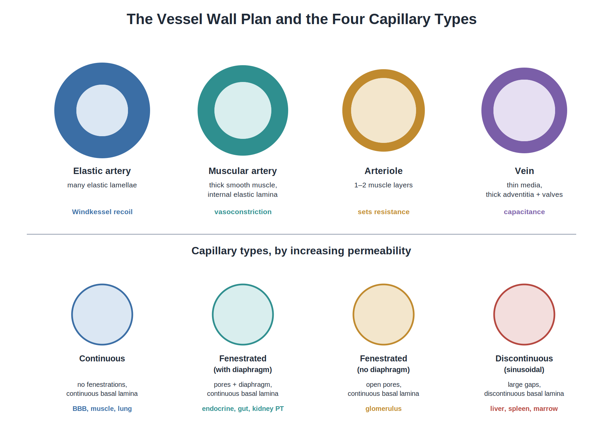
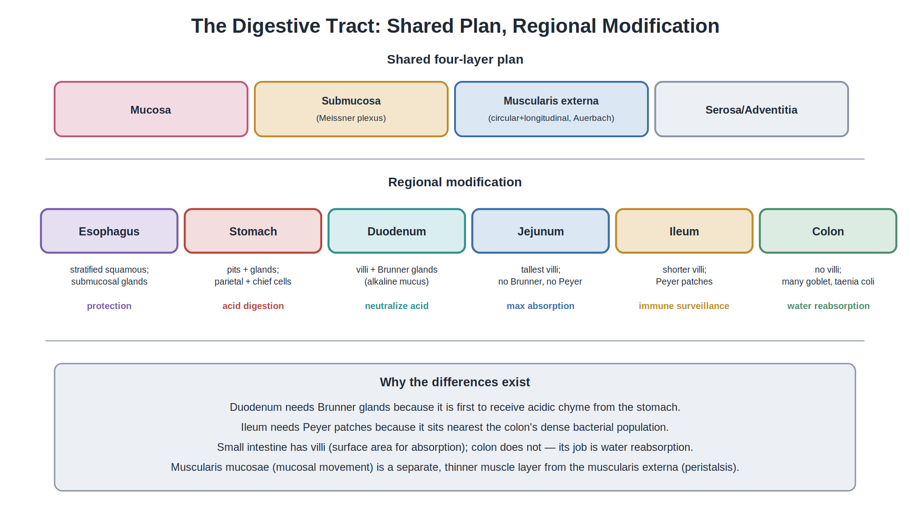

# Essential Histology

## *A Concept-Based Guide for PGME*

### Understanding the structure. Seeing the pattern. Distinguishing the alternatives. Retrieving the logic.

**Definitive Final Edition**

**AREMS-HY Academic Series**

*Built around Junqueira's Basic Histology: Text and Atlas, 17th Edition*

---

## Publication Note

This edition is an educational synthesis aligned with the sixteen-chapter examination scope defined for the 1405 Medical Specialty Examination. It is built primarily around Junqueira's Basic Histology, 17th Edition (Mescher AL, McGraw Hill), but it is an independent teaching text, not a reproduction. It is intended for educational use. Clinical decisions should always be based on appropriate clinical references and professional guidance.

## How to Use This Book

The book is organized to mirror how a capable learner actually reasons about a tissue, an organ, or a cell, rather than as a list of facts to memorize. Every major concept moves through a single chain that recurs throughout the text:

> **appearance → structure → composition → mechanism → function → recognition → distinction → clinical meaning → examination application.**

To use the book well, treat every chapter as a small intellectual journey. Begin with the opening question and the *Why this matters* block, but do not stop at "covering" them. The core teaching text is the *Build the System* section, which explains the mechanism; *See and Distinguish* is where you learn to recognize the slide; *Clinical Meaning* shows why the structure matters; and *Check your understanding* is where you prove that you can retrieve the knowledge without looking. The *Rapid Review* at the end of every chapter is a last-mile summary, not a substitute for the prose.

For long-term retention, close the book after each section and reconstruct the chain in your own words. The brain remembers what it reconstructs. Re-exposure without reconstruction produces familiarity without memory.

The central habit of this book is causal reasoning. Every structure exists because a problem demanded it. Every distinction matters because a confused examiner or a confused pathologist depends on it. Every clinical correlation is a chance to see histology at work, not a digression.

A note on Junqueira mapping. Each chapter heading carries the *Junqueira's Basic Histology, 17th Edition* chapter number it primarily corresponds to. The mapping is *one-to-one in scope* but not one-to-one in emphasis: this book teaches the same territory but reorganizes the order in which ideas are introduced when doing so makes the chain of reasoning clearer. Where Junqueira 17th has been updated on a specific point — for example, von Kossa as an indirect mineralization indicator, or PAS as a carbohydrate stain rather than a collagen stain — this book follows the modernized statement and explains why.

## Contents

1. Chapter 1 — Histology and Its Methods of Study *(Junqueira Ch. 1)*
2. Chapter 2 — The Cytoplasm *(Junqueira Ch. 2)*
3. Chapter 3 — The Nucleus *(Junqueira Ch. 3)*
4. Chapter 4 — Epithelium *(Junqueira Ch. 4)*
5. Chapter 5 — Connective Tissue *(Junqueira Ch. 5)*
6. Chapter 6 — Adipose Tissue *(Junqueira Ch. 6)*
7. Chapter 7 — Nerve Tissue *(Junqueira Ch. 9)*
8. Chapter 8 — Muscle Tissue *(Junqueira Ch. 10)*
9. Chapter 9 — The Circulatory System *(Junqueira Ch. 11)*
10. Chapter 10 — Blood *(Junqueira Ch. 12)*
11. Chapter 11 — Hemopoiesis and the Lymphoid System *(Junqueira Ch. 13, 14)*
12. Chapter 12 — The Gastrointestinal Tract *(Junqueira Ch. 15)*
13. Chapter 13 — Digestive Glands and Liver *(Junqueira Ch. 16)*
14. Chapter 14 — The Respiratory System *(Junqueira Ch. 17)*
15. Chapter 15 — Skin *(Junqueira Ch. 18)*
16. Chapter 16 — The Endocrine System *(Junqueira Ch. 20)*

*Supplementary Chapter 1 — Final Integrated Review*
*Supplementary Chapter 2 — Examination Practice*
*Supplementary Chapter 3 — Recognition Drills*
*Supplementary Chapter 4 — Final Preparation*

*Final Integrated Review · Examination Practice · Recognition Drills · Final Preparation*

## Before Chapter 1: What Histology Is

The body can be understood at several scales. The whole body is made of organs; organs are built from tissues; tissues are organized from cells and the extracellular matrix around them. The microscope becomes necessary when the structures responsible for function are too small, or too closely packed, to be resolved by the unaided eye. This is the practical reason histology exists: most of the molecular machinery that keeps the body alive lies below the threshold of unaided vision, and most of the diseases that affect it produce changes at this scale before they become clinically detectable.

The difficulty is that a tissue removed from the body is no longer being supplied with oxygen and nutrients. Within minutes, energy production falls, membrane pumps fail, intracellular chemistry changes, and the cell's own lysosomal enzymes begin to digest its contents — a process called autolysis. The specimen starts changing before the student ever sees it. The whole of histology technique is the controlled answer to this problem: the goal is to preserve tissue closely enough to its living organization that cells, extracellular matrix, boundaries, and relationships can still be interpreted, while making the tissue physically suitable for sectioning and providing enough contrast to make structures that would otherwise be transparent actually visible.

The preparation process is therefore a chain of linked problems: fixation, dehydration, clearing, infiltration and embedding, sectioning, and staining. Each stage exists because of what the next stage needs. Once this causal chain is clear, methods become easier to remember, and histologic artifacts become easier to interpret. The first chapter of this book builds that chain from the ground up, starting with the question of how a piece of soft, wet, rapidly self-destructing tissue becomes a slide that can sit on a microscope stage for years without changing.

---

# Chapter 1 — Histology and Its Methods of Study

*Corresponds to Junqueira's Basic Histology, 17th Edition, Chapter 1*

*The logic of contrast: fixation and staining reactions mapped to the molecular target each one detects. Five chemical classes of stain reveal five different molecular properties — never all of them at once.*

**Core Idea.** Every technique in histology — fixative, dye, microscope — reveals one specific chemical or physical property of the tissue and nothing else. A stained slide is a chemistry experiment, not a photograph of the tissue's intrinsic color. The single most important skill in histology is matching the technique to the question being asked.

## Opening Question

How does a pathologist turn a piece of tissue into a diagnosis that can be seen under a microscope — and why does the choice of stain decide what will, and what will not, be found?

## Why This Matters

Every biopsy is really a question aimed at the tissue: which molecule is accumulating, which cell is proliferating, which barrier is broken down, which organism is present? No single technique answers every question at once. The fixative, the solvent, the dye, and the microscope each expose one property of the tissue while concealing others. Understanding this logic is what prevents a wrong stain from becoming a missed diagnosis. A clinical case illustrates the practical consequence.

**Clinical Case.** A 45-year-old man presents with fatigue, hepatomegaly, and abnormal liver function tests. His differential diagnosis is broad: alcoholic fatty liver (accumulation of lipid), glycogen storage disease (accumulation of glycogen), hereditary hemochromatosis (accumulation of iron), or systemic amyloidosis (deposition of amyloid protein). On a routine H&E section alone, the liver may show only pale, swollen hepatocytes in all four conditions — essentially indistinguishable. The diagnosis depends entirely on which special stain is ordered. Fat requires a frozen section with Oil Red O; glycogen requires PAS with a diastase-sensitivity control; iron requires Prussian blue; amyloid requires Congo red examined under polarized light. Choosing the wrong stain, or omitting the special stain altogether, returns an unhelpful report.

## Learning Objectives

By the end of this chapter, you will be able to:

1. Explain the physical and chemical purpose of each step in tissue processing, and predict the artifact produced when a step is skipped or shortened.
2. Derive, from dye charge chemistry, why the nucleus stains blue and the cytoplasm stains pink in H&E, and why "basophilic" structures are acidic.
3. Match every special stain introduced in this chapter to its molecular target and state what each stain requires from processing.
4. Select the appropriate microscopy modality — phase-contrast, dark-field, fluorescence, confocal, polarizing, TEM, SEM, or freeze-fracture — for a stated investigative goal, and justify the choice.
5. Explain why light microscopy is resolution-limited to approximately 0.2 µm, and why electron microscopy exceeds that by orders of magnitude.
6. Interpret any staining pattern — basophilia, acidophilia, metachromasia, birefringence, an empty vacuole — as a statement about molecular content, not as an inherent color of the tissue.
7. Distinguish frozen section from paraffin section by what each preserves, what each sacrifices, and what each is used for in clinical practice.
8. Recognize common processing artifacts and their causes — shrinkage, vacuolation, fading, precipitate — and infer which step went wrong.

## The Two Problems Histology Solves

Fresh tissue is soft, transparent, and rapidly self-destructing. Histology exists to solve two problems at once.

The first problem is mechanical: make the tissue hard enough to cut into sections thin enough for light to pass through. A paraffin microtome can cut a 5 µm section; a cryostat can cut a frozen section of comparable thickness; an ultramicrotome can cut a 70 nm section. None of these can cut living tissue at room temperature, because living tissue is too soft, too wet, and too heterogeneous to hold a shape. So tissue must first be stabilized, dehydrated, replaced with a miscible supporting medium, and embedded.

The second problem is optical: create contrast that the eye or a detector can register. Most cells, in their natural state, are nearly transparent in visible light, because their refractive index is close to that of the cytoplasm around them. Stains, dyes, and metal impregnations solve this by selectively binding to specific chemical groups, selectively absorbing light, selectively precipitating within specific structures, or selectively altering the optical properties of the bound region.

These two problems are solved in sequence, and each step depends on the one before it. Fixation must come before dehydration, because unfixed tissue loses its structure as water leaves it. Dehydration must come before clearing, because paraffin and most embedding media are not miscible with water. Clearing must come before embedding, because the tissue must be able to accept the embedding medium. Embedding must come before sectioning, because unsupported tissue cannot be cut thin. Sectioning must come before staining, because the stain must reach the tissue through the section. The whole chain is a causal sequence, and the student who memorizes it as a vocabulary list will forget half of it; the student who understands it as a sequence of solved problems will remember it for life.

## The Core Principle

Each technique in histology reveals primarily the specific chemical or physical property it was designed to detect, and nothing else. A stained slide must be read as chemistry, not as magic color. This principle has four practical consequences that will recur throughout the book.

First, no single technique is universal. If you are looking for lipid, you cannot use a routine paraffin section — the lipid will already have been dissolved out by the alcohol and xylene steps. If you are looking for iron, Prussian blue is required; H&E will not tell you whether iron is present. If you need nanometer resolution, light microscopy is the wrong tool, no matter how good the optics. The correct question is always: *what information am I trying to reveal?*

Second, "absence" of a structure on a slide is not proof that the structure is absent in life. It may mean that the method removed it, or never made it visible. A hepatocyte full of glycogen looks empty on H&E; a frozen section is needed to confirm. An adipocyte looks empty on H&E; the lipid was dissolved during processing. The first question, when a structure is absent, is always whether the method removed it — not whether the tissue lacked it.

Third, color names carry no information about the underlying chemistry. "Blue nucleus" tells you only that a basic dye bound to acidic nuclear components. "Pink cytoplasm" tells you only that an acidic dye bound to basic cytoplasmic proteins. The color is a label, not an explanation. Every stain's value comes from knowing what it actually binds to.

Fourth, the apparent sharpness of a stain pattern reflects the chemistry, not the biology. A "well-stained" slide means that the dye has reached its target, has bound specifically, and has not been displaced or over-stained. It does not mean that the biology is intrinsically sharp. Many tissue structures are gradients, not boundaries.

## The Tissue Processing Chain — In Detail

The processing chain converts a fresh, wet, soft specimen into a hard, dry, stained section that can sit on a glass slide for years. Each step is a small chemical or physical problem whose solution enables the next step.

### Fixation

**Living tissue autolyzes.** The moment blood supply stops, the cell's own lysosomal enzymes — acid hydrolases active at pH 5, packaged in lysosomes — begin digesting cellular contents. Microbial enzymes from the gut, from skin flora, and from the surrounding environment join the process. Within minutes at room temperature, recognizable architecture begins to disappear. Fixation exists to stop this before it happens.

The general principle of fixation is cross-linking. Most routine fixatives form covalent bridges between proteins, locking the macromolecules in place so that they cannot diffuse, cannot be digested by endogenous enzymes, and cannot change shape during the subsequent processing steps. A secondary effect of cross-linking is hardening: the protein network becomes a gel, and the cell becomes mechanically resistant.

**Formalin** is the standard light-microscopy fixative. It is a roughly 37% aqueous solution of formaldehyde, used at about 10% (so about 3.7% actual formaldehyde) and buffered to near-neutral pH. Formaldehyde itself is a small, reactive aldehyde that forms methylene bridges (-CH2-) between amino groups (-NH2) and imino groups (-NH-) on adjacent proteins. The reaction is slow and reversible at first; over hours to days it produces a dense network of cross-links. Formalin preserves proteins adequately for routine morphology, preserves lipids poorly (so most lipid is lost later), and preserves fine ultrastructure only moderately (so it is inadequate for electron microscopy).

A critical point about formalin fixation: it is slow. Standard fixation requires several hours to overnight, and a delay of even half an hour at room temperature before immersion in formalin can leave autolysis artifact in the center of a large specimen. This is why large specimens are sliced open before fixation — to allow the fixative to penetrate quickly.

**Glutaraldehyde** is a dialdehyde — two aldehyde groups joined by a three-carbon chain. Its two aldehyde groups cross-link proteins far faster and more extensively than formaldehyde, and the resulting cross-links are more stable. Glutaraldehyde is the standard primary fixative for electron microscopy, where ultrastructural detail matters far more than processing speed. Because glutaraldehyde penetrates slowly and hardens tissue dramatically, it is rarely used for routine light microscopy.

**Osmium tetroxide** is a transition-metal oxide that binds the polar head groups of phospholipids in membranes, fixing lipid in place. As a heavy metal, osmium also scatters electrons strongly — which is exactly the property needed to generate contrast in the transmission electron microscope. Osmium thus functions simultaneously as a fixative and as an electron-dense stain, which is why EM protocols use glutaraldehyde first and osmium second: glutaraldehyde cross-links the proteins; osmium fixes the lipids and darkens the membranes.

**Other fixatives** exist for specific purposes. Bouin's fixative (picric acid plus formalin plus acetic acid) preserves delicate embryonic structures well but picric acid is explosive and the tissue must be washed thoroughly before processing. Carnoy's fixative (absolute ethanol, chloroform, glacial acetic acid) precipitates proteins and nucleic acids without cross-linking and is used when glycogen preservation is critical. Alcohol formalin and zinc formalin are alternatives for specific immunohistochemistry needs. Methacarn (methanol plus chloroform plus acetic acid) is used in molecular pathology. For most purposes in this book, the relevant fixative distinction is light-microscopy formalin versus electron-microscopy glutaraldehyde followed by osmium.

### Dehydration

Dehydration removes water from the tissue through an ascending series of ethanol — typically 70%, 80%, 95%, absolute — for reasons that are chemical, not arbitrary. The embedding medium, paraffin, is hydrophobic; it cannot infiltrate a wet tissue. Water must therefore be removed completely before paraffin can take its place.

The graded series is necessary because tissue shrinks when it loses water. Putting fresh tissue directly into absolute ethanol would cause violent shrinkage, distorting the cells. The graded series allows water to leave slowly, while ethanol progressively replaces it, so that the tissue reaches a state of being fully infiltrated with absolute ethanol without catastrophic collapse.

### Clearing

Clearing removes the ethanol with a solvent that is miscible both with ethanol and with paraffin. The traditional clearing agent is xylene, which has both properties. Other clearing agents include toluene, benzene (now avoided for toxicity), and various proprietary substitutes marketed as "xylene substitutes." Some modern protocols use isopropanol or other less toxic reagents.

The name *clearing* comes from the visual effect. The tissue, having been dehydrated, is opaque because the ethanol in it has a refractive index similar to cellular proteins. When xylene — which has a markedly different refractive index — replaces the ethanol, the tissue becomes translucent. This is a useful indicator of complete dehydration and complete clearing: a tissue that is not yet translucent still contains ethanol or water.

### Infiltration and Embedding

Infiltration is the penetration of the cleared tissue by the embedding medium. Embedding is the orientation and hardening of the infiltrated tissue into a block that can be cut. Paraffin is the most common embedding medium for routine histology. It is a mixture of long-chain hydrocarbons, melts at around 56–60 °C, and is solid at room temperature. Other embedding media include celloidin (used historically for hard tissues), various resins for EM (Epon, Araldite), and OCT compound for frozen sections.

The tissue is passed through molten paraffin in a paraffin oven, typically for one to several hours, then oriented in a mold, surrounded by fresh paraffin, and allowed to cool into a block. The block is then trimmed and mounted on a microtome.

### Sectioning

The paraffin block is cut on a microtome, a precision instrument that advances the block against a steel or tungsten blade in calibrated steps. Routine paraffin sections are about 5 µm thick, with a typical range of 3 to 10 µm depending on the tissue. Thinner sections give better resolution of small structures; thicker sections give more material per slide and are useful for certain stains.

For light microscopy of bone, tooth, or other very hard tissues, the paraffin method fails because the block shatters. These tissues are typically decalcified in acid or EDTA before paraffin processing. Alternative techniques include ground sections of undecalcified bone, where the bone is sliced and ground to a thin wafer.

For electron microscopy, the block is cut on an ultramicrotome at 50 to 90 nm, and the section is floated onto a small copper grid rather than a glass slide. Sections of this thickness are essentially transparent to light but scatter electrons strongly.

For frozen sections, the tissue is not embedded in paraffin. Instead, it is frozen rapidly, mounted in OCT compound, and cut on a cryostat — a microtome inside a freezer — at 5 to 10 µm. The advantage is speed: a frozen section can be produced and stained in 15 minutes, which is essential for intraoperative consultation. The disadvantages are inferior morphologic detail (ice-crystal artifact, less crisp nuclear morphology) and limited preservation of enzymes and lipids, which are largely destroyed by the paraffin process. Frozen sections are therefore used when time matters more than polish.

### Staining

Staining produces the visual contrast that lets the microscopist distinguish structures. The chemistry of staining is the heart of this chapter, because almost every stain used in histology has a specific molecular target, and the visible color is just the way that target reveals itself.

**Hematoxylin and eosin (H&E)** is the universal stain of histology. Almost every diagnosis begins on an H&E section, and most pathology textbooks assume it.

The mechanism of H&E is charge chemistry.

Hematoxylin itself is not a stain. It is extracted from the logwood tree and oxidized to hematein, which is the actual chromophore. Hematein is complexed with a metal mordant — aluminum in routine H&E — and the resulting positively charged dye-metal complex binds the negatively charged phosphate groups of nucleic acids. Because DNA and RNA both carry phosphate groups, both the nucleus and any ribosome-rich cytoplasm bind hematoxylin and appear blue-purple. The term for this affinity is *basophilia* — the structure binds a basic dye.

Eosin is an acidic dye, negatively charged, that exists in solution as an anion. It binds positively charged groups — primarily the basic amino acid side chains of proteins, particularly lysine, arginine, and histidine. Most cytoplasmic proteins are rich in such residues, so the cytoplasm stains pink. The binding of eosin is called *acidophilia* or *eosinophilia*. Connective tissue fibers (collagen) and muscle fibers also stain intensely pink because they are also protein-rich.

The naming is a deliberate trap. A basophilic structure is acidic (it is rich in acidic molecules — nucleic acids — that attract the basic dye). An acidophilic structure is basic (it is rich in basic amino acids that attract the acidic dye). The dye is named after its own charge, not after the tissue.

This is why a plasma cell's cytoplasm is basophilic: it is packed with rough endoplasmic reticulum and ribosomes, and the rRNA of those ribosomes carries enough negative phosphate charge to bind hematoxylin strongly. This is why a skeletal muscle fiber is eosinophilic: it is packed with contractile proteins whose basic residues bind eosin. The visible color is a direct report on the dominant macromolecule in that structure.

**Periodic acid–Schiff (PAS)** stains carbohydrate-rich structures. The mechanism is oxidation followed by Schiff reaction. Periodic acid oxidizes the 1,2-glycol groups (-CHOH-CHOH-) of hexose sugars to aldehydes (-CHO-CHO-). The Schiff reagent — a leucofuchsin — then binds these aldehydes and produces a magenta color.

PAS marks carbohydrate-rich structures: glycogen, mucin (both neutral and some acidic mucins), basement-membrane glycoproteins, fungal cell walls, and some reticular fiber preparations. A critical point: PAS is not a collagen stain. A basement membrane is PAS-positive because of its carbohydrate-rich components — laminin, perlecan, entactin, and other glycoproteins associated with the type IV collagen network — not because PAS detects collagen directly. This distinction matters when interpreting basement-membrane pathology.

A useful diagnostic trick is PAS-with-diastase. Diastase (or salivary amylase) digests glycogen. If a PAS-positive material remains after diastase digestion, it is not glycogen. If the PAS positivity disappears, glycogen was the responsible component. This is how glycogen storage diseases are distinguished from mucin accumulation on a liver biopsy.

**Silver impregnation** is a family of techniques based on the ability of certain structures to reduce silver ions (Ag+) to metallic silver (Ag0), which precipitates as a black deposit. The most important silver stain in histology is the reticular fiber stain, which produces a black network wherever reticular fibers are present. Because reticular fibers are built from type III collagen, silver-positive reticular fiber is essentially synonymous with type III collagen as it appears in delicate stromal frameworks.

Several silver techniques exist. The *argyrophilic* methods require an external reducing agent (the silver is reduced by the reagent, not by the tissue). The *argentaffin* methods rely on the tissue itself reducing silver (melanin, for example, is argentaffin). Reticular fiber stains are argyrophilic; argentaffin terminology is more often used in describing endocrine cells.

**Masson trichrome** is a three-color stain that distinguishes collagen from muscle. The tissue is stained with a small dye (often Biebrich scarlet-acid fuchsin), then differentiated in phosphomolybdic acid, then counterstained with aniline blue (or light green, depending on the protocol). Collagen, which is more porous than cytoplasm, retains the aniline blue and stains blue or green; muscle, cytoplasm, and other proteins retain the red small dye and stain red. Trichrome is the standard stain for assessing fibrosis in liver, heart, kidney, and other tissues.

**Orcein and Verhoeff-Van Gieson** are elastic stains. Elastic fibers — built from an elastin core surrounded by fibrillin microfibrils — stain brown-black with orcein and blue-black with Verhoeff. They are useful for assessing the integrity of the elastic laminae in arteries, the elastic network in the dermis, and the elastic cartilage matrix.

**Oil Red O and Sudan dyes** are lipid-soluble dyes that dissolve into intracellular lipid droplets. They are not water-soluble in any useful sense; they partition preferentially into lipid. The crucial processing requirement is that the lipid must still be present in the tissue at the time of staining — which means frozen sections are required, because routine paraffin processing has already dissolved the lipid away with the alcohol and xylene. On a frozen section stained with Oil Red O, neutral lipid appears bright red-orange; on a routine paraffin section, the same adipocyte appears as an empty vacuole. The cell is not empty; the lipid was simply washed away.

**Congo red** is the stain for amyloid. Amyloid is a generic term for proteins that have misfolded into a β-sheet fibrillar structure and accumulated extracellularly. Congo red binds these fibrils in a regular, oriented manner, and when the section is viewed under crossed polarizing filters, the oriented dye produces a characteristic apple-green birefringence. The diagnosis of amyloid is not Congo red staining alone — collagen is also birefringent, though white, not green — but the combination of Congo red staining plus apple-green birefringence.

**Prussian blue (Perls)** is a direct chemical reaction, not a dye binding. Ferric iron (Fe³⁺) in the tissue reacts with potassium ferrocyanide to form ferric ferrocyanide, an insoluble blue precipitate. The stain demonstrates hemosiderin and other ferric iron deposits. Iron deficiency can be diagnosed on a bone marrow biopsy by the absence of Prussian blue staining.

**Von Kossa** is a silver-substitution method for demonstrating mineralized deposits, particularly in bone and pathologic calcifications. Silver nitrate reacts with phosphate and carbonate anions that are already precipitated in the tissue, replacing them with silver, which is then reduced to black metallic silver. Von Kossa does *not* stain calcium directly — it stains the anions of a mineral deposit, and the biology tells you that the cations are most likely calcium. Von Kossa is properly reported as a positive mineralization indicator, not as a calcium stain.

A common error in student work is to say "von Kossa stains calcium." It does not. The misconception matters because a pathologist asked whether calcium is present should use a method that detects calcium more directly (such as alizarin red), not von Kossa.

**Alcian blue** stains acidic mucins and other polyanionic carbohydrates. At pH 2.5, both sulfated and carboxylated glycosaminoglycans bind the dye, producing blue staining. Used in combination with PAS, it distinguishes neutral mucins (PAS-positive, Alcian blue-negative) from acidic mucins (both positive).

**Feulgen** is a DNA-specific stain. Mild acid hydrolysis removes the purine bases from DNA, exposing aldehyde groups on the deoxyribose. The Schiff reagent then binds these aldehydes to produce a magenta color proportional to DNA content. Feulgen is used in flow cytometry and image cytometry for DNA quantification — the basis of ploidy analysis.

### Organizing the Stains by Mechanism

The list of stains is long. The list of *mechanisms* is short. Organizing stains by mechanism is more useful than memorizing each one in isolation.

| Mechanism | Examples | What it reveals |
|---|---|---|
| Charge attraction (basic dye binds acidic targets) | Hematoxylin in H&E | Nucleic acids, RER-rich cytoplasm, mast cell granules |
| Charge attraction (acidic dye binds basic targets) | Eosin in H&E | Most cytoplasmic proteins, collagen, muscle |
| Oxidation followed by Schiff reagent | PAS, Feulgen | Carbohydrates (PAS), DNA (Feulgen) |
| Metal reduction | Silver stains (reticular fiber), Von Kossa | Reticular fibers, mineralized deposits |
| Solubility (dye partitions into lipid) | Oil Red O, Sudan | Neutral lipid |
| Birefringence after oriented dye binding | Congo red + polarized light | Amyloid |
| Direct chemical reaction | Prussian blue | Ferric iron |
| Antigen–antibody binding | Immunohistochemistry, immunofluorescence | Specific proteins (Ki-67, cytokeratins, etc.) |
| Nucleic acid hybridization | FISH, ISH | Specific DNA or RNA sequences |
| Isotope incorporation | Autoradiography (³H-thymidine) | Active DNA synthesis |

If you know the mechanism, you can predict what a stain will and will not show. If you know only the name, you must memorize each stain's target — which is fragile.

## Microscopy — Choosing the Right Tool for the Question

Microscopy is applied optics. Each form of microscopy uses a different physical property to generate an image, and each is therefore suited to different questions. A common student error is to think of microscopy as "more magnification = more power." Magnification without resolution produces only a bigger blur. The resolution of a microscope is the minimum distance at which two points can still be seen as separate, and it is set by the wavelength of the radiation used and the numerical aperture of the optics, not by how much an image is enlarged.

### Light Microscopy

Standard bright-field light microscopy uses visible light (wavelength about 400–700 nm), glass optics, and a series of lenses. The theoretical resolution limit is about 200 nm (0.2 µm), set by the wavelength of visible light. This is sufficient to see nuclei, nucleoli, cytoplasmic organelles in favorable cases, mitotic figures, and the architectural relationships of tissues. It is not sufficient to see ribosomes, individual cytoskeletal filaments, or the internal structure of organelles.

The bright-field microscope is the workhorse of histology. Almost all the slides a pathologist or a student looks at are bright-field preparations of H&E or special-stained sections.

**Phase-contrast microscopy** exploits the small differences in refractive index between cellular structures to generate contrast in unstained, living cells. It is the standard tool for observing cells in culture, where staining would kill them. Phase contrast converts phase differences in light passing through the cell into amplitude differences in the image.

**Dark-field microscopy** uses scattered light to generate contrast. The condenser illuminates the specimen obliquely; only light scattered by the specimen enters the objective, so the background is black and the specimen appears bright. Dark-field is the technique of choice for visualizing spirochetes (such as *Treponema pallidum*, the agent of syphilis), which are too thin to be resolved by bright-field light microscopy.

**Fluorescence microscopy** excites fluorochromes in the specimen with a specific wavelength of light and detects the longer-wavelength emitted light. It can be highly specific if the fluorochrome is coupled to an antibody (immunofluorescence) or to a nucleic acid probe (FISH). It can also be used with dyes that bind specific cellular components (DAPI for DNA, phalloidin for F-actin).

**Confocal microscopy** uses a pinhole in the image plane to reject out-of-focus light, producing optical sections of a thick specimen. A Z-series of confocal sections can be reconstructed into a three-dimensional image. Confocal is essential when a structure of interest lies deep in a thick specimen — the developing brain, for example, or a whole-mount embryo.

**Polarized light microscopy** uses crossed polarizing filters to detect birefringent materials — substances whose refractive index differs in different directions. Birefringent materials (collagen, amyloid, cholesterol crystals, foreign material) appear bright against a dark background. Polarized microscopy is essential in the identification of amyloid (apple-green birefringence with Congo red), foreign material (talc, silica, suture), and crystals.

### Electron Microscopy

**Transmission electron microscopy (TEM)** uses a beam of electrons instead of a beam of light. Because electrons have a wavelength thousands of times shorter than visible light (about 0.005 nm at typical accelerating voltages, much shorter than visible light at 400–700 nm), the theoretical resolution is on the order of 0.1 nm — about a thousand times better than light microscopy. In practice, the achievable resolution in biological TEM is about 1–2 nm because of section thickness, staining, and instrument limits, but this is still sufficient to resolve membranes, ribosomes, mitochondrial cristae, nuclear pores, and individual cytoskeletal filaments.

TEM requires very thin sections (50–90 nm), heavy-metal staining (uranyl acetate and lead citrate, which bind to membranes and proteins), and vacuum (because electrons do not travel far in air). Specimens must be fixed in glutaraldehyde followed by osmium, dehydrated, and embedded in a hard resin (Epon or Araldite). The sections are mounted on small copper grids and imaged by detecting the electrons that pass through them.

**Scanning electron microscopy (SEM)** scans the surface of a specimen with a focused electron beam and detects the secondary electrons emitted from the surface. SEM produces striking three-dimensional images of surfaces, with resolution in the 1–10 nm range. It is the standard tool for visualizing the surface of cells, cilia, microvilli, and intracellular structures that have been exposed by fracture or microdissection. SEM does not image internal structure in the way TEM does; it images what is on the surface of the specimen.

**Freeze-fracture** is a special preparation technique that splits a membrane through its hydrophobic interior. The frozen specimen is fractured; the fracture plane preferentially follows the path of least resistance, which is the middle of the lipid bilayer. This exposes the two leaflets of the membrane — the P-face (the inner leaflet's outer face) and the E-face (the outer leaflet's inner face) — along with the intramembrane particles (mostly integral membrane proteins) that are embedded in them. Freeze-fracture is the classical method for visualizing the distribution of integral membrane proteins and the architecture of tight junctions.

## A Clinical Reasoning Chain for Choosing Methods

When you receive a slide and need to interpret it, the methodology chapter matters as much as the histology chapter. The following decision logic, used by pathologists daily, can be reconstructed from the principles above.

Step 1: *What fixative and what embedding?* Paraffin-embedded H&E means routine histology; frozen section means speed at the cost of detail; glutaraldehyde-osmium means electron microscopy; bone in ground section means undecalcified bone architecture.

Step 2: *What stain?* H&E for general architecture; PAS for carbohydrates and basement membranes; trichrome for collagen versus muscle; silver for reticular fibers; Congo red for amyloid; Oil Red O on frozen for lipid; Prussian blue for iron; von Kossa for mineralization; immunostains for specific antigens.

Step 3: *What microscope?* Bright-field for routine; fluorescence for specific localization; polarized for birefringent material; phase-contrast for live cells; TEM for ultrastructure; SEM for surfaces.

Step 4: *What is the question the tissue is asking?* If you do not know what the question is, the choice of method is a guess. If you do know, the method is forced.

## Common Artifacts and Their Causes

A surprising amount of histology is the recognition of artifacts — features on the slide that are products of processing rather than properties of the tissue. The student who cannot recognize artifacts will misinterpret them as pathology.

| Artifact | Cause | Recognition |
|---|---|---|
| Tissue shrinkage, retraction from edges | Over-fixation, hot paraffin, slow dehydration | Empty space between tissue and edge of section |
| Nuclear shrinkage, hyperchromasia | Over-fixation in formalin | Small, dark, angular nuclei |
| Vacuolation of cytoplasm | Slow fixation (autolysis before cross-linking), poor dehydration | Empty spaces in cytoplasm that do not stain with lipid stains |
| Chromatin fading, pale nuclei | Under-fixation, prolonged storage in alcohol | Pale, washed-out nuclei |
| Precipitate on slide (especially with silver stains) | Dirty reagents, old solutions, prolonged staining | Sharp black or colored dots throughout the section |
| Section folding, wrinkles | Dull blade, hot stage, inexperienced sectioning | Folds and tears in the section |
| Chatter (alternating thick and thin bands) | Loose block, dull blade, vibration | Parallel bands across the section |
| Ice-crystal artifact (frozen sections) | Slow freezing | Empty round holes in the tissue |

## Common Misconceptions

Several misconceptions about histology methods recur in student work. Each deserves explicit correction.

*Clearing removes water.* It does not. Dehydration (ethanol) removes water; clearing (xylene) removes ethanol and renders the tissue miscible with paraffin. Each step exists because no single reagent bridges water directly to paraffin.

*Von Kossa stains calcium.* It demonstrates the phosphate and carbonate anions of a mineral deposit through silver substitution. Calcium is inferred, not directly detected. The correct terminology is "mineralization, von Kossa-positive (indirect)."

*More magnification means more resolution.* Resolution is the minimum distance at which two points can still be seen as separate, and it is set by wavelength and numerical aperture, not by how much an image is enlarged. Magnifying past the resolution limit only produces a bigger blur — "empty magnification."

*H&E shows everything important.* H&E shows only the distribution of charge. Lipid content, glycogen, reticular fibers, elastic fibers, iron, mineral, and amyloid are all invisible on H&E and require a targeted special stain.

## Integrated Summary

Histology begins by solving two problems at once: making a fragile, transparent tissue rigid enough to cut, and giving it contrast the eye can read. Processing is a miscibility ladder — water to alcohol to xylene to paraffin — in which each reagent exists only to bridge to the next, while fixation cross-links proteins so autolysis cannot proceed. Staining is applied chemistry: charge attraction, oxidation followed by Schiff reagent, metal reduction, selective solubility, birefringence, antigen–antibody binding, nucleic-acid hybridization, and isotope incorporation are the mechanisms behind every stain in this chapter. Microscopy, in turn, is applied optics — refractive index, fluorescence, birefringence, and electron scattering are simply different ways of generating an image. The unifying skill of this chapter is choosing the fixative, stain, and microscope that answer one specific molecular question, because no single technique is universal.

## Reasoning Through a Case

A surgical pathology sample arrives labeled only "skin lesion, rule out melanoma versus dermatofibroma." Before any diagnosis can be made, the tissue must survive processing intact enough to answer the question.

*Appearance.* On the H&E slide, the epidermis looks normal, but a deeper dermal population of spindle cells stains unexpectedly pale, and a separate melanocytic population shows unusually dark, atypical nuclei.

*Structure.* The pale spindle cells sit in whorled bundles; the atypical cells are dendritic and pigmented.

*Composition.* Pale spindle cells are typically rich in collagen-producing machinery; pigmented cells contain melanosomes.

*Mechanism.* Melanin synthesis begins with tyrosinase oxidizing tyrosine; a dysregulated melanocyte can overproduce and mis-package this pigment.

*Function.* Normal melanocytes protect nuclear DNA from ultraviolet damage; here, that protective role has been lost to unchecked proliferation.

*Recognition.* The decisive clue is nuclear atypia in the pigmented population, not simply the presence of pigment.

*Distinction.* A benign fibrous proliferation (dermatofibroma) would show uniform, bland spindle cells without melanocytic atypia.

*Clinical meaning.* The combination of architectural disorder and cytologic atypia in a melanocytic population is what separates a melanoma from a benign lesion.

*Examination application.* A question describing "atypical, dendritic, pigmented cells with an irregular junctional pattern" is testing exactly this chain, not simply asking whether pigment is present.

The lesson generalizes: a stain or a cell type is never diagnostic by itself. It becomes diagnostic only once it is placed inside this full chain, from appearance to examination application.

## Check Your Understanding

1. Explain why dehydration and clearing are performed as two separate steps rather than one.
2. A plasma cell is intensely basophilic while skeletal muscle is eosinophilic. Explain this from the dominant macromolecule in each cell and the underlying dye chemistry.
3. A researcher wants to distinguish active DNA synthesis, total DNA amount, and a general proliferation marker. Compare ³H-thymidine autoradiography, the Feulgen reaction, and Ki-67 immunohistochemistry for this purpose.
4. Why does visualizing podocyte foot-process effacement in minimal change disease require electron microscopy rather than light microscopy?
5. How would you distinguish the birefringence of amyloid from the birefringence of collagen under polarized light?
6. Why does freeze-fracture split a membrane into two faces rather than separating the membrane cleanly from the cytoplasm?
7. A cell shows a single large clear space and a flattened, peripheral nucleus on H&E. What is the safest interpretation, and how would you confirm it?
8. A liver biopsy shows pale, swollen hepatocytes with little else distinctive on H&E. What four special stains would you order to evaluate fatty change, glycogen, iron, and amyloid, and what would each require from processing?
9. Why is a frozen section used for intraoperative consultation despite producing inferior morphologic detail?
10. A bone-marrow biopsy is processed for routine paraffin embedding but arrives at the laboratory several hours after the biopsy was performed. Predict the most likely artifact and explain its mechanism.

## Bridge

Tissue is now prepared and stained. The next step is to look inside the structure every stain in this chapter has been lighting up — the machinery of the cell itself, beginning with the cytoplasm. The vocabulary introduced here (organelles, membranes, RER, Golgi, lysosomes, mitochondria, cytoskeleton) will be developed in Chapter 2 and then re-used in every subsequent chapter, because every tissue in the body is built from cells that all use the same internal machinery.

## Rapid Review

**Processing sequence:** fixation (formalin for LM; glutaraldehyde then osmium for EM) → dehydration (ethanol removes water) → clearing (xylene removes ethanol) → embedding (paraffin) → sectioning (≈5 µm for LM, 50–90 nm for EM).

**H&E:** hematoxylin (basic) binds DNA/RNA phosphate → blue, basophilic. Eosin (acidic) binds basic protein residues → pink, acidophilic.

**Special stains by target:** PAS → carbohydrate (magenta). Silver → reticular fiber, type III collagen (black). Trichrome → collagen (blue/green) versus muscle (red). Orcein/Verhoeff → elastic fiber. Oil Red O → lipid, requires a frozen section. Congo red + polarized light → amyloid (apple-green). Perls → iron (blue). Von Kossa → mineral phosphate/carbonate, indirect (black). Alcian blue → acidic mucin. Feulgen → DNA.

**Microscopy by purpose:** phase-contrast for live cells, confocal for optical sectioning of thick tissue, TEM for internal ultrastructure at ~0.1 nm, SEM for surface topography, freeze-fracture for membrane faces (P-face and E-face).

**Frozen sections** trade morphologic quality for speed and preservation of lipid and enzyme activity; **paraffin sections** trade speed for the best routine morphology.

---

# Chapter 2 — The Cytoplasm

*Corresponds to Junqueira's Basic Histology, 17th Edition, Chapter 2*

*The endomembrane system and the secretory pathway: rough ER synthesizes proteins, the Golgi modifies and sorts them, transport vesicles move cargo, the plasma membrane and lysosomes receive the appropriate subsets, and mitochondria supply ATP for all of it.*

**Core Idea.** A eukaryotic cell solves the problem of molecular crowding by using membranes to create distinct chemical microenvironments, and solves the problem of movement by using cytoskeletal tracks and their associated motor proteins. The cytoplasm is not the chaotic soup of older biochemistry textbooks; it is a compartmented, vectorial, energy-consuming machine.

## Opening Question

How does a single cell build, modify, sort, and ship thousands of different proteins to dozens of different destinations without ever mixing them up — and what does each organelle actually contribute to that traffic?

## Why This Matters

The same machinery is at work in every cell of the body. A pancreatic acinar cell secretes digestive enzymes; a plasma cell secretes antibody; a hepatocyte secretes albumin and clotting factors; a thyroid follicular cell secretes thyroglobulin; a neuron secretes neurotransmitter. The visible differences between these cells are mostly differences in the *output*, not in the *machinery*. When the machinery fails, disease follows a predictable logic: Kartagener syndrome from immotile cilia, I-cell disease from lysosomal enzymes that never reach the lysosome, microvillus inclusion disease from a broken actin scaffold, and many storage diseases from specific lysosomal hydrolase deficiencies. All of these are, at heart, cytoplasmic trafficking failures, and they can be understood only if the machinery is understood.

## Learning Objectives

By the end of this chapter, you will be able to:

1. Describe membrane flow from the rough ER through the Golgi apparatus to its destinations, and explain how signal sequences, SRP, the translocon, M6P tagging, and other targeting signals determine where each protein ends up.
2. Distinguish the rough endoplasmic reticulum, smooth endoplasmic reticulum, Golgi apparatus, lysosome, peroxisome, and mitochondrion by structure, function, dominant enzyme, and appearance on a routine slide.
3. Classify the three cytoskeletal filament systems by diameter, protein composition, dynamics, polarity, associated motors, and cellular roles.
4. Explain why basophilic cytoplasm indicates RER-rich protein-synthesis activity, and predict the appearance of a cell given its secretory role.
5. Predict the cellular consequence of defects in specific components: a microtubule motor, a dynein arm, the M6P-tagging enzyme, a peroxisomal targeting sequence.
6. Read a transmission electron micrograph of a typical cell and identify each organelle from its structural signature.
7. Explain why a plasma cell is intensely basophilic, why a skeletal muscle fiber is intensely eosinophilic, and why a steroid-producing cell has a foamy cytoplasm on routine H&E.

## The Cytoplasm as a Compartmented System

The cytoplasm is conventionally divided into four components: the *cytosol* (the aqueous solution of proteins, metabolites, and ions that surrounds the organelles), the *organelles* (membrane-bound compartments with specialized chemistry), the *cytoskeleton* (filamentous scaffolding that organizes space and provides tracks for movement), and *inclusions* (non-living stored material such as glycogen, lipid droplets, or pigment).

The membrane-bound organelles together solve the fundamental problem of eukaryotic life: how to keep incompatible chemistries in the same cell at the same time. A lysosomal hydrolase, an oxidative mitochondrial enzyme, and a nuclear transcription factor would destroy each other in a common cytoplasmic soup. By confining each set of enzymes inside its own membrane, the cell can run dozens of incompatible reactions simultaneously without interference.

The cytoskeleton solves the complementary problem: how to give the cytoplasm shape, how to move cargo between organelles, how to move the whole cell, and how to divide the cell into two. Microfilaments, intermediate filaments, and microtubules are the three systems, each with its own protein chemistry, its own motor proteins, and its own preferred jobs. The cytoskeleton is not a static scaffold; it is constantly built, broken, and rebuilt as the cell changes shape, divides, and responds to its environment.

## The Endomembrane System and the Secretory Pathway

The most important principle in cytoplasmic organization is the *endomembrane system*. The nuclear envelope, the rough endoplasmic reticulum, the smooth endoplasmic reticulum, the Golgi apparatus, transport vesicles, endosomes, lysosomes, and the plasma membrane are not isolated compartments — they are continuous or transiently connected parts of a single dynamic system. Membranes flow between them; vesicles bud from one compartment and fuse with another; proteins and lipids travel along this flow in a vectorial, directional way.

The classic example is the secretory pathway, which moves a protein from the ribosome to the extracellular space in a defined sequence of steps.

Step 1: Synthesis on free ribosomes. All proteins begin on ribosomes in the cytosol. The first decision — destination — is made here. A protein destined for the cytosol, the nucleus, a mitochondrion, or a peroxisome is completed on free ribosomes and released into the cytosol. A protein destined for the secretory pathway, the lysosome, or the plasma membrane begins with a short signal sequence at its amino terminus that marks it for entry into the ER.

Step 2: Targeting to the ER. The signal sequence is recognized by the signal recognition particle (SRP), which pauses translation and directs the ribosome-mRNA-polypeptide complex to the SRP receptor on the ER membrane. The ribosome is then handed to the *translocon*, a protein channel that opens in the ER membrane. Translation resumes, and the growing polypeptide is fed through the translocon into the ER lumen. For integral membrane proteins, specific hydrophobic transmembrane sequences in the polypeptide stop the translocation and embed the protein in the ER membrane, with different orientations depending on the sequence.

Step 3: Processing in the ER lumen. Inside the ER, the protein folds, forms disulfide bonds, is N-glycosylated (carbohydrate chains are added to asparagine residues), and is checked by quality-control machinery. Misfolded proteins are retained in the ER and eventually degraded. Properly folded proteins are packaged into transport vesicles that bud from ER exit sites.

Step 4: Transport to the Golgi. Transport vesicles carry the protein from the ER to the *cis* face of the Golgi apparatus. The Golgi is a stack of flattened, curved cisternae with a defined polarity: the cis face receives vesicles from the ER, the medial cisternae perform sequential modifications, and the trans face packages finished proteins into vesicles that bud from the *trans-Golgi network* (TGN).

Step 5: Modification in the Golgi. As the protein moves from cis to medial to trans Golgi, additional modifications occur: further glycosylation (trimming and remodeling of the N-linked sugars, addition of O-linked sugars to serine and threonine), sulfation, phosphorylation, and proteolytic cleavage in some cases.

Step 6: Sorting in the TGN. The TGN is the cell's main sorting station. Different cargoes are packaged into different vesicles according to their targeting signals. Proteins destined for secretion are packaged into *constitutive* secretory vesicles (which fuse with the plasma membrane continuously) or *regulated* secretory vesicles (which store the protein until a specific signal triggers release). Proteins destined for the lysosome are tagged with *mannose-6-phosphate* (M6P), which is added in the cis-Golgi and recognized by M6P receptors in the TGN; the resulting vesicles traffic to late endosomes, which mature into lysosomes. Proteins destined for the plasma membrane are packaged into vesicles that fuse with the membrane and either become part of it or are released into the extracellular space.

Step 7: Destination. The protein reaches its final location. Secreted proteins are released; lysosomal enzymes join their hydrolase colleagues in the acidic lysosomal lumen; plasma-membrane proteins integrate into the membrane.

The single most important conceptual point: the protein never crosses a barrier it does not need to cross, and it is *sorted* at every step. The same ER, the same Golgi, the same vesicle-budding machinery, the same fusion machinery serves every cell. What differs between cell types is which proteins are made, which tags are added, and which destinations are chosen.

## The Rough Endoplasmic Reticulum

The rough endoplasmic reticulum (RER) is a continuous network of flattened membrane sacs (*cisternae*) studded with ribosomes on its cytoplasmic face. The ribosomes give the membrane its "rough" appearance on electron micrographs. On light microscopy, the abundance of RER plus its associated ribosomes makes the cytoplasm intensely basophilic — the RNA of the ribosomes carries enough negative phosphate charge to bind hematoxylin strongly.

The RER is the site of synthesis of:

- All proteins destined for secretion (digestive enzymes, hormones, antibodies, plasma proteins, extracellular matrix proteins)
- All proteins destined for the plasma membrane (receptors, channels, transporters)
- All proteins destined for the endomembrane system itself (Golgi enzymes, lysosomal hydrolases, ER-resident chaperones)

The signal-recognition particle (SRP), the SRP receptor, and the translocon together ensure that these proteins enter the ER lumen (or membrane) co-translationally. Inside the ER, the protein is folded, disulfide-bonded, and N-glycosylated. Quality control ensures that misfolded proteins do not exit; their accumulation triggers the unfolded protein response.

Three diseases illustrate what happens when RER function fails:

- *I-cell disease* (mucolipidosis II): a defect in the enzyme that attaches M6P to lysosomal enzymes. The enzymes are still synthesized in the RER, still pass through the Golgi, but are not tagged correctly. They are misrouted to the extracellular space. Lysosomes accumulate undigested substrate as inclusion bodies, and serum levels of lysosomal enzymes rise. The disease is named for the appearance of these inclusions.
- *α1-Antitrypsin deficiency*: a misfolded protein accumulates in the ER of hepatocytes, forming eosinophilic cytoplasmic inclusions visible on H&E. The misfolded protein cannot be secreted, so the patient lacks circulating α1-antitrypsin and develops emphysema and liver disease.
- *Congenital disorders of glycosylation*: defects in the N-glycosylation pathway produce poorly glycosylated proteins that fail quality control, are retained in the ER, and never reach their destinations.

## The Smooth Endoplasmic Reticulum

The smooth endoplasmic reticulum (SER) is a continuous network of tubular membrane that lacks ribosomes. It is continuous with the RER, but it is biochemically distinct.

The SER carries out:

- *Lipid and steroid synthesis*. The enzymes of fatty acid synthesis, phospholipid synthesis, and steroid synthesis are concentrated in the SER. Cells that synthesize large amounts of lipid or steroid — hepatocytes, adrenocortical cells, Leydig cells of the testis, granulosa cells of the ovary — have abundant SER.
- *Detoxification of drugs and xenobiotics*. The cytochrome P450 family of monooxygenases, which oxidize lipid-soluble drugs to make them water-soluble and excretable, is concentrated in the SER of hepatocytes. Chronic exposure to drugs that are metabolized by P450 (alcohol, barbiturates, phenytoin) induces SER proliferation, visible on histology as expanded eosinophilic cytoplasm in hepatocytes.
- *Calcium storage and release*. In skeletal muscle, the SER is specialized as the *sarcoplasmic reticulum*, which stores calcium and releases it upon stimulation to trigger contraction. In other cell types, the SER contributes to intracellular calcium signaling.
- *Glucose-6-phosphatase activity*. In hepatocytes, the SER carries the glucose-6-phosphatase enzyme that completes gluconeogenesis and glycogenolysis by removing the phosphate from glucose-6-phosphate, allowing free glucose to be released into the blood.

The SER does not stain with hematoxylin (no ribosomes) and stains only lightly with eosin (membranes are not as protein-rich as cytoplasm). On routine H&E, cells with abundant SER often have a *foamy* or *vacuolated* appearance because the membrane content of the SER is extracted during paraffin processing, leaving empty spaces.

## The Golgi Apparatus

The Golgi apparatus is a stack of flattened, curved cisternae — typically four to eight in number — with a defined polarity. The *cis* face receives vesicles from the ER; the *medial* cisternae perform intermediate modifications; the *trans* face packages finished cargo into vesicles that bud from the *trans-Golgi network* (TGN).

On electron micrographs, the Golgi is unmistakable: a stack of smooth, curved sacs with vesicles budding from both rims. The convex cis face and the concave trans face give the stack a recognizable shape. On light microscopy of well-preserved specimens, the Golgi can sometimes be seen as a *negative image* — a clear, unstained area next to the nucleus — because the lipids of its membranes are partially extracted during processing and the area does not stain strongly with either hematoxylin or eosin.

The Golgi's three main jobs are:

- *Modification of cargo*. Further glycosylation (trimming and remodeling of N-linked sugars, addition of O-linked sugars), sulfation of glycoproteins and glycolipids, phosphorylation of certain lysosomal enzymes (the M6P tag), and proteolytic cleavage of some pro-hormones.
- *Sorting of cargo*. The TGN packages different cargoes into different vesicles. The molecular addresses that determine packaging include M6P (for lysosomal enzymes), signal peptides for regulated secretion (for hormones like insulin that are stored before release), and default pathways for constitutive secretion and plasma-membrane delivery.
- *Synthesis of complex polysaccharides*. The Golgi synthesizes the glycosaminoglycan chains of proteoglycans and the oligosaccharides of glycolipids.

A pancreatic acinar cell, which synthesizes massive amounts of digestive enzyme, has an enormous Golgi visible by light microscopy as a perinuclear clear zone. A plasma cell, which secretes antibody more slowly, has a less prominent Golgi.

## Lysosomes

Lysosomes are membrane-bound organelles containing *acid hydrolases* — enzymes that function at an acidic pH (around 5) maintained by a proton pump (a vacuolar H⁺-ATPase) in the lysosomal membrane. The acidic interior is essential because these enzymes are misnamed by neutral pH: at neutral pH they are inactive. The membrane protects the rest of the cell from the enzymes, and the acidic lumen activates them when they reach their destination.

The lysosomal enzymes include proteases, lipases, glycosidases, nucleases, and phosphatases. *Acid phosphatase* is the classic histochemical marker for lysosomes; in modern practice, lysosomal membrane proteins (LAMP-1, LAMP-2) or cathepsins are used as immunocytochemical markers.

Lysosomes are formed by the maturation of late endosomes that have received M6P-tagged hydrolases from the TGN. The M6P receptor is recycled back to the TGN or the plasma membrane; the hydrolases remain in the maturing lysosome.

A *primary lysosome* contains only hydrolases, freshly budded from the TGN, with no substrate yet. A *secondary lysosome* has fused with a substrate — a phagosome containing engulfed material, an autophagosome containing worn-out organelles, or a residual body containing indigestible residue. Residual bodies accumulate with age in long-lived cells (neurons, cardiac myocytes); the *lipofuscin* pigment that gives older tissues their yellow-brown color is the residue of lysosomal digestion of damaged organelles.

Lysosomal storage diseases result from deficiency of a specific lysosomal enzyme:

- *Tay-Sachs disease*: deficiency of hexosaminidase A, leading to accumulation of GM2 ganglioside in neurons.
- *Gaucher disease*: deficiency of glucocerebrosidase, leading to accumulation of glucocerebroside in macrophages ("Gaucher cells" with a crumpled-tissue-paper cytoplasm).
- *Pompe disease*: deficiency of acid maltase, leading to glycogen accumulation in lysosomes (different from cytoplasmic glycogen, which is not membrane-bound).
- *Niemann-Pick disease*: deficiency of sphingomyelinase, leading to sphingomyelin accumulation.

The unifying pathology: a substrate that should have been degraded accumulates within lysosomes, which swell and eventually disrupt cellular function.

## Peroxisomes

Peroxisomes are small, membrane-bound organelles that carry out *oxidative reactions* using molecular oxygen. They contain *oxidases* (which use O₂ to oxidize substrates, producing hydrogen peroxide) and *catalase* (which decomposes the hydrogen peroxide to water and oxygen, protecting the cell from oxidative damage).

Peroxisomes are biochemically distinct from lysosomes despite superficial similarities:

- Lysosomes contain acid hydrolases that function at acidic pH; peroxisomes contain oxidases that function at near-neutral pH.
- Lysosomes digest material delivered to them; peroxisomes generate their own substrates through oxidative metabolism.
- Lysosomes are formed from the endomembrane system (Golgi via endosomes); peroxisomes are formed by growth and fission of pre-existing peroxisomes, with new proteins imported from the cytosol using a *peroxisomal targeting signal* (PTS).

Peroxisomes carry out:

- *β-Oxidation of very-long-chain fatty acids*. Mitochondria oxidize most fatty acids, but very-long-chain fatty acids (with 24 or more carbons) are too long for mitochondrial enzymes. They are shortened by peroxisomal β-oxidation and then handed off to mitochondria.
- *Biosynthesis of bile acids*, *plasmalogens* (a special class of phospholipids important in myelin), *cholesterol*, and *docosahexaenoic acid* (a fatty acid important in brain and retina).
- *Detoxification of hydrogen peroxide*. The oxidase reaction produces H₂O₂; catalase converts it to water. This is the source of the organelle's name and a reminder that the very molecule it produces must be destroyed in the same organelle.
- *Oxidation of D-amino acids* and other unusual substrates.

Peroxisomal biogenesis disorders (Zellweger syndrome and related conditions) result from failure to import peroxisomal proteins. The clinical picture includes severe neurological dysfunction, hepatic abnormalities, and the absence of functional peroxisomes.

## Mitochondria

Mitochondria are the cell's energy-producing organelles. They are double-membrane-bound — a smooth outer membrane and a highly convoluted inner membrane that forms folds called *cristae* — and they contain their own DNA (a small circular genome) and their own ribosomes.

The mitochondrion is the site of oxidative phosphorylation. The electron transport chain, located in the inner membrane, transfers electrons from NADH and FADH₂ to molecular oxygen, pumping protons across the inner membrane to create an electrochemical gradient. ATP synthase, also in the inner membrane, uses the proton gradient to phosphorylate ADP to ATP. The energy yield of complete oxidation of glucose (about 30–32 ATP per glucose) is dramatically higher than anaerobic glycolysis (2 ATP per glucose), which is why oxygen-dependent tissues depend on mitochondrial function.

Mitochondria also carry out:

- *The Krebs cycle* (in the matrix)
- *β-oxidation of fatty acids* (most fatty acids, not the very-long-chain ones that go to peroxisomes)
- *The urea cycle* (partially, in hepatocytes)
- *Heme synthesis* (partially)
- *Steroid synthesis* (initial steps in some steroidogenic cells; the SER carries the bulk of steroid synthesis)
- *Apoptosis*. The mitochondrial outer membrane is the site of *cytochrome c* release during the intrinsic pathway of apoptosis.
- *Calcium storage and release*. Mitochondria buffer intracellular calcium, contributing to calcium signaling.

Cells with high energy demand — cardiac myocytes, skeletal muscle fibers, proximal renal tubule cells — have abundant mitochondria, visible on H&E as intensely eosinophilic cytoplasm. Steroid-producing cells (adrenal cortex, Leydig cells) have mitochondria with *tubular* cristae rather than the usual *lamellar* cristae; this structural variant is associated with the cytochrome P450 enzymes needed for steroid synthesis.

Mitochondrial DNA is maternally inherited and codes for 13 proteins of the oxidative phosphorylation machinery, 22 tRNAs, and 2 rRNAs. The remaining mitochondrial proteins are nuclear-encoded and imported. Mutations in mitochondrial DNA cause a characteristic group of diseases with maternal inheritance, often affecting tissues with high energy demand (encephalomyopathy, lactic acidosis, stroke-like episodes — MELAS; Leber hereditary optic neuropathy — LHON).

## The Cytoskeleton

The cytoskeleton is a system of three filament types, each with distinct chemistry and function. The cell constantly builds, breaks, and rebuilds these filaments as it changes shape, moves, divides, and responds to its environment.

### Microfilaments (Actin Filaments)

*Protein:* actin (G-actin monomers polymerize into F-actin filaments).

*Diameter:* approximately 6–8 nm.

*Polarity:* the filament has a plus (barbed) end and a minus (pointed) end. Polymerization is faster at the plus end.

*Associated motors:* myosin II (and other myosins). Myosin II forms bipolar filaments that walk along actin filaments in an ATP-dependent manner, producing contractile force.

*Cellular roles:* the cortical actin network beneath the plasma membrane (cell shape, mechanical resistance); microvilli (parallel actin bundles cross-linked by villin and fimbrin, anchored at the tip by ezrin to the plasma membrane); the contractile ring during cytokinesis; focal adhesions and cell-substrate attachment; cell motility (lamellipodia and filopodia in migrating cells).

In microvilli, actin serves as a stiff scaffold that holds the projection straight against peristaltic or fluid-shear forces. In muscle, actin interacts with myosin to generate force. In non-muscle cells, the cortical actin network controls cell shape and drives cell migration.

### Intermediate Filaments

*Proteins:* a large and heterogeneous family. The major types in human tissues are:

| Filament | Cell type | Diagnostic use |
|---|---|---|
| Cytokeratin (acidic and basic) | All epithelia | Carcinoma marker |
| Vimentin | Mesenchymal cells (fibroblasts, endothelium, smooth muscle, some others) | Sarcoma marker |
| Desmin | Muscle (skeletal, cardiac, smooth) | Muscle tumor marker |
| Neurofilaments | Neurons | Neural tumor marker |
| Glial fibrillary acidic protein (GFAP) | Astrocytes | Glial tumor marker |
| Lamins (A, B, C) | All nucleated cells (nuclear envelope) | Nuclear envelope structure |

*Diameter:* approximately 10 nm — intermediate in size between actin and microtubules.

*Polarity:* none. Intermediate filaments are non-polar, which is why they are well suited to a purely mechanical role.

*Associated motors:* none. Intermediate filaments do not transport cargo; they resist tension.

*Cellular roles:* mechanical stability. Intermediate filaments form a network that resists tensile stress. The keratin network in epithelial cells is anchored at desmosomes and hemidesmosomes, distributing mechanical load across the tissue. The nuclear lamins form the mesh that gives the nuclear envelope its shape. Mutations in keratin cause epidermolysis bullosa simplex, in which epithelial cells rupture under mild mechanical stress.

The diagnostic importance of intermediate filaments is enormous. When a tumor of unknown origin is biopsied, the pattern of intermediate filament expression is one of the first things the pathologist determines: cytokeratin-positive means carcinoma, vimentin-positive often means sarcoma, desmin-positive means muscle tumor, GFAP-positive means glial tumor, neurofilament-positive means neuronal tumor. A panel of intermediate-filament stains is therefore part of the routine workup of poorly differentiated tumors.

### Microtubules

*Proteins:* tubulin (α-tubulin and β-tubulin heterodimers polymerize into protofilaments; 13 protofilaments form a hollow cylinder).

*Diameter:* approximately 25 nm (outer), 15 nm (inner lumen).

*Polarity:* the filament has a plus end (fast-growing) and a minus end (slow-growing). In most cells, the minus end is anchored at the *microtubule organizing center* (MTOC), and the plus end extends toward the cell periphery.

*Dynamic instability:* microtubules constantly grow and shrink. A microtubule that loses its GTP cap undergoes rapid depolymerization (a "catastrophe"); a microtubule that regains its GTP cap resumes growth (a "rescue"). This dynamic behavior allows the cell to reorganize its microtubule cytoskeleton rapidly in response to need.

*Associated motors:* kinesin (mostly plus-end-directed, anterograde) and dynein (mostly minus-end-directed, retrograde). These motors walk along microtubules carrying membrane vesicles, organelles, and other cargo.

*Cellular roles:* intracellular transport (the main long-distance transport system of the cell); mitotic spindle (separates chromosomes during mitosis); cilia and flagella (built from a 9+2 arrangement of microtubules, the axoneme); cell shape; cell polarity (the direction of transport is set by microtubule polarity).

The *axoneme* of a motile cilium has a 9+2 structure: nine outer doublets of microtubules surrounding a central pair. The dynein arms on the outer doublets generate the sliding force that bends the cilium. The *primary cilium*, present on most vertebrate cells, is a non-motile sensory organelle with a 9+0 arrangement (no central pair) and no dynein arms; it detects fluid flow in the kidney tubule, light in the retina, and chemical signals in many contexts.

## Centrioles and the Centrosome

The centrosome is the major microtubule-organizing center in animal cells. It contains a pair of *centrioles* — barrel-shaped structures of nine triplet microtubules — embedded in a pericentriolar matrix that nucleates microtubules. During interphase, the centrosome sits near the nucleus and organizes the cytoplasmic microtubule network. During mitosis, the centrosome duplicates, the two centrosomes separate to opposite poles of the cell, and they organize the *mitotic spindle* — the apparatus that separates the chromosomes.

Centrioles also serve as the *basal bodies* of cilia and flagella. When a cell forms a cilium, one of the centrioles migrates to the cell surface, attaches to the plasma membrane, and templates the growth of the axoneme by extension of microtubules from its distal end.

## Inclusion Bodies

Inclusions are non-living, often transient, structures in the cytoplasm. Unlike organelles, they are not bounded by a membrane (with the exception of lipid droplets, which in adipocytes acquire a phospholipid monolayer).

- *Glycogen granules* are cytoplasmic deposits of polymerized glucose, visible on PAS stain as magenta granules and on electron microscopy as electron-dense rosettes of 20–30 nm particles. Glycogen is most abundant in hepatocytes and skeletal muscle fibers.
- *Lipid droplets* are stores of triglyceride and cholesterol esters, varying in size from small (in steroid-producing cells, which have many small droplets giving the cytoplasm a foamy appearance) to a single large droplet (in white adipocytes, which displace the nucleus to the periphery).
- *Pigment granules* include melanin (in melanocytes, retinal pigment epithelium, substantia nigra), lipofuscin (the residue of lysosomal digestion in aging cells, especially neurons and cardiac myocytes), and hemosiderin (iron-storage aggregates in macrophages).
- *Secretory granules* are membrane-bound packets of concentrated secretory product, found in cells with regulated secretion (pancreatic acinar cells, mast cells, endocrine cells).

## The Cell Surface

The plasma membrane is a phospholipid bilayer with embedded proteins, organized according to the fluid mosaic model. The cytoplasmic side of the membrane is in contact with the cortical cytoskeleton; the extracellular side faces the environment or other cells.

*Membrane specializations* are localized modifications of the plasma membrane for specific functions:

- *Microvilli* are finger-like projections of the plasma membrane supported by a parallel bundle of actin filaments. They increase the surface area of the cell for absorption. A dense brush border of microvilli is characteristic of the absorptive cells of the small intestine and the proximal renal tubule.
- *Stereocilia* are long, branched microvilli found in the epididymis, vas deferens, and hair cells of the inner ear. Despite the name, they are not true cilia (they lack the axoneme and are not motile). They increase surface area and, in the hair cells, are mechanosensory.
- *Cilia* are projections built from the axoneme, with the 9+2 arrangement in motile cilia and 9+0 in primary cilia. They are anchored by basal bodies (modified centrioles) and beat in coordinated waves to move fluid over the cell surface.

## Putting It All Together — How a Cell Looks Predicts What It Does

A core skill in histology is reading the appearance of a cell and inferring its function from its organelle composition. The following table links appearance to function.

| Cytoplasmic appearance | Likely dominant feature | Likely function |
|---|---|---|
| Intensely basophilic cytoplasm | Abundant RER and ribosomes | Protein synthesis for export (plasma cell, pancreatic acinar cell, hepatocyte) |
| Pale, foamy cytoplasm | Abundant SER or lipid | Lipid/steroid synthesis (adrenocortical cell), lipid storage (adipocyte) |
| Perinuclear clear zone | Prominent Golgi | High secretory activity |
| Intensely eosinophilic cytoplasm | Mitochondria-rich or protein-rich | High energy demand (muscle, proximal tubule) or high protein content (RBC — which is mostly hemoglobin) |
| Eosinophilic apical granules (zymogen granules) | Regulated secretory granules | Storage of secretory product (pancreatic acinar cell) |
| Cytoplasmic pigment | Specific pigment | Melanin (melanocyte), lipofuscin (aging), hemosiderin (iron overload) |
| Cytoplasmic vacuoles | Lipid dissolved by processing | Lipid (adipocyte, fatty liver), or pathologic (hydropic change, vacuolar degeneration) |

This mapping — *appearance → organelle composition → function* — is the foundation of every subsequent chapter, because the same logic applies to every cell, tissue, and organ in the body.

## See and Distinguish

Recognition logic for the cytoplasm uses both overall pattern and specific organelle signatures.

*Basal blue cytoplasm + apical pink granules* = protein-secreting cell. Look for this in pancreatic acinar cells (apical zymogen granules, basal RER-rich basophilia), plasma cells (uniform basophilia with clock-face heterochromatin and a perinuclear hof), and thyroid follicular cells (variable appearance depending on activity).

*Central dark nucleus + basophilic cytoplasm + clock-face heterochromatin* = plasma cell. The basophilia reflects abundant RER for antibody synthesis; the clock-face chromatin is a distinctive feature of plasma cells.

*Large pale cell with foamy cytoplasm* = could be adipocyte (single large vacuole displaces nucleus), adrenocortical cell (multiple small lipid droplets from SER), or lipid-laden macrophage (foamy cytoplasm from phagocytosed lipid).

*Perinuclear hof (clear zone)* = Golgi. Prominent in actively secreting cells.

*Cilia at apical surface* = either motile cilia (respiratory epithelium, oviduct) or non-motile primary cilia (most vertebrate cells). Motile cilia are visible on light microscopy as a fuzzy apical border; primary cilia usually require EM.

*Decisive structural features* (on electron microscopy):
- RER: flattened cisternae with ribosomes on cytoplasmic face
- SER: tubular network, no ribosomes
- Golgi: stack of smooth, curved cisternae
- Lysosome: round, electron-dense, with a single membrane
- Peroxisome: round, smaller than lysosome, with a crystalline core in some species
- Mitochondrion: double membrane, inner membrane folded into cristae
- Nucleus: double membrane with nuclear pores, containing heterochromatin and euchromatin

## Recognition Drills for the Cytoplasm

The following one-line recognition cues are useful on a slide.

- *Large pale nucleus, prominent nucleolus, basophilic cytoplasm* → think active synthetic cell.
- *Eccentric clock-face nucleus, basophilic cytoplasm* → think plasma cell.
- *Large eosinophilic cell with apical granules and basal basophilia* → think protein-secreting cell.
- *Single large clear vacuole with a peripheral flattened nucleus* → think unilocular adipocyte, then check how the tissue was prepared.
- *Small round dark nucleus with scant cytoplasm* → think small lymphocyte.
- *Multilobed nucleus with fine granules* → think neutrophil.
- *Bilobed nucleus with coarse eosinophilic granules* → think eosinophil.
- *Bilobed nucleus with coarse basophilic granules* → think basophil.

## Common Misconceptions

Several common errors in cytoplasmic histology deserve explicit correction.

*SER is only for detoxification.* It is also the site of lipid and steroid synthesis and, in muscle, the sarcoplasmic reticulum that stores calcium for contraction. The most general statement is that the SER carries out functions that do not require ribosomes, which is essentially everything except protein synthesis.

*Lysosomes and peroxisomes are similar because both digest.* They are biochemically distinct. Lysosomes contain acid hydrolases, function at pH 5, digest material delivered to them, and originate from the Golgi via endosomes. Peroxisomes contain oxidases, function at near-neutral pH, generate their own substrates by oxidative metabolism, and are formed by growth and fission of pre-existing peroxisomes. Their dysfunction causes entirely different diseases (lysosomal storage vs peroxisomal biogenesis disorders).

*All basophilia is nuclear basophilia.* Cytoplasmic basophilia is a separate finding, caused by RER and ribosomes, and indicates active protein synthesis. A plasma cell has cytoplasmic basophilia without nuclear basophilia being unusually strong.

*Microtubules and microfilaments are interchangeable.* They are made of different proteins (tubulin vs actin), have different diameters (25 nm vs 6–8 nm), and have different associated motors (kinesin/dynein vs myosin). Microtubules are the long-distance transport system; microfilaments are the contractile and shape-control system. Both are essential; they are not redundant.

## Reasoning Through a Case

A liver biopsy from a 50-year-old man with chronic alcoholism shows hepatocytes with pale, foamy cytoplasm. The differential includes fatty change (steatosis), which is common in alcoholism.

*Appearance.* Hepatocytes have a pale, finely vacuolated cytoplasm on H&E.

*Structure.* The vacuoles are discrete, round, and displace the nucleus only slightly in the early stages.

*Composition.* The vacuoles contained neutral lipid (triglyceride) before processing.

*Mechanism.* Alcohol metabolism shifts the hepatocyte's redox state, impairs fatty-acid oxidation, and increases triglyceride synthesis. The excess lipid accumulates as cytoplasmic droplets.

*Function.* The hepatocyte continues to perform most of its functions but accumulates lipid because the rate of synthesis exceeds the rate of export as VLDL.

*Recognition.* The decisive feature is empty round vacuoles within the cytoplasm on H&E.

*Distinction.* Glycogen accumulation (as in glycogen storage disease) also produces a pale, vacuolated cytoplasm. The two are distinguished by PAS with diastase: glycogen is PAS-positive and diastase-sensitive; lipid is PAS-negative and Oil Red O-positive on frozen section.

*Clinical meaning.* Alcoholic steatosis is reversible with abstinence; it is not in itself cirrhosis.

*Examination application.* A question describing pale, finely vacuolated hepatocyte cytoplasm with mild nuclear displacement should lead to: fatty change, confirmed by Oil Red O on frozen section or PAS with diastase if the differential is with glycogen.

## Integrated Summary

The cytoplasm organizes its chemistry by membrane-bound compartments: rough ER manufactures proteins destined for export, membranes, or lysosomes; smooth ER manufactures lipid and handles calcium and detoxification; the Golgi modifies and sorts cargo using mannose-6-phosphate and other signal tags; lysosomes digest at acidic pH; the peroxisome oxidizes using catalase; and the mitochondrion generates ATP. The cytoskeleton supplies the scaffolding and the tracks that make all of this spatially organized — actin for the cortex and microvilli, cell-type-specific intermediate filaments for mechanical identity and stability, and microtubules for long-range transport and ciliary motion. Because each compartment has a distinct molecular content, its structure directly predicts both its staining behavior on H&E and its function — the throughline that will recur throughout this book.

## Check Your Understanding

1. Explain why plasma cell cytoplasm is intensely basophilic, and trace where the antibody it manufactures goes after synthesis.
2. Reconstruct the full pathway of a secreted protein from its signal sequence to its release from the cell, including the branch point where the M6P tag diverts an enzyme to the lysosome instead.
3. Compare a microvillus, a true cilium, and a stereocilium by core protein, motility, and typical location.
4. Predict the functional consequence of a kinesin defect versus a dynein defect.
5. Why does I-cell disease produce both extracellular enzyme excess and intracellular inclusions?
6. Predict the appearance on H&E of (a) a hepatocyte with abundant SER, (b) a skeletal muscle fiber with abundant mitochondria, (c) a pancreatic acinar cell, (d) a Leydig cell of the testis.
7. Why is the diagnostic use of intermediate filament staining (cytokeratin, vimentin, desmin, GFAP) so important in tumor pathology?
8. Why is freeze-fracture the classical technique for visualizing integral membrane proteins?
9. A child with developmental delay, hepatomegaly, and very-long-chain fatty acid accumulation is suspected of having a peroxisomal disorder. Explain the cellular defect.
10. Predict the appearance of a Sertoli cell, which has abundant smooth ER and supports germ cells. What stain will be most informative for its SER content?

## Bridge

The cytoplasm builds and moves. The nucleus decides what is built, when, and how much. The next chapter asks how two meters of DNA fit in a six-micrometer nucleus and still remain readable.

## Rapid Review

- RER (basophilic) makes protein for export, membranes, or lysosomes.
- SER makes lipid, steroid, and handles detoxification and Ca²⁺ storage.
- Golgi runs cis to trans: glycosylation, sulfation, and sorting, with M6P tagging enzymes for the lysosome.
- Lysosomes use acid hydrolases at pH ≈5; peroxisomes use oxidase and catalase at neutral pH.
- Filaments by diameter: actin ~6–8 nm (microvilli, cortex), intermediate ~10 nm (keratin, vimentin, desmin, neurofilament, GFAP — cell-lineage markers), microtubule ~25 nm (tubulin, 9+2 in motile cilia).
- Kartagener syndrome: dynein arm defect, immotile cilia. I-cell disease: M6P tagging defect, misrouted lysosomal enzymes.

---

# Chapter 3 — The Nucleus

*Corresponds to Junqueira's Basic Histology, 17th Edition, Chapter 3*

*The nucleus as a regulated gateway: the nuclear envelope and its pore complexes control the bidirectional flow of macromolecules between the cytoplasm and the chromatin, while the nucleolus coordinates ribosome subunit assembly.*

**Core Idea.** The nucleus is not merely a container for DNA; it is a regulated gateway whose envelope, pores, lamina, and nucleolus together decide which molecules enter and leave, which genes are transcribed, and how the genome is protected. A pale, euchromatic nucleus with a prominent nucleolus indicates active transcription and ribosome production; a small, dark, heterochromatic nucleus indicates quiescence.

## Opening Question

How does roughly two meters of DNA fit inside a nucleus that is only about six micrometers across — and how does the cell keep that DNA organized, protected, transcribed, and replicated without tangling itself into uselessness?

## Why This Matters

The nucleus is the cell's command center. Every decision about whether a cell will divide, what proteins it will make, when it will die, and how it will respond to its environment originates in the nucleus. Nuclear pathology — mutations, translocations, aneuploidy, viral integration — underlies much of human disease, including cancer. Histologically, the appearance of the nucleus is one of the most informative features of any cell: the size, shape, chromatin pattern, and presence of a nucleolus tell the pathologist whether the cell is resting, active, premalignant, or malignant. Many diagnostic decisions in histopathology are based on nuclear features that the student must learn to read.

## Learning Objectives

By the end of this chapter, you will be able to:

1. Describe the structural components of the interphase nucleus: nuclear envelope, nuclear pores, nuclear lamina, chromatin (heterochromatin and euchromatin), and nucleolus.
2. Explain how nuclear import and export are mediated by nuclear localization signals, nuclear export signals, and importin/exportin family members.
3. Distinguish heterochromatin from euchromatin by structure, transcriptional activity, and appearance on light and electron microscopy.
4. Describe the structure and function of the nucleolus, including its role in rRNA transcription, processing, and ribosome subunit assembly.
5. Explain the cell cycle phases (G₁, S, G₂, M) and the role of cyclins and cyclin-dependent kinases in cell-cycle regulation.
6. Describe the morphological features of apoptosis, necrosis, and autophagy at the nuclear level.
7. Predict the appearance of the nucleus in metabolically active cells, quiescent cells, malignant cells, and apoptotic cells.
8. Read chromatin pattern, nucleolar prominence, and nuclear-to-cytoplasmic ratio as diagnostic clues.

## The Interphase Nucleus — Structural Components

The interphase nucleus is the command center of the eukaryotic cell. It houses the genome, organizes its transcription, replicates it during S phase, and protects it from the cytoplasmic environment. Five structural components are visible by microscopy, and each tells a story.

### The Nuclear Envelope

The nuclear envelope is a double-membrane structure that separates the nuclear contents from the cytoplasm. The *outer nuclear membrane* is continuous with the rough endoplasmic reticulum and bears ribosomes; the *inner nuclear membrane* is lined on its nucleoplasmic face by the nuclear lamina and by chromatin. The two membranes are joined at the nuclear pores and enclose the *perinuclear space*, which is continuous with the ER lumen.

The nuclear envelope is not a passive barrier. It is a dynamic, regulated gateway. The outer membrane communicates with the ER (and therefore with the entire endomembrane system); the inner membrane communicates with the lamina and with chromatin; the pore complexes mediate selective traffic of macromolecules between the nucleus and cytoplasm.

### Nuclear Pores

Nuclear pores are large protein complexes (nuclear pore complexes, or NPCs) that span both membranes of the nuclear envelope. Each NPC is built from about 30 different proteins (*nucleoporins*) in multiple copies, totaling roughly 1000 protein molecules per pore. NPCs are the only conduits for macromolecular traffic between nucleus and cytoplasm: small molecules pass freely, but proteins larger than about 40 kDa require a specific transport signal.

*Nuclear localization signals (NLSs)* are short amino-acid sequences (typically rich in basic residues such as lysine and arginine) recognized by *importins*. Importin binds the cargo protein in the cytoplasm, carries it through the NPC, and releases it in the nucleoplasm upon Ran-GTP binding.

*Nuclear export signals (NESs)* are recognized by *exportins*, which carry cargo from the nucleus to the cytoplasm in a Ran-GTP-dependent manner. The Ran GTPase provides directionality: Ran-GTP is high in the nucleus (where Ran-GEF, the guanine-nucleotide exchange factor, is localized), and Ran-GDP is high in the cytoplasm (where Ran-GAP, the GTPase-activating protein, is localized). Importins bind cargo when Ran-GDP is present (cytoplasm) and release cargo when Ran-GTP is present (nucleus); exportins work in the opposite direction.

A typical mammalian nucleus contains several thousand NPCs. mRNA, tRNA, ribosomal subunits, and signaling molecules traffic constantly between nucleus and cytoplasm. NPCs are also the route by which viruses enter and exit the nucleus — HIV integrates its DNA into the genome through an NPC, for example, and herpesvirus capsids are assembled in the nucleus and exported through NPCs.

### The Nuclear Lamina

The nuclear lamina is a meshwork of intermediate filaments (the *lamins*, types A, B, and C) that lines the inner nuclear membrane. The lamina provides mechanical support for the nuclear envelope, anchors nuclear pore complexes, and organizes chromatin by binding specific DNA sequences (lamina-associated domains, LADs) at the nuclear periphery.

Lamins A and C are products of the *LMNA* gene and are expressed in most differentiated cells. Lamin B is expressed in essentially all cells. Mutations in *LMNA* cause a family of human diseases called *laminopathies*, including progeria (premature aging), Emery-Dreifuss muscular dystrophy, and various cardiomyopathies. The diverse phenotypes reflect the fact that the lamina is involved in many cellular functions beyond mechanical support, including gene expression regulation and DNA repair.

### Chromatin

Chromatin is the complex of DNA and the proteins that package it. The basic unit is the *nucleosome*: 147 base pairs of DNA wrapped around a core of eight histone proteins (two each of H2A, H2B, H3, and H4). Nucleosomes are connected by linker DNA and linker histones (H1), and they are folded into higher-order structures by additional proteins.

*Heterochromatin* is densely packed, transcriptionally inactive chromatin. It is concentrated at the nuclear periphery and around the nucleolus, and it appears dark on light microscopy and electron-dense on electron microscopy. The dark staining is due to the high concentration of DNA and histone. There are two kinds:

- *Constitutive heterochromatin* is permanently silenced — found at centromeres, telomeres, and the inactive X chromosome (the Barr body). It contains repetitive DNA sequences and few genes.
- *Facultative heterochromatin* is silenced in a given cell type but can be activated in other cell types or developmental stages. Genes that are not needed in a particular cell are packaged into facultative heterochromatin.

*Euchromatin* is less densely packed, transcriptionally active chromatin. It is distributed throughout the nucleoplasm and appears pale on light microscopy and electron-lucent on electron microscopy. The pale staining reflects the open conformation that allows RNA polymerase and transcription factors to access the DNA.

The chromatin pattern of the nucleus is one of the most informative features in histology. *Open, euchromatic nuclei with prominent nucleoli* indicate active transcription — typical of metabolically active cells, growing cells, and many cancer cells. *Dense, heterochromatic nuclei* indicate quiescence — typical of resting lymphocytes, mature red cells (which lack nuclei altogether), and the small dark nuclei of dense connective tissue. *Coarse, clumped heterochromatin with a "clock-face" pattern* is characteristic of plasma cells. *Marginated chromatin* (heterochromatin pushed to the periphery by a viral inclusion) suggests certain viral infections (cytomegalovirus, for example).

### The Nucleolus

The nucleolus is a non-membrane-bound region of the nucleus where ribosomal RNA is transcribed and ribosomal subunits are assembled. It is visible by light microscopy as a dense, rounded body, often one to several per nucleus.

The nucleolus has three ultrastructural components:

- *Fibrillar centers* — the sites of RNA polymerase I transcription of rRNA genes.
- *Dense fibrillar component* — the sites of active rRNA transcription and early processing.
- *Granular component* — the sites of late rRNA processing and ribosomal subunit assembly.

The nucleolus is where ribosomal subunits are built. rRNA genes are transcribed by RNA polymerase I in the fibrillar centers; the transcript is processed in the dense fibrillar component; the processed rRNAs are assembled with ribosomal proteins (imported from the cytoplasm) in the granular component; and the resulting 40S and 60S subunits are exported through nuclear pores to the cytoplasm, where they join to form functional 80S ribosomes.

The *size and prominence of the nucleolus* is a direct indicator of ribosomal RNA synthesis. Cells that make large amounts of protein (plasma cells, pancreatic acinar cells, neurons, growing embryonic cells, many cancer cells) have prominent, often multiple, nucleoli. Cells that make little protein have small or inconspicuous nucleoli.

The nucleolus is also a stress sensor. Cellular stress — heat shock, oxidative damage, viral infection, certain chemotherapeutic agents — causes *nucleolar segregation*, in which the fibrillar and granular components separate. The nucleolus also disassembles during mitosis as rRNA synthesis ceases and reassembles after mitosis as rRNA synthesis resumes.

## Chromosomes, the Cell Cycle, and Mitosis

### The Cell Cycle

The cell cycle is the sequence of events by which a cell duplicates its contents and divides into two daughter cells. It is conventionally divided into four phases:

- *G₁ phase* (gap 1): the cell grows, transcribes genes, and prepares for DNA synthesis. G₁ is the most variable phase in duration and the phase in which most cells spend most of their time. Some cells (such as neurons and cardiac myocytes) exit the cell cycle permanently and enter G₀, a quiescent state.
- *S phase* (synthesis): DNA replication. Each chromosome is duplicated to form two sister chromatids held together at the centromere.
- *G₂ phase* (gap 2): the cell prepares for mitosis. DNA synthesis is complete; the cell checks for DNA damage and synthesizes proteins needed for mitosis.
- *M phase* (mitosis): nuclear division (and cytokinesis, cytoplasmic division).

Cell-cycle progression is driven by *cyclin-dependent kinases (CDKs)*, which are activated by binding *cyclins*. Different cyclin-CDK pairs act at different phases: cyclin D-CDK4/6 drives G₁ progression, cyclin E-CDK2 drives G₁/S transition, cyclin A-CDK2 drives S phase, cyclin A-CDK1 and cyclin B-CDK1 drive G₂/M transition and mitosis. CDK activity is regulated by *cyclin-dependent kinase inhibitors (CKIs)* such as p21 and p27, which can arrest the cycle in response to DNA damage or other signals.

The *restriction point* in late G₁ is a critical decision point. Before the restriction point, the cell is sensitive to extracellular signals (growth factors, nutrients, cell-cell contact) and can withdraw from the cycle into G₀ if conditions are not right. After the restriction point, the cell commits to division and proceeds through S, G₂, and M phases regardless of extracellular signals. Loss of the restriction point is a hallmark of cancer.

### Mitosis

Mitosis is the process of nuclear division. It is conventionally divided into stages:

- *Prophase*: chromosomes condense; the nuclear envelope breaks down; the mitotic spindle begins to form.
- *Prometaphase*: chromosomes attach to spindle microtubules at their kinetochores.
- *Metaphase*: chromosomes align at the metaphase plate in the center of the cell.
- *Anaphase*: sister chromatids separate and move toward opposite poles of the spindle.
- *Telophase*: chromosomes decondense; nuclear envelopes re-form around the two daughter nuclei.
- *Cytokinesis*: the cytoplasm divides, producing two daughter cells.

The *mitotic spindle* is built from microtubules nucleated by the centrosomes at the two poles of the cell. Kinetochore microtubules attach to chromosomes at their kinetochores; polar microtubules interdigitate at the spindle midzone; astral microtubules anchor the spindle poles to the cell cortex. Motor proteins (kinesins and dyneins) move the chromosomes along the spindle microtubules.

Mitosis is visible by light microscopy as the *mitotic figure*: condensed chromosomes (often recognizable as dark, separate structures within a cell that has lost its nuclear envelope). Mitotic figures are common in proliferating tissues (intestinal epithelium, bone marrow, basal epidermis) and in tumors. The number of mitotic figures per high-power field is a common diagnostic and prognostic feature in surgical pathology — a high mitotic count suggests aggressive tumor behavior.

### Meiosis

Meiosis is the specialized division that produces gametes (sperm and egg). It consists of two sequential divisions (meiosis I and meiosis II) without an intervening DNA synthesis phase. Meiosis I separates homologous chromosomes; meiosis II separates sister chromatids. The result is four haploid daughter cells, each with half the original chromosome number.

Meiosis introduces genetic variation through two mechanisms:

- *Crossing over* (recombination): in prophase I, homologous chromosomes pair and exchange segments, producing recombinant chromatids with new combinations of alleles.
- *Independent assortment*: in metaphase I, the orientation of each homologous pair on the spindle is random, producing different combinations of maternal and paternal chromosomes in the gametes.

Meiosis is histologically inconspicuous in routine tissues but is the cellular basis of gametogenesis (covered in reproductive histology, which is outside the scope of this book).

## Nuclear Import and Export in Detail

The trafficking between nucleus and cytoplasm is more sophisticated than a simple "DNA in, RNA out." Most regulatory proteins that act in the nucleus (transcription factors, signaling molecules, DNA repair enzymes) are synthesized in the cytoplasm and must be imported into the nucleus when needed. Most RNAs are synthesized in the nucleus and must be exported to the cytoplasm for translation.

The NLS-NES system is the trafficking machinery. An NLS (typically a stretch of basic residues) is recognized by an importin; the importin-cargo complex translocates through the NPC; Ran-GTP in the nucleus causes cargo release. An NES (typically a stretch of hydrophobic residues) is recognized by an exportin; the exportin-cargo-Ran-GTP complex translocates through the NPC to the cytoplasm, where Ran-GTP hydrolysis releases cargo.

*RNA export* is similarly regulated. mRNA acquires a cap and a poly-A tail in the nucleus, is processed by the spliceosome to remove introns, and is exported through the NPC by the *mRNA export factor NXF1*. tRNA and ribosomal subunits are exported by their own dedicated exportins. Small nuclear RNAs (snRNAs) are exported by a separate pathway.

The trafficking machinery is the basis for several important cellular phenomena:

- *Signal-dependent transcription factor activation*. Transcription factors like NF-κB are held in the cytoplasm by an inhibitory protein (IκB). Phosphorylation of IκB in response to a signal causes its degradation, exposing the NLS of NF-κB and allowing it to enter the nucleus and activate target genes.
- *Steroid hormone signaling*. Steroid hormone receptors are cytoplasmic; binding of hormone causes conformational change, exposure of NLS, nuclear import, and transcriptional activation of hormone-responsive genes.
- *Viral infection*. Many viruses (HIV, herpesviruses, adenovirus) deliver their genomes to the nucleus through NPCs; some viruses disrupt nuclear export to favor viral mRNA translation.

## The Cell Death Trilogy — Apoptosis, Necrosis, and Autophagy

Cells die in histologically distinct ways. Recognizing the death mode is essential for diagnosis and for understanding disease mechanisms.

### Apoptosis (Programmed Cell Death)

Apoptosis is a tightly regulated process of cellular self-destruction that occurs in development, tissue homeostasis, immune regulation, and response to cellular damage. The hallmarks are:

- *Cell shrinkage*. The cell becomes smaller and denser.
- *Chromatin condensation* (pyknosis). The chromatin clumps into dense, dark masses.
- *Nuclear fragmentation* (karyorrhexis). The nucleus breaks into small, dense fragments.
- *Cell fragmentation* into *apoptotic bodies*: small, membrane-bound packets containing organelles and nuclear fragments.
- *Phagocytosis without inflammation*. Apoptotic bodies are recognized and engulfed by neighboring cells or macrophages. Because the plasma membrane remains intact during apoptosis, intracellular contents do not leak out, and no inflammatory response is triggered.

Apoptosis is mediated by *caspases*, a family of cysteine proteases that cleave cellular substrates at aspartate residues. The intrinsic (mitochondrial) pathway is triggered by cellular stress (DNA damage, growth factor withdrawal) and involves cytochrome c release from mitochondria, formation of the *apoptosome*, and activation of caspase-9. The extrinsic (death receptor) pathway is triggered by ligands binding to death receptors on the cell surface (FasL binding to Fas, TNF binding to TNFR1) and activates caspase-8. Both pathways converge on the *executioner caspases* (caspase-3, -6, -7), which cleave cellular substrates and produce the morphological features of apoptosis.

Apoptosis in histology appears as scattered individual cells with condensed, dark cytoplasm and pyknotic or karyorrhectic nuclei. In tissues with high apoptotic rates (thymus, intestinal crypts, tumors), apoptotic bodies are commonly seen. Apoptotic bodies are not associated with inflammatory infiltrate, distinguishing them from necrotic cells.

### Necrosis

Necrosis is uncontrolled cell death due to acute injury (ischemia, toxin, infection, trauma). The hallmarks are:

- *Cell swelling* (oncosis). The cell and its organelles swell as the plasma membrane fails.
- *Nuclear changes*: pyknosis (condensation), then karyorrhexis (fragmentation), then karyolysis (dissolution by DNase activity).
- *Plasma membrane rupture*. Cellular contents leak out.
- *Inflammation*. Released intracellular contents recruit inflammatory cells.

Necrosis is histologically recognized as patches or zones of dead cells with disrupted architecture, surrounded by inflammatory infiltrate. The morphology of necrosis varies with the tissue:

- *Coagulative necrosis* (typical of ischemic injury in most solid organs): the tissue architecture is preserved as a "ghost" outline, but the cells are dead and anucleate. This is because the denatured structural proteins hold the shape.
- *Liquefactive necrosis* (typical of brain infarcts and bacterial abscesses): the tissue is digested by hydrolytic enzymes, leaving a fluid-filled cavity.
- *Caseous necrosis* (typical of tuberculosis): the necrotic tissue appears cheese-like, with no preserved architecture.
- *Fat necrosis* (typical of pancreatitis or trauma to adipose tissue): released lipases hydrolyze triglycerides, producing chalky white deposits of calcium soaps.
- *Fibrinoid necrosis* (typical of immune-complex vasculitis): the necrotic vessel wall is replaced by a fibrin-like eosinophilic material.
- *Gangrenous necrosis* (typically in limb ischemia, often with superimposed infection): coagulative necrosis with secondary liquefactive components.

### Autophagy

Autophagy is a regulated process by which cells digest their own components — worn-out organelles, misfolded proteins, invading pathogens. The cell forms a *phagophore* that engulfs the cytoplasmic material and seals to form an *autophagosome*, which then fuses with a lysosome to become an *autolysosome*. The contents are digested by lysosomal hydrolases and recycled.

Autophagy is a survival mechanism during nutrient deprivation (the cell digests its own components to provide amino acids and energy), a quality-control mechanism (removing damaged organelles and misfolded proteins), and a defense mechanism (engulfing invading bacteria). The *autophagy-related genes (Atg)* encode the proteins that execute autophagy.

Dysregulated autophagy contributes to many diseases. Insufficient autophagy allows the accumulation of protein aggregates (as in neurodegenerative diseases) and damaged organelles. Excessive autophagy can lead to cell death, though the boundary between protective autophagy and *autophagic cell death* is debated.

Histologically, autophagy is not as easily recognized as apoptosis or necrosis. The presence of autophagic vacuoles (electron microscopy) and the accumulation of *LC3* (an autophagy marker) are the most reliable signs. The *PAS-positive, diastase-resistant* cytoplasmic globules in some hepatopathies represent autophagy of glycogen.

## The Nucleus in Disease

Many human diseases have nuclear signatures that the pathologist recognizes. The following patterns are particularly important.

### Nuclear Changes in Malignancy

Cancer cells show characteristic nuclear changes that reflect their altered proliferation, chromosomal instability, and dedifferentiation:

- *Increased nuclear-to-cytoplasmic ratio*. The nucleus occupies a larger fraction of the cell than in normal tissue.
- *Nuclear enlargement* and *pleomorphism*. Nuclei vary in size and shape from cell to cell.
- *Hyperchromasia*. Dense, dark staining due to increased DNA content or chromatin condensation.
- *Prominent nucleoli* (often multiple). Reflects increased rRNA synthesis.
- *Irregular nuclear contours*. Notches, grooves, lobulations.
- *Abnormal mitoses*. Tripolar, ring, or asymmetric mitoses indicate chromosomal instability.
- *Aneuploidy*. Abnormal chromosome number.

These changes, taken together, define the nuclear grade of a tumor and contribute to the histological grade of malignancy.

### Nuclear Inclusions

- *Viral inclusions*: certain viruses produce characteristic nuclear inclusions. Cytomegalovirus produces large "owl's eye" inclusions with a clear halo. Herpes simplex produces Cowdry type A inclusions (eosinophilic, with a halo). Papillomavirus produces koilocytes (cells with perinuclear halos and raisinoid nuclei).
- *Pseudo-inclusions*: invaginations of cytoplasm into the nucleus, seen in some tumors (papillary thyroid carcinoma, for example), which can mimic true inclusions.
- *Optically clear nuclei*: seen in papillary thyroid carcinoma and some other tumors, due to chromatin margination.

### Apoptotic Bodies in Diagnosis

Scattered apoptotic bodies are a normal feature of rapidly proliferating tissues (intestinal crypts, thymus) and of tumors responding to chemotherapy. The recognition of apoptotic bodies (small, round, intensely eosinophilic cytoplasmic fragments with or without nuclear remnants) is a routine diagnostic skill.

## See and Distinguish

Recognition logic for the nucleus uses overall size, chromatin pattern, nucleolar prominence, and nuclear-to-cytoplasmic ratio.

*Small dark nucleus, dense chromatin, no visible nucleolus*: think quiescent cell (small lymphocyte, mature neutrophil's nucleus is multilobed).

*Large pale nucleus, open chromatin, prominent nucleolus*: think metabolically active cell (plasma cell, neuron, pancreatic acinar cell, hepatocyte).

*Coarse clumped heterochromatin in "clock-face" pattern*: think plasma cell (with basophilic cytoplasm, perinuclear hof).

*Multilobed nucleus with fine cytoplasmic granules*: think neutrophil.

*Bilobed nucleus with eosinophilic granules*: think eosinophil.

*Bilobed nucleus with basophilic granules often obscuring the nucleus*: think basophil.

*Marginated chromatin pushed to the periphery*: think viral inclusion (especially CMV).

*Large irregular nucleus with prominent nucleoli*: think malignant cell.

*Condensed, fragmented, dark nucleus*: think apoptotic cell.

*Swollen pale nucleus with disrupted chromatin*: think necrotic cell.

The single most important distinction for the student is between the *open, euchromatic nucleus* of an active cell and the *dense, heterochromatic nucleus* of a quiescent cell. This single feature tells the student whether the cell is making proteins or not, whether it is dividing or not, and whether it is engaged in active metabolism.

## Common Misconceptions

Several common errors in nuclear histology deserve explicit correction.

*Euchromatin means active gene and heterochromatin means inactive gene.* This is approximately true for most of the genome, but constitutive heterochromatin contains few genes regardless, and some facultative heterochromatin can be reactivated in specific contexts. The simple version is fine for the exam; the more nuanced version matters for understanding development and differentiation.

*All dark nuclei are heterochromatic.* Some dark-staining nuclei are simply condensed or pyknotic, as in apoptosis. Apoptotic nuclei are densely stained but fragmented, not just densely stained.

*Nucleolar size reflects cell size, not activity.* A small cell with a large nucleolus (compared to its nucleus) is metabolically active; a large cell with a small nucleolus is not.

*The nuclear envelope is just a barrier.* It is a regulated gateway that mediates every nuclear-cytoplasmic interaction. NPCs are not inert holes; they are selective, energy-consuming transporters.

*The nucleus is the only place DNA is found.* Mitochondria also contain DNA (mtDNA), and mtDNA mutations cause a specific class of human disease (mitochondrial diseases, maternally inherited).

## Reasoning Through a Case

A 65-year-old man presents with weight loss and a lung mass on imaging. A biopsy shows malignant epithelial cells with the following features.

*Appearance.* The cells are large, with abundant pale cytoplasm and very large nuclei.

*Structure.* The nuclei are three to four times the size of normal lymphocyte nuclei.

*Composition.* The chromatin is open (euchromatic), and there are multiple prominent nucleoli.

*Mechanism.* Open chromatin and prominent nucleoli reflect active transcription and ribosome biogenesis, hallmarks of rapidly dividing cells.

*Function.* The cells are producing large amounts of protein to support proliferation.

*Recognition.* The decisive feature is the combination of nuclear enlargement, open chromatin, prominent nucleoli, and a high nuclear-to-cytoplasmic ratio.

*Distinction.* Reactive (non-neoplastic) cells can also show enlarged nuclei with prominent nucleoli (e.g., reactive pneumocytes near an area of inflammation). The distinguishing features are the uniformity of the malignant nuclei, the loss of normal polarity, and the presence of atypical mitoses.

*Clinical meaning.* The findings indicate a malignant epithelial tumor (carcinoma).

*Examination application.* A question describing "large cells with abundant cytoplasm, large nuclei with open chromatin, multiple prominent nucleoli, and atypical mitoses" is testing the recognition of malignant epithelial cells, not just the description of "big nuclei."

## Integrated Summary

The nucleus is a regulated gateway whose envelope, pores, lamina, chromatin, and nucleolus together control transcription, replication, repair, and cell-cycle progression. The chromatin pattern (euchromatin vs heterochromatin) reflects transcriptional activity; the nucleolus is the visible signature of ribosome biogenesis; the nuclear envelope and its pores mediate all nuclear-cytoplasmic trafficking. The cell cycle progresses through G₁, S, G₂, and M phases under the control of cyclins and CDKs, with the restriction point as the critical commitment decision. Cells die in three histologically distinct ways — apoptosis (programmed, non-inflammatory), necrosis (uncontrolled, inflammatory), and autophagy (regulated self-digestion). The pathologist's most informative feature in many diagnoses is the nuclear morphology: size, shape, chromatin pattern, nucleolar prominence, and the presence of mitotic figures or apoptotic bodies.

## Check Your Understanding

1. Why does a plasma cell have an open, euchromatic nucleus with a prominent nucleolus, while a small lymphocyte has a dense, heterochromatic nucleus with no visible nucleolus?
2. Explain how a transcription factor like NF-κB is held inactive in the cytoplasm and released for nuclear import upon cellular signaling.
3. Compare the structural and functional consequences of heterochromatin and euchromatin. Why is constitutive heterochromatin always heterochromatic, but facultative heterochromatin can vary between cell types?
4. Why does the nucleolus disassemble during mitosis and reassemble afterward? What is happening to rRNA synthesis during this period?
5. Reconstruct the mitochondrial (intrinsic) pathway of apoptosis from cellular stress to the morphological features of apoptotic cell death.
6. Why is apoptosis not associated with inflammation, while necrosis is?
7. Predict the appearance of the nucleus in (a) a cardiac myocyte, (b) a small lymphocyte, (c) a plasma cell, (d) a malignant epithelial cell, (e) an apoptotic cell.
8. What is the relationship between the restriction point, cyclin D-CDK4/6, and cancer?
9. Why are cytoplasmic inclusions of glycogen seen in some liver diseases, and how does autophagy relate to this finding?
10. Explain why nuclear-to-cytoplasmic ratio is one of the most informative features in diagnostic histopathology.

## Bridge

The nucleus decides what is built; the cytoplasm builds it; the next chapter is the first of the four "tissue" chapters, which ask how cells organize themselves into the boundary layer that separates the body from the outside world — the epithelium.

## Rapid Review

- Interphase nucleus = nuclear envelope (double membrane + NPCs) + nuclear lamina (lamins A/B/C) + chromatin (euchromatin and heterochromatin) + nucleolus (rRNA transcription and ribosomal subunit assembly).
- Nuclear import via NLS + importin + Ran-GTP; nuclear export via NES + exportin + Ran-GTP.
- Heterochromatin = condensed, transcriptionally inactive, dark-staining. Euchromatin = open, transcriptionally active, pale-staining.
- Nucleolus = fibrillar center + dense fibrillar component + granular component. Size reflects rRNA synthesis rate.
- Cell cycle: G₁ → S → G₂ → M, driven by cyclin-CDK pairs; restriction point in late G₁.
- Apoptosis (programmed, non-inflammatory, caspase-mediated) vs necrosis (uncontrolled, inflammatory, membrane rupture) vs autophagy (regulated self-digestion).

---

# Chapter 4 — Epithelium

*Corresponds to Junqueira's Basic Histology, 17th Edition, Chapter 4*

*Epithelial organization: the apical surface faces a free surface or lumen, the lateral surfaces bear cell-cell junctions, and the basal surface rests on a basement membrane. The polarized distribution of membrane proteins and organelles supports directional transport and selective barrier function.*

**Core Idea.** Epithelium is a sheet of cells whose every member is in contact with a free surface and with a basement membrane. This two-sided existence creates polarity: the apical membrane is different from the basolateral membrane, the junctions between cells are not just stickers but regulated gates, and the basement membrane is a living filter that decides what passes into the underlying connective tissue. To read an epithelial tissue, ask: is it one layer or many; is the surface cell flat, cuboidal, or columnar; what is on the apical surface; how are the cells attached; and what lies beneath the basement membrane.

## Opening Question

What allows the body to maintain a sharp internal/external boundary — the inside of the gut, the wall of a blood vessel, the lining of a renal tubule — while still permitting selective absorption, secretion, and protection?

## Why This Matters

Epithelium is the body's first line of defense and its principal site of exchange. The skin is epithelium; the lining of every hollow organ is epithelium; the secretory cells of glands are epithelium; the cells that absorb nutrients in the gut are epithelium; the cells that filter blood in the kidney are epithelium. Roughly 60% of all cancers in humans are *carcinomas*, which are malignant tumors of epithelial origin. Every student of histology and pathology must be able to identify epithelium, classify it, and predict its function from its appearance.

## Learning Objectives

By the end of this chapter, you will be able to:

1. List the defining features of epithelium and explain why each contributes to epithelial function.
2. Classify epithelia by number of cell layers and shape of surface cells, and give an example of each.
3. Describe the structural and functional features of the apical, lateral, and basal surfaces of an epithelial cell.
4. Identify the major cell-cell junctions (tight junctions, adherens junctions, desmosomes, gap junctions, hemidesmosomes) by structure, function, and location.
5. Describe the structure and functions of the basement membrane.
6. Explain the mechanisms of transport across epithelia, including transcellular and paracellular pathways.
7. Distinguish exocrine from endocrine glands, and classify exocrine glands by morphology.
8. Recognize surface specializations (microvilli, stereocilia, cilia, keratin) and predict their function.
9. Read a histological image of an epithelium and infer its major function from its appearance.

## Defining Features of Epithelium

Six features define every epithelium, regardless of its location:

1. *Cellularity.* Epithelium is composed almost entirely of cells with very little extracellular matrix. The cells are in intimate contact with each other.
2. *Polarity.* Every epithelial cell has a free (apical) surface and a basal surface. The apical and basolateral membranes have different lipids and proteins, and the cytoplasm is organized differently on each side.
3. *Attachment to a basement membrane.* Every epithelial cell sits on a thin, specialized layer of extracellular matrix called the basement membrane (or basal lamina).
4. *Avascularity.* Epithelium itself contains no blood vessels. Nutrients reach epithelial cells by diffusion from capillaries in the underlying connective tissue.
5. *Innervation.* Epithelium is richly innervated by free nerve endings that detect touch, pain, temperature, and chemical stimuli.
6. *High regenerative capacity.* Epithelial cells are constantly shed and replaced by stem cells located in the basal layer or in specialized niches.

These six features together produce tissues that are ideal for *covering, lining, and secreting*. The cellularity and tight junctions create a barrier; the polarity creates directional transport; the basement membrane anchors the epithelium and filters; the avascularity means the tissue is thin enough for diffusion; the innervation provides sensory input; the regeneration handles the constant mechanical and chemical assault.

## Classification of Epithelia

Epithelia are classified by two criteria: the number of cell layers and the shape of the cells at the surface.

### Number of Cell Layers

- *Simple epithelium* has a single layer of cells. Every cell touches the basement membrane. Simple epithelia are typically involved in absorption, secretion, and filtration.
- *Stratified epithelium* has two or more layers of cells. Only the deepest layer touches the basement membrane. Stratified epithelia are typically involved in protection against mechanical and chemical stress.
- *Pseudostratified epithelium* has a single layer of cells, but not all cells reach the surface. The nuclei are at different heights, giving the false (pseudo) appearance of stratification. Most pseudostratified epithelia are columnar and often ciliated.

### Shape of the Surface Cells

- *Squamous* cells are flat, with a width greater than their height. The nucleus is often flattened and parallel to the surface.
- *Cuboidal* cells are roughly equal in height and width. The nucleus is round and centrally placed.
- *Columnar* cells are taller than wide. The nucleus is oval, typically in the basal half of the cell.
- *Transitional* cells are dome-shaped at the surface (when relaxed) and squamous (when stretched); the shape changes with the degree of stretch. Transitional epithelium is found only in the urinary tract and is called urothelium.

### The Eight Common Types

Combining layer and shape, the eight common epithelia are:

- *Simple squamous* — single layer of flat cells. Found in mesothelium (lining body cavities), endothelium (lining blood and lymphatic vessels), and alveoli. Function: rapid diffusion, minimal barrier.
- *Simple cuboidal* — single layer of cube-shaped cells. Found in renal tubules, thyroid follicles, small ducts of glands. Function: secretion and absorption.
- *Simple columnar* — single layer of tall cells. Found in the stomach, small intestine, large intestine, gallbladder. Function: secretion and absorption.
- *Pseudostratified columnar* — appears multilayered but is single-layered. Found in the respiratory tract (ciliated) and the epididymis (with stereocilia). Function: secretion, propulsion (when ciliated), absorption.
- *Stratified squamous* — multiple layers, surface cells flat. Found in the skin (keratinized) and the mouth, esophagus, vagina (non-keratinized). Function: protection against abrasion.
- *Stratified cuboidal* — multiple layers, surface cells cuboidal. Found in the ducts of sweat glands and other large gland ducts. Function: protection and limited secretion.
- *Stratified columnar* — multiple layers, surface cells columnar. Uncommon; found in some large ducts and the conjunctiva. Function: protection and secretion.
- *Transitional (urothelium)* — multiple layers, surface cells dome-shaped. Found in the urinary tract from the renal calyces to the proximal urethra. Function: stretch and barrier against urine.

The student should not try to memorize a list. The pattern is: layer + shape = function. Simple = transport. Stratified = protection. Squamous = thin for diffusion or protection. Cuboidal = secretion. Columnar = absorption and secretion. Pseudostratified columnar = propulsion. Transitional = stretch.

## Cell Polarity

Polarity is the structural and functional specialization of the apical and basolateral surfaces of an epithelial cell. It is the single most important concept for understanding epithelial function.

*The apical membrane* faces the lumen or free surface. It bears specializations for specific functions:

- *Microvilli*: finger-like projections of the apical membrane supported by actin filaments. Microvilli increase the surface area for absorption. Dense, regular microvilli form the *brush border* of the small intestine and the *striated border* of the proximal renal tubule. The fuzzy apical border in routine sections is a *terminal web* of actin and intermediate filaments.
- *Stereocilia*: long microvilli, not true cilia. Found in the epididymis and the hair cells of the inner ear. Stereocilia in the epididymis increase surface area for absorption of testicular fluid and for secretion of substances that contribute to sperm maturation. Stereocilia in the inner ear are mechanosensors.
- *Cilia*: motile projections supported by a 9+2 microtubule arrangement (see Chapter 2). Cilia move fluid or particles over the epithelial surface. Found in the respiratory tract, the fallopian tubes, and the efferent ductules of the testis. Primary cilia (non-motile, 9+0) are found on most cell types and function as sensory organelles.
- *Keratin* (in keratinized stratified squamous epithelium): an intracellular fibrous protein that fills the cytoplasm of the surface cells, providing mechanical and chemical resistance.

*The lateral membrane* is specialized for cell-cell adhesion. It bears the four major junctional complexes discussed below.

*The basal membrane* is specialized for attachment to the basement membrane. It bears *hemidesmosomes* that anchor the cell to the basement membrane, and it contains ion pumps and transporters (especially the Na⁺/K⁺-ATPase) that drive vectorial transport.

The polarity of the cell is not just a feature of the membrane. The cytoskeleton is polarized: the apical surface has a terminal web of actin, the basal surface has intermediate filaments (keratins) anchored in hemidesmosomes. The Golgi apparatus is usually apical to the nucleus, with the cis face toward the nucleus and the trans face toward the apical surface, reflecting the direction of secretory traffic. The position of organelles and the direction of vesicle traffic are organized around the apical-basal axis.

## Cell-Cell Junctions

Epithelial cells are connected to each other by a circumferential band of junctions at the apical-lateral border (the *junctional complex*). The junctional complex has three components, listed from apical to basal:

- *Tight junctions (zonulae occludentes)*. The outermost band, just below the apical surface. Tight junctions seal adjacent cells together so that nothing leaks between them. They are formed by transmembrane proteins (*claudins* and *occludins*) that bind to each other across the intercellular space, creating a continuous belt around the cell. Tight junctions are not just seals; they are also *fences* that prevent the diffusion of membrane proteins and lipids between the apical and basolateral domains, maintaining polarity.
- *Adherens junctions (zonulae adherentes)*. A continuous band of cell-cell adhesion just basal to the tight junction. Adherens junctions are formed by cadherins (calcium-dependent adhesion molecules) that link to the actin cytoskeleton through *catenins*. Adherens junctions provide mechanical adhesion and are important for the *adhesion belt* that gives the epithelial sheet its mechanical integrity.
- *Desmosomes (maculae adherentes)*. Spot-like junctions that provide strong mechanical adhesion. Desmosomes are formed by *desmogleins* and *desmocollins* (cadherin family) that link to the *intermediate filament* cytoskeleton through *plakoglobin* and *desmoplakin*. Desmosomes are especially numerous in tissues subject to mechanical stress (epidermis, cardiac muscle).

A fourth junctional type, the *gap junction*, is not part of the junctional complex but is found along the lateral membrane:

- *Gap junctions* are channels formed by *connexins* that connect the cytoplasm of adjacent cells, allowing ions and small molecules to pass directly from cell to cell. Gap junctions are essential for coordinated contraction in cardiac and smooth muscle, for the spread of signaling molecules in some epithelia, and for the synchronized activity of certain neurons.

A fifth junction, the *hemidesmosome*, anchors the epithelial cell to the basement membrane:

- *Hemidesmosomes* are found on the basal surface. They are formed by *integrins* that bind to *laminin* in the basement membrane and link to the *intermediate filament* cytoskeleton through *plectin* and *BP230*. Hemidesmosomes anchor the cell to the basement membrane and resist shearing forces.

The student should understand that each junction is a *protein complex* with a specific molecular composition and a specific function. The most commonly examined relationships are:

- *Tight junctions* — seal paracellular space, maintain polarity.
- *Adherens junctions* — provide adhesion (actin-linked).
- *Desmosomes* — provide strong adhesion (intermediate-filament-linked).
- *Gap junctions* — communication (passage of small molecules).
- *Hemidesmosomes* — anchor cell to basement membrane (intermediate-filament-linked).

The mnemonic *Tan Aches & Despair Germinate Here* (Tight, Adherens, Desmosome, Gap, Hemidesmosome — apical to basal) is one useful memory aid. A second, perhaps more exam-friendly, mnemonic is: *Tight = seal, Adherens = adhesion (actin), Desmosome = adhesion (intermediate), Gap = communication, Hemidesmosome = anchor (intermediate).*

## The Basement Membrane

The basement membrane is a thin, sheet-like layer of specialized extracellular matrix that separates epithelium from the underlying connective tissue. It is a product of both the epithelium (which makes the basal lamina) and the connective tissue (which makes the reticular lamina).

*Light microscopy*: the basement membrane appears as a thin, PAS-positive, often pink (eosinophilic) line at the epithelial-connective tissue border. It is best demonstrated with PAS stain (carbohydrate-rich) or silver stain (argyrophilic).

*Electron microscopy*: the basement membrane has three sublayers:

- *Lamina lucida* (lamina rara): the electron-lucent layer immediately beneath the epithelial cell membrane, containing the extracellular domains of integrins and laminin.
- *Lamina densa*: the electron-dense middle layer, the principal structural component, containing *type IV collagen* networks and *laminin* networks.
- *Lamina fibroreticularis* (or sublamina densa): the loose layer of reticular fibers (type III collagen) that blends with the connective tissue stroma. Anchoring fibrils (type VII collagen) extend from the lamina densa into the stroma.

The major molecular components of the basement membrane are:

- *Type IV collagen*: forms a sheet-like network by self-assembly; provides structural support.
- *Laminin*: forms a second network; binds to integrins on the epithelial cell surface and to type IV collagen; provides adhesion and signaling.
- *Nidogen/entactin*: bridges laminin and type IV collagen networks.
- *Heparan sulfate proteoglycan (perlecan)*: provides a hydrated gel that filters molecules by size and charge.
- *Type VII collagen* (anchoring fibrils): extends from the lamina densa into the stroma, anchoring the basement membrane to the connective tissue.

The basement membrane is more than a passive anchor. It provides *signals* to the epithelial cell through integrins that bind laminin and other components; these signals regulate cell survival, proliferation, differentiation, and migration. The basement membrane is also a *selective filter*: in the kidney glomerulus, the basement membrane filters plasma to form the ultrafiltrate, retaining cells and large proteins while passing water, ions, and small molecules.

In cancer, the basement membrane is a critical barrier. *Carcinoma in situ* is defined by the presence of malignant epithelial cells that have not breached the basement membrane. *Invasive carcinoma* is defined by penetration of the basement membrane and infiltration of the underlying stroma. The ability to *degrade the basement membrane* (by secreting matrix metalloproteinases) is a key step in the progression from in situ to invasive disease.

## Transport Across Epithelia

Epithelia are not just barriers; they are *selective, regulated, and directional* transport tissues. The basic scheme of epithelial transport is:

- *Transcellular transport*: substances cross the cell, entering through one membrane (usually basolateral) and exiting through the other (usually apical). The basolateral membrane contains the Na⁺/K⁺-ATPase, which establishes the sodium gradient that drives much of the rest of transport.
- *Paracellular transport*: substances pass between cells through the tight junctions and the intercellular space. The permeability of the paracellular pathway is regulated by the tightness of the tight junctions.

The vectorial transport of an epithelium depends on the asymmetric distribution of transporters and channels. In the small intestine, for example:

- *Apical membrane*: Na⁺-glucose cotransporter (SGLT1) brings glucose into the cell against its gradient by coupling to Na⁺ entry down its gradient.
- *Basolateral membrane*: GLUT2 transporter lets glucose exit the cell into the connective tissue (and ultimately the blood) down its concentration gradient. The Na⁺/K⁺-ATPase pumps the Na⁺ that entered with glucose back out into the connective tissue.
- *Net result*: glucose is moved from the gut lumen to the blood.

In the kidney, similar polarized transporters allow the reabsorption of water, ions, glucose, and amino acids from the glomerular filtrate back into the blood. The different segments of the renal tubule have different transporters, allowing the kidney to *adjust* the composition of the urine by adjusting the reabsorption in each segment.

## Glands — Exocrine and Endocrine

A *gland* is an organized cluster of epithelial cells specialized for secretion. Glands develop from surface epithelium by proliferation and invasion of the underlying connective tissue. The connection to the surface is preserved in exocrine glands (which secrete through a duct to the epithelial surface) and lost in endocrine glands (which secrete into the bloodstream, no duct).

### Exocrine Glands

Exocrine glands are classified by:

- *Morphology of the secretory unit*:
  - *Tubular*: the secretory cells form a tube.
  - *Acinar* (or *alveolar*): the secretory cells form a sac-like cluster.
  - *Tubuloacinar*: a combination of both.
- *Branching of the duct*:
  - *Simple*: unbranched duct.
  - *Compound*: branched duct system.
- *Nature of the secretion*:
  - *Serous*: watery, enzyme-rich (e.g., parotid gland).
  - *Mucous*: thick, glycoprotein-rich (e.g., palatal glands).
  - *Mixed*: a combination, often with serous demilunes capping mucous acini (e.g., submandibular gland).
- *Mode of secretion*:
  - *Merocrine* (eccrine): secretion by exocytosis, no loss of cellular material. Most common.
  - *Apocrine*: apical portion of the cell is shed with the secretion. Found in the mammary gland, axillary sweat glands, and some prostate.
  - *Holocrine*: entire cell disintegrates to release the secretion. Found in sebaceous glands.

### Endocrine Glands

Endocrine glands secrete *hormones* directly into the bloodstream. They are organized as clusters of secretory cells (cords or follicles) surrounded by fenestrated capillaries. Endocrine glands discussed in this book include the thyroid, parathyroid, adrenal, pituitary, and pineal.

Endocrine cells are typically classified by the chemical nature of their hormone:

- *Steroid-secreting cells*: usually have abundant smooth endoplasmic reticulum, lipid droplets, and mitochondria with tubular cristae. Examples: adrenal cortex, Leydig cells of the testis.
- *Peptide-secreting cells*: usually have abundant rough endoplasmic reticulum, a prominent Golgi apparatus, and storage granules. Examples: pituitary, pancreatic islets.
- *Amines-secreting cells*: contain dense-core granules visible by electron microscopy and often stain with chromaffin or argentaffin reactions. Examples: adrenal medulla, enterochromaffin cells.

## See and Distinguish

Recognition logic for epithelium combines *layer count*, *surface cell shape*, *apical specializations*, and *basement membrane visibility*.

*Single layer of flat cells, no nuclei visible at the surface*: think *simple squamous* — mesothelium, endothelium, or alveolus.

*Single layer of cube-shaped cells with central round nuclei*: think *simple cuboidal* — renal tubules, thyroid follicles, small ducts.

*Single layer of tall cells with basal oval nuclei, possibly with brush border*: think *simple columnar* — stomach, intestine, gallbladder.

*Single layer of tall cells, not all reaching the surface, nuclei at different heights, often ciliated*: think *pseudostratified columnar* — respiratory tract.

*Multiple layers, surface cells flat, may be keratinized or not*: think *stratified squamous* — skin (keratinized) or esophagus, vagina, mouth (non-keratinized).

*Multiple layers, surface cells dome-shaped, in a tissue that can stretch*: think *transitional* — urinary tract.

*Brush border (fuzzy pink stripe on apical surface) + simple columnar*: think small intestine or proximal renal tubule.

*Cilia (fuzzy band with basal bodies) + simple columnar or pseudostratified*: think respiratory tract or fallopian tube.

*Stratified squamous with a surface layer of pink keratin (anucleate, eosinophilic scales)*: think keratinized epidermis.

The decisive feature for distinguishing types of stratified squamous is the presence or absence of a keratin layer; for distinguishing simple columnar from pseudostratified columnar, the position of all nuclei (basal in simple columnar, at varying heights in pseudostratified).

## Common Misconceptions

*Stratified means many cells of the same shape.* Stratified means *more than one layer*, with the surface-cell shape determining the name. The basal cells in stratified squamous are cuboidal or columnar; they are not squamous.

*Pseudostratified means multilayered.* Pseudostratified means *appears* multilayered but is a single layer, with some cells not reaching the surface.

*Microvilli and cilia are the same thing.* Microvilli are actin-supported and increase surface area; cilia are microtubule-supported (9+2) and move.

*Stereocilia are cilia.* Stereocilia are long microvilli, not cilia. They are actin-supported and not motile.

*Transitional epithelium is stratified squamous.* Transitional epithelium is its own type, found only in the urinary tract, with a distinctive dome-shaped surface cell.

*The basement membrane is one thing.* The basement membrane has multiple sublayers and many molecular components. It is also a *signaling* structure, not just an anchor.

## Reasoning Through a Case

A 35-year-old woman has chronic heartburn. A biopsy of the lower esophagus shows stratified squamous epithelium of the lower esophagus, but interspersed is a region of simple columnar epithelium with goblet cells.

*Appearance.* The biopsy shows two distinct epithelial types in continuity.

*Structure.* The simple columnar epithelium with goblet cells is the histological signature of intestinal-type mucosa.

*Composition.* Goblet cells secrete acidic mucins.

*Mechanism.* Chronic acid reflux (heartburn) damages the squamous epithelium of the esophagus. The body attempts to repair the damage by replacing the squamous epithelium with a more acid-resistant columnar epithelium (a metaplastic response).

*Function.* The replacement columnar epithelium is more resistant to acid than squamous epithelium, but it is also the precursor to a pre-malignant condition (Barrett's esophagus) and to esophageal adenocarcinoma.

*Recognition.* The decisive feature is the presence of intestinal-type columnar epithelium with goblet cells in the lower esophagus, where stratified squamous should be.

*Distinction.* Barrett's esophagus is distinguished from simple intestinal metaplasia by the presence of goblet cells specifically (not just any columnar epithelium).

*Clinical meaning.* The diagnosis confers an increased risk of esophageal adenocarcinoma and warrants endoscopic surveillance.

*Examination application.* A question describing "columnar epithelium with goblet cells in the lower esophagus" is testing recognition of Barrett's esophagus, not just the description of "columnar epithelium with goblet cells."

## Integrated Summary

Epithelium is a polarized sheet of cells attached to a basement membrane, with apical specializations for specific functions, lateral junctions for adhesion and communication, and basal specializations for attachment and vectorial transport. Epithelia are classified by the number of cell layers and the shape of the surface cells; the classification is functional because simple epithelia are designed for transport, stratified epithelia for protection, and transitional epithelium for stretch. The basement membrane is a specialized extracellular matrix that anchors the epithelium, filters, and signals to the epithelial cell; its breach is the critical step between carcinoma in situ and invasive carcinoma. Glands are organized clusters of epithelial cells specialized for secretion; exocrine glands secrete through ducts to a surface, endocrine glands secrete hormones into the bloodstream.

## Check Your Understanding

1. Why is *polarity* considered the defining feature of an epithelial cell, and how does it manifest structurally and functionally?
2. Compare and contrast tight junctions, adherens junctions, desmosomes, gap junctions, and hemidesmosomes by structure, function, and cytoskeletal linkage.
3. Explain how the basement membrane is more than a passive anchor. What are the consequences of its breach in cancer?
4. Reconstruct the scheme by which the small-intestinal epithelium moves glucose from the gut lumen to the blood. Which transporters are apical, which are basolateral, and which is the "engine" of the whole process?
5. Compare the morphological classification of exocrine glands (tubular vs acinar, simple vs compound) and the functional classification (serous vs mucous, merocrine vs apocrine vs holocrine). Which classification is more relevant to histology, and which to physiology?
6. How does a *merocrine* exocrine gland differ from an *apocrine* gland and a *holocrine* gland? Give an example of each.
7. Why is the junctional complex (tight + adherens + desmosome) more than the sum of its parts? What would happen to an epithelium that lost just the tight junctions?
8. Distinguish simple columnar from pseudostratified columnar in a light-microscopic image. What would you look for in the apical region and in the position of the nuclei?
9. Why is transitional epithelium unique to the urinary tract? What is the relationship between its histology and its function?
10. Why is an exocrine gland considered a derivative of surface epithelium, and what is the histological evidence for this?

## Bridge

Epithelium is the body's boundary layer; connective tissue, the subject of the next chapter, is the body's structural and metabolic support.

## Rapid Review

- Epithelium = cellular sheet attached to basement membrane, polarized (apical vs basolateral), avascular, with high regenerative capacity.
- Classification: simple vs stratified vs pseudostratified × squamous vs cuboidal vs columnar (+ transitional in urinary tract).
- Apical specializations: microvilli (absorption), cilia (movement), stereocilia (absorption, mechanosensation), keratin (protection).
- Lateral junctions: tight (seal + fence), adherens (adhesion, actin), desmosome (adhesion, intermediate filament), gap (communication), hemidesmosome (basal, to basement membrane, intermediate filament).
- Basement membrane: lamina lucida + lamina densa (type IV collagen, laminin, nidogen, perlecan) + lamina fibroreticularis; function in anchoring, filtering, signaling, and as barrier in cancer invasion.
- Glands: exocrine (duct) vs endocrine (bloodstream). Exocrine classified by morphology (tubular vs acinar) and secretion (serous, mucous, mixed, merocrine, apocrine, holocrine).

---

# Chapter 5 — Connective Tissue

*Corresponds to Junqueira's Basic Histology, 17th Edition, Chapter 5*

*Connective tissue composition: cells are scattered within an abundant extracellular matrix of fibers and ground substance. The relative proportions of cells, fibers, and ground substance determine the mechanical and metabolic character of the tissue.*

**Core Idea.** Connective tissue is the body's structural and metabolic support. It is built from cells that synthesize and remodel an abundant extracellular matrix, and the matrix — not the cells — is the functional element. The proportions and arrangement of the matrix's three components (cells, fibers, ground substance) determine whether the tissue is loose or dense, regular or irregular, supportive or elastic, or fluid (as in blood). To read connective tissue, ask: which cells are present, which fibers are present, how much ground substance is there, and how are the fibers arranged.

## Opening Question

How does the body build tissues that bind organs together, support them, defend them, store energy, and transport nutrients and waste — and how does it do this with relatively few cells, by making the cells' products (collagen, elastin, ground substance) the functional element of the tissue?

## Why This Matters

Connective tissue is the most abundant and most diverse of the four basic tissue types. It binds organs together (loose connective tissue), supports epithelia (basement membranes and underlying connective tissue), transmits forces (dense regular connective tissue of tendons), resists compression (cartilage and bone), stores energy (adipose), and circulates cells and molecules (blood and lymph). Many diseases directly affect connective tissue — fibrosis, scurvy, Marfan syndrome, Ehlers-Danlos syndrome, osteogenesis imperfecta, and many cancers of connective-tissue origin (*sarcomas*).

## Learning Objectives

By the end of this chapter, you will be able to:

1. List the structural components of connective tissue and explain the function of each.
2. Describe the structure, synthesis, and function of the three principal fiber types: collagen, elastic, and reticular.
3. Explain the composition and function of the ground substance.
4. Identify the major connective-tissue cell types and their functions.
5. Classify connective tissues by composition and architecture.
6. Distinguish connective tissue proper (loose and dense) from cartilage, bone, blood, adipose, and lymphoid tissue.
7. Recognize the histological appearance of the major connective-tissue types and the cells and fibers in each.
8. Relate connective-tissue structure to the clinical consequences of connective-tissue diseases.

## General Structure of Connective Tissue

Connective tissue has three components: *cells*, *fibers*, and *ground substance*. The relative proportions and organization of these components vary widely and define the different types of connective tissue.

*Cells* are the metabolic and synthetic elements. They produce the fibers and ground substance, maintain them, and remodel them. The cells are far less abundant than the matrix in most connective tissues.

*Fibers* are the structural elements. They provide tensile strength (collagen), elasticity (elastic fibers), and a supporting meshwork for cells (reticular fibers).

*Ground substance* is the medium in which cells and fibers reside. It is a hydrated gel of glycosaminoglycans, proteoglycans, and glycoproteins. It provides resilience to compression, allows diffusion of nutrients and waste, and binds growth factors.

The connective-tissue cells include both *fixed cells* (resident cells that originate in the connective tissue itself) and *transient cells* (cells that migrate in from blood, such as leukocytes). The principal fixed cells are fibroblasts, adipocytes, macrophages, mast cells, and mesenchymal stem cells. The principal transient cells are neutrophils, eosinophils, lymphocytes, monocytes, and plasma cells.

## Fibers of Connective Tissue

### Collagen Fibers

Collagen is the most abundant protein in the body, accounting for about 30% of total protein. It is the principal structural protein of connective tissue. Twenty-eight types of collagen have been described, but the four most abundant are:

- *Type I collagen*: the most abundant. Found in dermis, bone, tendon, ligament, sclera, dentin, fibrocartilage, dense irregular connective tissue. Provides tensile strength.
- *Type II collagen*: found in hyaline cartilage and elastic cartilage. Provides resistance to compression.
- *Type III collagen* (reticular fibers): found in lymphoid organs, liver, spleen, lymph nodes, around blood vessels, in early embryonic tissue. Forms a delicate supporting meshwork.
- *Type IV collagen*: found in basement membranes. Forms a sheet-like network, not fibrillar.

The structure of type I collagen is the prototype. Each collagen molecule is a *tropocollagen* subunit: three polypeptide chains (α chains) wound around each other in a triple helix. The triple helix is stabilized by hydrogen bonds and by the hydroxylation of proline and lysine residues, which requires *vitamin C*. Tropocollagen molecules are synthesized inside the fibroblast and assembled into fibrils outside the cell.

*Collagen synthesis* involves several steps that the student should know:

1. *Synthesis of preprocollagen* in the rough endoplasmic reticulum, with the characteristic repeating Gly-X-Y sequence (X often proline, Y often hydroxyproline).
2. *Hydroxylation* of selected proline and lysine residues in the RER. This step requires vitamin C as a cofactor for prolyl hydroxylase and lysyl hydroxylase.
3. *Glycosylation* of hydroxylysine residues and formation of the triple helix (procollagen) in the RER.
4. *Exocytosis* of procollagen into the extracellular space.
5. *Cleavage* of procollagen by *procollagen peptidases* to form tropocollagen.
6. *Cross-linking* of tropocollagen molecules by *lysyl oxidase*, a copper-dependent enzyme that oxidatively deaminates lysine and hydroxylysine residues to form covalent cross-links. The staggered array of cross-linked tropocollagen molecules is the *collagen fibril*.
7. *Fibril assembly* into thicker *collagen fibers*, visible by light microscopy as pink (eosinophilic), wavy, often parallel bundles.

The *light-microscopic* appearance of collagen fibers is pink, wavy, often parallel bundles in dense regular connective tissue (tendon) or interwoven meshwork in dense irregular connective tissue (dermis, organ capsules). In H&E sections, type I collagen is eosinophilic; special stains like *Masson trichrome* (blue), *Sirius red* (red), and *Verhoeff-van Gieson* (red with elastic stain, with type I collagen) can be used to highlight collagen. Type III collagen (reticular fibers) is not visible in routine H&E sections but is demonstrated by *silver stain* (argyrophilic) — hence the name "reticular fiber."

The *clinical relevance* of collagen synthesis is large:

- *Scurvy*: vitamin C deficiency impairs hydroxylation of proline and lysine, leading to defective collagen, fragile blood vessels, bleeding gums, poor wound healing.
- *Ehlers-Danlos syndrome*: a group of disorders caused by mutations in type I, III, or V collagen or in collagen-processing enzymes. The result is hyperextensible skin, hypermobile joints, fragile blood vessels.
- *Osteogenesis imperfecta*: mutations in type I collagen (the principal collagen of bone) cause brittle bones, blue sclerae, hearing loss.
- *Menkes disease*: a defect in copper transport that impairs lysyl oxidase function, leading to fragile collagen.
- *Goodpasture syndrome*: antibodies against type IV collagen in the basement membrane of the glomerulus and alveolus.

### Elastic Fibers

Elastic fibers provide elasticity — the ability to recoil after stretching. They are found in skin, large arteries, lungs, the ligamenta flava of the vertebral column, and the vocal ligaments.

The structure of an elastic fiber includes:

- *Elastin*: a hydrophobic protein that forms the amorphous core of the fiber. Elastin is rich in glycine, proline, and the unusual amino acids desmosine and isodesmosine, which are formed by cross-linking four lysine residues and are unique to elastin.
- *Fibrillin-1*: a glycoprotein that forms microfibrils around the elastin core, providing a scaffold.

Elastic fibers are synthesized by fibroblasts and smooth muscle cells. Elastin is secreted as *tropoelastin*, then cross-linked by *lysyl oxidase* to form the elastin core. The microfibrils are secreted separately and assembled around the elastin.

*Light-microscopic* appearance: elastic fibers can be seen in H&E sections as thin, refractile, often pink-to-purple fibers. Special stains — *orcein*, *Verhoeff-van Gieson*, and *aldehyde fuchsin* — stain elastic fibers dark brown or black.

*Clinical relevance*: Marfan syndrome is caused by mutations in the *FBN1* gene encoding fibrillin-1. The defect produces the cardiovascular, ocular, and skeletal features of the disease, including aortic aneurysm and dissection, lens dislocation, and long-bone overgrowth. The mechanism involves not only weak connective tissue but also dysregulated TGF-β signaling.

### Reticular Fibers

Reticular fibers are thin, branching fibers that form a delicate supporting meshwork. They are composed of type III collagen and are coated with glycoproteins and proteoglycans, which is why they are argyrophilic (silver-staining) and PAS-positive.

Reticular fibers are found in:

- *Lymphoid organs* (lymph nodes, spleen, thymus, tonsils), where they form the scaffold that supports lymphocytes and other immune cells.
- *Liver*, where they form the stroma around hepatocyte plates.
- *Spleen*, where they form the cords of Billroth in the red pulp and the sheaths around the central arterioles of the white pulp.
- *Around blood vessels*, nerves, and muscle fibers.
- *In early wound healing*, where type III collagen predominates and is later replaced by type I collagen.

*Light-microscopic* appearance: reticular fibers are not visible in routine H&E sections. They require silver impregnation (argyrophilic) or PAS staining.

## Ground Substance

The ground substance is the gel-like, non-fibrous component of the extracellular matrix. It fills the spaces between cells and fibers and is the medium through which nutrients, waste, and signaling molecules diffuse. Its principal components are:

- *Glycosaminoglycans (GAGs)*: long, unbranched polysaccharide chains of repeating disaccharide units, usually bearing carboxyl and sulfate groups that give them a strong negative charge. GAGs attract water and cations, producing the hydrated gel character of the ground substance. Major GAGs include *hyaluronic acid* (hyaluronan), *chondroitin sulfate*, *dermatan sulfate*, *keratan sulfate*, and *heparan sulfate*.
- *Proteoglycans*: GAGs (except hyaluronic acid) are attached to a core protein to form proteoglycans. Major proteoglycans include *aggrecan* (in cartilage, where it binds hyaluronic acid to form huge aggregates), *versican*, *decorin*, and *biglycan*. Proteoglycans bind water and resist compression.
- *Multiadhesive glycoproteins*: proteins that bind cells to the matrix, including *fibronectin* (binds integrins and collagen) and *laminin* (binds integrins and type IV collagen, found in basement membranes).

The ground substance is metabolically active. Hyaluronic acid and proteoglycans are constantly turned over; the turnover is regulated by enzymes (hyaluronidases, proteases) and by signals from cells. The ground substance also binds and stores growth factors (TGF-β, FGF), which are released as needed to regulate cell behavior.

## Cells of Connective Tissue

### Fibroblasts

Fibroblasts are the principal cells of connective tissue proper. They synthesize and remodel the extracellular matrix: collagen, elastin, proteoglycans, and glycoproteins. They are responsible for wound healing, scar formation, and many fibrotic diseases.

*Fibroblasts* are the most common cell in loose and dense connective tissue. They appear as elongated, spindle-shaped cells with flattened, often elongated nuclei, in sections oriented along the fiber bundles. They are typically associated with collagen fibers in routine sections. *Active fibroblasts* have abundant RER (basophilic cytoplasm) and large, euchromatic nuclei; *quiescent fibroblasts* (sometimes called *fibrocytes*) have less RER and more heterochromatic, smaller nuclei.

### Adipocytes

Adipocytes (described in detail in Chapter 6) are the cells specialized for energy storage in the form of triglycerides. White adipocytes are large cells with a single, large lipid droplet that pushes the nucleus and cytoplasm to the periphery; brown adipocytes have multiple small lipid droplets and abundant mitochondria.

### Macrophages

Macrophages are the tissue-resident representatives of the mononuclear phagocyte system. They originate from blood monocytes that migrate into connective tissue and differentiate into macrophages. They are phagocytic cells that:

- Engulf and digest pathogens, dead cells, and debris.
- Present antigens to lymphocytes (initiating adaptive immune responses).
- Secrete cytokines, growth factors, and enzymes that regulate inflammation and tissue remodeling.
- May be activated by cytokines (especially IFN-γ) into *classically activated* (M1) macrophages that promote inflammation, or by IL-4/IL-13 into *alternatively activated* (M2) macrophages that promote repair.

Macrophages are highly variable in size and shape, depending on the tissue and the activation state. In routine H&E sections, they often appear as large cells with abundant, often vacuolated cytoplasm and a small, often eccentric, kidney-shaped nucleus. Their presence can be confirmed with *immunohistochemistry* using antibodies to CD68, CD163, or other macrophage markers.

### Mast Cells

Mast cells are large cells filled with basophilic, metachromatic cytoplasmic granules. They are derived from a distinct bone-marrow progenitor and mature in connective tissue. They are especially numerous in the connective tissue of skin, the respiratory tract, and the gastrointestinal tract, near small blood vessels and nerves.

Mast cell granules contain *heparin* (an anticoagulant), *histamine* (a vasodilator that increases vascular permeability), and *proteases* (tryptase, chymase). Upon activation (by IgE bound to FcεRI receptors, by complement components, by physical stimuli, or by neuropeptides), mast cells degranulate, releasing their contents. Mast-cell degranulation is the immediate cause of *allergic* reactions, including anaphylaxis, urticaria, allergic rhinitis, and asthma.

*Morphology*: in routine H&E sections, mast cells appear as round cells with central, round nuclei and abundant granular cytoplasm. The granules stain purple with *toluidine blue* (metachromasia — the granule color is different from the dye color), purple-blue with *methylene blue*, and dark with *Giemsa*.

### Plasma Cells

Plasma cells are terminally differentiated B lymphocytes that secrete antibodies. They are oval cells with eccentric, "clock-face" nuclei (coarse, clumped heterochromatin in a clock-face pattern), abundant basophilic cytoplasm (due to abundant RER for antibody synthesis), and a *perinuclear hof* (a pale area near the nucleus representing the prominent Golgi apparatus).

Plasma cells are particularly numerous in connective tissue where there is chronic inflammation, in the medullary cords of lymph nodes, in the red pulp of the spleen, in the lamina propria of the gut, and in bone marrow.

### Lymphocytes

Lymphocytes are small, round cells with dense, heterochromatic nuclei and a thin rim of cytoplasm. They migrate from blood into connective tissue as part of immune surveillance. They are described in detail in Chapter 11.

### Neutrophils and Eosinophils

These are granulocytes (described in Chapter 9) that migrate from blood into connective tissue in response to infection or allergic stimuli. Neutrophils are the first responders in acute inflammation; eosinophils are involved in allergic reactions and parasitic infection.

### Mesenchymal Stem Cells

Mesenchymal stem cells (MSCs) are multipotent stem cells in connective tissue that can differentiate into fibroblasts, adipocytes, chondrocytes, osteoblasts, and other cell types. They are particularly abundant in the perivascular region and in the bone marrow stroma.

## Types of Connective Tissue Proper

### Loose (Areolar) Connective Tissue

Loose connective tissue is the most widespread type. It fills spaces between organs, surrounds blood vessels and nerves, supports epithelial cells (as the *lamina propria* beneath mucosa), and provides a flexible matrix that does not impede the diffusion of nutrients and gases.

*Composition*: loose connective tissue has abundant ground substance, a moderate amount of fibers (mostly type I collagen with some elastic and reticular), and a variety of cells (fibroblasts, macrophages, mast cells, plasma cells, lymphocytes, adipocytes, and occasional granulocytes). The fibers are loosely arranged.

*Locations*: subcutaneous tissue (superficial fascia), lamina propria of mucous membranes, stroma of glands, around blood vessels and nerves.

### Dense Irregular Connective Tissue

Dense irregular connective tissue has a high proportion of *thick, interwoven collagen bundles* and fewer cells than loose connective tissue. The collagen fibers are arranged in a meshwork that resists tension in all directions.

*Locations*: dermis of the skin, organ capsules, periosteum, perichondrium, dura mater, fascia of some muscles.

### Dense Regular Connective Tissue

Dense regular connective tissue has *parallel bundles of collagen* arranged to resist tension in one direction. Cells (fibroblasts, called *tendinocytes* in tendon) are compressed between the collagen bundles.

*Locations*: tendons (muscle to bone), ligaments (bone to bone), aponeuroses.

### Elastic Connective Tissue

Elastic connective tissue is dominated by elastic fibers, providing elasticity. It is found in the ligamenta flava, the vocal ligaments, the walls of large elastic arteries, and certain ligaments of the vertebral column.

### Reticular Connective Tissue

Reticular connective tissue has reticular fibers as its principal fiber. It is the stroma of lymphoid organs, liver, and bone marrow.

### Mucous Connective Tissue

Mucous connective tissue is a loose connective tissue with abundant ground substance rich in hyaluronic acid and few fibers. It is found in the *umbilical cord* (Wharton's jelly) and in the pulp of young teeth.

### Adipose Tissue

Adipose tissue is described in Chapter 6.

## Specialized Connective Tissues

### Cartilage

Cartilage is a vascular connective tissue with a firm matrix that resists compression. It is composed of:

- *Cells*: chondrocytes in lacunae (small cavities in the matrix), often in isogenous groups (clones of two to four cells from a single progenitor).
- *Fibers*: type II collagen in hyaline and fibrocartilage; type II collagen plus abundant elastic fibers in elastic cartilage.
- *Matrix*: rich in proteoglycans (especially aggrecan), which bind water and provide resilience.

Cartilage is avascular; chondrocytes receive nutrients by diffusion through the matrix from capillaries in the surrounding perichondrium. Cartilage is aneural (contains no nerves).

There are three types:

- *Hyaline cartilage*: glassy, bluish-white. The most common. Found in the articular surfaces of bones, the costal cartilages, the trachea, the bronchi, the larynx, the nasal septum, and the epiphyseal plates. The matrix contains type II collagen fibrils masked by proteoglycans.
- *Elastic cartilage*: similar to hyaline cartilage but with abundant elastic fibers in addition to type II collagen. Found in the auricle of the ear, the epiglottis, the auditory tube, and some laryngeal cartilages. Provides flexible support.
- *Fibrocartilage*: a transitional tissue between dense connective tissue and hyaline cartilage, with type I collagen bundles and chondrocytes in rows. Found in the intervertebral discs, the pubic symphysis, the menisci of the knee, and the insertion of tendons into bone. Resists compression and shear.

### Bone

Bone is described in detail in Chapter 16. It is a vascular, mineralized connective tissue with a hard matrix of type I collagen plus hydroxyapatite (a calcium phosphate mineral).

### Blood

Blood is a fluid connective tissue. Its cells (red blood cells, white blood cells, platelets) are suspended in a liquid matrix (plasma). Blood is described in detail in Chapter 9.

## See and Distinguish

Recognition logic for connective tissue uses *fiber density, fiber arrangement, and cell composition*.

*Loose meshwork of pink collagen fibers with abundant cells, including fibroblasts, macrophages, and lymphocytes*: think *loose (areolar) connective tissue*.

*Thick interwoven pink collagen bundles with few cells*: think *dense irregular connective tissue* (dermis, capsule).

*Parallel pink collagen bundles with compressed fibroblasts between them*: think *dense regular connective tissue* (tendon, ligament).

*Blue-purple matrix with cells in lacunae, surrounded by perichondrium*: think *hyaline cartilage*. The decisive feature is the lacunae with chondrocytes in a basophilic matrix.

*Brown or black-stained elastic fibers in addition to hyaline matrix*: think *elastic cartilage*.

*Parallel collagen bundles with rows of chondrocytes in lacunae between the bundles*: think *fibrocartilage*.

*Reticular meshwork visible with silver stain*: think *reticular connective tissue* (lymph node, spleen).

The decisive feature for distinguishing loose from dense is *fiber density*; for distinguishing dense regular from dense irregular, *fiber orientation*; for distinguishing hyaline cartilage from dense connective tissue, the presence of *chondrocytes in lacunae within a basophilic matrix*.

## Common Misconceptions

*Collagen is one protein.* At least 28 different collagens have been identified, with different distributions and functions. Type I is the most abundant and provides tensile strength; type II is in cartilage; type III is reticular; type IV is in basement membranes.

*Elastic fibers are made of elastin only.* Elastic fibers have a core of elastin and a surrounding meshwork of fibrillin-1 microfibrils. Both are required for proper function.

*Reticular fibers are different from collagen.* Reticular fibers are a type of collagen (type III) coated with glycoproteins and proteoglycans.

*Fibroblasts are the only cells in connective tissue.* Connective tissue has many resident cell types (fibroblasts, macrophages, mast cells, adipocytes) plus transient cells (lymphocytes, plasma cells, neutrophils, eosinophils) that migrate in from blood.

*Cartilage is poorly nourished because it lacks blood vessels.* Cartilage is avascular and aneural; chondrocytes receive nutrients by diffusion through the matrix from the perichondrium. This makes cartilage slow to heal.

*Macrophages are phagocytes only.* Macrophages are also antigen-presenting cells, cytokine producers, and regulators of tissue remodeling and repair. They are central to both innate and adaptive immunity.

## Reasoning Through a Case

A 60-year-old man presents with progressive thickening and tightening of the skin of his fingers and hands. The skin is leathery, and the fingers are flexed (sclerodactyly). A biopsy of the skin shows marked thickening of the dermis with dense, homogeneous, eosinophilic collagen bundles, loss of adnexal structures (hair follicles, sweat glands), and scattered perivascular lymphocytic infiltrate.

*Appearance.* The dermis is markedly thickened. The collagen is dense and homogeneous.

*Structure.* The collagen bundles are tightly packed, with reduced space between them.

*Composition.* The collagen is type I.

*Mechanism.* Fibroblasts have been activated (in this case, by an autoimmune process) to produce excessive amounts of collagen and other matrix components. The result is fibrosis of the dermis.

*Function.* The excess collagen thickens the skin and reduces its flexibility, producing the clinical features of scleroderma.

*Recognition.* The decisive feature is the marked dermal fibrosis with loss of adnexal structures in a patient with sclerodactyly.

*Distinction.* The differential includes other causes of skin fibrosis (eosinophilic fasciitis, scleromyxedema, chronic graft-versus-host disease). The clinical context is essential for diagnosis.

*Clinical meaning.* The findings are diagnostic of scleroderma (systemic sclerosis), a disease in which autoimmunity, vascular injury, and fibrosis interact.

*Examination application.* A question describing "thickened dermis with dense, homogeneous collagen and loss of adnexal structures" is testing the recognition of scleroderma, not just "fibrosis."

## Integrated Summary

Connective tissue is the most abundant and most diverse of the four basic tissue types, defined by an abundant extracellular matrix produced and maintained by relatively few cells. The matrix has three components: fibers (collagen, elastic, reticular), ground substance (GAGs, proteoglycans, glycoproteins), and water. The cells include fixed residents (fibroblasts, adipocytes, macrophages, mast cells) and transient immigrants (leukocytes). Connective tissues are classified by the relative proportion and arrangement of these components: loose, dense regular, dense irregular, elastic, reticular, and mucous connective tissue proper, plus the specialized connective tissues cartilage, bone, and blood. Many diseases directly affect connective tissue through defects in collagen synthesis (scurvy, Ehlers-Danlos, osteogenesis imperfecta), defects in elastic fiber proteins (Marfan syndrome), or dysregulated matrix production (fibrosis, scleroderma).

## Check Your Understanding

1. Why is the extracellular matrix, not the cells, the functional element of connective tissue? What are the consequences of this design for tissue response to injury?
2. Compare the structure, synthesis, and function of type I, II, III, and IV collagen. Which is the most abundant, and where is each found?
3. Reconstruct the steps of type I collagen synthesis from gene to fiber, identifying the key enzymes, cofactors, and clinical correlations at each step.
4. Why is scurvy a disease of collagen synthesis? Why is vitamin C required for collagen, and what are the clinical features of deficiency?
5. Compare the structure and function of collagen, elastic, and reticular fibers. Which requires vitamin C, which requires copper, which requires fibrillin?
6. What is the ground substance, and what are its three main classes of components? Why is it more than a passive filler?
7. Distinguish, histologically, loose connective tissue, dense irregular connective tissue, dense regular connective tissue, hyaline cartilage, elastic cartilage, and fibrocartilage. What is the decisive feature for each?
8. Compare the cells of connective tissue: fibroblasts, macrophages, mast cells, plasma cells, lymphocytes. What does each do, and what is its characteristic appearance?
9. Why is cartilage slow to heal, and what does this mean for cartilage repair after injury?
10. Why is fibrosis (excessive deposition of connective-tissue matrix) such a common final pathway of many diseases? What is the cellular basis of fibrosis?

## Bridge

Connective tissue in general, and the loose connective tissue that supports every epithelium in particular, is the substrate on which the next chapter's focus — adipose tissue — is built. Adipose is a specialized form of connective tissue with a remarkable recent history of rediscovery as an endocrine organ.

## Rapid Review

- Connective tissue = cells + fibers + ground substance. Matrix, not cells, is the functional element.
- Fibers: type I collagen (tensile strength, eosinophilic), elastic (recoil, requires fibrillin-1 and elastin, stained by orcein/Verhoeff), reticular (type III collagen, argyrophilic, in lymphoid organs).
- Ground substance: GAGs + proteoglycans (aggrecan in cartilage) + glycoproteins (fibronectin, laminin). Binds water, stores growth factors.
- Cells: fibroblasts (matrix production), adipocytes (energy storage), macrophages (phagocytosis, antigen presentation, cytokine secretion), mast cells (allergic mediator release, metachromatic granules), plasma cells (antibody secretion, clock-face nuclei), lymphocytes (immune surveillance), granulocytes (inflammation).
- Connective tissue proper: loose (areolar), dense irregular, dense regular, elastic, reticular, mucous.
- Specialized: cartilage (hyaline, elastic, fibrocartilage), bone, blood.

---

# Chapter 6 — Adipose Tissue

*Corresponds to Junqueira's Basic Histology, 17th Edition, Chapter 6*

*Adipose tissue: white adipocytes are large cells with a single, large lipid droplet that displaces the cytoplasm and nucleus to the periphery, producing the "signet-ring" appearance. Brown adipocytes contain multiple small lipid droplets and many mitochondria for non-shivering thermogenesis.*

**Core Idea.** Adipose tissue is a specialized connective tissue whose cells are dedicated to storing energy in the form of triglycerides. White adipocytes are large cells with a single lipid droplet, while brown adipocytes contain many small droplets and many mitochondria for heat production. Far from being a passive storage depot, adipose is a major endocrine organ, secreting hormones (leptin, adiponectin) and cytokines that regulate appetite, energy balance, inflammation, and insulin sensitivity.

## Opening Question

How does the body store enough energy to survive prolonged fasting, regulate appetite and metabolism, and insulate itself from cold and mechanical trauma — and how does an excess of this storage tissue lead to metabolic disease?

## Why This Matters

Adipose tissue is at the center of modern medicine's understanding of obesity, type 2 diabetes, cardiovascular disease, and chronic inflammation. Adipocytes are not just passive storage cells; they secrete hormones (leptin, adiponectin, resistin), cytokines (TNF-α, IL-6), and other signaling molecules (angiotensinogen, plasminogen activator inhibitor-1) that affect appetite, insulin sensitivity, vascular tone, and coagulation. Excessive adipose tissue, especially in the visceral compartment, is associated with chronic low-grade inflammation, insulin resistance, and metabolic syndrome.

## Learning Objectives

By the end of this chapter, you will be able to:

1. Compare white and brown adipose tissue by structure, function, and distribution.
2. Describe the development of adipocytes from mesenchymal stem cells.
3. Explain the molecular mechanisms of adipocyte differentiation (the PPAR-γ / C/EBP axis) and lipid storage.
4. Describe the endocrine functions of adipose tissue, including the actions of leptin, adiponectin, and inflammatory cytokines.
5. Distinguish white from brown adipocytes histologically.
6. Recognize multilocular and paucilocular adipocytes, and explain the concepts of "beige" or "brite" adipocytes.
7. Explain the role of adipose tissue in metabolic disease.
8. Identify adipose tissue and recognize the common pathologies (hypertrophy, atrophy, lipoma, liposarcoma, brown fat tumor).

## White Adipose Tissue

White adipose tissue is the major energy storage compartment of the adult human. It stores triglycerides, which can be mobilized as free fatty acids and glycerol for use by other tissues during fasting, exercise, and stress.

### Structure of White Adipocytes

White adipocytes are among the largest cells in the body, typically 50-150 μm in diameter. Each cell contains a single, large lipid droplet that occupies most of the cytoplasm and pushes the cytoplasm and nucleus to the periphery, producing the characteristic *signet-ring* appearance. The thin rim of cytoplasm contains the organelles needed for lipid metabolism: smooth endoplasmic reticulum (for fatty acid synthesis), mitochondria (for β-oxidation and energy production), and a small Golgi apparatus.

The lipid droplet is not just a passive blob of triglyceride. It is a dynamic organelle bounded by a monolayer of phospholipids and coated with proteins of the *PAT family* (perilipin, ADRP, TIP47) that regulate access of lipases (hormone-sensitive lipase, adipose triglyceride lipase) to the stored triglycerides. In the basal (fed) state, perilipin coats the droplet and prevents lipase access; upon hormonal stimulation (especially β-adrenergic stimulation during fasting or exercise), perilipin is phosphorylated, lipases gain access, and lipolysis is initiated.

The cell is surrounded by a basal lamina and a meshwork of reticular fibers, which support the cell in the loose connective-tissue stroma.

### Distribution of White Adipose Tissue

White adipose tissue is distributed in two main depots:

- *Subcutaneous fat*: beneath the dermis, especially in the abdominal wall, buttocks, thighs, and upper arms. Subcutaneous fat insulates against heat loss, cushions against mechanical trauma, and stores energy.
- *Visceral fat*: within the abdominal cavity, including the omental, mesenteric, retroperitoneal, and perirenal depots. Visceral fat is metabolically more active than subcutaneous fat and is more strongly associated with metabolic syndrome, type 2 diabetes, and cardiovascular disease.

There are also smaller depots around specific organs (epicardial fat, perirenal fat, periarticular fat in joints) that may have local regulatory functions.

### Development of Adipocytes

Adipocytes develop from *mesenchymal stem cells* (MSCs), the same progenitors that give rise to fibroblasts, chondrocytes, osteoblasts, and myoblasts. The differentiation of MSCs into adipocytes (adipogenesis) is driven by a coordinated cascade of transcription factors:

- *PPAR-γ* (peroxisome proliferator-activated receptor gamma) is the master regulator of adipogenesis. It is necessary and sufficient for adipocyte differentiation. Drugs in the *thiazolidinedione* class (pioglitazone, rosiglitazone) are PPAR-γ agonists used in type 2 diabetes.
- *C/EBP* (CCAAT/enhancer-binding protein) family members (α, β, δ) act with PPAR-γ to drive terminal differentiation. C/EBPβ and C/EBPδ are induced first; they then induce C/EBPα and PPAR-γ, which together activate the genes of the mature adipocyte.
- *Other transcription factors* (KLF, SREBP, ADD1) also contribute.

The terminal differentiated adipocyte expresses the enzymes and proteins of lipid metabolism: *lipoprotein lipase* (LPL) to take up fatty acids from circulating lipoproteins, *fatty acid synthase* and *acetyl-CoA carboxylase* for de novo lipogenesis, *hormone-sensitive lipase* and *adipose triglyceride lipase* for lipolysis, *GLUT4* for insulin-stimulated glucose uptake, and the structural proteins of the lipid droplet (perilipin).

### Endocrine Functions of White Adipose Tissue

White adipose tissue is a major endocrine organ. Adipocytes secrete hormones, cytokines, and other signaling molecules collectively called *adipokines* or *adipocytokines*. The principal adipokines are:

- *Leptin*: a 16-kDa protein secreted in proportion to fat mass. Leptin acts on the hypothalamus to suppress appetite and increase energy expenditure. Leptin deficiency or resistance causes severe obesity. The *ob/ob* mouse (leptin-deficient) and *db/db* mouse (leptin-receptor-deficient) are the classic models of monogenic obesity.
- *Adiponectin*: a 30-kDa protein secreted in inverse proportion to fat mass. Adiponectin increases insulin sensitivity, promotes fatty acid oxidation, and has anti-inflammatory and anti-atherogenic effects. Low adiponectin is a feature of obesity, type 2 diabetes, and cardiovascular disease.
- *Resistin*: a peptide that promotes insulin resistance and inflammation. The role in humans is debated; it is more clearly implicated in rodent insulin resistance.
- *Inflammatory cytokines*: TNF-α, IL-6, IL-1β, MCP-1. These are produced in increased amounts by the macrophages that infiltrate obese adipose tissue (not by the adipocytes themselves as much as was once thought) and contribute to the chronic low-grade inflammation of obesity.
- *Other adipokines*: angiotensinogen (contributes to hypertension), plasminogen activator inhibitor-1 (impairs fibrinolysis), estrogen (from aromatase conversion of androgens), IGF-1, visfatin, apelin.

The discovery of leptin in 1994 by Jeffrey Friedman was a turning point in metabolic research: it established that adipose tissue is an endocrine organ and that body weight is regulated by feedback loops between fat and the brain.

### Pathophysiology of Obesity

Excess accumulation of adipose tissue is associated with:

- *Adipocyte hypertrophy* (enlargement of existing adipocytes) and *hyperplasia* (increase in adipocyte number, especially in childhood and adolescent obesity).
- *Macrophage infiltration* of adipose tissue: hypertrophied adipocytes secrete chemokines (MCP-1) that attract macrophages; the macrophages secrete inflammatory cytokines that promote insulin resistance.
- *Insulin resistance*: the failure of insulin to promote glucose uptake into muscle and fat, and to suppress hepatic glucose output, is a central feature of type 2 diabetes. Adipose tissue contributes by secreting inflammatory cytokines, by releasing excess free fatty acids that impair insulin signaling in other tissues, and by reducing adiponectin secretion.
- *Atherosclerosis*: adipose-derived inflammatory cytokines, the local effects of perivascular fat, and the dyslipidemia associated with insulin resistance all contribute.

## Brown Adipose Tissue

Brown adipose tissue is specialized for *non-shivering thermogenesis* — the production of heat by uncoupling oxidative phosphorylation in the mitochondria.

### Structure of Brown Adipocytes

Brown adipocytes are smaller than white adipocytes (20-40 μm) and contain *multiple, small lipid droplets* (multilocular, in contrast to the unilocular white adipocyte). The most distinctive feature is the abundance of *mitochondria*, which give the cell its brown color (cytochrome pigments) and provide the substrate for thermogenesis.

The molecular basis of brown-fat thermogenesis is *uncoupling protein 1 (UCP1)*, also called *thermogenin*. UCP1 is a mitochondrial inner-membrane protein that allows protons to re-enter the mitochondrial matrix without passing through ATP synthase, dissipating the proton gradient as heat instead of capturing it as ATP. Cold exposure activates sympathetic nerves that release norepinephrine on brown adipocytes; norepinephrine activates β-adrenergic receptors, raises cAMP, activates protein kinase A, and stimulates lipolysis. The free fatty acids are oxidized, and the resulting proton gradient is uncoupled by UCP1, producing heat.

Brown adipose tissue is highly vascularized (to deliver oxygen and substrates and to distribute the heat) and richly innervated by sympathetic nerves.

### Distribution of Brown Adipose Tissue

In human infants, brown adipose tissue is abundant in the interscapular region, around the neck, around the kidneys, and around the great vessels. In adults, brown fat is much less abundant but is detectable in the neck, supraclavicular region, and around the kidneys and adrenals on PET scans (it takes up ¹⁸F-FDG avidly because of its high metabolic activity).

### Beige (Brite) Adipocytes

Recent work has identified a third type of adipocyte: the *beige* or *brite* (brown-in-white) adipocyte. Beige cells are white adipocytes that, in response to chronic cold exposure, β-adrenergic stimulation, or certain drugs (β-3 agonists, thiazolidinediones), can be induced to express UCP1 and to take on a brown-fat phenotype. Beige cells are scattered within white adipose depots and may be an important therapeutic target for obesity and metabolic disease.

## Histological Recognition of Adipose Tissue

### White Adipose Tissue

In H&E sections of routine tissue, white adipocytes appear as large, empty-looking cells with a thin rim of cytoplasm and a flattened, peripheral nucleus. The "empty" appearance is because the lipid is dissolved out by the organic solvents (xylene, alcohol) used in routine processing. To preserve the lipid, the tissue must be processed as a *frozen section* and stained with *Oil Red O* or *Sudan dyes*, which stain neutral lipids.

The adipocytes are arranged in a *chicken-wire* or *honeycomb* pattern, with each cell surrounded by a thin reticular-fiber meshwork. Blood vessels and nerves run through the septa between lobules.

### Brown Adipose Tissue

Brown adipose tissue is much more cellular than white, with smaller cells containing multiple small empty spaces (the dissolved lipid droplets) and abundant pink (eosinophilic) cytoplasm filled with mitochondria. The cells are arranged in lobules, separated by connective tissue septa with abundant blood vessels.

## Pathologies of Adipose Tissue

- *Hypertrophy of adipocytes*: the increased cell size of obesity.
- *Atrophy of adipocytes*: in cachexia (cancer, AIDS, starvation), the lipid is depleted and the cells shrink.
- *Lipoma*: a benign tumor of white adipose tissue, the most common soft-tissue tumor.
- *Liposarcoma*: a malignant tumor of adipose tissue, the most common soft-tissue sarcoma in adults. Several histological subtypes (well-differentiated, myxoid, pleomorphic) with different prognoses.
- *Hibernoma*: a rare benign tumor of brown adipose tissue.
- *Panniculitis*: inflammation of subcutaneous adipose tissue, with various causes (erythema nodosum, erythema induratum, pancreatic panniculitis, lupus panniculitis).
- *Lipodystrophy*: selective loss of adipose tissue, either congenital or acquired (often associated with antiretroviral therapy).

## See and Distinguish

Recognition logic for adipose tissue uses *cell size, droplet morphology, cytoplasmic color, vascularity, and lobular organization*.

*Large empty-appearing cells, signet-ring nuclei, in a chicken-wire meshwork*: think *white adipose tissue*. The decisive feature is the single large vacuole with peripheral nucleus.

*Smaller cells with multiple small vacuoles, abundant pink cytoplasm, lobular organization, with capillaries between the cells*: think *brown adipose tissue*. The decisive features are the multiple droplets and the eosinophilic, mitochondria-rich cytoplasm.

*Signet-ring cells in a fibrovascular stroma* can sometimes be confused with signet-ring-cell carcinoma, especially in a metastatic deposit. The presence of intracytoplasmic *mucin* (positive on mucicarmine or PAS-diastase) in carcinoma, and the absence of the typical adipocyte architecture, makes the distinction.

## Common Misconceptions

*Adipose is just fat storage.* Adipose is a major endocrine organ. The adipokines it secretes (leptin, adiponectin, inflammatory cytokines) regulate appetite, insulin sensitivity, inflammation, vascular tone, and coagulation.

*All adipocytes are the same.* White, brown, and beige adipocytes are distinct cell types with different developmental origins (in part), different morphologies, and different functions. The discovery of brown and beige fat has therapeutic implications for obesity and metabolic disease.

*Adipocytes never divide.* Adipocytes can both enlarge (hypertrophy) and increase in number (hyperplasia). Hyperplasia is more prominent in childhood and adolescent obesity; hypertrophy is more prominent in adult-onset obesity.

*Brown fat is only in babies.* Adults have brown fat, especially in the neck and supraclavicular region, detectable on PET scans. The amount is reduced in obesity and increased in chronic cold exposure.

*Leptin would cure obesity.* Leptin is effective only in the rare cases of leptin deficiency. Most obese people have leptin resistance (high leptin levels but inadequate signaling), and leptin therapy is not effective.

## Reasoning Through a Case

A 50-year-old woman with a body mass index of 38 presents with a fasting blood glucose of 180 mg/dL, a blood pressure of 150/95 mmHg, and a fasting triglyceride of 280 mg/dL. A biopsy of her omental fat shows enlarged adipocytes (signs of hypertrophy) and clusters of macrophages surrounding individual adipocytes (crown-like structures).

*Appearance.* The omental fat is abundant. The adipocytes are enlarged. The macrophages form ring-like structures around individual adipocytes.

*Structure.* The white adipocytes are large with single lipid droplets. The macrophages are smaller cells with denser cytoplasm and kidney-shaped nuclei.

*Composition.* The adipocytes are unilocular white fat. The macrophages are CD68-positive by immunohistochemistry.

*Mechanism.* Hypertrophy of adipocytes outpaces angiogenesis, leading to local hypoxia. Hypoxic adipocytes secrete chemokines (MCP-1) that attract monocytes, which become macrophages. The macrophages secrete inflammatory cytokines (TNF-α, IL-6) that promote insulin resistance.

*Function.* The inflamed adipose tissue is insulin-resistant and contributes to the systemic insulin resistance, hyperglycemia, hypertension, and dyslipidemia of metabolic syndrome.

*Recognition.* The decisive feature is the combination of adipocyte hypertrophy and crown-like structures of macrophages in omental fat from a patient with metabolic syndrome.

*Distinction.* The finding is distinct from panniculitis (which has diffuse inflammation, not just crown-like structures) and from lipodystrophy (which has small, not enlarged, adipocytes).

*Clinical meaning.* The findings illustrate the pathophysiology of obesity-induced adipose inflammation and metabolic syndrome.

*Examination application.* A question describing "enlarged adipocytes surrounded by macrophages (crown-like structures) in the omental fat of an obese patient with type 2 diabetes" is testing the recognition of adipose inflammation in metabolic syndrome, not just "obesity."

## Integrated Summary

Adipose tissue is a specialized connective tissue with two main forms: white, the principal energy-storage depot and a major endocrine organ, and brown, specialized for non-shivering thermogenesis. White adipocytes are large, unilocular cells with a peripheral nucleus; brown adipocytes are smaller, multilocular cells with many mitochondria. Adipocytes develop from mesenchymal stem cells under the control of PPAR-γ and C/EBP. White adipose tissue secretes leptin (regulates appetite and energy balance), adiponectin (insulin-sensitizing), and inflammatory cytokines (promote insulin resistance in obesity). Brown adipose tissue uses UCP1 to uncouple oxidative phosphorylation and produce heat. Beige adipocytes are inducible UCP1-expressing cells within white fat, an emerging therapeutic target. Adipose dysfunction contributes to metabolic syndrome, type 2 diabetes, atherosclerosis, and cancer.

## Check Your Understanding

1. Compare the structure and function of white, brown, and beige adipocytes. Which is unilocular, which is multilocular, and which is inducible?
2. Why is PPAR-γ called the master regulator of adipogenesis? What happens in its absence, and what is the clinical relevance?
3. Reconstruct the hypothalamic–adipose feedback loop involving leptin. Why does leptin therapy not work in most obese patients?
4. How does obesity cause insulin resistance at the cellular level? What is the role of adipose-tissue macrophages?
5. Why is visceral adipose tissue more metabolically active and more strongly linked to metabolic syndrome than subcutaneous adipose tissue?
6. Explain how UCP1 produces heat. Why is this process *non-shivering* thermogenesis, and how is it activated by cold exposure?
7. Compare the histological appearance of white adipose tissue, brown adipose tissue, and a lipoma. What are the decisive features for each?
8. Why is adipose tissue considered an endocrine organ? List its major secretions and their main actions.
9. What is the relationship between adipose-tissue hypoxia, macrophage infiltration, and chronic inflammation in obesity?
10. Why is the discovery of brown and beige adipocytes important for the treatment of obesity and metabolic disease?

## Bridge

Adipose tissue is the body's energy depot. The next chapter turns to the tissue that is the body's information and command system: nerve tissue.

## Rapid Review

- White adipose: large, unilocular, peripheral nucleus, energy storage, abundant endocrine function. Distribution: subcutaneous, visceral.
- Brown adipose: smaller, multilocular, many mitochondria, UCP1, non-shivering thermogenesis. Distribution: neck, supraclavicular, perirenal in adults; interscapular in infants.
- Beige (brite): inducible UCP1-expressing cells within white fat, target for obesity therapy.
- Adipogenesis: mesenchymal stem cell → preadipocyte → mature adipocyte, driven by PPAR-γ + C/EBP.
- Adipokines: leptin (anorexigenic), adiponectin (insulin-sensitizing), resistin, inflammatory cytokines.
- Obesity: hypertrophy + hyperplasia of adipocytes, macrophage infiltration, chronic inflammation, insulin resistance, metabolic syndrome.

---

# Chapter 7 — Nerve Tissue

*Corresponds to Junqueira's Basic Histology, 17th Edition, Chapter 9*

*Neuron structure: a typical multipolar neuron has a cell body (soma) with dendrites extending from one side and a single axon from the other. The cell body contains the nucleus, Nissl substance (RER), and the other organelles that support the metabolic and synthetic demands of the cell. The axon terminates in synaptic boutons that communicate with other cells.*

**Core Idea.** Nerve tissue is built from two principal cell types — neurons, the signaling cells, and glial cells, the supporting cells. Neurons receive, integrate, and transmit information; glial cells support, insulate, nourish, and protect neurons. The unique architectural feature of nerve tissue is the synapse, the specialized junction at which one neuron communicates with another (or with a muscle or gland cell). The student should be able to identify neurons and the major glial cell types in routine sections, distinguish gray from white matter, and understand the molecular basis of myelination.

## Opening Question

How does the body build a tissue that can detect stimuli, integrate information, store memories, and command muscles and glands — and how is this tissue supported, nourished, insulated, and protected?

## Why This Matters

The nervous system is the body's command and information system. Every conscious experience, every movement, every autonomic function, and every hormone secretion is in some way controlled by neurons. Nerve tissue is also the site of many of the most common and most disabling human diseases — stroke, multiple sclerosis, Parkinson's disease, Alzheimer's disease, traumatic brain and spinal-cord injury, and many neurodevelopmental and psychiatric disorders. Histology of nerve tissue is essential for understanding the normal organization of the nervous system and the structural basis of neurological disease.

## Learning Objectives

By the end of this chapter, you will be able to:

1. Describe the structural and functional features of neurons, including the soma, dendrites, axon, and synaptic terminals.
2. Identify the principal neuronal cell types (multipolar, bipolar, pseudounipolar, anaxonic) by morphology and location.
3. List the major glial cell types of the CNS and PNS, and describe their functions.
4. Explain the structure and function of the myelin sheath, including its formation by oligodendrocytes (CNS) and Schwann cells (PNS).
5. Describe the structure of the synapse and the molecular events of synaptic transmission.
6. Distinguish gray matter from white matter, and explain the cellular basis of each.
7. Identify neurons and the major glial cells in routine histological sections.
8. Recognize the histological signatures of common neuropathologies (demyelination, gliosis, neurodegeneration).

## The Neuron

### Structural Features

The neuron is the functional unit of the nervous system. Each neuron has four structural regions:

- *Soma* (cell body, perikaryon): contains the nucleus, nucleolus, Nissl substance (rough ER in characteristic parallel arrays), Golgi apparatus, mitochondria, lysosomes, and other organelles. The soma is the metabolic center of the cell; it synthesizes proteins, membrane components, and neurotransmitters that are transported down the axon.
- *Dendrites*: branched processes that extend from the soma and receive synaptic input from other neurons. Dendrites increase the receptive surface of the neuron; their membranes contain neurotransmitter receptors. The pattern of dendritic branching is the structural basis of the neuron's integrative capacity.
- *Axon*: a single, longer process that extends from the soma (at the *axon hillock*) and conducts action potentials to the synaptic terminals. The axon is the principal output pathway of the neuron. Axons may be myelinated or unmyelinated.
- *Synaptic terminals* (synaptic boutons, axon terminals, terminal boutons): the specialized endings at which the axon communicates with another cell (neuron, muscle, or gland). The terminal contains the neurotransmitter-filled synaptic vesicles and the molecular machinery for neurotransmitter release.

### Axonal Transport

Axons can be very long (up to a meter or more in a human motor neuron), but the synthetic machinery is in the soma. Axonal transport carries materials from the soma to the terminals and back.

- *Anterograde transport* (soma → terminal): carried by *kinesin* motors along microtubules. Fast anterograde transport (~200 mm/day) carries membrane-bound organelles (vesicles, mitochondria). Slow anterograde transport (~0.1-2 mm/day) carries soluble proteins and cytoskeletal elements.
- *Retrograde transport* (terminal → soma): carried by *dynein* motors along microtubules. Retrograde transport returns materials for recycling and also carries signaling molecules and pathogens (e.g., rabies virus, tetanus toxin, herpesvirus) from the terminal to the soma.

### Neuronal Cell Types

Neurons are classified by morphology:

- *Multipolar neurons*: many dendrites and one axon. The most common type. Found throughout the CNS and in motor neurons.
- *Bipolar neurons*: one dendrite and one axon at opposite poles of the soma. Found in the retina, the olfactory epithelium, and the vestibular and cochlear ganglia.
- *Pseudounipolar neurons*: a single process that bifurcates into a peripheral branch (going to a sensory receptor) and a central branch (going into the CNS). Found in dorsal root ganglia (somatic sensation) and most cranial sensory ganglia.
- *Anaxonic neurons*: small neurons without a clearly distinguishable axon. Found in the CNS.

Neurons are also classified by function:

- *Sensory (afferent) neurons*: carry information from sensory receptors to the CNS. Typically pseudounipolar in the PNS.
- *Motor (efferent) neurons*: carry commands from the CNS to effectors (muscles, glands). Typically multipolar.
- *Interneurons*: process information locally within the CNS. Typically multipolar; vastly outnumber sensory and motor neurons.

### The Synapse

The synapse is the junction at which one neuron communicates with another cell. There are two main types:

- *Chemical synapse*: the predominant type. A presynaptic terminal containing neurotransmitter-filled vesicles is separated from the postsynaptic cell by the *synaptic cleft* (about 20-30 nm). An action potential arriving at the terminal opens voltage-gated calcium channels, calcium influx triggers vesicle fusion with the presynaptic membrane, and neurotransmitter is released into the cleft. The neurotransmitter binds receptors on the postsynaptic membrane, generating a postsynaptic potential (excitatory or inhibitory). The signal is then terminated by reuptake, enzymatic degradation, or diffusion of the neurotransmitter.
- *Electrical synapse*: less common. The pre- and postsynaptic cells are connected by *gap junctions*, allowing ions and small molecules to pass directly. Electrical synapses allow very fast, synchronous signaling; they are found in some smooth muscle and in certain neuronal circuits.

A neuron receives thousands of synapses on its dendrites and soma. The integration of these inputs — excitatory and inhibitory, large and small, near and far — determines whether the neuron will generate an action potential at the axon hillock, which has the highest density of voltage-gated sodium channels in the cell and serves as the trigger zone.

## Glial Cells

Glial cells (neuroglia) are far more numerous than neurons. They do not generate action potentials but support, insulate, nourish, and protect neurons. There are four principal types in the CNS and two in the PNS.

### Central Nervous System

- *Astrocytes*: the most numerous glial cell. Astrocytes have many processes that contact blood vessels (*perivascular feet*) and synapses. Functions: support and nutrition of neurons, regulation of the extracellular ionic environment (especially K⁺), uptake of neurotransmitters (especially glutamate) at synapses, formation of the *glial scar* after injury, and contribution to the *blood-brain barrier*.
- *Oligodendrocytes*: form the myelin sheath around CNS axons. A single oligodendrocyte can myelinate multiple axons (up to 50), by extending processes that wrap around axon segments.
- *Microglia*: the resident macrophages of the CNS, derived from yolk-sac progenitors rather than from bone marrow. Microglia are quiescent in normal brain but become activated in injury or disease, taking on an amoeboid morphology, phagocytosing debris, and secreting cytokines. They are implicated in neurodegenerative disease and in the pruning of synapses during development.
- *Ependymal cells*: line the ventricles and the central canal of the spinal cord. They are a type of *neuroepithelium* and are involved in the production and circulation of cerebrospinal fluid (CSF). Modified ependymal cells and associated capillaries form the *choroid plexus*, which produces CSF.

### Peripheral Nervous System

- *Schwann cells*: form the myelin sheath around PNS axons. Each Schwann cell myelinates a single internodal segment of one axon; the gap between adjacent Schwann cells is the *node of Ranvier*. Schwann cells also ensheath unmyelinated axons (a single non-myelinating Schwann cell can ensheath several unmyelinated axons).
- *Satellite cells*: surround the cell bodies of neurons in peripheral ganglia (dorsal root ganglia, autonomic ganglia), providing support and regulating the microenvironment.

## Myelin

Myelin is a multilayered wrapping of membrane around an axon that increases the speed and efficiency of action-potential conduction. Myelin is formed by oligodendrocytes in the CNS and by Schwann cells in the PNS.

*Structure*: myelin is a stack of tightly wrapped membrane bilayers, with the cytoplasm extruded from between the layers. The major proteins are *myelin basic protein (MBP)* and *proteolipid protein (PLP)* in the CNS, and *P0*, *PMP22*, and *MBP* in the PNS. The lipids are enriched in cholesterol, sphingomyelin, and glycolipids (galactocerebroside, sulfatide).

*Node of Ranvier*: a gap in the myelin sheath, about 1 μm long, where the axon membrane is exposed to the extracellular fluid. The nodal membrane contains a high density of voltage-gated sodium channels. The myelin sheath acts as an insulator that forces the action potential to "jump" from node to node (saltatory conduction), greatly increasing conduction velocity.

*Internode*: the myelinated segment between two nodes, about 0.5-1.5 mm long.

*Schmidt-Lanterman incisures* (PNS only): cytoplasmic pockets within the myelin sheath that connect the outer and inner tongues of the Schwann cell and provide a route for the slow transport of materials across the myelin.

### Clinical Correlations of Myelin

- *Multiple sclerosis (MS)*: a demyelinating disease of the CNS in which immune-mediated destruction of myelin produces plaques of demyelination, gliosis, and axonal injury. The clinical course is variable, with relapsing-remitting or progressive neurological deficits.
- *Guillain-Barré syndrome*: an acute demyelinating disease of the PNS, often triggered by infection.
- *Charcot-Marie-Tooth disease*: a group of inherited peripheral neuropathies caused by mutations in myelin-related genes (PMP22, P0, connexin-32).
- *Leukodystrophies*: inherited disorders of myelin metabolism, including adrenoleukodystrophy and Krabbe disease.

## Gray Matter and White Matter

The CNS is organized into *gray matter* and *white matter*.

*Gray matter* contains neuronal cell bodies, dendrites, unmyelinated axons, and the supporting neuropil (a dense meshwork of fine neuronal and glial processes). Gray matter is found at the surface of the cerebral cortex (cortex = surface) and cerebellar cortex, and in the deep nuclei (basal ganglia, thalamus, brainstem nuclei).

*White matter* contains myelinated axons and supporting glial cells. It is white because of the abundant myelin. White matter is found in the deep regions of the cerebrum and cerebellum, and in the spinal cord (where the white matter surrounds the gray matter).

In the PNS, the equivalent of gray matter is the *ganglion* (a cluster of neuronal cell bodies outside the CNS); the equivalent of white matter is the *nerve* (a bundle of axons, often myelinated, with supporting connective tissue).

## The Peripheral Nerve

A peripheral nerve is a bundle of axons (motor, sensory, or autonomic) supported by three connective-tissue investments:

- *Endoneurium*: delicate connective tissue surrounding individual axons (and their Schwann cells). Contains capillaries.
- *Perineurium*: a denser connective-tissue sheath surrounding each fascicle (bundle) of axons. The perineurium is composed of flattened perineurial cells joined by tight junctions, forming the *blood-nerve barrier*.
- *Epineurium*: the outermost connective-tissue sheath surrounding the entire nerve. Dense irregular connective tissue.

## See and Distinguish

Recognition logic for nerve tissue uses *cellular morphology, regional architecture, and special features*.

*Large cell with a large, pale nucleus, prominent nucleolus, basophilic Nissl substance in the cytoplasm, and processes extending from the cell body*: think *neuron* (soma). The decisive feature is the combination of Nissl substance, prominent nucleolus, and large cell body.

*Small cell with a small, dense nucleus and little cytoplasm*: think *oligodendrocyte* (in white matter, often surrounding axons) or *microglia* (small, dense, ramified).

*Star-shaped cell with many processes, contacting blood vessels*: think *astrocyte*. Demonstrable by immunohistochemistry for GFAP (glial fibrillary acidic protein).

*Long, parallel, lightly eosinophilic fibers in a bundle, with elongated nuclei along the fibers*: think *peripheral nerve* in longitudinal section. The decisive feature is the wavy, parallel course of the fibers and the elongated Schwann-cell or fibroblast nuclei.

*Cross-section of a nerve showing multiple small dots (myelinated axons) within a denser sheath*: think *peripheral nerve in cross-section*. Each dot is a myelinated axon; the surrounding sheath is perineurium.

## Common Misconceptions

*Neurons are the most numerous cells in the CNS.* Glial cells outnumber neurons by a factor of about 10.

*All neurons are multipolar.* Many sensory neurons are pseudounipolar; retinal and olfactory neurons are bipolar; some interneurons are anaxonic.

*Myelin is part of the axon.* Myelin is formed by oligodendrocytes (CNS) or Schwann cells (PNS); the axon itself is not modified.

*Glial cells are passive support.* Glia regulate the microenvironment (ions, neurotransmitters), form the blood-brain barrier, myelinate axons, phagocytose debris, and contribute to disease (gliomas, multiple sclerosis).

*Action potentials travel at the same speed in all axons.* Conduction velocity depends on axon diameter and myelination: large myelinated axons conduct fastest, small unmyelinated axons conduct slowest.

## Reasoning Through a Case

A 35-year-old woman presents with progressive weakness in her legs, double vision, and sensory loss. MRI shows multiple hyperintense lesions in the periventricular white matter, brainstem, and spinal cord. Cerebrospinal fluid shows elevated IgG and oligoclonal bands. A brain biopsy shows plaques of demyelination with relative preservation of axons, perivascular lymphocytic infiltrates, and reactive astrocytes (gliosis).

*Appearance.* White matter contains focal lesions with loss of the normal myelin staining.

*Structure.* Demyelinated plaques with relative preservation of axons, gliosis, and inflammation.

*Composition.* The myelin is destroyed; the axons are largely preserved. The infiltrate includes T lymphocytes and macrophages.

*Mechanism.* An autoimmune, T-cell-mediated attack on CNS myelin, possibly triggered by an environmental factor (virus, vitamin D, smoking) in a genetically susceptible individual.

*Function.* Demyelination slows or blocks action-potential conduction, producing the neurological deficits.

*Recognition.* The decisive features are the plaques of demyelination with preserved axons, perivascular lymphocytic infiltrates, and reactive gliosis in a patient with a relapsing-remitting neurological disease.

*Distinction.* The differential includes other demyelinating diseases (acute disseminated encephalomyelitis, neuromyelitis optica) and small-vessel ischemic disease (which would show axonal loss, not demyelination with preservation of axons).

*Clinical meaning.* The findings are diagnostic of multiple sclerosis.

*Examination application.* A question describing "plaques of demyelination with preserved axons and reactive gliosis in periventricular white matter" is testing recognition of multiple sclerosis, not just "demyelination."

## Integrated Summary

Nerve tissue is built from neurons, the signaling cells, and glial cells, the supporting cells. Neurons have a soma (with Nissl substance and a prominent nucleolus), dendrites (input), an axon (output), and synaptic terminals (communication). Neurons are classified morphologically (multipolar, bipolar, pseudounipolar, anaxonic) and functionally (sensory, motor, interneuron). Glial cells include astrocytes, oligodendrocytes, microglia, and ependymal cells in the CNS, and Schwann cells and satellite cells in the PNS. Myelin is formed by oligodendrocytes (CNS) and Schwann cells (PNS); its absence in multiple sclerosis and other demyelinating diseases produces profound neurological deficits. The CNS is organized into gray matter (cell bodies, neuropil) and white matter (myelinated axons). The PNS organizes axons into peripheral nerves with endoneurium, perineurium, and epineurium.

## Check Your Understanding

1. Compare the structure and function of neurons and glial cells. Which is more numerous in the CNS, and by what factor?
2. Reconstruct the events at a chemical synapse, from action-potential arrival at the presynaptic terminal to the postsynaptic response. Identify the ion, the receptor types, and the termination mechanisms.
3. Compare the formation of myelin by oligodendrocytes and Schwann cells. Why does this distinction matter clinically?
4. What is the node of Ranvier, and how does myelin contribute to saltatory conduction? How does demyelination impair conduction?
5. Compare the molecular basis of multiple sclerosis, Guillain-Barré syndrome, and Charcot-Marie-Tooth disease. Which affects the CNS, which the PNS, and what is the role of immunity vs genetics?
6. Why is the perineurium considered a blood-nerve barrier analogous to the blood-brain barrier? What are the clinical implications?
7. Distinguish, histologically, gray matter, white matter, a peripheral nerve, and a ganglion. What is the decisive feature of each?
8. Compare anterograde and retrograde axonal transport. How does rabies virus exploit retrograde transport to reach the CNS?
9. Why is the classification of neurons by morphology (multipolar vs bipolar vs pseudounipolar) related to function?
10. What is the role of microglia in normal brain, and how does this role change in injury or disease? Why are microglia implicated in neurodegenerative disease?

## Bridge

The neuron is the body's electrical signaling cell; the muscle cell is the body's mechanical effector. The next chapter turns to muscle tissue, which converts the electrical signals of nerves into the contractile force of movement.

## Rapid Review

- Neuron: soma (Nissl substance, nucleus, nucleolus), dendrites (input), axon (output), synaptic terminals (communication).
- Glial cells: CNS (astrocytes, oligodendrocytes, microglia, ependymal cells); PNS (Schwann cells, satellite cells).
- Myelin: oligodendrocytes in CNS, Schwann cells in PNS; increases conduction velocity via saltatory conduction.
- Synapse: chemical (predominant) vs electrical (gap junction); neurotransmitter release, receptor binding, signal termination.
- Gray matter: cell bodies, neuropil; white matter: myelinated axons.

---

# Chapter 8 — Muscle Tissue

*Corresponds to Junqueira's Basic Histology, 17th Edition, Chapter 10*

*The three muscle types: skeletal muscle is a long, multinucleated syncytium with peripherally placed nuclei; smooth muscle is a spindle-shaped cell with a single central nucleus; cardiac muscle has branching cells with central nuclei and intercalated discs joining adjacent cells.*

**Core Idea.** Muscle tissue converts the electrical signal of a motor neuron into mechanical force. There are three histological types — skeletal, cardiac, and smooth — that differ in structure, control, and contractile properties. Skeletal muscle is voluntary, striated, and multinucleated; cardiac muscle is involuntary, striated, and branching, with intercalated discs that synchronize contraction; smooth muscle is involuntary, non-striated, and found in the walls of hollow organs.

## Opening Question

How does the body generate the force that moves the skeleton, pumps the blood, and propels the contents of hollow organs — and how is the same basic contractile machinery (actin and myosin) deployed in three very different tissues?

## Why This Matters

Muscle is the body's effector. Skeletal muscle generates voluntary movement and posture; cardiac muscle generates the heartbeat; smooth muscle generates the contractile force of hollow organs. Many human diseases directly affect muscle — muscular dystrophies, cardiomyopathies, hypertension (which involves smooth muscle of arterioles), and asthma (smooth muscle of bronchi). Histological recognition of the three muscle types is fundamental to pathology and physiology.

## Learning Objectives

By the end of this chapter, you will be able to:

1. Describe the structure and function of skeletal, cardiac, and smooth muscle.
2. Explain the molecular basis of muscle contraction, including the roles of actin, myosin, calcium, and ATP.
3. Describe the organization of skeletal muscle from the whole organ down to the sarcomere.
4. Identify the histological features that distinguish the three muscle types.
5. Explain the structure and function of the neuromuscular junction.
6. Recognize the histological signatures of muscle injury, regeneration, and disease.

## Skeletal Muscle

Skeletal muscle is the principal voluntary muscle and the most abundant tissue of the body. It is composed of long, cylindrical, multinucleated cells called *muscle fibers* (or myofibers), which are formed during development by the fusion of many mononuclear precursors (*myoblasts*) into a syncytium.

### Organization

A whole skeletal muscle is wrapped in *epimysium* (a dense connective-tissue sheath). Within the muscle, the fibers are bundled into fascicles wrapped in *perimysium*. Each muscle fiber within a fascicle is wrapped in *endomysium* (a delicate layer of connective tissue containing capillaries).

This connective-tissue organization is the route by which nerves, blood vessels, and lymphatics enter the muscle and reach the individual fibers. It is also the route by which muscle fibers are innervated and nourished, and the route by which inflammatory cells and fibroblasts enter in disease.

### The Muscle Fiber

Each skeletal muscle fiber is 10-100 μm in diameter and can be up to many centimeters long. The fiber is multinucleated, with hundreds of peripherally placed nuclei. The nuclei are pushed to the periphery by the densely packed myofibrils that fill the cytoplasm.

*Myofibrils* are the contractile elements. They are composed of repeating units called *sarcomeres*, which are aligned across the fiber to give the characteristic *cross-striations* of skeletal muscle. The cross-striations are alternating light (I) bands and dark (A) bands, with the *Z disc* in the middle of each I band and the *M line* in the middle of each A band.

### The Sarcomere

The sarcomere is the basic contractile unit. It extends from one Z disc to the next. The molecular organization of the sarcomere is the basis of striated-muscle contraction.

*Thick filaments* are composed of *myosin II*. Each myosin molecule has two heads (motor domains) and a long tail. The heads bind actin and ATP and generate force; the tails form the filament backbone.

*Thin filaments* are composed of *actin*, *tropomyosin*, and *troponin*. Actin is a globular protein (G-actin) that polymerizes into filaments (F-actin). Tropomyosin is a rod-shaped protein that covers the myosin-binding sites on actin in the resting state. Troponin is a complex of three subunits (T, I, C) that binds calcium and moves tropomyosin away from the myosin-binding site.

The *sliding-filament mechanism* of contraction:

1. The muscle fiber is activated by an action potential that travels along the sarcolemma (the muscle-fiber plasma membrane) and into the *T-tubules* (invaginations of the sarcolemma).
2. T-tubule depolarization activates *dihydropyridine receptors* (DHPRs) in the T-tubule membrane, which mechanically open *ryanodine receptors* (RyRs) in the membrane of the *sarcoplasmic reticulum* (the smooth ER specialized for Ca²⁺ storage).
3. Ca²⁺ flows from the SR into the cytoplasm, raising the cytoplasmic Ca²⁺ concentration from ~10⁻⁷ M to ~10⁻⁵ M.
4. Ca²⁺ binds to troponin C, causing a conformational change that moves tropomyosin away from the myosin-binding sites on actin.
5. Myosin heads, which have ATP bound, hydrolyze the ATP to ADP + Pi. The hydrolysis products remain bound to the myosin head, which is now in the "cocked" high-energy state.
6. The cocked myosin head binds to the exposed myosin-binding site on actin, forming a *cross-bridge*.
7. Pi is released, triggering the *power stroke*: the myosin head pivots, sliding the thin filament toward the center of the sarcomere.
8. ADP is released, leaving the myosin head tightly bound to actin.
9. A new ATP binds to the myosin head, causing it to detach from actin. The ATP is hydrolyzed, recocking the myosin head.
10. The cycle repeats as long as Ca²⁺ and ATP are available.
11. Relaxation occurs when Ca²⁺ is pumped back into the SR by the *SERCA* pump, lowering cytoplasmic Ca²⁺ and allowing tropomyosin to re-cover the myosin-binding sites.

The sarcomere shortens as the thin filaments slide past the thick filaments; the *I band* and *H zone* shorten while the *A band* remains constant (the thick filaments themselves do not change length).

### Sarcoplasmic Reticulum and T-Tubules

The *sarcoplasmic reticulum (SR)* is a specialized smooth ER that wraps around each myofibril. The SR stores Ca²⁺ at high concentration and releases it upon muscle-fiber activation. The SERCA pump on the SR membrane returns Ca²⁺ to the SR during relaxation.

*T-tubules* are invaginations of the sarcolemma that carry the action potential into the interior of the fiber. T-tubules are apposed to the *terminal cisternae* of the SR (the dilated ends of SR tubules) at *triads* (one T-tubule flanked by two terminal cisternae). The mechanical coupling between DHPRs (in T-tubules) and RyRs (in terminal cisternae) allows depolarization to trigger Ca²⁺ release.

### Neuromuscular Junction

The *neuromuscular junction* (NMJ) is the synapse between a motor neuron and a skeletal muscle fiber. The motor axon terminates in a *motor end plate* — a specialized postsynaptic region on the muscle fiber, with a high density of *nicotinic acetylcholine receptors* and a convoluted *synaptic gutter*. The motor neuron's action potential triggers the release of acetylcholine, which binds AChRs, opens cation channels, depolarizes the muscle fiber, and triggers an action potential that propagates along the sarcolemma and into the T-tubules.

### Fiber Types

Skeletal muscle fibers are classified by their contraction speed and metabolic profile:

- *Type I (slow-twitch, oxidative)*: small fibers with abundant mitochondria, myoglobin (red color), and capillaries. Resistant to fatigue. Used for sustained activity (posture, long-distance running).
- *Type IIA (fast-twitch, oxidative-glycolytic)*: intermediate fibers with many mitochondria and high glycolytic enzyme activity. Resistant to fatigue (less than type I).
- *Type IIB (fast-twitch, glycolytic)*: large fibers with few mitochondria, low myoglobin (white), high glycolytic enzyme activity. Fatigue quickly. Used for brief, powerful activity (sprinting).

The fiber-type composition of a muscle is determined by the motor neuron that innervates it; cross-reinnervation experiments show that fiber type is dictated by the nerve, not the muscle.

## Cardiac Muscle

Cardiac muscle is the involuntary, striated muscle of the heart. It shares the basic contractile machinery (sarcomeres, actin, myosin) with skeletal muscle but differs in several important ways.

### Structure

Cardiac muscle fibers are branching, cylindrical cells with one or two central nuclei (not peripheral). The cells are joined end-to-end by *intercalated discs*, which are the unique feature of cardiac muscle.

*Intercalated discs* are specialized cell-cell junctions that have three components:

- *Fascia adherens*: an anchoring junction that connects the actin filaments of the terminal sarcomere to the plasma membrane of the adjacent cell. Analogous to a zonula adherens.
- *Desmosomes (maculae adherentes)*: anchoring junctions that connect intermediate filaments (desmin) to the membrane. Provide strong mechanical adhesion to resist the pulling forces of contraction.
- *Gap junctions*: communicating junctions that allow ions to pass directly from cell to cell. The gap junctions allow the rapid spread of action potentials from cell to cell, synchronizing contraction.

Cardiac muscle has *T-tubules* that are larger than skeletal-muscle T-tubules and located at the *Z line* rather than at the A-I junction. T-tubules associate with a single terminal cisterna to form a *dyad* (rather than the triad of skeletal muscle).

Cardiac muscle cells have abundant *mitochondria* (occupying ~30-40% of cell volume, compared to ~2-5% in skeletal muscle), reflecting the continuous, aerobic demand of cardiac contraction. Cardiac cells also contain *glycogen granules* and *lipofuscin* (the brown "wear-and-tear" pigment that accumulates with age in long-lived post-mitotic cells).

### Functional Properties

Cardiac muscle is *involuntary*, *autorhythmic*, and *insensitive to tetanus*. The autorhythmicity comes from *pacemaker cells* (in the SA node and AV node) that spontaneously depolarize and generate action potentials. The action potential spreads through the atrial and ventricular myocardium via gap junctions, producing coordinated contraction. The long *plateau phase* (phase 2) of the cardiac action potential, due to slow L-type Ca²⁺ channels, prevents tetanus and ensures that the heart relaxes between beats.

## Smooth Muscle

Smooth muscle is the involuntary, non-striated muscle of hollow organs — the walls of the GI tract, blood vessels, respiratory tract, urinary tract, and reproductive tract. It is responsible for visceral motility (peristalsis, sphincter tone), vascular tone, and many other functions.

### Structure

Smooth muscle cells are *spindle-shaped* (fusiform), with a single, central, elongated nucleus. They are typically 20-500 μm long and 5-10 μm wide (much smaller than skeletal muscle fibers). Smooth muscle cells lack the sarcomere organization of striated muscle, and they lack T-tubules and a well-developed sarcoplasmic reticulum.

Instead of sarcomeres, smooth muscle has *dense bodies* (cytoplasmic and membrane-associated) that contain α-actinin and serve as Z-disc equivalents. *Thick filaments* (myosin) and *thin filaments* (actin, tropomyosin) are anchored to the dense bodies and slide past each other during contraction. The dense bodies are connected to each other by *intermediate filaments* (desmin and vimentin), forming a cytoskeletal meshwork that transmits the contractile force throughout the cell.

### Contraction

Smooth-muscle contraction is regulated by Ca²⁺, but the pathway is different from striated muscle. Ca²⁺ enters the cytoplasm from the extracellular space (through voltage-gated or receptor-operated channels) and from the sparse SR. Ca²⁺ binds to *calmodulin*, and the Ca²⁺-calmodulin complex activates *myosin light-chain kinase (MLCK)*, which phosphorylates the regulatory light chain of myosin II. Phosphorylated myosin can now interact with actin and generate force. Relaxation occurs when the light chain is dephosphorylated by *myosin light-chain phosphatase*.

Smooth-muscle contraction is slower and more sustained than skeletal-muscle contraction. The *latch state* is a particularly low-ATP-consumption state in which force is maintained with very little cycling of cross-bridges; this allows sustained contraction (such as vascular tone) without high energy cost.

### Innervation

Smooth muscle is innervated by *autonomic* nerve fibers (not somatic). The neuromuscular junctions are not organized into motor end plates; instead, the autonomic fibers form *varicosities* along their length, releasing neurotransmitter (norepinephrine or acetylcholine) into the extracellular fluid to act on nearby smooth muscle cells. Smooth muscle cells are electrically coupled by gap junctions, allowing coordinated contraction.

## See and Distinguish

Recognition logic for muscle tissue uses *cell shape, nucleus position, striation, and intercellular connections*.

*Long, multinucleated cylinder with peripheral nuclei and cross-striations*: think *skeletal muscle*. The decisive feature is the combination of striations and peripheral nuclei.

*Branching cell with central nucleus, cross-striations, and intercalated discs*: think *cardiac muscle*. The decisive features are the branching, central nuclei, and intercalated discs.

*Spindle-shaped cell with a single central nucleus, no striations, in sheets or bundles*: think *smooth muscle*. The decisive feature is the spindle shape with central nucleus and absence of striations.

The decisive features for distinguishing the three types:
- *Striations present*: skeletal or cardiac.
- *Striations + peripheral nuclei*: skeletal.
- *Striations + central nuclei + branching + intercalated discs*: cardiac.
- *No striations*: smooth.
- *No striations + spindle shape + central nucleus*: smooth.

## Common Misconceptions

*All striated muscle is skeletal.* Cardiac muscle is also striated.

*Skeletal muscle cells are the largest cells in the body.* Skeletal muscle fibers are among the largest cells, but they are syncytia — many cells fused together. The largest single cells by length are the axons of motor neurons.

*Smooth muscle has no actin or myosin.* Smooth muscle has both, organized differently from striated muscle (no sarcomeres, but dense bodies and side-polar cross-bridges).

*Cardiac muscle cannot regenerate.* Cardiac muscle has very limited regenerative capacity. Lost cardiomyocytes are replaced by scar tissue (fibrosis), which is why myocardial infarcts are permanent. Stem-cell-based therapies are under investigation.

*Muscle fibers shorten during contraction.* The fibers shorten, but the sarcomeres shorten by sliding, not by shortening of the filaments. The thick and thin filaments themselves do not change length.

## Reasoning Through a Case

A 4-year-old boy presents with progressive proximal muscle weakness, calf pseudohypertrophy, and an elevated serum creatine kinase. A muscle biopsy shows variation in fiber size, necrotic fibers, regenerating fibers (small basophilic fibers with central nuclei), and increased connective tissue. Immunohistochemistry is negative for dystrophin.

*Appearance.* Skeletal muscle fibers vary in size. Some are necrotic; some are regenerating.

*Structure.* The fiber-size variation, necrosis, and regeneration are the hallmarks of an active myopathic process.

*Composition.* The absence of dystrophin (a critical sarcolemmal protein that links the cytoskeleton to the extracellular matrix) is the cause of the disease.

*Mechanism.* Without dystrophin, the sarcolemma is fragile and tears during contraction, allowing Ca²⁺ influx and fiber necrosis. Regeneration by satellite cells initially compensates, but the regenerative capacity is eventually exhausted, and the muscle is replaced by fat and fibrous tissue.

*Function.* The progressive loss of muscle fibers produces the weakness.

*Recognition.* The decisive features are the dystrophin-negative immunohistochemistry, the necrotic and regenerating fibers, and the calf pseudohypertrophy.

*Distinction.* Other muscular dystrophies (Becker, limb-girdle) differ in inheritance and in the specific protein deficiency.

*Clinical meaning.* The findings are diagnostic of Duchenne muscular dystrophy.

*Examination application.* A question describing "muscle biopsy with variation in fiber size, necrotic and regenerating fibers, and absent dystrophin" is testing recognition of Duchenne muscular dystrophy, not just "muscular dystrophy."

## Integrated Summary

Muscle tissue converts electrical signals into mechanical force through the interaction of actin and myosin. Skeletal muscle is voluntary, multinucleated, striated, with peripheral nuclei and sarcomeres organized into myofibrils. Cardiac muscle is involuntary, branching, striated, with central nuclei and intercalated discs (fascia adherens + desmosomes + gap junctions) that synchronize contraction. Smooth muscle is involuntary, non-striated, spindle-shaped, with dense bodies and a Ca²⁺-calmodulin-MLCK pathway for contraction. All three muscle types contain actin and myosin, but they differ in organization, regulation, and function. Skeletal and cardiac muscle use sarcomeres and T-tubule–SR coupling; smooth muscle uses dense bodies and Ca²⁺ entry from the extracellular space.

## Check Your Understanding

1. Reconstruct the molecular events of skeletal-muscle contraction from action-potential arrival at the NMJ to the power stroke and relaxation. Identify the roles of ACh, T-tubules, DHPRs, RyRs, SERCA, troponin, tropomyosin, and ATP.
2. Compare the three muscle types by (a) structure of the cell, (b) nucleus position, (c) presence/absence of striations, (d) presence/absence of intercalated discs, (e) control (voluntary vs involuntary), and (f) example location.
3. What is the intercalated disc, and what are its three components? What does each contribute to cardiac-muscle function?
4. Why does cardiac muscle have a long plateau phase in its action potential? What is the functional consequence of this plateau?
5. Compare the regulation of contraction in skeletal, cardiac, and smooth muscle. Why is smooth-muscle contraction slower and more sustained?
6. What is the *latch state* in smooth muscle, and what is its functional importance?
7. Why is Duchenne muscular dystrophy a disease of the sarcolemma, and how does dystrophin deficiency produce the histological findings of necrosis and regeneration?
8. Compare the regenerative capacity of skeletal, cardiac, and smooth muscle. Why is the difference clinically important?
9. What is a satellite cell, and what is its role in skeletal-muscle regeneration?
10. Why is the smooth-muscle neuromuscular junction different from the skeletal-muscle neuromuscular junction, and what is the functional significance?

## Bridge

Muscle generates force; the next chapter turns to the tissue that delivers oxygen and nutrients to muscle and removes its waste — the circulatory system.

## Rapid Review

- Skeletal muscle: long, multinucleated, striated, peripheral nuclei; voluntary; sarcomeres; NMJ with ACh and AChRs; T-tubules + triads + SERCA.
- Cardiac muscle: branching, central nuclei, striated, intercalated discs (fascia adherens, desmosomes, gap junctions); involuntary; T-tubules at Z line + dyads.
- Smooth muscle: spindle-shaped, central nucleus, no striations, dense bodies, gap junctions; involuntary; Ca²⁺-calmodulin-MLCK pathway; varicosities.
- Contraction: actin + myosin + Ca²⁺ + ATP; sliding-filament mechanism; thin filaments slide toward sarcomere center.

---

# Chapter 9 — The Circulatory System

*Corresponds to Junqueira's Basic Histology, 17th Edition, Chapter 11*

*Vascular organization: elastic arteries (with many elastic laminae) conduct blood from the heart; muscular arteries (with a thick tunica media of smooth muscle) distribute blood to organs; arterioles (with 1-2 layers of smooth muscle) regulate resistance and blood pressure; capillaries (single endothelial cell layer) are the site of exchange; venules and veins return blood to the heart.*

**Core Idea.** The circulatory system is a closed network of blood vessels and a pump (the heart). Blood vessels are organized into a structural hierarchy — elastic arteries, muscular arteries, arterioles, capillaries, venules, veins — whose architecture reflects their function. The continuous endothelial lining is the central feature of every blood vessel; the surrounding layers of smooth muscle and connective tissue regulate vessel caliber and provide structural support. The student should be able to identify the major vessel types and predict their function from their architecture.

## Opening Question

How does the body build a closed network that delivers oxygen and nutrients to every cell, removes waste, regulates blood pressure and flow, and confines the blood within a contained, pressurized system — and how does the same basic structure (endothelium + smooth muscle + connective tissue) produce very different mechanical properties in different parts of the system?

## Why This Matters

The circulatory system is the body's delivery and waste-removal service. It supplies every tissue with oxygen, nutrients, hormones, and immune cells; it removes metabolic waste; and it maintains the homeostatic environment of the cells. Many of the most common human diseases — atherosclerosis, hypertension, myocardial infarction, stroke, peripheral vascular disease, and vasculitis — directly affect the circulatory system. The endothelium, in particular, is now recognized as a major endocrine and signaling organ whose dysfunction contributes to atherosclerosis and many other diseases.

## Learning Objectives

By the end of this chapter, you will be able to:

1. Describe the organization of the circulatory system into elastic arteries, muscular arteries, arterioles, capillaries, venules, and veins.
2. Identify the three layers (tunics) of a typical blood vessel and the components of each.
3. Describe the structure and function of the endothelium.
4. Distinguish the histological appearance of the major vessel types.
5. Explain the structural basis of vascular function — how architecture predicts pressure, flow, and resistance.
6. Describe the histological features of capillaries and the structural basis of capillary exchange.
7. Recognize the histological signatures of common vascular pathologies (atherosclerosis, vasculitis).
8. Describe the structure and conduction system of the heart.

## General Organization of Blood Vessels

All blood vessels except capillaries have three layers (tunics):

- *Tunica intima*: the innermost layer, consisting of the *endothelium* (a single layer of flattened endothelial cells on a basal lamina), the *subendothelial connective tissue* (loose connective tissue with smooth-muscle-like *myointimal cells*), and (in arteries) the *internal elastic lamina* (a fenestrated sheet of elastin between intima and media).
- *Tunica media*: the middle layer, consisting of concentric layers of smooth muscle cells interspersed with elastic and collagen fibers. The external elastic lamina separates media from adventitia in arteries.
- *Tunica adventitia*: the outermost layer, consisting of connective tissue (fibroblasts, collagen fibers, elastic fibers) that anchors the vessel to surrounding tissue. The adventitia contains the *vasa vasorum* (vessels that supply the walls of large vessels) and nerve fibers.

The relative thickness of these three layers, and the dominant component of the media, define the different vessel types.

## Arteries

Arteries are *high-pressure* vessels that carry blood away from the heart. They have thick walls relative to their lumen, a well-developed internal elastic lamina, and a prominent media.

### Elastic Arteries

Elastic arteries are the largest arteries (aorta, pulmonary artery, common carotid, subclavian, common iliac). They receive blood directly from the heart and must accommodate the systolic pressure wave.

*Tunica intima*: endothelium on a thin subendothelial layer. The internal elastic lamina is not clearly distinguishable from the elastic laminae of the media.

*Tunica media*: the dominant feature is multiple, concentric, fenestrated *elastic laminae* (40-70 in the newborn aorta), with smooth muscle cells sandwiched between them. The smooth muscle cells synthesize the elastin.

*Tunica adventitia*: thin relative to the media.

The abundant elastin allows elastic arteries to *stretch* during systole (storing energy) and *recoil* during diastole (propelling blood forward). This is the *Windkessel effect*, which smooths pulsatile cardiac output into more continuous peripheral flow.

### Muscular Arteries

Muscular arteries are medium-sized arteries (most named arteries of the body). They distribute blood to specific organs and regions.

*Tunica intima*: endothelium on a thin subendothelial layer, with a prominent *internal elastic lamina* (a wavy, refractile band in H&E sections).

*Tunica media*: the dominant feature is dense, concentrically arranged smooth muscle cells with relatively little elastic tissue. The smooth muscle cells regulate vessel caliber (vasoconstriction, vasodilation).

*Tunica adventitia*: connective tissue, often with an external elastic lamina at the media-adventitia border.

The thick smooth-muscle media of muscular arteries allows precise regulation of regional blood flow. The internal elastic lamina is the most useful histological landmark for identifying a muscular artery.

### Arterioles

Arterioles are small arteries (lumen < 0.5 mm) with one to five layers of smooth muscle in the media and a thin intima and adventitia. Arterioles are the principal *resistance* vessels: their smooth muscle, regulated by sympathetic nerves and circulating hormones, is the major determinant of peripheral resistance and blood pressure.

*Metarterioles* are short arteriolar segments that connect directly to capillaries; they have precapillary sphincters that regulate capillary filling.

## Capillaries

Capillaries are the *exchange vessels* of the circulatory system. Their walls are thin enough (sometimes just an endothelial cell and its basal lamina) to allow the exchange of gases, nutrients, waste, and signaling molecules between blood and tissue.

### Structure

A capillary consists of:

- An *endothelium* of a single layer of endothelial cells joined by tight junctions and gap junctions, wrapped around the lumen.
- A *basal lamina* on the outside, with pericytes embedded in it.

The lumen is just wide enough for red blood cells to pass in single file. The total surface area of capillaries in the body is enormous (~600 m²), and the total length is ~40,000 km.

### Capillary Types

There are three histological types of capillaries:

- *Continuous capillaries*: the endothelial cells form a continuous, uninterrupted lining with tight junctions. The basal lamina is continuous. Found in muscle, connective tissue, lung, CNS. Permit exchange of water, ions, and small molecules but not large proteins.
- *Fenestrated capillaries*: the endothelial cells have *fenestrae* (circular pores ~60-80 nm in diameter), often closed by a thin diaphragm. Found in endocrine glands, intestinal villi, renal glomeruli, choroid plexus. Permit rapid exchange of fluids and small molecules.
- *Sinusoidal capillaries (sinusoids)*: large, irregular, tortuous capillaries with a discontinuous endothelium, a discontinuous basal lamina, and a large lumen. Found in liver, spleen, bone marrow, adrenal cortex. Permit passage of large molecules and even cells.

## Venules and Veins

Venules are small vessels (lumen < 0.5 mm) that collect blood from capillaries and pass it to larger veins. *Post-capillary venules* have an endothelium with pericytes but no smooth muscle; they are the principal site of leukocyte emigration in inflammation. *Muscular venules* have one or two layers of smooth muscle.

Veins are *low-pressure* vessels that return blood to the heart. Their walls are thinner than those of corresponding arteries, and their lumens are larger. The media is thinner (less smooth muscle, less elastin), and the adventitia is the dominant layer. Many veins, especially those below the heart, have *valves* — folds of intima that prevent backflow.

## See and Distinguish

Recognition logic for vessels uses *size, layer thickness, presence of internal elastic lamina, and elastic content of media*.

*Large vessel with multiple concentric elastic laminae and a thick media*: think *elastic artery* (aorta).

*Medium vessel with a prominent wavy internal elastic lamina and a thick muscular media*: think *muscular artery*.

*Small vessel with 1-2 layers of smooth muscle in the media*: think *arteriole*.

*Single layer of endothelium (and pericytes) on a basal lamina, no media*: think *capillary*.

*Small vessel with no media, just endothelium + pericytes*: think *post-capillary venule*.

*Large vessel with a thin media and a thick adventitia, often with valves*: think *vein*.

The decisive feature for distinguishing a small artery (arteriole) from a small vein is the wall thickness relative to the lumen (arteriole has a thicker wall relative to lumen) and the presence of internal elastic lamina (arteriole).

## The Heart

The heart is a muscular pump. Its wall has three layers:

- *Endocardium*: endothelium on a thin subendothelial layer of connective tissue, with smooth muscle. Continuous with the intima of the great vessels.
- *Myocardium*: the cardiac muscle, the principal mass of the heart.
- *Epicardium*: the visceral pericardium, a layer of mesothelium on connective tissue. The epicardium contains the coronary vessels and nerves and is separated from the parietal pericardium by the pericardial cavity.

The heart has a *fibrous skeleton* of dense connective tissue (annuli fibrosi around the valve orifices) that provides attachment for the cardiac muscle and valve leaflets, and that electrically insulates the atria from the ventricles.

The heart valves (*tricuspid, pulmonary, mitral, aortic*) are flaps of dense connective tissue covered on both sides by endothelium. The chordae tendineae of the atrioventricular valves attach to papillary muscles of the ventricular wall.

The *cardiac conduction system* — SA node, AV node, bundle of His, bundle branches, Purkinje fibers — is composed of modified cardiac muscle cells. Purkinje fibers are large, pale cells with abundant glycogen and few myofibrils; they rapidly conduct action potentials through the ventricular myocardium.

## Common Misconceptions

*All arteries have thick muscular media.* Elastic arteries have a media dominated by elastic laminae, not smooth muscle.

*Capillaries have no smooth muscle.* True; but pericytes (a different cell type) wrap around the endothelium and can modulate capillary function.

*Veins are just arteries with thinner walls.* Veins have a different layer organization (thinner media, thicker adventitia relative to wall thickness), many have valves, and many have a much larger lumen than the corresponding artery.

*The endothelium is just a passive lining.* Endothelium is a major endocrine and signaling organ: it produces nitric oxide (vasodilation), endothelin (vasoconstriction), von Willebrand factor (coagulation), tissue plasminogen activator (fibrinolysis), and many other mediators. Endothelial dysfunction is the central event in atherosclerosis.

## Reasoning Through a Case

A 65-year-old man with hypertension, diabetes, and hypercholesterolemia dies of an acute myocardial infarction. Autopsy shows atheromatous plaques narrowing the coronary arteries.

*Appearance.* The intima of the coronary arteries is thickened by pale yellow plaques with a soft, lipid-rich core.

*Structure.* The plaques are composed of a fibrous cap (smooth muscle cells + collagen) over a necrotic, lipid-rich core (cholesterol, foam cells, debris).

*Composition.* The endothelium overlying the plaque is often disrupted; the plaques contain macrophages, T cells, smooth muscle cells, and cholesterol crystals.

*Mechanism.* Endothelial injury (from hypertension, smoking, dyslipidemia, hyperglycemia) leads to LDL infiltration, monocyte recruitment and conversion to macrophages, foam-cell formation, smooth muscle migration, and plaque growth. Plaque rupture exposes thrombogenic material, triggering platelet aggregation and thrombosis, which occludes the lumen and causes myocardial infarction.

*Function.* Progressive luminal narrowing reduces coronary blood flow; acute occlusion causes infarction.

*Recognition.* The decisive feature is the intimal plaque with a fibrous cap and necrotic core in the coronary artery.

*Distinction.* Atherosclerosis must be distinguished from other arteriopathies (arteritis, fibromuscular dysplasia, Monckeberg medial calcific sclerosis).

*Clinical meaning.* Atherosclerosis with plaque rupture is the cause of acute coronary syndromes.

*Examination application.* A question describing "a coronary artery with an intimal plaque having a fibrous cap and necrotic core" is testing recognition of atherosclerosis, not just "arterial disease."

## Integrated Summary

The circulatory system is a closed network of vessels organized into elastic arteries (conduct blood, stretch and recoil), muscular arteries (distribute blood, regulate regional flow), arterioles (resistance vessels, regulate blood pressure), capillaries (exchange vessels, three types: continuous, fenestrated, sinusoidal), venules (collect blood, site of leukocyte emigration), and veins (return blood, often with valves). All vessels have three layers (intima, media, adventitia) whose relative thickness and composition reflect function. The endothelium is a major endocrine and signaling organ whose dysfunction is central to atherosclerosis. The heart has three layers (endocardium, myocardium, epicardium), a fibrous skeleton, four valves, and a conduction system of modified cardiac muscle.

## Check Your Understanding

1. Compare elastic and muscular arteries by structure, function, and example. Why does the media of an elastic artery look different from the media of a muscular artery?
2. What is the *Windkessel effect*, and which vessels perform it? Why is this effect important for cardiovascular function?
3. Compare continuous, fenestrated, and sinusoidal capillaries by structure, location, and function. Why does the renal glomerulus need fenestrated capillaries?
4. What is the structural basis of capillary exchange? Why is the total surface area of capillaries in the body so large?
5. Compare the wall structure of an artery and a vein of similar size. What are the histological landmarks for distinguishing them?
6. What is the endothelium, and what are its major functions beyond providing a non-thrombogenic surface?
7. Reconstruct the pathogenesis of atherosclerosis from endothelial injury to plaque rupture. What is the role of LDL, macrophages, foam cells, and smooth muscle?
8. Describe the conduction system of the heart. What is distinctive about Purkinje fibers histologically?
9. Compare the histology of the three layers of the heart with the three layers of a blood vessel. What is the analogous layer in each?
10. Why do many veins have valves? Where are valves most important, and what is their clinical significance (varicose veins, deep-vein thrombosis)?

## Bridge

The circulatory system delivers blood to the tissues. The next chapter asks what is in the blood that the circulatory system is delivering — the formed elements of blood, the most accessible of all tissues for histological examination.

## Rapid Review

- Vessels: elastic artery (Windkessel) → muscular artery (distribution) → arteriole (resistance) → capillary (exchange: continuous, fenestrated, sinusoidal) → venule → vein (return, valves).
- Three layers: tunica intima (endothelium + subendothelium + internal elastic lamina), tunica media (smooth muscle + elastic/collagen), tunica adventitia (connective tissue, vasa vasorum).
- Endothelium: major endocrine organ (NO, endothelin, vWF, tPA).
- Heart: endocardium, myocardium, epicardium; valves (fibrous core, endothelial covering); conduction system (SA node, AV node, bundle of His, Purkinje fibers).

---

# Chapter 10 — Blood

*Corresponds to Junqueira's Basic Histology, 17th Edition, Chapter 12*

*Blood cells on a Wright-stained smear: red blood cells (erythrocytes) are the most numerous, without nuclei; platelets are small, granular fragments; white blood cells are larger cells with nuclei, including lymphocytes (small, dense nuclei), monocytes (large, indented nuclei), neutrophils (multilobed nuclei), eosinophils (bilobed nuclei with red granules), and basophils (bilobed nuclei often obscured by dark granules).*

**Core Idea.** Blood is a fluid connective tissue in which cells (red blood cells, white blood cells, platelets) are suspended in plasma. The histology of a peripheral-blood smear is the most accessible and reproducible of all histological preparations and provides enormous diagnostic information. The student must be able to identify the five leukocytes (neutrophils, eosinophils, basophils, lymphocytes, monocytes) and the formed elements (erythrocytes, platelets) on a Wright-stained smear and recognize the deviations that indicate disease.

## Opening Question

How does the body build a tissue that delivers oxygen, removes carbon dioxide, fights infection, and stops bleeding — and how is the cellular composition of this tissue read by a single drop of blood on a slide?

## Why This Matters

The complete blood count (CBC) and the peripheral-blood smear are among the most commonly ordered diagnostic tests in medicine. Anemia, infection, leukemia, thrombocytopenia, and many other conditions are diagnosed and monitored by blood-cell morphology. The student who can read a blood smear is the student who can begin to understand hematology.

## Learning Objectives

By the end of this chapter, you will be able to:

1. Describe the composition of blood, including plasma and the formed elements.
2. Identify the five leukocytes and the other formed elements on a Wright-stained smear.
3. Explain the function of each leukocyte type.
4. Describe the production of blood cells (hemopoiesis) and the stem-cell hierarchy.
5. Recognize the histological signatures of common blood pathologies.

## Composition of Blood

Blood consists of:

- *Plasma* (~55% of volume): a watery solution of proteins (albumin, globulins, fibrinogen), ions, nutrients, waste, hormones, and gases. Plasma without fibrinogen is *serum*.
- *Formed elements* (~45% of volume): red blood cells (~99% of formed elements), white blood cells, and platelets.

The relative volume of red blood cells (the *hematocrit*) is normally ~45% in adult men and ~40% in adult women. The hematocrit is a simple and informative measure of oxygen-carrying capacity.

## Red Blood Cells (Erythrocytes)

Red blood cells are the most abundant cells in the body (~5 × 10⁶ per microliter of blood). They are highly specialized for oxygen transport: they are *anucleate* (extruded during maturation), *biconcave discs* (~7.5 μm diameter), and packed with *hemoglobin* (the oxygen-carrying protein).

*Morphology*: on a Wright-stained smear, mature red blood cells appear as pale, pink-orange (eosinophilic), biconcave discs without nuclei. The central pallor (about one-third of the cell diameter) reflects the biconcave shape. The cell is flexible enough to deform and pass through capillaries narrower than its own diameter.

*Hemoglobin* is the iron-containing protein that binds oxygen. Each hemoglobin molecule has four globin chains (2α and 2β in adult hemoglobin, HbA) and four heme groups, each with an iron atom that can bind one O₂. The binding of O₂ to one heme increases the affinity of the other hemes for O₂ (cooperative binding); this is the molecular basis of the sigmoidal oxygen-dissociation curve.

*Function*: red blood cells transport O₂ from the lungs to tissues and CO₂ from tissues to the lungs. They also buffer blood pH (via the carbonic anhydrase reaction and the hemoglobin buffer system).

*Life span and clearance*: red blood cells live ~120 days in the circulation. Aged red blood cells are phagocytosed by macrophages in the spleen, liver, and bone marrow. The iron is recycled, the heme is degraded to bilirubin (which is conjugated in the liver and excreted in bile), and the globin chains are broken down to amino acids.

*Anisocytosis* (variation in size) and *poikilocytosis* (variation in shape) are pathological features of red blood cells. Specific abnormal shapes include:
- *Spherocytes* (round, small): hereditary spherocytosis, autoimmune hemolytic anemia.
- *Elliptocytes* (oval): hereditary elliptocytosis.
- *Sickle cells* (crescent): sickle-cell anemia.
- *Target cells* (bull's-eye): thalassemia, liver disease, iron deficiency.
- *Schistocytes* (fragments): microangiopathic hemolytic anemia.
- *Burr cells* (echinocytes): uremia.
- *Acanthocytes* (irregular spikes): liver disease, abetalipoproteinemia.

## Platelets

Platelets are small, anucleate cytoplasmic fragments (~2-4 μm diameter) derived from bone-marrow *megakaryocytes*. Platelets circulate at ~250,000-400,000 per microliter of blood and live ~8-10 days. On a Wright-stained smear, platelets appear as small, granular, bluish-purple bodies, often in clusters.

*Function*: platelets are the principal initiators of primary hemostasis. When the endothelium is injured, platelets adhere to the subendothelial collagen (via von Willebrand factor and the platelet receptor GPIb), become activated, and release the contents of their granules (ADP, serotonin, thromboxane A₂). They also expose phosphatidylserine on their surface, which is essential for the assembly of clotting-factor complexes. The result is platelet aggregation and the formation of the *primary hemostatic plug*.

## White Blood Cells (Leukocytes)

White blood cells are the nucleated cells of blood. They are classified into granulocytes (with specific cytoplasmic granules) and agranulocytes (without specific granules).

*Granulocytes* are neutrophils, eosinophils, and basophils. They are called granulocytes because their specific granules are visible by light microscopy after Wright staining. All three have multi-lobed nuclei.

*Agranulocytes* are lymphocytes and monocytes. They have few or no specific granules and have round, indented, or kidney-shaped nuclei (not multi-lobed).

### Neutrophils (50-70% of leukocytes)

Neutrophils are the most abundant leukocyte and the first responder to bacterial infection. They have:

- *Multi-lobed nucleus* (typically 3-5 lobes connected by thin chromatin strands).
- *Pale pink cytoplasm* with fine, neutral-staining (neither strongly basophilic nor eosinophilic) specific granules.
- *Azurophilic granules* (primary, lysosomal granules) visible by electron microscopy but not usually by light microscopy.

Neutrophils are highly phagocytic and contain antimicrobial peptides (defensins), myeloperoxidase, and proteases. They are the principal cells of *acute inflammation* and the predominant cells in pus. After phagocytosis, neutrophils typically die and contribute to the formation of pus.

*Hypersegmented neutrophils* (more than five lobes) are a sign of megaloblastic anemia (vitamin B₁₂ or folate deficiency). *Band neutrophils* (band- or horseshoe-shaped nucleus) are an immature form that appears in the blood in severe infection ("left shift").

### Eosinophils (1-4% of leukocytes)

Eosinophils are involved in allergic reactions, parasitic infections, and certain chronic inflammatory states. They have:

- *Bilobed nucleus* (occasionally unsegmented).
- *Bright red-orange (eosinophilic) granules* filling the cytoplasm. The granules contain *major basic protein* (toxic to parasites), eosinophil cationic protein, and eosinophil peroxidase.

Eosinophilia is associated with allergic diseases (asthma, allergic rhinitis, atopic dermatitis), parasitic infection (especially helminths), and certain autoimmune diseases (eosinophilic granulomatosis with polyangiitis).

### Basophils (0.5-1% of leukocytes)

Basophils are the rarest granulocyte and share many features with tissue *mast cells*. They have:

- *Bilobed or S-shaped nucleus* often obscured by the granules.
- *Large, dark purple (basophilic) granules* filling the cytoplasm. The granules contain *histamine*, *heparin*, and other mediators.

Basophils (and mast cells) bind IgE on their FcεRI receptors and degranulate upon antigen cross-linking. Basophil degranulation is the immediate cause of *type I (immediate) hypersensitivity*, including anaphylaxis, urticaria, and allergic rhinitis.

### Lymphocytes (20-40% of leukocytes)

Lymphocytes are the cells of adaptive immunity. They have:

- *Round, dense, heterochromatic nucleus* that occupies most of the cell.
- *Thin rim of pale blue cytoplasm*.

Lymphocytes are classified by size:
- *Small lymphocytes* (6-9 μm): most peripheral-blood lymphocytes. Their nuclei are so dense that they look like dark dots in routine smears.
- *Large lymphocytes* (10-15 μm): rare in peripheral blood; common in lymphoid organs.

Lymphocytes are also classified by lineage:
- *B lymphocytes*: originate in the bone marrow, mature in the bone marrow and lymphoid organs, and differentiate into antibody-secreting plasma cells.
- *T lymphocytes*: originate in the bone marrow, mature in the thymus, and mediate cellular immunity (cytotoxic T cells kill infected cells; helper T cells regulate other immune cells).
- *NK (natural killer) cells*: a third lineage of lymphocytes that kill virus-infected cells and tumor cells without prior sensitization.

Lymphocytes are described in detail in Chapter 11.

### Monocytes (2-8% of leukocytes)

Monocytes are the largest leukocytes (12-20 μm). They have:

- *Indented or kidney-shaped nucleus* (often horseshoe-shaped).
- *Abundant, pale, gray-blue cytoplasm* with a ground-glass appearance and occasional fine azurophilic granules.

Monocytes circulate for only 1-3 days before migrating into tissues and differentiating into *macrophages* or *dendritic cells*. Once in tissue, they take on the morphology and function of the resident phagocytes (Kupffer cells in liver, microglia in brain, alveolar macrophages in lung, osteoclasts in bone, etc.).

Monocytosis is seen in chronic infections (especially tuberculosis, endocarditis), autoimmune diseases, and certain leukemias.

## See and Distinguish

Recognition logic for blood cells on a Wright-stained smear uses *nuclear morphology, cytoplasmic color, and granule presence*.

*Pale, biconcave disc without a nucleus*: think *red blood cell*.

*Small granular dot, often in clusters, without a nucleus*: think *platelet*.

*Multi-lobed nucleus with pale cytoplasm and fine neutral granules*: think *neutrophil*.

*Bilobed nucleus with bright red-orange cytoplasmic granules*: think *eosinophil*.

*Bilobed nucleus obscured by large dark blue-purple granules*: think *basophil*.

*Round dense nucleus with a thin rim of pale cytoplasm*: think *small lymphocyte*.

*Indented nucleus with abundant gray-blue cytoplasm*: think *monocyte*.

The decisive features for distinguishing the granulocytes are the *granule color* (red for eosinophil, dark purple for basophil, pale for neutrophil) and the *nuclear lobation* (3-5 lobes for neutrophil, 2 lobes for eosinophil and basophil).

## Common Misconceptions

*Platelets are cells.* Platelets are cytoplasmic fragments, not cells.

*White blood cells are white in the body.* The "white" refers to the color of the buffy coat in centrifuged blood, not to the cells themselves.

*All granulocytes have multi-lobed nuclei.* Eosinophils and basophils typically have bilobed nuclei; only neutrophils consistently have 3-5 lobes.

*Lymphocytes are all the same.* B, T, and NK lymphocytes are distinct lineages with distinct functions, distinguished by surface markers (CD4, CD8, CD19, CD16, etc.).

*Monocytes are just immature neutrophils.* Monocytes are a distinct lineage; they differentiate into macrophages in tissues, not into neutrophils.

## Reasoning Through a Case

A 7-year-old boy presents with fatigue, fever, easy bruising, and bone pain. CBC shows hemoglobin 7 g/dL, platelets 30,000/μL, and white blood cells 95,000/μL, with 80% blasts. Bone-marrow biopsy shows replacement by monomorphic, medium-sized cells with high nuclear-to-cytoplasmic ratio, fine chromatin, and scant basophilic cytoplasm.

*Appearance.* The bone marrow is replaced by a monotonous population of blast cells.

*Structure.* The blasts have high N:C ratio, fine chromatin, and scant basophilic cytoplasm.

*Composition.* Immunohistochemistry/flow cytometry shows the blasts to be lymphoid precursors (TdT+, CD10+, CD19+).

*Mechanism.* A clonal proliferation of lymphoid precursors, caused by acquired genetic lesions (often a chromosomal translocation such as t(12;21) producing ETV6-RUNX1 fusion).

*Function.* The blasts suppress normal hemopoiesis and crowd out normal cells.

*Recognition.* The decisive feature is the replacement of bone marrow by monomorphic blast cells in a child with pancytopenia and circulating blasts.

*Distinction.* The differential includes other acute leukemias (AML, which has myeloperoxidase-positive blasts) and other small-round-cell tumors of childhood.

*Clinical meaning.* The findings are diagnostic of B-lymphoblastic leukemia/lymphoma (the most common childhood malignancy).

*Examination application.* A question describing "monotonous blast cells replacing bone marrow in a child with pancytopenia" is testing recognition of acute lymphoblastic leukemia, not just "leukemia."

## Integrated Summary

Blood is a fluid connective tissue consisting of plasma and formed elements. The formed elements are red blood cells (anucleate, hemoglobin-rich, O₂ transport), platelets (megakaryocyte fragments, primary hemostasis), and leukocytes (neutrophils for acute bacterial infection, eosinophils for allergy and parasites, basophils for immediate hypersensitivity, lymphocytes for adaptive immunity, monocytes for chronic inflammation and phagocytosis). The peripheral-blood smear is the most accessible histological preparation in medicine; the CBC and differential are among the most informative diagnostic tests.

## Check Your Understanding

1. Compare the five leukocytes by nucleus morphology, cytoplasmic granules, percent of total leukocytes, and principal function.
2. What is the hematocrit, and what does it measure? Why is the hematocrit lower in women than in men?
3. Why are mature red blood cells anucleate, and what are the consequences? How does this design optimize oxygen transport?
4. Reconstruct the life cycle of a red blood cell from hemopoiesis to clearance. What is the role of the spleen, and what is bilirubin?
5. What is the molecular basis of the sigmoidal oxygen-dissociation curve, and what is its physiological significance?
6. Compare spherocytes, sickle cells, target cells, and schistocytes by appearance and underlying disease.
7. What is the origin and function of platelets? What are the stages of platelet plug formation?
8. Compare basophils and tissue mast cells by origin, granule contents, and principal function.
9. Why is monocytosis associated with chronic infections, and what is the relationship between monocytes and macrophages?
10. Why is a peripheral-blood smear such a powerful diagnostic test? What are the limitations?

## Bridge

Blood is the body's transportation medium and defense force. The next chapter asks where the formed elements come from — the bone marrow and the hemopoietic stem-cell system — and where the lymphocytes are educated — the lymphoid organs.

## Rapid Review

- Blood: plasma (proteins, ions, gases, hormones) + formed elements (RBCs, WBCs, platelets).
- RBC: biconcave, anucleate, hemoglobin, ~120-day life span, recycled by spleen.
- WBCs: neutrophils (acute bacterial), eosinophils (allergy, parasites, red granules), basophils (immediate hypersensitivity, dark granules), lymphocytes (adaptive immunity, dense nucleus, thin cytoplasm), monocytes (chronic inflammation, indented nucleus, gray cytoplasm).
- Platelets: megakaryocyte fragments, primary hemostasis, ~10-day life span.

---

# Chapter 11 — Hemopoiesis and the Lymphoid System

*Corresponds to Junqueira's Basic Histology, 17th Edition, Chapters 13 and 14*

*Lymph node organization: the cortex contains B-cell follicles (some with germinal centers); the paracortex contains T cells; the medulla contains medullary cords (B cells and plasma cells) and medullary sinuses. The lymph enters via afferent lymphatics, percolates through the sinuses, and exits via efferent lymphatics at the hilum.*

**Core Idea.** Hemopoiesis is the production of blood cells from a hierarchy of stem and progenitor cells in the bone marrow. The lymphoid system — bone marrow, thymus, lymph nodes, spleen, MALT — is the site of lymphocyte production, education, and activation. The histology of each lymphoid organ reflects its specific function. The student should be able to identify each lymphoid organ from its architectural features (cortex/medulla, follicles, sinuses) and predict its role in immunity from its appearance.

## Opening Question

How does the body continuously produce billions of blood cells every day, and how does it educate a self-tolerant, antigen-responsive army of lymphocytes — and how is this education organized into the discrete, histologically distinct organs of the lymphoid system?

## Why This Matters

Hemopoiesis is essential for life. Bone-marrow failure (aplastic anemia, leukemia, myelodysplastic syndrome) is rapidly fatal without transplant. The lymphoid system is the basis of immune defense, and its dysfunction underlies immunodeficiency (HIV, SCID), autoimmunity (lupus, rheumatoid arthritis), and lymphoid malignancy (lymphoma, leukemia). Histology of the bone marrow and lymphoid organs is essential for diagnosing these conditions.

## Learning Objectives

By the end of this chapter, you will be able to:

1. Describe the hierarchy of hemopoietic stem and progenitor cells.
2. Explain the regulation of hemopoiesis by growth factors and cytokines.
3. Identify the principal stages of erythroid, myeloid, and lymphoid development.
4. Describe the structure and function of the thymus.
5. Describe the structure and function of the lymph node.
6. Describe the structure and function of the spleen.
7. Describe the organization of mucosa-associated lymphoid tissue (MALT).
8. Distinguish the lymphoid organs histologically and predict their function from their architecture.

## Hemopoiesis

### Sites and Timing

Hemopoiesis occurs in different sites at different stages of development:

- *Yolk sac* (3-8 weeks): primitive hemopoiesis of nucleated red cells in blood islands.
- *Liver* (6 weeks to birth): the major site of fetal hemopoiesis; produces red cells, granulocytes, platelets.
- *Spleen* (10-28 weeks): contributes to fetal hemopoiesis.
- *Bone marrow* (from ~20 weeks onward): becomes the dominant site; by birth and throughout adult life, the bone marrow is the sole site of hemopoiesis in normal conditions.

In the adult, hemopoietically active bone marrow is *red marrow* (rich in hematopoietic cells and vessels). With age, red marrow is progressively replaced by *yellow marrow* (adipocytes) in the long bones, remaining active only in the vertebrae, sternum, ribs, pelvis, and proximal femurs and humeri. In severe anemia, yellow marrow can be reconverted to red marrow (a process called *red-marrow hyperplasia*).

### The Stem Cell Hierarchy

Hemopoiesis is sustained by a hierarchy of cells:

- *Hemopoietic stem cells (HSCs)*: rare, pluripotent cells in the bone marrow (about 1 in 10⁴-10⁵ bone-marrow cells). HSCs have the capacity for *self-renewal* (producing more HSCs) and for *differentiation* into all blood-cell lineages. HSCs can be identified by surface markers (CD34+, CD38-, lineage-negative, Sca-1+ in mouse; CD34+, CD38-, Thy-1+ in human) and can be assayed by their ability to reconstitute hemopoiesis in irradiated recipients.
- *Multipotent progenitors (MPPs)*: derived from HSCs, they have lost self-renewal capacity and are committed to differentiation. They give rise to *common myeloid progenitors (CMPs)* and *common lymphoid progenitors (CLPs)*.
- *Committed progenitors*: CMPs give rise to granulocyte-monocyte progenitors (GMPs) and megakaryocyte-erythrocyte progenitors (MEPs); CLPs give rise to B, T, and NK precursors.
- *Precursors and mature cells*: each lineage progresses through morphologically recognizable stages (blast → promyelocyte → myelocyte → metamyelocyte → band → mature granulocyte, for example).

### Regulation by Growth Factors

Hemopoiesis is regulated by *colony-stimulating factors (CSFs)* and other cytokines that act on specific progenitors:

- *Erythropoietin (EPO)*: produced by the kidney in response to hypoxia; stimulates erythrocyte production.
- *Thrombopoietin (TPO)*: produced by the liver; stimulates megakaryocyte maturation and platelet production.
- *Granulocyte colony-stimulating factor (G-CSF)*: stimulates neutrophil production.
- *Granulocyte-macrophage colony-stimulating factor (GM-CSF)*: stimulates granulocyte and monocyte production.
- *Interleukins* (IL-3, IL-7, etc.): multiple functions; IL-7 is essential for T-cell development in the thymus.

These factors are produced by stromal cells, endothelial cells, and immune cells in the bone marrow and at sites of inflammation. They bind to receptors on progenitors, activating signaling pathways (JAK/STAT, MAPK) that promote survival, proliferation, and differentiation.

### Erythropoiesis

The erythroid lineage progresses through morphologically recognizable stages:

- *Proerythroblast* (rubriblast): large cell with a large round nucleus, prominent nucleolus, and basophilic cytoplasm.
- *Basophilic erythroblast* (prorubricyte): smaller, with basophilic cytoplasm (hemoglobin synthesis begins but cytoplasmic RNA still dominates).
- *Polychromatophilic erythroblast* (rubricyte): cytoplasm is gray-blue to pink (hemoglobin synthesis now substantial).
- *Orthochromatic erythroblast* (metarubricyte): small cell with a pyknotic nucleus and pink cytoplasm.
- *Reticulocyte*: the nucleus is extruded; the cell still contains residual RNA (visible with supravital stains like new methylene blue as a *reticulum*, hence the name).
- *Mature erythrocyte*: anucleate, hemoglobin-filled, biconcave.

Erythropoiesis takes ~7 days from proerythroblast to circulating reticulocyte. Reticulocytes mature into erythrocytes in the circulation within 1-2 days.

### Granulopoiesis

The granulocyte lineages progress through:

- *Myeloblast*: large cell with a large round nucleus, prominent nucleoli, and basophilic cytoplasm.
- *Promyelocyte*: cytoplasm contains *primary (azurophilic) granules* (lysosomes).
- *Myelocyte*: the last mitotically active stage; cytoplasm contains *secondary (specific) granules* (the lineage-specific granules that distinguish neutrophils, eosinophils, and basophils).
- *Metamyelocyte*: post-mitotic; nucleus is indented.
- *Band cell*: nucleus is band- or horseshoe-shaped.
- *Mature granulocyte*: nucleus is multi-lobed.

### Megakaryocytes and Platelets

Megakaryocytes are large, polyploid cells (up to 64N) in the bone marrow that extend cytoplasmic processes through the bone-marrow sinusoidal endothelium and fragment into platelets in the circulation.

## The Thymus

The thymus is the site of T-cell education. Immature T-cell precursors (thymocytes) migrate from the bone marrow to the thymus, where they undergo *positive selection* (survival of T cells whose TCRs recognize self-MHC) and *negative selection* (deletion of T cells whose TCRs strongly recognize self-antigen). The result is a self-tolerant, self-MHC-restricted T-cell repertoire.

### Architecture

The thymus has two lobes, each divided into lobules by connective-tissue septa. Each lobule has two regions:

- *Cortex*: densely packed, immature thymocytes; dark-staining because of the high density of small lymphocytes. Cortical thymocytes are undergoing positive and negative selection; many die (apoptosis) and are phagocytosed by macrophages, producing the *thymic corpuscles* (also called Hassall's corpuscles) — concentric whorls of keratinized epithelial reticular cells in the medulla.
- *Medulla*: paler, with mature thymocytes, epithelial reticular cells, and Hassall's corpuscles. The medulla is also the site of negative selection.

The thymus contains several cell types in addition to thymocytes:

- *Epithelial reticular cells*: form a meshwork that supports the thymocytes. Cortical and medullary subtypes have different functions (positive selection in cortex, negative selection in medulla).
- *Macrophages*: phagocytose apoptotic thymocytes.
- *Dendritic cells*: contribute to negative selection.

### Involution

The thymus is large and active in fetal life and childhood. Beginning at puberty, the thymus undergoes *age-related involution*: the lymphoid tissue is progressively replaced by adipose tissue. By old age, the thymus is largely fat. The functional consequence is a reduced output of naïve T cells in older adults.

## The Lymph Node

The lymph node is a small, bean-shaped organ along the course of lymphatic vessels. It is the principal site where lymph is filtered and where immune responses to lymph-borne antigens are initiated.

### Architecture

A lymph node has:

- *Capsule*: dense connective tissue surrounding the node.
- *Cortex* (outer region): contains *B-cell follicles* — spherical aggregations of B cells. *Primary follicles* are small and quiescent; *secondary follicles* are larger and contain a pale *germinal center* (where B cells proliferate, undergo somatic hypermutation and class-switch recombination, and are selected for high-affinity antigen receptors) surrounded by a darker *mantle zone* of small, naïve B cells.
- *Paracortex* (between cortex and medulla): contains T cells and dendritic cells; it is the *T-cell zone* of the lymph node. High-endothelial venules (HEVs) in the paracortex are the entry point for circulating lymphocytes into the node.
- *Medulla* (inner region): contains *medullary cords* (B cells, plasma cells, macrophages) and *medullary sinuses* (irregular vascular channels that carry lymph).
- *Hilum*: the indented region where efferent lymphatics exit and where arteries enter and veins exit.

### Lymph Flow

Lymph enters the node via *afferent lymphatics* that pierce the capsule. The lymph then percolates through the *subcapsular sinus* (just beneath the capsule), then through the *cortical sinuses* and *medullary sinuses*, and finally exits via the *efferent lymphatic* at the hilum. Antigens in the lymph are taken up by macrophages and dendritic cells, which then present them to lymphocytes in the cortex and paracortex.

## The Spleen

The spleen is the largest lymphoid organ. It has two principal functions: *immune* (filtering blood-borne antigens, mounting immune responses) and *hematological* (filtering and recycling aged red blood cells, storing platelets and red cells).

### Architecture

The spleen has a *capsule* of dense connective tissue with smooth muscle cells. Trabeculae extend from the capsule into the parenchyma, dividing it into lobules. The parenchyma has two main regions:

- *White pulp*: lymphoid tissue around the *central arterioles* (central arteries). The white pulp contains B-cell follicles (in the cortex of the follicle) and the *periarteriolar lymphoid sheath (PALS)*, a T-cell zone around the central arteriole.
- *Red pulp*: the bulk of the spleen, consisting of *sinusoids* (large, irregular, fenestrated vessels) and the *cords of Billroth* (splenic cords of reticular tissue and macrophages between the sinusoids).

### Blood Flow

Blood enters the spleen via the *splenic artery*, which branches into *central arterioles* in the white pulp. The central arterioles enter the red pulp, where they branch into *penicillar arterioles* and then into *capillaries* that open either directly into the splenic sinuses (*closed circulation*) or into the cords of Billroth (*open circulation*). In the open circulation, blood percolates through the cords and is squeezed through the slits between the endothelial cells of the sinusoids (a mechanical test that removes abnormal or aged red blood cells). Blood then drains into the splenic sinuses, the splenic veins, and out via the splenic vein.

The spleen is *not* essential for life; it can be removed (splenectomy) without immediate consequences. However, splenectomy increases the risk of overwhelming infection by encapsulated bacteria (Streptococcus pneumoniae, Haemophilus influenzae, Neisseria meningitidis), especially in children.

## Mucosa-Associated Lymphoid Tissue (MALT)

MALT is the lymphoid tissue associated with mucosal surfaces. It is the largest lymphoid organ by mass and is the principal site of immune responses to mucosal antigens. MALT includes:

- *Tonsils* (pharyngeal, palatine, lingual): aggregates of lymphoid tissue in the pharynx, with crypts that trap antigens.
- *Peyer's patches* in the ileum: aggregates of lymphoid follicles in the intestinal wall. Overlying the follicles are *M cells* (specialized epithelial cells) that sample luminal antigens and pass them to underlying dendritic cells.
- *Appendix*: lymphoid tissue in the cecal wall.
- *Lymphoid tissue in the respiratory tract* (bronchus-associated lymphoid tissue, BALT) and the urogenital tract.

MALT lacks a capsule and is interspersed among the mucosal epithelium and lamina propria.

## See and Distinguish

Recognition logic for lymphoid organs uses *capsule presence, cortex/medulla organization, and presence/absence of follicles*.

*Organ with cortex (dark, densely packed thymocytes) and medulla (paler, with Hassall's corpuscles)*: think *thymus*. The decisive feature is the lobular organization with cortex, medulla, and Hassall's corpuscles.

*Bean-shaped organ with capsule, cortex (with follicles and germinal centers), paracortex, and medulla (cords and sinuses)*: think *lymph node*. The decisive feature is the cortex with follicles.

*Large organ with white pulp (lymphoid tissue around central arterioles) and red pulp (sinusoids and cords)*: think *spleen*. The decisive features are the central arterioles surrounded by lymphoid tissue (white pulp) and the red-pulp sinusoids.

*Lymphoid tissue in the mucosa of a hollow organ, without a capsule, often with follicles*: think *MALT*. The decisive feature is the absence of a capsule and the mucosal location.

## Common Misconceptions

*All lymphocytes are made in the bone marrow.* B cells mature in the bone marrow; T cells mature in the thymus; NK cells mature in the bone marrow and secondary lymphoid organs.

*The thymus is essential throughout life.* The thymus involutes after puberty and becomes largely adipose. T-cell production declines with age.

*The spleen is essential for life.* The spleen can be removed, but splenectomy increases the risk of infection by encapsulated bacteria.

*Germinal centers are a single cell type.* Germinal centers are complex microanatomical structures with dark zone (proliferating B cells), light zone (selected B cells and follicular dendritic cells), and tingible-body macrophages (phagocytosing apoptotic B cells).

*All lymph nodes are the same.* Lymph nodes in different locations have slightly different cellular compositions (more B cells in mesenteric nodes, more T cells in peripheral nodes), but the architecture is conserved.

## Reasoning Through a Case

A 50-year-old man presents with painless lymphadenopathy in the neck. A lymph-node biopsy shows effacement of the normal architecture by a monotonous population of medium-sized lymphoid cells with irregular nuclei (centrocytes), with scattered pale tingible-body macrophages. Immunohistochemistry shows CD20+, BCL6+, BCL2+, CD10+.

*Appearance.* The lymph-node architecture is effaced by a monotonous population of lymphoid cells.

*Structure.* The follicles are expanded and back-to-back, without the normal mantle-zone organization.

*Composition.* The cells are B cells (CD20+, BCL6+). The presence of BCL2 in the germinal-center cells (which are normally BCL2-negative) is the hallmark of the t(14;18) translocation characteristic of follicular lymphoma.

*Mechanism.* A clonal proliferation of germinal-center B cells, caused by the t(14;18) translocation that places BCL2 under the control of the immunoglobulin heavy-chain enhancer, leading to BCL2 overexpression and resistance to apoptosis.

*Function.* The neoplastic B cells accumulate and form the tumor.

*Recognition.* The decisive feature is the effacement of lymph-node architecture by a monotonous B-cell population with the t(14;18)-associated BCL2 overexpression.

*Distinction.* The differential includes other B-cell lymphomas (diffuse large B-cell, mantle cell, marginal zone) and reactive follicular hyperplasia.

*Clinical meaning.* The findings are diagnostic of follicular lymphoma, the most common indolent non-Hodgkin lymphoma in adults.

*Examination application.* A question describing "effaced lymph-node architecture by monotonous B cells with BCL2 overexpression" is testing recognition of follicular lymphoma, not just "lymphoma."

## Integrated Summary

Hemopoiesis is the production of blood cells from a hierarchy of hemopoietic stem cells in the bone marrow, regulated by colony-stimulating factors and other cytokines. The lymphoid system includes the central lymphoid organs (bone marrow and thymus, where lymphocytes are produced and educated) and the peripheral lymphoid organs (lymph nodes, spleen, MALT, where lymphocytes encounter antigens and mount immune responses). Each lymphoid organ has a characteristic architecture that reflects its function: the thymus has cortex and medulla with Hassall's corpuscles; the lymph node has capsule, cortex (with follicles), paracortex, and medulla; the spleen has white pulp (around central arterioles) and red pulp (sinusoids and cords); MALT is unencapsulated lymphoid tissue in mucosal surfaces.

## Check Your Understanding

1. Reconstruct the hierarchy of hemopoietic stem cells from HSC to mature blood cell. What are the key progenitors at each branch point, and which growth factors regulate each lineage?
2. Compare the sites of fetal hemopoiesis and the transition to adult hemopoiesis. Why does the adult bone marrow become the sole site of normal hemopoiesis?
3. What is the molecular basis of the morphological progression of erythropoiesis from proerythroblast to mature erythrocyte? What is the role of EPO?
4. Compare the structure and function of the thymic cortex and medulla. Where does positive selection occur, and where does negative selection?
5. Why does the thymus involute with age, and what is the consequence for immune function in older adults?
6. Trace the flow of lymph through a lymph node from afferent lymphatic to efferent lymphatic. Where are antigens captured, and where do B and T cells encounter antigen?
7. Compare the closed and open circulations of the spleen. Why is the open circulation essential for the spleen's filtering function?
8. What is the role of M cells in Peyer's patches? Why are Peyer's patches important for mucosal immunity?
9. Compare the histological appearance of the thymus, lymph node, spleen, and MALT. What is the decisive feature of each?
10. Why does splenectomy increase the risk of overwhelming infection by encapsulated bacteria? What is the immunological basis of this risk?

## Bridge

The lymphoid system is the body's adaptive defense. The next chapter turns to the system that processes the body's energy and structural building blocks — the gastrointestinal tract.

## Rapid Review

- Hemopoiesis: HSC → MPP → CMP/CLP → committed progenitors → mature cells; regulated by EPO, TPO, G-CSF, GM-CSF, ILs.
- Thymus: cortex (positive selection, dense thymocytes) + medulla (negative selection, Hassall's corpuscles); involutes after puberty.
- Lymph node: capsule, cortex (follicles, germinal centers), paracortex (T cells, HEVs), medulla (cords and sinuses).
- Spleen: white pulp (central arteriole + PALS + follicles) + red pulp (sinusoids + cords of Billroth); open and closed circulation.
- MALT: tonsils, Peyer's patches (M cells), appendix, BALT; unencapsulated.

---

# Chapter 12 — The Gastrointestinal Tract

*Corresponds to Junqueira's Basic Histology, 17th Edition, Chapter 15*

*The four layers of the GI tract: mucosa (epithelium, lamina propria, muscularis mucosae), submucosa (connective tissue with submucosal plexus), muscularis externa (inner circular and outer longitudinal smooth muscle with myenteric plexus), and serosa or adventitia (connective tissue, mesothelium in serosa).*

**Core Idea.** The gastrointestinal tract is a tube that runs from mouth to anus, with regional specializations along its length that reflect different functions (ingestion, digestion, absorption, propulsion). The four-layered organization (mucosa, submucosa, muscularis externa, serosa/adventitia) is conserved from esophagus to colon; the variations in epithelium, glands, and muscularis externa define the different regions. The student should be able to identify any segment of the GI tract from its mucosal architecture and predict the regional function from the histology.

## Opening Question

How does the body build a single tube that ingests food, digests it, absorbs nutrients, propels the residue, and protects itself against the chemical and microbial challenges of the luminal environment — and how are the four basic layers of the tube wall modified along its length to perform these very different functions?

## Why This Matters

The gastrointestinal tract is the body's interface with the external world for nutrients. Its dysfunctions (gastroesophageal reflux, peptic ulcer, celiac disease, inflammatory bowel disease, colorectal cancer) are among the most common human diseases. Most GI cancers are carcinomas of the mucosal epithelium; their pathogenesis, prognosis, and prevention are central to medicine.

## Learning Objectives

By the end of this chapter, you will be able to:

1. Describe the four-layer organization of the GI tract and the components of each layer.
2. Identify the histological features of the esophagus, stomach, small intestine, and large intestine.
3. Explain the structural basis of digestion, absorption, and propulsion in each region.
4. Describe the enteric nervous system (myenteric and submucosal plexuses).
5. Distinguish each region of the GI tract histologically and identify its anatomical location.
6. Recognize the histological features of common GI pathologies.

## The Four Layers of the GI Tract

The wall of the GI tract (from esophagus to colon) is organized into four layers. Each layer has a consistent composition but regional specializations.

### Mucosa

The mucosa is the innermost layer. It has three components:

- *Epithelium*: in contact with the lumen; varies by region (stratified squamous in esophagus, simple columnar in stomach and intestine).
- *Lamina propria*: loose connective tissue beneath the epithelium; contains capillaries, nerve fibers, and immune cells (lymphocytes, plasma cells, macrophages). The lamina propria is the effector site of mucosal immunity.
- *Muscularis mucosae*: a thin layer of smooth muscle (1-3 cells thick in most regions) at the base of the mucosa. The muscularis mucosae contracts to wrinkle the mucosa, increasing surface area and aiding in the expulsion of contents (e.g., during vomiting).

### Submucosa

The submucosa is dense connective tissue containing larger blood vessels, lymphatics, and the *submucosal (Meissner's) plexus* — a network of post-ganglionic parasympathetic neurons that regulates glandular secretion and local blood flow. The submucosa also contains *submucosal glands* in some regions (e.g., *esophageal glands proper* in the upper esophagus, *Brunner's glands* in the duodenum).

### Muscularis Externa

The muscularis externa is the principal muscular layer. In most of the GI tract, it has two sublayers:

- *Inner circular layer*: smooth muscle arranged circumferentially.
- *Outer longitudinal layer*: smooth muscle arranged longitudinally.

The two layers work together to produce peristalsis and segmentation. The *myenteric (Auerbach's) plexus* lies between the two layers and controls the contraction of both. The myenteric plexus is the principal regulator of GI motility.

### Serosa or Adventitia

The outermost layer is a *serosa* in regions of the GI tract that are intraperitoneal (most of the stomach, small intestine, and parts of the colon), and an *adventitia* in regions that are retroperitoneal (most of the duodenum, ascending colon, descending colon, rectum).

The *serosa* is a layer of mesothelium (simple squamous epithelium) on a thin connective-tissue layer. It is continuous with the visceral peritoneum.

The *adventitia* is dense connective tissue that blends with the surrounding connective tissue of the retroperitoneum.

## The Enteric Nervous System

The enteric nervous system (ENS) is the largest subdivision of the autonomic nervous system, with ~200-600 million neurons (more than the spinal cord). It is organized into two principal plexuses:

- *Myenteric (Auerbach's) plexus*: between the inner circular and outer longitudinal layers of the muscularis externa. Controls GI motility.
- *Submucosal (Meissner's) plexus*: in the submucosa. Controls secretion, local blood flow, and mucosal sensation.

The ENS can function independently of central nervous system input. Local circuits mediate peristalsis, segmentation, secretion, and vasodilation in response to luminal stimuli. The CNS modulates ENS activity through sympathetic (inhibitory) and parasympathetic (stimulatory) input.

## The Esophagus

The esophagus is a muscular tube that conducts food from the pharynx to the stomach.

*Mucosa*: *non-keratinized stratified squamous epithelium* (resistant to mechanical abrasion), with mucus-secreting glands (esophageal cardiac glands) at the upper and lower ends. The lamina propria is rich in lymphocytes.

*Submucosa*: contains *esophageal glands proper* (mucus-secreting, in the upper half) and the submucosal plexus.

*Muscularis externa*: in the upper third, *skeletal muscle* (continuation of the pharyngeal constrictors); in the middle third, a mixture of skeletal and smooth muscle; in the lower third, *smooth muscle* only. This transition is one of the most distinctive histological features of the esophagus.

*Adventitia*: the esophagus has an adventitia (not a serosa) except for a short abdominal segment.

The lower esophageal sphincter is a functional (not anatomical) sphincter at the gastroesophageal junction; its dysfunction causes gastroesophageal reflux disease (GERD).

## The Stomach

The stomach is a dilated sac with three main functions: storage of ingested food, mechanical breakdown (by muscular churning), and chemical digestion (by acid and pepsin).

### Regions

The stomach is divided into four regions:

- *Cardia* (around the esophageal opening): contains cardiac glands (mucus-secreting).
- *Fundus* and *body*: contain *fundic (gastric) glands*, the principal digestive glands of the stomach.
- *Pylorus* (leading to the duodenum): contains *pyloric glands* (mucus-secreting).

### Mucosa

The surface of the gastric mucosa is covered by a *simple columnar epithelium* of mucus-secreting *surface mucous cells*. The epithelium invaginates into *gastric pits* (foveolae), into which the *gastric glands* open.

*Fundic glands* are the principal gastric glands. Each gland has a *neck*, a *body*, and a *base*, and contains five principal cell types:

- *Surface mucous cells* and *neck mucous cells* (mucus-secreting, protective).
- *Parietal (oxyntic) cells*: large, eosinophilic cells that secrete *hydrochloric acid* (HCl) and *intrinsic factor* (essential for vitamin B₁₂ absorption in the ileum). The eosinophilia is due to the abundant mitochondria needed for the H⁺/K⁺-ATPase-driven acid secretion.
- *Chief (zymogenic) cells*: basophilic (due to abundant RER) cells that secrete *pepsinogen* (the precursor of pepsin, a protease activated by acid) and *gastric lipase*.
- *Enteroendocrine cells*: cells that secrete hormones (gastrin from G cells, somatostatin from D cells) into the bloodstream or locally. They are difficult to identify in routine sections but can be stained by special techniques (silver stains, chromaffin reactions).
- *Stem cells*: in the neck region, give rise to all of the above cell types. The gastric epithelium turns over every 4-7 days.

### Submucosa and Muscularis Externa

The submucosa contains the submucosal plexus. The muscularis externa has *three* layers (not two): inner oblique, middle circular (which thickens to form the *pyloric sphincter*), and outer longitudinal.

### Gastric Acid Secretion

Parietal cells secrete HCl at a concentration of ~150 mM (pH ~0.8). The mechanism is:

1. H⁺ is generated in the cytoplasm by carbonic anhydrase (CO₂ + H₂O → H₂CO₃ → H⁺ + HCO₃⁻).
2. H⁺ is pumped into the lumen by the *H⁺/K⁺-ATPase* (the proton pump, the target of *proton-pump inhibitors* like omeprazole).
3. Cl⁻ is secreted through a Cl⁻ channel into the lumen.
4. HCO₃⁻ is exchanged for Cl⁻ across the basolateral membrane (basolateral Cl⁻/HCO₃⁻ exchanger).
5. The net result is HCl in the lumen and HCO₃⁻ in the blood (the *alkaline tide*).

Parietal cells are stimulated by *histamine* (from enterochromaffin-like cells), *gastrin* (from G cells in the pyloric antrum), and *acetylcholine* (from vagal nerves), all converging on the activation of the H⁺/K⁺-ATPase. They are inhibited by *somatostatin* and by *prostaglandins* (which is why NSAIDs, which inhibit prostaglandin synthesis, cause gastric ulcers).

## The Small Intestine

The small intestine is the principal site of digestion and absorption. It has three regions: *duodenum* (shortest, fixed, retroperitoneal), *jejunum* (longest free segment, intraperitoneal), and *ileum* (longest, joins the colon at the ileocecal valve).

### Mucosa

The small-intestinal mucosa is specialized for absorption. It has three specializations that increase the surface area:

- *Plicae circulares* (Kerckring's folds): large, circular folds of the mucosa and submucosa, visible at low magnification. Most prominent in the jejunum; absent in the lower ileum and colon.
- *Villi*: finger-like projections of the mucosa into the lumen. Each villus has a core of lamina propria, a surface of simple columnar absorptive epithelium, and a central *lacteal* (lymphatic capillary) surrounded by capillaries.
- *Microvilli*: apical projections of the absorptive cells, forming the *brush border* (visible by light microscopy as a fuzzy apical stripe).

The amplification of surface area is enormous: plicae increase the area ~3-fold, villi increase it ~10-fold, microvilli increase it ~20-fold, giving a total amplification of ~600-fold over a flat tube of the same length.

### Epithelium

The small-intestinal epithelium has several cell types:

- *Enterocytes (absorptive cells)*: tall columnar cells with apical microvilli (brush border) and basally located nuclei. Enterocytes absorb nutrients (monosaccharides, amino acids, fatty acids) and digest them (disaccharidases, peptidases, lipases are in the brush border).
- *Goblet cells*: mucus-secreting cells, more numerous in the ileum than in the duodenum.
- *Enteroendocrine cells*: scattered cells that secrete hormones (CCK, secretin, GIP, somatostatin, motilin) into the bloodstream.
- *Paneth cells*: at the base of the crypts of Lieberkühn (the tubular glands of the small-intestinal mucosa), with eosinophilic apical granules. Paneth cells secrete antimicrobial peptides (lysozyme, defensins) and contribute to mucosal defense.
- *M cells*: overlying Peyer's patches (in the ileum); sample luminal antigens.
- *Stem cells*: in the crypts, give rise to all of the above (except Paneth cells, which have a longer turnover time). The epithelium turns over every 3-5 days.

### Submucosa and Muscularis Externa

The *duodenal submucosa* contains *Brunner's glands* — mucus-secreting glands that produce an alkaline (HCO₃⁻-rich) secretion to neutralize the acidic chyme entering from the stomach. Brunner's glands are the histological landmark of the duodenum.

The muscularis externa has the typical inner circular and outer longitudinal layers, with the myenteric plexus between them.

### Peyer's Patches

Aggregations of lymphoid follicles in the ileal submucosa and mucosa. They are described in Chapter 11.

## The Large Intestine

The large intestine (colon) absorbs water and electrolytes from the intestinal contents and stores the feces before defecation. It has four regions: cecum (with appendix), ascending colon, transverse colon, descending colon, sigmoid colon, rectum, anal canal.

### Mucosa

The colon has no villi and no plicae circulares. The mucosa is flat, with deep, straight *crypts of Lieberkühn* that contain:

- *Absorptive columnar cells* (with apical microvilli): absorb water and electrolytes.
- *Goblet cells*: very numerous (more than in the small intestine), secreting the mucus that lubricates the fecal mass.
- *Stem cells*: at the base of the crypts.
- *Enteroendocrine cells*: scattered.

### Submucosa and Muscularis Externa

The submucosa contains the submucosal plexus. The muscularis externa has inner circular and outer longitudinal layers; the longitudinal layer is condensed into three *teniae coli* (visible on the gross specimen as three longitudinal bands of the colon), which shorten the colon relative to the other layers and produce the *haustra* (sacculations).

## The Appendix

The appendix is a diverticulum of the cecum. Its mucosa is similar to that of the colon (crypts with abundant goblet cells), but it is densely infiltrated by lymphoid follicles (forming a continuous ring of lymphoid tissue). The submucosa, muscularis externa, and serosa are present.

## The Rectum and Anal Canal

The rectum has a mucosa similar to the colon, with crypts. The anal canal transitions from columnar to stratified squamous epithelium at the *anorectal junction* (also called the *pectinate line*). Above this line, the innervation is visceral (sensation of stretch but not pain); below it, somatic (sensation of pain, temperature, touch).

## See and Distinguish

Recognition logic for GI segments uses *mucosa specializations, gland types, and muscle organization*.

*Stratified squamous epithelium in a tubular organ with skeletal muscle in the upper muscularis externa*: think *esophagus*.

*Simple columnar epithelium with gastric pits and fundic glands containing parietal cells*: think *stomach (fundus/body)*.

*Simple columnar epithelium with villi and crypts, with Brunner's glands in the submucosa*: think *duodenum*.

*Simple columnar epithelium with villi and crypts, no Brunner's glands, prominent plicae circulares*: think *jejunum*.

*Simple columnar epithelium with villi (smaller) and crypts, no Brunner's glands, abundant Peyer's patches*: think *ileum*.

*Simple columnar epithelium with crypts but no villi, abundant goblet cells, with teniae coli and haustra*: think *colon*.

*Simple columnar epithelium with crypts and dense lymphoid tissue*: think *appendix*.

The decisive features:
- *Esophagus vs stomach*: stratified squamous vs simple columnar epithelium.
- *Stomach vs intestine*: gastric pits vs crypts (with or without villi).
- *Duodenum vs jejunum vs ileum*: Brunner's glands vs plicae vs Peyer's patches.
- *Small intestine vs colon*: villi (small intestine) vs no villi (colon).

## Common Misconceptions

*The GI tract has the same histology throughout.* The four layers are conserved, but each region has distinctive specializations of the mucosa, glands, and muscularis.

*The stomach absorbs nutrients.* The stomach absorbs little (mostly water, alcohol, and some drugs); the small intestine is the principal site of nutrient absorption.

*The colon absorbs nutrients.* The colon absorbs water and electrolytes, not nutrients.

*Goblet cells are the same throughout the GI tract.* Goblet cells differ in abundance (most numerous in the colon) and in the type of mucin they secrete.

*The enteric nervous system is part of the autonomic nervous system only.* The ENS can function independently of the CNS; it is sometimes called the "second brain."

## Reasoning Through a Case

A 30-year-old man presents with chronic diarrhea, weight loss, and bloating. A duodenal biopsy shows flattening of the villi, hyperplasia of the crypts, increased intraepithelial lymphocytes, and a dense plasma-cell infiltrate in the lamina propria.

*Appearance.* The duodenal mucosa is flattened; the normal villous architecture is effaced.

*Structure.* The crypts are hyperplastic (compensating for the loss of villous surface). The intraepithelial lymphocytes are increased. The lamina propria is expanded by plasma cells.

*Composition.* Serology shows IgA antibodies against tissue transglutaminase (anti-tTG) and endomysial antibodies.

*Mechanism.* An immune-mediated reaction to *gluten* (gliadin) in the diet damages the small-intestinal mucosa. The flattening of villi reduces the absorptive surface area.

*Function.* The reduced surface area produces malabsorption (diarrhea, weight loss, deficiencies of fat-soluble vitamins, iron, folate).

*Recognition.* The decisive features are villous flattening, crypt hyperplasia, and increased intraepithelial lymphocytes.

*Distinction.* The differential includes other causes of villous atrophy (tropical sprue, Whipple disease, common-variable immunodeficiency, giardiasis) and non-gluten-related enteropathies.

*Clinical meaning.* The findings are diagnostic of *celiac disease*.

*Examination application.* A question describing "flattened villi with crypt hyperplasia and increased intraepithelial lymphocytes in a patient with malabsorption" is testing recognition of celiac disease, not just "malabsorption."

## Integrated Summary

The GI tract is a tube with a conserved four-layer organization (mucosa, submucosa, muscularis externa, serosa/adventitia) and regional specializations. The esophagus has stratified squamous epithelium and a muscularis externa that transitions from skeletal to smooth muscle. The stomach has gastric pits, fundic glands with parietal (acid) and chief (pepsinogen) cells, and a three-layer muscularis externa. The small intestine has villi, crypts, and three regions (duodenum with Brunner's glands, jejunum with prominent plicae, ileum with Peyer's patches) for digestion and absorption. The colon has crypts (no villi), abundant goblet cells, and teniae coli for water absorption and feces storage. The enteric nervous system (myenteric and submucosal plexuses) controls motility, secretion, and local blood flow, with relative independence from the CNS.

## Check Your Understanding

1. Compare the four layers of the GI tract (mucosa, submucosa, muscularis externa, serosa/adventitia) by components and functions.
2. What is the enteric nervous system, and what are its two principal plexuses? Why is it called the "second brain"?
3. Compare the histology of the upper, middle, and lower esophagus. Why does the muscularis externa transition from skeletal to smooth muscle?
4. List the cell types of the fundic gland and the secretion of each. How does the histology of each cell type reflect its function?
5. How does the parietal cell secrete HCl? Why is the proton pump (H⁺/K⁺-ATPase) the target of proton-pump inhibitors?
6. Compare the mucosal specializations of the small intestine (plicae, villi, microvilli) and explain how each contributes to surface-area amplification.
7. Distinguish, histologically, duodenum, jejunum, ileum, and colon. What is the decisive feature of each?
8. Why is the duodenum uniquely susceptible to peptic ulcer disease, and what is the role of Brunner's glands in protecting it?
9. What is the role of Paneth cells, where are they found, and what do they secrete?
10. What is the pathogenesis of celiac disease, and what are the histological features of the duodenal biopsy?

## Bridge

The GI tract is the body's nutrient-acquisition system. The next chapter turns to the organs that aid digestion — the salivary glands, pancreas, liver, and gallbladder — and to the structural organization of their secretions.

## Rapid Review

- Four layers: mucosa (epithelium + lamina propria + muscularis mucosae), submucosa (connective tissue + submucosal plexus), muscularis externa (inner circular + outer longitudinal + myenteric plexus), serosa or adventitia.
- Esophagus: stratified squamous, skeletal → smooth transition in muscularis externa.
- Stomach: gastric pits, fundic glands (parietal HCl + intrinsic factor; chief pepsinogen), pyloric sphincter.
- Small intestine: villi + crypts + microvilli. Duodenum (Brunner's glands), jejunum (plicae), ileum (Peyer's patches).
- Colon: no villi, crypts with many goblet cells, teniae coli, haustra.
- ENS: myenteric (Auerbach's) + submucosal (Meissner's) plexuses, independent of CNS.

---

# Chapter 13 — Digestive Glands and Liver

*Corresponds to Junqueira's Basic Histology, 17th Edition, Chapter 16*

*The liver lobule: a hexagonal mass of hepatocytes arranged in cords radiating from a central vein, with portal tracts (containing portal vein, hepatic artery, and bile duct) at the corners. Sinusoids run between the hepatocyte cords, carrying mixed blood from the portal vein and hepatic artery toward the central vein.*

**Core Idea.** The salivary glands, pancreas, and liver are the accessory digestive organs. The salivary glands produce saliva (lubrication, digestion by amylase, antimicrobial protection); the pancreas produces digestive enzymes (acinar cells) and hormones (islet cells); the liver is the body's metabolic factory, with hepatocytes arranged in lobules for the production of bile, plasma proteins, glycogen, and many other molecules. The student should be able to identify each organ by its histological architecture and understand the relationship between structure and function.

## Opening Question

How does the body produce the liters of saliva, pancreatic juice, and bile needed for digestion — and how does the liver combine hundreds of metabolic functions in a single, histologically uniform cell (the hepatocyte)?

## Why This Matters

The salivary glands, pancreas, and liver are essential organs. Their dysfunction causes xerostomia, pancreatitis, diabetes, cirrhosis, and many other common diseases. Liver pathology in particular is enormous in medicine: hepatitis (viral, alcoholic, autoimmune), cirrhosis, hepatocellular carcinoma, and metabolic liver disease are among the most common causes of morbidity and mortality worldwide.

## Learning Objectives

By the end of this chapter, you will be able to:

1. Compare the histological structure of the three major salivary gland types (parotid, submandibular, sublingual).
2. Describe the histological organization of the exocrine and endocrine pancreas.
3. Explain the structure of the liver lobule and the hepatic acinus, and the direction of blood and bile flow.
4. Describe the structure and function of hepatocytes, sinusoidal cells, and bile-duct epithelium.
5. Describe the structure and function of the gallbladder.
6. Identify each digestive gland histologically and predict its function from its architecture.

## Salivary Glands

The salivary glands produce saliva, which lubricates food, begins carbohydrate digestion (by amylase), and provides antimicrobial protection (by lysozyme, lactoferrin, and IgA). The three pairs of major salivary glands are the *parotid*, *submandibular*, and *sublingual* glands, plus numerous minor salivary glands in the oral mucosa.

### General Architecture

All salivary glands share a basic architecture:

- *Acinus* (secretory unit): cluster of secretory cells around a central lumen.
- *Duct system*: intercalated ducts (smallest, lined by low cuboidal cells) → striated ducts (lined by columnar cells with basal striations representing mitochondria for ion transport) → excretory ducts (larger, lined by stratified or pseudostratified epithelium) → opening into the oral cavity.
- *Myoepithelial cells*: contractile cells with processes that wrap around acini and intercalated ducts; squeeze secretions out in response to sympathetic stimulation.

### The Three Major Glands

- *Parotid*: almost entirely *serous* (watery, enzyme-rich secretion containing amylase). The parotid is the salivary gland most commonly affected by mumps (paramyxovirus).
- *Submandibular*: *mixed*, predominantly serous with some mucous acini. Serous *demilunes* (crescent-shaped serous caps) are common at the ends of mucous tubules.
- *Sublingual*: *mixed*, predominantly mucous with some serous.

The histological distinction between serous and mucous acini:

- *Serous acini*: cells with round, basal nuclei and apical, eosinophilic, granular cytoplasm (zymogen granules).
- *Mucous acini*: cells with flattened, basal nuclei and pale, foamy, bluish cytoplasm (mucinogen).

## The Pancreas

The pancreas has two functional components: the *exocrine pancreas* (digestive enzymes) and the *endocrine pancreas* (islets of Langerhans, hormones including insulin and glucagon).

### Exocrine Pancreas

The exocrine pancreas is a compound tubuloacinar gland with serous acini. Each acinus is a cluster of pyramidal *acinar cells* around a small central lumen. Acinar cells have:

- Basal basophilia (abundant RER for protein synthesis).
- Apical eosinophilia (zymogen granules containing digestive enzymes).
- Round, basal nuclei.

The intercalated ducts begin within the acinus (as *centroacinar cells*, a distinctive feature of the pancreas). Intercalated ducts → intralobular ducts → interlobular ducts → main pancreatic duct → duodenal ampulla.

The acinar cells secrete a juice containing:

- *Proteolytic enzymes* (trypsinogen, chymotrypsinogen, proelastase, procarboxypeptidase): secreted as inactive zymogens, activated in the duodenum (trypsinogen → trypsin by enterokinase; trypsin activates the others).
- *Carbohydrate- and lipid-digesting enzymes* (α-amylase, lipase, colipase, phospholipase, cholesterol esterase).
- *Nucleases* (RNase, DNase).

*Pancreatitis* results from premature activation of trypsinogen within the pancreas (trypsin then activates the other zymogens), causing autodigestion, inflammation, and necrosis.

### Endocrine Pancreas

The endocrine pancreas consists of the *islets of Langerhans*, scattered pale-staining clusters within the exocrine tissue. The islets contain several cell types, distinguishable by special stains and immunohistochemistry but not in routine H&E sections:

- *β cells* (~70% of islet cells): secrete insulin. Located centrally in the islet.
- *α cells* (~20%): secrete glucagon. Located at the periphery of the islet.
- *δ cells* (~5-10%): secrete somatostatin. Located at the periphery.
- *PP cells* (rare): secrete pancreatic polypeptide.
- *ε cells* (rare): secrete ghrelin.

The islets are highly vascularized; hormones are released into fenestrated capillaries and enter the bloodstream. Insulin lowers blood glucose; glucagon raises it; somatostatin inhibits both.

## The Liver

The liver is the body's largest internal organ and the principal site of metabolism, detoxification, synthesis, and storage. It produces bile, plasma proteins (albumin, clotting factors, transport proteins), glycogen, urea, and many other molecules.

### Architecture — Lobule vs Acinus

The liver has two complementary organizing concepts:

*The classical lobule*: a hexagonal mass of hepatocytes, with a *central vein* in the middle and *portal tracts* (containing the *portal vein*, *hepatic artery*, and *bile duct*, plus lymphatics and nerves) at the six corners. Hepatocytes are arranged in *cords* (1-2 cells thick) radiating from the central vein to the periphery. Between the cords are *sinusoids* — large, fenestrated capillaries that carry mixed blood (from the portal vein and hepatic artery) toward the central vein. This is the lobule.

*The hepatic acinus*: a functional unit defined by the blood supply. The acinus is the region of hepatocytes supplied by a single terminal branch of the portal vein and hepatic artery, located between two adjacent central veins. The acinus is divided into three zones based on proximity to the portal tract:
- *Zone 1* (periportal): closest to the portal tract; receives the most oxygenated blood; the principal site of oxidative metabolism, gluconeogenesis, and urea synthesis.
- *Zone 2* (midzonal): intermediate.
- *Zone 3* (centrilobular): closest to the central vein; receives the least oxygenated blood; the principal site of glycolysis, lipogenesis, and detoxification (cytochrome P450). Zone 3 is most susceptible to ischemic injury and to centrilobular necrosis (as in acetaminophen toxicity).

### Hepatocytes

Hepatocytes are the principal cells of the liver. They are large, polygonal cells with:

- Large, round, central nuclei (often polyploid, with prominent nucleoli).
- Abundant eosinophilic cytoplasm (rich in mitochondria, smooth ER, and rough ER).
- *Glycogen granules* (PAS-positive, removed by diastase).
- *Lipid droplets* (small, often in the cytoplasm).
- Numerous organelles: smooth ER (drug metabolism, lipid synthesis), rough ER (plasma protein synthesis), Golgi apparatus (glycoprotein processing), peroxisomes (β-oxidation of very-long-chain fatty acids, plasmalogen synthesis).

Hepatocytes have multiple functions: bile production, plasma protein synthesis, gluconeogenesis and glycogen storage, urea synthesis, cholesterol and lipoprotein metabolism, drug detoxification, vitamin storage (A, D, B₁₂), and many others.

### Sinusoidal Cells

The hepatic sinusoids are lined by a *fenestrated endothelium* (with large pores ~100 nm in diameter) and by *Kupffer cells* (the resident macrophages of the liver). Between the endothelium and the hepatocytes is the *space of Disse* (perisinusoidal space), into which hepatocyte microvilli project.

The space of Disse contains *hepatic stellate cells (Ito cells)*, which store vitamin A in lipid droplets. In chronic liver injury, hepatic stellate cells activate into myofibroblast-like cells that produce collagen, leading to fibrosis and cirrhosis.

### Bile

Bile is produced by hepatocytes and secreted into *bile canaliculi* — small channels formed by grooves in adjacent hepatocytes and sealed by tight junctions. Bile flows from the canaliculi (centrilobular) toward the bile ducts in the portal tracts (centrifugal, opposite to blood flow). From the portal tracts, bile flows through the *canals of Hering* (cholangioles, lined partly by hepatocytes and partly by bile-duct epithelium) into the *bile ductules*, then into the *interlobular bile ducts* in the portal tracts, then into larger ducts, and finally into the *common bile duct* and the gallbladder (for storage) or the duodenum (for release).

The bile duct epithelium is simple cuboidal; the gallbladder and extrahepatic bile ducts are lined by simple columnar epithelium.

## The Gallbladder

The gallbladder stores and concentrates bile.

*Mucosa*: simple columnar epithelium with apical microvilli (for water absorption). The mucosa is thrown into many folds (rugae) when the gallbladder is empty. Rokitansky-Aschoff sinuses (epithelial invaginations into the muscularis) are common.

*No muscularis mucosae and no submucosa*: the gallbladder has a *lamina propria* but no distinct submucosa.

*Muscularis externa*: irregularly arranged smooth muscle.

*Serosa or adventitia*: serosa on the free surface, adventitia on the surface attached to the liver.

## See and Distinguish

Recognition logic for digestive glands uses *cell composition of acini, presence of islets, and lobular architecture*.

*Serous acini only, with striated ducts and adipose tissue infiltration*: think *parotid*.

*Mixed serous and mucous acini with serous demilunes*: think *submandibular*.

*Mucous-predominant acini*: think *sublingual*.

*Serous acini with basal basophilia, apical eosinophilic zymogen granules, and pale islets*: think *pancreas*.

*Hexagonal lobule with central vein, portal tracts at corners, cords of eosinophilic hepatocytes with sinusoids*: think *liver*.

*Mucosa with simple columnar epithelium and many rugae, no muscularis mucosae, no submucosa*: think *gallbladder*.

The decisive features:
- *Salivary glands*: serous vs mucous vs mixed acini; striated ducts.
- *Pancreas*: serous acini with basal basophilia + apical eosinophilia + islets.
- *Liver*: central vein + portal tracts + cords of hepatocytes + sinusoids.
- *Gallbladder*: rugae + no muscularis mucosae + no submucosa.

## Common Misconceptions

*The salivary glands only produce saliva.* Salivary glands also produce antimicrobial peptides (lysozyme, lactoferrin) and IgA, contributing to mucosal immunity.

*The pancreas is primarily an exocrine organ.* The pancreas is about 85% exocrine and 2% endocrine; the rest is ducts and stroma. The islets are only ~1-2% of the pancreatic mass, but their hormone output (insulin, glucagon) is essential.

*The liver has multiple cell types.* The liver has many cell types (hepatocytes, Kupffer cells, stellate cells, sinusoidal endothelium, bile-duct epithelium), but the hepatocyte is the only cell that performs the principal metabolic functions.

*Bile is made by the gallbladder.* Bile is made by the liver; the gallbladder stores and concentrates it.

*All zones of the liver lobule are the same.* Zone 1 (periportal) and Zone 3 (centrilobular) hepatocytes have different metabolic specializations and different susceptibilities to injury.

## Reasoning Through a Case

A 55-year-old man with a long history of alcohol abuse presents with jaundice, ascites, and confusion. Liver biopsy shows nodules of regenerating hepatocytes surrounded by fibrous bands, with distortion of the normal lobular architecture and loss of normal portal tract-central vein relationships.

*Appearance.* The liver architecture is distorted; the normal lobular pattern is replaced by nodules.

*Structure.* The nodules are small regenerating masses of hepatocytes; the bands are dense fibrous tissue.

*Composition.* The fibrous tissue contains activated stellate cells producing type I and III collagen.

*Mechanism.* Chronic alcohol injury activates hepatic stellate cells to produce collagen, leading to fibrosis. Continued injury and regeneration produce the nodules separated by fibrous bands.

*Function.* The fibrosis distorts the vascular architecture, causing portal hypertension (which contributes to ascites via increased hydrostatic pressure in the splanchnic circulation) and impaired hepatocyte function (which contributes to jaundice via decreased bilirubin excretion and to confusion via hyperammonemia).

*Recognition.* The decisive feature is the nodular regeneration surrounded by fibrous bands, with distortion of the normal lobular architecture.

*Distinction.* The differential includes other causes of cirrhosis (viral hepatitis, non-alcoholic steatohepatitis, autoimmune hepatitis, primary biliary cholangitis, primary sclerosing cholangitis, hemochromatosis).

*Clinical meaning.* The findings are diagnostic of *cirrhosis*.

*Examination application.* A question describing "nodules of regenerating hepatocytes surrounded by fibrous bands, with distortion of the normal lobular architecture" is testing recognition of cirrhosis, not just "fibrosis."

## Integrated Summary

The accessory digestive organs produce saliva, pancreatic juice, and bile. The salivary glands (parotid serous, submandibular mixed, sublingual mucous) produce saliva for lubrication, amylase digestion, and antimicrobial protection. The pancreas has an exocrine component (serous acini producing digestive enzymes as inactive zymogens) and an endocrine component (islets of Langerhans producing insulin, glucagon, and somatostatin). The liver is organized into lobules (hexagonal units with central vein and portal tracts) and acini (functional units defined by blood supply, with three zones of metabolic specialization). Hepatocytes produce bile, plasma proteins, glycogen, urea, and many other molecules; sinusoidal cells include Kupffer cells (macrophages) and stellate cells (vitamin A storage, fibrosis). The gallbladder stores and concentrates bile, with a mucosa of simple columnar epithelium and rugae.

## Check Your Understanding

1. Compare the three major salivary glands by the type of secretion and the histological appearance of the acini. What is the decisive feature of each?
2. What are myoepithelial cells, and what is their function in the salivary glands?
3. Compare the exocrine and endocrine pancreas histologically. Where is insulin produced, and where is trypsinogen?
4. Why are pancreatic enzymes secreted as zymogens? What is the mechanism of their activation in the duodenum, and what happens if they are activated prematurely within the pancreas?
5. Compare the hepatic lobule and the hepatic acinus. Why is the acinus a more useful concept for understanding metabolic zonation and patterns of injury?
6. What are the three zones of the hepatic acinus, and what are their metabolic specializations? Why is zone 3 most susceptible to acetaminophen toxicity?
7. List the cell types of the hepatic sinusoid and the functions of each. Why is the space of Disse important?
8. Reconstruct the flow of bile from the hepatocyte to the duodenum. What is the role of the canals of Hering?
9. What is hepatic stellate cell activation, and what is its role in cirrhosis?
10. Compare the histology of the gallbladder with that of the small intestine. What is unique about the gallbladder wall?

## Bridge

The digestive system processes nutrients. The next chapter turns to the system that delivers oxygen from the atmosphere and removes carbon dioxide — the respiratory system.

## Rapid Review

- Salivary glands: parotid (serous), submandibular (mixed, serous-predominant), sublingual (mucous-predominant). Myoepithelial cells. Striated ducts.
- Pancreas: exocrine (serous acini with zymogen granules, basal basophilia) + endocrine (islets: β insulin, α glucagon, δ somatostatin).
- Liver: hexagonal lobule (central vein + portal tracts); acinus with zones 1-3. Hepatocytes (most metabolic functions), Kupffer cells (macrophages), stellate cells (vitamin A, fibrosis). Bile flows from hepatocyte through canaliculi to bile duct to duodenum.
- Gallbladder: rugae, simple columnar epithelium, no muscularis mucosae or submucosa.

---

# Chapter 14 — The Respiratory System

*Corresponds to Junqueira's Basic Histology, 17th Edition, Chapter 17*

*The respiratory tree: nasal cavity, pharynx, larynx, trachea, bronchi, bronchioles, terminal bronchioles, respiratory bronchioles, alveolar ducts, alveolar sacs, alveoli. Conducting zone (no gas exchange) vs respiratory zone (gas exchange). The cartilage and submucosal glands decrease as the airways narrow; smooth muscle increases relative to wall thickness; alveoli are the site of gas exchange.*

**Core Idea.** The respiratory system is organized into a *conducting zone* (nasal cavity to terminal bronchioles) that warms, moistens, and filters the air, and a *respiratory zone* (respiratory bronchioles to alveoli) where gas exchange occurs. The histology of each segment reflects its function. The student should be able to identify any segment of the respiratory tree by its epithelial type, the presence of cartilage, smooth muscle, and glands, and the presence of alveoli.

## Opening Question

How does the body build a system that can move ~10,000 liters of air per day, warm it to body temperature, humidify it to saturation, filter out particles and pathogens, and exchange oxygen and carbon dioxide across a surface area of ~70 m² — and how is this enormous functional range achieved by a relatively simple histological pattern?

## Why This Matters

The respiratory system is essential for life. Its dysfunctions — asthma, chronic obstructive pulmonary disease, pneumonia, lung cancer, pulmonary fibrosis — are among the most common human diseases. Lung cancer is the leading cause of cancer death in many countries; COPD is the fourth leading cause of death worldwide. Histology of the respiratory system is essential for diagnosing and understanding these conditions.

## Learning Objectives

By the end of this chapter, you will be able to:

1. Describe the organization of the respiratory system into conducting and respiratory zones.
2. Identify the histological features of each segment of the respiratory tree.
3. Explain the structural basis of gas exchange at the alveolus.
4. Describe the alveolar epithelium and the alveolar septum.
5. Recognize the cell types of the alveolus (type I and type II pneumocytes, alveolar macrophages).
6. Distinguish the regions of the respiratory system histologically and predict function from architecture.

## The Conducting Zone

The conducting zone (no gas exchange) extends from the nasal cavity to the terminal bronchioles. Its functions are:

- *Air conduction*: a passage from the external environment to the respiratory zone.
- *Air conditioning*: warming to body temperature, humidifying to saturation, filtering particles.
- *Airway protection*: mucociliary escalator, immune defenses, reflexes (cough, sneeze).

### Nasal Cavity

The nasal cavity is divided into the *vestibule* (the most anterior part, lined by keratinized stratified squamous epithelium with vibrissae — coarse hairs that filter large particles) and the *respiratory region* (lined by *pseudostratified ciliated columnar epithelium with goblet cells*, the *respiratory epithelium*).

The respiratory region has a *lamina propria* rich in venous plexuses (which warm the inspired air) and *submucosal glands* (which produce the mucus that traps particles).

The *olfactory region* is a small area in the roof of the nasal cavity, lined by *olfactory epithelium* — pseudostratified columnar epithelium with three cell types:
- *Olfactory receptor neurons*: bipolar neurons with apical olfactory cilia (which bear odorant receptors) and basal axons that pass through the cribriform plate to the olfactory bulb.
- *Supporting (sustentacular) cells*: columnar supporting cells with microvilli.
- *Basal cells*: stem cells that give rise to new olfactory neurons.

The olfactory neurons are unique among neurons in that they are continuously replaced from basal cells throughout life.

### Paranasal Sinuses

The paranasal sinuses are air-filled cavities in the frontal, maxillary, ethmoid, and sphenoid bones, lined by *respiratory epithelium* (pseudostratified ciliated columnar with goblet cells). The mucus produced is moved by ciliary action into the nasal cavity.

### Nasopharynx

The nasopharynx is lined by *respiratory epithelium*.

### Larynx

The larynx connects the pharynx to the trachea and contains the vocal cords. It is lined by *respiratory epithelium* above the vocal cords and by *stratified squamous epithelium* over the vocal cords (which undergo mechanical abrasion during phonation). The larynx has a cartilaginous framework (thyroid, cricoid, arytenoid, corniculate, cuneiform cartilages) and contains *mixed seromucous glands* in the submucosa.

### Trachea

The trachea is the principal conducting airway. Its wall has four layers:

- *Mucosa*: respiratory epithelium (pseudostratified ciliated columnar with goblet cells) on a basement membrane. The lamina propria contains elastic fibers.

- *Submucosa*: dense connective tissue with *submucosal glands* (mixed seromucous) that produce the mucus of the *mucociliary escalator*.

- *Cartilaginous layer*: 16-20 C-shaped rings of *hyaline cartilage* (the open part of the C facing the esophagus, allowing the esophagus to expand during swallowing). The rings are connected by the *annular ligament*.

- *Adventitia*: loose connective tissue that blends with surrounding structures.

The trachealis muscle (smooth muscle) bridges the open part of the cartilage rings posteriorly.

### Bronchi

The *primary bronchi* branch from the trachea at the carina and enter the lungs, where they branch into *secondary (lobar) bronchi*, then *tertiary (segmental) bronchi*, and continue to branch into smaller bronchi.

Bronchi have the same wall structure as the trachea, but with progressively:
- *Smaller cartilage* plates (irregular shapes rather than rings).
- *More smooth muscle* in the muscularis (between the mucosa and the cartilage).
- *Fewer submucosal glands*.

The wall of a bronchus shows (in cross-section):

- *Respiratory epithelium* with goblet cells.
- *Lamina propria*.
- *Smooth muscle layer* (the muscularis; the target of bronchodilators).
- *Submucosal glands*.
- *Cartilage plates*.
- *Adventitia*.

### Bronchioles

Bronchioles are airways with a lumen < 1 mm and *no cartilage* and *no submucosal glands*. The wall is:

- *Simple ciliated columnar epithelium* (initially) → simple ciliated cuboidal (in smaller bronchioles).
- *Few or no goblet cells* (in contrast to bronchi).
- *Smooth muscle* in a relatively thick layer (relative to the wall).
- *Clara (club) cells*: dome-shaped cells in the bronchiolar epithelium that secrete *Clara cell secretory protein (CCSP/CC10)* and *surfactant-like substances*, and that also serve as stem cells for the bronchiolar epithelium.

The absence of cartilage means that bronchiolar caliber depends entirely on the balance of smooth muscle tone and surrounding connective tissue. Bronchospasm (excessive bronchiolar smooth muscle contraction) is the basis of asthma.

*Terminal bronchioles* are the smallest conducting airways and the last segment of the conducting zone. They give rise to *respiratory bronchioles*, the first segment of the respiratory zone.

## The Respiratory Zone

The respiratory zone (gas exchange) extends from the respiratory bronchioles to the alveoli. It is characterized by the presence of alveoli in the walls of the airways.

### Respiratory Bronchioles

Respiratory bronchioles are bronchioles that have occasional *alveoli* opening from their walls. The wall is lined by simple cuboidal epithelium (with Clara cells) interrupted by alveoli.

### Alveolar Ducts

Alveolar ducts are elongated airways whose walls are entirely composed of alveolar openings. The wall between adjacent alveoli is a *septum* containing smooth muscle (in knobs at the alveolar openings), elastic fibers, and capillaries.

### Alveolar Sacs

Alveolar sacs are clusters of alveoli at the terminations of alveolar ducts.

### Alveoli

Alveoli are the *terminal air spaces* where gas exchange occurs. They are polygonal, ~200-300 μm in diameter, with extremely thin walls. The total number of alveoli is ~300-500 million, providing a surface area of ~70 m² for gas exchange.

The *alveolar wall* (or *septum*) has the following components:

- *Alveolar epithelium*: type I and type II pneumocytes (see below).
- *Capillary endothelium*: continuous capillaries (with thin, attenuated endothelium).
- *Fused basement membranes* of the epithelium and endothelium, forming the air-blood barrier.
- *Interstitial space*: thin, with elastic and reticular fibers, fibroblasts, and resident immune cells.

The *alveolar epithelium* has two cell types:

- *Type I pneumocytes (type I alveolar cells)*: very thin, flattened cells that cover ~95% of the alveolar surface area. They are the principal site of gas exchange.
- *Type II pneumocytes (type II alveolar cells)*: cuboidal cells with apical microvilli, abundant RER, Golgi apparatus, and characteristic *lamellar bodies* (membrane-bound organelles containing pulmonary surfactant). Type II pneumocytes produce surfactant, which reduces surface tension and prevents alveolar collapse; they also serve as stem cells for the alveolar epithelium.

The *alveolar septum* contains a dense network of *pulmonary capillaries*, whose endothelial cells share basement membranes with type I pneumocytes to form the *air-blood barrier* — the thinnest of all physiological barriers, often less than 1 μm thick. The air-blood barrier is the site of gas exchange by simple diffusion.

*Alveolar macrophages* (also called *dust cells*) are abundant in the alveolar lumen and septum. They phagocytose inhaled particles (dust, microbes, debris) and are a critical part of pulmonary defense. In smokers, alveolar macrophages contain characteristic *anthracotic* (carbon) pigment.

## The Pleura

The lungs are enclosed by a serous membrane, the pleura. The *visceral pleura* covers the lung surface and is continuous with the *parietal pleura* lining the thoracic cavity. The two are separated by the *pleural cavity*, a thin film of fluid. The pleura is composed of a single layer of *mesothelial cells* on a thin connective-tissue layer.

## See and Distinguish

Recognition logic for respiratory segments uses *epithelial type, presence of cartilage, smooth muscle, glands, and alveoli*.

*Pseudostratified ciliated columnar with goblet cells, hyaline cartilage rings, submucosal glands*: think *trachea or bronchus*.

*Simple ciliated columnar/cuboidal, no cartilage, smooth muscle, Clara cells*: think *bronchiole*.

*Simple ciliated cuboidal with alveoli in the wall*: think *respiratory bronchiole*.

*Wall entirely alveolar openings*: think *alveolar duct*.

*Polygonal air spaces with thin septa containing capillaries, type I and type II pneumocytes*: think *alveoli*.

*Pseudostratified columnar with olfactory receptor neurons, supporting cells, basal cells*: think *olfactory epithelium*.

The decisive features:
- *Trachea/bronchus vs bronchiole*: cartilage (present vs absent); submucosal glands (present vs absent); epithelial type (tall columnar vs cuboidal).
- *Bronchiole vs respiratory bronchiole*: presence of alveoli in the wall.
- *Alveolar duct vs alveoli*: alveolar duct is an airway with only alveolar openings; alveoli are the terminal air spaces.

## Common Misconceptions

*The trachea is one long tube.* The trachea branches at the carina into two primary bronchi, which branch into secondary, tertiary, and smaller bronchi, eventually becoming bronchioles.

*All airways have goblet cells.* Goblet cells are present in the trachea and bronchi but absent in the bronchioles. In the bronchioles, Clara cells produce the protective secretions.

*Alveoli are empty sacs.* Alveoli contain alveolar macrophages (dust cells) that phagocytose inhaled debris; in smokers, these macrophages contain anthracotic pigment.

*The air-blood barrier is a single membrane.* It is the fused basement membranes of the alveolar epithelium and capillary endothelium, with the type I pneumocyte cytoplasm on one side and the capillary endothelium on the other.

*Surfactant is just one molecule.* Surfactant is a complex of phospholipids (mainly dipalmitoylphosphatidylcholine), proteins (SP-A, SP-B, SP-C, SP-D), and other components. SP-B and SP-C are essential for surface activity; SP-A and SP-D are collectins involved in innate immunity.

## Reasoning Through a Case

A 70-year-old man with a 50-pack-year smoking history presents with cough, weight loss, and a lung mass on chest X-ray. A biopsy shows nests of large cells with abundant pale cytoplasm, large nuclei with prominent nucleoli, and keratin pearls (concentric layers of keratinized cells).

*Appearance.* Nests of large cells with keratin pearls in a lung biopsy.

*Structure.* The cells are arranged in nests and sheets, with concentric keratin pearls.

*Composition.* The cells are large with pale cytoplasm; the nuclei are large with prominent nucleoli.

*Mechanism.* Smoking is the principal risk factor for squamous-cell carcinoma of the lung. The malignant cells arise from the bronchial epithelium and undergo squamous differentiation, producing keratin.

*Function.* The keratin production is a marker of squamous differentiation.

*Recognition.* The decisive features are the nests of large cells with keratin pearls in a smoker with a lung mass.

*Distinction.* The differential includes other lung cancers (adenocarcinoma, small-cell carcinoma, large-cell carcinoma) and metastatic tumors.

*Clinical meaning.* The findings are diagnostic of *squamous-cell carcinoma of the lung*.

*Examination application.* A question describing "nests of large cells with keratin pearls in a lung biopsy" is testing recognition of squamous-cell carcinoma of the lung, not just "lung cancer."

## Integrated Summary

The respiratory system is organized into a conducting zone (nasal cavity to terminal bronchioles, no gas exchange) and a respiratory zone (respiratory bronchioles to alveoli, gas exchange). The conducting zone has respiratory epithelium (pseudostratified ciliated columnar with goblet cells), hyaline cartilage (trachea, bronchi), submucosal glands, and smooth muscle. The bronchioles lack cartilage and glands but have Clara cells and a relatively thick smooth muscle. The respiratory zone has progressively more alveoli; the alveolar wall is the site of gas exchange across the air-blood barrier (type I pneumocyte + fused basement membrane + capillary endothelium). Type II pneumocytes produce surfactant. Alveolar macrophages clear inhaled debris.

## Check Your Understanding

1. Compare the conducting and respiratory zones by function and histology. Where does the transition occur?
2. What is respiratory epithelium, and where is it found? What are its three principal cell types, and what does each do?
3. What are Clara cells, where are they found, and what are their functions?
4. Why does asthma primarily affect the bronchioles rather than the bronchi? What is the histological basis of bronchospasm?
5. Compare the histology of the trachea, bronchi, and bronchioles. What changes as the airways narrow?
6. What are the two cell types of the alveolar epithelium, and what does each do? Why is type I pneumocyte well-suited to gas exchange?
7. What is the air-blood barrier, and what are its layers? Why is it so thin?
8. What is pulmonary surfactant, and what is its composition? Why is its absence (in neonatal respiratory distress syndrome) life-threatening?
9. Compare the olfactory epithelium with the respiratory epithelium. Why is the olfactory epithelium unique among neuronal tissues in its regenerative capacity?
10. What are alveolar macrophages, and what is their role in pulmonary defense? What is anthracotic pigment?

## Bridge

The respiratory system exchanges gases. The next chapter turns to the body's barrier against the external environment — the skin.

## Rapid Review

- Conducting zone: nasal cavity → pharynx → larynx → trachea → bronchi → bronchioles → terminal bronchioles. Respiratory epithelium, cartilage (trachea, bronchi), submucosal glands (trachea, bronchi), Clara cells (bronchioles).
- Respiratory zone: respiratory bronchioles → alveolar ducts → alveolar sacs → alveoli. Thin alveolar walls (air-blood barrier).
- Alveolar epithelium: type I (95% of surface, gas exchange), type II (surfactant, stem cell).
- Alveolar macrophages (dust cells): phagocytosis of inhaled particles.
- Surfactant: dipalmitoylphosphatidylcholine + proteins; reduces surface tension.

---

# Chapter 15 — Skin

*Corresponds to Junqueira's Basic Histology, 17th Edition, Chapter 18*

*Skin layers: the epidermis is a stratified squamous keratinized epithelium with five layers (stratum basale, spinosum, granulosum, lucidum, corneum). The dermis is dense irregular connective tissue with papillary and reticular layers. The hypodermis (subcutis) is loose connective tissue with abundant adipose.*

**Core Idea.** The skin is the body's largest organ and its principal barrier against the external environment. It has three layers: epidermis (keratinized stratified squamous epithelium), dermis (dense irregular connective tissue), and hypodermis (subcutis, loose connective tissue with adipose). The epidermis is a renewable surface, with stem cells in the basal layer producing new keratinocytes that ascend through the epidermal layers, terminally differentiate, and are shed as squames. Skin also contains melanocytes (pigment), Langerhans cells (immune), and Merkel cells (sensory) in the epidermis, plus appendages (hair, nails, glands) derived from the epidermis.

## Opening Question

How does the body build a barrier that is simultaneously tough (resisting mechanical, chemical, and microbial assault), waterproof (preventing water loss), self-renewing (replacing the surface every few weeks), and interactive (containing immune cells, sensory receptors, and pigment-producing cells)?

## Why This Matters

The skin is the body's first line of defense. Skin diseases — acne, eczema, psoriasis, melanoma, non-melanoma skin cancer — are among the most common human diseases. Burn care, wound healing, and cosmetic dermatology depend on understanding skin histology. The skin is also a major endocrine and immune organ.

## Learning Objectives

By the end of this chapter, you will be able to:

1. Describe the three layers of the skin: epidermis, dermis, hypodermis.
2. Identify the five layers of the epidermis and the cells of each.
3. Explain the process of keratinization.
4. Describe the epidermal appendages: hair, nails, sebaceous glands, sweat glands.
5. Identify the cells of the epidermis (keratinocytes, melanocytes, Langerhans cells, Merkel cells) and their functions.
6. Distinguish thin from thick skin histologically.
7. Recognize the histological signatures of common skin pathologies.

## The Three Layers of the Skin

### Epidermis

The epidermis is a *stratified squamous keratinized epithelium* derived from the ectoderm. It has no blood vessels; it receives nutrients by diffusion from capillaries in the underlying dermis.

The epidermis has four principal cell types:

- *Keratinocytes* (~85% of epidermal cells): the principal cells, which produce keratin and form the stratified squamous architecture. They originate from stem cells in the basal layer and ascend through the epidermal layers as they differentiate.
- *Melanocytes* (~5%): neural-crest-derived cells in the basal layer that produce melanin. They have long dendritic processes that extend between keratinocytes and transfer melanin granules (melanosomes) to them.
- *Langerhans cells* (~3%): antigen-presenting dendritic cells derived from bone marrow. They capture antigens that penetrate the skin and present them to T cells in lymph nodes.
- *Merkel cells* (~1%): mechanoreceptor cells in the basal layer, associated with *Merkel discs* (expanded nerve endings) that mediate touch sensation.

### Layers of the Epidermis (Five Layers, Thick Skin)

The five layers of the epidermis (most easily seen in thick skin) are, from deep to superficial:

- *Stratum basale* (basal layer): a single layer of cuboidal/columnar keratinocytes on the basement membrane. Contains stem cells, melanocytes, and Merkel cells. The keratinocytes here are mitotically active, providing the cells that renew the epidermis. They are anchored to the basement membrane by hemidesmosomes.

- *Stratum spinosum* (prickly layer): several layers of polygonal keratinocytes connected by abundant desmosomes. The "spiny" appearance is due to the desmosomes (which hold adjacent cells together and produce spine-like projections when the cells shrink during fixation). Keratinocytes in the stratum spinosum begin to produce keratins and other proteins.

- *Stratum granulosum* (granular layer): 3-5 layers of flattened keratinocytes with *keratohyalin granules* (containing *profilaggrin* and *loricrin*) and *lamellar bodies* (containing lipids and enzymes). Profilaggrin is cleaved to filaggrin, which aggregates keratin filaments. Lamellar bodies release their lipids into the intercellular space, forming the *lipid barrier* that waterproofs the skin.

- *Stratum lucidum* (clear layer): only in thick skin (palms, soles). A thin, clear layer of dead, flattened keratinocytes with densely packed keratin and no nuclei or organelles.

- *Stratum corneum* (horny layer): the most superficial layer. Multiple layers of dead, flattened, anucleate, keratin-filled keratinocytes (squames) embedded in the lipid matrix. The stratum corneum is the principal barrier against water loss and microbial invasion. The surface cells are continuously shed (desquamation).

### Keratinization

Keratinization is the process of terminal differentiation of keratinocytes. It begins in the stratum basale and progresses through the layers:

- Basal keratinocytes are mitotically active and produce keratins K5 and K14 (the basal keratins).
- In the stratum spinosum, keratins K1 and K10 (the differentiation-specific keratins) are produced, and the cells become flatter.
- In the stratum granulosum, keratohyalin granules and lamellar bodies appear. Filaggrin aggregates keratins; the lipid barrier is formed.
- In the stratum corneum, the cells are dead, anucleate, and densely packed with keratin; the lipid barrier is mature.

The transit time from basal layer to desquamation is ~4 weeks. The epidermis is a *renewal tissue*, with the entire surface replaced every 4-6 weeks.

### The Dermis

The dermis is the connective-tissue layer that supports the epidermis. It has two sublayers:

- *Papillary layer*: the superficial dermis, with loose connective tissue, thin collagen and elastic fibers, capillaries, and sensory nerve endings. It forms the *dermal papillae* that interdigitate with the *epidermal rete ridges* (the downward projections of the epidermis), increasing the surface area of attachment and the resistance to shearing.
- *Reticular layer*: the deeper dermis, with dense irregular connective tissue, thick collagen and elastic fibers, larger blood vessels, and skin appendages (hair follicles, sweat glands, sebaceous glands).

The dermis is the principal site of *collagen* in the skin (mostly type I, with some type III). Aging skin loses dermal collagen and elastin, producing wrinkling and laxity.

### The Hypodermis (Subcutis)

The hypodermis is the loose connective-tissue layer beneath the dermis. It contains abundant *adipose tissue* (white adipose), larger blood vessels and nerves, and the deep portions of skin appendages. The hypodermis provides insulation, cushioning, and energy storage.

## Skin Appendages

### Hair

Hair is a keratinized structure produced by *hair follicles*. A hair follicle has:

- *Hair bulb*: the expanded base of the follicle, containing the *hair matrix* (mitotically active keratinocytes that produce the hair) and the *dermal papilla* (a connective-tissue core with capillaries that nourishes the matrix).
- *Hair shaft*: the keratinized filament that protrudes from the skin surface.
- *Inner root sheath*: a layer of cells that surrounds the lower part of the hair shaft and degenerates above the level of the sebaceous gland.
- *Outer root sheath*: a layer of cells that surrounds the inner root sheath and is continuous with the epidermis.
- *Arrector pili muscle*: a bundle of smooth muscle that attaches to the follicle and pulls it upright, producing "goose bumps."
- *Sebaceous gland*: usually associated with the hair follicle.

Hair growth is *cyclic*, with phases of anagen (growth, 2-7 years), catagen (regression, 2-3 weeks), and telogen (rest, 3 months). Hair color depends on the type and amount of melanin: eumelanin (brown/black), pheomelanin (red/yellow), and gray/white from loss of melanocyte function.

### Nails

Nails are plates of *hard keratin* (with more disulfide bonds than soft keratin of hair) produced by the *nail matrix*, a specialized region of the epidermis beneath the nail root. The nail plate is the visible portion of the nail; the *lunula* is the white crescent at its base, marking the distal nail matrix.

### Sebaceous Glands

Sebaceous glands are *holocrine* glands that secrete *sebum* (an oily mixture of triglycerides, wax esters, and squalene) into the hair follicle (or directly onto the skin surface in some regions). They are most numerous on the face and scalp. Sebum lubricates the skin and hair and has antimicrobial properties.

### Sweat Glands

There are two types:

- *Eccrine (merocrine) sweat glands*: the most numerous. Distributed over the entire body surface. Simple coiled tubular glands that secrete a watery, hypotonic fluid (water, NaCl, urea, ammonia) onto the skin surface. They function in thermoregulation (evaporative cooling). The secretory coil is in the dermis; the duct ascends to the skin surface.

- *Apocrine sweat glands*: confined to the axilla, areola, and perineum. Larger than eccrine glands. They secrete a viscous, odorless fluid into the hair follicle (rather than onto the skin surface). The fluid becomes odorous when modified by skin bacteria. Apocrine glands are stimulated by adrenergic stimuli (stress, emotion).

## Thin Skin vs Thick Skin

*Thick skin* (palms, soles) has all five epidermal layers (including stratum lucidum) and a thick stratum corneum. It has no hair follicles or sebaceous glands.

*Thin skin* (most of the body) has a thinner stratum corneum and no stratum lucidum. It has hair follicles, sebaceous glands, and apocrine glands in some regions.

## See and Distinguish

Recognition logic for skin uses *epidermal thickness, presence of stratum lucidum, and presence of appendages*.

*Stratified squamous keratinized epithelium with all five epidermal layers, no hair follicles, no sebaceous glands*: think *thick skin* (palm or sole).

*Stratified squamous keratinized epithelium with thin stratum corneum, no stratum lucidum, with hair follicles and sebaceous glands*: think *thin skin* (most of the body).

*Keratinocyte with pale cytoplasm in basal layer*: think *melanocyte* (often with a clear halo, as the cytoplasm shrinks during fixation).

*Dendritic cell in stratum spinosum, identified with immunohistochemistry (CD1a, S100)*: think *Langerhans cell*.

*Cell in basal layer associated with a nerve ending*: think *Merkel cell*.

## Common Misconceptions

*The epidermis is just dead cells.* The epidermis has four cell types (keratinocytes, melanocytes, Langerhans cells, Merkel cells) and multiple layers with active processes. Only the stratum corneum is dead.

*Skin is impermeable.* Skin is relatively impermeable to water and most solutes, but percutaneous absorption occurs for some small, lipophilic molecules (this is the basis of transdermal drug delivery).

*Hair grows continuously.* Hair growth is cyclic, with phases of growth (anagen), regression (catagen), and rest (telogen).

*The skin's color depends only on melanin.* Skin color depends on melanin, hemoglobin (in dermal capillaries), and carotenoids (in the stratum corneum and adipose).

*Sweat is just water.* Sweat contains water, NaCl, urea, ammonia, and other solutes; it is hypotonic to plasma.

## Reasoning Through a Case

A 60-year-old man presents with a pigmented lesion on his back that has grown and changed color. Biopsy shows a proliferation of atypical melanocytes at the dermoepidermal junction, with some cells invading the dermis.

*Appearance.* The epidermis and dermis contain atypical melanocytes.

*Structure.* The melanocytes are large, with prominent nucleoli and abundant cytoplasm; some are arranged in nests (theques).

*Composition.* The cells contain melanin (brown pigment); immunohistochemistry is positive for S100, HMB-45, and Melan-A.

*Mechanism.* Malignant transformation of melanocytes, often driven by UV-induced DNA damage (BRAF mutations are common).

*Function.* The malignant cells proliferate and invade the dermis.

*Recognition.* The decisive features are the atypical melanocytes at the dermoepidermal junction with dermal invasion.

*Distinction.* The differential includes benign nevi (which have orderly nests of melanocytes confined to the epidermis or superficial dermis) and dysplastic nevi.

*Clinical meaning.* The findings are diagnostic of *malignant melanoma*.

*Examination application.* A question describing "atypical melanocytes at the dermoepidermal junction with dermal invasion in a pigmented skin lesion" is testing recognition of melanoma, not just "skin cancer."

## Integrated Summary

The skin is the body's largest organ and principal barrier against the external environment. It has three layers: the epidermis (stratified squamous keratinized epithelium with five layers in thick skin), the dermis (dense irregular connective tissue with papillary and reticular layers), and the hypodermis (loose connective tissue with adipose). The epidermis contains four cell types: keratinocytes (the principal cells, which produce keratin), melanocytes (neural-crest-derived, produce melanin), Langerhans cells (antigen-presenting), and Merkel cells (mechanoreceptors). Skin appendages include hair (produced by hair follicles, with cyclic growth), nails (hard keratin plates), sebaceous glands (holocrine, secrete sebum), and sweat glands (eccrine for thermoregulation, apocrine for odor). Skin pathology is dominated by infections, inflammatory diseases, and cancers (basal-cell carcinoma, squamous-cell carcinoma, melanoma).

## Check Your Understanding

1. Compare the four cell types of the epidermis by origin, location, and function. Which is the most abundant, and which is essential for melanin production?
2. Compare the five epidermal layers by location, cell morphology, and principal function. What is the role of the stratum granulosum in waterproofing the skin?
3. What is keratinization, and what are the major keratin proteins expressed at different stages? Why does the transit time from basal layer to desquamation matter for wound healing?
4. Compare the papillary and reticular layers of the dermis by composition and function.
5. Compare thick and thin skin by histological features and locations. Why does thick skin lack hair follicles?
6. What is the structure of a hair follicle, and how is a hair produced? What are the phases of the hair growth cycle?
7. Compare eccrine and apocrine sweat glands by location, secretion, and function.
8. What are sebaceous glands, and how do they secrete? Why is sebum important?
9. Compare the histological features of basal-cell carcinoma, squamous-cell carcinoma, and melanoma. What is the cell of origin of each?
10. What is the role of the skin as an immune organ? How do Langerhans cells contribute to cutaneous immunity?

## Bridge

The skin is the body's external barrier. The next chapter turns to the body's internal signaling system — the endocrine glands.

## Rapid Review

- Three layers: epidermis (stratified squamous keratinized), dermis (papillary + reticular), hypodermis (adipose).
- Epidermal cells: keratinocytes, melanocytes, Langerhans cells, Merkel cells.
- Epidermal layers (thick skin): basale, spinosum, granulosum, lucidum, corneum.
- Appendages: hair follicles (with sebaceous glands, arrector pili), nails, eccrine sweat glands (thermoregulation), apocrine sweat glands (axilla, odor).
- Thick skin: palms, soles; no hair; stratum lucidum.

---

# Chapter 16 — The Endocrine System

*Corresponds to Junqueira's Basic Histology, 17th Edition, Chapter 20*

*Endocrine organization: hormone-secreting cells are arranged in cords or follicles surrounded by fenestrated capillaries. The anterior pituitary contains multiple cell types (acidophils, basophils, chromophobes) each producing specific hormones. The thyroid contains follicles of colloid surrounded by follicular cells. The adrenal cortex has three zones (glomerulosa, fasciculata, reticularis), and the medulla contains chromaffin cells that produce catecholamines.*

**Core Idea.** The endocrine system is a collection of ductless glands that secrete hormones directly into the bloodstream. The histology of each endocrine gland reflects its specific hormones and their regulation. The student should be able to identify each endocrine gland histologically, recognize its principal cell types, and predict the hormones produced from the cell types present.

## Opening Question

How does the body coordinate the slow, sustained regulation of metabolism, growth, reproduction, and stress response through chemical messengers in the bloodstream — and how is this coordination organized in histologically distinct glands, each with its own characteristic cell types and architectural patterns?

## Why This Matters

The endocrine system regulates virtually every aspect of human physiology. Its dysfunctions — diabetes, hypothyroidism, hyperthyroidism, adrenal insufficiency, Cushing syndrome, pituitary adenoma — are common clinical problems. Histology of the endocrine system is essential for diagnosing these conditions and understanding their pathophysiology.

## Learning Objectives

By the end of this chapter, you will be able to:

1. Describe the general principles of endocrine histology: hormone-secreting cells, fenestrated capillaries, no ducts.
2. Identify and describe the histology of the anterior pituitary, posterior pituitary, thyroid, parathyroid, adrenal cortex and medulla.
3. Identify the cell types of each endocrine gland and the hormones they produce.
4. Distinguish the endocrine glands histologically and predict their function from their architecture.
5. Recognize the histological signatures of common endocrine pathologies.

## General Principles of Endocrine Histology

Endocrine glands share certain histological features:

- *Hormone-secreting cells*: arranged in cords, clusters, or follicles.
- *Fenestrated capillaries*: allow hormones to enter the bloodstream.
- *No ducts*: hormones enter the bloodstream directly (in contrast to exocrine glands).
- *Rich vascularization*: reflects the secretory function.

Endocrine cells can be classified by the chemical nature of their hormone:

- *Peptide-secreting cells*: usually have abundant RER, prominent Golgi, and storage granules (visible by EM). Examples: anterior pituitary, pancreatic islets, parathyroid.
- *Steroid-secreting cells*: usually have abundant smooth ER, lipid droplets, and mitochondria with tubular cristae. Examples: adrenal cortex, Leydig cells of the testis.
- *Amine-secreting cells*: contain dense-core granules (chromaffin reaction for catecholamines, argentaffin/argyrophil reactions for some other amines). Examples: adrenal medulla, thyroid C cells.

## The Pituitary Gland (Hypophysis)

The pituitary is located in the sella turcica of the sphenoid bone. It has two main divisions with different embryological origins:

- *Adenohypophysis* (anterior pituitary): derived from the oral ectoderm (Rathke's pouch). Produces multiple hormones.
- *Neurohypophysis* (posterior pituitary): derived from the neuroectoderm (downgrowth of the diencephalon). Stores and releases hormones produced by the hypothalamus.

### Anterior Pituitary (Adenohypophysis)

The anterior pituitary has three regions:

- *Pars distalis*: the largest region; contains the hormone-secreting cells.
- *Pars tuberalis*: wraps around the pituitary stalk; contains gonadotrophs and other cells.
- *Pars intermedia*: in some species (less developed in humans); contains melanotrophs producing MSH.

The cells of the pars distalis are classified by their staining:

- *Acidophils* (eosinophilic): produce GH (somatotrophs, ~50% of acidophils) and prolactin (lactotrophs, ~50%).
- *Basophils* (basophilic): produce FSH and LH (gonadotrophs), TSH (thyrotrophs), and ACTH (corticotrophs).
- *Chromophobes*: cells with little cytoplasm; poorly staining. May be degranulated secretory cells or stem cells.

In routine H&E sections, acidophils are pink, basophils are blue, and chromophobes are pale. Immunohistochemistry for specific hormones is the definitive method.

The hormones of the anterior pituitary:

- *Growth hormone (GH)*: stimulates growth (linear growth in children, IGF-1 production in liver).
- *Prolactin*: stimulates milk production.
- *Thyroid-stimulating hormone (TSH)*: stimulates thyroid hormone production.
- *Adrenocorticotropic hormone (ACTH)*: stimulates adrenal cortex.
- *Follicle-stimulating hormone (FSH)* and *luteinizing hormone (LH)*: stimulate gonadal function.
- *Melanocyte-stimulating hormone (MSH)*: from the pars intermedia.

### Posterior Pituitary (Neurohypophysis)

The posterior pituitary is composed of:

- *Axons of hypothalamic neurons* (whose cell bodies are in the supraoptic and paraventricular nuclei). These axons carry *oxytocin* (synthesized in the paraventricular nucleus) and *vasopressin/antidiuretic hormone (ADH)* (synthesized in the supraoptic nucleus) to the posterior pituitary, where the hormones are stored and released.
- *Herring bodies*: dilated axon terminals containing neurosecretory granules.
- *Pituicytes*: specialized glial cells that support the axons.
- No hormone-producing cells; the posterior pituitary is essentially a storage depot.

In H&E sections, the posterior pituitary appears as a pale tissue with unmyelinated axons and scattered nuclei of pituicytes. Axon terminals (Herring bodies) and neurosecretory granules are visible by EM.

## The Thyroid

The thyroid gland is in the anterior neck. It has two cell types:

- *Follicular cells*: arranged in *follicles* (spherical structures) around a central *colloid*. The colloid contains *thyroglobulin*, the iodinated precursor of thyroid hormones. Follicular cells produce the thyroid hormones *thyroxine (T4)* and *triiodothyronine (T3)*.
- *Parafollicular cells (C cells)*: scattered between follicles; produce *calcitonin*, which lowers blood calcium.

### Follicular Cells

Follicular cells are cuboidal (low in inactive glands; tall columnar in active glands). They have apical microvilli that extend into the colloid. Follicular cells:

1. Synthesize *thyroglobulin* and secrete it into the colloid.
2. Take up iodide from the blood (via a sodium-iodide symporter) and oxidize it to iodine (via thyroid peroxidase).
3. Iodinate tyrosine residues on thyroglobulin (organification), forming monoiodotyrosine (MIT) and diiodotyrosine (DIT).
4. Couple MIT and DIT to form T3 (one MIT + one DIT) and T4 (two DITs), still bound to thyroglobulin.
5. Endocytose the iodinated thyroglobulin back into the cell.
6. Hydrolyze thyroglobulin in lysosomes to release T3 and T4.
7. Release T3 and T4 into the bloodstream.

TSH (from the anterior pituitary) stimulates follicular cells. Iodine deficiency or defects in any of these steps can cause hypothyroidism or goiter.

### C Cells

C cells are larger, paler cells than follicular cells, located in the follicular wall or between follicles. They secrete calcitonin, which lowers blood calcium by inhibiting osteoclasts. C cells are derived from the neural crest and produce a calcitonin precursor (procalcitonin), elevated levels of which are a marker of *medullary thyroid carcinoma*.

## The Parathyroid

The parathyroid glands (typically four) are on the posterior surface of the thyroid. They contain two cell types:

- *Chief (principal) cells*: small, polygonal cells with pale cytoplasm; produce *parathyroid hormone (PTH)*. PTH raises blood calcium by stimulating osteoclasts (indirectly, via osteoblasts), increasing renal calcium reabsorption, and increasing vitamin D activation.
- *Oxyphil cells*: larger cells with eosinophilic cytoplasm (due to abundant mitochondria). Function unclear; appear after puberty and increase with age. Oxyphil cells may be inactive chief cells or a separate cell type.

## The Adrenal Gland

The adrenal gland has two functionally distinct regions with different embryological origins:

- *Adrenal cortex*: derived from the mesoderm; produces steroid hormones (cortisol, aldosterone, androgens).
- *Adrenal medulla*: derived from the neural crest; produces catecholamines (epinephrine, norepinephrine).

### Adrenal Cortex

The cortex has three concentric zones, each producing different hormones:

- *Zona glomerulosa* (outermost): clusters of small cells; produces *aldosterone* (mineralocorticoid). Aldosterone regulates sodium and potassium balance; its production is regulated by the renin-angiotensin system and by serum potassium.

- *Zona fasciculata* (middle): the largest zone; cords of large, lipid-laden cells (the "spongiocytes") with abundant smooth ER, mitochondria with tubular cristae, and lipid droplets (the cholesterol esters used as substrate for steroid synthesis). Produces *cortisol* (glucocorticoid) and some androgens. Cortisol production is regulated by ACTH.

- *Zona reticularis* (innermost): cords of smaller, more basophilic cells with less lipid and more lipofuscin pigment. Produces *dehydroepiandrosterone (DHEA)* and other androgens.

Steroid-secreting cells of the cortex have abundant smooth ER and mitochondria with tubular cristae — features that distinguish them from peptide-secreting cells.

### Adrenal Medulla

The medulla is composed of *chromaffin cells* (modified postganglionic sympathetic neurons). They secrete *epinephrine* (~80%) and *norepinephrine* (~20%) into the bloodstream. The medulla also contains *ganglion cells* (sympathetic ganglion cells that innervate the chromaffin cells) and a rich vascular network.

Chromaffin cells have *dense-core granules* containing catecholamines. They stain with chromium salts (the chromaffin reaction, which oxidizes catecholamines to brown pigments). They are innervated by preganglionic sympathetic fibers that release acetylcholine, which stimulates catecholamine release.

## See and Distinguish

Recognition logic for endocrine glands uses *cell arrangement, staining, and zonation*.

*Anterior pituitary with acidophils, basophils, and chromophobes in cords and clusters*: think *anterior pituitary*.

*Pale tissue with axons, Herring bodies, and pituicytes*: think *posterior pituitary*.

*Follicles of pink colloid surrounded by cuboidal cells, with scattered C cells*: think *thyroid*.

*Sheets of small chief cells with interspersed oxyphil cells*: think *parathyroid*.

*Three zones (glomerulosa, fasciculata, reticularis) plus central medulla*: think *adrenal*.

*Clusters of cells with brown chromaffin reaction*: think *adrenal medulla*.

## Common Misconceptions

*The anterior pituitary stores hormones.* The anterior pituitary synthesizes and releases hormones; only the posterior pituitary stores them (oxytocin and ADH from the hypothalamus).

*The thyroid stores hormones.* The thyroid stores iodinated thyroglobulin in the colloid, from which T3 and T4 are released. The colloid is the storage form, not the active hormones.

*All endocrine cells look the same.* Endocrine cells have characteristic features (RER and Golgi for peptide-secreting cells; smooth ER and tubular mitochondrial cristae for steroid-secreting cells; dense-core granules for amine-secreting cells).

*The adrenal cortex and medulla are the same tissue.* They have different origins (mesoderm vs neural crest) and different functions (steroid hormones vs catecholamines).

*Calcitonin is essential for calcium regulation in adults.* Calcitonin plays a minor role in adult calcium regulation; PTH is the principal regulator. Calcitonin is more important in pregnancy, lactation, and possibly in bone remodeling.

## Reasoning Through a Case

A 40-year-old woman presents with weight gain, moon facies, central obesity, and hypertension. A 24-hour urine cortisol is elevated. MRI shows a pituitary mass. A biopsy of the mass shows sheets of basophilic cells with immunohistochemistry positive for ACTH.

*Appearance.* Sheets of basophilic cells in a pituitary biopsy.

*Structure.* The cells are uniform, with round nuclei and basophilic cytoplasm.

*Composition.* Immunohistochemistry is positive for ACTH.

*Mechanism.* A pituitary adenoma of corticotrophs produces excess ACTH, which stimulates the adrenal cortex to produce excess cortisol, causing Cushing disease.

*Function.* Excess cortisol produces the clinical features of Cushing syndrome.

*Recognition.* The decisive features are the basophilic cells with ACTH immunoreactivity in a patient with Cushing syndrome.

*Distinction.* The differential includes other causes of Cushing syndrome (ectopic ACTH, adrenal adenoma, exogenous steroids) and other pituitary adenomas.

*Clinical meaning.* The findings are diagnostic of *Cushing disease* (pituitary ACTH-secreting adenoma).

*Examination application.* A question describing "a pituitary adenoma with basophilic cells and ACTH immunoreactivity in a patient with Cushing syndrome" is testing recognition of Cushing disease, not just "Cushing syndrome."

## Integrated Summary

The endocrine system is a collection of ductless glands that secrete hormones into the bloodstream. The anterior pituitary has acidophils (GH, prolactin) and basophils (TSH, ACTH, FSH, LH); the posterior pituitary stores oxytocin and ADH produced by the hypothalamus. The thyroid has follicles (follicular cells producing T3 and T4, colloid as storage) and C cells (calcitonin). The parathyroid has chief cells (PTH) and oxyphil cells. The adrenal cortex has three zones (glomerulosa: aldosterone; fasciculata: cortisol; reticularis: androgens); the adrenal medulla has chromaffin cells (epinephrine, norepinephrine). Steroid-secreting cells have abundant smooth ER and tubular mitochondrial cristae; peptide-secreting cells have abundant RER and storage granules.

## Check Your Understanding

1. Compare the adenohypophysis and neurohypophysis by embryological origin, histology, and function.
2. List the hormones of the anterior pituitary, their cell types, and their principal functions.
3. Reconstruct the synthesis, storage, and release of thyroid hormones. Why is the colloid essential?
4. Compare the histology of follicular cells and C cells in the thyroid. What hormone does each produce, and what regulates each?
5. What is the function of parathyroid hormone? How does PTH raise blood calcium?
6. Compare the three zones of the adrenal cortex by histology and hormone production. Why does the zona fasciculata look spongy?
7. What are chromaffin cells, where are they found, and what do they secrete? Why is the chromaffin reaction useful?
8. Compare the histological features of steroid-secreting cells and peptide-secreting cells. How do these features reflect their function?
9. Why is Cushing disease (pituitary ACTH-secreting adenoma) different from Cushing syndrome (excess cortisol from any cause)? How is the distinction made histologically?
10. What is the histological basis for distinguishing medullary thyroid carcinoma from other thyroid cancers? What is calcitonin, and why is it useful as a tumor marker?

## Final Integrated Summary

This chapter completes the four-tissue foundation begun in Chapter 1: epithelium, connective tissue, muscle, and nerve. The chapters that follow integrate these tissues into organs and systems: circulatory, blood, lymphoid, GI tract, digestive glands, respiratory, skin, endocrine, urinary, and reproductive. The histology of each organ is built from the same principles — cell polarity, junctional complexes, basement membrane, glands, fiber arrangements, vascular organization, innervation — but with regional specializations that reflect each organ's specific function.

The student who has mastered this foundation should be able to:

- Identify each tissue type from its histological appearance.
- Predict the function of an unknown tissue from its architecture.
- Recognize the most common diseases of each organ system from their histological signatures.

The remaining chapters of this book are reserved for the optional urinary and reproductive systems, which are beyond the scope of the sixteen-chapter core syllabus but which complete the histological survey of the human body.

## Final Rapid Review (Whole-Book)

- Tissue types: epithelium (polarized, basement membrane), connective tissue (matrix dominant), muscle (actin + myosin), nerve (neurons + glia).
- Epithelium: simple (transport) vs stratified (protection); apical specializations (microvilli, cilia, stereocilia, keratin); lateral junctions (tight, adherens, desmosome, gap); basal hemidesmosome.
- Connective tissue: collagen (I, II, III, IV), elastin, reticular fibers; ground substance (GAGs, proteoglycans); fibroblasts, macrophages, mast cells, plasma cells.
- Muscle: skeletal (multinucleated, striated, peripheral nuclei); cardiac (central nuclei, intercalated discs); smooth (spindle, dense bodies).
- Nerve: neurons (soma, dendrites, axon, synapse); glia (astrocytes, oligodendrocytes, microglia, ependymal cells in CNS; Schwann cells, satellite cells in PNS); myelin.
- Heart and vessels: endocardium, myocardium, epicardium; elastic arteries, muscular arteries, arterioles, capillaries (continuous, fenestrated, sinusoidal), veins.
- Blood: RBCs, WBCs (neutrophils, eosinophils, basophils, lymphocytes, monocytes), platelets.
- Lymphoid: thymus, lymph nodes, spleen, MALT.
- GI: esophagus, stomach, small intestine (duodenum, jejunum, ileum), colon, appendix.
- Digestive glands: salivary glands, pancreas (exocrine + endocrine), liver (lobule, acinus, zones), gallbladder.
- Respiratory: conducting zone (respiratory epithelium, cartilage, glands), respiratory zone (alveoli, air-blood barrier, surfactant).
- Skin: epidermis (5 layers), dermis (papillary + reticular), hypodermis; appendages (hair, nails, glands).
- Endocrine: pituitary, thyroid, parathyroid, adrenal.

This completes the sixteen-chapter core syllabus. The student is now prepared for clinical rotations, residency training in histology-dependent specialties, and advanced study of the organ systems not covered here.

# Supplementary Chapter 1 — Final Integrated Review

The chapters of this book introduce the four basic tissue types (Chapter 4 epithelium, Chapter 5 connective tissue, Chapter 7 nerve, Chapter 8 muscle) and build from there to the organ systems (Chapters 9-16). The student who masters the integration of these layers can read any tissue section and predict its function from its architecture. This final review chapter is designed to consolidate the cross-chapter connections that the working histologist uses every day, and to give the student a single, integrated reference for the conceptual backbone of the book.

## The Core Architectural Principles

Five architectural principles appear in essentially every chapter of this book:

1. *Polarity.* Every epithelium is polarized — it has an apical surface and a basal surface, separated by lateral surfaces that bear cell-cell junctions. Every gland has a secretory pole and a vascular pole. Every neuron has a dendritic pole (input) and an axonal pole (output). Polarity is not just a feature; it is the organizing principle.

2. *Compartmentalization.* The body is built from compartments separated by barriers. The epithelium is the barrier between the body and the external world (or the lumen of a hollow organ). The basement membrane is the barrier between epithelium and connective tissue. The endothelium is the barrier between blood and tissue. The blood-brain barrier and the blood-nerve barrier are specialized endothelial barriers. Breach of any of these barriers is a defining event in many diseases (carcinoma in situ becomes invasive carcinoma by breaching the basement membrane; atherosclerosis begins with endothelial injury; multiple sclerosis involves breach of the blood-brain barrier).

3. *Specialization for function.* The structure of every tissue reflects its function. Microvilli increase surface area for absorption; cilia move fluid; keratin resists abrasion; tight junctions seal; gap junctions communicate; myelin insulates; sarcomeres contract; elastic fibers recoil; collagen resists tension; goblet cells secrete mucus. The student who knows the function can predict the structure; the student who knows the structure can predict the function.

4. *Cell-matrix reciprocity.* Connective tissue provides the scaffold on which cells live, and cells constantly remodel the matrix. Fibroblasts make collagen; osteoblasts make bone; chondrocytes make cartilage; hepatocytes make the stroma of the liver; epithelial cells make their own basement membrane. The matrix is not inert; it stores growth factors, presents signals to cells, and determines cell behavior.

5. *Hierarchy of stem cells and differentiation.* Every tissue has a stem cell compartment that produces the differentiated cells. Hemopoietic stem cells produce all blood cells; epidermal stem cells in the basal layer produce keratinocytes; intestinal stem cells in the crypts produce enterocytes; satellite cells produce skeletal muscle fibers; spermatogonia produce sperm. The hierarchy of differentiation is recapitulated in disease (acute leukemia is a disease of stem or progenitor cells; teratomas recapitulate the early embryonic hierarchy; cancer stem cells drive tumor growth).

## The Recurring Patterns of Staining

The student should be able to predict what special stains will highlight in any given tissue:

- *PAS* stains carbohydrates (glycogen, mucins, basement membranes, fungi). A PAS-positive, diastase-sensitive substance is glycogen. A PAS-positive, diastase-resistant substance is mucin or basement membrane.

- *Silver stains* (reticulin, Gomori methenamine silver, Warthin-Starry) stain reticular fibers (type III collagen) and many microorganisms.

- *Trichrome stains* (Masson, Mallory) stain collagen blue or green, muscle red, and nuclei black/dark blue.

- *Elastic stains* (orcein, Verhoeff, aldehyde fuchsin) stain elastic fibers brown/black.

- *Oil Red O / Sudan* stain neutral lipids in frozen sections. Lipids are dissolved by routine processing, so Oil Red O requires frozen sections.

- *Congo red* stains amyloid; apple-green birefringence under polarized light is the diagnostic signature.

- *Perls Prussian blue* stains ferric iron (hemosiderin) blue.

- *Immunohistochemistry* uses antibodies to detect specific proteins. The student should know the major markers for each tissue:
  - *Epithelium*: cytokeratins (broad-spectrum and specific subtypes).
  - *Connective tissue fibroblasts*: vimentin.
  - *Muscle*: desmin, smooth-muscle actin, sarcomeric actin.
  - *Nerve*: neurofilaments, synaptophysin, chromogranin.
  - *Lymphoid cells*: CD3 (T cells), CD20 (B cells), CD68 (macrophages).
  - *Endocrine cells*: chromogranin, synaptophysin.
  - *Proliferation*: Ki-67 (MIB-1).

## The Recurring Patterns of Disease

Many diseases recur across organ systems:

- *Inflammation*: the same cellular response (neutrophils in acute, lymphocytes and macrophages in chronic) occurs in every tissue. The student should know the cell types and their histological signatures.

- *Fibrosis*: the same final pathway (excessive deposition of collagen by activated fibroblasts or stellate cells) occurs in every tissue. Liver cirrhosis, pulmonary fibrosis, myocardial fibrosis after infarction, scleroderma of the skin, glomerulosclerosis of the kidney.

- *Neoplasia*: benign vs malignant, epithelial vs mesenchymal, in situ vs invasive, well-differentiated vs poorly differentiated, low-grade vs high-grade. The student should know the criteria for malignancy and the basic classification.

- *Ischemia and infarction*: coagulative necrosis in most solid organs, liquefactive necrosis in brain, the histological features of infarct at different ages.

- *Storage diseases*: lipid accumulation (steatosis, atherosclerosis), glycogen accumulation, iron accumulation (hemosiderosis), amyloid deposition, lipofuscin accumulation (aging).

## Cross-Chapter Integration — A Worked Example

Consider a single clinical scenario: a patient with malabsorption. The student should be able to integrate across chapters:

- The clinical presentation (diarrhea, weight loss) prompts investigation of the small intestine.
- A duodenal biopsy (Chapter 12) shows villous atrophy, crypt hyperplasia, and increased intraepithelial lymphocytes.
- The differential diagnosis includes celiac disease, tropical sprue, Whipple disease, giardiasis, common-variable immunodeficiency.
- The histology (Chapter 5) of the lamina propria shows increased plasma cells (a hallmark of chronic inflammation in connective tissue).
- The diagnosis is confirmed by serology (anti-tTG antibodies) and HLA typing (HLA-DQ2/DQ8).
- The pathogenesis involves immune-mediated damage to enterocytes (Chapter 4) by activated T cells (Chapter 11) and autoantibodies.
- The patient may develop T-cell lymphoma of the intestine as a complication.
- Treatment is gluten-free diet; the histology is monitored by repeat biopsy showing villous recovery.

This kind of cross-chapter integration is what the working clinician does every day, and what the examination tests. The student who has memorized each chapter in isolation but cannot integrate them across chapters is unprepared for clinical practice and for advanced examinations.

## The Concept of Histological Patterns

The experienced histologist recognizes patterns rather than memorizing cells. The patterns are:

- *Polarity*: an epithelial sheet with apical microvilli is an absorbing epithelium (small intestine, proximal renal tubule); an epithelium with cilia is a moving epithelium (respiratory, fallopian tube); an epithelium with keratin is a protective epithelium (skin).

- *Glands*: a gland with serous acini is producing watery, enzyme-rich secretion; a gland with mucous acini is producing viscous, lubricating secretion; a gland with steroid-producing cells (smooth ER, lipid droplets) is producing lipid-soluble hormones; a gland with peptide-producing cells (RER, granules) is producing protein hormones.

- *Vessels*: an artery has a thick muscular media; a vein has a thin media and a thick adventitia; a capillary has only endothelium and pericytes.

- *Connective tissue*: dense regular connective tissue is in tendons; dense irregular is in dermis; loose connective tissue is in lamina propria; cartilage is in joints and respiratory passages; bone is the skeleton; adipose is energy storage.

- *Inflammation*: neutrophils are acute; lymphocytes and plasma cells are chronic; granulomas are special forms of chronic inflammation.

- *Neoplasia*: a well-circumscribed lesion is benign; an infiltrative lesion is malignant; mitoses and atypia suggest malignancy.

The student who can recognize these patterns without needing to enumerate cells is the student who is ready for clinical practice.

## Summary

The four tissue types are the building blocks of the body. The organ systems are the building blocks of clinical medicine. The student who has mastered the histology of the four tissues, the architecture of the organs, the patterns of disease, and the integration across systems is prepared to read any biopsy, any autopsy, and any clinical scenario with confidence.

The remaining chapters of this book consolidate the recognition logic and the examination reasoning that the working histologist and pathologist use every day.

---

# Supplementary Chapter 2 — Examination Practice

This chapter provides practice questions in the style of major histology examinations. The questions are organized by the four broad categories tested: tissue recognition, organ identification, structure-function relationships, and clinical-pathological correlation. Each question is followed by a detailed explanation that includes not only the correct answer but also the reasoning that leads to it, the common errors that lead to incorrect answers, and the cross-chapter connections that the question tests.

## Section 1 — Tissue Recognition

**Question 1.** A histological section shows a single layer of tall cells with basally located oval nuclei, apical microvilli forming a brush border, and scattered goblet cells. Which of the following is the most likely location?

A. Stomach body
B. Esophagus
C. Duodenum
D. Skin (epidermis)

**Correct answer:** C. Duodenum.

**Reasoning.** The decisive features are *simple columnar* (single layer, tall cells, basal nuclei) with a *brush border* (apical microvilli) and *goblet cells*. Simple columnar epithelium with a brush border is the signature of absorptive small-intestinal epithelium. The duodenum specifically also has submucosal Brunner's glands, but this question does not mention submucosa.

**Why the other answers are wrong.** A (stomach body) has simple columnar epithelium but with *gastric pits and fundic glands*, not a brush border; the principal cells are parietal (eosinophilic, acid-secreting) and chief (basophilic, pepsinogen-secreting). B (esophagus) has *stratified squamous* epithelium, not simple columnar. D (skin) has *stratified squamous keratinized* epithelium, not simple columnar.

**Cross-chapter connection.** This question integrates Chapter 4 (epithelium classification: simple columnar with brush border) and Chapter 12 (regional specializations of the GI tract).

---

**Question 2.** A peripheral-blood smear shows a cell with a bilobed nucleus and bright red-orange cytoplasmic granules. What is the cell, and what is its principal function?

A. Neutrophil; phagocytosis in acute bacterial infection
B. Eosinophil; defense against parasites and participation in allergic reactions
C. Basophil; release of histamine in immediate hypersensitivity
D. Lymphocyte; adaptive immunity

**Correct answer:** B. Eosinophil.

**Reasoning.** The decisive features are the *bilobed nucleus* and the *bright red-orange (eosinophilic) granules*. Eosinophils are the principal effector cells against parasites (helminths) and contribute to the tissue damage in allergic diseases (asthma, allergic rhinitis).

**Why the other answers are wrong.** A (neutrophil) has a multi-lobed nucleus (3-5 lobes) and pale, fine, neutral-staining granules (not bright red-orange). C (basophil) has a bilobed or S-shaped nucleus but *dark purple-blue* granules, not red-orange. D (lymphocyte) has a single round nucleus with a thin rim of cytoplasm and no specific granules.

**Cross-chapter connection.** This question integrates Chapter 9 (blood cells, leukocyte identification) and Chapter 11 (immune function).

---

**Question 3.** A biopsy shows a sheet of large cells with pale cytoplasm, central round nuclei with prominent nucleoli, and many fine cytoplasmic projections (microvilli) on the apical surface. The cells are arranged in a single layer resting on a basement membrane. What is the most likely diagnosis?

A. Simple squamous epithelium (endothelium)
B. Simple cuboidal epithelium
C. Simple columnar epithelium (absorptive)
D. Stratified squamous epithelium

**Correct answer:** C. Simple columnar epithelium (absorptive).

**Reasoning.** The combination of *single layer* (simple), *tall cells with apical microvilli* (columnar with brush border), and *central nuclei* in a sheet on a basement membrane is the signature of simple columnar absorptive epithelium. The mention of "many fine cytoplasmic projections on the apical surface" is the key clue: this is a brush border.

**Why the other answers are wrong.** A (simple squamous) would be a single layer of *flat* cells with flattened nuclei, not tall cells with microvilli. B (simple cuboidal) would be cube-shaped cells with central round nuclei but no brush border. D (stratified squamous) would have multiple layers with flat surface cells.

**Cross-chapter connection.** This question integrates Chapter 4 (epithelium classification) and the principle of structure-function correlation.

---

## Section 2 — Organ Identification

**Question 4.** A section shows a hexagonal lobule with a central vein, portal tracts at the corners, and cords of eosinophilic cells radiating outward. What organ is this?

A. Pancreas
B. Liver
C. Spleen
D. Adrenal gland

**Correct answer:** B. Liver.

**Reasoning.** The *hexagonal lobule with a central vein and portal tracts* is the unique histological signature of the liver. The cords of *eosinophilic cells* are hepatocyte cords, and the spaces between them are sinusoids.

**Why the other answers are wrong.** A (pancreas) has acini with zymogen granules and islets of Langerhans, not lobules with central veins. C (spleen) has white pulp around central arterioles and red pulp with sinusoids and cords of Billroth, not lobules with central veins. D (adrenal) has zones (glomerulosa, fasciculata, reticularis, medulla), not lobules with central veins.

**Cross-chapter connection.** This question integrates Chapter 13 (liver lobule architecture) with the principle of organ-specific architecture.

---

**Question 5.** A section shows lobules with a dark cortex and a pale medulla containing concentric whorls of eosinophilic cells. What organ is this?

A. Lymph node
B. Thymus
C. Spleen
D. Peyer's patch

**Correct answer:** B. Thymus.

**Reasoning.** The *lobules* with *cortex and medulla* and the *concentric whorls of eosinophilic cells* in the medulla (Hassall's corpuscles) are the unique histological signature of the thymus. Hassall's corpuscles are pathognomonic.

**Why the other answers are wrong.** A (lymph node) has a capsule, cortex (with follicles), paracortex, and medulla (with cords and sinuses), but not lobules with cortex and medulla. C (spleen) has white and red pulp, not cortex and medulla. D (Peyer's patch) has lymphoid follicles in the intestinal wall, not lobules with cortex and medulla.

**Cross-chapter connection.** This question integrates Chapter 11 (lymphoid organ architecture) with the principle of organ identification.

---

**Question 6.** A section shows a tubular organ with stratified squamous non-keratinized epithelium, mucus-secreting glands in the submucosa (esophageal glands proper), and a muscularis externa that transitions from skeletal to smooth muscle. What organ is this?

A. Stomach
B. Small intestine
C. Esophagus
D. Colon

**Correct answer:** C. Esophagus.

**Reasoning.** The combination of *stratified squamous non-keratinized epithelium*, *esophageal glands proper in the submucosa*, and the *skeletal-to-smooth muscle transition in the muscularis externa* is unique to the esophagus.

**Why the other answers are wrong.** A (stomach) has simple columnar epithelium with gastric pits, not stratified squamous. B (small intestine) has simple columnar with villi and crypts, not stratified squamous. D (colon) has simple columnar with crypts (no villi), not stratified squamous.

**Cross-chapter connection.** This question integrates Chapter 12 (GI tract histology) and the principle of regional specialization.

---

## Section 3 — Structure-Function Relationships

**Question 7.** Why do skeletal muscle fibers have peripheral nuclei and multiple nuclei, while cardiac muscle fibers have central nuclei and are typically mono- or binucleate?

**Correct answer.** Skeletal muscle fibers are formed by the fusion of many mononuclear myoblasts during development, producing a long syncytium with many nuclei pushed to the periphery by the densely packed myofibrils. Cardiac muscle fibers do not form by myoblast fusion; they develop as individual cells that connect end-to-end via intercalated discs. Each cardiac myocyte typically has one or two central nuclei.

**Cross-chapter connection.** This question integrates Chapter 8 (muscle types) with the principle of developmental origin.

---

**Question 8.** Why does the small intestine have villi, but the colon does not?

**Correct answer.** The small intestine is the principal site of nutrient absorption, and the villi (with their microvilli and plicae) amplify the absorptive surface area by ~600-fold. The colon's principal function is the absorption of water and electrolytes, not nutrient absorption; a flat mucosa with deep crypts and abundant goblet cells is sufficient. The absence of villi in the colon reflects the absence of nutrient absorption as a primary function.

**Cross-chapter connection.** This question integrates Chapter 12 (regional GI specializations) with the principle of structure-function correlation.

---

**Question 9.** Why are the cells of the zona fasciculata of the adrenal cortex described as "spongiocytes," and what does this appearance indicate about their function?

**Correct answer.** The cells of the zona fasciculata appear vacuolated or "spongy" because they are full of lipid droplets (cholesterol esters) that serve as substrate for steroid hormone synthesis. The vacuolation is removed during routine processing (which uses organic solvents), leaving a foamy or spongy cytoplasm. This appearance indicates active steroidogenesis (cortisol production), since the lipid droplets are the cholesterol pool for steroid synthesis.

**Cross-chapter connection.** This question integrates Chapter 16 (adrenal cortex histology) with the principle of structure-function correlation.

---

**Question 10.** Why does the alveolar type II pneumocyte have abundant RER, Golgi apparatus, and lamellar bodies?

**Correct answer.** Type II pneumocytes synthesize pulmonary surfactant, a complex of phospholipids (mainly dipalmitoylphosphatidylcholine) and proteins (SP-A, SP-B, SP-C, SP-D). The RER synthesizes the surfactant proteins; the Golgi apparatus packages them; the lamellar bodies store the surfactant phospholipid-protein complexes before secretion onto the alveolar surface. The lamellar bodies are the unique histological signature of type II pneumocytes and reflect their specialized function in surfactant production.

**Cross-chapter connection.** This question integrates Chapter 14 (alveolar histology) with the principle of organelle-function correlation.

---

## Section 4 — Clinical-Pathological Correlation

**Question 11.** A 65-year-old man with hypertension and hypercholesterolemia dies of an acute myocardial infarction. Autopsy shows the coronary artery with intimal plaques consisting of a fibrous cap over a necrotic, lipid-rich core. What is the diagnosis, and what is the pathogenesis?

**Correct answer.** Atherosclerosis. The pathogenesis involves endothelial injury (from hypertension, smoking, dyslipidemia, hyperglycemia), LDL infiltration of the intima, monocyte recruitment and conversion to macrophages, foam-cell formation, smooth muscle migration from the media, and progressive plaque growth. Plaque rupture exposes thrombogenic material, triggering platelet aggregation and thrombosis. Coronary thrombosis occludes the lumen, causing myocardial infarction.

**Cross-chapter connection.** This question integrates Chapter 9 (circulatory system, endothelium) with the principle of pathogenesis.

---

**Question 12.** A 4-year-old boy presents with progressive proximal muscle weakness, calf pseudohypertrophy, and an elevated creatine kinase. A muscle biopsy shows variation in fiber size, necrotic and regenerating fibers, and immunohistochemistry is negative for dystrophin. What is the diagnosis?

**Correct answer.** Duchenne muscular dystrophy. The pathogenesis involves a mutation in the dystrophin gene (X-linked recessive) that produces a nonfunctional or absent dystrophin protein. Without dystrophin, the sarcolemma is fragile and tears during contraction, allowing calcium influx and fiber necrosis. Satellite-cell-mediated regeneration initially compensates, but is eventually exhausted, leading to muscle replacement by fat and fibrous tissue.

**Cross-chapter connection.** This question integrates Chapter 8 (muscle) with the principle of genetic disease.

---

**Question 13.** A 30-year-old woman has chronic heartburn. A biopsy of the lower esophagus shows columnar epithelium with goblet cells. What is the diagnosis, and what is the clinical significance?

**Correct answer.** Barrett's esophagus. The pathogenesis involves chronic acid reflux damaging the squamous epithelium of the distal esophagus, with metaplastic replacement by a more acid-resistant columnar epithelium with goblet cells (intestinal metaplasia). The clinical significance is an increased risk of esophageal adenocarcinoma, warranting endoscopic surveillance.

**Cross-chapter connection.** This question integrates Chapter 12 (esophageal histology) with the principle of metaplasia.

---

**Question 14.** A 50-year-old man with a long history of alcohol abuse presents with jaundice, ascites, and confusion. A liver biopsy shows nodules of regenerating hepatocytes surrounded by fibrous bands. What is the diagnosis?

**Correct answer.** Cirrhosis. The pathogenesis involves chronic liver injury (in this case, alcohol) activating hepatic stellate cells to produce collagen, leading to fibrosis. Continued injury and regeneration produce the nodules separated by fibrous bands. The clinical features result from portal hypertension (ascites) and impaired hepatic function (jaundice, hyperammonemia causing confusion).

**Cross-chapter connection.** This question integrates Chapter 13 (liver) with the principle of chronic injury.

---

**Question 15.** A 50-year-old man presents with painless lymphadenopathy. A lymph-node biopsy shows effacement of the normal architecture by a monotonous population of CD20+, BCL6+, BCL2+ lymphoid cells. What is the diagnosis, and what is the molecular pathogenesis?

**Correct answer.** Follicular lymphoma. The molecular pathogenesis involves the t(14;18) translocation that places BCL2 under the control of the immunoglobulin heavy-chain enhancer, leading to BCL2 overexpression and resistance to apoptosis in germinal-center B cells. The neoplastic cells accumulate and form the tumor.

**Cross-chapter connection.** This question integrates Chapter 11 (lymph node) with the principle of molecular pathogenesis.

---

## Summary

The questions in this chapter test the four broad categories of histology examinations: tissue recognition (identifying cells and tissues from their appearance), organ identification (recognizing organs from their architecture), structure-function correlation (explaining why structures look the way they do), and clinical-pathological correlation (using histological findings to diagnose disease).

The student who masters these four categories, using the cross-chapter integration of this book, will be prepared for clinical practice, for advanced examinations, and for the lifelong practice of reading biopsies.

---

# Supplementary Chapter 3 — Recognition Drills

This chapter provides intensive recognition drills organized by topic. Each drill presents a series of items to identify, with the answer key provided immediately below the drill to allow self-testing. The drills are designed to drill into long-term memory the visual recognition patterns that the working histologist uses.

## Drill 1 — Leukocyte Identification on Wright Stain

For each description, identify the leukocyte.

1. Multi-lobed nucleus, pale cytoplasm with fine neutral granules.
2. Bilobed nucleus, bright red-orange granules.
3. Bilobed nucleus obscured by large dark purple-blue granules.
4. Round dense nucleus, thin rim of pale cytoplasm.
5. Indented nucleus, abundant gray-blue cytoplasm with fine azurophilic granules.

**Answers.**

1. Neutrophil.
2. Eosinophil.
3. Basophil.
4. Small lymphocyte.
5. Monocyte.

---

## Drill 2 — Epithelial Type Identification

For each description, identify the epithelial type.

1. Single layer of flat cells, lining an alveolus.
2. Single layer of cube-shaped cells with central round nuclei, lining a renal tubule.
3. Single layer of tall cells with apical brush border and goblet cells, lining the small intestine.
4. Single layer of tall cells, not all reaching the surface, nuclei at varying heights, with apical cilia, lining the trachea.
5. Multiple layers, surface cells flat, lining the esophagus.
6. Multiple layers with a thick pink surface layer of keratin (anucleate scales), in the skin of the palm.
7. Multiple layers with dome-shaped surface cells, in the bladder.

**Answers.**

1. Simple squamous.
2. Simple cuboidal.
3. Simple columnar (absorptive, with brush border).
4. Pseudostratified ciliated columnar.
5. Stratified squamous (non-keratinized).
6. Stratified squamous (keratinized; thick skin).
7. Transitional (urothelium).

---

## Drill 3 — Connective Tissue Identification

For each description, identify the connective-tissue type.

1. Loose meshwork of pink collagen with many cells (fibroblasts, macrophages, lymphocytes), supporting an epithelium.
2. Thick, interwoven pink collagen bundles with few cells, in the dermis.
3. Parallel pink collagen bundles with compressed fibroblasts between them, in a tendon.
4. Glassy blue-purple matrix with cells in lacunae, in the trachea.
5. Matrix with chondrocytes in lacunae plus parallel collagen bundles, in an intervertebral disc.

**Answers.**

1. Loose (areolar) connective tissue.
2. Dense irregular connective tissue.
3. Dense regular connective tissue.
4. Hyaline cartilage.
5. Fibrocartilage.

---

## Drill 4 — Muscle Type Identification

For each description, identify the muscle type.

1. Long cylindrical fiber with multiple peripheral nuclei and cross-striations.
2. Branching cell with central nucleus, cross-striations, and intercalated discs.
3. Spindle-shaped cell with single central nucleus, no striations, in sheets in the wall of a hollow organ.

**Answers.**

1. Skeletal muscle.
2. Cardiac muscle.
3. Smooth muscle.

---

## Drill 5 — Vessel Type Identification

For each description, identify the vessel type.

1. Large vessel with multiple concentric elastic laminae in the media.
2. Medium vessel with a prominent wavy internal elastic lamina and a thick muscular media.
3. Small vessel with 1-2 layers of smooth muscle in the media.
4. Single layer of endothelium and pericytes on a basal lamina, no media.
5. Large vessel with a thin media and a thick adventitia, with valves.

**Answers.**

1. Elastic artery.
2. Muscular artery.
3. Arteriole.
4. Capillary.
5. Vein.

---

## Drill 6 — Organ Identification on Routine Sections

For each description, identify the organ.

1. Hexagonal lobule with central vein and portal tracts at corners.
2. Lobules with cortex and medulla, with Hassall's corpuscles in the medulla.
3. Bean-shaped organ with capsule, cortex (with follicles), paracortex, and medulla.
4. Organ with white pulp (around central arterioles) and red pulp (sinusoids and cords).
5. Tubular organ with stratified squamous non-keratinized epithelium and skeletal-to-smooth muscle transition in the muscularis externa.
6. Organ with simple columnar surface epithelium, gastric pits, and fundic glands containing eosinophilic parietal cells.
7. Tubular organ with villi, crypts, and submucosal Brunner's glands.
8. Tubular organ with villi (smaller) and Peyer's patches, no submucosal glands.
9. Tubular organ with crypts (no villi), many goblet cells, teniae coli.
10. Organ with serous acini, zymogen granules, and pale islets.

**Answers.**

1. Liver.
2. Thymus.
3. Lymph node.
4. Spleen.
5. Esophagus.
6. Stomach (fundus/body).
7. Duodenum.
8. Ileum.
9. Colon.
10. Pancreas.

---

## Drill 7 — Special Stain Identification

For each question, identify the special stain and what it demonstrates.

1. What stain highlights reticulin fibers (type III collagen) in lymphoid organs?
2. What stain highlights collagen in a trichrome pattern (blue or green)?
3. What stain highlights elastic fibers in the aorta (black)?
4. What stain demonstrates neutral lipids (in frozen sections)?
5. What stain demonstrates amyloid (with apple-green birefringence under polarized light)?
6. What stain demonstrates ferric iron (hemosiderin) as blue?
7. What stain demonstrates carbohydrates (glycogen, mucins) as magenta?

**Answers.**

1. Silver stain (argyrophilic; Gomori, Bielschowsky, or Wilder's silver).
2. Masson trichrome (collagen blue or green) or Mallory trichrome.
3. Orcein, Verhoeff-van Gieson, or aldehyde fuchsin.
4. Oil Red O or Sudan dyes (on frozen sections).
5. Congo red.
6. Perls Prussian blue.
7. PAS (Periodic Acid-Schiff).

---

## Drill 8 — Cell-of-Origin Identification

For each disease, identify the cell of origin.

1. Squamous-cell carcinoma of the skin.
2. Basal-cell carcinoma of the skin.
3. Melanoma.
4. Hepatocellular carcinoma.
5. Acute lymphoblastic leukemia (most common childhood leukemia).
6. Acute myeloid leukemia.
7. Multiple myeloma.
8. Follicular lymphoma.
9. Medullary thyroid carcinoma.
10. Small-cell carcinoma of the lung.

**Answers.**

1. Keratinocyte (stratum spinosum of epidermis).
2. Basal keratinocyte (stratum basale of epidermis).
3. Melanocyte.
4. Hepatocyte.
5. B-lymphoid precursor.
6. Myeloid precursor (granulocyte-monocyte lineage).
7. Plasma cell (terminally differentiated B cell).
8. Germinal-center B cell.
9. C cell (parafollicular cell).
10. Neuroendocrine cell (Kulchitsky cell of bronchial epithelium).

---

## Drill 9 — Junction Identification

For each description, identify the junction.

1. Continuous band just below the apical surface of an epithelium; seals paracellular space; fence function.
2. Continuous band just basal to the tight junction; links actin filaments via cadherins and catenins.
3. Spot-like junction that links intermediate filaments via desmogleins, desmocollins, and desmoplakin.
4. Channel that connects cytoplasm of adjacent cells, allowing ions and small molecules to pass.
5. Basal junction that links intermediate filaments to the basement membrane via integrins.

**Answers.**

1. Tight junction (zonula occludens).
2. Adherens junction (zonula adherens).
3. Desmosome (macula adherens).
4. Gap junction.
5. Hemidesmosome.

---

## Drill 10 — Endocrine Gland Identification

For each description, identify the endocrine cell or gland.

1. Anterior pituitary cell that is eosinophilic and produces growth hormone.
2. Anterior pituitary cell that is basophilic and produces ACTH.
3. Thyroid cell that produces thyroxine (T4).
4. Thyroid cell that produces calcitonin.
5. Parathyroid cell that produces PTH.
6. Adrenal cortex cell that produces aldosterone.
7. Adrenal cortex cell that produces cortisol.
8. Adrenal medulla cell that produces epinephrine.
9. Pancreatic islet cell that produces insulin.
10. Pancreatic islet cell that produces glucagon.

**Answers.**

1. Somatotroph (acidophil).
2. Corticotroph (basophil).
3. Follicular cell.
4. Parafollicular cell (C cell).
5. Chief cell.
6. Zona glomerulosa cell.
7. Zona fasciculata cell (spongiocyte).
8. Chromaffin cell.
9. β cell.
10. α cell.

---

## Summary

These ten recognition drills cover the most important visual recognition patterns in histology: leukocyte identification, epithelial types, connective tissues, muscle types, vessel types, organ identification, special stains, cell-of-origin recognition, cell junctions, and endocrine cells. The student who can answer all of these correctly without hesitation has achieved the visual recognition fluency that the working histologist needs.

The remaining chapter of this book provides a final preparation framework for examinations and clinical rotations.

---

# Supplementary Chapter 4 — Final Preparation

This final supplementary chapter provides a structured framework for the student preparing for examinations, clinical rotations, and the practice of histology. It consolidates the eight perspectives required by the master directive (beginner, advanced, professor, examiner, histologist, memory architect, reader, editor, designer) and provides concrete strategies for each.

## The Beginner Perspective

The student who is new to histology should approach the book in the order written. Each chapter builds on the previous one; the four-tissue foundation (Chapters 4, 5, 7, 8) is the necessary scaffolding for the organ-system chapters (Chapters 9-16). Skipping ahead to the organs without mastering the tissues is a common error that produces superficial knowledge and exam failure.

The beginner should:

1. *Read each chapter twice.* The first reading for overview, the second for detail.
2. *Draw what is described.* Drawing is the most powerful memory aid for visual material.
3. *Use the "Look for → Confirm → Exclude → Decisive feature" framework* in every recognition task.
4. *Answer the "Check Your Understanding" questions at the end of each chapter.* These are designed to test the conceptual understanding, not just memorization.
5. *Use the recognition drills in Supplementary Chapter 3* to build visual fluency.

The beginner should not try to memorize every detail. The goal is to understand the *principles* and to be able to look up the *details* as needed.

## The Advanced Perspective

The advanced student — a resident in pathology or a senior medical student preparing for advanced examinations — should use this book as a *framework* for deeper study. Each chapter can be expanded by consulting the primary literature (Junqueira's Basic Histology, 17th edition, is the principal reference; Ross & Pawlina's Histology is a comprehensive alternative).

The advanced student should:

1. *Integrate across chapters.* The Supplementary Chapter 1 (Final Integrated Review) provides the conceptual framework; the student should build their own cross-chapter connections.
2. *Read the original research* for the most important cell types (e.g., the original Friedman paper on leptin, the original Kemler paper on cadherins).
3. *Practice with real slides.* The book is a framework; real histology is learned at the microscope.
4. *Use the examination practice questions in Supplementary Chapter 2* as a self-test.
5. *Connect histology to pathophysiology.* The "Reasoning Through a Case" sections in each chapter are starting points; the student should build their own clinical-pathological correlations.

## The Professor's Perspective

The professor teaching histology should use this book as a *spine* on which to add lectures, slides, and laboratory sessions. The book's structure — chapter opening, learning objectives, structured content with embedded recognition logic, misconception blocks, clinical cases, rapid review — provides a complete pedagogical framework.

The professor should:

1. *Use the "Reasoning Through a Case" blocks* as the basis of case-based teaching sessions.
2. *Use the "Check Your Understanding" questions* as formative assessment.
3. *Use the "Common Misconceptions" blocks* to address the most common student errors explicitly.
4. *Add slides and laboratory sessions* that complement, not duplicate, the text.
5. *Encourage students to draw and to look at real slides*, not just to read.

## The Examiner's Perspective

The examiner (whether for medical-school examinations, board examinations, or specialty examinations) should value questions that test *understanding* rather than memorization. The book's questions are designed to test:

1. *Visual recognition* (what is this tissue/organ?).
2. *Structure-function correlation* (why does this structure look the way it does?).
3. *Pathogenesis* (how does this disease arise?).
4. *Clinical correlation* (what is the clinical significance of this finding?).
5. *Cross-chapter integration* (how does this finding connect to other systems?).

The examiner should avoid questions that test only rote memorization without understanding. The book provides question banks in Supplementary Chapters 2 and 3 that demonstrate the appropriate level and style.

## The Histologist's Perspective

The working histologist (whether in a research lab, a clinical pathology lab, or a biotech company) uses histology every day to interpret tissue sections, design experiments, and make diagnoses. The histologist's perspective emphasizes:

1. *Pattern recognition* over memorization. The histologist recognizes patterns — e.g., "this is a mucous acinus" or "this is a germinal center" — rather than enumerating features.
2. *Special stains* as tools. The histologist knows which stain to use for which question (PAS for carbohydrates, trichrome for collagen, Oil Red O for lipids, Congo red for amyloid).
3. *Immunohistochemistry* as a powerful tool. The histologist knows the major markers (cytokeratins for epithelium, vimentin for connective tissue, CD3/CD20 for lymphocytes).
4. *Quality control* — the histologist knows the artifacts (fixation artifacts, processing artifacts, sectioning artifacts) and how to recognize them.
5. *Communication* — the histologist must communicate findings clearly to clinicians, researchers, and other pathologists.

## The Memory Architect's Perspective

Memory is the bottleneck of learning histology. The book uses several memory strategies:

1. *Multiple exposures.* Each concept is encountered in several chapters (e.g., basophilia is mentioned in the context of H&E staining in Chapter 1, in the context of RER-rich cells in Chapter 2, in the context of plasma cells in Chapter 5, and in the context of acute inflammation in Chapter 9). Each exposure is at a different level of sophistication, building the concept incrementally.
2. *Mnemonics.* The book provides several mnemonics (e.g., for cell junctions, for muscle types).
3. *Visual recognition drills.* The Supplementary Chapter 3 drills build visual fluency through spaced repetition.
4. *Conceptual frameworks.* The "Look for → Confirm → Exclude → Decisive feature" framework is a memory aid that organizes the recognition task.
5. *Clinical cases.* The "Reasoning Through a Case" blocks provide memorable clinical scenarios that anchor the histology in real-world practice.

The student should:

1. *Use spaced repetition.* Review the chapters at increasing intervals (1 day, 3 days, 1 week, 1 month).
2. *Use active recall.* Cover the answers in the recognition drills and try to recall.
3. *Use interleaving.* Mix topics rather than studying one chapter at a time.
4. *Use elaboration.* Connect new concepts to existing knowledge (e.g., "this is like X but with Y").
5. *Use visualization.* Draw what you see.

## The Reader's Perspective

The reader of this book is a busy professional or student. The book is designed to be read in two ways:

1. *Linear reading* (chapter by chapter, in order). This is the recommended approach for beginners.
2. *Targeted reading* (by topic). Each chapter is self-contained enough to be read independently; the rapid-review sections at the end of each chapter and the supplementary chapters provide quick refreshers.

The reader should:

1. *Use the Table of Contents* to navigate.
2. *Use the rapid-review sections* for quick review before examinations.
3. *Use the index (in a printed version)* for quick lookup of specific topics.
4. *Read the "Bridge" sections* to understand how chapters connect.
5. *Use the misconceptions blocks* to avoid common errors.

## The Editor's Perspective

The editor of this book has worked to ensure scientific accuracy, conceptual clarity, and consistent style. Every chapter has been reviewed against the Junqueira 17th edition anchor and against current scientific literature. The editor's notes for the reader:

1. *Scientific accuracy* is the highest priority. Where there is debate in the literature (e.g., on the precise mechanisms of certain diseases), the book presents the consensus view with appropriate caveats.
2. *No hallucinated authority.* Every claim is attributable to standard references or to the cited literature.
3. *Consistent structure.* Every chapter follows the same pattern (opening question, why this matters, learning objectives, content, misconception block, clinical case, integrated summary, check your understanding, bridge, rapid review) to facilitate learning.
4. *Cross-chapter integration* is explicit and emphasized.
5. *Visual elements.* The book's diagrams are simple line drawings that illustrate the key concepts; the student is expected to complement them with real slides and with the more elaborate illustrations of the standard atlases.

## The Designer's Perspective

The book's design is functional, not decorative. The design choices:

1. *No colored illustrations* in this version (to keep the file size manageable and the print cost low); the student is expected to use a colored atlas (e.g., Junqueira's Atlas of Basic Histology, or the online resources of standard textbooks).
2. *Clear typographic hierarchy* (chapter title, section headings, body text, callouts).
3. *Highlighted key concepts* in bold and italics.
4. *Tables* for comparison and decision logic.
5. *Lists* for step-by-step processes (e.g., the processing chain in Chapter 1).
6. *Diagrams* for spatial concepts.

The design is intended to support reading and learning, not to impress. The student who finds the design distracting should focus on the content; the designer has done the work to make the content accessible.

## The Final Word

This book is a complete, integrated, scientifically rigorous introduction to histology for the post-graduate medical education (PGME) audience. It is designed to be the foundation for clinical practice, for advanced examinations, and for the lifelong practice of reading tissue sections.

The student who has read every chapter, answered every check-your-understanding question, completed every recognition drill, and worked through every examination practice question is prepared for the next stage of training. The student who has done this and who has additionally spent time at the microscope looking at real slides has achieved the visual recognition fluency that is the working histologist's most important skill.

Histology is not a topic to be memorized and forgotten. It is a way of seeing the body — its tissues, its organs, its diseases — at the cellular level. The student who has internalized this way of seeing is prepared for a lifetime of clinical practice, of diagnostic reasoning, and of scientific discovery.

The book is finished. The student's education continues.

---

# End of Essential Histology — Definitive Edition

This concludes the sixteen-chapter core syllabus and the four supplementary chapters. The student is now prepared to apply histological knowledge in clinical practice, in advanced examinations, and in the practice of pathology and laboratory medicine.

For further study, the recommended references are:

- Junqueira's Basic Histology, 17th Edition (Mescher, McGraw Hill) — the principal textbook anchor.
- Ross & Pawlina's Histology (Wolters Kluwer) — comprehensive alternative.
- Wheater's Functional Histology (Churchill Livingstone) — clinical orientation.
- Stevens & Lowe's Human Histology (Elsevier) — concise clinical histology.
- Junqueira's Atlas of Basic Histology — the principal atlas companion.

The student is also encouraged to use online resources (e.g., the University of Michigan Histology website, the University of Illinois Histology website, the KUMC Histology website) for additional slides and explanations.

The book's design is functional; the science is rigorous; the writing is clear. The student's task is to read, to draw, to look at slides, and to integrate. The reward is the ability to read any biopsy with confidence, to understand any disease at the cellular level, and to reason from structure to function to diagnosis with the fluency that is the working histologist's most important skill.

This is the end of the book. The beginning of the practice.

